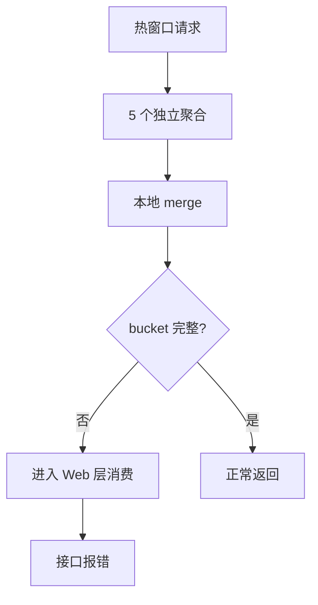

# 段落与载体

## 0x01 段落原则

- 一个段落聚焦一个主题：每段只有一个中心句子，单段不超过 `3` 句或 `4` 行。
- 章节内先写总思路与关键结论：再展开模型、查询、写入、验证、风险等细节。
- 引用第三方内容必须注明出处：作者、来源链接或图片来源都要清楚。
- 抽象规则配最小模板或 Good case：示例只用于说明方法，不把单个 case 写成规则本体。
- 依赖隐含上下文才能读懂时补充最小必要上下文：不追加零散解释。

## 0x02 载体选择

先判断信息关系再选择载体：不要把"可结构化"等同于"必须表格化"。

载体膨胀的常见信号：无序列表超过 `5` 项 / 段落超过 `3` 句 / 表格行列扩张 / 同一词条多处重复。

出现信号时按顺序处理：提炼主题 → 拆成小节或分组 → 为每个分组选载体。

### a. 载体选择规则

| 信息形态            | 载体             | 关键约束                 |
|-----------------|----------------|----------------------|
| 主线 / 判断 / 因果    | 短段落            | 单段不超过 `3` 句          |
| 并列结论 / 约束 / 检查点 | 短列表            | 每项一条信息，超过 `5` 项按主题拆分 |
| 步骤 / 流程         | 有序列表           | 每步一个动作，不用分号串联        |
| 多对象 × 同一组字段对齐   | 表格             | 字段稳定且能减少重复（见 b 反模式）  |
| 因果链 / 时序链 / 状态机 | Mermaid 或文本流程图 | 不用列表硬列步骤             |
| 协议 / 字段契约       | 主表 + 子结构小表     | 见 0x03 协议类文档         |

### b. 表格

1）**【CRITICAL】** 使用脚注、`<br />` 等微观格式承载复杂内容，避免表格过密或过长。

样例：

```markdown
| 规则类型 | 数据特征                                                         | 唯一语义                   | 说明                                                                                      |
|:-----|:-------------------------------------------------------------|:-----------------------|:----------------------------------------------------------------------------------------|
| 全局规则 | `<is_global=true, service_names=[]>`                         | `kind + code`          | 同一 `(kind, code)` 只允许 1 条全局规则                                                           |
| 服务规则 | `<is_global=false, service_names=[svc-a, svc-b, ...]>` *[1]* | `kind + code + remark` | [a] 同一 `(kind, code)` 下可存在多条不同 `remark` 的服务规则 *[2]* <br />[b] 各规则的 `service_names` 不得重叠 |

- *[2] `service_names` 只表达这条规则的作用范围，不参与规则身份判定。*
- *[1] 仅保存用户覆盖项，内置错误码默认备注不落库，由服务视角 `get` 后置补齐。*
```
* 脚注：使用 `*[1]*`、`*[n]*` 带阿拉伯数字的斜体角标承载。
* 换行：使用 `<br />` 承载同一单元格内的多项内容，每行前用 `[a]` `[b]` 这类方括号加字母的标识区分。

2）原则

* 维度值重复：某列反复出现相同值时上提为小节或分组，组内只保留需比较的列。
* 当表格 <= 2 行时，如果能通过短段落或短列表表达清楚就不要建表。


## 0x03 协议类文档

接口、配置、事件、数据结构等协议类内容必须让读者能复原结构。

推荐顺序：

1. 先给最小可用示例，例如 JSON、YAML、请求体或响应体。
2. 再给字段契约表，默认列为 `字段`、`类型`、`必填`、`说明`。
3. 最后补充调用边界、默认值、兼容策略或异常语义。

字段契约规则：

- 字段名表达所属层级：优先用完整路径或能看出父子关系的写法，例如 `<item>.list[].rules[].params`。
- 字段说明只保留影响实现或消费的内容：例如语义、约束、默认值、兼容策略和取值来源。
- 简单字段交给类型、必填和模板承载：不复述字段名本身。
- 主表无法承载层级或说明变长时拆成独立子结构小表。

主表模板：

```md
| 字段 | 类型 | 必填 | 说明 |
| --- | --- | --- | --- |
| `<root>` | `object` | 是 | 协议入口，说明整体语义。 |
| `<root>.<collection>[]` | `array<object>` | 是 | 子项集合，说明组合关系、生效顺序或归属。 |
| `<root>.<collection>[].<field>` | `<type>` | 是 | 影响实现的字段语义、默认值或边界。 |
| `<root>.<collection>[].<extension>` | `object` | 否 | 扩展对象，复杂时拆成子结构小表。 |
```

子结构模板：

主表中的某个字段需要展开子项时，在主表说明中写"见 `<field>` 子结构"，再单独列小表。

```md
`<root>.<collection>[].<extension>` 子结构：

| 字段 | 类型 | 必填 | 说明 |
| --- | --- | --- | --- |
| `<extension>.<child>` | `<type>` | 是 | 子字段语义、约束或默认值。 |
| `<extension>.<child_list>[]` | `array<object>` | 否 | 子项集合，说明生效顺序或归属。 |
```

模板只表达写法，实际文档必须替换为真实字段名。

## 0x04 正反案例

### a. 混合承载优于全文表格化

Bad：

```md
| 模块 | 内容 |
| --- | --- |
| 结论 | 修复不改变统计语义 |
| 根因 | 多次独立聚合返回的分桶不一致 |
| 修复点 | 过滤不完整 bucket |
| 兼容性 | 正常场景结果不变 |
```

Good：

```md
**结论**

- 修复可以解决热窗口尾部的偶现报错。
- 正常场景结果不变。

**根因**

- 多次独立聚合可能拿到不一致的分桶集合。
- 不完整 bucket 会继续被上层消费。

**修复点**

| 改动点 | 处理方式 | 目标 |
| --- | --- | --- |
| 数据源出口过滤不完整 bucket | merge 完成后校验 bucket 完整性 | 阻断异常中间态向上游扩散 |
| URL 归类保护 | `request_count <= 0` 直接跳过 | 避免零分母 |
```

### b. 列表项含多维度时升级为表格

多个对象需要按相同字段横向对齐时，从平铺列表升级为表格。

Bad：

```md
- Trace `aaa` 在 `end_time + 3s` 报 `ZeroDivisionError`
- Trace `bbb` 在 `end_time + 0.2s` 报 `KeyError`
- Trace `ccc` 在 `+20m` 重试后恢复
```

Good：

```md
| 样本 | 触发时机 | 表现 | 归类 |
| --- | --- | --- | --- |
| `aaa` | `end_time + 3s` | `ZeroDivisionError` | 缺 `doc_count` |
| `bbb` | `end_time + 0.2s` | `KeyError` | 缺 `sum_duration` |
| `ccc` | `+20m` | 正常返回 | 数据沉淀后 bucket 完整 |
```

### c. 因果链与流程类用 Mermaid 或文本流程图

步骤间存在因果或状态转移时，用 Mermaid 或文本流程图，不用平铺列表硬列。

Bad：

```md
- 时间窗口很热。
- 有多个聚合请求。
- merge 在本地执行。
- bucket 有时会缺字段。
- Web 层会继续消费。
- 还要考虑 URI 规则和 time_align。
```

Good：

````md

````
