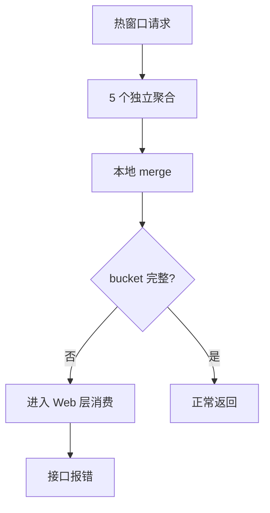

# `PLAN.md` 写作规则

## 0x01 文档职责

- `PLAN.md` 记录调研结论、对比分析、实现路径、验收标准与实施进展。
- `PLAN.md` 不重写 `README.md` 中已经稳定的需求定义主干。
- 记录视角保持为架构师视角，主干应体现当前有效方案，而不是实现流水账。

## 0x02 推荐骨架

方案类文档优先采用“主干结论先行，细化内容下沉”的结构。

| 章节 | 应写内容 |
| --- | --- |
| 场景与约束 / 调研 | 问题背景、约束、关键结论 |
| 方案主干 / 实现方案 | 当前有效设计、职责分层、关键决策 |
| 开发方案 / 文件级变更 | 代码落点、接口改造、迁移步骤、测试点 |
| 验证与回归 | 验证策略、必测点、回归口径 |
| 风险与约束 | 风险分级、兼容边界、未决事项 |
| 实施进展 | 主干更新后的阶段结论与验证结果 |

## 0x03 内容组织

| 主题 | 写法 | 禁忌 |
| --- | --- | --- |
| 主干顺序 | 先写总思路与关键决策，再按模型、查询、写入、下发、风险等子段展开。 | 不要从文件改动或接口清单开始写。 |
| 语义分层 | 把设计语义放在实现方案，把代码落点和步骤放在开发方案。 | 不要把协议语义和代码步骤混在同一段。 |
| 规则密度 | 明确默认值、唯一键、优先级、兼容策略、迁移策略。 | 避免只写“支持”“增强”。 |
| 多文件改造 | 文件数量少且字段固定时用表格，内容膨胀时先按模块或主题分组。 | 不要用长无序列表或大表格堆文件路径。 |
| 复盘材料 | 多样本现象先给归纳结论，再做证据分组。 | 禁止平铺 TraceID、样本 ID 或 case 列表。 |
| 根因链路 | 先收敛为一条主链路，再补关键判断与放大项。 | 不要把 `n` 个事实点平铺成等权列表。 |
| 图文分工 | 样本归类用表格，主链路用图，结论与判断用短列表。 | 不要全文使用单一载体。 |

### a. 现象复盘

优先采用“复盘结论 -> 证据分组 -> 共同判断”的结构。

| 部分 | 承载方式 | 要求 |
| --- | --- | --- |
| 复盘结论 | 短列表 | 先说明多样本背后的共同现象。 |
| 证据分组 | 表格 | 按类型、表现、归类承载代表样本。 |
| 共同判断 | 短列表 | 写跨样本的共同原因或边界。 |

### b. 根因链路

根因链路超过 `3` 步，或同时存在触发背景与放大项时，优先补一张竖版 Mermaid 主链路图。

| 图节点规则 | 要求 |
| --- | --- |
| 表达颗粒度 | 节点保持短语级表达。 |
| 信息单元 | 每个节点只表达一个状态或动作。 |
| 文字长度 | 不要把整句解释塞进图节点。 |

## 0x04 实施进展

- 进展必须表格化，建议表头为 `时间`、`对应设计片段`、`结论调整概要`、`改动 / 验证`。
- 同一天持续打磨同一方案且未形成新阶段结论时，合并为一条进展，只保留当天最终有效结论。
- 若新进展改变原方案结论，先更新方案主干，再更新进展表。
- 每次写回后同步文档已有的更新时间字段，不主动创建元数据结构。

## 0x05 额外校准

润色阶段按需回读 [exemplars.md](exemplars.md) 中的评测基线。

| 检查点 | 判定方式 | 修正方向 |
| --- | --- | --- |
| 主干可读 | 只读 `0x01` / `0x02` 仍能看出当前方案。 | 若看不出方案，补总思路与关键决策。 |
| 现象复盘 | 肉眼能快速归类样本。 | 若仍在平铺样本，先补归纳结论与证据分组。 |
| 根因链路 | 读者不需要手动拼主线。 | 若仍在平铺事实点，压缩成主链路、关键判断与放大项。 |
| 图文分工 | 因果链、样本归类、判断各有合适载体。 | 因果链和样本归类不要都写成纯文字，也不要都压成表格。 |
| 膨胀分层 | 任一小节内容膨胀时，先拆主题，再选择段落、列表、表格或图。 | 不要让段落、列表或表格无限堆叠。 |

## 0x06 正反案例

以下案例提炼自优秀 `PLAN.md` 的稳定模式。

### a. 先给总线，再拆子线

Bad：

```md
实现方案：

- 改关系表。
- 改配置表。
- 改查询接口。
- 改写入接口。
```

Good：

```md
本期方案拆成两条线：

- **关系表配置**：把多类能力收敛到统一关系模型。
- **应用级配置**：继续走应用级配置协议，不进入关系表。

关键结论：

- **维度保留**：关键字段继续作为调用视角维度。
- **优先级固定**：最终展示顺序按既定层级合并。
```

### b. 协议语义与开发落点分层

Bad：

```md
实现方案：

- `ListResource` 支持 `service_name` 可选。
- `sync_relations` 改成 diff-sync。
- 全局规则下发 `source="*"`.
```

Good：

```md
## 0x01 实现方案

### d. 查询机制

| 场景 | 请求特征 | 返回语义 |
| --- | --- | --- |
| 服务视角 | 传 `service_name` | 返回最终生效结果 |
| 应用视角 | 不传 `service_name` | 返回配置本身 |

## 0x02 开发方案

| 文件 | 场景 | 变更点 | 说明 |
| --- | --- | --- | --- |
| `service/resources.py` | 查询 | `ListResource` | 支持新入口 |
| `models/service.py` | 写入 | `sync_relations` | 收敛为 diff-sync |
```

### c. 进展只写阶段结论

Bad：

```md
| 时间 | 结论调整概要 |
| --- | --- |
| `2026-04-16 10:00` | 改表格 |
| `2026-04-16 11:00` | 再改表格 |
| `2026-04-16 14:00` | 继续改表格 |
```

Good：

```md
| 时间 | 对应设计片段 | 结论调整概要 | 改动 / 验证 |
| --- | --- | --- | --- |
| `2026-04-16 14:00` | `0x01.d` | [1] 收敛当天最终协议 | [1] 已更新主干 |
```

### d. 现象复盘先归类，再落样本

Bad：

```md
## 0x01 现象复盘

- Trace `aaa` 在 `end_time + 3s` 报 `ZeroDivisionError`
- Trace `bbb` 在 `end_time + 0.2s` 报 `KeyError`
- Trace `ccc` 在 `+20m` 重试后恢复
```

Good：

```md
## 0x01 现象复盘

### a. 复盘结论

- 这不是多个独立问题，而是同一接口在热窗口尾部消费不完整 bucket 的两类外显。

### b. 证据分组

| 分组 | 代表样本 | 直接表现 | 归类 |
| --- | --- | --- | --- |
| A 类 | `aaa` | `ZeroDivisionError` | 缺 `doc_count` |
| B 类 | `bbb` | `KeyError` | 缺 `sum_duration` |
| 对照组 | `ccc` | 正常返回 | 数据沉淀后 bucket 完整 |

### c. 共同判断

- 两类报错共享同一根因。
- 触发前提是请求打在热窗口尾部。
```

### e. 根因链路先收主线，再补判断

Bad：

```md
## 0x02 根因链路

- 时间窗口很热。
- 有多个聚合请求。
- merge 在本地执行。
- bucket 有时会缺字段。
- Web 层会继续消费。
- 还要考虑 URI 规则和 time_align。
```

Good：

````md
## 0x02 根因链路

### a. 主链路



### b. 关键判断

- 主因是独立聚合返回的分桶不一致。
- 接口报错来自 Web 层消费了不完整 bucket。

### c. 放大项

- `time_align(False)` 会放大热窗口尾部抖动。
- URI 规则未收窄会扩大异常 bucket 命中面。
````
