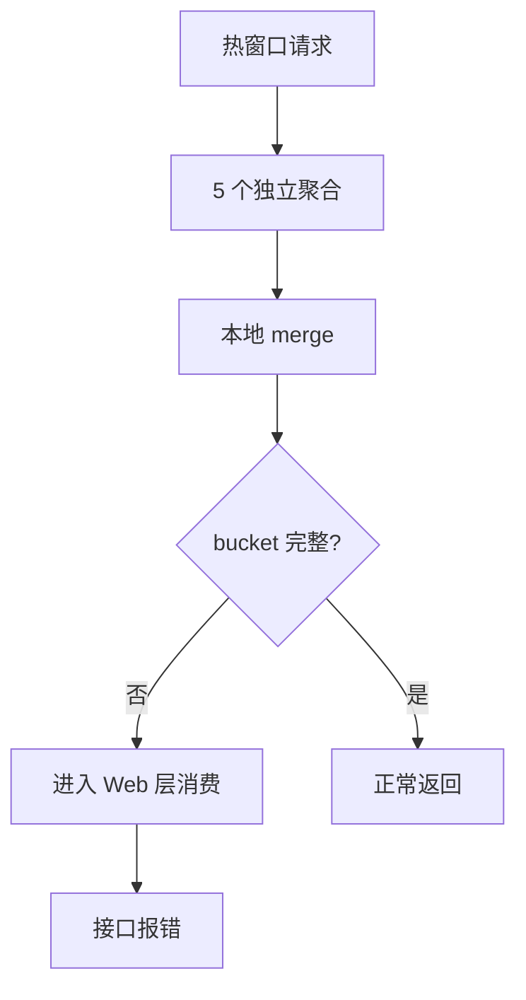

# `PLAN.md` 写作规则

## 0x01 文档职责

- `PLAN.md` 记录调研结论、对比分析、实现路径、验收标准与实施进展。
- `PLAN.md` 不重写 `README.md` 中已经稳定的需求定义主干。
- 记录视角保持为架构师视角，主干应体现当前有效方案，而不是实现流水账。

**【CRITICAL（必须执行，不可协商）】**

`PLAN.md` 必须让研发读者先理解架构方案，再进入开发落点。

读完方案主干后，读者应能回答：

- 当前结构如何分层。
- 核心对象如何关联。
- 关键边界和不变量是什么。

若读者只能看到文件改动、类名清单、PR diff 摘要或测试结果，而需要自行拼出架构关系，则文档不合格。

读完开发落点后，读者应能回答从哪些模块或入口开始开发。

## 0x02 推荐骨架

| 章节 | 应写内容 |
| --- | --- |
| 场景与约束 / 调研 | 问题背景、约束、关键结论 |
| 方案主干 / 实现方案 | 当前有效设计、职责分层、关键决策 |
| 开发方案 / 文件级变更 | 代码落点、接口改造、迁移步骤、测试点 |
| 验证与回归 | 验证策略、必测点、回归口径 |
| 风险与约束 | 风险分级、兼容边界、未决事项 |
| 实施进展 | 主干更新后的阶段结论与验证结果 |

## 0x03 内容组织

### a. 架构解释硬约束

**【CRITICAL（必须执行，不可协商）】方案主干不得写成代码审计清单。**

方案主干必须先解释结构，再列开发落点。

禁止把以下内容作为主干：

- 逐文件变更清单。
- PR diff 摘要。
- review finding 汇总。
- CI 与测试结果堆叠。
- 类名、函数名和配置项的等权罗列。

**【CRITICAL（必须执行，不可协商）】复杂结构必须提供可复原的结构表达。**

涉及继承链、数据流、协议流、状态机、注册表、工厂或多层职责分离时，至少使用一种结构载体：

- Mermaid 图。
- 文本拓扑图。
- 最小结构代码。

Before / After 只能作为辅助载体，用于解释结构收益，不能替代可复原结构。

在方案主干中，类名和文件名可以出现，但只能作为架构锚点。

如果一段内容连续列出多个文件或类，却没有说明关系、方向、边界或不变量，必须重写。

**【CRITICAL（必须执行，不可协商）】结论与验收必须职责分离。**

方案结论回答“采用什么结构和为什么”。

验收口径回答“如何证明结构成立”。

不要在结论章节重复验收清单，也不要在验收章节重讲方案价值。

### b. Plan 专项内容组织

方案主干：

- 把设计语义放在实现方案，把代码落点和步骤放在开发方案。
- 明确默认值、唯一键、优先级、兼容策略、迁移策略。
- 重构类 PLAN 优先补 `Before / After`，让读者先看到结构收益。

开发落点：

- 文件级变更只回答“入口与责任”，不承载完整代码审计。
- 需要文件表时，列 `文件 / 场景 / 入口 / 责任 / 测试点` 这类稳定字段。

复盘材料：

- 多样本现象先给归纳结论，再做证据分组。
- 根因链路先收敛为一条主链路，再补关键判断与放大项。
- 样本归类用表格，主链路用图，结论与判断用短列表。

禁忌：

- 不要从文件改动或接口清单开始写。
- 不要把协议语义和代码步骤混在同一段。
- 不要把 PR 状态、commit、diff stat 写成方案主干。
- 不要让源码锚点替代结构解释。

### c. 现象复盘

优先采用“复盘结论 -> 证据分组 -> 共同判断”的结构。

| 部分 | 承载方式 | 要求 |
| --- | --- | --- |
| 复盘结论 | 短列表 | 先说明多样本背后的共同现象。 |
| 证据分组 | 表格 | 按类型、表现、归类承载代表样本。 |
| 共同判断 | 短列表 | 写跨样本的共同原因或边界。 |

### d. 根因链路

根因链路超过 `3` 步，或同时存在触发背景与放大项时，优先补一张竖版 Mermaid 主链路图。

| 图节点规则 | 要求 |
| --- | --- |
| 表达颗粒度 | 节点保持短语级表达。 |
| 信息单元 | 每个节点只表达一个状态或动作。 |
| 文字长度 | 不要把整句解释塞进图节点。 |

## 0x04 实施进展

- 进展固定使用表格，建议表头为 `时间`、`对应设计片段`、`结论调整概要`、`改动 / 验证`。
- 同一天持续打磨同一方案且未形成新阶段结论时，合并为一条进展，只保留当天最终有效结论。
- 若新进展改变原方案结论，先更新方案主干，再更新进展表。
- 每次写回后同步文档已有的更新时间字段，不主动创建元数据结构。

## 0x05 质量基线与自检

`PLAN.md` 写作、润色或评测时，直接使用本节作为质量基线。

不要把知识库里的具体样板正文当成写作模板或内容来源。

### a. 基线特征

| 维度 | 好文档应体现的特征 |
| --- | --- |
| 主干表达 | 只读方案主干即可判断当前有效方案、关键决策和架构边界。 |
| 结构分层 | 实现方案、开发方案、验证与风险分层清晰，且不把不同职责混在同一段。 |
| 规则表达 | 默认值、唯一键、优先级、兼容策略、迁移策略写得可判定。 |
| 进展记录 | 进展表只记录阶段性结论和验证结果，不重抄方案正文。 |

使用方式：

- 不要求逐字贴近任何历史样板。
- 正常写作时，把这些特征当成自检口径，而不是外部引用源。
- 评测时，用这些特征判断输出是否达到“主干清晰、结构稳定、可扫描、可验证”。
- 若当前文档已经更清晰、更短、更可验证，不必为了追求“样板感”而加长篇幅。

### b. 自检口径

| 检查点 | 判定方式 | 修正方向 |
| --- | --- | --- |
| 主干可读 | 只读 `0x01` / `0x02` 仍能看出当前方案。 | 若看不出方案，补总思路与关键决策。 |
| 开发落点 | 文件或类名是否只承担入口和责任说明。 | 若文件清单替代方案解释，回到方案主干补结构关系。 |
| 验收分离 | 验收是否回答“如何证明结构成立”。 | 若验收重讲方案价值，改为不变量、验证方式和回归口径。 |
| 进展记录 | 进展是否只写阶段性结论和验证结果。 | 若进展复述方案正文，合并为当天最终有效结论。 |
| 样板依赖 | 文档是否为了像样板而拉长。 | 若当前版本已更清晰、更短、更可验证，不再补装饰性章节。 |

## 0x06 正反案例

以下案例提炼自优秀 `PLAN.md` 的稳定模式。

### a. 协议语义与开发落点分层

Bad：

```md
实现方案：

- `ListResource` 支持 `service_name` 可选。
- `sync_relations` 改成 diff-sync。
- 全局规则下发 `source="*"`.
```

Good：

```md
## 0x01 实现方案

### d. 查询机制

| 场景 | 请求特征 | 返回语义 |
| --- | --- | --- |
| 服务视角 | 传 `service_name` | 返回最终生效结果 |
| 应用视角 | 不传 `service_name` | 返回配置本身 |

## 0x02 开发方案

| 文件 | 场景 | 变更点 | 说明 |
| --- | --- | --- | --- |
| `service/resources.py` | 查询 | `ListResource` | 支持新入口 |
| `models/service.py` | 写入 | `sync_relations` | 收敛为 diff-sync |
```

### b. 进展只写阶段结论

Bad：

```md
| 时间 | 结论调整概要 |
| --- | --- |
| `2026-04-16 10:00` | 改表格 |
| `2026-04-16 11:00` | 再改表格 |
| `2026-04-16 14:00` | 继续改表格 |
```

Good：

```md
| 时间 | 对应设计片段 | 结论调整概要 | 改动 / 验证 |
| --- | --- | --- | --- |
| `2026-04-16 14:00` | `0x01.d` | [1] 收敛当天最终协议 | [1] 已更新主干 |
```

### c. 现象复盘先归类，再落样本

Bad：

```md
## 0x01 现象复盘

- Trace `aaa` 在 `end_time + 3s` 报 `ZeroDivisionError`
- Trace `bbb` 在 `end_time + 0.2s` 报 `KeyError`
- Trace `ccc` 在 `+20m` 重试后恢复
```

Good：

```md
## 0x01 现象复盘

### a. 复盘结论

- 这不是多个独立问题，而是同一接口在热窗口尾部消费不完整 bucket 的两类外显。

### b. 证据分组

| 分组 | 代表样本 | 直接表现 | 归类 |
| --- | --- | --- | --- |
| A 类 | `aaa` | `ZeroDivisionError` | 缺 `doc_count` |
| B 类 | `bbb` | `KeyError` | 缺 `sum_duration` |
| 对照组 | `ccc` | 正常返回 | 数据沉淀后 bucket 完整 |

### c. 共同判断

- 两类报错共享同一根因。
- 触发前提是请求打在热窗口尾部。
```

### d. 根因链路先收主线，再补判断

Bad：

```md
## 0x02 根因链路

- 时间窗口很热。
- 有多个聚合请求。
- merge 在本地执行。
- bucket 有时会缺字段。
- Web 层会继续消费。
- 还要考虑 URI 规则和 time_align。
```

Good：

````md
## 0x02 根因链路

### a. 主链路


```mermaid
flowchart TD
    A["热窗口请求"] --> B["5 个独立聚合"]
    B --> C["本地 merge"]
    C --> D{"bucket 完整?"}
    D -- "否" --> E["进入 Web 层消费"]
    E --> F["接口报错"]
    D -- "是" --> G["正常返回"]
```

### b. 关键判断

- 主因是独立聚合返回的分桶不一致。
- 接口报错来自 Web 层消费了不完整 bucket。

### c. 放大项

- `time_align(False)` 会放大热窗口尾部抖动。
- URI 规则未收窄会扩大异常 bucket 命中面。
````
