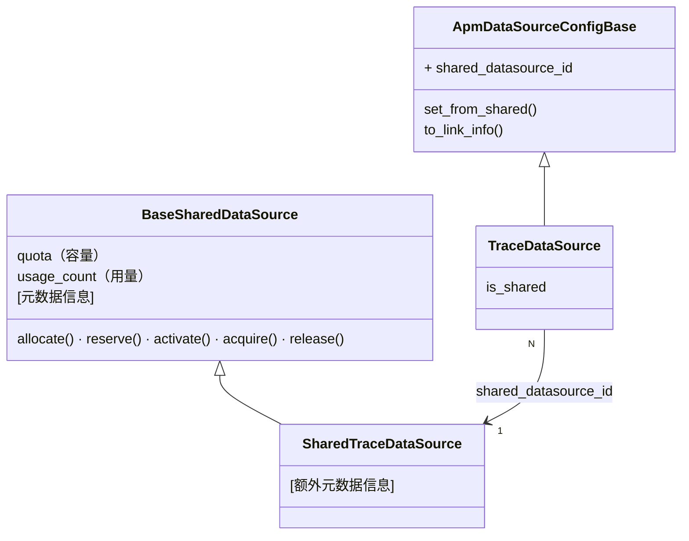
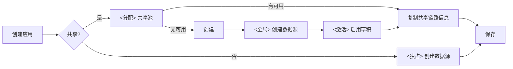
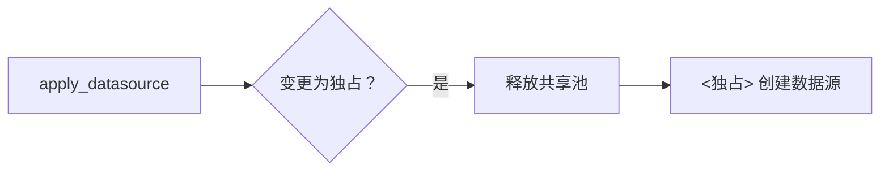
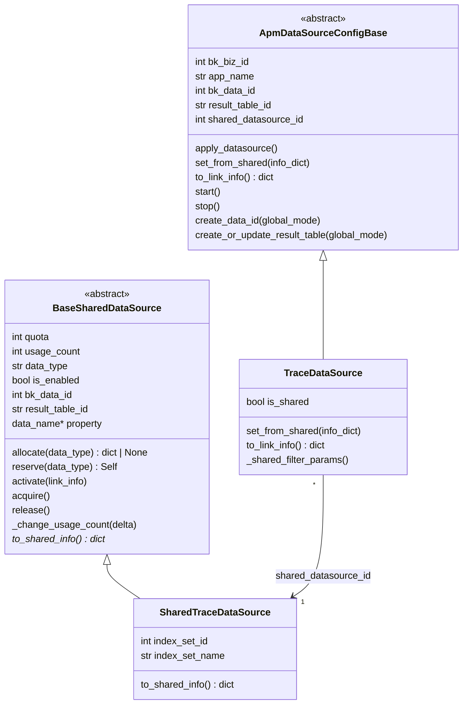
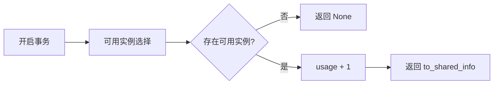
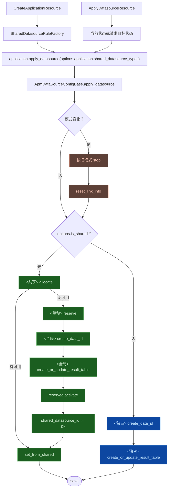

# 方案样例

## 0x00 目录

- [0x01 架构设计](#0x01-架构设计)
- [0x02 开发方案](#0x02-开发方案)


## 0x01 架构设计

### a. 思路

**1）数据源复用**

现状：应用 <> 数据源 = 1 : 1，应用独占 RT → ES 索引线性膨胀。

改造核心：应用 <> 数据源 = N : 1，多应用复用结果表 → 链路资源（例如索引、DataID）收敛。

**2）数据隔离**：补充 `bk_biz_id` 、`app_name`  到原始数据，并在路由、逻辑层分别进行业务、应用级别查询隔离。

### b. 模型设计

两条独立继承链：**共享数据源池**管理容量与元数据，**应用数据源**通过 `shared_datasource_id` 引用共享池。



* 链路信息复用：多应用复用同一共享数据源（N:1）
* 容量控制：通过容量（quota）与用量（usage_count）控制共享池的分配与回收。

**关键决策**：

- **职责分离**：SharedDataSource 仅负责池管理（容量 + 元数据），外部链路资源创建与回填由 `ApmDataSourceConfigBase` 负责。
- **创建口径分层**：共享模式下，`create_data_id` 与 `create_or_update_result_table` 区分独占、全局模型。
- **关联与扩展**：应用数据源通过 `shared_datasource_id` 引用共享池，共享池类型通过 `SHARED_DS_REGISTRY` 按 `data_type` 扩展。
- **草稿激活模型**：共享源先 reserve 为草稿，外部资源创建成功后再 activate，allocate 仅面向已启用实例。

### c. 共享机制

**创建应用**：

数据源配置增加「是否共享数据源」参数，目前「空间类型」为 `bkapp` 的，默认设置为共享。



**迁出**：从共享模式切换为独占模式。



### d. 命名规则


| 项                                       | 独占模式                                 | 共享模式                                                 |
|-----------------------------------------|--------------------------------------|------------------------------------------------------|
| **create_data_id.bk_biz_id**            | 实际业务 ID                              | 环境变量 `SHARED_DATASOURCE_PRIVILEGED_BK_BIZ_ID`，默认 `2` |
| **create_result_table.bk_biz_id**       | 实际业务 ID                              | `GLOBAL_CONFIG_BK_BIZ_ID`，固定 `0`                     |
| **create_result_table.bk_biz_id_alias** | 不涉及                                  | `"bk_biz_id"` *[2]*                                  |
| **data_name**                           | `{bk_biz_id}_bkapm_trace_{app_name}` | `bkapm_shared_trace_{seq:04d}`                       |
| **result_table_id**                     | `{bk_biz_id}_bkapm.trace_{app_name}` | `apm_global.shared_trace_{seq:04d}`                  |

* *[1] `seq`：共享数据源表主键（AUTO_INCREMENT）、编号在每个子类内独立递增。*
* *[2] 路由隔离：将 `bk_biz_id_alias` 配置为 `"bk_biz_id"`，以便增加业务查询隔离，在路由层兜底查询权限。*

### e. 数据链路

**写入**：bk-collector 从 Token 反解 `bk_biz_id` 、 `app_name`，注入到原始数据。

**查询**：

* 逻辑层（应用级别隔离）：所有查询路径统一追加 `bk_biz_id`、`app_name` 过滤条件。
* 路由层（业务级别隔离）：支持以 `bk_biz_id` 作为 filter 查询业务 0 的全局结果表。


## 0x02 开发方案

### a. 共享数据源模型

#### 模型概览


* 新增模型到 `apm/models/shared_datasource.py`
* 共享数据源池（BaseSharedDataSource）负责管理容量与元数据。
* 应用数据源（ApmDataSourceConfigBase）通过 `shared_datasource_id` 引用共享池。


#### 核心流程

**容量控制**：

* `_change_usage_count(delta) -> bool`：内部方法，调整 `usage_count`。
  * delta > 0：使用乐观锁 `usage_count__lt=F("quota"), usage_count=self.usage_count`，进行快照校验，成功则更新 `usage_count`，失败则返回 False。
  * delta < 0：使用 `Greatest(F("usage_count") + delta, 0)` 避免负数，并发安全地更新 `usage_count`。
* `acquire()`：容量增加，调用 `_change_usage_count(1)`，具备有限重试机制。
* `release()`：容量释放，调用 `_change_usage_count(-1)`。

**allocate**：选取可用共享源并占用，无可用时返回 None。



💡 Tips：

* 并发保护：`select_for_update()`。
* 可用实例选择：`filter(usage_count__lt=F('quota'), is_enabled=True)`。
* 负载均衡：`order_by('usage_count')`。

**reserve**：创建草稿实例（`is_enabled=False`），pk 即 seq，用于推导 `data_name` / `result_table_id`。


💡 Tips：DB 默认值使用草稿状态：`is_enabled=False, usage_count=0`

**activate**：外部 API 调用成功后，填充链路元数据并启用。


💡 Tips：

* 设置链路信息：从 `link_info` dict 填充 `bk_data_id`、`result_table_id` 及子类扩展字段。
* 启用：`usage_count=1, is_enabled=True`。

#### SharedTraceDataSource

继承 BaseSharedDataSource，新增以下扩展字段：

| 字段             | 类型           | 说明                                |
|----------------|--------------|-----------------------------------|
| index_set_id   | IntegerField | 索引集 ID（可选）                        |
| index_set_name | CharField    | 索引集名称（可选）                         |
| to_shared_info | Method       | 在基类字段上追加 Trace 特有元数据。 *[1]* *[2]* |

* *[1] `to_shared_info` 将作为 `TraceDataSource.set_from_shared()` 的数据来源。*
* *[2] 维持与 `to_link_info()` 同构字段集（`bk_data_id`、`result_table_id` 与 `index_set_id`），确保共享池信息能无缝转换为链路信息。*

#### 注册表

data_type → SharedDataSource 子类映射，供 apply_datasource 按类型查找并调用 allocate/reserve：

```python
SHARED_DS_REGISTRY = {
    "trace": SharedTraceDataSource,
    # "log": SharedLogDataSource,  # future
}
```

### b. ApmDataSourceConfigBase

`apm/models/datasource.py`

| 变更点                                                | 目标                                                                                                                           |
|----------------------------------------------------|------------------------------------------------------------------------------------------------------------------------------|
| **[Field]** `shared_datasource_id`                 | 新增字段。                                                                                                                        |
| **[Method]** `apply_datasource`                    | 增加共享数据源处理逻辑，并在进入共享 / 独占分支前收口迁入、迁出判断。                                                                                         |
| **[Method]** `create_data_id` *[2]*                | 增加 `global_mode` *[1]*  、`data_name[可选]` 参数。                                                                                 |
| **[Method]** `create_or_update_result_table` *[3]* | 增加 `global_mode`、`result_table_id[可选]` 参数。                                                                                   |
| **[Method]** `to_link_info`                        | 导出链路元数据字典（bk_data_id、result_table_id 等），子类覆写追加特有字段。                                                                          |
| **[Method]**  `set_from_shared`                    | 由子类覆写，从共享链路信息字典提取各自字段并赋值。                                                                                                    |
| **[Method]** `reset_link_info`                     | 重置当前数据源链路信息为未创建状态，用于迁入 / 迁出后复用原有创建流程。                                                                                        |
| **[Method]** `is_shared`                           | 是否共享，通过 `shared_datasource_id` 判断。                                                                                           |
| **[Method]** `start / stop`                        | [a] 共享模式下不执行结果表启停，但每次应用启停需调整共享池占用计数。<br />[b] 应用层需保证 `start_trace()` / `stop_trace()` 幂等，避免重复占用或重复释放。<br />[c] 独占模式保持原有启停行为。 |

* *[1] 共享场景：global_mode = true。*
* *[2] 共享 DataID 单一业务空间管理：业务 ID（bk_biz_id）从环境变量（`SHARED_DATASOURCE_PRIVILEGED_BK_BIZ_ID`, default=2）获取。*
* *[3] 共享结果表注册为全局，并增加业务查询隔离：bk_biz_id = `GLOBAL_CONFIG_BK_BIZ_ID(0)`， bk_biz_id_alias="bk_biz_id"。*

**apply_datasource 共享数据源处理流程**（创建与更新最终汇总到 `application.apply_datasource`）：

两个入口都会生成 `shared_datasource_types`，并写入 `options.application.shared_datasource_types`。

| 入口                          | 入参状态                         | 取值来源                                                            | 语义                                                                                                                                                                             |
|-----------------------------|------------------------------|-----------------------------------------------------------------|--------------------------------------------------------------------------------------------------------------------------------------------------------------------------------|
| `CreateApplicationResource` | 不传 `shared_datasource_types` | `SharedDatasourceRuleFactory.list_shared_datasource_types(...)` | [a] 计算本次创建需要共享的数据源类型。<br />[b] 创建阶段仅生成初始目标状态，不产生迁移语义。                                                                                                                          |
| `ApplyDatasourceResource`   | 不传 `shared_datasource_types` | 查询各数据源配置的 `is_shared` 状态后构造                                     | [a] 以数据库当前状态作为本次 apply 的目标状态。<br />[b] 当前状态与目标状态一致，不触发迁入 / 迁出。                                                                                                                 |
| `ApplyDatasourceResource`   | 传入 `shared_datasource_types` | 请求体 `shared_datasource_types`                                   | [a] 请求值作为本次 apply 的目标状态。<br />[b] `["trace"] -> []` 表示 Trace 从共享迁出。<br />[c] `[] -> ["trace"]` 表示 Trace 从独占迁入共享。<br />[d] `[] -> []` 或 `["trace"] -> ["trace"]` 表示状态未变化，不触发迁移。 |



图中「模式变化」等价于 `ds.is_shared != options.is_shared`。

- `ds.is_shared`：数据库中当前数据源状态。
- `options.is_shared`：本次 apply 的目标状态。

迁移状态判断只需放在 `apply_datasource` 获取 / 创建 `obj` 后、进入现有共享 / 独占分支前：

```python
if obj.is_shared != options.get("is_shared", False):
    obj.stop(bk_biz_id, app_name)
    obj.reset_link_info()
```

随后沿用既有分支，不需要为迁入 / 迁出拆出第二套创建流程：

| 状态变化           | 语义       | 前置动作                                     | 后续动作                                                |
|----------------|----------|------------------------------------------|-----------------------------------------------------|
| `True → False` | 迁出：共享改独占 | 走 `stop()` 释放共享源占用，再 `reset_link_info()` | `is_shared=False`，进入 `_apply_exclusive_datasource`。 |
| `False → True` | 迁入：独占改共享 | 走 `stop()` 停用独占资源，再 `reset_link_info()`  | `is_shared=True`，进入 `_apply_shared_datasource`。     |
| 未变化            | 保持现状     | 不执行迁移清理                                  | 按目标状态进入原有共享或独占分支。                                   |

**补充约束**：

- `API 失败回滚`：`create_data_id` 或 `create_or_update_result_table` 抛异常时，删除草稿（`reserved.delete()`）并向上传播。
- `Trace 索引集边界`：共享 Trace 的 `stop()` 不删除日志索引集，独占 Trace 保留现有删除逻辑。
