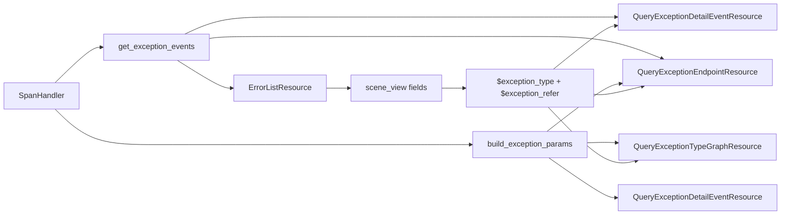

# 方案写作规则

## 0x00 目录

- [0x01 文档职责](#0x01-文档职责)
- [0x02 推荐骨架](#0x02-推荐骨架)
- [0x03 架构设计](#0x03-架构设计)
- [0x04 开发方案](#0x04-开发方案)
- [0x05 验收与验证](#0x05-验收与验证)
- [0x06 实施进展](#0x06-实施进展)
- [0x07 参考 & 版本锚点](#0x07-参考--版本锚点)
- [0x08 自检](#0x08-自检)

## 0x01 文档职责

### a. 边界

* 核心内容：沉淀架构设计、开发方案、验收标准与实施进展。
* 约束结构：说明代码应按什么边界、入口和差异表达方式组织，提前排除冗余实现形态。
* 以终为始：以最终交付的架构设计、开发方案为核心，其他内容都围绕它们展开，禁止为了写而写、为了像样板而写。
* 架构师视角：注重架构设计、协议与开发方案的准确、直击本质表达，禁止实现流水账式的过程记录，禁止直接堆叠细节性的代码变更。
* 始终保持简洁、高信息密度、逻辑清晰，禁止冗长、啰嗦、结构混乱的表达方式。

### b. 保持实时性

**【CRITICAL（必须执行，不可协商）】** 主动总结、询问是否同步更新方案：
* 什么时候询问：在方案打磨、实施、交付 PR Review 等生命周期的**任何阶段**。
* 什么情况需要询问： 
  * 对话中出现明确的实质变更，例如核心设计调整、关键决策变更、重要边界调整、验证结论变更等。
  * 重点确认是否将本轮有效结论写回受影响的架构设计片段，并补充实施进展表。
* 什么情况下无需询问：
  * 文档格式类调整：单纯的表述调整、细节补充、语法润色等不涉及方案核心内容的变更。
  * 结论未成形：方案核心内容还在反复讨论、尚未形成阶段性结论时，可以先不更新方案，等结论稳定后再更新。

**【CRITICAL（必须执行，不可协商）】** 更新原则：
* 历史版本不保留：方案更新**必须覆盖**原有内容，正文不保留历史版本或变更痕迹，除非明确需要进行多个方案对比。
* 保持方案连贯、整体性：更新后的方案必须是一个完整、连贯的整体，不能只更新部分章节导致方案前后矛盾或信息不完整。
* 明确禁止的反模式
  * 禁止在方案中保留多个版本的设计或决策记录（例如**本轮做了/新增**等会话级别关键字），导致方案信息冗余、前后矛盾。
  * 禁止使用追加的方式更新方案，例如在原有内容后面追加新的设计或决策，而不删除或覆盖原有内容，导致方案信息混乱。


## 0x02 推荐骨架

| 章节         | 应写内容                    |
|------------|-------------------------|
| 调研与约束      | 问题背景、约束、关键结论            |
| 架构设计       | 当前有效设计、职责分层、关键决策、风险与不变量 |
| 开发方案 *[1]* | 代码落点、接口改造、迁移步骤、实现结构约束   |
| 验收与验证      | 验证策略、必测点、回归口径           |
| 实施进展       | 架构设计更新后的阶段结论与验证结果       |

* *[1] 单章篇幅过长时按主题拆分章节：以 `0x03 ~ 0x05 开发方案 —— xxx（改造主题）` 形式分配子章节编号。*


## 0x03 架构设计

### a. 思考链

1）回归项目逻辑，禁止凭空想象架构设计：阅读相关代码、知识对象，确认需求范围内核心对象模型、术语、架构关系、协议关系和核心工作流。

2）架构命题：
* 用一句话给出本方案的结构判断。
* 它必须说明系统如何重新组织，而不是说明要改哪些功能。
* 若这句话只能写成“新增 X”“支持 Y”“改造 Z”，说明方案还没有进入架构层。

3）**【CRITICAL（必须执行，不可协商）】** 找到复杂度来源，确认核心收敛点：
* 收敛点形态：它可能是一个对象模型、一个协议关系、一个核心工作流或它们的组合。
* 明确混乱来源：不停留表象，寻找核心矛盾（语义混用 / 边界泄漏 / 规则重复 / 职责错位 / 生命周期不清等）。
* 一句话说明收敛点：当前差异从哪里来，应由哪个对象或协议承载，最终在哪个稳定入口收敛，复杂度来源必须能解释为什么局部补丁不够。
* 注重回归：若说不清差异归属，就没有进入架构设计，需要回到第一步，继续阅读代码和相关知识对象，直到找到核心收敛点。

4）围绕核心收敛点的调研能力：
* 项目调研：当前项目是否已具备或正在具备核心收敛点所需的对象模型、协议关系或核心工作流。
* 必要时进行业界调研：
  * 是否有业界通用的设计模式、开源项目或最佳实践能提供参考，是否有前车之鉴的失败案例需要规避。
  * 禁止凭空假象，需要回归代码、文档、社区资源进行调研，找到具体的模式、项目或案例进行分析。

5）围绕核心收敛点展开架构设计，输出核心架构图：
* 写清核心对象、组件、继承链、引用关系、数量关系和职责边界。
* 使用 Mermaid、文本拓扑、结构表或最小协议示例让结构「数据流 / 协议流 / 状态机 / 继承链 / 注册表 / 工厂 / 多层职责分离等」可复原。
* 类名、函数名、文件名只能作为架构锚点，不能替代结构说明。

6）围绕核心架构图分主题明确核心协议：
* 禁止强行套用 「关键决策 / 不变量 / 边界」。
* 按真实设计拆分主题，进一步明确协议：例如模型设计、查询机制、写入机制、生命周期、路由机制、配置下发、隔离策略、兼容策略等。
* 关键协议注重结构化表达，例如字段契约表、协议流程图、状态转移图、协议关系图等，避免只用文本描述。

7）正直与诚实：
* 信息回归：架构设计必须基于真实的代码和业务逻辑，禁止凭空想象，遗忘时回到代码里继续阅读。
* 及时提问：遇到不明确边界时，给出可选方案及其利弊，及时提问确认。

### b. 原则

1）单章节信息自闭环：

* **【CRITICAL（必须执行，不可协商）】** 不需要额外的代码或开发方案作为补充，便可明确、奠定整个方案的核心架构、协议关系、核心工作流和关键边界。
* 汇报友好型：注重概念抽象和关系说明，而不是代码细节的罗列，注重核心对象、字段的术语提炼，读者不需要回到代码里才能理解架构设计。
  * Bad：定义 quota、usage_count，使用 shared_datasource_id。
  * Good：通过容量（quota）与用量（usage_count）控制共享池的分配与回收，通过共享数据源 ID（shared_datasource_id）引用共享池。

2）架构设计与开发方案信息分离：

* 专注核心架构、协议关系、核心工作流和关键边界的设计与说明。
* 禁止涉及过于具体开发落点、接口改造、迁移步骤或实现结构约束。

 **【CRITICAL（必须执行，不可协商）】** 如何区分架构设计与开发方案：

#### 架构设计

关注核心收敛点的设计与说明，注重关键、必要的协议，确保对开发方案由设计指导：



1）`SpanHandler` 统一声明条件参数构造函数：

```text
build_exception_params(
    exception_type: str, exception_refer: str | None, operator_key: str = "op",
) -> list[dict[str, Any]]
```

2）`exception_type` 过滤机制

`QueryExceptionDetailEventResource` & `QueryExceptionEndpointResource`：
* 使用 `build_exception_params` 进行前置过滤。 
* 由于同一 Span 内可能存在多个异常事件，现有的后置事件匹配仍然保留。

* `QueryExceptionTypeGraphResource`：按相同映射构造 UnifyQuery 条件。

#### 开发方案

开发方案更关注代码落点，即架构设计中提及的核心对象、协议的优雅实现指导。

| 变更点                                                                                    | 目标                                        |
|----------------------------------------------------------------------------------------|-------------------------------------------|
| **[Keep]** `process_rpc_span(span)`                                                    | 保留 PR #10784 已合入能力，继续把返回码 Span 补成逻辑异常事件。  |
| **[Add]** `get_exception_events(span)` *[1]*                                           | 返回标准逻辑异常事件，空列表由 resource 保持 `unknown` 兼容。 |
| **[Add]** `build_exception_params(exception_type, exception_refer, operator_key="op")` | 输出查询条件参数，供详情、趋势和调用链 URL 复用。               |

* *[1] 返回标准协议*：`get_exception_events(span)` 返回字段如下：

| 字段                  | 类型       | 来源字段                                                                                                                           | 说明                        |
|---------------------|----------|--------------------------------------------------------------------------------------------------------------------------------|---------------------------|
| `exception_type`    | `string` | [a] tRPC 场景：`attributes.rpc.error_code` > `attributes.trpc.status_code`<br />[b] 标准场景：`events.attributes.exception.type`       | 页面展示、分组和过滤值。              |
| `exception_refer`   | `string` | [a] tRPC 场景：命中字段名 `rpc.error_code` > `trpc.status_code`<br />[b] 标准场景：`events.attributes.exception.type`                       | `exception_type` 的来源字段标识。 |
| `exception_alias`   | `string` | [a] tRPC 场景：逻辑事件 `exception.alias`<br />[b] 标准场景：`exception.alias` > `exception_type`                                          | 详情标题展示值。                  |
| `exception_message` | `string` | [a] tRPC 场景：`attributes.rpc.error_message` > `attributes.trpc.status_msg`<br />[b] 标准场景：`exception.message` > `status.message` | 详情副标题候选。                  |
| `timestamp`         | `number` | [a] tRPC 场景：`span.start_time`<br />[b] 标准场景：`event.timestamp`                                                                  | 详情排序时间。                   |
| `stacktrace`        | `string` | [a] tRPC 场景：空值<br />[b] 标准场景：`exception.stacktrace`                                                                            | 返回码逻辑事件不构造堆栈。             |

条件参数映射：

```text
空 exception_type
  -> []

exception_type = unknown 且 exception_refer 为空
  -> []

exception_refer 为空或 events.attributes.exception.type
  -> events.name = exception
  -> events.attributes.exception.type = $exception_type

exception_refer 不为空
  -> attributes.${exception_refer} = $exception_type
```


### c. Good case

```markdown
## 0x01 架构设计

### a. 思路

**1）数据源复用**

现状：应用 <> 数据源 = 1 : 1，应用独占 RT → ES 索引线性膨胀。

改造核心：应用 <> 数据源 = N : 1，多应用复用结果表 → 链路资源（例如索引、DataID）收敛。

**2）数据隔离**：补充 `bk_biz_id` 、`app_name`  到原始数据，并在路由、逻辑层分别进行业务、应用级别查询隔离。

### b. 模型设计

两条独立继承链：**共享数据源池**管理容量与元数据，**应用数据源**通过 `shared_datasource_id` 引用共享池。

\`\`\`mermaid
classDiagram
    class BaseSharedDataSource {
        quota（容量）
        usage_count（用量）
        [元数据信息]
        allocate() · reserve() · activate() · acquire() · release()
    }
    class SharedTraceDataSource {
    		[额外元数据信息]
    }
    class ApmDataSourceConfigBase {
        + shared_datasource_id
        set_from_shared()
        to_link_info()
    }
    class TraceDataSource {
        is_shared
    }

    BaseSharedDataSource <|-- SharedTraceDataSource
    ApmDataSourceConfigBase <|-- TraceDataSource
    TraceDataSource "N" --> "1" SharedTraceDataSource : shared_datasource_id
\`\`\`

* 链路信息复用：多应用复用同一共享数据源（N:1）
* 容量控制：通过容量（quota）与用量（usage_count）控制共享池的分配与回收。

**关键决策**：

- **职责分离**：SharedDataSource 仅负责池管理（容量 + 元数据），外部链路资源创建与回填由 `ApmDataSourceConfigBase` 负责。
- **创建口径分层**：共享模式下，`create_data_id` 与 `create_or_update_result_table` 区分独占、全局模型。
- **关联与扩展**：应用数据源通过 `shared_datasource_id` 引用共享池，共享池类型通过 `SHARED_DS_REGISTRY` 按 `data_type` 扩展。
- **草稿激活模型**：共享源先 reserve 为草稿，外部资源创建成功后再 activate，allocate 仅面向已启用实例。

### c. 共享机制

**创建应用**：

数据源配置增加「是否共享数据源」参数，目前「空间类型」为 `bkapp` 的，默认设置为共享。

\`\`\`mermaid
flowchart LR
    A[创建应用] --> B{共享?}
    B -->|是| C[<分配> 共享池]
    C -->|有可用| D[复制共享链路信息]
    C -->|无可用| E[创建]
    E --> F[<全局> 创建数据源]
    F --> G[<激活> 启用草稿]
    G --> D
    D --> H[保存]
    B -->|否| I[<独占> 创建数据源]
    I --> H
\`\`\`

**迁出**：从共享模式切换为独占模式。

\`\`\`mermaid
flowchart LR
    A[apply_datasource] --> B{"变更为独占？"}
    B -->|是| C[释放共享池]
    C --> D[<独占> 创建数据源]
\`\`\`

### d. 命名规则


| 项 | 独占模式 | 共享模式                                                 |
| ---- | ---- |------------------------------------------------------|
| **create_data_id.bk_biz_id** | 实际业务 ID | 环境变量 `SHARED_DATASOURCE_PRIVILEGED_BK_BIZ_ID`，默认 `2` |
| **create_result_table.bk_biz_id** | 实际业务 ID | `GLOBAL_CONFIG_BK_BIZ_ID`，固定 `0`                     |
| **create_result_table.bk_biz_id_alias** | 不涉及 | 字符串 `bk_biz_id` *[2]*                                |
| **data_name** | `{bk_biz_id}_bkapm_trace_{app_name}` | `bkapm_shared_trace_{seq:04d}`                       |
| **result_table_id** | `{bk_biz_id}_bkapm.trace_{app_name}` | `apm_global.shared_trace_{seq:04d}`                  |

* *[1] `seq`：共享数据源表主键（AUTO_INCREMENT）、编号在每个子类内独立递增。*
* *[2] 路由隔离：将 `bk_biz_id_alias` 配置为 `"bk_biz_id"`，以便增加业务查询隔离，在路由层兜底查询权限。*

### e. 数据链路

**写入**：bk-collector 从 Token 反解 `bk_biz_id` 、 `app_name`，注入到原始数据。

**查询**：

* 逻辑层（应用级别隔离）：所有查询路径统一追加 `bk_biz_id`、`app_name` 过滤条件。
* 路由层（业务级别隔离）：支持以 `bk_biz_id` 作为 filter 查询业务 0 的全局结果表。

```


## 0x04 开发方案

开发方案承接架构设计，不重复解释设计价值。

它要回答：代码从哪里开始改，协议在哪里声明，上层如何取用，逻辑在哪里收敛，哪些实现方式会破坏架构边界。

### a. 思考链

1）承接「架构设计」结论

* 先说明本节落实的是架构设计中的哪条结构判断。
* 不要重新讲背景，也不要把架构设计复制一遍。

若开发方案无法对应到前文某个架构结论，说明它只是任务清单。

2）确认开发落点

* 按责任主题拆分，不按文件机械分组。
* 每个主题先说清它承担什么责任，再列入口、文件或对象，以文件名作为锚点，而不是把文件名当成方案主体。

3）声明协议骨架

* 涉及接口、字段、配置、类、函数、注册表或数据结构时，先给最小协议骨架。
* 协议骨架只写核心字段、参数和返回值，不写所有细节，禁止直接堆叠代码实现细节。
* **【CRITICAL（必须执行，不可协商）】** 时刻回归代码，确认协议约束要能指导开发者少写错代码，而不是只表达愿望。
* 推荐用 `Add`、`Change`、`Keep`、`Delete` 标记对象去留，并说明目标（不要写成 PR diff，也不要逐行描述实现过程）。

4） 约束实现结构

* 开发方案必须能回答三件事：「在哪声明」「谁来调用」「在哪收敛」。
* 写清上层通过哪个入口拿到这个能力，下层通过哪个协议接收上下文，中间在哪里转换。
* 保持严谨：禁止未仔细阅读代码和分析，想当然说「建议统一输出下面的内部结构」，列举出来的字段或接口不在代码里，或者说了个接口名但没说明它在哪个类、文件或模块里。

5）处理兼容与迁移：如果涉及旧协议、旧数据、旧入口或灰度路径，写清兼容策略、迁移方式和废弃边界。

### b. 原则

1）**【CRITICAL（必须执行，不可协商）】** 架构师哲学：
* 开发方案是通过优雅的结构设计、协议设计和边界约束来指导开发者写出正确的代码，
* 禁止堆砌完整的代码实现细节或者通过罗列代码细节来指导开发者。

2）保持清醒，审视架构合理性：
* 禁止同一职责出现多组并列处理逻辑或辅助函数。
* 禁止盲从架构设计，发现方案走不通时，及时回到架构设计，重新审视架构设计的合理性，必要时调整架构设计。


### c. Good case

```markdown
## 0x02 开发方案

### a. 共享数据源模型

#### 模型概览

\`\`\`mermaid
classDiagram
    class BaseSharedDataSource {
        <<abstract>>
        int quota
        int usage_count
        str data_type
        bool is_enabled
        int bk_data_id
        str result_table_id
        allocate(data_type) dict | None
        reserve(data_type) Self
        activate(link_info)
        acquire()
        release()
        _change_usage_count(delta)
        to_shared_info() dict*
        data_name* property
    }
    class SharedTraceDataSource {
        int index_set_id
        str index_set_name
        to_shared_info() dict
    }
    class ApmDataSourceConfigBase {
        <<abstract>>
        int bk_biz_id
        str app_name
        int bk_data_id
        str result_table_id
        int shared_datasource_id
        apply_datasource()
        set_from_shared(info_dict)
        to_link_info() dict
        start()
        stop()
        create_data_id(global_mode)
        create_or_update_result_table(global_mode)
    }
    class TraceDataSource {
        bool is_shared
        set_from_shared(info_dict)
        to_link_info() dict
        _shared_filter_params()
    }
    BaseSharedDataSource <|-- SharedTraceDataSource
    ApmDataSourceConfigBase <|-- TraceDataSource
    TraceDataSource "*" --> "1" SharedTraceDataSource : shared_datasource_id
\`\`\`
* 新增模型到 `apm/models/shared_datasource.py`
* 共享数据源池（BaseSharedDataSource）负责管理容量与元数据。
* 应用数据源（ApmDataSourceConfigBase）通过 `shared_datasource_id` 引用共享池。


#### 核心流程

**容量控制**：

* `_change_usage_count(delta) -> bool`：内部方法，调整 `usage_count`。
  * delta > 0：使用乐观锁 `usage_count__lt=F("quota"), usage_count=self.usage_count`，进行快照校验，成功则更新 `usage_count`，失败则返回 False。
  * delta < 0：使用 `Greatest(F("usage_count") + delta, 0)` 避免负数，并发安全地更新 `usage_count`。
* `acquire()`：容量增加，调用 `_change_usage_count(1)`，具备有限重试机制。
* `release()`：容量释放，调用 `_change_usage_count(-1)`。

**allocate**：选取可用共享源并占用，无可用时返回 None。

\`\`\`mermaid
flowchart LR
    A[开启事务] --> B[可用实例选择]
    B --> C{存在可用实例?}
    C -->|否| D[返回 None]
    C -->|是| E[usage + 1]
    E --> F[返回 to_shared_info]
\`\`\`

💡 Tips：

* 并发保护：`select_for_update()`。
* 可用实例选择：`filter(usage_count__lt=F('quota'), is_enabled=True)`。
* 负载均衡：`order_by('usage_count')`。

**reserve**：创建草稿实例（`is_enabled=False`），pk 即 seq，用于推导 `data_name` / `result_table_id`。

\`\`\`mermaid
flowchart LR
    A[创建草稿记录] --> B[共享数据源 pk]
    B --> C["bkapm_shared_trace_{pk:04d}"]
\`\`\`

💡 Tips：DB 默认值使用草稿状态：`is_enabled=False, usage_count=0`

**activate**：外部 API 调用成功后，填充链路元数据并启用。

\`\`\`mermaid
flowchart LR
    A["接收 link_info（来自 DataSource.to_link_info）"] --> B[填充]
    B --> C["usage_count=1, is_enabled=True"]
    C --> D[save]
\`\`\`

💡 Tips：

* 设置链路信息：从 `link_info` dict 填充 `bk_data_id`、`result_table_id` 及子类扩展字段。
* 启用：`usage_count=1, is_enabled=True`。

#### SharedTraceDataSource

继承 BaseSharedDataSource，新增以下扩展字段：

| 字段             | 类型           | 说明                                |
|----------------|--------------|-----------------------------------|
| index_set_id   | IntegerField | 索引集 ID（可选）                        |
| index_set_name | CharField    | 索引集名称（可选）                         |
| to_shared_info | Method       | 在基类字段上追加 Trace 特有元数据。 *[1]* *[2]* |

* *[1] `to_shared_info` 将作为 `TraceDataSource.set_from_shared()` 的数据来源。*
* *[2] 维持与 `to_link_info()` 同构字段集（`bk_data_id`、`result_table_id` 与 `index_set_id`），确保共享池信息能无缝转换为链路信息。*

#### 注册表

data_type → SharedDataSource 子类映射，供 apply_datasource 按类型查找并调用 allocate/reserve：

\`\`\`python
SHARED_DS_REGISTRY = {
    "trace": SharedTraceDataSource,
    # "log": SharedLogDataSource,  # future
}
\`\`\`

### b. ApmDataSourceConfigBase

`apm/models/datasource.py`

| 变更点                                                | 目标                                                                                                               |
|----------------------------------------------------|------------------------------------------------------------------------------------------------------------------|
| **[Field]** `shared_datasource_id`                 | 新增字段。                                                                                                            |
| **[Method]** `apply_datasource`                    | 增加共享数据源处理逻辑，并在进入共享 / 独占分支前收口迁入、迁出判断。                                                                             |
| **[Method]** `create_data_id` *[2]*                | 增加 `global_mode` *[1]*  、`data_name[可选]` 参数。                                                                     |
| **[Method]** `create_or_update_result_table` *[3]* | 增加 `global_mode`、`result_table_id[可选]` 参数。                                                                       |
| **[Method]** `to_link_info`                        | 导出链路元数据字典（bk_data_id、result_table_id 等），子类覆写追加特有字段。                                                              |
| **[Method]**  `set_from_shared`                    | 由子类覆写，从共享链路信息字典提取各自字段并赋值。                                                                                        |
| **[Method]** `reset_link_info`                     | 重置当前数据源链路信息为未创建状态，用于迁入 / 迁出后复用原有创建流程。                                                                            |
| **[Method]** `is_shared`                           | 是否共享，通过 `shared_datasource_id` 判断。                                                                               |
| **[Method]** `start / stop`                        | [a] 共享模式下不执行结果表启停，但每次应用启停需调整共享池占用计数。<br />[b] 应用层需保证 `start_trace()` / `stop_trace()` 幂等，避免重复占用或重复释放。<br />[c] 独占模式保持原有启停行为。 |

* *[1] 共享场景：global_mode = true。*
* *[2] 共享 DataID 单一业务空间管理：业务 ID（bk_biz_id）从环境变量（`SHARED_DATASOURCE_PRIVILEGED_BK_BIZ_ID`, default=2）获取。*
* *[3] 共享结果表注册为全局，并增加业务查询隔离：bk_biz_id = `GLOBAL_CONFIG_BK_BIZ_ID(0)`， bk_biz_id_alias="bk_biz_id"。*

**apply_datasource 共享数据源处理流程**（创建与更新最终汇总到 `application.apply_datasource`）：

两个入口都会生成 `shared_datasource_types`，并写入 `options.application.shared_datasource_types`。

| 入口                          | 入参状态                         | 取值来源                                                            | 语义                                                                                                                                                                             |
|-----------------------------|------------------------------|-----------------------------------------------------------------|--------------------------------------------------------------------------------------------------------------------------------------------------------------------------------|
| `CreateApplicationResource` | 不传 `shared_datasource_types` | `SharedDatasourceRuleFactory.list_shared_datasource_types(...)` | [a] 计算本次创建需要共享的数据源类型。<br />[b] 创建阶段仅生成初始目标状态，不产生迁移语义。                                                                                                                          |
| `ApplyDatasourceResource`   | 不传 `shared_datasource_types` | 查询各数据源配置的 `is_shared` 状态后构造                                     | [a] 以数据库当前状态作为本次 apply 的目标状态。<br />[b] 当前状态与目标状态一致，不触发迁入 / 迁出。                                                                                                                 |
| `ApplyDatasourceResource`   | 传入 `shared_datasource_types` | 请求体 `shared_datasource_types`                                   | [a] 请求值作为本次 apply 的目标状态。<br />[b] `["trace"] -> []` 表示 Trace 从共享迁出。<br />[c] `[] -> ["trace"]` 表示 Trace 从独占迁入共享。<br />[d] `[] -> []` 或 `["trace"] -> ["trace"]` 表示状态未变化，不触发迁移。 |

\`\`\`mermaid
flowchart TD
    C0["CreateApplicationResource"] --> C1["SharedDatasourceRuleFactory"]

    A0["ApplyDatasourceResource"] --> A1["当前状态或请求目标状态"]

    C1 --> E["application.apply_datasource(options.application.shared_datasource_types)"]
    A1 --> E

    E --> F["ApmDataSourceConfigBase.apply_datasource"]
    F --> M{"模式变化？"}
    M -->|是| N["按旧模式 stop"]
    N --> O["reset_link_info"]
    M -->|否| B2{"options.is_shared？"}
    O --> B2

    B2 -->|是| S1["<共享> allocate"]
    S1 -->|有可用| S2["set_from_shared"]
    S1 -->|无可用| S3["<草稿> reserve"]
    S3 --> S4["<全局> create_data_id"]
    S4 --> S5["<全局> create_or_update_result_table"]
    S5 --> S6["reserved.activate"]
    S6 --> S7["shared_datasource_id ← pk"]
    S7 --> S2

    B2 -->|否| D1["<独占> create_data_id"]
    D1 --> D2["<独占> create_or_update_result_table"]

    S2 --> J(["save"])
    D2 --> J

    classDef migrate fill:#5d4037,stroke:#ffab91,color:#ffccbc
    classDef shared fill:#1b5e20,stroke:#81c784,color:#c8e6c9
    classDef dedicated fill:#0d47a1,stroke:#64b5f6,color:#bbdefb

    class N,O migrate
    class S1,S2,S3,S4,S5,S6,S7 shared
    class D1,D2 dedicated
\`\`\`

图中「模式变化」等价于 `ds.is_shared != options.is_shared`。

- `ds.is_shared`：数据库中当前数据源状态。
- `options.is_shared`：本次 apply 的目标状态。

迁移状态判断只需放在 `apply_datasource` 获取 / 创建 `obj` 后、进入现有共享 / 独占分支前：

\`\`\`python
if obj.is_shared != options.get("is_shared", False):
    obj.stop(bk_biz_id, app_name)
    obj.reset_link_info()
\`\`\`

随后沿用既有分支，不需要为迁入 / 迁出拆出第二套创建流程：

| 状态变化           | 语义       | 前置动作                                     | 后续动作                                                |
|----------------|----------|------------------------------------------|-----------------------------------------------------|
| `True → False` | 迁出：共享改独占 | 走 `stop()` 释放共享源占用，再 `reset_link_info()` | `is_shared=False`，进入 `_apply_exclusive_datasource`。 |
| `False → True` | 迁入：独占改共享 | 走 `stop()` 停用独占资源，再 `reset_link_info()`  | `is_shared=True`，进入 `_apply_shared_datasource`。     |
| 未变化            | 保持现状     | 不执行迁移清理                                  | 按目标状态进入原有共享或独占分支。                                   |

**补充约束**：

- `API 失败回滚`：`create_data_id` 或 `create_or_update_result_table` 抛异常时，删除草稿（`reserved.delete()`）并向上传播。
- `Trace 索引集边界`：共享 Trace 的 `stop()` 不删除日志索引集，独占 Trace 保留现有删除逻辑。

```

## 0x05 验收与验证

制定单侧规范而非口头复述期望：
* 现有测试已能覆盖方案即将产生的变更：给出测试门禁，例如：`uv run pytest -n auto tests/*`，禁止复述测试用例或测试结果。
* 需补充、扩展测试样例：规划补充测试用例函数（类）名，描述断言重点。


## 0x06 实施进展

### a. 原则

1）时间：统一使用 `YYYY-MM-DD HH:00` 格式，精确到小时，条目按时间倒序。

2）**【CRITICAL（必须执行，不可协商）】** 以下场景优先更新阶段结论，禁止新增行：
  * 若同一天持续打磨同一方案，且未形成新的阶段结论。
  * 最新结论与即将写入的结论互相矛盾、内容高度相似，或者新结论只是对旧结论的细节补充时。

3）协作、汇报友好视角：
* 聚焦重点，突出阶段结论，术语专业普适化，禁止逐行罗列过程细节或直接堆叠代码变更。
* 禁止使用 `0x03.a` 等章节编号作为引用标题，应使用专业术语或设计片段标题，例如「共享数据源模型设计」。

### b. Good & Bad case

Bad：

| 时间                 | 结论性进展                                                                                                                                                                                                                                                                                                                               |
|--------------------|-------------------------------------------------------------------------------------------------------------------------------------------------------------------------------------------------------------------------------------------------------------------------------------------------------------------------------------|
| `2026-04-16 10:00` | [a] 将「查询路径审计」调整为「查询改造」，明确 shared Trace 查询隔离只在 `TraceQueryGuard` 收口<br />[b] 补充 `APMAppTarget` / `TraceDatasourceTarget` 目标模型，保留 `table_id -> APM 应用` 一一绑定<br />[c] 明确 `UnifyQueryCompiler.as_sql` 仅负责多 table 解包，不承载 APM shared 前缀判断                                                                                                 |
| `2026-04-16 11:00` | [a] PR review 收口共享池计数边界：补充 `acquire()` 与 `release()` 成对语义，并要求二者复用 `_change_usage_count(delta)`<br />[b] 明确共享 Trace 启停不操作 `switch_result_table()`，删除释放共享池占用但不删除共享日志索引集<br />[c] 补充以 `ApplyDatasourceResource.shared_datasource_types` 为入口的显式迁入 / 迁出方案：不传表示保持数据库现状，传入列表表示目标共享状态<br />[d] 撤回查询隔离默认开启阻塞意见，查询隔离作为后续 PR 的已知拆分事项继续保留在方案约束中 |

Good：

| 时间                 | 结论性进展                                                                                                                                                             |
|--------------------|-------------------------------------------------------------------------------------------------------------------------------------------------------------------|
| `2026-04-16 10:00` | 设计统一查询隔离入口及模型（`TraceQueryGuard` / `APMAppTarget` / `TraceDatasourceTarget`）                                                                                       |
| `2026-04-15 10:00` | [a] 完成一轮共享数据源模型 PR（[#<number>](<pr_url>)）review<br />[b] `acquire()` / `release()` 复用 `change_usage_count`<br />[c] 设计基于 `ApplyDatasourceResource` 的统一迁入迁出入口方案 |


## 0x07 参考 & 版本锚点

1）参考链接样例

- PR - 共享数据源生命周期改造：[TencentBlueKing/bk-monitor #10784](https://github.com/TencentBlueKing/bk-monitor/pull/10784)
- `<源码>` [span_handler.py ErrorListResource](https://github.com/TencentBlueKing/bk-monitor/....)
- [HTTPX Transports 文档](https://www.python-httpx.org/advanced/transports/)

⚠️注意：源码使用 GitURL 以便知识查阅，实际优先阅读本地代码库中的文件，提升调研效率。

2）版本锚点

一个方案会拆分为 1～N 个 PR：

- `分支` 使用当前实际分支名，占位统一写作 `<branch_name>`。
- `PR` 必须写成 Markdown 链接，不使用纯编号或裸 URL。
- `状态`：进行中 - 🔄 / 已完成 - ✅，在代码、方案 Review 过程中持续获取和更新。

样例：

| 状态 | 分支                                                      | 里程碑                   | PR                                                                                            |
|----|---------------------------------------------------------|-----------------------|-----------------------------------------------------------------------------------------------|
| ✅  | `feat/trpc_error_display_info_opt/#1010158081134636736` | 里程碑 1：错误详情返回码信息展示     | [TencentBlueKing/bk-monitor #10784](https://github.com/TencentBlueKing/bk-monitor/pull/10784) |
| 🔄 | `<branch_name>`                                         | 里程碑 2：错误视图返回码联动适配     | 待创建                                                                                           |
| 🔄 | `<branch_name>`                                         | 里程碑 3：错误详情支持展示返回码备注信息 | 待创建                                                                                           |

**【CRITICAL（必须执行，不可协商）】** 状态同步：在代码 Review、记录实施进展等契机，及时记录未记录的 PR，通过 `gh` CLI 更新 PR 状态。


## 0x08 自检

1）信息密度：

* 读完「架构设计」后，读者能回答：「新引入或改造后的核心对象模型、术语」「核心架构与模块分层关系」「关键协议与核心工作流」。
* 读完「开发方案」后，读者能回答：
    * 从哪些模块或入口开始开发，如何组织代码才能符合架构设计，写出优雅的代码。
    * 每个模块或入口的核心协议是什么（精细到函数级别），如何声明、取用和收敛。
* 文档不合格信号：
    * 只能看到文件改动、类名清单、PR 差异摘要或测试结果，需自行拼出架构关系。
    * 架构设计和开发方案内容大量重复，且都缺乏核心对象模型、协议关系、模块分层、开发落点和结构约束，无法指导开发。

2）专业度：

* 术语准确：核心对象、协议关系、架构关系等术语使用准确，且贯穿全文保持一致。
* 文档、架构图等符合业界规范：例如 UML、Mermaid、设计模式等，且使用规范、清晰。
