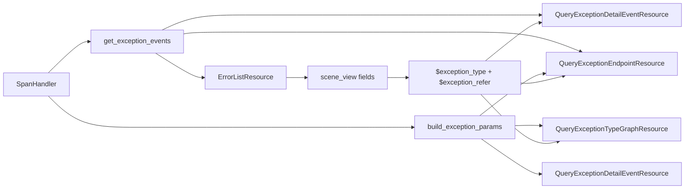

# 方案写作规则

## 0x00 目录

- [0x01 文档职责](#0x01-文档职责)
- [0x02 工作流](#0x02-工作流)
- [0x03 架构设计](#0x03-架构设计)
- [0x04 开发方案](#0x04-开发方案)
- [0x05 验收与验证](#0x05-验收与验证)
- [0x06 实施进展](#0x06-实施进展)
- [0x07 参考 & 版本锚点](#0x07-参考--版本锚点)
- [0x08 自检](#0x08-自检)

## 0x01 文档职责

### a. 边界

* **【CRITICAL（必须执行，不可协商）】** 保持简洁与高信息密度：禁止重复相同语义，冗长、啰嗦、结构混乱的表达方式。
* 架构师视角：注重架构设计、协议与开发方案的准确、直击本质表达，禁止实现流水账式的过程记录，禁止直接堆叠细节性的代码变更。

### b. 保持实时性

主动总结、询问是否同步更新方案：
* 什么情况需要询问： 
  * 对话中出现明确的实质变更，例如核心设计调整、关键决策变更、重要边界调整、验证结论变更等。
  * 重点确认是否将本轮有效结论写回受影响的架构设计片段，并补充实施进展表。
* 什么情况下无需询问：
  * 文档格式类调整：单纯的表述调整、细节补充、语法润色等不涉及方案核心内容的变更。
  * 结论未成形：方案核心内容还在反复讨论、尚未形成阶段性结论时，可以先不更新方案，等结论稳定后再更新。

更新原则：
* 方案连贯与整体性：方案更新**必须覆盖**原有内容，正文不保留历史版本或变更痕迹，除非明确需要进行多个方案对比。
* 反模式
  * 禁止在方案中保留多个版本的设计或决策记录（例如**本轮做了/新增**等会话级别关键字），导致方案信息冗余、前后矛盾。
  * 禁止使用追加的方式更新方案，例如在原有内容后面追加新的设计或决策，而不删除或覆盖原有内容，导致方案信息混乱。


## 0x02 工作流

### a. 推荐骨架

| 章节         | 应写内容                    |
|------------|-------------------------|
| 调研与约束      | 问题背景、约束、关键结论            |
| 架构设计       | 当前有效设计、职责分层、关键决策、风险与不变量 |
| 开发方案 *[1]* | 代码落点、接口改造、迁移步骤、实现结构约束   |
| 验收与验证      | 验证策略、必测点、回归口径           |
| 实施进展       | 架构设计更新后的阶段结论与验证结果       |

* *[1] 单章篇幅过长时按主题拆分章节：以 `0x03 ~ 0x05 开发方案 —— xxx（改造主题）` 形式分配子章节编号。*

### b. 方案输出流程

1. 需求理解：阅读 issue。
2. 架构设计：按 [0x03 架构设计](#0x03-架构设计) 规范输出，再按 [0x08 自检](#0x08-自检) 检查。
3. 开发方案：阅读「架构设计」，按 [0x04 开发方案](#0x04-开发方案) 规范输出，再按 [0x08 自检](#0x08-自检) 检查。
4. 其他章节：按「架构设计」「开发方案」编写其他章节。

**【CRITICAL（必须执行，不可协商）】**：禁止在未完成架构设计的情况下编写开发方案。

### c. 信息归属门禁

**【CRITICAL（必须执行，不可协商）】** 编辑 PLAN.md 前，先为本次改动建立信息归属；输出前逐项核对，禁止同一语义跨载体重复。

* 架构图：只表达对象关系、优先级和收敛点。
* 图下注脚：只补影响实现判断的边界、不变量和例外。
* 伪代码：只表达执行顺序和提前返回条件。
* 开发方案：只回答「在哪声明」「谁来调用」「在哪收敛」。
* 验收与验证：只写测试门禁和必测断言，不复述方案。
* 版本锚点：只记录里程碑、分支、PR 状态。
* 若一句话不能归入以上任一载体，删除。
* 若同一判断已由图、伪代码或表格表达，正文不再复述。


## 0x03 架构设计

核心：「新引入或改造后的核心对象模型、术语」「核心架构与模块分层关系」「关键协议与核心工作流」。

### a. 思考链

1）回归项目逻辑，禁止凭空想象架构设计：阅读相关代码、知识对象，确认需求范围内核心对象模型、术语、架构关系、协议关系和核心工作流。

2）架构命题：
* 用一句话给出本方案的结构判断。
* 它必须说明系统如何重新组织，而不是说明要改哪些功能。
* 若这句话只能写成“新增 X”“支持 Y”“改造 Z”，说明方案还没有进入架构层。

3）**【CRITICAL（必须执行，不可协商）】** 找到复杂度来源，确认核心收敛点：
* 收敛点形态：它可能是一个对象模型、一个协议关系、一个核心工作流或它们的组合。
* 明确混乱来源：不停留表象，寻找核心矛盾（语义混用 / 边界泄漏 / 规则重复 / 职责错位 / 生命周期不清等）。
* 一句话说明收敛点：当前差异从哪里来，应由哪个对象或协议承载，最终在哪个稳定入口收敛，复杂度来源必须能解释为什么局部补丁不够。
* 注重回归：若说不清差异归属，就没有进入架构设计，需要回到第一步，继续阅读代码和相关知识对象，直到找到核心收敛点。

4）围绕核心收敛点的调研能力：
* 项目调研：当前项目是否已具备或正在具备核心收敛点所需的对象模型、协议关系或核心工作流。
* 必要时进行业界调研：
  * 是否有业界通用的设计模式、开源项目或最佳实践能提供参考，是否有前车之鉴的失败案例需要规避。
  * 禁止凭空假象，需要回归代码、文档、社区资源进行调研，找到具体的模式、项目或案例进行分析。

5）围绕核心收敛点展开架构设计，输出核心架构图：
* 写清核心对象、组件、继承链、引用关系、数量关系和职责边界。
* 使用 Mermaid、文本拓扑、结构表或最小协议示例让结构「数据流 / 协议流 / 状态机 / 继承链 / 注册表 / 工厂 / 多层职责分离等」可复原。
* 类名、函数名、文件名只能作为架构锚点，不能替代结构说明。

6）围绕核心架构图分主题明确核心协议：
* 禁止强行套用 「关键决策 / 不变量 / 边界」。
* 按真实设计拆分主题，进一步明确协议：例如模型设计、查询机制、写入机制、生命周期、路由机制、配置下发、隔离策略、兼容策略等。
* 关键协议注重结构化表达，例如字段契约表、协议流程图、状态转移图、协议关系图等，避免只用文本描述。

7）正直与诚实：
* 信息回归：架构设计必须基于真实的代码和业务逻辑，禁止凭空想象，遗忘时回到代码里继续阅读。
* 及时提问：遇到不明确边界时，给出可选方案及其利弊，及时提问确认。

### b. 原则

1）单章节信息自闭环：

* **【CRITICAL（必须执行，不可协商）】** 不需要额外的代码或开发方案作为补充，便可明确、奠定整个方案的核心架构、协议关系、核心工作流和关键边界。
* 汇报友好型：注重概念抽象和关系说明，而不是代码细节的罗列，注重核心对象、字段的术语提炼，读者不需要回到代码里才能理解架构设计。
  * Bad：定义 quota、usage_count，使用 shared_datasource_id。
  * Good：通过容量（quota）与用量（usage_count）控制共享池的分配与回收，通过共享数据源 ID（shared_datasource_id）引用共享池。

2）架构设计与开发方案信息分离：

* 专注核心架构、协议关系、核心工作流和关键边界的设计与说明。
* 禁止涉及过于具体开发落点、接口改造、迁移步骤或实现结构约束。

### c. 区分架构设计与开发方案

下文给出「架构设计」「开发方案」的片段，以同一需求为例，说明两者的区别：
* 架构设计更关注核心收敛点的设计与说明，注重关键、必要的协议，确保对开发方案由设计指导。
* 开发方案更关注代码落点，即架构设计中提及的核心对象、协议的优雅实现指导。

#### 架构设计

关注核心收敛点的设计与说明，注重关键、必要的协议，确保对开发方案由设计指导：



1）`SpanHandler` 统一声明条件参数构造函数：

```text
build_exception_params(
    exception_type: str, exception_refer: str | None, operator_key: str = "op",
) -> list[dict[str, Any]]
```

2）`exception_type` 过滤机制

`QueryExceptionDetailEventResource` & `QueryExceptionEndpointResource`：
* 使用 `build_exception_params` 进行前置过滤。 
* 由于同一 Span 内可能存在多个异常事件，现有的后置事件匹配仍然保留。

* `QueryExceptionTypeGraphResource`：按相同映射构造 UnifyQuery 条件。

#### 开发方案

开发方案更关注代码落点，即架构设计中提及的核心对象、协议的优雅实现指导。

| 变更点                                                                                    | 目标                                        |
|----------------------------------------------------------------------------------------|-------------------------------------------|
| **[Keep]** `process_rpc_span(span)`                                                    | 保留 PR #10784 已合入能力，继续把返回码 Span 补成逻辑异常事件。  |
| **[Add]** `get_exception_events(span)` *[1]*                                           | 返回标准逻辑异常事件，空列表由 resource 保持 `unknown` 兼容。 |
| **[Add]** `build_exception_params(exception_type, exception_refer, operator_key="op")` | 输出查询条件参数，供详情、趋势和调用链 URL 复用。               |

* *[1] 返回标准协议*：`get_exception_events(span)` 返回字段如下：

| 字段                  | 类型       | 来源字段                                                                                                                           | 说明                        |
|---------------------|----------|--------------------------------------------------------------------------------------------------------------------------------|---------------------------|
| `exception_type`    | `string` | [a] tRPC 场景：`attributes.rpc.error_code` > `attributes.trpc.status_code`<br />[b] 标准场景：`events.attributes.exception.type`       | 页面展示、分组和过滤值。              |
| `exception_refer`   | `string` | [a] tRPC 场景：命中字段名 `rpc.error_code` > `trpc.status_code`<br />[b] 标准场景：`events.attributes.exception.type`                       | `exception_type` 的来源字段标识。 |
| `exception_alias`   | `string` | [a] tRPC 场景：逻辑事件 `exception.alias`<br />[b] 标准场景：`exception.alias` > `exception_type`                                          | 详情标题展示值。                  |
| `exception_message` | `string` | [a] tRPC 场景：`attributes.rpc.error_message` > `attributes.trpc.status_msg`<br />[b] 标准场景：`exception.message` > `status.message` | 详情副标题候选。                  |
| `timestamp`         | `number` | [a] tRPC 场景：`span.start_time`<br />[b] 标准场景：`event.timestamp`                                                                  | 详情排序时间。                   |
| `stacktrace`        | `string` | [a] tRPC 场景：空值<br />[b] 标准场景：`exception.stacktrace`                                                                            | 返回码逻辑事件不构造堆栈。             |

条件参数映射：

```text
空 exception_type
  -> []

exception_type = unknown 且 exception_refer 为空
  -> []

exception_refer 为空或 events.attributes.exception.type
  -> events.name = exception
  -> events.attributes.exception.type = $exception_type

exception_refer 不为空
  -> attributes.${exception_refer} = $exception_type
```


## 0x04 开发方案

核心：
* 开发方案承接架构设计，明确架构中
* 从哪些模块或入口开始开发，如何组织代码才能符合架构设计，写出优雅的代码。
* 每个模块或入口的核心协议是什么（精细到函数级别），如何声明、取用和收敛。

### a. 思考链

1）承接「架构设计」结论

* 先说明本节落实的是架构设计中的哪条结构判断。
* 不要重新讲背景，也不要把架构设计复制一遍。

若开发方案无法对应到前文某个架构结论，说明它只是任务清单。

2）确认开发落点

* 按责任主题拆分，不按文件机械分组。
* 每个主题先说清它承担什么责任，再列入口、文件或对象，以文件名作为锚点，而不是把文件名当成方案主体。

3）声明协议骨架

* 涉及接口、字段、配置、类、函数、注册表或数据结构时，先给最小协议骨架。
* 协议骨架只写核心字段、参数和返回值，不写所有细节，禁止直接堆叠代码实现细节。
* **【CRITICAL（必须执行，不可协商）】** 时刻回归代码，确认协议约束要能指导开发者少写错代码，而不是只表达愿望。
* 推荐用 `Add`、`Change`、`Keep`、`Delete` 标记对象去留，并说明目标（不要写成 PR diff，也不要逐行描述实现过程）。

4） 约束实现结构

* 开发方案必须能回答三件事：「在哪声明」「谁来调用」「在哪收敛」。
* 写清上层通过哪个入口拿到这个能力，下层通过哪个协议接收上下文，中间在哪里转换。
* 保持严谨：禁止未仔细阅读代码和分析，想当然说「建议统一输出下面的内部结构」，列举出来的字段或接口不在代码里，或者说了个接口名但没说明它在哪个类、文件或模块里。

5）处理兼容与迁移：如果涉及旧协议、旧数据、旧入口或灰度路径，写清兼容策略、迁移方式和废弃边界。

### b. 原则

1）**【CRITICAL（必须执行，不可协商）】** 架构师哲学：
* 开发方案是通过优雅的结构设计、协议设计和边界约束来指导开发者写出正确的代码，
* 禁止堆砌完整的代码实现细节或者通过罗列代码细节来指导开发者。

2）保持清醒，审视架构合理性：
* 禁止同一职责出现多组并列处理逻辑或辅助函数。
* 禁止盲从架构设计，发现方案走不通时，及时回到架构设计，重新审视架构设计的合理性，必要时调整架构设计。


## 0x05 验收与验证

制定单侧规范而非口头复述期望：
* 现有测试已能覆盖方案即将产生的变更：给出测试门禁，例如：`uv run pytest -n auto tests/*`，禁止复述测试用例或测试结果。
* 需补充、扩展测试样例：规划补充测试用例函数（类）名，描述断言重点。


## 0x06 实施进展

### a. 原则

1）**【CRITICAL（必须执行，不可协商）】** 表头固定为 `时间 | 结论性进展` 两列，禁止增删列、改列名，禁止与「版本锚点」表混用。

2）时间：统一使用 `YYYY-MM-DD HH:00` 格式，精确到小时，条目按时间倒序。

3）**【CRITICAL（必须执行，不可协商）】** 以下场景优先更新阶段结论，禁止新增行：
  * 若同一天持续打磨同一方案，且未形成新的阶段结论。
  * 最新结论与即将写入的结论互相矛盾、内容高度相似，或者新结论只是对旧结论的细节补充时。

4）协作、汇报友好视角：
* 聚焦重点，突出阶段结论，术语专业普适化，禁止逐行罗列过程细节或直接堆叠代码变更。
* 禁止使用 `0x03.a` 等章节编号作为引用标题，应使用专业术语或设计片段标题，例如「共享数据源模型设计」。

### b. Good & Bad case

Bad：

| 时间                 | 结论性进展                                                                                                                                                                                                                                                                                                                               |
|--------------------|-------------------------------------------------------------------------------------------------------------------------------------------------------------------------------------------------------------------------------------------------------------------------------------------------------------------------------------|
| `2026-04-16 10:00` | [a] 将「查询路径审计」调整为「查询改造」，明确 shared Trace 查询隔离只在 `TraceQueryGuard` 收口<br />[b] 补充 `APMAppTarget` / `TraceDatasourceTarget` 目标模型，保留 `table_id -> APM 应用` 一一绑定<br />[c] 明确 `UnifyQueryCompiler.as_sql` 仅负责多 table 解包，不承载 APM shared 前缀判断                                                                                                 |
| `2026-04-16 11:00` | [a] PR review 收口共享池计数边界：补充 `acquire()` 与 `release()` 成对语义，并要求二者复用 `_change_usage_count(delta)`<br />[b] 明确共享 Trace 启停不操作 `switch_result_table()`，删除释放共享池占用但不删除共享日志索引集<br />[c] 补充以 `ApplyDatasourceResource.shared_datasource_types` 为入口的显式迁入 / 迁出方案：不传表示保持数据库现状，传入列表表示目标共享状态<br />[d] 撤回查询隔离默认开启阻塞意见，查询隔离作为后续 PR 的已知拆分事项继续保留在方案约束中 |

Good：

| 时间                 | 结论性进展                                                                                                                                                          |
|--------------------|----------------------------------------------------------------------------------------------------------------------------------------------------------------|
| `2026-04-16 10:00` | 设计统一查询隔离入口及模型（`TraceQueryGuard` / `APMAppTarget` / `TraceDatasourceTarget`）                                                                                    |
| `2026-04-15 10:00` | [a] 完成一轮共享数据源模型 PR（[#<number>](<pr_url>)）review<br />[b] `acquire()` / `release()` 复用 `change_usage_count`<br />[c] 设计基于 `ApplyDatasourceResource` 的统一迁入迁出入口方案 |


## 0x07 参考 & 版本锚点

1）参考链接样例

- PR - 共享数据源生命周期改造：[TencentBlueKing/bk-monitor #10784](https://github.com/TencentBlueKing/bk-monitor/pull/10784)
- [<源码> span_handler.py ErrorListResource](https://github.com/TencentBlueKing/bk-monitor/....)
- [HTTPX Transports 文档](https://www.python-httpx.org/advanced/transports/)

⚠️注意：源码使用 GitURL 以便知识查阅，实际优先阅读本地代码库中的文件，提升调研效率。

2）版本锚点

一个方案会拆分为 1～N 个 PR：

- **【CRITICAL（必须执行，不可协商）】** 表头固定为 `状态 | 分支 | 里程碑 | PR` 四列，禁止增删列、改列名，禁止与「实施进展」表混用。
- `状态`：进行中 - 🔄 / 已完成 - ✅，在代码、方案 Review 过程中持续获取和更新。
- `分支` 使用当前实际分支名，占位统一写作 `<branch_name>`。
- `里程碑` 使用方案拆分出的里程碑描述。
- `PR` 必须写成 Markdown 链接，不使用纯编号或裸 URL。
- 尚未产出 PR 时，`PR` 写 `待创建`。

占位样例（新建方案、尚无 PR 时直接复制，保持表头一致）：

| 状态 | 分支              | 里程碑                | PR     |
|----|-----------------|--------------------|--------|
| 🔄 | `<branch_name>` | 里程碑 1：<自定义里程碑描述>   | 待创建    |

完整样例（产出 PR 后逐行补全）：

| 状态 | 分支                                                      | 里程碑                   | PR                                                                                            |
|----|---------------------------------------------------------|-----------------------|-----------------------------------------------------------------------------------------------|
| ✅  | `feat/trpc_error_display_info_opt/#1010158081134636736` | 里程碑 1：错误详情返回码信息展示     | [TencentBlueKing/bk-monitor #10784](https://github.com/TencentBlueKing/bk-monitor/pull/10784) |
| 🔄 | `<branch_name>`                                         | 里程碑 2：错误视图返回码联动适配     | 待创建                                                                                           |
| 🔄 | `<branch_name>`                                         | 里程碑 3：错误详情支持展示返回码备注信息 | 待创建                                                                                           |

**【CRITICAL（必须执行，不可协商）】** 状态同步：在代码 Review、记录实施进展等契机，及时记录未记录的 PR，通过 `gh` CLI 更新 PR 状态。


## 0x08 自检

### a. 文档质量

* 文档不合格信号：
    * 只能看到文件改动、类名清单、PR 差异摘要或测试结果，需自行拼出架构关系。
    * 架构设计和开发方案内容大量重复，且都缺乏核心对象模型、协议关系、模块分层、开发落点和结构约束，无法指导开发。
* 专业度：
  * 术语准确：核心对象、协议关系、架构关系等术语使用准确，且贯穿全文保持一致。
  * 文档、架构图等符合业界规范：例如 UML、Mermaid、设计模式等，且使用规范、清晰。

### b. 输出门禁

**【CRITICAL（必须执行，不可协商）】** 方案输出前必须通过以下自检：

* 重新阅读 [0x02 工作流](#0x02-工作流) ，确保规范逐层编写方案。
* 按 [0x02.c 信息归属门禁](#c-信息归属门禁) 做语义去重：同一判断跨图、伪代码、正文、表格或版本锚点重复时，只保留最贴近读者决策的一处。
* 重新阅读当前阶段所属章节的规范，确保方案内容满足章节职责，例如当前处于「架构设计」阶段，重新阅读 [0x03 架构设计](#0x03-架构设计) 章节确认。
  - [0x03 架构设计](#0x03-架构设计)
  - [0x04 开发方案](#0x04-开发方案)
  - [0x05 验收与验证](#0x05-验收与验证)
  - [0x06 实施进展](#0x06-实施进展)
  - [0x07 参考 & 版本锚点](#0x07-参考--版本锚点)
* 符合 plan 模板规范（遗忘时重新阅读模板）。
* 表格类章节（实施进展、版本锚点等）逐表核对表头，以对应章节样例为准，禁止凭记忆改列名或两表混用。
* 符合当前项目所规定的文档质量要求（lint、rules）。
