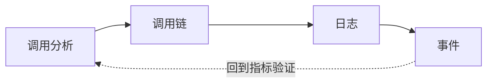
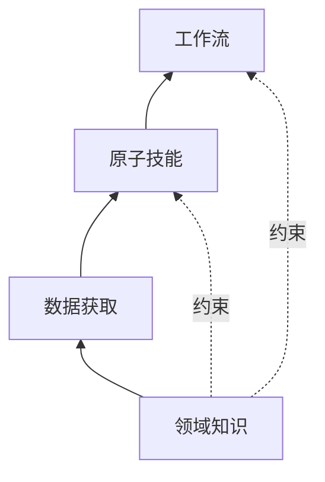
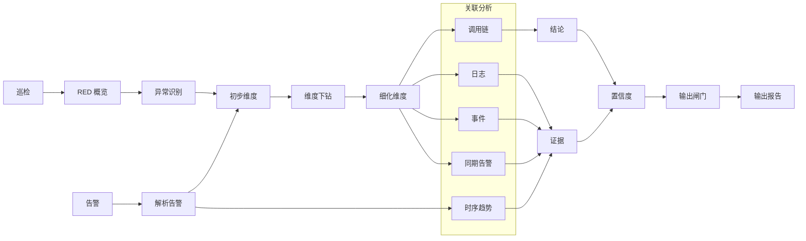

# 观测经验 Skills 化 — 将 RPC 服务排障知识固化为 AI 的专家能力

> **关键词**：AI Agent · RPC · APM · Skills 工程 · 可观测性

---

## 0x01 排障的结构性瓶颈

无论是告警处理还是研发例行巡检，排障路径本质上是一样的：

- **调用分析**：通过下钻快速找到异常接口或触发来源。
- **调用链**：确认调用瓶颈在哪一跳，对比同类异常调用链是否存在一致字段（如某个 UserID、来源 IP）。
- **日志**：不同团队、不同人打印日志的规范不同，如何快速定位所需的错误信息。
- **事件**：分析发布变更、容器异常重启与时序趋势变化之间的因果关系。

现代观测平台已经做到了服务下钻后从指标页面直接跳转到 Trace 页面，**数据获取已经很丝滑**。真正的瓶颈不在数据，而在**发现问题和分析问题的经验**：

- 怎样的下钻路径能最快收敛到异常根因？
- 时序曲线的形态意味着什么？先看趋势还是先做维度拆分？
- 同类异常 Span（分布式追踪中的一次调用记录）之间，哪些字段值得对比？
- 日志检索的关键词怎么选？不同框架的日志格式差异如何应对？

这些判断逻辑**散落在个人经验中，难以传承**。跨系统数据、多页面切换、关联分析——**对任何人都是高认知负荷**。好在 RPC 排障路径存在高度可复用的通用模式，**经验值得被结构化地固化**。

本文要解决的问题是：**如何将这些分析经验固化为可移植、可共享的 AI 技能（Skills）。**

以 RPC（远程过程调用）服务排障为例。这套方法论对多数依赖跨信号关联的可观测性场景都具备可迁移性，落地时需要结合具体领域特性做裁剪。

---

## 0x02 排障经验 Skills 化

从方法论视角看，排障可抽象为两类核心活动：

**排障 = 信息检索（可自动化）+ 因果推断（可被辅助）**

**信息检索**——哪个接口异常、对应的调用链是哪些、关联的日志和事件是什么——其中大部分可标准化并自动化，但仍需要字段校验和上下文比对。

**因果推断**——维度下钻的顺序、时间对比策略、异常模式识别、四类信号的关联逻辑——这是领域经验，可以被形式化为规则和约束，辅助 AI 做出专家级判断。

| 路径         | 做法                              | 收益               |
| ------------ | --------------------------------- | ------------------ |
| 自动化信息检索 | 数据获取 CLI 化，语义化参数         | 消除操作摩擦       |
| 编码因果推断   | 领域知识 + 方法论 → AI 的行为约束 | 从"靠经验"到"稳定输出" |

**Skills 化就一句话：将经验驱动的排障路径编码为 AI 可执行的标准流程。**

这里说的 Skill，具体形态是一组结构化文本文件，包含领域规则描述、工具调用接口定义和行为约束声明。AI Agent 在执行排障任务时加载这些文件，并在推理过程中遵循其中的规则。

---

## 0x03 四层架构：经验沉淀的方法论

把经验全塞进 Prompt，短期能跑，但规模一大就会失真。上下文越长，早期指令越容易被稀释。更根本的问题是：**不同类型的知识，变化频率不同、使用方式不同，需要分层管理。**

| 层       | 解决什么问题                 | 变化频率 |
| -------- | --------------------------- | -------- |
| 领域知识 | AI 理解数据的前提             | 极慢     |
| 数据获取 | AI 稳定拿到数据               | 慢       |
| 原子技能 | AI 能做什么分析               | 中       |
| 工作流   | AI 在特定场景下必须做什么     | 快       |

知识层用虚线标注——它不在调用链上，而是**约束**上层的每一次推理。无论是原子技能还是工作流，都在知识层规则下运行。

四层不是静态分层，而是经验资产化闭环：**案例复盘 → 规则抽象 → 技能编排 → 执行验证 → 反哺规则**。分层解决结构化，闭环解决进化速度。

### a. 领域知识层

这一层的核心是：**把隐性经验显式化为 AI 的行为约束与推理前提。**

以 RPC 场景为例，需要沉淀的领域知识包括：

- RPC RED（Rate / Errors / Duration）指标语义及维度。
- 调用链协议——Span 字段含义、Kind 类型、状态码语义。
- 日志打印格式及字段规范——不同框架的日志结构差异。
- 指标 / 调用链 / 日志之间的字段关联映射。
- 使用陷阱——如同一字段在主调和被调视角下含义相反。

知识层规则不是写在 Prompt 末尾的“注意事项”——那种会随上下文稀释。它应作为默认约束优先执行；若出现冲突或证据不足，应触发显式说明和人工复核。

### b. 数据获取层

这一层解决的问题是：**让 AI 稳定拿到干净数据，不在取数这一步就出错。**

实现形态可以是 CLI、MCP（Model Context Protocol）或平台原生工具，但它们本质都是载体。以 CLI 封装为例，其优势在于：

- **封装复杂参数**：`PromQL` 构造、分页处理、编码修复等复杂性由脚本承担，AI 只需传入语义化参数。
- **数据预清洗**：脚本内完成过滤和聚合，只输出分析所需的精简结果，减少上下文消耗。
- **并发执行**：多个查询并行发起，减少对话轮次和端到端耗时。
- **不容易出错**：参数名即含义（`--service-name`、`--group-by`），AI 无需推断内部标识符。

### c. 原子技能层

这一层定义的是：**AI 使用工具进行分析的能力。**

每个原子技能解决一类具体的分析问题，可以被工作流编排，也可以被工程师自由组合：

- 如何编写成功率 / 耗时 / 请求量的 `PromQL`，查询服务的 RED 概览。
- 如何使用 CLI 进行渐进式维度下钻——按接口 → 错误码 → 实例逐层收敛异常范围。
- 如何基于指标异常维度关联调用链，从 Span 中确认调用瓶颈。
- 如何关联日志查看错误堆栈，关联事件核查变更和容器异常。
- 如何做时间对比（日环比、周环比）判断异常是新增还是历史遗留。

判断什么该成为原子技能有一个简单标准：**如果某个分析动作在多个排障场景中都会用到，它就该被提取为原子技能**，而不是在每个工作流中重复描述。

### d. 工作流层

这一层解决的问题是：**固化高频复杂任务，保证执行和输出稳定。**

巡检和告警分析是两个最高频的场景，它们的路径不同但在下钻阶段汇合，共享同一套分析子流程：

工作流的价值在于**步骤约束**：哪些步骤建议设为必做，步骤之间的顺序为什么重要。排障中最常见的错误不是逻辑错，而是步骤被跳过——没做时间对比就断定“新增异常”，没查调用链就直接判根因。工作流将这些顺序依赖关系固化下来。

工作流里有两次维度收敛：`异常识别` 和 `解析告警` 先得到**初步维度**，`维度下钻` 再得到**细化维度**。基于细化维度进入四项并行关联分析：调用链、日志、事件、同期告警。`时序趋势` 也归入关联分析，但只在 `解析告警` 后调用，用于补充告警场景的时间形态证据。全部分析结果进入三步总结：`结论`（候选根因）、`证据`（跨信号证据链）、`置信度`（结论可信等级）。三步收敛后再进入**输出闸门**。输出闸门用于校验前置条件（关键步骤已完成、证据链完整、格式规范已加载），再生成输出报告，保证执行稳定性和结论质量。

**工作流中沉淀的经验**

以下两个例子说明，排障中"只可意会"的经验如何被固化为工作流规则。

**比率陷阱与交叉验证**：比率型指标（成功率、超时率等）按维度下钻时，只看比率会误判。

| 实例   | 超时率 | 请求量         |
| ------ | ------ | -------------- |
| 实例 A | 100%   | 20 次/min      |
| 实例 B | 0%     | 20,000 次/min  |

超时率一个 100% 一个 0%，看起来像"部分实例超时"。叠加请求量才知道：100% 超时的实例只有 20 次请求，是边缘实例的残留心跳。有经验的工程师会下意识地同时看请求量——这条经验被固化为知识层规则：比率型指标下钻时建议同步查询请求量交叉验证。

**时序形态决定推理入口**：某服务主调成功率告警，持续 56 分钟后自动恢复。先做维度下钻：2 个主调实例 + 2 个被调 IP 均匀分布——看起来像下游系统性故障。但先看时序形态：异常量约 28 次/分钟，恒定不变，56 分钟后骤停。恒定速率排除了系统性故障（系统性故障的错误量随流量起伏），最终定位为单用户被 403 持续拒绝、客户端无退避重试。

| 时序形态   | 特征             | 根因方向                   |
| ---------- | ---------------- | -------------------------- |
| 恒定速率   | 错误量恒定       | 单一来源重试               |
| 脉冲式     | 突发后消失       | 批量触发 / 定时任务        |
| 渐升 / 渐降 | 错误量单调变化   | 资源耗尽 / 自动恢复       |
| 阶跃式     | 某时刻跃升并维持 | 发布变更 / 配置变更        |

**关键洞察：维度分布相同的两个问题，时序形态可能截然不同。** 这就是为什么工作流将时序分析排在维度下钻之前——步骤顺序本身就是经验。

---

## 0x04 双模式：分层的价值

前面讲的是“怎么搭能力”，下面讲“能力搭好后怎么用”。

四层架构的重点不是分层本身，而是同一套知识和工具能同时跑两种模式：高频场景走工作流，稳定；复杂问题走专家模式，灵活。

| 对比项 | 工作流模式 | 专家模式 |
| ------ | ---------- | -------- |
| **自由度** | 低 | 高 |
| **适用** | 告警分析、巡检等高频场景 | 自定义分析、数据探索 |
| **执行方式** | 步骤强约束，建议必做 | 自由组合原子技能 |
| **AI 角色** | 流程执行者 | 领域专家 |

工作流模式用预定义步骤编排原子技能，保证高频场景的执行路径一致、输出质量稳定。专家模式让 AI 根据问题动态编排，在领域知识的驱动下自主选择原子技能组合——即使没有工作流约束，知识层的规则仍然生效，确保每个分析动作的语义正确性。

不分层，实践中很容易退化为二选一：要稳定就不灵活，要灵活就不稳定。分层的价值，是把这道单选题改成多选题。

---

## 0x05 从零开始的路线图

不需要一次建完四层。建议从一个高频场景切入，逐步补全：

1. **选一个高频排障场景**（如告警分析），梳理专家的操作步骤 → 第一个**工作流**。
2. **记录每次跨系统查询时的字段关联与映射规则** → 积累成**知识层的映射协议**。
3. **提取被反复执行的分析动作**（如维度下钻、时间对比）→ 提炼为**原子技能**。
4. **回忆踩过的坑**（比率陷阱、视角混淆等）→ 固化为**知识层规则**。
5. **将数据获取封装为 CLI 工具** → 完善**数据获取层**。

一个工作流跑通后，再扩展到第二个场景——大量原子技能和知识层规则可以直接复用。

---

## 0x06 效果

> 说明：截图版结果将在后续补充。当前表格用于展示试点观察结论。

> 说明：以下为试点场景下的阶段性结果，具体收益受规则覆盖度、数据口径稳定性和场景复杂度影响。
> 口径：建议按“近 30 天同类型告警样本、人工流程 vs Skills 流程对照”补齐最终发布版数据。

| 维度         | 传统方式                           | Skills 化后                       |
| ------------ | ---------------------------------- | --------------------------------- |
| 告警分析耗时 | 20-40 分钟                         | 3-5 分钟                          |
| 巡检耗时     | 30-45 分钟                         | 5-10 分钟                         |
| 分析完整性   | 依赖个人经验，关键步骤可能被跳过   | 工作流强约束，关键步骤建议必做    |
| 结论一致性   | 因人而异                           | 一致性显著提升，关键结论可复核    |
| 新人上手     | 需要积累经验 + 熟悉多套系统        | 上手门槛明显降低                  |

