# 观测经验 Skills 化：将 RPC 排障知识固化为 AI 的专家能力

> **作者**｜sandrincai  
> **关键词**｜AI Agent · tRPC · APM · 蓝鲸监控 · Skills 工程 · 可观测性

---

## 一、一个不该存在的职业：数据搬运工

一个有经验的 SRE，排查一次 RPC 告警平均需要 **30 分钟**。这 30 分钟里，大约 20 分钟花在切换页面、手工关联数据上，真正用于分析的时间不足三分之一。

这不是个人效率问题，是结构性问题。不只是告警排障——上线巡检、慢接口发现——所有观测场景都在重复同一个动作：

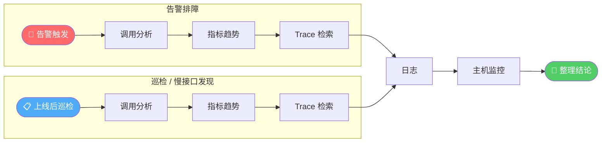

**五个功能页面，每次手工切换，每次从零开始。**

更深的问题不是效率——而是**知识无法复用**：

| 痛点 | 根因 |
|------|------|
| **信息割裂** | 指标字段名和 Span 字段名不同，跨系统映射靠记忆 |
| **经验依赖** | 「实例均匀分布说明不是机器问题」——有人教才知道 |
| **结论不稳定** | 同一告警，有经验的人 10 分钟判断清楚，新人可能误判方向 |
| **零沉淀** | 相同的排查路径，下一次依然从零开始 |

**核心矛盾：排障知识活在人脑里，不在系统里。工程师成了数据搬运工，而不是分析师。**

这是本文要解决的问题。

---

## 二、核心论点：把排障从「艺术」变成「工程」

先定义「排障」的本质：

> **在有限时间内，用最少的数据操作，得出可信的因果结论。**

这要求三个要素同时具备：

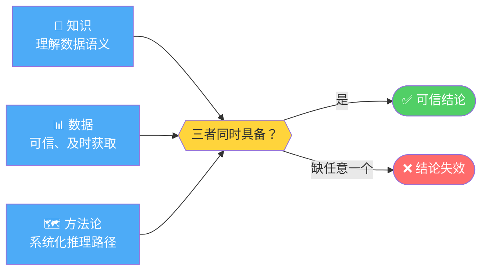

- **知识不准**：不知道 `instance` 在主被调视角含义不同，下钻方向就错了
- **数据不稳**：用错 PromQL 聚合函数，数值合理但语义错误，推理链第一步就断
- **无方法论**：先看维度分布还是先看时序形态？顺序错了，结论就错了

「艺术」的意思是：三要素全在专家脑子里，无法复制，无法传递，无法让 AI 执行。

**Skills 能做的，是把三要素从专家脑子里取出来，以正确的形式赋予模型——让 AI 具备专家级的排障能力。这就是「工程化」。**

---

## 三、Skill 架构：四层模型

工程化的实现，需要一个分层架构——每一层解决不同类型的问题：

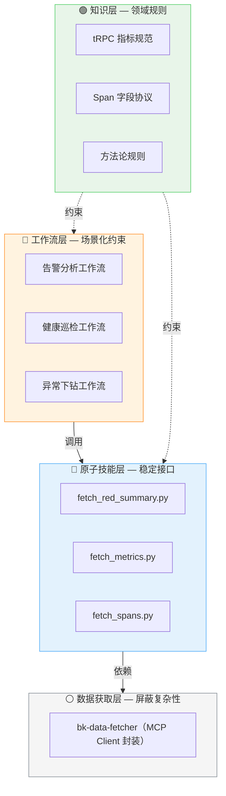

**为什么是四层，而不是更少？**

| 层 | 解决的问题 | 变化频率 |
|---|---|---|
| 工作流层 | 场景约束，确保关键步骤不被跳过 | 随业务需求变 |
| 原子技能层 | 屏蔽数据获取复杂性，降低 Token 消耗 | 随工具接口变 |
| 知识层 | 把领域规则变成模型的强制约束 | 随协议版本变（极慢） |
| 数据获取层 | MCP Client 封装，统一接口 | 随底层 API 变 |

**知识层的特殊性**：它不在依赖链上（虚线），而是「约束」上层。这意味着知识层的规则，在每一次推理中都生效，不只是在特定工作流里。这是让 AI 具备「领域专家」而非「流程执行机器」特质的关键设计。

---

## 四、知识层：赋予模型领域专家的认知

把规则写进 Prompt 不够——Prompt 是「建议」，模型可以选择忽略，也会随上下文的稀释而淡出。知识层的做法是：**在 Skill 文件里明确标注 CRITICAL，让这些规则成为模型在每一次推理中都不能绕过的强制约束**。

这样，散落在 tRPC SDK 文档和蓝鲸监控接口文档里的隐性知识，就变成了模型行为边界的一部分。

### 4.1 三率约束：指标不是孤立的

每个请求的 `code_type` 三者互斥且完备：

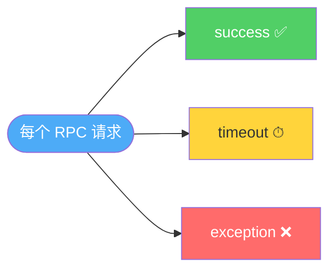

**成功率 + 超时率 + 异常率 = 100%，三者共用同一组原始数据。** 成功率下降时，必须同时看另外两个——「超时变多」和「业务错误变多」的根因截然不同，缺一则诊断残缺。

### 4.2 视角陷阱：字段名相同，含义相反

这是最容易让模型（和人类）犯错的地方：

| 字段名 | 被调视角（callee） | 主调视角（caller） |
|--------|-----------------|-----------------|
| `instance` | **被调端** IP（自己） | **主调端** IP（自己） |
| `callee_ip` | ❌ 不可用 | 对端被调 IP |
| `caller_ip` | 对端主调 IP | ❌ 不可用 |

被调视角下用 `instance` 想找「下游哪个实例出问题」——结果看到的是自己的每个实例，方向完全反了。这个错误在 Prompt 里几乎无法防范，必须作为知识层的强制规则。

### 4.3 SDK 规则：静默失真是最危险的错误

| SDK | 指标类型 | 正确函数 | 错用后果 |
|-----|----------|---------|----------|
| Oteam（默认） | Counter（cumulative） | `increase()` | 用 `sum_over_time` → 数值合理，**语义错误**，极难察觉 |
| Galileo | Gauge（delta） | `sum_over_time()` | 用 `increase` → **数值直接错误** |

Oteam 错用的情况最危险：数值在合理范围内，AI 不会报错，但整个推理链都建立在错误数据上。SDK 类型从告警策略自动推断（`query_configs[0].functions` 含 `increase` → Oteam），**是所有指标查询不可省略的前置步骤。**

### 4.4 跨系统映射：指标与 Trace 的语义鸿沟

从「指标发现异常维度」到「Trace 定位具体调用」，两套系统字段命名完全不同。没有这张映射表，AI 就无法完成从指标到调用链的自主关联：

| RPC 指标维度 | Span 字段 | 备注 |
|------------|-----------|------|
| `service_name` | `resource.service.name` | 查询必带 |
| `callee_method` | `attributes.trpc.callee_method` | — |
| `code` | `attributes.trpc.status_code` | — |
| `instance`（被调） | `attributes.net.host.ip` | 含义随视角变化 |
| `callee_ip`（主调） | `attributes.net.peer.ip` | 仅主调可用 |
| `caller_ip`（被调） | `attributes.net.peer.ip` | 仅被调可用，同字段反义 |

查询还必须加 `kind` 过滤，否则主被调 Span 混入导致耗时数据失真：

```
被调 → kind:(2 OR 5)    主调 → kind:(3 OR 4)
```

---

## 五、原子技能层：为什么不让 AI 直接调 MCP API？

这是一个值得深究的设计决策。表面上看，直接调 MCP API 更「简单」——少一层封装。但实际上有两类本质问题：

**Token 消耗**：MCP API 原始响应包含大量对推理无用的元数据。以 Span 检索为例，原始响应通常超过 **2,000 行 JSON**，而 AI 推理需要的只是「哪些 Span 出错、错误码、耗时」——约 **50 行**。CLI 脚本在本地完成清洗聚合，Token 消耗**降低约 40 倍**，上下文得以聚焦在推理本身，而不是数据解析。

**稳定性陷阱**——每一个都是「静默失败」：

| 陷阱 | 为何危险 |
|------|----------|
| PromQL 构建（表名转义、聚合函数、`by` 子句） | 写错不报错，数值看起来合理，语义已错 |
| 参数类型混淆（`body_param` vs `query_param`） | 返回 HTTP 200，数据为空，AI 无法感知 |
| 分页缺失 | 长时间范围只返回前 N 条，AI 以为数据完整 |
| 输出格式不统一 | 不同工具返回结构差异大，解析开销高 |

**原子脚本的本质：把「复杂但固定的查询逻辑」从 AI 的推理空间里移走，让 AI 的注意力放在分析上，而不是查询参数的正确性上。**

### 三个脚本的分工与协作

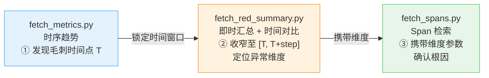

`fetch_red_summary.py` 示例——一条命令完成「维度下钻 + 日环比 + 周环比」：

```bash
python3 fetch_red_summary.py \
  --biz-id=2005000 --app-name=my-app \
  --service-name=example.greeter \
  --metric="success_rate" \
  --kind="callee" \
  --temporality="cumulative" \
  --filter="callee_method=SayHi" \
  --group-by="instance" \
  --offset="1d,1w" \
  --output="bkmonitor-files/result.json"
```

输出直接含 `growth_rates`（增长率）和 `proportions`（请求量占比），无需模型二次计算。

---

## 六、方法论层：赋予模型专家的推理习惯

知识层解决的是「数据含义」——字段语义、指标约束。方法论层解决的是另一类更隐性的知识：**专家的推理顺序和判断规则**。

「先看时序形态再做维度下钻」「比率指标必须交叉验证请求量」——这些不是可以从指标文档里读到的内容，是从无数次排障失败中提炼出来的经验。同样需要固化为强制约束。

### 6.1 下钻框架：五步收窄不确定性

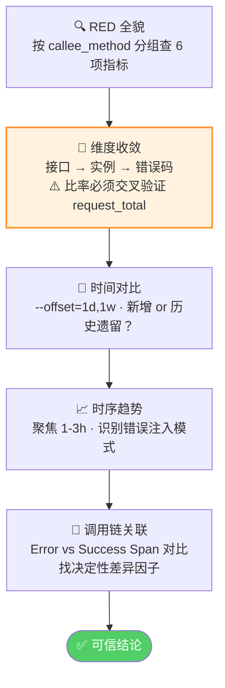

### 6.2 比率陷阱：只看比率，结论必然有偏

| 实例 | 超时率 | 请求量 | 实际含义 |
|------|--------|--------|----------|
| 实例 A | 100% | 20 次/min | 已下线边缘实例，残留心跳触发超时 |
| 实例 B | 0% | 20,000 次/min | 主力实例，承载 99.9% 流量，完全正常 |

只看 `timeout_rate` → 「所有实例都有超时」——完全错误的结论。

**规则：对任何比率型指标下钻，必须同步查 `request_total` 按相同维度分组，通过请求量权重交叉验证。** 结果行数 > 50 时，写脚本分群统计，禁止人工扫描 JSON。

### 6.3 时序形态：推理的入口，不是附录

**案例**：某次主调成功率告警，异常量 ~28 次/分钟，恒定持续 56 分钟后骤停。

- **先看时序形态**：恒定速率 + 骤停 → 直接指向「单一来源自动重试」
- **若先做维度分析**：2 主调实例 + 2 被调 IP 均匀分布 → 误判为下游系统性故障

时序形态之所以能作为推理入口，是因为**错误量的变化方式本身就包含根因信息**：

| 时序形态 | 特征 | 根因线索 |
|----------|------|----------|
| **恒定速率** | 错误量恒定，持续后骤停 | 单一来源自动重试、无退避轮询 |
| **脉冲式** | 短暂突发后迅速消失 | 批量触发、定时任务 |
| **渐升 / 渐降** | 错误量单调变化 | 服务渐进恶化或自动恢复 |
| **间歇毛刺** | 正常值与峰值交替 | 随机抖动、资源竞争 |

系统性故障的错误量随整体流量起伏；单一来源问题与流量无关。**两者维度分布可能完全相同，但时序形态截然不同——这是时序分析必须先于维度下钻的原因。**

### 6.4 波动下钻：收窄窗口才能放大信号

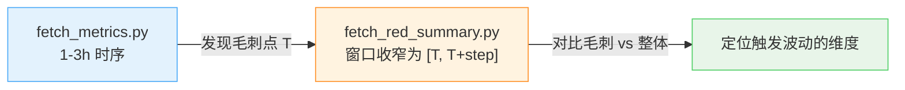

1 分钟内的骤降，放在 1 小时汇总里只有 0.1% 的影响——完全被噪声淹没。**不收窄时间窗口，异常信号就消失了。**

### 6.5 Error vs Success Span 对比：让数据说话

维度收敛后仍无法定位根因时，分别抽样异常和正常 Span（同接口、同时段），统计字段唯一值分布：

```
字段           异常 Span（20 条）       正常 Span（10 条）
user_openid    oXYZ0A7...（全部相同）   10 个不同用户
session_id     全部相同                 全部不同
callee_ip      均匀分布                 均匀分布
```

**某字段在异常 Span 中高度聚集（唯一值数远小于采样数），它就是根因的关键区分因子。** 上例：`user_openid` 全部相同 → 单用户问题，非系统性故障。数据直接说话，无需推断。

---

## 七、工作流层：保证关键步骤不被跳过

知识层和方法论层解决了「AI 知道什么」的问题。工作流层解决的是「AI 一定会做什么」——**即使某个步骤没有看起来必要，也必须执行**。

排障最常见的错误不是逻辑错，是步骤被跳过：没做时间对比就断定「新增异常」，没做请求量交叉就轻信比率，没查调用链就判根因。工作流层通过场景化强约束，确保模型完整执行。

### 7.1 告警分析工作流

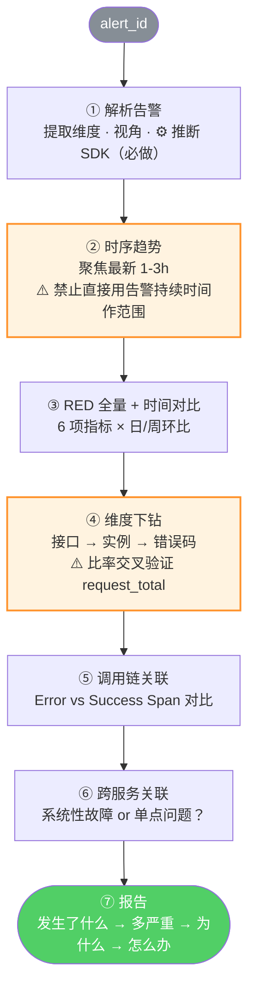

### 7.2 健康巡检工作流

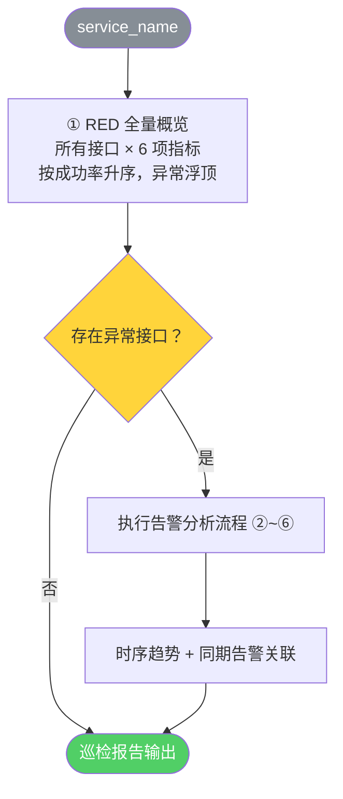

两种使用模式满足不同需求：

| | 工作流模式 | 专家模式 |
|---|---|---|
| **适合** | 告警分析、健康巡检 | 自定义分析、数据探索 |
| **约束** | 步骤强约束，关键步骤不可跳过 | 自由组合原子脚本 |
| **Skill 保障** | 流程完整性 + 结论可信度 | 数据可信 + 语义正确 |

---

## 八、完整案例：有无 Skill 的差距

**告警**：`h5game.gateway` 主调成功率 < 99%，持续 47 分钟，已恢复

**没有 Skill，通用 AI 的典型输出**：

> 根据告警信息，服务 `h5game.gateway` 的主调成功率低于阈值，可能原因包括：下游服务不稳定、网络抖动、资源不足。建议排查下游服务 `platform-auth` 的健康状态，以及查看相关主机的 CPU/内存指标。

结论模糊，无数据支撑，无法操作。

**有 Skill 的推理链**：

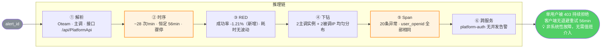

三个关键转折，缺任何一个都会走向错误结论：

- **步骤②（时序形态）**：恒定速率排除系统性故障 → 否则步骤④「实例均匀分布」时就会止步，误判下游故障
- **步骤⑤（Span 对比）**：`user_openid` 聚集 → 根因从「接口出问题」精确到「单一用户会话」
- **步骤⑥（跨服务关联）**：排除「下游系统性故障恰好先影响该用户」的可能 → 否则结论仍然不完整

**差距不是 AI 更聪明了，而是它不再有选择：关键步骤被固化为不可跳过的约束。**

---

## 九、可推广的方法论

这不只是一个 tRPC 排障 Skill 的设计故事。它揭示了一个更通用的命题：

**如何让通用大模型具备垂直领域的专家能力？**

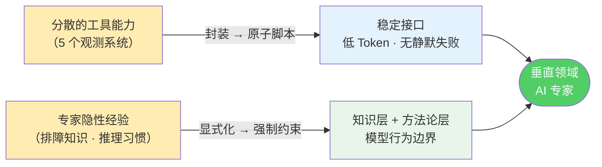

两条路径，对应两类不同的工程问题：

**工具封装**：解决「AI 能拿到什么数据」的问题。核心原则是降低 AI 的认知负荷——把复杂的查询构建、分页处理、格式转换都移到 AI 的上下文之外，让 AI 只需要声明「我要什么」。

**经验固化**：解决「AI 知道什么、必须做什么」的问题。关键在于区分两类知识：
- **数据含义**（字段语义、指标约束、跨系统映射）→ 知识层
- **推理习惯**（时序优先、比率交叉验证、对比分析）→ 方法论层

两类知识的固化方式不同。数据含义是静态约束，适合以 lookup table 形式编码进知识层；推理习惯是条件逻辑，需要编码为带前置条件的工作流规则。混淆两者，是 AI Agent 工程化中最常见的设计错误。

**经验的最高价值，不是传授，而是固化。**

传授依赖人，随人员流动消散。固化进 Skill，不依赖传承，不因人而异，不会随时间磨损。

这是 AI Agent 工程化的核心命题，也是可观测性领域最值得做的那件事：**让专家经验成为系统能力，而不是个人资产。**

---

> **版本**：v10.0 ｜ **准确性基准**：bk-rpc-inspection Skill 完整源码（SKILL.md + 15 个 references 文件）
