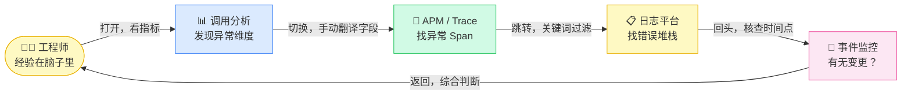
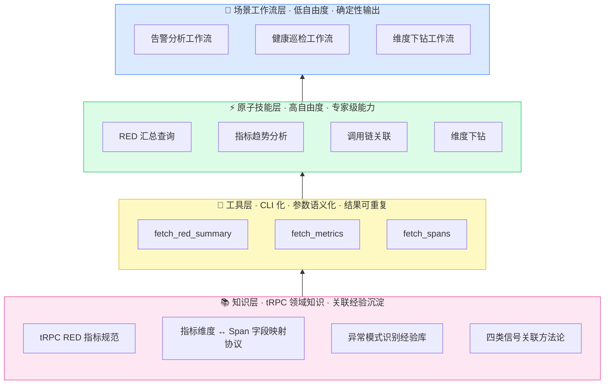
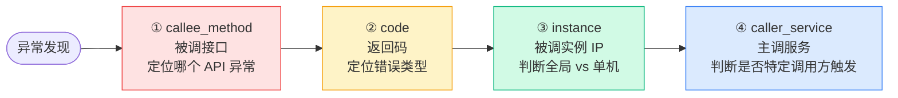
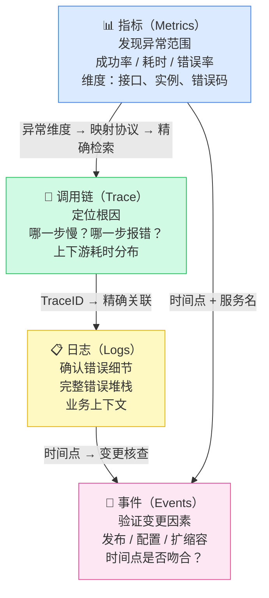
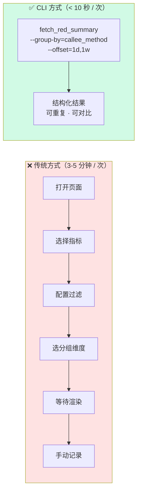
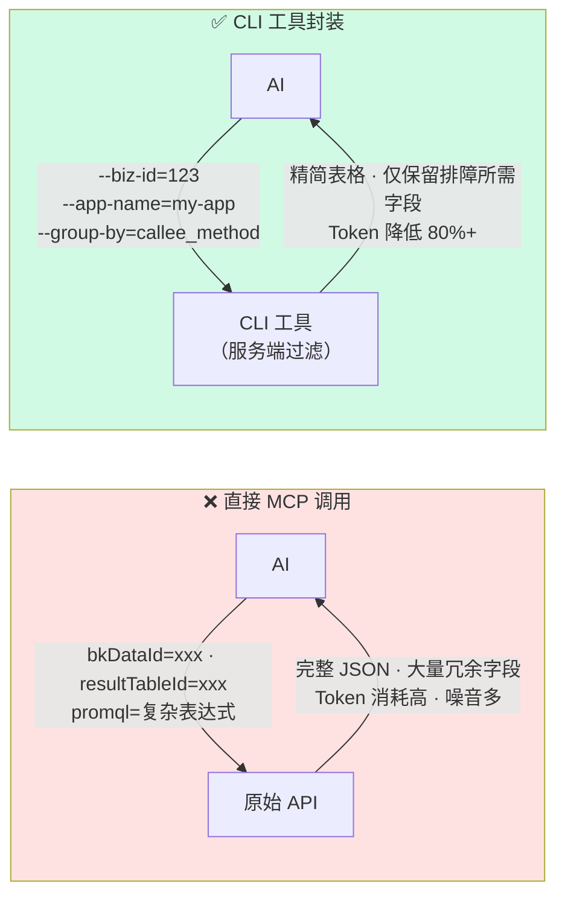
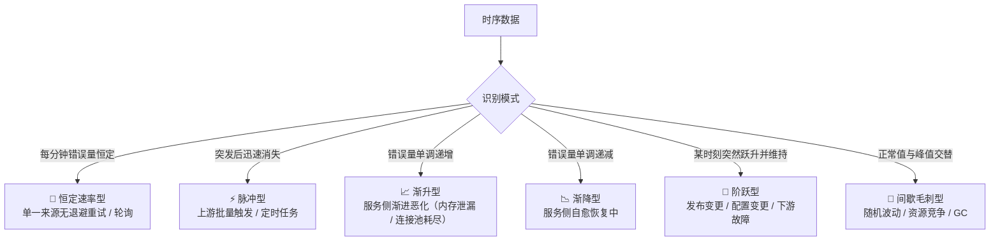
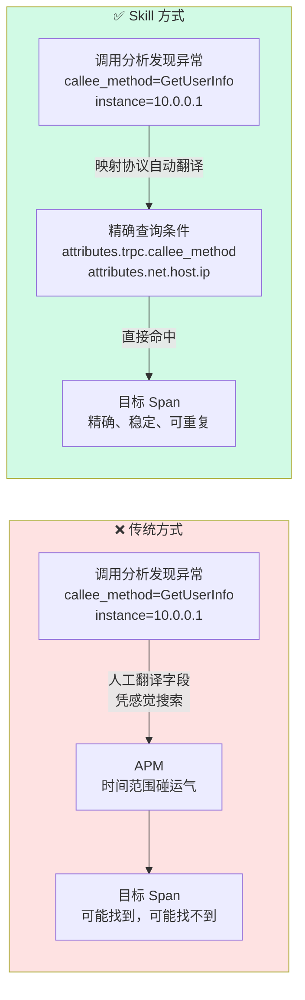
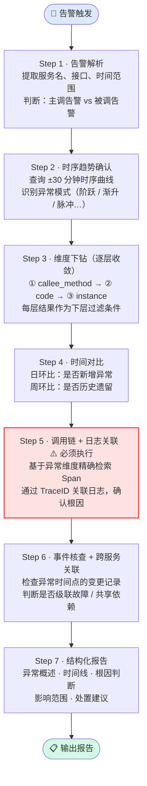
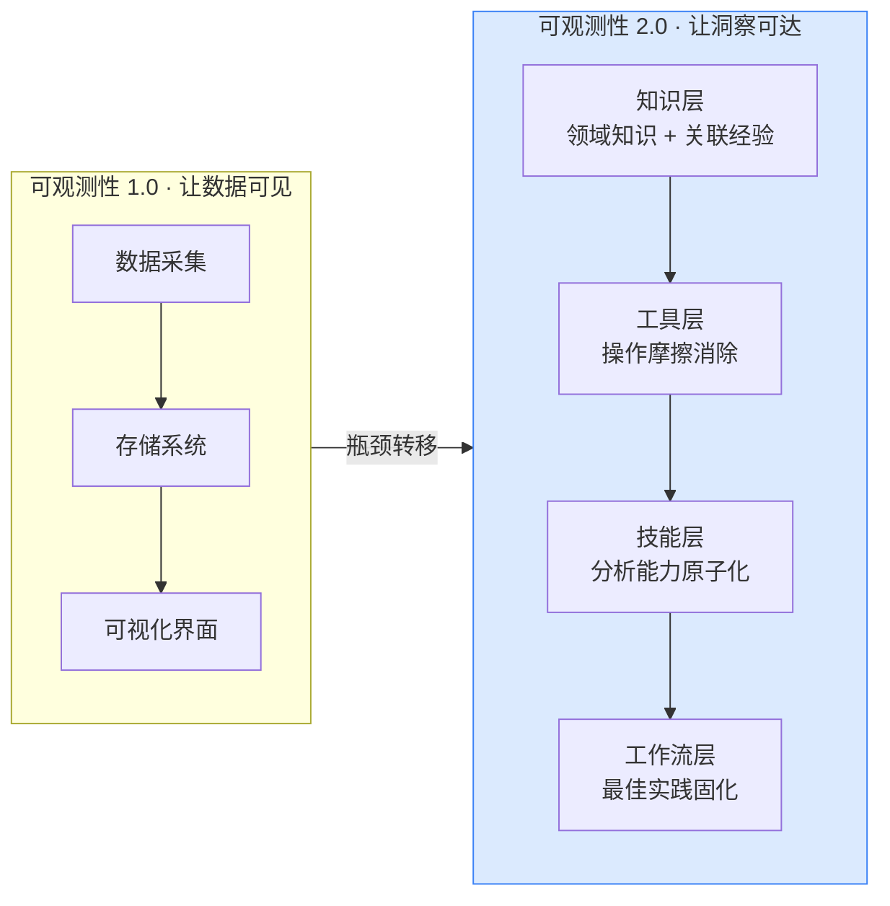

# 经验即代码：用 AI Skills 重构 RPC 排障

> **一句话 Takeaway**：可观测性的瓶颈从未是数据不够用，而是经验无法规模化——Skills 化，是让排障经验像代码一样可复用的工程实践。

---

## 一、每次排障，都在重复消耗同一批经验

凌晨告警响应，或者早上例行巡检——工程师做的事情本质上是一样的：

```
调用分析 → 哪个接口异常？
  → APM   → 在几百条 Span 里找那几条异常的
  → 日志平台 → 关键词过滤，找错误堆栈
  → 事件监控 → 有没有发布变更？
  → 主机监控 → CPU / 内存有没有异常？
  → 回到调用分析 → 综合判断，写结论
```

巡检走完这个流程要 30-45 分钟，告警响应要 20-40 分钟。

**这不是分析，这是搬运。** 把散落在四个系统里的数据，靠人工一条一条拼在一起。

更深的问题不是操作繁琐，而是：**把四类信号关联起来，依赖的是工程师脑子里那套经验**——

- 成功率下降，先看哪个维度？
- 指标里的 `callee_method=GetUserInfo`，对应 APM 里哪个字段？
- 看到阶跃型曲线，应该去查变更记录还是资源指标？

这些判断逻辑**既不可见，也不可传承**。下次同类问题，你的同事还是要从零推导，走同样的路，花同样的时间。



> **核心矛盾：数据早已齐全，但四类信号的关联经验只存在于少数人脑子里。每次排障，团队都在重新消耗同一批无法共享的认知资源。**

这就是这套 RPC 排障 Skill 要解决的问题：**将四类信号的关联方式、分析方法论、领域知识，编码为可复用的 AI 技能**，让每一次排障都站在"专家肩膀上"。

---

## 二、第一性原理：排障是什么？

$$\text{排障} = \underbrace{\text{信息检索}}_{\text{可自动化}} + \underbrace{\text{因果推断}}_{\text{可被辅助}}$$

**信息检索是可以自动化的。** 哪个接口异常、对应的 Span 是哪些、关联的日志是什么——这些都是确定性的查询动作，没有理由由工程师手动完成。

**因果推断是可以被辅助的。** 维度下钻的顺序、时间对比策略、异常模式识别、四类信号的关联方式——这些都是可以形式化的**领域经验**，无需每次依赖人工重新推导。

因此，提升排障效率只有两条路：

| 路径 | 做法 | 收益 |
|------|------|------|
| 降低信息检索成本 | 把分散的数据获取动作 CLI 化、自动化 | 消除操作摩擦，从分钟级到秒级 |
| 提升因果推断质量 | 把关联经验和分析方法论编码进 AI | 从"靠运气"到"专家级稳定输出" |

这就是 **Skills 化**的本质——

> 不是让 AI 替代工程师判断，而是将**四类信号的关联经验**（指标↔调用链↔日志↔事件）和**分析方法论**（维度下钻、时序分析、异常模式识别）编码为可复用的 Skill，让 AI 成为具备专业背景的排障协作者。

---

## 三、三个递进洞察

**经验可以被编码 → 但编码需要消除语义鸿沟 → 消除后才能构建可靠的工作流**

---

### 洞察一：排障经验是可编码的

很多人认为排障是"艺术"，依赖直觉，难以标准化。但仔细拆解会发现，大多数排障动作都有清晰的、可复现的逻辑。

一个反例先说清楚：**同样是"成功率下降"，有经验的工程师会先看流量，没经验的工程师会直接看错误码。** 低流量（QPS < 10）下，1-2 个错误就能让成功率跌到 80%——这是噪音，不是信号。这个判断逻辑不是直觉，是可以被编码的规则。

类似的逻辑还有很多：

- **维度下钻顺序**：接口（定位哪个 API）→ 错误码（定位错误类型）→ 实例（全局 vs 单机）→ 主调（是否特定调用方触发）
- **时间对比策略**：日环比判断是否新增，周环比判断是否历史遗留
- **异常模式对应关系**：阶跃型 → 变更或下游故障；渐升型 → 资源耗尽；恒定速率型 → 无退避重试
- **四类信号关联逻辑**：指标定位范围 → 调用链找根因 → 日志确认错误 → 事件验证变更

**把这些逻辑编码进 Skill，每次分析自动执行，不依赖工程师的经验深度。**

---

### 洞察二：指标与调用链的语义鸿沟，是最大的效率杀手

这是一个被严重低估的问题，也是"经验可编码"能否真正落地的关键障碍。

工程师在调用分析里发现了异常：`callee_method=GetUserInfo`、`instance=10.0.0.1`、`code=101`。接下来要去 APM 里找对应的 Span，但 APM 的搜索框需要 Span 字段，不是指标维度。

**两个系统描述的是同一件事，但用的是不同的"语言"。**

| 调用分析维度 | APM Span 字段 |
|-------------|--------------|
| `callee_method` | `attributes.trpc.callee_method` |
| `instance` | `attributes.net.host.ip` |
| `code` | `attributes.trpc.status_code` |

没有这张映射表，工程师只能凭感觉搜索，靠时间范围碰运气。有了这张映射表，从"发现异常维度"到"精确检索 Span"就变成了确定性的操作。

**消除语义鸿沟，是整个 Skill 最核心的技术设计——它让"指标→调用链→日志"的关联分析变得稳定、可重复。**

---

### 洞察三：确定性工作流 + 原子技能，才是正确的 AI 协作姿势

有了可编码的经验，有了消除语义鸿沟的映射协议，下一步是如何让 AI 稳定地使用它们。

AI 有两种使用方式，各有适用场景：

- **低自由度工作流**：对于高频场景（告警分析、健康巡检），固定分析步骤，确保每次输出稳定、完整，不依赖提示词质量
- **高自由度原子技能**：对于自定义分析，提供 RED 查询、维度下钻、调用链关联等原子能力，工程师可以自由组合

两者缺一不可。只有工作流，灵活性不足；只有原子技能，高频场景输出不稳定。

---

## 四、架构设计：四层分层体系



**设计哲学**：越靠下越稳定、越通用；越靠上越具体、越面向场景。

- **知识层**是地基——沉淀 tRPC 领域知识和四类信号的关联经验，决定 AI 的分析深度
- **工具层**是骨架——CLI 化的数据获取，决定分析的稳定性和可重复性
- **原子技能层**是肌肉——可自由组合的分析能力，适配自定义分析场景
- **工作流层**是大脑——将经验固化为高频场景的确定性输出

---

## 五、知识层：沉淀两类经验

AI 能做出专家级判断，前提是具备两类知识：**tRPC 领域知识**（指标含义、维度说明）和**关联经验**（四类信号如何互相印证）。

### 5.1 RED 指标全景

RED 方法论（Rate · Errors · Duration）是服务健康度的最小完备描述。对 tRPC 服务而言，有两个视角：

**被调侧（`rpc_server_handled_*`）**——服务自身的健康状态：

| 类别 | 指标名 | 含义 | 排障用途 |
|------|--------|------|----------|
| **Rate** | `rpc_server_handled_total` | 总请求数 | 流量基线，**防低流量误判** |
| **Errors** | `rpc_server_handled_success_rate` | 成功率 | 核心健康指标，告警主要依据 |
| **Errors** | `rpc_server_handled_exception_rate` | 异常率 | 区分业务异常 vs 框架异常 |
| **Errors** | `rpc_server_handled_timeout_rate` | 超时率 | 定位下游超时 vs 本地处理慢 |
| **Duration** | `rpc_server_handled_avg_duration` | 平均耗时 | 性能基线 |
| **Duration** | `rpc_server_handled_p99_duration` | P99 耗时 | 长尾问题定位 |

**主调侧（`rpc_client_handled_*`）**——服务对外调用的健康状态：

| 类别 | 指标名 | 含义 | 排障用途 |
|------|--------|------|----------|
| **Rate** | `rpc_client_handled_total` | 主调总请求数 | 判断主调视角流量 |
| **Errors** | `rpc_client_handled_success_rate` | 主调成功率 | 与被调成功率对比，**定位网络 / 中间件问题** |
| **Errors** | `rpc_client_handled_timeout_rate` | 主调超时率 | 定位下游响应慢 |
| **Duration** | `rpc_client_handled_avg_duration` | 主调平均耗时 | 含网络耗时，与被调耗时对比 |

> ⚠️ **低流量陷阱**：成功率告警时，**必须先看 `rpc_server_handled_total`**。QPS < 10 时，1-2 个错误就能让成功率跌到 80%——这是噪音。Skill 会自动执行这个交叉验证，避免误判。

**维度下钻路径**——发现异常后，按这个顺序逐层收敛：



每一层的结果都是下一层的过滤条件，逐步缩小问题范围，避免过早下结论。

### 5.2 四类信号关联方法论

这是知识层最重要的部分——沉淀了**指标、调用链、日志、事件如何互相印证**的关联经验：



| 从 | 到 | 关联方式 | 关联的价值 |
|----|----|---------|-----------| 
| 指标 | 调用链 | 异常维度 → 映射协议 → Span 字段 | 从"哪里异常"到"为什么异常" |
| 调用链 | 日志 | TraceID → 精确日志检索 | 从"哪一步报错"到"错误的完整上下文" |
| 指标 | 事件 | 异常时间点 → 变更记录核查 | 从"什么时候开始异常"到"是否有变更触发" |

没有这套关联方法论，AI 只能各自独立地查询四个系统，得到四堆孤立的数据。**这是 Skill 与"直接问 AI"最本质的区别。**

### 5.3 Span 字段映射协议：消除语义鸿沟的关键

调用分析的维度名和 APM Span 的字段名不一致——两套系统，两套语言，描述的是同一件事。映射表将指标维度精确翻译为 Span 查询条件：

| 调用分析维度 | APM Span 字段 | 字段类型 | 说明 |
|-------------|--------------|----------|------|
| `callee_method` | `attributes.trpc.callee_method` | Attribute | 被调接口名 |
| `caller_method` | `attributes.trpc.caller_method` | Attribute | 主调接口名 |
| `instance`（被调实例 IP）| `attributes.net.host.ip` | Attribute | 实例维度 |
| `code`（tRPC 状态码）| `attributes.trpc.status_code` | Attribute | 错误码 |
| `service_name` | `resource.service.name` | Resource | 服务名 |
| 被调侧视角 | `kind: 2`（SERVER）或 `kind: 5`（CONSUMER）| Span Kind | 区分主被调 |

有了这张映射表，从"发现异常维度"到"精确检索 Span"变成了**确定性的查询操作**，不再依赖经验和运气。

---

## 六、工具层：CLI 化，消除操作摩擦

### 6.1 为什么要 CLI 化？

**CLI 化的本质，是把"人机交互的操作成本"转化为"参数传递的语言成本"。** 前者无法被 AI 执行，后者可以。



### 6.2 CLI vs 直接 MCP 调用

MCP（Model Context Protocol）是 AI 调用外部工具的通用协议。理论上可以直接把监控平台的原始 API 封装为 MCP 工具。但这样做有两个严重问题：

**问题一：Token 消耗爆炸，有效信息被噪音淹没**

原始 API 返回完整的 JSON 响应，包含大量 AI 不需要的字段、元数据、嵌套结构。每次调用都把这些原始数据塞进上下文，上下文窗口的有限空间被低价值信息占满。

CLI 工具做了两件事：**在服务端过滤**（只返回排障所需字段）+ **结构化输出**（表格 / 精简 JSON），Token 消耗降低 80% 以上。

**问题二：原始 API 参数对 AI 不友好，调用准确率低**

原始 API 的参数往往是技术性的内部标识——`bkDataId`、`resultTableId`、`promql` 表达式……AI 需要从上下文推断这些参数的含义和正确取值，极易出错。

CLI 工具用**语义化参数**封装了这些细节：`--biz-id`、`--app-name`、`--service-name`。参数名即含义，AI 无需推断。



### 6.3 三个核心工具

**① fetch_red_summary — 快速汇总，发现异常分布**

```bash
fetch_red_summary \
  --biz-id=123 --app-name=my-app --service-name=my-service \
  --metric=rpc_server_handled_success_rate \
  --group-by=callee_method \
  --start-time="2024-03-15 10:00:00" \
  --end-time="2024-03-15 10:30:00" \
  --offset="1d,1w"    # 自动输出今日 vs 昨日 vs 上周对比
```

**② fetch_metrics — 时序趋势，识别异常波动模式**

```bash
fetch_metrics \
  --biz-id=123 \
  --promql='sum by (callee_method)(
      increase(rpc_server_handled_total{
        service_name="my-service", code_type="success"
      }[1m])
    )' \
  --start-time="2024-03-15 09:00:00" \
  --end-time="2024-03-15 11:00:00" \
  --step=1m
```

**③ fetch_spans — 从维度直达 Span，消除语义鸿沟**

```bash
fetch_spans \
  --biz-id=123 --app-name=my-app \
  --query-string='
    resource.service.name: "my-service"
    AND attributes.trpc.callee_method: "GetUserInfo"
    AND attributes.net.host.ip: "10.0.0.1"
    AND attributes.trpc.status_code: 101
    AND kind:(2 OR 5)
  ' \
  --start-time="2024-03-15 10:00:00" \
  --end-time="2024-03-15 10:30:00"
```

---

## 七、原子技能层：两把精准的手术刀

### 手术刀一：指标趋势分析——让时序数据"开口说话"

时序数据不只是数字，它的**形态**本身就携带着根因信息。Skill 内置了 6 种异常模式的识别逻辑：



同样是"成功率下降"，阶跃型首先看变更记录，渐升型首先看资源指标，恒定速率型首先找重试来源——分析方向完全不同。**模式识别，决定了排障的起点是否正确。**

### 手术刀二：调用链关联——从"碰运气"到"精确命中"



---

## 八、场景工作流层：告警分析的 7 步标准流程

有了前三层的支撑，告警分析变成了一个**确定性的执行流程**，而不是依赖经验的人工判断。



> ⚠️ **Step 5 为什么标红？** 指标只能告诉你"哪里异常"，Span 告诉你"哪一步慢"，日志告诉你"错误是什么"。三者缺一，分析就是不完整的——没有完成调用链 + 日志关联就下结论，是最常见的误判来源。

---

## 九、效果

| 维度 | 传统方式 | Skill 方式 |
|------|----------|------------|
| 告警响应时间 | 20-40 分钟 | 3-5 分钟 |
| 日常排障耗时 | 30-45 分钟 | 5-10 分钟 |
| 分析一致性 | 因人而异，依赖经验深度 | 标准化工作流，输出稳定 |
| 新人上手成本 | 需熟悉多系统 + 积累排障经验 | 自然语言描述问题即可 |
| 经验传承 | 口口相传，人走经验走 | 编码在 Skill 中，持续复用 |

数字背后更重要的是：**排障不再是少数有经验工程师的专属能力，而是团队可以共享的标准化流程。**

---

## 十、更大的意义：可观测性的下一个阶段

过去十年，可观测性工程的重心在于**让数据可见**——建设采集管道、存储系统、可视化界面。这个阶段基本完成了。

**但数据齐全，不等于洞察高效。** 真正的瓶颈已经从"数据是否存在"转移到了"如何从数据快速得到洞察"。



Skills 化，是**将可观测性的价值从"数据层"延伸到"洞察层"**：

- **领域知识**：tRPC 指标含义、维度说明 → AI 能读懂数据
- **关联经验**：指标↔调用链↔日志↔事件的关联方式 → AI 能串联四类信号
- **分析方法论**：维度下钻、时序分析、异常模式识别 → AI 能做出专家级判断

### 可扩展方向

RPC 排障 Skill 只是第一个落地场景，相同的分层设计可以延伸到：

| 方向 | 描述 |
|------|------|
| 日志异常聚类 | 与调用分析指标联动，自动关联日志平台异常日志 |
| 主机监控关联 | CPU / 内存 / 网络与 RPC 指标的因果分析 |
| 变更事件关联 | 发布变更自动纳入告警分析上下文 |
| 级联故障识别 | 多服务异常自动关联，识别故障传播链路 |
| SLO 影响评估 | 告警发生时自动评估用户端感知影响 |

---

## 结语

可观测性工程做了十年，我们建设了越来越好的数据基础设施。但有一件事我们一直没有做：**把使用这些数据的经验，系统性地沉淀下来。**

每一次排障，团队里最有经验的工程师把四类信号关联起来、找到根因——这个过程里用到的判断逻辑，消散在空气里，下次还要重来。

Skills 化，是在做一件朴素但重要的事：**让经验像代码一样可复用。**

> 将关联经验编码化，将排障方法论工作流化，将可观测数据获取 CLI 化。
>
> 让每一位工程师，无论经验深浅，都能以专家级的效率和一致性来排障。
>
> **这是可观测性工程的下一个阶段：不只是让数据可见，而是让洞察可达。**

---

## 附：PPT 页面结构（12 页）

| 页码 | 标题 | 核心信息 | 视觉形式 |
|------|------|----------|----------|
| **P1** | 封面 | 经验即代码：用 AI Skills 重构 RPC 排障 | 大字标题 + Takeaway |
| **P2** | 每次排障，都在重复消耗同一批经验 | 搬运路径代码块 + 循环图 + 核心矛盾 | 代码块 + `graph LR` |
| **P3** | 第一性原理 | 排障 = 信息检索 + 因果推断；两条提升路径；Skills 化定义 | 公式 + 对比表 |
| **P4** | 三个递进洞察 | 经验可编码 → 消除语义鸿沟 → 双模式协作 | 三栏卡片 **重点页** |
| **P5** | 四层架构 | 知识层 / 工具层 / 原子技能 / 工作流 | `graph BT` **重点页** |
| **P6** | 知识层：RED 指标全景 | 主被调指标表 + 维度下钻路径 + 低流量陷阱 | 表格 + `graph LR` |
| **P7** | 知识层：四类信号关联方法论 | 四类信号关联图 + 关联表 + 语义鸿沟映射表 | `graph TD` + 表格 |
| **P8** | 工具层：CLI 化 + CLI vs MCP | 传统 vs CLI；Token 与理解准确性优势 | `graph LR` 对比 |
| **P9** | 工作流：告警分析 7 步 | 步骤流程 + Step 5 标红说明 | `flowchart TD` **重点页** |
| **P10** | 异常模式识别 | 6 种模式 + 对应根因方向 | `graph TD` |
| **P11** | 效果对比 | Before/After 对比表 | 表格 |
| **P12** | 可观测性 2.0 + 结语 | 瓶颈转移；结语三句话 | `graph LR` + 引用块 |

---

*文档版本：v9.0 · 标题重写突出「经验即代码」核心主张 · 架构图方向修正为 BT（底部→顶部）与设计哲学一致 · 第一性原理公式视觉强化 · 洞察一补充反例增强说服力 · CLI vs MCP 图精简 · 效果表去掉未经验证的倍数数字 · 结语重写直击本质*
