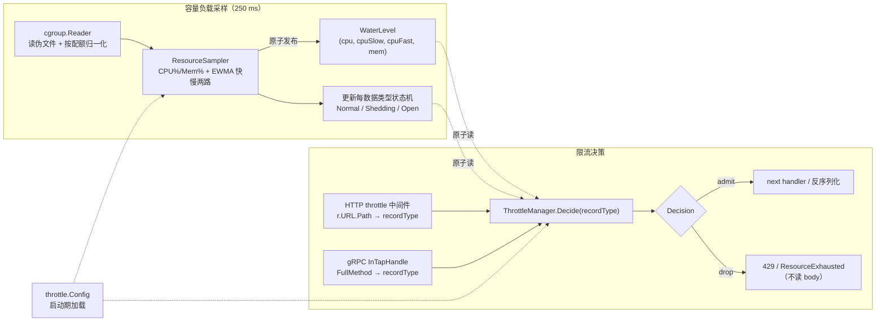
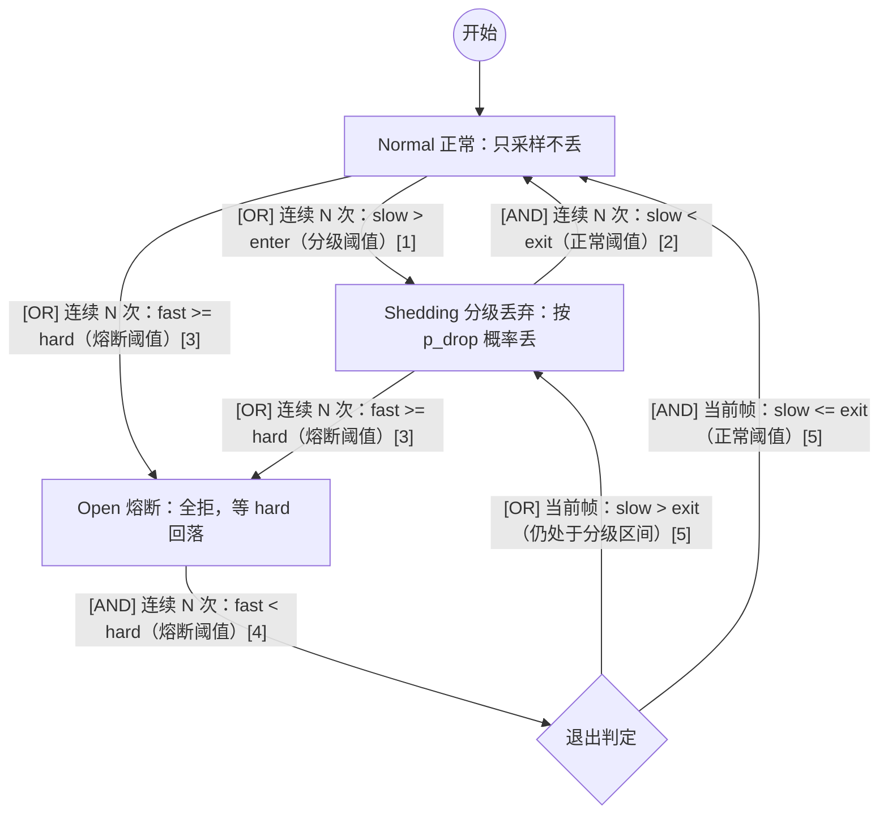
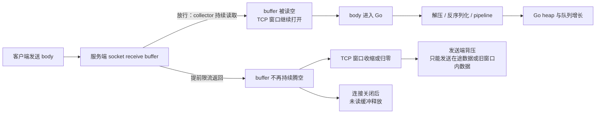
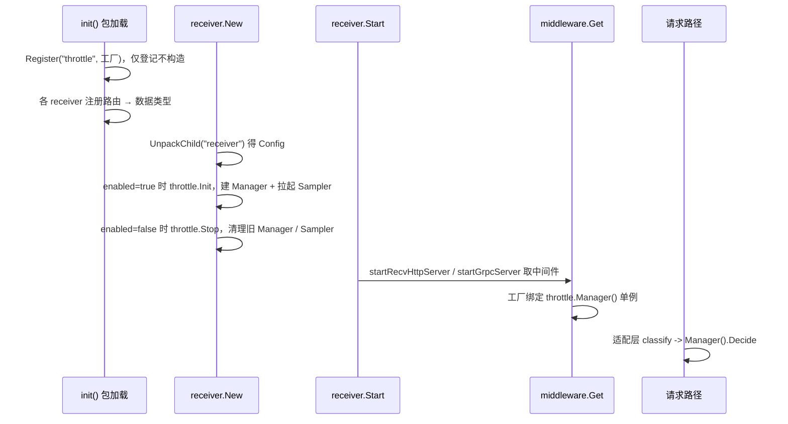

# bk-collector 自适应限流方案

## 0x01 调研与约束

### a. 问题与目标

bk-collector 被突发流量打满 CPU、内存而崩溃，崩溃后重启又被堆积重试二次压垮，导致持续 OOM。

现有限流（QPS、`maxconns`、`maxbytes`）效果不佳：
* Traces 等数据类型攒批发送，单个包 5 MB、100 QPS 未超限仍然能产生 500 MB/s 的流量。
* 限流不够精细，按数据类型（traces / metrics / logs / profiles）分级主动丢请求，主动拒绝部分数据，保障高优数据类型。

### b. 选型结论

CPU 水位平滑分级丢弃为主体，内存沿用同一套阈值 slot：CPU 提供慢、快两路信号，内存把同一个原始水位同时作为 slow 和 fast。

| 信号 slot | 输入 | 角色 | 触发动作 |
| --- | --- | --- | --- |
| `thresholds.cpu` | `slow=cpuSlow`、`fast=cpuFast` | 主限流与 CPU 跳闸 | `slow` 连续越 enter 线后分级丢弃，`fast` 连续越 hard 线后熔断。 |
| `thresholds.mem` | `slow=mem`、`fast=mem` | 内存保压与保命 | 同样走 enter / exit / hard / `breach_n`，默认可把 `breach_n` 配成 `1`，抢在内核 OOM 前止血。 |


### c. 硬约束（来自现状代码）

| 约束         | 事实                                                                                        | 来源                                                                                                                                                         |
|------------|-------------------------------------------------------------------------------------------|------------------------------------------------------------------------------------------------------------------------------------------------------------|
| 挂载层        | 限流只在 HTTP / gRPC 中间件层，不侵入 pipeline、processor                                              | [issue README](./README.md)                                                                                                                                |
| HTTP 中间件形态 | `func(http.Handler) http.Handler`，按 `middlewares` 列表顺序包裹整个 handler                        | [<源码> httpmiddleware/middleware.go](https://github.com/TencentBlueKing/bkmonitor-datalink/blob/master/pkg/collector/internal/httpmiddleware/middleware.go) |
| gRPC 中间件形态 | 每个中间件产出一个 `grpc.ServerOption`，append 到 server                                             | [<源码> grpcmiddleware/middleware.go](https://github.com/TencentBlueKing/bkmonitor-datalink/blob/master/pkg/collector/internal/grpcmiddleware/middleware.go) |
| 配置形态       | 中间件列表项是扁平 optmap 串 `name;k=v`，装不下分级丢弃配置                                                   | [example.yml](https://github.com/TencentBlueKing/bkmonitor-datalink/blob/master/pkg/collector/example/example.yml)                                         |
| 数据类型       | collector 已有 `define.RecordType`（`traces`、`metrics`、`logs`、`profiles` 等），各 receiver 入站即定型 | [<源码> define/record.go](https://github.com/TencentBlueKing/bkmonitor-datalink/blob/master/pkg/collector/define/record.go)                                  |
| 有效核数       | `define.CoreNum()` 默认回退 `runtime.NumCPU()`（宿主核数），不能直接当归一化分母                               | [<源码> define/concurrency.go](https://github.com/TencentBlueKing/bkmonitor-datalink/blob/master/pkg/collector/define/concurrency.go)                        |
| 无采样回路      | 进程内无 CPU、内存水位采样，仅 admin `/metrics` 暴露 `process_*`、`go_*`                                  | [<源码> receiver/metrics.go](https://github.com/TencentBlueKing/bkmonitor-datalink/blob/master/pkg/collector/receiver/metrics.go)                            |
| Go 版本      | `go 1.23.0`，`automaxprocs v1.5.2` 仅做日志、未调 `Set()`，没有 Go 1.25 的配额感知红利                      | [<源码> collector/go.mod](https://github.com/TencentBlueKing/bkmonitor-datalink/blob/master/pkg/collector/go.mod)                                            |

---

## 0x02 架构设计

### a. 总体思路

过载保护改用容器 cgroup 的真实水位驱动，在入口按数据类型分级决定每个请求是否放行。

限流粒度取数据类型而非单个 Endpoint，理由有两条：

- Endpoint 粒度过细会让配置爆炸、状态机数量不可控。
- 数据类型才是运营想区分的维度（如「保 metrics、可丢 traces」），且与 collector 既有 `define.RecordType` 对得上。

### b. 信号职责：CPU 主限流，内存兼做软线与硬线

为什么 CPU 当主信号？

- CPU 超限只触发 CFS 节流，处理变慢但进程仍在；内存超限会被 OOM Killer 直接终止，不可逆。
- CPU 节流能保护吞吐又不积压内存，业界主信号都用 CPU：go-zero、Kratos 的自适应丢弃以 CPU 为准。

为什么内存要拆软、硬两条线？

- 单纯依赖硬线追不上 Go runtime 的回收节奏，工作集冲到熔断线时往往已经晚了一拍。
- 软线 `mem.enter` / `mem.exit` 让内存压力一抬头就开始按概率丢，给 GC 留出回收窗口。
- 硬线 `mem.hard` 只做兜底，一旦命中就全拒，抢在内核 OOM 之前止血（参考 Envoy overload manager 的堆压力门控）。

### c. 核心对象模型

采样慢回路与决策快回路解耦：背景每 `250 ms` 采样、原子发布水位，请求路径只做原子读与概率判定，每请求不碰 `/sys/fs/cgroup` 与 `/proc`。

容量负载采样与限流决策解耦：
* 采样：每 `250 ms` 采样 CPU、内存容量负载，更新负载水位，并推动状态机更新。
* 限流决策：根据状态按比例进行流控。



| 对象                | 职责                                                                                       |
|-------------------|------------------------------------------------------------------------------------------|
| `cgroup.Reader`   | 读取容量（CPU、内存限额），当前负载（CPU 使用率、内存使用率（不含 Cache））                                             |
| `ResourceSampler` | 按周期采样，预处理负载信号并推进状态机                                                                      |
| `WaterLevel`      | 不可变水位快照，含原始 CPU / 内存水位、CPU 快慢信号；内存只暴露原始读数，软硬线判定都直接吃这一份                                  |
| `classify`        | 维护「路由 → 数据类型」注册表，receiver 用本地路由常量声明参与限流的 HTTP 路径 / gRPC 全方法名，未命中放行                       |
| `ThrottleManager` | 持有限流策略、每数据类型状态机与最新水位，负责决策当前请求是否执行流控                                                   |
| `Rule`            | 单数据类型的丢弃强度（`drop_min` / `drop_max`、`enabled`），阈值全局共用                                     |
| `Decision`        | 限流决策：通过、按比例流控降级、熔断                                                                       |

`stateSlot` 与 `recordState` 是 `ThrottleManager` 的内部状态模型，不作为采样、路由、请求路径之间的独立协作组件。前者承载单个资源信号的连续计数，后者承载单个数据类型的三态机。

### d. 决策状态机

每个数据类型仍只有一台三态机。采样帧先被整理成若干有效信号槽，每个信号槽都有 `slow`、`fast`、`enter`、`exit`、`hard` 和 `breach_n`。状态机不关心信号来自 CPU 还是内存，只按 OR / AND 聚合这些槽的判断结果。

CPU 与内存只在信号映射上不同：

| 信号槽 | slow 输入 | fast 输入 | valid 语义 | 默认连续门控 |
| --- | --- | --- | --- | --- |
| `cpu` | `WaterLevel.CPUSlow` | `WaterLevel.CPUFast` | CPU 采样成功后持续有效 | `3` |
| `mem` | `WaterLevel.Mem` | `WaterLevel.Mem` | `MemValid=false` 时跳过该 slot，视为安全 | `1` |

禁用或无效信号槽不参与进入、熔断和丢弃概率计算，也不阻塞退出。这样内存读不到 cgroup limit 时，系统退化为纯 CPU 限流，不会因为无效内存值误丢。



| 状态 | 请求路径动作 | 转移语义 |
| --- | --- | --- |
| `Normal（正常）` | 全部放行 | 初始态；任一有效信号槽满足分级阈值后进入 `Shedding`。 |
| `Shedding（分级丢弃）` | 按 `p_drop(max(t_slot...))` 概率丢 | 只要任一有效信号槽满足熔断阈值，就进入 `Open`；全部有效信号槽满足正常阈值后回到 `Normal`。 |
| `Open（跳闸）` | 熔断 | 先等待全部参与判定的信号槽满足熔断恢复阈值；离开 `Open` 后，再按 soft 水位落到 `Shedding` 或 `Normal`。 |

- *[1] 分级进入是 OR：任一有效信号槽的 `slow > enter` 连续达到自己的 `breach_n`，状态机进入 `Shedding`。*
- *[2] `Shedding` 正常退出是 AND：全部有效信号槽的 `slow < exit` 连续达到各自 `breach_n`，状态机回到 `Normal`。*
- *[3] 熔断进入是 OR：任一有效信号槽的 `fast >= hard` 连续达到自己的 `breach_n`，状态机进入 `Open`。*
- *[4] 熔断恢复是 AND：全部参与判定的信号槽满足 `fast < hard`，且连续达到各自 `breach_n` 后才允许退出 `Open`；禁用或无效信号槽视为安全。*
- *[5] `Open` 的落点判定只看当前 soft 水位：任一有效信号槽仍 `slow > exit` 则落到 `Shedding`，全部有效信号槽都 `slow <= exit` 才回 `Normal`。*

把 CPU 三条阈值线、滞回带与快慢两路信号落到同一时间轴，对照状态机看转移时机：

```text
水位
0.95 |                  /\                  快信号 fast（β=0.7）：灵敏，抢先冲顶
0.90 |=================/  \==============   硬线 cpu.hard：fast 越线且连续 cpu.breach_n 次 → Open 全拒
     |        ________/    \________        慢信号 slow（β=0.95）：平滑，不贴线抖
0.80 |-------/----------------------\----   进入线 cpu.enter：slow 升过 → Shedding 按 p_drop 概率丢
     |      /                        \      （0.70～0.80 为滞回带：升过 0.80 才丢、跌回 0.70 才停）
0.70 |-----/--------------------------\--   退出线 cpu.exit：slow 跌回 → 停丢
     |.:*:.                            .:*. 原始采样（抖）经 EWMA 平滑成上面两条曲线
     +----+----------+------+-----------+-→ 时间
        Normal    Shedding  Open    → Normal
```

CPU 滞回带（`0.70`～`0.80`）防抖，让分级进退不在单一阈值上横跳。

内存信号沿用同样的滞回带与连续门控，只是不做 EWMA：

```text
水位
0.92 |       /\                              硬线 mem.hard：fast=mem 越线且连续 mem.breach_n 次 → Open 全拒
0.85 |======/= \=============                进入线 mem.enter：slow=mem 连续 mem.breach_n 次越线 → Shedding 参与按概率丢
     |     /    \________                    （0.78～0.85 为滞回带：升过 0.85 才丢、跌回 0.78 才停）
0.78 |----/-------------\----                退出线 mem.exit：slow=mem 连续 mem.breach_n 次跌回 → 停丢
     |.:*:.              .:*.                原始水位 mem（不做 EWMA，直接吃 working set）
     +----+----------+------+-→ 时间
        Normal   Shedding  Open → Normal
```

内存滞回带（`0.78`～`0.85`）防抖。`mem.breach_n` 同时控制内存软线、硬线和 hard clear；当前保命策略建议缺省 `1`，需要过滤毛刺时只调配置值，不改状态机。

### e. 限流位置

1）HTTP：
* 放在 `content_decompressor` 之前，不提前解压。
* 按 `r.URL.Path` 归类数据类型后判定，丢弃返回 `429`，并写入 `0`～`30` 秒随机 `Retry-After`。


2）gRPC：
* 注册为 [grpc.InTapHandle](https://pkg.go.dev/github.com/bwhour/go-grpc/lib/grpc#InTapHandle)，在 PB 反序列化之前完成限流判定，
* 按 `info.FullMethodName` 归类数据类型后判定，拒绝返回 `ResourceExhausted`。

---

## 0x03 cgroup 基础

本章节介绍容器视角 cgroup（v1 & v2）的结构，以及多级 cgroup 如何读取到准确的信息。

### a. 容器视角下的 cgroup v1/v2 结构

cgroup v2（统一层级）：

```text
/sys/fs/cgroup/                  # 容器自身 cgroup 即此根
├── cpu.stat                     # CPU 用量：usage_usec，求差得区间耗时
├── cpu.max                      # CPU 容量：quota period，quota/period 作归一化分母
├── cpuset.cpus.effective        # CPU 容量：有效核集合，与配额取小
├── memory.current               # 内存用量：当前用量，工作集被减项
├── memory.max                   # 内存容量：上限，内存归一化分母
└── memory.stat                  # 内存明细文件，取其中 inactive_file 字段算工作集（current - inactive_file）
```

cgroup v1（按控制器分目录）：

```text
/sys/fs/cgroup/
├── cpu,cpuacct/
│   ├── cpuacct.usage            # CPU 用量：累计 ns，求差得区间耗时
│   ├── cpu.cfs_quota_us         # CPU 容量：配额上限
│   └── cpu.cfs_period_us        # CPU 容量：配额周期，quota/period 作归一化分母
├── cpuset/
│   └── cpuset.cpus              # CPU 容量：有效核集合，与配额取小
└── memory/
    ├── memory.usage_in_bytes    # 内存用量：当前用量，工作集被减项
    ├── memory.limit_in_bytes    # 内存容量：上限，内存归一化分母
    └── memory.stat              # 内存明细文件，取其中 total_inactive_file 字段算工作集（usage - total_inactive_file）
```

### b. 分层继承：cgroup 为什么有「上层」，谁严听谁的

cgroup 是一棵树，就是 `/sys/fs/cgroup` 下的目录层级。

你的进程挂在某个叶子节点上，但它**同时受这条路径上每一层的限额管**，内核执行其中**最严（最小）的那条**。

```text
/sys/fs/cgroup/                          cpu.max = max          （没限）
└── kubepods/                            cpu.max = max          （没限）
    └── burstable/                       cpu.max = max          （没限）
        └── pod<uid>/                    cpu.max = 4 核
            └── <container-id>/  (进程)   cpu.max = 1 核          ← 进程挂这里
```

进程真正能用多少？不是只看叶子，而是 `min(1, 4, max, max, max) = 1 核`。

反过来，如果叶子写的是 `max`（多层容器里很常见），真正的 `4 核` 设在 `pod` 那层，**只读叶子就会以为「没限制」**，这就是要往上看的根本原因。

### c. 两种视角：宿主看整棵树，容器只见自己这层

同一棵树，宿主和容器看到的范围不一样，这决定了「能不能往上走」。

```text
宿主机真实层级                          容器内(cgroupns=private)看到的
/sys/fs/cgroup/                         /sys/fs/cgroup/      ← 这就是根
└── kubepods/                           ├── cpu.max
    └── burstable/                      ├── cpu.stat
        └── pod<uid>/                   ├── memory.max
            └── <container-id>/  ←──映射──→ └── memory.current
                ├── cpu.max
                └── ...                 # kubepods、burstable、pod 全部不可见
```
* *[1] 容器看不到自己的祖先目录，这是隔离的本意。*
* *[2] `kubepods`、`burstable`、`pod` 这些层只在宿主 / 无 namespace 视角下可见。*

### d. 基于 /sys/fs/cgroup 推导上层路径

> `/proc/self` 是内核提供的「魔法符号链接」，谁来读它就指向谁的 `/proc/<pid>`，所以 VM 进程读 `/proc/self/cgroup` 得到的就是 VM 自己那条 cgroup 路径。

核心点：**不是在文件系统里 `cd ..` 去找父目录**，而是分两步：

1）**先问 `/proc/self/cgroup`「我在哪条路径上」**。它返回一个字符串：
* 容器视角：`0::/`，已经是根路径了。
* 宿主机视角：`0::/kubepods/burstable/pod<uid>/<container-id>`，要逐层读 `cpu.max`、取最小，真正找到那条绑定限额。


2）**把这个路径接到 `/sys/fs/cgroup` 后面，再用字符串砍末段得到父路径**（`path.Dir` 就是砍掉最后一段）：

```text
/sys/fs/cgroup/kubepods/burstable/pod<uid>/<container-id>   ← 起点
/sys/fs/cgroup/kubepods/burstable/pod<uid>                  ← 砍一段 = 父
/sys/fs/cgroup/kubepods/burstable                           ← 再砍
/sys/fs/cgroup/kubepods
/sys/fs/cgroup/                                             ← 到根，停
```

### e. 向上推导的必要性

同时支持宿主机、多层嵌套容器、旧式容器（cgroupns=host）：

```go
for {
    data, err := os.ReadFile(path.Join(sysfsPrefix, subPath, "cpu.max")) // 读当前层
    if err == nil {
        quota, _ := parseCPUMax(...)
        if quota > 0 && (minQuota < 0 || quota < minQuota) {
            minQuota = quota                 // 取最小
        }
    }
    if subPath == "/" || subPath == "." {
        break                                // 到根就停
    }
    subPath = path.Dir(subPath)              // 砍掉末段 = 往上一层
}
```

---

## 0x04 负载基础

### a. 为什么 CPU 使用率可以大于 1

`CPU limit = 1` 限的是周期内可消耗的 CPU 时间，不是瞬时只能跑在 `1` 个核上。Kubernetes 通过 Linux cgroup 执行 CPU limit；在常见的 `100 ms` 周期下，`1` 核等价于每周期最多消费 `100 ms` CPU 时间。

```text
cpu.max = 100000 100000   # quota=100 ms, period=100 ms
```

上面是 cgroup v2 的写法，语义是 `quota=100 ms`、`period=100 ms`。

CPU 使用率是速率量：

```text
CPU 使用率 = ΔCPU 时间 / (Δwall × effective_cores)
```

这里的 `ΔCPU 时间` 是容器内所有线程在所有 CPU 上累计出来的核秒（core-seconds）。只要 cpuset 允许访问多个核，多个 goroutine 就可以在同一个墙钟窗口内并行运行。cgroup 按累计 CPU 时间扣减配额；配额用完后，进程会被节流。

采样窗口和 CFS 周期不一定对齐。假设采样周期是 `250 ms`，CFS 周期是 `100 ms`，一次采样可能覆盖 `3` 个 CFS 周期的部分配额：

```text
sample window |----------- 250 ms -----------|
CFS period    |--100 ms--|--100 ms--|--100 ms--|
CPU budget       100 ms     100 ms     100 ms
```

如果这 `3` 个周期的配额都在采样窗口内被集中消耗，窗口内看到的 `ΔCPU 时间` 可以接近 `300 ms`。按 `1` 核 limit 归一化：

```text
CPU 使用率 = 300 ms / (250 ms × 1) = 1.2
```

所以，短时看到 CPU 使用率大于 `1`，不表示 limit 失效，也不表示指标错了。它通常说明 CFS 配额仍在按周期生效，而采样窗口正好捕捉到了多个周期内集中消耗的 CPU 时间。复核时要同步看节流指标：如果 `container_cpu_cfs_throttled_seconds_total` 或 `cpu.stat.throttled_usec` 增加，说明 cgroup 正在把超额运行压回配额内。

### b. 为什么提前限流返回能控制内存

提前限流返回发生在入口：collector 判定过载后直接返回 `429`，业务 handler 不再主动读取 body。

这条路径把内存账本从「请求体进入业务后继续放大」收回到「连接数 × 接收缓冲」。collector 不持续读空 socket receive buffer 后，TCP 接收窗口会收缩，发送端不能无限把 body 推进服务端。



Linux 用 [`tcp_rmem`](https://docs.kernel.org/networking/ip-sysctl.html) 控制 TCP receive buffer，格式是 `min default max`：

| 字段 | 默认量级 | 含义 |
| --- | --- | --- |
| `min` | `4 KiB` | 每个 TCP socket 的最小接收缓冲，即使有内存压力也尽量保留。 |
| `default` | `128 KiB` | TCP socket 初始接收缓冲。 |
| `max` | `128 KiB`～`32 MiB` | 自动调节可增长到的上限，具体值按机器内存计算。 *[1]* |

- *[1] [`tcp_moderate_rcvbuf`](https://docs.kernel.org/networking/ip-sysctl.html) 默认开启，内核会按链路吞吐自动调节 receive buffer，但不会超过 `tcp_rmem[2]`。*
- *[2] 如果程序显式设置 [`SO_RCVBUF`](https://man7.org/linux/man-pages/man7/socket.7.html)，Linux 会为 bookkeeping 预留额外空间，所以实际观测值可能大于纯 payload 字节数。*

并发场景下，提前限流返回后的内存上限可以按连接数估算：

| 并发连接 | 单连接接收缓冲 *[2]* | 粗略占用 |
| --- | --- | --- |
| `32` | `128 KiB` | `4 MiB` |
| `32` | `256 KiB` | `8 MiB` |
| `100` | `256 KiB` | `25 MiB` |

放行路径会换一个账本：

| 路径 | 内存模型 | 风险 |
| --- | --- | --- |
| 放行 | 请求体 × 解压 / 反序列化放大系数 + pipeline 堆积 | 原始 body 进入 Go 后变成长期对象，等待 GC 和下游消费。 |
| 提前限流返回 | 活跃连接数 × socket 接收缓冲 + Go / TLS / HTTP 连接缓冲 | 成本主要停在连接级缓冲，buffer 满后由 TCP 背压限制发送端。 |

机制落在两步：不读 body，socket receive buffer 不再持续腾空；buffer 接近上限后，TCP 窗口收缩，发送端被背压。payload 没有继续进入解压、反序列化和 pipeline，也就不会在 Go heap 里放大和滞留。

cgroup v2 的 [`memory.stat sock`](https://docs.kernel.org/admin-guide/cgroup-v2.html) 会统计 socket buffer，连接数过多仍然会推高容器内存。提前限流返回只能把单请求成本挡在连接级缓冲里；总量还要靠连接数、读超时、上游并发或 socket buffer 上限兜住。

---

## 0x05 开发方案

0x02 的采样回路、决策器和状态组合边界落到新包 `pkg/collector/internal/throttle/`，HTTP 与 gRPC 各加薄适配层，既有 receiver 只动两处，pipeline 与 processor 零改动。

| 文件 · 位置                                      | 改动                                                                                        |
|----------------------------------------------|-------------------------------------------------------------------------------------------|
| **[Add]** `throttle/cgroup.go`               | `cgroup.Reader`，参考 VM `lib/cgroup` 的读取逻辑                                                  |
| **[Add]** `throttle/sampler.go`              | 新增 `ResourceSampler`、`WaterLevel`                                                         |
| **[Add]** `throttle/classify.go`             | 提供 HTTP 路径 / gRPC 方法名 → 数据类型注册表，receiver 用本地路由常量登记参与限流的端点                                |
| **[Add]** `throttle/manager.go`              | 新增 `ThrottleManager`、`Rule`、`Decision`                                                    |
| **[Add]** `throttle/config.go`               | `Config` 协议与默认值                                                                           |
| **[Add]** `throttle/metrics.go`              | 观测指标                                                                                      |
| **[Add]** `httpmiddleware/throttle.go`       | `init` 注册 `"throttle"`，工厂绑定 `Manager()`，按 `r.URL.Path` 归类后判定                              |
| **[Add]** `grpcmiddleware/throttle.go`       | `init` 注册 `"throttle"`，产出 `grpc.InTapHandle`，按 `info.FullMethodName` 归类后判定                |
| **[Change]** `receiver/config.go` · `Config` | 加 `Throttle throttle.Config` 字段（tag `config:"throttle"`），随 `receiver` 块由 `UnpackChild` 解析 |
| **[Change]** `receiver/receiver.go` · `New`  | 解包 `Config` 后按总开关管理生命周期：开启时建单例并拉起采样回路，关闭时清理旧单例与采样回路                                  |

### a. 信号基础：指标与获取

`cgroup.Reader` 参考 [VictoriaMetrics lib/cgroup](https://github.com/VictoriaMetrics/VictoriaMetrics/tree/master/lib/cgroup) 进行实现。

| 信号       | cgroup v2                       | cgroup v1                              | 用途                                |
|----------|---------------------------------|----------------------------------------|-----------------------------------|
| CPU 累计耗时 | `cpu.stat` -> `usage_usec`      | `cpuacct.usage`                        | 求差得区间 CPU 耗时                      |
| CPU 配额   | `cpu.max` -> `quota period`     | `cpu.cfs_quota_us` `cpu.cfs_period_us` | `quota/period` 作归一化分母 *[1]* *[2]* |
| 有效核集合    | `cpuset.cpus.effective`         | `cpuset.cpus`                          | 与配额取小作上限                          |
| 内存当前用量   | `memory.current`                | `memory.usage_in_bytes`                | 工作集的被减项                           |
| 可回收文件缓存  | `memory.stat` 的 `inactive_file` | `memory.stat` -> `total_inactive_file` | 从用量里扣除                            |
| 内存上限     | `memory.max`                    | `memory.limit_in_bytes`                | 内存归一化分母                           |

- *[1] 取配额链路沿用 VM `lib/cgroup`：先读控制器挂载根、命中即返回，读不到回退 `/proc/self/cgroup` 子路径，最后解析 `cpu.max`。*
- *[2] 先读挂载根更稳：兜住「leaf 被 bind-mount 到控制器根」的布局，比 `containerd/cgroups` 的 `PidPath` 拼深路径稳更加稳定。*

`cgroup.Reader` 协议：

```go
type Reader interface {
    EffectiveCores() (float64, bool) // min(cpuset 有效核, quota/period)；false 表示配额未设
    CPUUsageNanos() (uint64, error)  // CPU 累计耗时，单调递增
    MemWorkingSet() (uint64, bool)   // max(0, current - inactive_file)
    MemLimit() (uint64, bool)        // false 表示无限（v2 max / v1 哨兵极大值）
}
```

- **配额保留小数**：分母用 `quota/period` 浮点值，不用 `GOMAXPROCS`（向下取整、最小 2）或 `nproc`（宿主核数）。
- **配额未设要保守回退**：`cpu.max=max` 或 v1 `quota=-1` 时取配置 `fallback_cores`（缺省 `define.CoreNum()`），不回退成全节点核数。
- **内存上限未设则跳过**：`memory.max=max`（或 v1 哨兵极大值）时不做内存归一化，只保留 CPU 分级与熔断。
- **零新增依赖**：仅用 `os`、`strconv`、`strings`。

### b. 计算：CPU 利用率、内存工作集、EWMA

三项算法各自对齐一个业界实现，公式与出处如下。

**（1）CPU 利用率**：速率量，两次采样求差，公式对齐 go-zero `core/stat` 的 `RefreshCpu`：

```text
effCores = min(cpuset 有效核数, quota/period)
CPU 利用率 = Δusage / (Δwall × effCores)
```
* 分母用 cgroup 配额，宿主核数会严重低估（线上实测容器报 `14` 核、实配 `1` 核，低估约 `14` 倍，限流永不触发）。

**（2）内存工作集**：对齐 kubelet、cAdvisor 口径，从当前用量扣掉可回收文件缓存（口径见 [Kubernetes 内存工作集解析](https://mtardy.com/posts/memory-kubernetes-golang-ebpf/)）。

```text
workingSet = max(0, current - inactive_file)
内存利用率 = workingSet / limit
```

- 裸 `current` 含可回收页缓存会判高，RSS 漏掉活跃文件缓存会偏低，两者都不取。

**（3）EWMA 平滑**：仅作用于 CPU，对齐 go-zero、Kratos aegis 的同族衰减，源自 [RFC 6298](https://datatracker.ietf.org/doc/html/rfc6298) 的 RTT 估计，一阶低通、内存 `O(1)`。

```text
s_t = (1 - β) · x_t + β · s_{t-1}
```

- *[1] β 为历史权重，越大越平滑越滞后。*
- *[2] 快慢两路用不同 β：慢信号 `β=0.95` 驱动分级抗抖，快信号 `β=0.7` 驱动熔断防漏。*

为什么内存不做 EWMA？

- 内存是水位量、不是速率量，单次采样已可信，平滑反而会抹掉真实压力。
- 平滑后的内存水位会把临近 OOM 的尖峰拉低，让硬线晚一拍才触发，错过止血窗口。
- 内存软线的抗毛刺由 `thresholds.mem` 的滞回带和 `breach_n` 承担，不需要再叠一层平滑。

### c. ResourceSampler：采样回路

- **职责**：每 `sample_interval` 调 `cgroup.Reader` 取一次原始水位，算 CPU 快慢两路 EWMA，推进每数据类型状态机，原子发布 `WaterLevel`。
- **发布方式**：`WaterLevel` 用 `atomic.Pointer[WaterLevel]` 整体替换，请求路径无锁读，决策与采样彻底解耦。
- **生命周期**：由 `throttle.Init` 在启动期拉起，进程级单例，四类状态机启动期建好、运行期只读不增减。

协议骨架：

```go
type WaterLevel struct {
    CPU      float64
    CPUSlow  float64
    CPUFast  float64
    Mem      float64
    MemValid bool
}

func (s *ResourceSampler) Level() *WaterLevel   // 原子读，请求路径用
func (s *ResourceSampler) tick()                // 周期回调：采样 + EWMA + 状态机 + 发布
```

### d. 状态计数

`stateSlot` 只保存阈值配置和连续命中计数，不保存本帧信号。`valid`、`slow`、`fast` 是 `Tick` 的入参。

```go
type stateSlot struct {
    enabled bool
    enter   float64
    exit    float64
    hard    float64
    breachN int

    enterHits     int
    exitHits      int
    hardHits      int
    hardClearHits int
}

func (s *stateSlot) Tick(slow, fast float64, valid bool)
func (s *stateSlot) EnterReached() bool
func (s *stateSlot) ExitReached() bool
func (s *stateSlot) HardReached() bool
func (s *stateSlot) HardCleared() bool
func (s *stateSlot) Ratio(slow float64, valid bool) float64
func (s *stateSlot) ResetEnterHits()
func (s *stateSlot) ResetExitHits()
```

`ThrottleManager` 按数据类型持有 `recordState`，每个 `recordState` 只保存状态和信号槽集合：

```go
type ThrottleManager struct {
    states map[define.RecordType]*recordState
}

type recordState struct {
    state State
    slots map[string]*stateSlot
}
```

`Open` 退出直接复用全部参与判定信号槽的 `HardCleared()` 结果。禁用或无效信号槽在 `Tick` 中视为安全，不阻塞 hard 恢复门控。

### e. 决策

`ThrottleManager` 是单例决策者，HTTP 与 gRPC 适配层只把请求归类后调 `Decide`，自身不持有状态。

**`Decide` 协议**

```go
type Action uint8 // Admit / Shed / Open

// rt 复用 collector 既有 define.RecordType，仅 traces/metrics/logs/profiles 四类参与限流
func (m *ThrottleManager) Decide(rt define.RecordType) Action
// Open      -> 全拒
// Shed      -> 以 p_drop(max(t_slot...)) 概率丢，否则放行（公式见下）
// Admit     -> 放行（含该类型 enabled=false，恒放行）
```

**丢弃概率**：`Shed` 态把每个有效 slot 的 slow 水位归一化到 `[0, 1]`，再取最大值喂给同一组 `drop_min`～`drop_max`。

```text
t_slot = slot.Ratio(slow, valid)
t      = max(t_slot...)
p_drop = drop_min + (drop_max - drop_min) * t
```

- 任一有效信号都没越线时 `t = 0`，按 `drop_min` 兜底（缺省 `0`，等价不丢）。
- 任一有效信号顶到对应 hard 线时 `t = 1`，取 `drop_max`（缺省 `1`，等价 `Open` 前兆）。
- 取最大值表示「谁更紧就听谁的」，避免单看 CPU 时内存先 OOM、单看内存时 CPU 先卡死。

**端点归类**：`classify` 只维护「路由 → 数据类型」注册表，具体端点由对应 receiver 在 `init` 中用本地路由常量登记。

这样新增 receiver 端点时，开发者能在同一处看到路由注册与限流归类。

| 数据类型       | HTTP 路径                           | gRPC 全方法名                                                        |
|------------|-----------------------------------|------------------------------------------------------------------|
| `traces`   | `/v1/traces`                      | `opentelemetry.proto.collector.trace.v1.TraceService/Export`     |
| `metrics`  | `/v1/metrics`、`/prometheus/write` | `opentelemetry.proto.collector.metrics.v1.MetricsService/Export` |
| `logs`     | `/v1/logs`                        | `opentelemetry.proto.collector.logs.v1.LogsService/Export`       |
| `profiles` | `/pyroscope/ingest`、`/push.v1.PusherService/Push` | 无（connect-rpc 经 HTTP 路由上报）                                       |

* *[1] 第一期只注册上表端点，其余（admin、proxy、zipkin、skywalking 等）未命中放行，暂不限流.*
* *[2] HTTP 路径取自各 receiver 的入站常量（`routeV1Traces`、`routeRemoteWrite` 等），gRPC 全方法名靠近对应 receiver 服务注册处声明。*

**决策器装配**：中间件注册表只认 optmap 串，够不到结构化 `receiver.throttle`，靠启动期单例搭桥。



- `New` 早于 `Start`，单例在工厂执行前已就绪。
- `enabled=false` 时仍保留中间件，`GlobalManager` 返回 disabled manager 后恒放行，不拉起负载采样回路。

### f. HTTP 挂载

工厂忽略 optmap 串，绑定 `throttle.Manager()` 单例，按 `r.URL.Path` 归类后判定。

```go
func Throttle(_ string) MiddlewareFunc
// a := Manager().Decide(classify(r.URL.Path))
//   Open / Shed 命中丢弃 -> 写 429 + Retry-After(`0`～`30` 秒随机) 后 return（不读 body）
//   Admit              -> next.ServeHTTP(w, r)
```

挂载顺序由 `startRecvHttpServer` 的包裹循环 `handler = fn(handler)` 决定：

- 列表末项裹在最外层、最先执行，`throttle` 列在 `content_decompressor` 之后即位于其外层。
- 请求先过限流再解压，丢弃落在解压前，省掉无谓的解压与反序列化开销。

### g. gRPC 挂载

工厂产出 `grpc.InTapHandle`，在读消息体前按 `info.FullMethodName` 判定。

```go
func Throttle(_ string) grpc.ServerOption
// grpc.InTapHandle(func(ctx context.Context, info *tap.Info) (context.Context, error) {
//   命中丢弃 -> nil, status.Error(codes.ResourceExhausted, ...)
//   放行     -> ctx, nil
// })
```

- `InTapHandle` 是 gRPC 最省 CPU 的拒绝点，unary 与 streaming 都在首帧判定，一处即覆盖。
- grpc-go 限定每个 server 只一个 tap，重复注册会 panic，与既有 `maxbytes`（`grpc.MaxRecvMsgSize`）互不冲突。

### h. 配置协议

新增结构化 `receiver.throttle` 配置块，按 signal / thresholds / rules 三层承载，中间件列表里只放占位项 `throttle`，解决 optmap 装不下的矛盾。

`thresholds` 采用资源名分组，每组都是同一个 threshold slot 协议。CPU 与内存的差异放在输入映射和默认值里，不在状态机里分叉。

配置层只开放 `cpu`、`mem` 两个具名资源，不做任意信号插件注册；通用化只发生在实现层的 `stateSlot` 计数逻辑里。

最小配置示例：

```yaml
receiver:
  http_server:
    middlewares:
      - "logging"
      - "cors"
      - "content_decompressor"
      - "throttle"                       # 占位，解压之后入列 => 解压之前执行
      - "maxconns;maxConnectionsRatio=256"
  grpc_server:
    middlewares:
      - "throttle"                       # 注册为 grpc.InTapHandle
      - "maxbytes;maxRequestBytes=8388608"

  throttle:
    enabled: true
    sample_interval: "250ms"
    signal:
      cpu_slow_beta: 0.95                # 慢信号 EWMA，分级
      cpu_fast_beta: 0.7                 # 快信号 EWMA，熔断；内存不做 EWMA
      fallback_cores: 0                  # 0 取 define.CoreNum()
    thresholds:                          # 全局共用，不按类型区分
      cpu:
        enabled: true
        enter: 0.80                      # slow=cpuSlow 连续 breach_n 次越线 → 开始分级丢
        exit: 0.70                       # slow=cpuSlow 连续 breach_n 次回落 → 停丢
        hard: 0.90                       # fast=cpuFast 连续 breach_n 次越线 → 全拒
        breach_n: 3
      mem:
        enabled: true
        enter: 0.85                      # slow=mem 连续 breach_n 次越线 → 开始分级丢
        exit: 0.78                       # slow=mem 连续 breach_n 次回落 → 停丢
        hard: 0.92                       # fast=mem 连续 breach_n 次越线 → 全拒；保命策略建议默认 1
        breach_n: 1
    rules:                               # 按数据类型只调丢弃强度
      default: { drop_min: 0.0, drop_max: 1.0 }
      metrics: { enabled: false }        # metrics 永不限流（取舍见下）
```

字段契约（主表）：

| 字段                         | 类型         | 必填 | 说明                                                                         |
|----------------------------|------------|----|----------------------------------------------------------------------------|
| `throttle.enabled`         | `bool`     | 是  | 总开关，关闭则中间件直接放行                                                             |
| `throttle.sample_interval` | `duration` | 否  | 采样周期，缺省 `250ms`                                                            |
| `throttle.signal`          | `object`   | 否  | 信号采样参数，见 `signal` 子结构                                                      |
| `throttle.thresholds`      | `object`   | 是  | 全局阈值，所有数据类型共用，按资源信号分组，见 `thresholds.<signal>` 子结构                             |
| `throttle.rules`           | `object`   | 否  | 按数据类型调丢弃强度，键限 `default`、`traces`、`metrics`、`logs`、`profiles`，见 `rules` 子结构 |

`throttle.signal` 子结构：

| 字段               | 类型      | 必填 | 说明                                  |
|------------------|---------|----|-------------------------------------|
| `cpu_slow_beta`  | `float` | 否  | 慢信号 EWMA 历史权重，缺省 `0.95`             |
| `cpu_fast_beta`  | `float` | 否  | 快信号 EWMA 历史权重，缺省 `0.7`              |
| `fallback_cores` | `float` | 否  | 配额未设时的有效核数，`0` 取 `define.CoreNum()` |

`throttle.thresholds.<signal>` 子结构（当前支持 `cpu`、`mem`）：

| 字段 | 类型 | 必填 | 说明 |
| --- | --- | --- | --- |
| `enabled` | `bool` | 否 | 缺省 `true`；置 `false` 后该信号不参与进入、退出、熔断和丢弃概率计算。 |
| `enter` | `float` | 是 | slow 信号进入线，连续 `breach_n` 次越线进入 `Shedding`。 |
| `exit` | `float` | 是 | slow 信号退出线，连续 `breach_n` 次回落才允许退出 `Shedding`，与 `enter` 形成滞回带。 |
| `hard` | `float` | 是 | fast 信号硬熔断线，连续 `breach_n` 次越线进入 `Open`。 |
| `breach_n` | `int` | 否 | 该信号的连续命中门控，同时作用于 enter、exit、hard 和 hard clear；CPU 缺省 `3`，内存缺省 `1`。 |

`throttle.rules.<type>` 子结构（`default` 兜底，其余只写差异项）：

| 字段         | 类型      | 必填 | 说明                                                          |
|------------|---------|----|-------------------------------------------------------------|
| `enabled`  | `bool`  | 否  | 缺省 `true`，置 `false` 则该类型完全不限流（含熔断），恒放行                      |
| `drop_min` | `float` | 否  | 丢弃概率下界，`t = max(t_slot...) = 0`（任一信号都没越 enter 线）时取此值，缺省 `0` |
| `drop_max` | `float` | 否  | 丢弃概率上界，`t = 1`（任一信号顶到对应硬线）时取此值，缺省 `1`                       |

**让某类数据永不丢（例：metrics）**，按是否保留熔断兜底二选一：

- `enabled: false`：该类型完全不限流、连熔断也不作用，仅靠内核 OOM 兜底。
- `drop_max: 0`：分级永不丢它，但仍受全局 `cpu.hard` / `mem.hard` 熔断，极端尖刺或内存悬崖时仍会被全拒。

```yaml
rules:
  metrics: { enabled: false }        # 完全豁免
  # 或：metrics: { drop_max: 0.0 }   # 不分级丢，但保留 cpu.hard / mem.hard 熔断
```

本期不涉及热重载，配置仅启动期加载、变更走重启生效。

### i. 观测指标

沿用 `bk_collector_*` 命名加 `promauto` 加 `metricMonitor` 模式（参照 [<源码> receiver/metrics.go](https://github.com/TencentBlueKing/bkmonitor-datalink/blob/master/pkg/collector/receiver/metrics.go)）。

| 指标                                     | 类型      | 标签                                  | 用途                                                                                                                    |
|----------------------------------------|---------|-------------------------------------|-----------------------------------------------------------------------------------------------------------------------|
| `bk_collector_throttle_water_level`    | gauge   | `kind`                              | 水位与阈值线，`kind` 取 `cpu`、`cpu_slow`、`cpu_fast`、`mem`、`cpu_enter`、`cpu_exit`、`cpu_hard`、`mem_enter`、`mem_exit`、`mem_hard` |
| `bk_collector_throttle_state`          | gauge   | `record_type`                       | 状态机当前态（`0` Normal、`1` Shedding、`2` Open）                                                                              |
| `bk_collector_throttle_requests_total` | counter | `protocol`、`record_type`、`decision` | 请求量，`decision` 取 `allowed`、`denied`                                                                                   |


---

## 0x06 高可用保障方案

### a. sampler 抗抢占改造

CPU 满载场景下，sampler 上报的内存水位显著低于容器真实使用率。最劣样本里真实水位已经 `92%`、sampler 还报 `43%`，离 `mem.enter` 阈值还远。

根因是 sampler goroutine 与请求路径共用 CPU 时间片：CPU 长时间触顶容器配置触发 CFS 节流后，采样任务执行延迟从 `250ms` 拉到秒级，感知不到内存突增。

| 指标 | `10:00`～`11:00` CST *[1]* | `18:32`～`19:15` CST *[2]* |
| --- | ---: | ---: |
| Sampler 模块内存水位未及时更新次数 *[3]* | `11` 次 | `0` 次 |
| 最劣样本（真实水位 → sampler 上报） | `92% → 43%` | — |

- *[1] pod `bkm-collector-86c45f8899-vpsln`，CPU 熔断阈值未调，期间多次 OOMKilled。*
- *[2] pod `bkm-collector-69cddbdcbc-tqwjl`，CPU 熔断阈值调低后，未触发 OOM。*
- *[3] 将 CPU 熔断阈值下调后，采样卡顿从 `11` 次直接清 `0`。*

**改造点**

| 项 | 现状 | 改造 |
| --- | --- | --- |
| 独占 OS 线程 | sampler goroutine 与请求 goroutine 共享 P / M | `runtime.LockOSThread()` |
| 周期补偿 | `time.NewTicker` 滴答事件可被合并丢失 | [a] `time.Until(next)` 显式自调度 <br />[b] 落后超过 `5 × interval` 时重置基线，避免连续追 tick |
| 零分配 tick | `os.ReadFile` 每次分配新 slice，给 GC 加压 | [a] `Reader` 协议新增 `<Method>Into(buf []byte)` 零拷贝读法 <br />[b] 实现切换为 `os.OpenFile + Read(into buf)`，替换 `os.ReadFile` <br />[c] `usageBuf` / `statBuf` / `limitBuf` 在 `NewResourceSampler` 一次性分配复用 |

[<源码> internal/throttle/sampler.go](https://github.com/TencentBlueKing/bkmonitor-datalink/blob/master/pkg/collector/internal/throttle/sampler.go) 的 `Start` 改写为：

```go
func (s *ResourceSampler) Start() {
    go func() {
        runtime.LockOSThread()
        defer runtime.UnlockOSThread()
        defer close(s.doneCh)

        interval := s.config.SampleInterval
        next := time.Now().Add(interval)
        for {
            select {
            case <-s.stopCh:
                return
            default:
            }

            tickStart := time.Now()
            s.tickAt(tickStart)
            if !s.lastTickAt.IsZero() {
                observeSamplerInterval(tickStart.Sub(s.lastTickAt))
            }
            observeSamplerDuration(time.Since(tickStart))
            s.lastTickAt = tickStart

            if sleep := time.Until(next); sleep > 0 {
                time.Sleep(sleep)
            }
            next = next.Add(interval)
            if behind := time.Since(next); behind > 5*interval {
                next = time.Now().Add(interval)
            }
        }
    }()
}
```

**采样可观测**

| 指标                                               | 类型        | 用途                                                                                                                        |
|--------------------------------------------------|-----------|---------------------------------------------------------------------------------------------------------------------------|
| `bk_collector_throttle_sampler_interval_seconds` | histogram | [a] 相邻两次采样的实际间隔 <br />[b] buckets `0.1` `0.25` `0.5` `1` `2` `5` `10` `30` 秒 <br />[c] p99 收敛在 `2 × sample_interval` 内为正常 |
| `bk_collector_throttle_sampler_duration_seconds` | histogram | [a] 单次采样内 cgroup 读取与水位计算耗时 <br />[b] buckets `0.001` `0.005` `0.01` `0.05` `0.1` `0.25` `0.5` `1` 秒                       |

* *[1] `sampler_interval_seconds` p99 超过 `5 × sample_interval` 视为 sampler 被严重抢占。*

---

## 0x07 验收与验证

验证分三层：单测锁定取数与决策正确，压测在受限容器验证端到端丢弃，集成验证真实 collector 平稳运行。

### a. 单测门禁

新增包 `pkg/collector/internal/throttle/`，门禁 `cd pkg/collector && go test ./internal/throttle/...`。

| 测试文件               | 覆盖点                   | 断言重点                                                                         |
|--------------------|-----------------------|------------------------------------------------------------------------------|
| `cgroup_test.go`   | v1/v2 fixture 解析与回退分支 | 有效核数、CPU 累计耗时、工作集计算正确，含 v1 `-1`、v2 `max`、内存无限哨兵                              |
| `config_test.go`   | 嵌套阈值配置解析与校验 | `thresholds.cpu` / `thresholds.mem` 解析正确，enabled slot 满足 `exit < enter < hard`，CPU 与内存默认 `breach_n` 独立。 |
| `sampler_test.go`  | 两次采样 CPU%、EWMA 快慢两路   | 过载越 `1.0`、宿主核数分母被否决、β 越大越平滑                                                  |
| `classify_test.go` | 注册表与端点 → 数据类型归类       | 注册后四类端点命中正确、重复注册同类幂等、冲突注册失败、未注册端点放行                                         |
| `manager_test.go`  | `stateSlot` 计数、`recordState` 组合与丢弃概率插值 | `slow` / `fast` 分别驱动 enter / hard，内存 `slow=fast`，`MemValid=false` 视为安全，OR 进入、AND 退出、`Open` 按 hard clear 的 AND 条件恢复，`p_drop` 取 `max(slot.Ratio())`。 |
| `httpmiddleware/throttle_test.go` | HTTP 拒绝响应 | `Retry-After` 通过 `rand.Intn(31)` 生成，覆盖 `0`～`30` 秒随机退避范围 |

### b. 压测工具

压测程序用 Go 写、仅依赖标准库，放在 collector example 目录下单独编译成二进制。

- 位置：`pkg/collector/example/loadgen/main.go`（`package main`）。
- 编译：`cd pkg/collector && go build -o loadgen ./example/loadgen`。
- 运行：`./loadgen -url http://127.0.0.1:4318/v1/traces -token <TOKEN>`。
- 行为：向 OTLP HTTP `/v1/traces` 发 JSON trace，三阶段串行施压，逐阶段打印 `200` / `429` / `503` 计数与成功请求 P99。
- 参数：`-url` 目标地址、`-token` 写 `X-BK-TOKEN` 头、`-c` 并发数（缺省 `50`）、`-d` 每阶段时长（缺省 `30s`）。

| 阶段         | 负载          | 目的             |
|------------|-------------|----------------|
| warmup     | 低并发、小包      | 建立基线，确认不误丢     |
| burst      | 高并发、小包      | 触发 CPU 快信号熔断   |
| bigpayload | 并发不变、单包成本翻倍 | 验证成本盲点，触发慢信号分级 |

### c. OrbStack 集成验证

把真实 collector 放进 OrbStack 受限容器跑，复现流量冲击、确认平稳运行。

- **环境**：OrbStack（cgroup v2），容器限 `--cpus=1 --memory=300m`，模拟 K8s 紧资源。
- **配置**：启用 OTLP HTTP 接收、`throttle` 中间件与 `receiver.throttle` 块，配最简管道。
- **施压**：编译好的 `loadgen` 跑三阶段，对照 `throttle.enabled` 关与开。

平稳运行的验收口径如下，全部满足即达标。

| 验收项     | 判定                                                                                         |
|---------|--------------------------------------------------------------------------------------------|
| 不崩溃     | 开启限流全程无 OOM、无重启（对照关闭限流应能复现崩溃或积压爆炸）                                                         |
| CPU 收敛  | 容器 CPU 稳态压在配额下，`docker stats` 与进程自读 `cpu_slow` 收敛到 `cpu.enter` 线附近                         |
| 尾延迟受保护  | 大包阶段成功请求 p99 显著低于关闭限流                                                                      |
| 早丢省 CPU | `429`、`503` 在解压、反序列化之前返回                                                                   |
| 豁免类不丢   | `metrics` 配 `enabled: false` 时全程 `0` 丢弃，CPU、内存双高也不误伤                                       |
| 可观测     | `bk_collector_throttle_requests_total`、`bk_collector_throttle_water_level`、`bk_collector_throttle_state` 随负载与数据类型如实变化 |

原型快路径（可选）：把 `throttle` 包嵌入最小 `loadserver` 加合成 CPU 处理，先在受限容器快速验证决策行为，再做真实 collector 集成（原型评估见 [PREPLAN 0x11e](./PREPLAN.md)）。

---

## 0x08 基准压测

### a. 配置

单容器跑 4 个场景，覆盖「throttle 开关 × 是否过载」四种组合，看限流上线后能扛多少、降级怎么走、关了会不会雪崩。

| 场景 | throttle | 工况 | 压测参数 | 观察重点 |
| --- | --- | --- | --- | --- |
| A | 关闭 | 未过载极值 | `-c 26 -d 240s -warmup-spans 128 -burst-spans 512 -bigpayload-spans 128` | 记关闭限流时的最大 QPM 与 P99 耗时。 |
| B | 关闭 | 过载饱和 | `-c 32 -d 240s -warmup-spans 128 -burst-spans 512 -bigpayload-spans 128` | 看关闭限流时是否失稳，给 D 当对照。 |
| C | 开启（压测参数） | 未过载极值 | `-c 26 -d 240s -warmup-spans 128 -burst-spans 512 -bigpayload-spans 128` | 记开启限流后能保留多少 QPM，与 A 对比看开销。 |
| D | 开启（压测参数） | 默认参数稳态 | 待补充 | 看 CPU 触到 `cpu.enter` 后的丢弃比例与 P99 耗时。 |

C、D 使用压测限流配置：

```yaml
receiver:
  throttle:
    enabled: true
    sample_interval: "250ms"
    signal:
      cpu_slow_beta: 0.95
      cpu_fast_beta: 0.7
      fallback_cores: 1
    thresholds:
      cpu:
        enabled: true
        enter: 0.95
        exit: 0.85
        hard: 1.20
        breach_n: 3
      mem:
        enabled: true
        enter: 0.70
        exit: 0.60
        hard: 0.80
        breach_n: 1
    rules:
      default:
        drop_min: 0.0
        drop_max: 0.3
      metrics:
        enabled: false
```

压测前把 `pipeline` 段的 `rate_limiter/token_bucket` 放宽到 `qps=100000 / burst=200000`，避免令牌桶先于 throttle 返 `429`。

### b. 数据采集 PromQL

下表 PromQL 已在 `bk_biz_id=5000140`、`bcs_cluster_id=BCS-K8S-25973` 通过 bkte MCP 拉取验证。

调用约定：

- `<window>` 取 loadgen 整段压测时长，例如 `-d 240s × 3` 填 `12m`。
- 取值用 range query，查询窗口放在压测结束后 `30s`～`60s`，读取 `stat.last`。

**主表**：

| 指标 | 单位 | PromQL |
| --- | --- | --- |
| QPM 峰值 | `req/min` | [a] 未开启限流：`max_over_time((sum by (pod) (rate(bkmonitor:bk_collector_receiver_handled_total{bcs_cluster_id="<bcs_cluster_id>"}[1m])) * 60)[<window>:30s])` <br />[b] 开启限流：`max_over_time((sum by (pod) (rate(bkmonitor:bk_collector_throttle_requests_total{bcs_cluster_id="<bcs_cluster_id>"}[1m])) * 60)[<window>:30s])` |
| Receiver 字节速率峰值 | `B/s` | `max_over_time((sum by (pod) (rate(bkmonitor:bk_collector_receiver_received_bytes_total{bcs_cluster_id="<bcs_cluster_id>"}[1m])))[<window>:30s])` |
| Receiver 处理平均耗时峰值 | `s` | `max_over_time((sum by (pod) (rate(bkmonitor:bk_collector_receiver_handled_duration_seconds_sum{bcs_cluster_id="<bcs_cluster_id>"}[1m])) / sum by (pod) (rate(bkmonitor:bk_collector_receiver_handled_duration_seconds_count{bcs_cluster_id="<bcs_cluster_id>"}[1m])))[<window>:30s])` |
| Receiver 处理耗时 P99 峰值 | `s` | `max_over_time((histogram_quantile(0.99, sum by (le, pod) (rate(bkmonitor:bk_collector_receiver_handled_duration_seconds_bucket{bcs_cluster_id="<bcs_cluster_id>"}[1m]))))[<window>:30s])` |
| CPU 使用率峰值（Limits） | 比例 | `max_over_time((sum by (pod) (rate(container_cpu_usage_seconds_total{bcs_cluster_id="<bcs_cluster_id>",container="collector"}[1m])) / sum by (pod) (bkmonitor:kube_pod_container_resource_limits_cpu_cores{bcs_cluster_id="<bcs_cluster_id>",container="collector"}))[<window>:30s])` |
| 内存使用率峰值（Limits） | 比例 | `max_over_time((sum by (pod) (container_memory_working_set_bytes{bcs_cluster_id="<bcs_cluster_id>",container="collector"}) / sum by (pod) (bkmonitor:kube_pod_container_resource_limits_memory_bytes{bcs_cluster_id="<bcs_cluster_id>",container="collector"}))[<window>:30s])` |

**辅助表**：throttle 行为指标仅 C、D 场景有效，稳定性复核指标适用于全部场景。

| 指标 | 单位 | PromQL |
| --- | --- | --- |
| Throttle 丢弃总占比 | 比例 | `sum by (pod) (increase(bkmonitor:bk_collector_throttle_requests_total{bcs_cluster_id="<bcs_cluster_id>",decision="denied"}[<window>])) / sum by (pod) (increase(bkmonitor:bk_collector_throttle_requests_total{bcs_cluster_id="<bcs_cluster_id>"}[<window>]))` |
| Throttle 状态机最高态 *[1]* | `0/1/2` | `max by (pod, record_type) (max_over_time(bkmonitor:bk_collector_throttle_state{bcs_cluster_id="<bcs_cluster_id>"}[<window>]))` |
| 容器 CPU 慢信号峰值 | 比例 | `max by (pod) (max_over_time(bkmonitor:bk_collector_throttle_water_level{bcs_cluster_id="<bcs_cluster_id>",kind="cpu_slow"}[<window>]))` |
| 容器内存水位峰值 | 比例 | `max by (pod) (max_over_time(bkmonitor:bk_collector_throttle_water_level{bcs_cluster_id="<bcs_cluster_id>",kind="mem"}[<window>]))` |
| Pod OOM 复核 *[2]* | `0/1` | `max by (pod) (max_over_time((increase(bkmonitor:kube_pod_container_status_terminated_reason{bcs_cluster_id=~"<bcs_cluster_id>",pod=~"<pod>",reason="OOMKilled"}[2m]))[<window>:30s])) > 0` |
| Collector 重启增量 *[3]* | 次 | `max by (pod) (increase(kube_pod_container_status_restarts_total{bcs_cluster_id=~"<bcs_cluster_id>",pod=~"<pod>",container="collector"}[<window>]))` |
| Collector 运行时长 *[4]* | `s` | `min by (pod) (bkmonitor:bk_collector_uptime{bcs_cluster_id="<bcs_cluster_id>"})` |

* *[1] `0` Normal、`1` Shedding、`2` Open，语义见 `0x02 d`。*
* *[2] 内层 `[2m]` 识别 OOMKilled 增量，外层 `[<window>:30s]` 扫描整段压测窗口。*
* *[3] 取压测窗口内 `collector` 容器重启次数增量。*
* *[4] 用压测结束后的查询点读取 `stat.last`，运行时长过小表示 collector 进程近期重启过。*

### c. 记录

| 指标 | A *[1]* | C *[2]* | B *[3]* | D *[4]* |
| --- | --- | --- | --- | --- |
| 开启限流 | ❌ | ✅ | ❌ | ✅ |
| 并发 | `-c 26` | `-c 26` | `-c 32` | 待压测 |
| 持续时间 | `12 min` | `12 min` | `12 min` | 待压测 |
| QPM 峰值 | `3,504 req/min` | `3,789 req/min` | `3,519 req/min` | 待压测 |
| 总传输 Span 数（丢弃率） *[5]* | `2,444,928（0.00%）` | `4,768,896（48.08%）` | `4,632,320（53.46%）` | 待压测 |
| 总请求数（失败率） | `14,208（0.00%）` | `29,229（20.71%）` | `18,337（27.04%）` | 待压测 |
| Receiver 字节速率峰值 | `5.94 MiB/s` | `6.02 MiB/s` | `5.93 MiB/s` | 待压测 |
| Receiver 处理平均耗时峰值 | `1.122 s` | `1.134 s` | `0.947 s` | 待压测 |
| Receiver 处理耗时 P99 峰值 | `6.896 s` | `7.148 s` | `8.572 s` | 待压测 |
| CPU 使用率峰值（Limits） | `119.45%` | `119.97%` | `111.13%` | 待压测 |
| 内存使用率峰值（Limits） | `81.96%` | `54.40%` | `73.55%` | 待压测 |

* *[1] A：`-c 26` 在 `240s × 3` 下可稳定压满 CPU；内存峰值 `81.96%`，继续加压需重点观察 OOM 与重启。*
* *[2] C：`-c 26` 开启限流后稳定，最高态 `Shedding=1`；`other`、OOM、重启均为 `0`。*
* *[3] B：`-c 32` 触发 OOMKilled，重启增量 `4`；burst 阶段大量连接拒绝，不能作为稳定参数。*
* *[4] D：待压测。*
* *[5] Span 总数 = Σ`阶段请求数 × spans`；丢弃率 = Σ`失败请求数 × spans` / Span 总数。*
* *[6] 单请求包大小估算：warmup=`16 KiB`（`128 spans × 128 B`），burst=`512 KiB`（`512 spans × 1,024 B`），bigpayload=`512 KiB`（`128 spans × 4,096 B`）。*

---

## 0x09 实施进展

| 时间 | 结论性进展 |
| --- | --- |
| `2026-06-23 00:00` | 当前方案收敛为「采样回路 + 通用 `stateSlot` + 每数据类型 `recordState`」：CPU 使用 `slow=cpuSlow`、`fast=cpuFast`，内存使用 `slow=fast=mem`；配置改为 `thresholds.cpu` / `thresholds.mem`，状态转移只做 OR / AND 聚合，限流仍落在 HTTP / gRPC 入口。 |
| `2026-06-21` | 内存信号补齐软线滞回带：<br />[a] thresholds 新增 `mem_enter` / `mem_exit`，与 `mem_hard` 形成 enter / exit / hard 三档，对齐 CPU 的滞回结构 <br />[b] `Normal` ↔ `Shedding` 内存路径沿用 `breach_n` 连续门控避免毛刺，`mem_hard` 仍单次即触发以抢内核 OOM 之前止血 <br />[c] 内存只读原始水位、不做 EWMA，避免平滑掩盖真实压力，理由落到 `0x05 b` <br />[d] 丢弃概率收敛为 `t = max(t_cpu, t_mem)` 喂同一组 `drop_min` / `drop_max`，CPU 与内存共用强度档位 <br />[e] 观测口径同步：`bk_collector_throttle_water_level{kind}` 增加 `mem_enter` / `mem_exit`，状态表与水位时间轴新增内存视图。 |
| `2026-06-18 16:00` | 完成代码落地与验收闭环：<br />[a] 指标实现对齐水位、状态机状态、请求量 `3` 类协议，保留 `allowed` / `denied` 请求量口径 <br />[b] `throttle.enabled=false` 时保留 HTTP / gRPC / admin 的 `throttle` 中间件，关闭状态下恒放行，并跳过限流单例与采样回路初始化 <br />[c] Endpoint 归类改为 receiver 侧注册，OTLP、RemoteWrite、Pyroscope 复用本地路由常量 <br />[d] 使用 Go `1.23.0` 执行限流定向测试、`go test ./internal/... ./receiver/...` 与 `go test ./...` 通过 <br />[e] `2` 位复核 Agent 按 throttle 白名单复查后同意合入，样例配置、`go.mod`、`go.sum` 等非本任务改动不纳入本次验收。 |
| `2026-06-18 15:00` | 收敛观测指标协议：<br />[a] 水位统一用 `bk_collector_throttle_water_level{kind}` 承载原始 CPU / 内存水位、CPU 快慢信号和阈值线 <br />[b] 请求量统一用 `bk_collector_throttle_requests_total{decision}` 承载 `allowed` / `denied`，不再单独按 `shed` / `open` 拆丢弃量。 |
| `2026-06-17` | 方案 B 定稿并收敛第一期范围 <br />[a] 确立「CPU 主限流、内存做熔断」，落到 `ResourceSampler` 与 `ThrottleManager` 两单例，cgroup 直读取数单一基准 VM `lib/cgroup`、EWMA 对齐 RFC 6298，go-zero `core/stat` 仅作 CPU 速率公式对齐 <br />[b] 移除 GOMEMLIMIT 软背压与配置热重载，内存只留硬熔断、配置仅启动期加载 <br />[c] 限流粒度由 Endpoint 改为数据类型（traces/metrics/logs/profiles）、每类一台状态机，端点用预先注册映射表归类（准确路径如 `/v1/traces`、`/prometheus/write`、`/pyroscope/ingest`） <br />[d] 配置收敛为 signal / thresholds / rules 三层：阈值全局共用（`cpu_enter`/`cpu_exit`/`cpu_hard`/`mem_hard`/`breach_n`），每类只调 `drop_min`/`drop_max`，丢弃概率在 `cpu_enter`～`cpu_hard` 线性插值，`enabled: false` 整类豁免，指标标签按 `record_type` <br />[e] 验收含单测门禁、Go 压测工具（collector example 目录、单独编译二进制）与 OrbStack 集成口径 |

---

## 0x10 参考 & 版本锚点

### a. 参考

基础口径：

- CPU limit 与内核节流：[Kubernetes Resource Management for Pods and Containers](https://kubernetes.io/docs/concepts/configuration/manage-resources-containers/)
- cgroup v2 CPU 配额：[Linux kernel cgroup v2](https://docs.kernel.org/admin-guide/cgroup-v2.html)
- CFS 配额 / 周期模型：[Linux kernel CFS Bandwidth Control](https://docs.kernel.org/scheduler/sched-bwc.html)

业界实现（算法与获取层借鉴出处）：

- cgroup 读取与配额归一化（获取层唯一基准）：[VictoriaMetrics lib/cgroup](https://github.com/VictoriaMetrics/VictoriaMetrics/tree/master/lib/cgroup)
- CPU 速率公式（仅算法对齐，不取数）：[go-zero core/stat](https://github.com/zeromicro/go-zero/tree/master/core/stat)
- 自适应丢弃：[go-zero adaptiveshedder](https://github.com/zeromicro/go-zero/blob/master/core/load/adaptiveshedder.go)、[Kratos aegis](https://github.com/go-kratos/aegis)
- 过载模型：[Google SRE — Handling Overload](https://sre.google/sre-book/handling-overload/)、[Netflix concurrency-limits](https://github.com/Netflix/concurrency-limits)
- EWMA 出处：[RFC 6298](https://datatracker.ietf.org/doc/html/rfc6298)
- 内存口径与熔断：[Kubernetes 内存工作集解析](https://mtardy.com/posts/memory-kubernetes-golang-ebpf/)、[Envoy overload manager](https://www.envoyproxy.io/docs/envoy/latest/configuration/operations/overload_manager/overload_manager)

collector 锚点（优先读本地代码库）：

- 中间件注册：[<源码> httpmiddleware/middleware.go](https://github.com/TencentBlueKing/bkmonitor-datalink/blob/master/pkg/collector/internal/httpmiddleware/middleware.go)、[<源码> grpcmiddleware/middleware.go](https://github.com/TencentBlueKing/bkmonitor-datalink/blob/master/pkg/collector/internal/grpcmiddleware/middleware.go)
- 既有样例：[<源码> httpmiddleware/maxconns.go](https://github.com/TencentBlueKing/bkmonitor-datalink/blob/master/pkg/collector/internal/httpmiddleware/maxconns.go)、[<源码> receiver/metrics.go](https://github.com/TencentBlueKing/bkmonitor-datalink/blob/master/pkg/collector/receiver/metrics.go)
- 挂载与配置：[<源码> receiver/receiver.go](https://github.com/TencentBlueKing/bkmonitor-datalink/blob/master/pkg/collector/receiver/receiver.go)、[<源码> receiver/config.go](https://github.com/TencentBlueKing/bkmonitor-datalink/blob/master/pkg/collector/receiver/config.go)
- 调研草稿：[PREPLAN](./PREPLAN.md)

### b. 版本锚点

| 状态 | 分支              | 里程碑     | PR  |
|----|-----------------|---------|-----|
| 🔄 | `feat/throttle/#1010158081135346316` | 支持自适应限流 | 待创建 |
