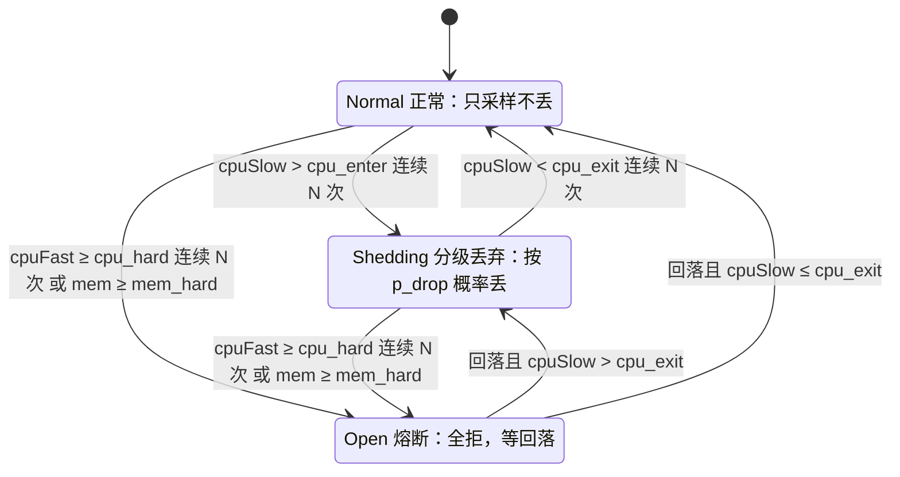
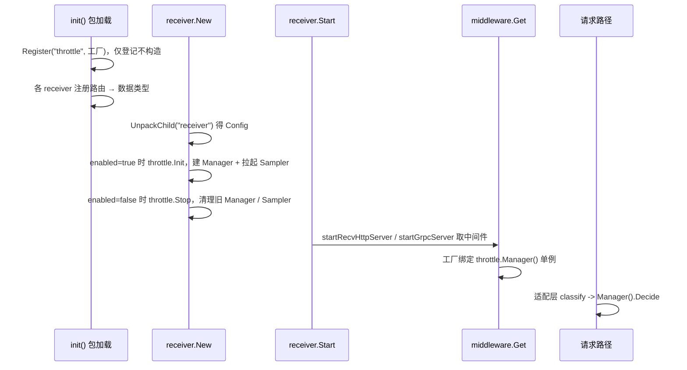

# bk-collector 自适应限流方案

## 0x01 调研与约束

### a. 问题与目标

bk-collector 被突发流量打满 CPU、内存而崩溃，崩溃后重启又被堆积重试二次压垮，导致持续 OOM。

现有限流（QPS、`maxconns`、`maxbytes`）效果不佳：
* Traces 等数据类型攒批发送，单个包 5 MB、100 QPS 未超限仍然能产生 500 MB / s 的流量。
* 限流不够精细，按数据类型（traces / metrics / logs / profiles）分级主动丢请求，主动拒绝部分数据，保障高优数据类型。

### b. 选型结论

以 CPU 水位平滑分级丢弃为主体，叠加内存硬熔断。

| 信号              | 角色   | 触发动作            |
|-----------------|------|-----------------|
| CPU 水位（慢信号）     | 主限流  | 按数据类型概率丢弃，优雅降级。 |
| CPU 水位（快信号）     | 防毛刺  | 连续 N 次超过设定阈值熔断。 |
| 内存使用率（不含 Cache） | 保命熔断 | 超过设定阈值熔断。       |


### c. 硬约束（来自现状代码）

| 约束         | 事实                                                                                        | 来源                                                                                                                                                         |
|------------|-------------------------------------------------------------------------------------------|------------------------------------------------------------------------------------------------------------------------------------------------------------|
| 挂载层        | 限流只在 HTTP / gRPC 中间件层，不侵入 pipeline、processor                                              | [issue README](./README.md)                                                                                                                                |
| HTTP 中间件形态 | `func(http.Handler) http.Handler`，按 `middlewares` 列表顺序包裹整个 handler                        | [<源码> httpmiddleware/middleware.go](https://github.com/TencentBlueKing/bkmonitor-datalink/blob/master/pkg/collector/internal/httpmiddleware/middleware.go) |
| gRPC 中间件形态 | 每个中间件产出一个 `grpc.ServerOption`，append 到 server                                             | [<源码> grpcmiddleware/middleware.go](https://github.com/TencentBlueKing/bkmonitor-datalink/blob/master/pkg/collector/internal/grpcmiddleware/middleware.go) |
| 配置形态       | 中间件列表项是扁平 optmap 串 `name;k=v`，装不下分级丢弃配置                                                   | [example.yml](https://github.com/TencentBlueKing/bkmonitor-datalink/blob/master/pkg/collector/example/example.yml)                                         |
| 数据类型       | collector 已有 `define.RecordType`（`traces`、`metrics`、`logs`、`profiles` 等），各 receiver 入站即定型 | [<源码> define/record.go](https://github.com/TencentBlueKing/bkmonitor-datalink/blob/master/pkg/collector/define/record.go)                                  |
| 有效核数       | `define.CoreNum()` 默认回退 `runtime.NumCPU()`（宿主核数），不能直接当归一化分母                               | [<源码> define/concurrency.go](https://github.com/TencentBlueKing/bkmonitor-datalink/blob/master/pkg/collector/define/concurrency.go)                        |
| 无采样回路      | 进程内无 CPU、内存水位采样，仅 admin `/metrics` 暴露 `process_*`、`go_*`                                  | [<源码> receiver/metrics.go](https://github.com/TencentBlueKing/bkmonitor-datalink/blob/master/pkg/collector/receiver/metrics.go)                            |
| Go 版本      | `go 1.23.0`，`automaxprocs v1.5.2` 仅做日志、未调 `Set()`，没有 Go 1.25 的配额感知红利                      | [<源码> collector/go.mod](https://github.com/TencentBlueKing/bkmonitor-datalink/blob/master/pkg/collector/go.mod)                                            |

---

## 0x02 架构设计

### a. 总体思路

过载保护改用容器 cgroup 的真实水位驱动，在入口按数据类型分级决定每个请求是否放行。

限流粒度取数据类型而非单个 Endpoint，理由有两条：

- Endpoint 粒度过细会让配置爆炸、状态机数量不可控。
- 数据类型才是运营想区分的维度（如「保 metrics、可丢 traces」），且与 collector 既有 `define.RecordType` 对得上。

### b. 信号职责：CPU 主限流、内存做熔断

为什么 CPU 当主信号、内存只做熔断？
* CPU 超限触发 CFS 节流，处理变慢，而内存超限将导致进程被杀，不可逆转。
* 基于 CPU 节流能保障 bk-collector 数据处理效率，不积压内存，基于内存熔断确保服务临近过载线时，通过主动拒绝入口请求不至于雪崩。
* 业界主信号都用 CPU：go-zero、Kratos 的自适应丢弃以 CPU 为准，内存只作触发开关（如 Envoy overload manager 用堆内存压力触发停接新连接）。

### c. 核心对象模型

采样慢回路与决策快回路解耦：背景每 `250 ms` 采样、原子发布水位，请求路径只做原子读与概率判定，每请求不碰 `/sys/fs/cgroup` 与 `/proc`。

容量负载采样与限流决策解耦：
* 采样：每 `250ms` 采样 CPU、内存容量负载，更新负载水位，并推动状态机更新。
* 限流决策：根据状态按比例进行流控。


| 对象                | 职责                                                   |
|-------------------|------------------------------------------------------|
| `cgroup.Reader`   | 读取容量（CPU、内存限额），当前负载（CPU 使用率、内存使用率（不含 Cache））         |
| `ResourceSampler` | 按周期采样，预处理负载信号并推进状态机                                  |
| `WaterLevel`      | 不可变水位快照，含原始 CPU / 内存水位，以及 CPU 快慢信号                   |
| `classify`        | 维护「路由 → 数据类型」注册表，receiver 用本地路由常量声明参与限流的 HTTP 路径 / gRPC 全方法名，未命中放行 |
| `ThrottleManager` | 持有限流策略、状态机，负责决策当前请求是否执行流控                            |
| `Rule`            | 单数据类型的丢弃强度（`drop_min` / `drop_max`、`enabled`），阈值全局共用 |
| `Decision`        | 限流决策：通过、按比例流控降级、熔断                                   |

### d. 决策状态机

按数据类型新建状态机，每次执行采样后推进状态转移：



| 状态                       | 请求路径动作                   | 进入条件                                                          |
|--------------------------|--------------------------|---------------------------------------------------------------|
| `Normal（正常）`             | 全部放行                     | 初始态，或从 `Shedding`、`Open` 恢复。                                  |
| `Shedding（Half-Open，半开）` | 按 `p_drop(cpuSlow)` 概率限流 | `cpuSlow` *[1]* 连续 N 次超过 `cpu_enter`。                         |
| `Open（跳闸）`               | 熔断                       | `cpuFast` *[2]* 连续 N 次 `cpu_hard` 连续 N 次，或 `mem` 越 `mem_hard` |

* *[1] cpuSlow（慢信号）：上一次采样 CPU 使用率加权占比高，用于防抖，避免单点采样影响决策。*
* *[2] cpuFast（快信号）：本次采样 CPU 使用率加权占比高，过于防止突发毛刺。*

把三条阈值线、滞回带与快慢两路信号落到同一时间轴，对照状态机看转移时机：

```text
水位
0.95 |                  /\                  快信号 fast（β=0.7）：灵敏，抢先冲顶
0.90 |=================/  \==============   硬线 cpu_hard：fast 越线且连续 N 次 → Open 全拒
     |        ________/    \________        慢信号 slow（β=0.95）：平滑，不贴线抖
0.80 |-------/----------------------\----   进入线 cpu_enter：slow 升过 → Shedding 按 p_drop 概率丢
     |      /                        \      （0.70～0.80 为滞回带 [1]：升过 0.80 才丢、跌回 0.70 才停）
0.70 |-----/--------------------------\--   退出线 cpu_exit：slow 跌回 → 停丢
     |.:*:.                            .:*. 原始采样（抖）经 EWMA 平滑成上面两条曲线
     +----+----------+------+-----------+-→ 时间
        Normal    Shedding  Open    → Normal
```
* *[1] 滞回带（`0.70`～`0.80`）防抖，让分级进退不在单一阈值上横跳。*

### e. 限流位置

1）HTTP：
* 放在 `content_decompressor` 之前，不提前解压。
* 按 `r.URL.Path` 归类数据类型后判定，丢弃返回 `429` 加 `Retry-After`、


2）gRPC：
* 注册为 [grpc.InTapHandle](https://pkg.go.dev/github.com/bwhour/go-grpc/lib/grpc#InTapHandle)，在 PB 反序列化之前完成限流判定，
* 按 `info.FullMethodName` 归类数据类型后判定，拒绝返回 `ResourceExhausted`。

---

## 0x03 cgroup 基础

本章节介绍容器视角 cgroup（v1 & v2）的结构，以及多级 cgroup 如何读取到准确的信息。

### a. 容器视角下的 cgroup v1/v2 结构

cgroup v2（统一层级）：

```text
/sys/fs/cgroup/                  # 容器自身 cgroup 即此根
├── cpu.stat                     # CPU 用量：usage_usec，求差得区间耗时
├── cpu.max                      # CPU 容量：quota period，quota/period 作归一化分母
├── cpuset.cpus.effective        # CPU 容量：有效核集合，与配额取小
├── memory.current               # 内存用量：当前用量，工作集被减项
├── memory.max                   # 内存容量：上限，内存归一化分母
└── memory.stat                  # 内存明细文件，取其中 inactive_file 字段算工作集（current - inactive_file）
```

cgroup v1（按控制器分目录）：

```text
/sys/fs/cgroup/
├── cpu,cpuacct/
│   ├── cpuacct.usage            # CPU 用量：累计 ns，求差得区间耗时
│   ├── cpu.cfs_quota_us         # CPU 容量：配额上限
│   └── cpu.cfs_period_us        # CPU 容量：配额周期，quota/period 作归一化分母
├── cpuset/
│   └── cpuset.cpus              # CPU 容量：有效核集合，与配额取小
└── memory/
    ├── memory.usage_in_bytes    # 内存用量：当前用量，工作集被减项
    ├── memory.limit_in_bytes    # 内存容量：上限，内存归一化分母
    └── memory.stat              # 内存明细文件，取其中 total_inactive_file 字段算工作集（usage - total_inactive_file）
```

### b. 分层继承：cgroup 为什么有「上层」，谁严听谁的

cgroup 是一棵树，就是 `/sys/fs/cgroup` 下的目录层级。

你的进程挂在某个叶子节点上，但它**同时受这条路径上每一层的限额管**，内核执行其中**最严（最小）的那条**。

```text
/sys/fs/cgroup/                          cpu.max = max          （没限）
└── kubepods/                            cpu.max = max          （没限）
    └── burstable/                       cpu.max = max          （没限）
        └── pod<uid>/                    cpu.max = 4 核
            └── <container-id>/  (进程)   cpu.max = 1 核          ← 进程挂这里
```

进程真正能用多少？不是只看叶子，而是 `min(1, 4, max, max, max) = 1 核`。

反过来，如果叶子写的是 `max`（多层容器里很常见），真正的 `4 核` 设在 `pod` 那层，**只读叶子就会以为「没限制」**，这就是要往上看的根本原因。

### c. 两种视角：宿主看整棵树，容器只见自己这层

同一棵树，宿主和容器看到的范围不一样，这决定了「能不能往上走」。

```text
宿主机真实层级                          容器内(cgroupns=private)看到的
/sys/fs/cgroup/                         /sys/fs/cgroup/      ← 这就是根
└── kubepods/                           ├── cpu.max
    └── burstable/                      ├── cpu.stat
        └── pod<uid>/                   ├── memory.max
            └── <container-id>/  ←──映射──→ └── memory.current
                ├── cpu.max
                └── ...                 # kubepods、burstable、pod 全部不可见
```
* *[1] 容器看不到自己的祖先目录，这是隔离的本意。*
* *[2] `kubepods`、`burstable`、`pod` 这些层只在宿主 / 无 namespace 视角下可见。*

### d. 基于 /sys/fs/cgroup 推导上层路径

> `/proc/self` 是内核提供的「魔法符号链接」，谁来读它就指向谁的 `/proc/<pid>`，所以 VM 进程读 `/proc/self/cgroup` 得到的就是 VM 自己那条 cgroup 路径。

核心点：**不是在文件系统里 `cd ..` 去找父目录**，而是分两步：

1）**先问 `/proc/self/cgroup`「我在哪条路径上」**。它返回一个字符串：
* 容器视角：`0::/`，已经是根路径了。
* 宿主机视角：`0::/kubepods/burstable/pod<uid>/<container-id>`，要逐层读 `cpu.max`、取最小，真正找到那条绑定限额。


2）**把这个路径接到 `/sys/fs/cgroup` 后面，再用字符串砍末段得到父路径**（`path.Dir` 就是砍掉最后一段）：

```text
/sys/fs/cgroup/kubepods/burstable/pod<uid>/<container-id>   ← 起点
/sys/fs/cgroup/kubepods/burstable/pod<uid>                  ← 砍一段 = 父
/sys/fs/cgroup/kubepods/burstable                           ← 再砍
/sys/fs/cgroup/kubepods
/sys/fs/cgroup/                                             ← 到根，停
```

### e. 向上推导的必要性

同时支持宿主机、多层嵌套容器、旧式容器（cgroupns=host）：

```go
for {
    data, err := os.ReadFile(path.Join(sysfsPrefix, subPath, "cpu.max")) // 读当前层
    if err == nil {
        quota, _ := parseCPUMax(...)
        if quota > 0 && (minQuota < 0 || quota < minQuota) {
            minQuota = quota                 // 取最小
        }
    }
    if subPath == "/" || subPath == "." {
        break                                // 到根就停
    }
    subPath = path.Dir(subPath)              // 砍掉末段 = 往上一层
}
```

---

## 0x04 开发方案

0x02 的两个单例与解耦边界落到新包 `pkg/collector/internal/throttle/`，HTTP 与 gRPC 各加薄适配层，既有 receiver 只动两处，pipeline 与 processor 零改动。

| 文件 · 位置                                      | 改动                                                                                        |
|----------------------------------------------|-------------------------------------------------------------------------------------------|
| **[Add]** `throttle/cgroup.go`               | `cgroup.Reader`，参考 VM `lib/cgroup` 的读取逻辑                                                  |
| **[Add]** `throttle/sampler.go`              | 新增 `ResourceSampler`、`WaterLevel`                                                         |
| **[Add]** `throttle/classify.go`             | 提供 HTTP 路径 / gRPC 方法名 → 数据类型注册表，receiver 用本地路由常量登记参与限流的端点                                |
| **[Add]** `throttle/manager.go`              | 新增 `ThrottleManager`、`Rule`、`Decision`                                                    |
| **[Add]** `throttle/config.go`               | `Config` 协议与默认值                                                                           |
| **[Add]** `throttle/metrics.go`              | 观测指标                                                                                      |
| **[Add]** `httpmiddleware/throttle.go`       | `init` 注册 `"throttle"`，工厂绑定 `Manager()`，按 `r.URL.Path` 归类后判定                              |
| **[Add]** `grpcmiddleware/throttle.go`       | `init` 注册 `"throttle"`，产出 `grpc.InTapHandle`，按 `info.FullMethodName` 归类后判定                |
| **[Change]** `receiver/config.go` · `Config` | 加 `Throttle throttle.Config` 字段（tag `config:"throttle"`），随 `receiver` 块由 `UnpackChild` 解析 |
| **[Change]** `receiver/receiver.go` · `New`  | 解包 `Config` 后按总开关管理生命周期：开启时建单例并拉起采样回路，关闭时清理旧单例与采样回路                                  |

### a. 信号基础：指标与获取

`cgroup.Reader` 参考 [VictoriaMetrics lib/cgroup](https://github.com/VictoriaMetrics/VictoriaMetrics/tree/master/lib/cgroup) 进行实现。

| 信号       | cgroup v2                       | cgroup v1                              | 用途                                |
|----------|---------------------------------|----------------------------------------|-----------------------------------|
| CPU 累计耗时 | `cpu.stat` -> `usage_usec`      | `cpuacct.usage`                        | 求差得区间 CPU 耗时                      |
| CPU 配额   | `cpu.max` -> `quota period`     | `cpu.cfs_quota_us` `cpu.cfs_period_us` | `quota/period` 作归一化分母 *[1]* *[2]* |
| 有效核集合    | `cpuset.cpus.effective`         | `cpuset.cpus`                          | 与配额取小作上限                          |
| 内存当前用量   | `memory.current`                | `memory.usage_in_bytes`                | 工作集的被减项                           |
| 可回收文件缓存  | `memory.stat` 的 `inactive_file` | `memory.stat` -> `total_inactive_file` | 从用量里扣除                            |
| 内存上限     | `memory.max`                    | `memory.limit_in_bytes`                | 内存归一化分母                           |

- *[1] 取配额链路沿用 VM `lib/cgroup`：先读控制器挂载根、命中即返回，读不到回退 `/proc/self/cgroup` 子路径，最后解析 `cpu.max`。*
- *[2] 先读挂载根更稳：兜住「leaf 被 bind-mount 到控制器根」的布局，比 `containerd/cgroups` 的 `PidPath` 拼深路径稳更加稳定。*

`cgroup.Reader` 协议：

```go
type Reader interface {
    EffectiveCores() (float64, bool) // min(cpuset 有效核, quota/period)；false 表示配额未设
    CPUUsageNanos() (uint64, error)  // CPU 累计耗时，单调递增
    MemWorkingSet() (uint64, bool)   // max(0, current - inactive_file)
    MemLimit() (uint64, bool)        // false 表示无限（v2 max / v1 哨兵极大值）
}
```

- **配额保留小数**：分母用 `quota/period` 浮点值，不用 `GOMAXPROCS`（向下取整、最小 2）或 `nproc`（宿主核数）。
- **配额未设要保守回退**：`cpu.max=max` 或 v1 `quota=-1` 时取配置 `fallback_cores`（缺省 `define.CoreNum()`），不回退成全节点核数。
- **内存上限未设则跳过**：`memory.max=max`（或 v1 哨兵极大值）时不做内存归一化，只保留 CPU 分级与熔断。
- **零新增依赖**：仅用 `os`、`strconv`、`strings`。

### b. 计算：CPU 利用率、内存工作集、EWMA

三项算法各自对齐一个业界实现，公式与出处如下。

**（1）CPU 利用率**：速率量，两次采样求差，公式对齐 go-zero `core/stat` 的 `RefreshCpu`：

```text
effCores = min(cpuset 有效核数, quota/period)
CPU 利用率 = Δusage / (Δwall × effCores)
```
* 分母用 cgroup 配额，宿主核数会严重低估（线上实测容器报 `14` 核、实配 `1` 核，低估约 `14` 倍，限流永不触发）。

**（2）内存工作集**：对齐 kubelet、cAdvisor 口径，从当前用量扣掉可回收文件缓存（口径见 [Kubernetes 内存工作集解析](https://mtardy.com/posts/memory-kubernetes-golang-ebpf/)）。

```text
workingSet = max(0, current - inactive_file)
内存利用率 = workingSet / limit
```

- 裸 `current` 含可回收页缓存会判高，RSS 漏掉活跃文件缓存会偏低，两者都不取。

**（3）EWMA 平滑**：对齐 go-zero、Kratos aegis 的同族衰减，源自 [RFC 6298](https://datatracker.ietf.org/doc/html/rfc6298) 的 RTT 估计，一阶低通、内存 `O(1)`。

```text
s_t = (1 - β) · x_t + β · s_{t-1}
```
- *[1] β 为历史权重，越大越平滑越滞后。*
- *[1] 快慢两路用不同 β：慢信号 `β=0.95` 驱动分级抗抖，快信号 `β=0.7` 驱动熔断防漏。*

### c. ResourceSampler：采样回路

- **职责**：每 `sample_interval` 调 `cgroup.Reader` 取一次原始水位，算 CPU 快慢两路 EWMA，推进每数据类型状态机，原子发布 `WaterLevel`。
- **发布方式**：`WaterLevel` 用 `atomic.Pointer[WaterLevel]` 整体替换，请求路径无锁读，决策与采样彻底解耦。
- **生命周期**：由 `throttle.Init` 在启动期拉起，进程级单例，四类状态机启动期建好、运行期只读不增减。

协议骨架：

```go
type WaterLevel struct{ CPU, CPUSlow, CPUFast, Mem float64 }

func (s *ResourceSampler) Level() *WaterLevel   // 原子读，请求路径用
func (s *ResourceSampler) tick()                // 周期回调：采样 + EWMA + 状态机 + 发布
```

### d. 决策

`ThrottleManager` 是单例决策者，HTTP 与 gRPC 适配层只把请求归类后调 `Decide`，自身不持有状态。

**`Decide` 协议**

```go
type Action uint8 // Admit / Shed / Open

// rt 复用 collector 既有 define.RecordType，仅 traces/metrics/logs/profiles 四类参与限流
func (m *ThrottleManager) Decide(rt define.RecordType) Action
// Open      -> 全拒
// Shed      -> 以 p_drop(cpuSlow) 概率丢，否则放行（公式见下）
// Admit     -> 放行（含该类型 enabled=false，恒放行）
```

**丢弃概率**：`Shed` 态按慢信号在 `cpu_enter`～`cpu_hard` 线性插值，丢弃概率在该数据类型配置的 `drop_min`～`drop_max` 之间。

```text
t      = clamp((cpu_slow - cpu_enter) / (cpu_hard - cpu_enter), 0, 1)
p_drop = drop_min + (drop_max - drop_min) * t
```

- `cpu_slow ≤ cpu_enter` → `p_drop = drop_min`（缺省 `0`）
- `cpu_slow ≥ cpu_hard` → `p_drop = drop_max`（缺省 `1`）

**端点归类**：`classify` 只维护「路由 → 数据类型」注册表，具体端点由对应 receiver 在 `init` 中用本地路由常量登记。

这样新增 receiver 端点时，开发者能在同一处看到路由注册与限流归类。

| 数据类型       | HTTP 路径                           | gRPC 全方法名                                                        |
|------------|-----------------------------------|------------------------------------------------------------------|
| `traces`   | `/v1/traces`                      | `opentelemetry.proto.collector.trace.v1.TraceService/Export`     |
| `metrics`  | `/v1/metrics`、`/prometheus/write` | `opentelemetry.proto.collector.metrics.v1.MetricsService/Export` |
| `logs`     | `/v1/logs`                        | `opentelemetry.proto.collector.logs.v1.LogsService/Export`       |
| `profiles` | `/pyroscope/ingest`、`/push.v1.PusherService/Push` | 无（connect-rpc 经 HTTP 路由上报）                                       |

* *[1] 第一期只注册上表端点，其余（admin、proxy、zipkin、skywalking 等）未命中放行，暂不限流.*
* *[2] HTTP 路径取自各 receiver 的入站常量（`routeV1Traces`、`routeRemoteWrite` 等），gRPC 全方法名靠近对应 receiver 服务注册处声明。*

**决策器装配**：中间件注册表只认 optmap 串，够不到结构化 `receiver.throttle`，靠启动期单例搭桥。



- `New` 早于 `Start`，单例在工厂执行前已就绪。
- `enabled=false` 时仍保留中间件，`GlobalManager` 返回 disabled manager 后恒放行，不拉起负载采样回路。

### e. HTTP 挂载

工厂忽略 optmap 串，绑定 `throttle.Manager()` 单例，按 `r.URL.Path` 归类后判定。

```go
func Throttle(_ string) MiddlewareFunc
// a := Manager().Decide(classify(r.URL.Path))
//   Open / Shed 命中丢弃 -> 写 429 + Retry-After 后 return（不读 body）
//   Admit              -> next.ServeHTTP(w, r)
```

挂载顺序由 `startRecvHttpServer` 的包裹循环 `handler = fn(handler)` 决定：

- 列表末项裹在最外层、最先执行，`throttle` 列在 `content_decompressor` 之后即位于其外层。
- 请求先过限流再解压，丢弃落在解压前，省掉无谓的解压与反序列化开销。

### f. gRPC 挂载

工厂产出 `grpc.InTapHandle`，在读消息体前按 `info.FullMethodName` 判定。

```go
func Throttle(_ string) grpc.ServerOption
// grpc.InTapHandle(func(ctx context.Context, info *tap.Info) (context.Context, error) {
//   命中丢弃 -> nil, status.Error(codes.ResourceExhausted, ...)
//   放行     -> ctx, nil
// })
```

- `InTapHandle` 是 gRPC 最省 CPU 的拒绝点，unary 与 streaming 都在首帧判定，一处即覆盖。
- grpc-go 限定每个 server 只一个 tap，重复注册会 panic，与既有 `maxbytes`（`grpc.MaxRecvMsgSize`）互不冲突。

### g. 配置协议

新增结构化 `receiver.throttle` 配置块，按 signal / thresholds / rules 三层承载，中间件列表里只放占位项 `throttle`，解决 optmap 装不下的矛盾。

最小配置示例：

```yaml
receiver:
  http_server:
    middlewares:
      - "logging"
      - "cors"
      - "content_decompressor"
      - "throttle"                       # 占位，解压之后入列 => 解压之前执行
      - "maxconns;maxConnectionsRatio=256"
  grpc_server:
    middlewares:
      - "throttle"                       # 注册为 grpc.InTapHandle
      - "maxbytes;maxRequestBytes=8388608"

  throttle:
    enabled: true
    sample_interval: "250ms"
    signal:
      cpu_slow_beta: 0.95                # 慢信号，分级
      cpu_fast_beta: 0.7                 # 快信号，熔断
      fallback_cores: 0                  # 0 取 define.CoreNum()
    thresholds:                          # 全局共用，不按类型区分
      cpu_enter: 0.80                    # 慢信号越线 → 开始分级丢
      cpu_exit: 0.70                     # 慢信号回落 → 停丢（与 cpu_enter 成滞回带）
      cpu_hard: 0.90                     # 快信号越线连续 N 次 → 全拒
      mem_hard: 0.92                     # 内存工作集越线 → 全拒
      breach_n: 2
    rules:                               # 按数据类型只调丢弃强度
      default: { drop_min: 0.0, drop_max: 1.0 }
      metrics: { enabled: false }        # metrics 永不限流（取舍见下）
```

字段契约（主表）：

| 字段                         | 类型         | 必填 | 说明                                                                         |
|----------------------------|------------|----|----------------------------------------------------------------------------|
| `throttle.enabled`         | `bool`     | 是  | 总开关，关闭则中间件直接放行                                                             |
| `throttle.sample_interval` | `duration` | 否  | 采样周期，缺省 `250ms`                                                            |
| `throttle.signal`          | `object`   | 否  | 信号采样参数，见 `signal` 子结构                                                      |
| `throttle.thresholds`      | `object`   | 是  | 全局阈值，所有数据类型共用，见 `thresholds` 子结构                                           |
| `throttle.rules`           | `object`   | 否  | 按数据类型调丢弃强度，键限 `default`、`traces`、`metrics`、`logs`、`profiles`，见 `rules` 子结构 |

`throttle.signal` 子结构：

| 字段               | 类型      | 必填 | 说明                                  |
|------------------|---------|----|-------------------------------------|
| `cpu_slow_beta`  | `float` | 否  | 慢信号 EWMA 历史权重，缺省 `0.95`             |
| `cpu_fast_beta`  | `float` | 否  | 快信号 EWMA 历史权重，缺省 `0.7`              |
| `fallback_cores` | `float` | 否  | 配额未设时的有效核数，`0` 取 `define.CoreNum()` |

`throttle.thresholds` 子结构（全局共用）：

| 字段          | 类型      | 必填 | 说明                             |
|-------------|---------|----|--------------------------------|
| `cpu_enter` | `float` | 是  | 慢信号越线进入分级丢弃                    |
| `cpu_exit`  | `float` | 是  | 慢信号回落退出分级丢弃，与 `cpu_enter` 成滞回带 |
| `cpu_hard`  | `float` | 是  | 快信号硬熔断线，连续 `breach_n` 次越线则全拒   |
| `mem_hard`  | `float` | 是  | 内存工作集硬熔断线                      |
| `breach_n`  | `int`   | 否  | 连续越界次数门控，缺省 `2`                |

`throttle.rules.<type>` 子结构（`default` 兜底，其余只写差异项）：

| 字段         | 类型      | 必填 | 说明                                        |
|------------|---------|----|-------------------------------------------|
| `enabled`  | `bool`  | 否  | 缺省 `true`，置 `false` 则该类型完全不限流（含熔断），恒放行    |
| `drop_min` | `float` | 否  | 丢弃概率下界，`cpu_slow ≤ cpu_enter` 时取此值，缺省 `0` |
| `drop_max` | `float` | 否  | 丢弃概率上界，`cpu_slow ≥ cpu_hard` 时取此值，缺省 `1`  |

**让某类数据永不丢（例：metrics）**，按是否保留熔断兜底二选一：

- `enabled: false`：该类型完全不限流、连熔断也不作用，仅靠内核 OOM 兜底。
- `drop_max: 0`：CPU 分级永不丢它，但仍受全局 `cpu_hard` / `mem_hard` 熔断，极端尖刺或内存悬崖时仍会被全拒。

```yaml
rules:
  metrics: { enabled: false }        # 完全豁免
  # 或：metrics: { drop_max: 0.0 }   # 不分级丢，但保留 cpu_hard / mem_hard 熔断
```

本期不涉及热重载，配置仅启动期加载、变更走重启生效。

### h. 观测指标

沿用 `bk_collector_*` 命名加 `promauto` 加 `metricMonitor` 模式（参照 [<源码> receiver/metrics.go](https://github.com/TencentBlueKing/bkmonitor-datalink/blob/master/pkg/collector/receiver/metrics.go)）。

自适应限流只暴露水位、状态机状态和请求量 `3` 类指标。

| 指标                                      | 类型    | 标签                                  | 用途                                                                                      |
|-----------------------------------------|-------|-------------------------------------|-----------------------------------------------------------------------------------------|
| `bk_collector_throttle_water_level`     | gauge | `kind`                              | 水位与阈值线，`kind` 取 `cpu`、`cpu_slow`、`cpu_fast`、`mem`、`cpu_exit`、`cpu_enter`、`cpu_hard`、`mem_hard` |
| `bk_collector_throttle_state`           | gauge | `record_type`                       | 状态机当前态（`0` Normal、`1` Shedding、`2` Open）                                                   |
| `bk_collector_throttle_requests_total`  | counter | `protocol`、`record_type`、`decision` | 请求量，`decision` 取 `allowed`、`denied`                                                        |

- `cpu` 与 `mem` 表示当前原始水位，`cpu_slow` 与 `cpu_fast` 表示平滑后的 CPU 慢信号和快信号。
- `denied` 统一表示被自适应限流拒绝的请求，拒绝原因通过当时的 `bk_collector_throttle_state` 反查。

---

## 0x05 验收与验证

验证分三层：单测锁定取数与决策正确，压测在受限容器验证端到端丢弃，集成验证真实 collector 平稳运行。

### a. 单测门禁

新增包 `pkg/collector/internal/throttle/`，门禁 `cd pkg/collector && go test ./internal/throttle/...`。

| 测试文件               | 覆盖点                   | 断言重点                                                                         |
|--------------------|-----------------------|------------------------------------------------------------------------------|
| `cgroup_test.go`   | v1/v2 fixture 解析与回退分支 | 有效核数、CPU 累计耗时、工作集计算正确，含 v1 `-1`、v2 `max`、内存无限哨兵                              |
| `sampler_test.go`  | 两次采样 CPU%、EWMA 快慢两路   | 过载越 `1.0`、宿主核数分母被否决、β 越大越平滑                                                  |
| `classify_test.go` | 注册表与端点 → 数据类型归类       | 注册后四类端点命中正确、重复注册同类幂等、冲突注册失败、未注册端点放行                                         |
| `manager_test.go`  | 状态机转移与丢弃概率插值          | 滞回带不横跳、连续门控过滤毛刺、`p_drop` 在 `drop_min`～`drop_max` 线性插值与边界、`enabled=false` 恒放行 |

### b. 压测工具

压测程序用 Go 写、仅依赖标准库，放在 collector example 目录下单独编译成二进制。

- 位置：`pkg/collector/example/loadgen/main.go`（`package main`）。
- 编译：`cd pkg/collector && go build -o loadgen ./example/loadgen`。
- 运行：`./loadgen -url http://127.0.0.1:4318/v1/traces -token <TOKEN>`。
- 行为：向 OTLP HTTP `/v1/traces` 发 JSON trace，三阶段串行施压，逐阶段打印 `200` / `429` / `503` 计数与成功请求 P99。
- 参数：`-url` 目标地址、`-token` 写 `X-BK-TOKEN` 头、`-c` 并发数（缺省 `50`）、`-d` 每阶段时长（缺省 `30s`）。

| 阶段         | 负载          | 目的             |
|------------|-------------|----------------|
| warmup     | 低并发、小包      | 建立基线，确认不误丢     |
| burst      | 高并发、小包      | 触发 CPU 快信号熔断   |
| bigpayload | 并发不变、单包成本翻倍 | 验证成本盲点，触发慢信号分级 |

### c. OrbStack 集成验证

把真实 collector 放进 OrbStack 受限容器跑，复现流量冲击、确认平稳运行。

- **环境**：OrbStack（cgroup v2），容器限 `--cpus=1 --memory=300m`，模拟 K8s 紧资源。
- **配置**：启用 OTLP HTTP 接收、`throttle` 中间件与 `receiver.throttle` 块，配最简管道。
- **施压**：编译好的 `loadgen` 跑三阶段，对照 `throttle.enabled` 关与开。

平稳运行的验收口径如下，全部满足即达标。

| 验收项     | 判定                                                                                         |
|---------|--------------------------------------------------------------------------------------------|
| 不崩溃     | 开启限流全程无 OOM、无重启（对照关闭限流应能复现崩溃或积压爆炸）                                                         |
| CPU 收敛  | 容器 CPU 稳态压在配额下，`docker stats` 与进程自读 `cpu_slow` 收敛到 `cpu_enter` 线附近                         |
| 尾延迟受保护  | 大包阶段成功请求 p99 显著低于关闭限流                                                                      |
| 早丢省 CPU | `429`、`503` 在解压、反序列化之前返回                                                                   |
| 豁免类不丢   | `metrics` 配 `enabled: false` 时全程 `0` 丢弃，CPU、内存双高也不误伤                                       |
| 可观测     | `bk_collector_throttle_requests_total`、`bk_collector_throttle_water_level`、`bk_collector_throttle_state` 随负载与数据类型如实变化 |

原型快路径（可选）：把 `throttle` 包嵌入最小 `loadserver` 加合成 CPU 处理，先在受限容器快速验证决策行为，再做真实 collector 集成（原型评估见 [PREPLAN 0x11e](./PREPLAN.md)）。

---

## 0x06 基准压测

### a. 测试矩阵

`2c2g` 单容器跑 4 个场景，覆盖「throttle 开关 × 是否过载」四种组合，看限流上线后能扛多少、降级怎么走、关了会不会雪崩。

| 场景 | throttle | 工况 | 观察重点 |
| --- | --- | --- | --- |
| A | 关闭 | 未过载极值 | 记关闭限流时的最大 QPM 与 P99 耗时。 |
| B | 关闭 | 过载饱和 | 看关闭限流时是否失稳，给 D 当对照。 |
| C | 开启（默认参数） | 未过载极值 | 记开启限流后能保留多少 QPM，与 A 对比看开销。 |
| D | 开启（默认参数） | 默认参数稳态 | 看 CPU 触到 `cpu_enter` 后的丢弃比例与 P99 耗时。 |

### b. 容器与配置

| 配置 | `receiver.throttle.enabled` | 阈值与规则 |
| --- | --- | --- |
| 关闭（A、B） | `false` | 不生效，中间件恒放行。 |
| 开启（C、D） | `true` | `cpu_enter=0.80` / `cpu_exit=0.70` / `cpu_hard=0.90` / `mem_hard=0.92` / `breach_n=2` <br />`rules.default={drop_min: 0.0, drop_max: 1.0}` <br />`rules.metrics.enabled=false` |

压测前把 `pipeline` 段的 `rate_limiter/token_bucket` 放宽到 `qps=100000 / burst=200000`，避免令牌桶先于 throttle 返 `429`。

### c. 压测参数

下表是 OrbStack `2c2g` 容器预跑得到的并发与时长建议，落到具体压测工具时按其参数命名替换。

| 场景 | throttle | 并发 | 时长 | 备注 |
| --- | --- | --- | --- | --- |
| A 未过载（关闭 throttle） | off | `20` | `60s` | 关闭限流时容器吞吐刚好压满 `2` 核 CPU 的临界值。 |
| B 过载未开启 throttle | off | `200` | `60s` | `10×` A 的并发，制造持续过载用于对照 D。 |
| C 未过载（开启 throttle） | on | `2` | `60s` | 开启默认限流后，不触发分级丢弃的最大并发，超过即在大包流量上触发。 |
| D 默认限流参数（开启 throttle） | on | `50` | `60s` | 让容器 CPU 稳态压在 `cpu_enter ≈ 0.80` 线、持续触发分级丢弃。 |

* *[1] `时长` ≥ `60s` 给 EWMA `β=0.95` 留足收敛时间（时间常数 ≈ `5s`）。*
* *[2] 客户端读超时建议 ≥ `10s`，否则 B、D 的高延迟请求会被记为客户端超时而非服务端拒绝。*

### d. 数据采集 PromQL

下表 PromQL 已在 `bk_biz_id=5000140`、`bcs_cluster_id=BCS-K8S-25973` 通过 bkte MCP 拉取验证。

调用约定：

- `<window>` 填 loadgen 整段压测时长，默认 `3m`（对应 `-d 60s × 3` 阶段）。
- 取值用 range query，`start_time = end_time = 压测结束时刻 + 30s`，让 rate `1m` 窗口完整覆盖压测末段。
- 所有 PromQL 直接返回单值，调用方读 `stat.last` 即可。
- Subquery 内层步长 `[1m:30s]` 对齐底层 `30s` 采样间隔。

**主表**：

| 指标 | 适用场景 | 单位 | PromQL |
| --- | --- | --- | --- |
| QPM 峰值 *[1]* | A、B | `req/min` | `max_over_time((sum by (pod) (rate(bkmonitor:bk_collector_receiver_handled_total{bcs_cluster_id="<bcs_cluster_id>"}[1m])) * 60)[<window>:30s])` |
| QPM 峰值 *[1]* | C、D | `req/min` | `max_over_time((sum by (pod) (rate(bkmonitor:bk_collector_throttle_requests_total{bcs_cluster_id="<bcs_cluster_id>"}[1m])) * 60)[<window>:30s])` |
| Receiver 字节速率峰值 | A、B、C、D | `B/s` | `max_over_time((sum by (pod) (rate(bkmonitor:bk_collector_receiver_received_bytes_total{bcs_cluster_id="<bcs_cluster_id>"}[1m])))[<window>:30s])` |
| Receiver 处理平均耗时峰值 | A、B、C、D | `s` | `max_over_time((sum by (pod) (rate(bkmonitor:bk_collector_receiver_handled_duration_seconds_sum{bcs_cluster_id="<bcs_cluster_id>"}[1m])) / sum by (pod) (rate(bkmonitor:bk_collector_receiver_handled_duration_seconds_count{bcs_cluster_id="<bcs_cluster_id>"}[1m])))[<window>:30s])` |
| Receiver 处理耗时 P99 峰值 | A、B、C、D | `s` | `max_over_time((histogram_quantile(0.99, sum by (le, pod) (rate(bkmonitor:bk_collector_receiver_handled_duration_seconds_bucket{bcs_cluster_id="<bcs_cluster_id>"}[1m]))))[<window>:30s])` |

* *[1] off 取 `receiver_handled_total`（throttle 关时不暴露 throttle 指标），on 取 `throttle_requests_total`（丢弃请求不进 receiver）。*

**辅助表**（仅 C、D 场景，throttle 行为复核）：

| 指标 | 单位 | PromQL |
| --- | --- | --- |
| Throttle 丢弃总占比 | 比例 | `sum by (pod) (increase(bkmonitor:bk_collector_throttle_requests_total{bcs_cluster_id="<bcs_cluster_id>",decision="denied"}[<window>])) / sum by (pod) (increase(bkmonitor:bk_collector_throttle_requests_total{bcs_cluster_id="<bcs_cluster_id>"}[<window>]))` |
| Throttle 状态机最高态 *[1]* | `0/1/2` | `max by (pod, record_type) (max_over_time(bkmonitor:bk_collector_throttle_state{bcs_cluster_id="<bcs_cluster_id>"}[<window>]))` |
| 容器 CPU 慢信号峰值 | 比例 | `max by (pod) (max_over_time(bkmonitor:bk_collector_throttle_water_level{bcs_cluster_id="<bcs_cluster_id>",kind="cpu_slow"}[<window>]))` |
| 容器内存水位峰值 | 比例 | `max by (pod) (max_over_time(bkmonitor:bk_collector_throttle_water_level{bcs_cluster_id="<bcs_cluster_id>",kind="mem"}[<window>]))` |

* *[1] `0` Normal、`1` Shedding、`2` Open，语义见 `0x02 d`。*

### e. 记录模板

collector 端 4 项按 `0x06 d` 主表 PromQL 取，`压测成功率` 与 `压测总请求` 取自压测客户端。

| 场景 | QPM 峰值 | 字节速率峰值 | 处理平均耗时峰值 | P99 峰值 | 压测成功率 | 压测总请求 |
| --- | --- | --- | --- | --- | --- | --- |
| A 未过载（关闭 throttle） |  |  |  |  |  |  |
| B 过载未开启 throttle |  |  |  |  |  |  |
| C 未过载（开启 throttle） |  |  |  |  |  |  |
| D 默认限流参数（开启 throttle） |  |  |  |  |  |  |

辅助表：`—` 表示该场景下指标不适用，预期值与实测不一致需排查。

| 场景 | 客户端 `429` | 客户端 `5xx` | 丢弃总占比 | `cpu_slow` 峰值 | `state` 最高态 | `mem` 峰值 |
| --- | --- | --- | --- | --- | --- | --- |
| A 未过载（关闭 throttle） | 预期 `0` | 预期 `0` | — | — | — | — |
| B 过载未开启 throttle | 预期 `0` |  | — | — | — | — |
| C 未过载（开启 throttle） |  | 预期 `0` |  |  | 预期 `0`（Normal） |  |
| D 默认限流参数（开启 throttle） |  | 预期 `0` |  | 预期 ≈ `0.80` | 预期 `1`（Shedding） |  |

---

## 0x07 实施进展

| 时间           | 结论性进展                                                                                                                                                                                                                                                                                                                                                                                                                                                                                                                                                                                                                                                                      |
|--------------|----------------------------------------------------------------------------------------------------------------------------------------------------------------------------------------------------------------------------------------------------------------------------------------------------------------------------------------------------------------------------------------------------------------------------------------------------------------------------------------------------------------------------------------------------------------------------------------------------------------------------------------------------------------------------|
| `2026-06-18 16:00` | 完成代码落地与验收闭环：<br />[a] 指标实现对齐水位、状态机状态、请求量 `3` 类协议，保留 `allowed` / `denied` 请求量口径 <br />[b] `throttle.enabled=false` 时保留 HTTP / gRPC / admin 的 `throttle` 中间件，关闭状态下恒放行，并跳过限流单例与采样回路初始化 <br />[c] Endpoint 归类改为 receiver 侧注册，OTLP、RemoteWrite、Pyroscope 复用本地路由常量 <br />[d] 使用 Go `1.23.0` 执行限流定向测试、`go test ./internal/... ./receiver/...` 与 `go test ./...` 通过 <br />[e] `2` 位复核 Agent 按 throttle 白名单复查后同意合入，样例配置、`go.mod`、`go.sum` 等非本任务改动不纳入本次验收。 |
| `2026-06-18 15:00` | 收敛观测指标协议：<br />[a] 水位统一用 `bk_collector_throttle_water_level{kind}` 承载原始 CPU / 内存水位、CPU 快慢信号和阈值线 <br />[b] 请求量统一用 `bk_collector_throttle_requests_total{decision}` 承载 `allowed` / `denied`，不再单独按 `shed` / `open` 拆丢弃量。 |
| `2026-06-17` | 方案 B 定稿并收敛第一期范围 <br />[a] 确立「CPU 主限流、内存做熔断」，落到 `ResourceSampler` 与 `ThrottleManager` 两单例，cgroup 直读取数单一基准 VM `lib/cgroup`、EWMA 对齐 RFC 6298，go-zero `core/stat` 仅作 CPU 速率公式对齐 <br />[b] 移除 GOMEMLIMIT 软背压与配置热重载，内存只留硬熔断、配置仅启动期加载 <br />[c] 限流粒度由 Endpoint 改为数据类型（traces/metrics/logs/profiles）、每类一台状态机，端点用预先注册映射表归类（准确路径如 `/v1/traces`、`/prometheus/write`、`/pyroscope/ingest`） <br />[d] 配置收敛为 signal / thresholds / rules 三层：阈值全局共用（`cpu_enter`/`cpu_exit`/`cpu_hard`/`mem_hard`/`breach_n`），每类只调 `drop_min`/`drop_max`，丢弃概率在 `cpu_enter`～`cpu_hard` 线性插值，`enabled: false` 整类豁免，指标标签按 `record_type` <br />[e] 验收含单测门禁、Go 压测工具（collector example 目录、单独编译二进制）与 OrbStack 集成口径 |

---

## 0x08 参考 & 版本锚点

### a. 参考

业界实现（算法与获取层借鉴出处）：

- cgroup 读取与配额归一化（获取层唯一基准）：[VictoriaMetrics lib/cgroup](https://github.com/VictoriaMetrics/VictoriaMetrics/tree/master/lib/cgroup)
- CPU 速率公式（仅算法对齐，不取数）：[go-zero core/stat](https://github.com/zeromicro/go-zero/tree/master/core/stat)
- 自适应丢弃：[go-zero adaptiveshedder](https://github.com/zeromicro/go-zero/blob/master/core/load/adaptiveshedder.go)、[Kratos aegis](https://github.com/go-kratos/aegis)
- 过载模型：[Google SRE — Handling Overload](https://sre.google/sre-book/handling-overload/)、[Netflix concurrency-limits](https://github.com/Netflix/concurrency-limits)
- EWMA 出处：[RFC 6298](https://datatracker.ietf.org/doc/html/rfc6298)
- 内存口径与熔断：[Kubernetes 内存工作集解析](https://mtardy.com/posts/memory-kubernetes-golang-ebpf/)、[Envoy overload manager](https://www.envoyproxy.io/docs/envoy/latest/configuration/operations/overload_manager/overload_manager)

collector 锚点（优先读本地代码库）：

- 中间件注册：[<源码> httpmiddleware/middleware.go](https://github.com/TencentBlueKing/bkmonitor-datalink/blob/master/pkg/collector/internal/httpmiddleware/middleware.go)、[<源码> grpcmiddleware/middleware.go](https://github.com/TencentBlueKing/bkmonitor-datalink/blob/master/pkg/collector/internal/grpcmiddleware/middleware.go)
- 既有样例：[<源码> httpmiddleware/maxconns.go](https://github.com/TencentBlueKing/bkmonitor-datalink/blob/master/pkg/collector/internal/httpmiddleware/maxconns.go)、[<源码> receiver/metrics.go](https://github.com/TencentBlueKing/bkmonitor-datalink/blob/master/pkg/collector/receiver/metrics.go)
- 挂载与配置：[<源码> receiver/receiver.go](https://github.com/TencentBlueKing/bkmonitor-datalink/blob/master/pkg/collector/receiver/receiver.go)、[<源码> receiver/config.go](https://github.com/TencentBlueKing/bkmonitor-datalink/blob/master/pkg/collector/receiver/config.go)
- 调研草稿：[PREPLAN](./PREPLAN.md)

### b. 版本锚点

| 状态 | 分支              | 里程碑     | PR  |
|----|-----------------|---------|-----|
| 🔄 | `<branch_name>` | 支持自适应限流 | 待创建 |
