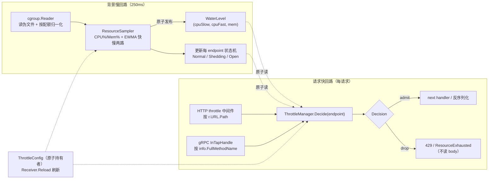
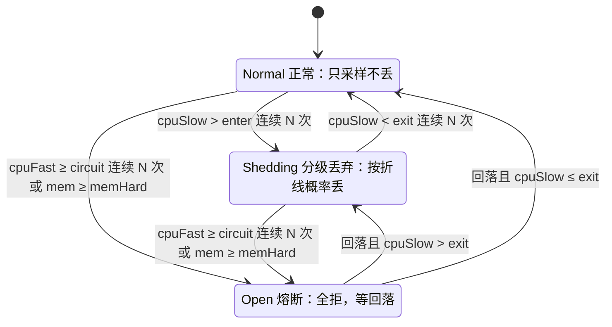

# bk-collector 自适应限流 —— 方案 B（CPU 分级丢弃与内存熔断）

## 0x01 调研与约束

### a. 问题与目标

collector 接收端在 K8s 里被突发流量或大包打满 CPU、内存而崩溃，崩溃后重启又被堆积重试二次压垮，形成自我强化的崩溃循环（背景见 [issue README](./README.md)）。

现有限流（QPS、`maxconns`、`maxbytes`）只数请求数与字节数，与真实 CPU 开销弱相关，大包场景失效。

本方案要让 collector 在资源水位逼近危险线时，按接收端点分级主动丢请求、保住整体不倒，优先覆盖 K8s 形态。

### b. 选型结论

第一期落 **方案 B**：以 CPU 水位平滑分级丢弃为主体，叠加内存硬熔断，方案对比见 [PREPLAN 0x12](./PREPLAN.md)。

| 信号 | 角色 | 触发动作 |
|---|---|---|
| CPU 水位（慢信号） | 主限流 | 按 endpoint 折线概率丢弃，优雅降级 |
| CPU 水位（快信号） | 防尖刺 | 越熔断线且连续 N 次，全拒 |
| 内存工作集 | 保命熔断 | 越硬线全拒，配 `GOMEMLIMIT` 背压 |

方案 C（自适应并发限）作为后续迭代兜底，不在第一期范围。

### c. 硬约束（来自现状代码）

| 约束 | 事实 | 来源 |
|---|---|---|
| 挂载层 | 限流只在 HTTP / gRPC 中间件层，不侵入 pipeline、processor | [issue README](./README.md) |
| HTTP 中间件形态 | `func(http.Handler) http.Handler`，按 `middlewares` 列表顺序包裹整个 handler | [<源码> httpmiddleware/middleware.go](https://github.com/TencentBlueKing/bkmonitor-datalink/blob/master/pkg/collector/internal/httpmiddleware/middleware.go) |
| gRPC 中间件形态 | 每个中间件产出一个 `grpc.ServerOption`，append 到 server | [<源码> grpcmiddleware/middleware.go](https://github.com/TencentBlueKing/bkmonitor-datalink/blob/master/pkg/collector/internal/grpcmiddleware/middleware.go) |
| 配置形态 | 中间件列表项是扁平 optmap 串 `name;k=v`，装不下每 endpoint 折线 | [example.yml](https://github.com/TencentBlueKing/bkmonitor-datalink/blob/master/pkg/collector/example/example.yml) |
| 有效核数 | `define.CoreNum()` 默认回退 `runtime.NumCPU()`（宿主核数），不能直接当归一化分母 | [<源码> define/concurrency.go](https://github.com/TencentBlueKing/bkmonitor-datalink/blob/master/pkg/collector/define/concurrency.go) |
| 无采样回路 | 进程内无 CPU、内存水位采样，仅 admin `/metrics` 暴露 `process_*`、`go_*` | [<源码> receiver/metrics.go](https://github.com/TencentBlueKing/bkmonitor-datalink/blob/master/pkg/collector/receiver/metrics.go) |
| Go 版本 | `go 1.23.0`，`automaxprocs v1.5.2` 仅做日志、未调 `Set()`，没有 Go 1.25 的配额感知红利 | [<源码> collector/go.mod](https://github.com/TencentBlueKing/bkmonitor-datalink/blob/master/pkg/collector/go.mod) |

---

## 0x02 架构设计

### a. 总体思路

过载保护改用容器 cgroup 的真实水位驱动，在入口按 endpoint 分级决定每个请求放行还是丢。

实现上是两个单例加一条解耦边界：`ResourceSampler` 单例统一产出水位信号，`ThrottleManager` 单例统一做准入决策，HTTP 与 gRPC 入口共用它、在解码前就把该丢的请求挡掉。

三个难点和各自的解法如下。

- **信号有噪且分母易错**：裸瞬时水位会让「丢、放」横跳，宿主核数当分母会把水位低估十几倍，交给 `ResourceSampler` 统一读 cgroup、按配额归一化、EWMA 平滑后原子发布。
- **两类过载性质相反**：CPU 过载可恢复、要连续降级，内存过载是 OOM 悬崖、要一刀切，压进 `ThrottleManager` 一张状态机里，CPU 走分级、内存走熔断。
- **配置装不下且不可热更**：optmap 扁平串表达不了每 endpoint 折线、中间件又启动期固定，改用结构化配置块加原子持有者，中间件只持有 manager 引用、每请求原子读。

### b. 信号职责：CPU 主限流、内存做熔断

为什么 CPU 当主信号、内存只做熔断，根因在内核对两类资源的处置本就不对称。

```text
CPU 超配额  → CFS 节流（throttling）：被迫变慢，可恢复，压力一降立即回弹
内存超上限  → OOM Killer：进程被杀，在途数据全丢，不可逆
```

应用层据此分工，不能互换。

| 维度 | CPU | 内存 |
|---|---|---|
| 失败形态 | 渐变、可恢复 | 悬崖、致命 |
| 信号特性 | 毫秒级响应，丢载即回落 | 滞后粘滞，丢载后不立即回落（GC 与缓存） |
| 控制方式 | 比例降级（连续旋钮） | 阈值熔断（开关） |
| 应用层目标 | 被节流时保住延迟与质量 | 绝不越线、不被 OOM |

业界印证：go-zero、Kratos 的自适应丢弃主信号都是 CPU，内存普遍作为触发保护动作的开关（Envoy overload manager 用堆内存压力触发「停止接收新连接」），没有谁把内存当连续限流旋钮。

内存这一路对 collector 不可省：下游（Kafka 等）变慢导致队列堆积时，CPU 可能不高，内存才是 binding risk，熔断兜的正是「CPU 没事但要被撑死」这条死法。

### c. 核心对象模型

采样慢回路与决策快回路解耦，背景每 `250 ms` 采样一次并原子发布水位，请求路径只做原子读与概率判定，每请求绝不触碰 `/sys/fs/cgroup` 与 `/proc`。



| 对象 | 职责 | 数量 |
|---|---|---|
| `cgroup.Reader` | 读 cgroup v1/v2 伪文件，产出有效核数、CPU 累计耗时、内存工作集与上限 | 单例 |
| `ResourceSampler` | 后台 goroutine，按周期采样、归一化、EWMA、推进状态机、原子发布 | 单例 |
| `WaterLevel` | 不可变水位快照，含 CPU 快慢信号与内存占比 | 每周期一份 |
| `ThrottleManager` | 持有原子配置与每 endpoint 编译后策略、对外暴露 `Decide` | 单例 |
| `Policy` | 单 endpoint 的进入、退出、熔断阈值，连续门控计数与「水位→丢弃率」折线 | 每 endpoint 一份 |
| `Decision` | 准入裁决结果：放行、按概率丢、熔断全拒 | 每请求一份 |

### d. 决策状态机

每 endpoint 一台状态机，状态转移在背景回路按全局水位与该 endpoint 阈值推进，请求路径只读状态、不做转移。



| 状态 | 请求路径动作 | 进入条件 |
|---|---|---|
| `Normal` | 全部放行 | 初始态，或从 `Shedding`、`Open` 回落 |
| `Shedding` | 按 `DropCurve(cpuSlow)` 概率丢 | `cpuSlow` 越 `enter` 线连续 N 次 |
| `Open` | 全拒 | `cpuFast` 越 `circuit` 连续 N 次，或 `mem` 越 `memHard` |

双时间常数是关键：分级用慢信号（历史权重大）抗抖动，熔断用快信号（历史权重小）防短尖刺漏保护，校准教训见 [PREPLAN 实验 4](./PREPLAN.md)。

### e. 关键协议

挂载点与拒绝时机以「尽早、省 CPU」为准，丢弃发生在解压与反序列化之前。

| 主题 | 协议 |
|---|---|
| 信号读取 | `WaterLevel` 由 `ResourceSampler` 每 `250 ms` 原子发布，请求路径只读 |
| HTTP 拒绝点 | `throttle` 中间件置于 `content_decompressor` 之后入列（即更外层、解压前执行），丢弃返回 `429` 加 `Retry-After`、不读 body |
| gRPC 拒绝点 | `throttle` 注册为 `grpc.InTapHandle`，在反序列化前按 `info.FullMethodName` 判定，拒绝返回 `ResourceExhausted` |
| 配置下发 | 新增结构化 `receiver.throttle` 配置块，`Receiver.Reload` 原子刷新，中间件每请求原子读，详见 0x03e |
| 观测 | `bk_collector_throttle_*` 系列指标，沿用 `promauto` 加 `metricMonitor` 模式，详见 0x03f |

HTTP 中间件按列表 inner→outer 包裹、末尾项最先执行（见 `startRecvHttpServer`），把 `throttle` 排在 `content_decompressor` 之后即可在解压前拒绝、几乎不耗 CPU。

---

## 0x03 开发方案

落实 0x02 的两个单例与一条解耦边界，新增 `pkg/collector/internal/throttle/` 承载信号与决策，HTTP / gRPC 侧只加薄适配层。

```text
pkg/collector/internal/throttle/
  cgroup.go    # cgroup.Reader：移植 VM / go-zero 的读取逻辑
  sampler.go   # ResourceSampler + WaterLevel
  manager.go   # ThrottleManager + Policy + Decision + 状态机
  config.go    # ThrottleConfig 协议
  metrics.go   # bk_collector_throttle_* 指标
pkg/collector/internal/httpmiddleware/throttle.go   # 注册 "throttle"，绑定 manager 单例
pkg/collector/internal/grpcmiddleware/throttle.go   # 注册 "throttle"，产出 grpc.InTapHandle
```

算法标准一律对齐业界既有实现并给出出处、不另造，获取层移植 VM / go-zero 的成熟逻辑而非引第三方 cgroup 库，避免 eBPF、logrus 传递依赖。

### a. 信号基础：指标与获取

`cgroup.Reader` 直读容器自身 cgroup 伪文件，对容器内不同挂载布局更稳，移植 [VictoriaMetrics lib/cgroup](https://github.com/VictoriaMetrics/VictoriaMetrics/tree/master/lib/cgroup) 与 [go-zero core/stat](https://github.com/zeromicro/go-zero/tree/master/core/stat)。

| 信号 | cgroup v2 | cgroup v1 | 用途 |
|---|---|---|---|
| CPU 累计耗时 | `cpu.stat` 的 `usage_usec` | `cpuacct.usage` | 求差得区间 CPU 耗时 |
| CPU 配额 | `cpu.max` 的 `quota period` | `cpu.cfs_quota_us` 与 `cpu.cfs_period_us` | `quota/period` 作归一化分母 |
| 有效核集合 | `cpuset.cpus.effective` | `cpuset.cpus` | 与配额取小作上限 |
| 内存当前用量 | `memory.current` | `memory.usage_in_bytes` | 工作集的被减项 |
| 可回收文件缓存 | `memory.stat` 的 `inactive_file` | `memory.stat` 的 `total_inactive_file` | 从用量里扣除 |
| 内存上限 | `memory.max` | `memory.limit_in_bytes` | 内存归一化分母 |

取配额沿用 VM `lib/cgroup` 的链路：先读控制器挂载根、命中即返回，读不到再回退 `/proc/self/cgroup` 子路径，最后解析 `cpu.max`。

先读挂载根能兜住线上「leaf 被 bind-mount 到控制器根」的布局，比 `containerd/cgroups` 的 `PidPath` 拼深路径更稳（实测见 [PREPLAN 0x05a](./PREPLAN.md)）。

`cgroup.Reader` 协议骨架（只给签名与契约，实现移植上述两库）：

```go
type Reader interface {
    EffectiveCores() (float64, bool) // min(cpuset 有效核, quota/period)；false 表示配额未设
    CPUUsageNanos() (uint64, error)  // CPU 累计耗时，单调递增
    MemWorkingSet() (uint64, bool)   // max(0, current - inactive_file)
    MemLimit() (uint64, bool)        // false 表示无限（v2 max / v1 哨兵极大值）
}
```

- **配额保留小数**：分母用 `quota/period` 浮点值，不用 `GOMAXPROCS`（向下取整、最小 2）或 `nproc`（宿主核数）。
- **配额未设要保守回退**：`cpu.max=max` 或 v1 `quota=-1` 时取配置 `fallback_cores`（缺省 `define.CoreNum()`），不回退成全节点核数。
- **零新增依赖**：仅用 `os`、`strconv`、`strings`。

### b. 计算：CPU 利用率、内存工作集、EWMA

三项算法各自对齐一个业界实现，公式与出处如下。

**（1）CPU 利用率**：速率量，必须两次采样求差，对齐 go-zero `core/stat` 的 `RefreshCpu`。

```text
effCores = min(cpuset 有效核数, quota/period)
CPU 利用率 = Δusage / (Δwall × effCores)      # 过载时可大于 1.0，不要截断
```

分母用 cgroup 配额，按宿主核数会严重低估（线上实测容器报 `14` 核、实配 `1` 核时低估约 14 倍、限流永不触发）。

**（2）内存工作集**：对齐 kubelet、cAdvisor 口径，从当前用量扣掉可回收文件缓存（口径见 [Kubernetes 内存工作集解析](https://mtardy.com/posts/memory-kubernetes-golang-ebpf/)）。

```text
workingSet = max(0, current - inactive_file)
内存利用率 = workingSet / limit
```

裸 `current` 含可回收页缓存、会把压力判高，RSS 漏掉活跃文件缓存、偏低，两者都不取。

**（3）EWMA 平滑**：对齐 go-zero、Kratos aegis 的同族衰减，源自 [RFC 6298](https://datatracker.ietf.org/doc/html/rfc6298) 的 RTT 估计，一阶低通、内存 `O(1)`。

```text
s_t = (1 - β) · x_t + β · s_{t-1}      # β 为历史权重，越大越平滑越滞后
```

快慢两路用不同 β：慢信号 `β=0.95` 驱动分级抗抖，快信号 `β=0.7` 驱动熔断防漏。

递推式仅三行，直接内联实现并在注释标注出处，不引第三方 EWMA 库。

### c. ResourceSampler：采样回路

`ResourceSampler` 是单例后台 goroutine，承接 0x02c 的慢回路职责。

- **职责**：每 `sample_interval` 调 `cgroup.Reader` 取一次原始水位，算 CPU 快慢两路 EWMA 与内存占比，推进每 endpoint 状态机，原子发布 `WaterLevel`。
- **发布方式**：`WaterLevel` 用 `atomic.Pointer[WaterLevel]` 整体替换，请求路径无锁读，决策与采样彻底解耦。
- **生命周期**：随 `ThrottleManager` 首次 `Update` 启动，进程级单例，不随 endpoint 增减重建。
- **GOMEMLIMIT**：启动按内存上限的 `gomemlimit_ratio` 倍调 `debug.SetMemoryLimit`，让 GC 提前加背压，不引 `automemlimit`。

协议骨架：

```go
type WaterLevel struct{ CPUSlow, CPUFast, Mem float64 }

func (s *ResourceSampler) Level() *WaterLevel   // 原子读，请求路径用
func (s *ResourceSampler) tick()                // 周期回调：采样 + EWMA + 状态机 + 发布
```

### d. 决策与挂载

`ThrottleManager` 是单例裁决者，HTTP 与 gRPC 适配层只解析 endpoint 再调 `Decide`。

`Decide` 协议：

```go
type Action uint8 // Admit / Shed / Open

func (m *ThrottleManager) Decide(endpoint string) Action
// Open      -> 全拒
// Shed      -> 以 DropCurve(cpuSlow) 概率丢，否则放行
// Admit     -> 放行
// 未命中 rules 的 endpoint 落到 default 策略
```

**HTTP 适配（Add `httpmiddleware/throttle.go`）**：`Register("throttle", ...)`，工厂忽略 optmap 串、绑定 `throttle.Manager()` 单例。

```go
func Throttle(_ string) MiddlewareFunc // 返回 handler：Decide(r.URL.Path) 命中丢弃则写 429/503，不读 body
```

**gRPC 适配（Add `grpcmiddleware/throttle.go`）**：`Register("throttle", ...)`，产出 `grpc.InTapHandle`，在反序列化前按全方法名判定。

```go
func Throttle(_ string) grpc.ServerOption // grpc.InTapHandle(func(ctx, *tap.Info) (context.Context, error))
// 命中丢弃返回 status.Error(codes.ResourceExhausted, ...)
```

`InTapHandle` 在读消息前触发、是 gRPC 最省 CPU 的拒绝点，每个 server 仅允许一个，与既有 `maxbytes`（另一类 ServerOption）不冲突。

流式接口在建流时即判定，覆盖 SkyWalking 的 client-stream。

**单点决策**：HTTP 与 gRPC 两个适配层都不持有状态，只调同一个 `ThrottleManager`，决策逻辑不重复。

### e. 配置协议

新增结构化 `receiver.throttle` 配置块承载每 endpoint 折线，中间件列表里只放占位项 `throttle`，解决 optmap 装不下的矛盾，并支持原子热更。

最小配置示例：

```yaml
receiver:
  http_server:
    middlewares:
      - "logging"
      - "cors"
      - "content_decompressor"
      - "throttle"                       # 占位，解压之后入列 => 解压之前执行
      - "maxconns;maxConnectionsRatio=256"
  grpc_server:
    middlewares:
      - "throttle"                       # 注册为 grpc.InTapHandle
      - "maxbytes;maxRequestBytes=8388608"

  throttle:
    enabled: true
    sample_interval: "250ms"
    cpu_slow_beta: 0.95                   # 慢信号，分级
    cpu_fast_beta: 0.7                    # 快信号，熔断
    memory_hard: 0.92                     # 内存硬熔断线
    gomemlimit_ratio: 0.9                 # GOMEMLIMIT = 上限 × 该比例
    fallback_cores: 0                     # 0 表示取 define.CoreNum()
    default:
      cpu_enter: 0.80
      cpu_exit: 0.70
      cpu_circuit: 0.90
      breach_n: 2
      drop_curve: [[0.80, 0.0], [0.90, 1.0]]
    rules:
      - endpoints: ["/v1/traces", "opentelemetry.proto.collector.trace.v1.TraceService/Export"]
        cpu_enter: 0.75
        drop_curve: [[0.75, 0.0], [0.85, 0.5], [0.92, 1.0]]
```

字段契约：

| 字段 | 类型 | 必填 | 说明 |
|---|---|---|---|
| `throttle.enabled` | `bool` | 是 | 总开关，关闭则中间件直接放行 |
| `throttle.sample_interval` | `duration` | 否 | 采样周期，缺省 `250ms` |
| `throttle.cpu_slow_beta` | `float` | 否 | 慢信号 EWMA 历史权重，缺省 `0.95` |
| `throttle.cpu_fast_beta` | `float` | 否 | 快信号 EWMA 历史权重，缺省 `0.7` |
| `throttle.memory_hard` | `float` | 否 | 内存工作集占比硬熔断线，缺省 `0.92` |
| `throttle.gomemlimit_ratio` | `float` | 否 | `GOMEMLIMIT` 占内存上限比例，缺省 `0.9` |
| `throttle.fallback_cores` | `float` | 否 | 配额未设时的有效核数，`0` 取 `define.CoreNum()` |
| `throttle.default` | `object` | 是 | 默认 endpoint 策略，见 `rule` 子结构 |
| `throttle.rules[]` | `array<object>` | 否 | 按 endpoint 覆盖默认策略 |

`rule` 子结构（`default` 与 `rules[]` 共用）：

| 字段 | 类型 | 必填 | 说明 |
|---|---|---|---|
| `endpoints` | `array<string>` | 是 *[1]* | HTTP 路径或 gRPC 全方法名，`default` 忽略此字段 |
| `cpu_enter` | `float` | 是 | 进入分级丢弃的 CPU 水位线 |
| `cpu_exit` | `float` | 是 | 退出分级丢弃的水位线，与 `cpu_enter` 间为滞回带 |
| `cpu_circuit` | `float` | 是 | 快信号硬熔断线 |
| `breach_n` | `int` | 否 | 连续越界次数门控，缺省 `2` |
| `drop_curve` | `array<[float, float]>` | 是 | 「水位→丢弃率」折线，按 `cpu_slow` 线性插值 |

- *[1] `rules[]` 项必填 `endpoints`*：`default` 项作为兜底策略，配置层忽略其 `endpoints`。

热更路径选「原子配置持有者」：`Receiver.Reload` 原子写入 `ThrottleManager`，中间件每请求原子读。

它同时满足保 README 约束、解码前早丢与运行时可调（代价见 [PREPLAN 0x14](./PREPLAN.md)）。

第一期若先求稳，也可仅启动期生效，后续平滑升级到热更。

### f. 观测指标

沿用 `bk_collector_*` 命名加 `promauto` 加 `metricMonitor` 模式（参照 [<源码> receiver/metrics.go](https://github.com/TencentBlueKing/bkmonitor-datalink/blob/master/pkg/collector/receiver/metrics.go)）。

| 指标 | 类型 | 标签 | 用途 |
|---|---|---|---|
| `bk_collector_throttle_dropped_total` | counter | `protocol`、`endpoint`、`action` | 丢弃量，`action` 区分 `shed`、`open` |
| `bk_collector_throttle_water_level` | gauge | `resource` | 当前水位，`resource` 取 `cpu_slow`、`cpu_fast`、`mem` |
| `bk_collector_throttle_state` | gauge | `endpoint` | 状态机当前态（0 Normal、1 Shedding、2 Open） |

### g. 依赖与兼容

- **新增依赖**：无，cgroup 读取与 EWMA 自实现，`GOMEMLIMIT` 用标准库 `runtime/debug`。
- **既有依赖**：`containerd/cgroups v1.0.3`（indirect）保持现状、不被本方案引用。
- **CPU 配额回退**：读不到 cgroup 配额时按 `fallback_cores` 兜底，不回退宿主核数。
- **内存上限回退**：内存上限无限时跳过内存归一化，只保留 CPU 维度。
- **与 processor 限流并存**：pipeline 层 `rate_limiter`（按租户 QPS）与本方案职责不重叠，可并存。

---

## 0x04 验收与验证

验证分三层：单测锁定取数与决策正确，原型压测在受限容器验证端到端丢弃，真实 collector 集成验证平稳运行目标。

脚本与运行说明在 [validation/](./validation/)。

### a. 单测门禁

新增包 `pkg/collector/internal/throttle/`，门禁 `cd pkg/collector && go test ./internal/throttle/...`。

| 测试文件 | 覆盖点 | 断言重点 |
|---|---|---|
| `cgroup_test.go` | v1/v2 fixture 解析与回退分支 | 有效核数、CPU 累计耗时、工作集计算正确，含 v1 `-1`、v2 `max`、内存无限哨兵 |
| `sampler_test.go` | 两次采样 CPU%、EWMA 快慢两路 | 过载越 `1.0`、宿主核数分母被否决、β 越大越平滑 |
| `manager_test.go` | 状态机转移与折线插值 | 滞回带不横跳、连续门控过滤毛刺、`DropCurve` 线性插值与边界 |

### b. 压测脚本

提供 stdlib 压测脚本 [validation/loadgen.py](./validation/loadgen.py)，向 OTLP HTTP `/v1/traces` 发 JSON trace，三阶段模拟真实冲击。

| 阶段 | 负载 | 目的 |
|---|---|---|
| warmup | 低并发、小包 | 建立基线，确认不误丢 |
| burst | 高并发、小包 | 触发 CPU 快信号熔断 |
| bigpayload | 并发不变、单包成本翻倍 | 验证成本盲点，触发慢信号分级 |

脚本按阶段打印 `200`、`429`、`503` 计数与成功请求 p99，支持 `--token` 设置 `X-BK-TOKEN`、`--url` 指向原型或真实 collector。

### c. OrbStack 集成验证

把真实 collector 放进 OrbStack 受限容器跑，复现流量冲击、确认平稳运行，步骤见 [validation/README.md](./validation/README.md)。

- **环境**：OrbStack（cgroup v2），容器限 `--cpus=1 --memory=300m`，模拟 K8s 紧资源。
- **配置**：启用 OTLP HTTP 接收、`throttle` 中间件与 `receiver.throttle` 块，配最简管道。
- **施压**：`loadgen.py` 跑三阶段，对照 `throttle.enabled` 关与开。

平稳运行的验收口径如下，全部满足即达标。

| 验收项 | 判定 |
|---|---|
| 不崩溃 | 开启限流全程无 OOM、无重启（对照关闭限流应能复现崩溃或积压爆炸） |
| CPU 收敛 | 容器 CPU 稳态压在配额下，`docker stats` 与进程自读 `cpu_slow` 收敛到 `enter` 线附近 |
| 尾延迟受保护 | 大包阶段成功请求 p99 显著低于关闭限流 |
| 早丢省 CPU | `429`、`503` 在解压、反序列化之前返回 |
| 可观测 | `bk_collector_throttle_dropped_total`、`throttle_water_level`、`throttle_state` 随负载如实变化 |

原型快路径（可选）：把 `throttle` 包嵌入最小 `loadserver` 加合成 CPU 处理，先在受限容器快速验证决策行为，再做真实 collector 集成（原型评估见 [PREPLAN 0x11e](./PREPLAN.md)）。

---

## 0x05 实施进展

| 时间 | 结论性进展 |
|---|---|
| `2026-06-17 10:00` | 完成方案 B 架构与开发方案定稿：确立「CPU 主限流、内存做熔断」信号职责，落到 `ResourceSampler` 与 `ThrottleManager` 两个单例，cgroup 直读移植 VM / go-zero、EWMA 对齐 RFC 6298 同族，新增结构化 `receiver.throttle` 配置块与原子热更，验收路径含单测门禁、压测脚本与 OrbStack 集成口径 |

---

## 0x06 参考 & 版本锚点

### a. 参考

业界实现（算法与获取层借鉴出处）：

- CPU 信号与 cgroup 读取：[go-zero core/stat](https://github.com/zeromicro/go-zero/tree/master/core/stat)、[VictoriaMetrics lib/cgroup](https://github.com/VictoriaMetrics/VictoriaMetrics/tree/master/lib/cgroup)
- 自适应丢弃：[go-zero adaptiveshedder](https://github.com/zeromicro/go-zero/blob/master/core/load/adaptiveshedder.go)、[Kratos aegis](https://github.com/go-kratos/aegis)
- 过载模型：[Google SRE — Handling Overload](https://sre.google/sre-book/handling-overload/)、[Netflix concurrency-limits](https://github.com/Netflix/concurrency-limits)
- EWMA 出处：[RFC 6298](https://datatracker.ietf.org/doc/html/rfc6298)
- 内存口径与背压：[Kubernetes 内存工作集解析](https://mtardy.com/posts/memory-kubernetes-golang-ebpf/)、[Go soft memory limit](https://pkg.go.dev/runtime/debug#SetMemoryLimit)、[Envoy overload manager](https://www.envoyproxy.io/docs/envoy/latest/configuration/operations/overload_manager/overload_manager)

collector 锚点（优先读本地代码库）：

- 中间件注册：[<源码> httpmiddleware/middleware.go](https://github.com/TencentBlueKing/bkmonitor-datalink/blob/master/pkg/collector/internal/httpmiddleware/middleware.go)、[<源码> grpcmiddleware/middleware.go](https://github.com/TencentBlueKing/bkmonitor-datalink/blob/master/pkg/collector/internal/grpcmiddleware/middleware.go)
- 既有样例：[<源码> httpmiddleware/maxconns.go](https://github.com/TencentBlueKing/bkmonitor-datalink/blob/master/pkg/collector/internal/httpmiddleware/maxconns.go)、[<源码> receiver/metrics.go](https://github.com/TencentBlueKing/bkmonitor-datalink/blob/master/pkg/collector/receiver/metrics.go)
- 挂载与配置：[<源码> receiver/receiver.go](https://github.com/TencentBlueKing/bkmonitor-datalink/blob/master/pkg/collector/receiver/receiver.go)、[<源码> receiver/config.go](https://github.com/TencentBlueKing/bkmonitor-datalink/blob/master/pkg/collector/receiver/config.go)
- 调研草稿：[PREPLAN](./PREPLAN.md)

### b. 版本锚点

| 状态 | 分支 | 里程碑 | PR |
|---|---|---|---|
| 🔄 | `<branch_name>` | 里程碑 1：throttle 包（cgroup 读取 + ResourceSampler + 单测） | 待创建 |
| 🔄 | `<branch_name>` | 里程碑 2：ThrottleManager 决策状态机 + HTTP / gRPC 适配 + 配置块 | 待创建 |
| 🔄 | `<branch_name>` | 里程碑 3：观测指标 + OrbStack 集成验证 | 待创建 |
