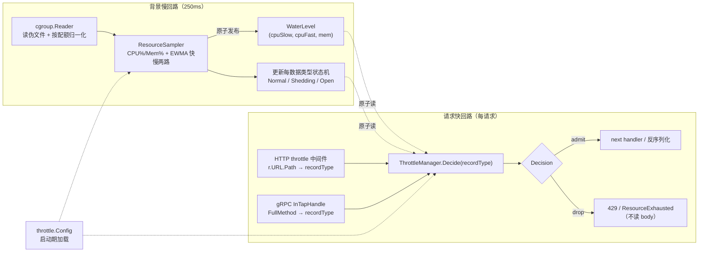
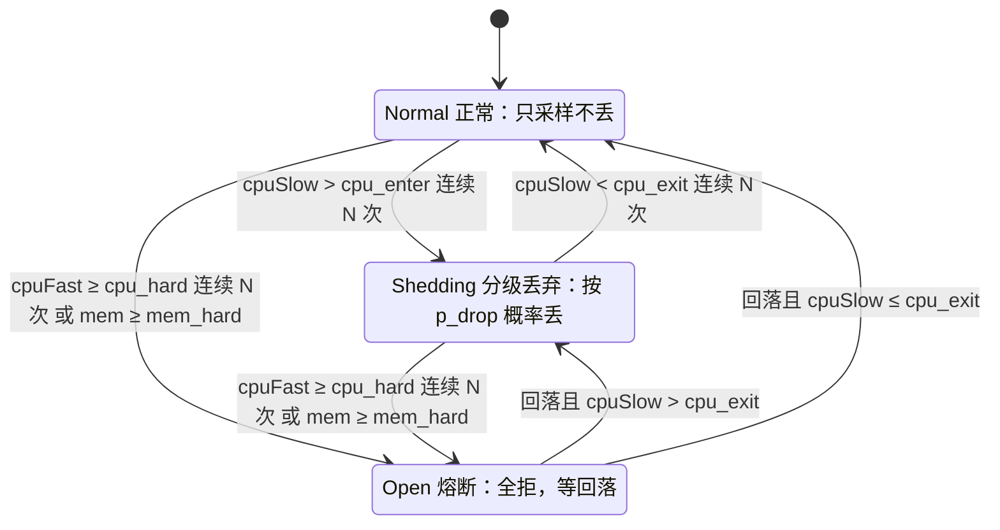
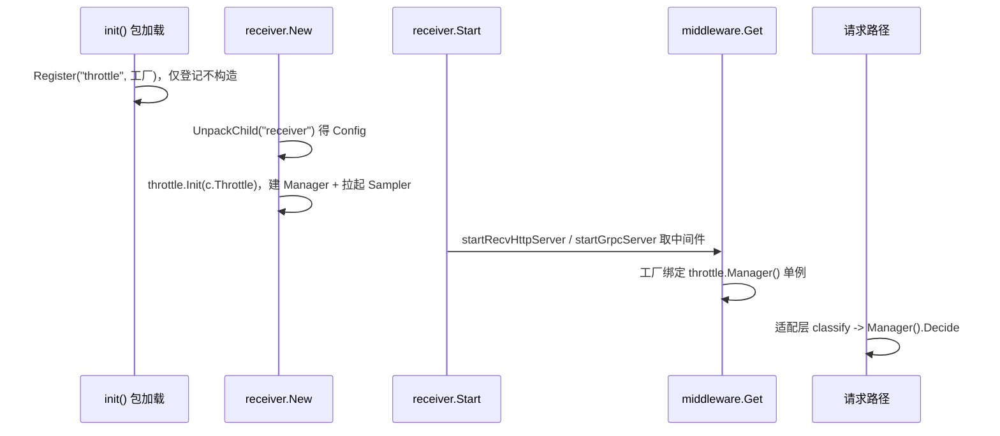

# bk-collector 自适应限流 —— 方案 B（CPU 分级丢弃与内存熔断）

## 0x01 调研与约束

### a. 问题与目标

collector 接收端在 K8s 里被突发流量或大包打满 CPU、内存而崩溃，崩溃后重启又被堆积重试二次压垮，形成自我强化的崩溃循环（背景见 [issue README](./README.md)）。

现有限流（QPS、`maxconns`、`maxbytes`）只数请求数与字节数，与真实 CPU 开销弱相关，大包场景失效。

本方案要让 collector 在资源水位逼近危险线时，按数据类型（traces / metrics / logs / profiles）分级主动丢请求、保住整体不倒，优先覆盖 K8s 形态。

### b. 选型结论

第一期落 **方案 B**：以 CPU 水位平滑分级丢弃为主体，叠加内存硬熔断，方案对比见 [PREPLAN 0x12](./PREPLAN.md)。

| 信号 | 角色 | 触发动作 |
|---|---|---|
| CPU 水位（慢信号） | 主限流 | 按数据类型概率丢弃，优雅降级 |
| CPU 水位（快信号） | 防尖刺 | 越硬线且连续 N 次，全拒 |
| 内存工作集 | 保命熔断 | 越硬线全拒 |

方案 C（自适应并发限）作为后续迭代兜底，不在第一期范围。

### c. 硬约束（来自现状代码）

| 约束 | 事实 | 来源 |
|---|---|---|
| 挂载层 | 限流只在 HTTP / gRPC 中间件层，不侵入 pipeline、processor | [issue README](./README.md) |
| HTTP 中间件形态 | `func(http.Handler) http.Handler`，按 `middlewares` 列表顺序包裹整个 handler | [<源码> httpmiddleware/middleware.go](https://github.com/TencentBlueKing/bkmonitor-datalink/blob/master/pkg/collector/internal/httpmiddleware/middleware.go) |
| gRPC 中间件形态 | 每个中间件产出一个 `grpc.ServerOption`，append 到 server | [<源码> grpcmiddleware/middleware.go](https://github.com/TencentBlueKing/bkmonitor-datalink/blob/master/pkg/collector/internal/grpcmiddleware/middleware.go) |
| 配置形态 | 中间件列表项是扁平 optmap 串 `name;k=v`，装不下分级丢弃配置 | [example.yml](https://github.com/TencentBlueKing/bkmonitor-datalink/blob/master/pkg/collector/example/example.yml) |
| 数据类型 | collector 已有 `define.RecordType`（`traces`、`metrics`、`logs`、`profiles` 等），各 receiver 入站即定型 | [<源码> define/record.go](https://github.com/TencentBlueKing/bkmonitor-datalink/blob/master/pkg/collector/define/record.go) |
| 有效核数 | `define.CoreNum()` 默认回退 `runtime.NumCPU()`（宿主核数），不能直接当归一化分母 | [<源码> define/concurrency.go](https://github.com/TencentBlueKing/bkmonitor-datalink/blob/master/pkg/collector/define/concurrency.go) |
| 无采样回路 | 进程内无 CPU、内存水位采样，仅 admin `/metrics` 暴露 `process_*`、`go_*` | [<源码> receiver/metrics.go](https://github.com/TencentBlueKing/bkmonitor-datalink/blob/master/pkg/collector/receiver/metrics.go) |
| Go 版本 | `go 1.23.0`，`automaxprocs v1.5.2` 仅做日志、未调 `Set()`，没有 Go 1.25 的配额感知红利 | [<源码> collector/go.mod](https://github.com/TencentBlueKing/bkmonitor-datalink/blob/master/pkg/collector/go.mod) |

---

## 0x02 架构设计

### a. 总体思路

过载保护改用容器 cgroup 的真实水位驱动，在入口按数据类型分级决定每个请求放行还是丢。

限流粒度取数据类型而非单个 endpoint，理由有两条：

- endpoint 粒度过细会让配置爆炸、状态机数量不可控。
- 数据类型才是运营想区分的维度（如「保 metrics、可丢 traces」），且与 collector 既有 `define.RecordType` 对得上。

### b. 信号职责：CPU 主限流、内存做熔断

为什么 CPU 当主信号、内存只做熔断，根因在内核对两类资源的处置本就不对称。

```text
CPU 超配额  → CFS 节流（throttling）：被迫变慢，可恢复，压力一降立即回弹
内存超上限  → OOM Killer：进程被杀，在途数据全丢，不可逆
```

应用层据此分工，不能互换。

| 维度 | CPU | 内存 |
|---|---|---|
| 失败形态 | 渐变、可恢复 | 悬崖、致命 |
| 信号特性 | 毫秒级响应，丢载即回落 | 滞后粘滞，丢载后不立即回落（GC 与缓存） |
| 控制方式 | 比例降级（连续旋钮） | 阈值熔断（开关） |
| 应用层目标 | 被节流时保住延迟与质量 | 绝不越线、不被 OOM |

- 业界主信号都用 CPU：go-zero、Kratos 的自适应丢弃以 CPU 为准，内存只作触发开关（如 Envoy overload manager 用堆内存压力触发停接新连接），无人当连续旋钮。
- 内存这路不可省：下游（Kafka 等）变慢致队列堆积时 CPU 可能不高，内存才是真正瓶颈，熔断兜的正是「CPU 没事但被撑死」。

### c. 核心对象模型

采样慢回路与决策快回路解耦：背景每 `250 ms` 采样、原子发布水位，请求路径只做原子读与概率判定，每请求不碰 `/sys/fs/cgroup` 与 `/proc`。



| 对象 | 职责 | 数量 |
|---|---|---|
| `cgroup.Reader` | 读 cgroup v1/v2 伪文件，产出有效核数、CPU 累计耗时、内存工作集与上限 | 单例 |
| `ResourceSampler` | 后台 goroutine，按周期采样、归一化、EWMA、推进状态机、原子发布 | 单例 |
| `WaterLevel` | 不可变水位快照，含 CPU 快慢信号与内存占比 | 每周期一份 |
| `classify` | 预先注册的「路由 → 数据类型」映射，把 HTTP 路径 / gRPC 全方法名归为四类，未命中放行 | 纯函数 |
| `ThrottleManager` | 持有全局阈值、每数据类型状态机与规则，对外暴露 `Decide` | 单例 |
| `Rule` | 单数据类型的丢弃强度（`drop_min` / `drop_max`、`enabled`），阈值全局共用 | 每数据类型一份（至多 4 类） |
| `Decision` | 准入裁决结果：放行、按概率丢、熔断全拒 | 每请求一份 |

### d. 决策状态机

每数据类型一台状态机（traces / metrics / logs / profiles，至多 4 台），状态转移在背景回路按全局水位与该类型阈值推进，请求路径只读状态、不做转移。



| 状态 | 请求路径动作 | 进入条件 |
|---|---|---|
| `Normal` | 全部放行 | 初始态，或从 `Shedding`、`Open` 回落 |
| `Shedding` | 按 `p_drop(cpuSlow)` 概率丢 | `cpuSlow` 越 `cpu_enter` 线连续 N 次 |
| `Open` | 全拒 | `cpuFast` 越 `cpu_hard` 连续 N 次，或 `mem` 越 `mem_hard` |

双时间常数是关键：分级用慢信号（历史权重大）抗抖动，熔断用快信号（历史权重小）防短尖刺漏保护，校准教训见 [PREPLAN 实验 4](./PREPLAN.md)。

把三条阈值线、滞回带与快慢两路信号落到同一时间轴，对照状态机看转移时机：

```text
水位
0.95 |                  /\                  快信号 fast（β=0.7）：灵敏，抢先冲顶
0.90 |=================/  \==============   硬线 cpu_hard：fast 越线且连续 N 次 → Open 全拒
     |        ________/    \________        慢信号 slow（β=0.95）：平滑，不贴线抖
0.80 |-------/----------------------\----   进入线 cpu_enter：slow 升过 → Shedding 按 p_drop 概率丢
     |      /                        \      （0.70～0.80 为滞回带：升过 0.80 才丢、跌回 0.70 才停）
0.70 |-----/--------------------------\--   退出线 cpu_exit：slow 跌回 → 停丢
     |.:*:.                            .:*. 原始采样（抖）经 EWMA 平滑成上面两条曲线
     +----+----------+------+-----------+-→ 时间
        Normal    Shedding  Open    → Normal
```

读图三个要点对应三条决策：

- 滞回带（`0.70`～`0.80`）让分级进退不在单一阈值上横跳。
- 慢信号平滑，决定丢多少，是连续旋钮。
- 快信号灵敏，抢先冲破硬线触发全拒，是保命开关。

### e. 关键协议

挂载点与拒绝时机以「尽早、省 CPU」为准，丢弃发生在解压与反序列化之前。

| 主题 | 协议 |
|---|---|
| 信号读取 | `WaterLevel` 由 `ResourceSampler` 每 `250 ms` 原子发布，请求路径只读 |
| HTTP 拒绝点 | `throttle` 中间件置于 `content_decompressor` 之后入列 *[1]*，按 `r.URL.Path` 归类数据类型后判定，丢弃返回 `429` 加 `Retry-After`、不读 body |
| gRPC 拒绝点 | `throttle` 注册为 `grpc.InTapHandle`，在反序列化前按 `info.FullMethodName` 归类数据类型后判定，拒绝返回 `ResourceExhausted` |
| 配置下发 | 新增结构化 `receiver.throttle` 配置块，启动期一次性加载，中间件持有 manager 引用，详见 0x03g |
| 观测 | `bk_collector_throttle_*` 系列指标，沿用 `promauto` 加 `metricMonitor` 模式，详见 0x03h |

- *[1] 更外层、解压前执行*：列表 inner→outer 包裹、末尾项最先执行（见 `startRecvHttpServer`），`throttle` 列在 `content_decompressor` 之后即解压前拒绝。

---

## 0x03 开发方案

0x02 的两个单例与解耦边界落到新包 `pkg/collector/internal/throttle/`，HTTP 与 gRPC 各加薄适配层，既有 receiver 只动两处，pipeline 与 processor 零改动。

| 文件 · 位置 | 改动 |
|---|---|
| **[Add]** `throttle/cgroup.go` | `cgroup.Reader`，移植 VM `lib/cgroup` 的读取逻辑 |
| **[Add]** `throttle/sampler.go` | `ResourceSampler` 与 `WaterLevel` |
| **[Add]** `throttle/classify.go` | HTTP 路径 / gRPC 方法名 → 数据类型预先注册映射 |
| **[Add]** `throttle/manager.go` | `ThrottleManager` + `Rule` + `Decision` + 每数据类型状态机 |
| **[Add]** `throttle/config.go` | `Config` 协议与默认值 |
| **[Add]** `throttle/metrics.go` | `bk_collector_throttle_*` 指标 |
| **[Add]** `httpmiddleware/throttle.go` | `init` 注册 `"throttle"`，工厂绑定 `Manager()`，按 `r.URL.Path` 归类后判定 |
| **[Add]** `grpcmiddleware/throttle.go` | `init` 注册 `"throttle"`，产出 `grpc.InTapHandle`，按 `info.FullMethodName` 归类后判定 |
| **[Change]** `receiver/config.go` · `Config` | 加 `Throttle throttle.Config` 字段（tag `config:"throttle"`），随 `receiver` 块由 `UnpackChild` 解析 |
| **[Change]** `receiver/receiver.go` · `New` | 解包 `Config` 后调 `throttle.Init(c.Throttle)`，建单例并拉起采样回路 |

算法与读取一律对齐业界既有实现并标注出处，不自造、不引第三方库，避免拖入 eBPF、logrus 等传递依赖。

### a. 信号基础：指标与获取

`cgroup.Reader` 直读容器自身 cgroup 伪文件，对容器内不同挂载布局更稳，读取实现只移植 [VictoriaMetrics lib/cgroup](https://github.com/VictoriaMetrics/VictoriaMetrics/tree/master/lib/cgroup) 一处。

| 信号 | cgroup v2 | cgroup v1 | 用途 |
|---|---|---|---|
| CPU 累计耗时 | `cpu.stat` 的 `usage_usec` | `cpuacct.usage` | 求差得区间 CPU 耗时 |
| CPU 配额 | `cpu.max` 的 `quota period` | `cpu.cfs_quota_us` 与 `cpu.cfs_period_us` | `quota/period` 作归一化分母 *[1][2]* |
| 有效核集合 | `cpuset.cpus.effective` | `cpuset.cpus` | 与配额取小作上限 |
| 内存当前用量 | `memory.current` | `memory.usage_in_bytes` | 工作集的被减项 |
| 可回收文件缓存 | `memory.stat` 的 `inactive_file` | `memory.stat` 的 `total_inactive_file` | 从用量里扣除 |
| 内存上限 | `memory.max` | `memory.limit_in_bytes` | 内存归一化分母 |

- *[1] 取配额链路沿用 VM `lib/cgroup`*：先读控制器挂载根、命中即返回，读不到回退 `/proc/self/cgroup` 子路径，最后解析 `cpu.max`。
- *[2] 先读挂载根更稳*：兜住「leaf 被 bind-mount 到控制器根」的布局，比 `containerd/cgroups` 的 `PidPath` 拼深路径稳（实测见 [PREPLAN 0x05a](./PREPLAN.md)）。

`cgroup.Reader` 协议骨架（只给签名与契约，实现移植 VM `lib/cgroup`）：

```go
type Reader interface {
    EffectiveCores() (float64, bool) // min(cpuset 有效核, quota/period)；false 表示配额未设
    CPUUsageNanos() (uint64, error)  // CPU 累计耗时，单调递增
    MemWorkingSet() (uint64, bool)   // max(0, current - inactive_file)
    MemLimit() (uint64, bool)        // false 表示无限（v2 max / v1 哨兵极大值）
}
```

- **配额保留小数**：分母用 `quota/period` 浮点值，不用 `GOMAXPROCS`（向下取整、最小 2）或 `nproc`（宿主核数）。
- **配额未设要保守回退**：`cpu.max=max` 或 v1 `quota=-1` 时取配置 `fallback_cores`（缺省 `define.CoreNum()`），不回退成全节点核数。
- **内存上限未设则跳过**：`memory.max=max`（或 v1 哨兵极大值）时不做内存归一化，只保留 CPU 分级与熔断。
- **零新增依赖**：仅用 `os`、`strconv`、`strings`。

### b. 计算：CPU 利用率、内存工作集、EWMA

三项算法各自对齐一个业界实现，公式与出处如下。

**（1）CPU 利用率**：速率量，两次采样求差，公式对齐 go-zero `core/stat` 的 `RefreshCpu`，取数仍走 0x03a 的 VM `cgroup.Reader`，不混用 go-zero。

```text
effCores = min(cpuset 有效核数, quota/period)
CPU 利用率 = Δusage / (Δwall × effCores)      # 过载时可大于 1.0，不要截断
```

- 分母用 cgroup 配额，宿主核数会严重低估（线上实测容器报 `14` 核、实配 `1` 核，低估约 `14` 倍，限流永不触发）。

**（2）内存工作集**：对齐 kubelet、cAdvisor 口径，从当前用量扣掉可回收文件缓存（口径见 [Kubernetes 内存工作集解析](https://mtardy.com/posts/memory-kubernetes-golang-ebpf/)）。

```text
workingSet = max(0, current - inactive_file)
内存利用率 = workingSet / limit
```

- 裸 `current` 含可回收页缓存会判高，RSS 漏掉活跃文件缓存会偏低，两者都不取。

**（3）EWMA 平滑**：对齐 go-zero、Kratos aegis 的同族衰减，源自 [RFC 6298](https://datatracker.ietf.org/doc/html/rfc6298) 的 RTT 估计，一阶低通、内存 `O(1)`。

```text
s_t = (1 - β) · x_t + β · s_{t-1}      # β 为历史权重，越大越平滑越滞后
```

- 快慢两路用不同 β：慢信号 `β=0.95` 驱动分级抗抖，快信号 `β=0.7` 驱动熔断防漏。
- 递推式仅三行，直接内联实现并注释标注出处，不引第三方 EWMA 库。

### c. ResourceSampler：采样回路

`ResourceSampler` 是单例后台 goroutine，承接 0x02c 的慢回路职责。

- **职责**：每 `sample_interval` 调 `cgroup.Reader` 取一次原始水位，算 CPU 快慢两路 EWMA 与内存占比，推进每数据类型状态机，原子发布 `WaterLevel`。
- **发布方式**：`WaterLevel` 用 `atomic.Pointer[WaterLevel]` 整体替换，请求路径无锁读，决策与采样彻底解耦。
- **生命周期**：由 `throttle.Init` 在启动期拉起，进程级单例，四类状态机启动期建好、运行期只读不增减。

协议骨架：

```go
type WaterLevel struct{ CPUSlow, CPUFast, Mem float64 }

func (s *ResourceSampler) Level() *WaterLevel   // 原子读，请求路径用
func (s *ResourceSampler) tick()                // 周期回调：采样 + EWMA + 状态机 + 发布
```

### d. 决策

`ThrottleManager` 是单例裁决者，HTTP 与 gRPC 适配层只把请求归类后调 `Decide`，自身不持有状态。

决策只此一处，两个入口零重复。

**`Decide` 协议**

```go
type Action uint8 // Admit / Shed / Open

// rt 复用 collector 既有 define.RecordType，仅 traces/metrics/logs/profiles 四类参与限流
func (m *ThrottleManager) Decide(rt define.RecordType) Action
// Open      -> 全拒
// Shed      -> 以 p_drop(cpuSlow) 概率丢，否则放行（公式见下）
// Admit     -> 放行（含该类型 enabled=false，恒放行）
```

**丢弃概率**：`Shed` 态按慢信号在 `cpu_enter`～`cpu_hard` 间线性插值，落在该类型的 `drop_min`～`drop_max` 之间。

```text
t      = clamp((cpu_slow - cpu_enter) / (cpu_hard - cpu_enter), 0, 1)
p_drop = drop_min + (drop_max - drop_min) * t
```

- `cpu_slow ≤ cpu_enter` → `p_drop = drop_min`（缺省 `0`）
- `cpu_slow ≥ cpu_hard` → `p_drop = drop_max`（缺省 `1`）
- `Open` 态不走此式，直接全丢

**端点归类**：`classify` 用预先注册的「路由 → 数据类型」映射表把 HTTP 路径与 gRPC 全方法名归为四类，对齐 collector 既有 `define.RecordType`。

| 数据类型 | HTTP 路径 | gRPC 全方法名 |
|---|---|---|
| `traces` | `/v1/traces` | `opentelemetry.proto.collector.trace.v1.TraceService/Export` |
| `metrics` | `/v1/metrics`、`/prometheus/write` | `opentelemetry.proto.collector.metrics.v1.MetricsService/Export` |
| `logs` | `/v1/logs` | `opentelemetry.proto.collector.logs.v1.LogsService/Export` |
| `profiles` | `/pyroscope/ingest` | 无（connect-rpc 经 HTTP 路由上报） |

- 第一期只注册上表端点，其余（admin、proxy、zipkin、skywalking 等）未命中放行，暂不限流。
- 路径取自各 receiver 的入站常量（`routeV1Traces`、`routeRemoteWrite` 等），与 receiver 自身落 `RecordType` 解耦。

**决策器装配**：中间件注册表只认 optmap 串，够不到结构化 `receiver.throttle`，靠启动期单例搭桥。



- `New` 早于 `Start`，单例在工厂执行前已就绪。
- `enabled=false` 时 `Init` 空跑，工厂返回放行中间件。

### e. HTTP 挂载

工厂忽略 optmap 串，绑定 `throttle.Manager()` 单例，按 `r.URL.Path` 归类后判定。

```go
func Throttle(_ string) MiddlewareFunc
// a := Manager().Decide(classify(r.URL.Path))
//   Open / Shed 命中丢弃 -> 写 429 + Retry-After 后 return（不读 body）
//   Admit              -> next.ServeHTTP(w, r)
```

挂载顺序由 `startRecvHttpServer` 的包裹循环 `handler = fn(handler)` 决定：

- 列表末项裹在最外层、最先执行，`throttle` 列在 `content_decompressor` 之后即位于其外层。
- 请求先过限流再解压，丢弃落在解压前，省掉无谓的解压与反序列化开销。

### f. gRPC 挂载

工厂产出 `grpc.InTapHandle`，在读消息体前按 `info.FullMethodName` 判定。

```go
func Throttle(_ string) grpc.ServerOption
// grpc.InTapHandle(func(ctx context.Context, info *tap.Info) (context.Context, error) {
//   命中丢弃 -> nil, status.Error(codes.ResourceExhausted, ...)
//   放行     -> ctx, nil
// })
```

- `InTapHandle` 是 gRPC 最省 CPU 的拒绝点，unary 与 streaming 都在首帧判定，一处即覆盖。
- grpc-go 限定每个 server 只一个 tap，重复注册会 panic，与既有 `maxbytes`（`grpc.MaxRecvMsgSize`）互不冲突。

### g. 配置协议

新增结构化 `receiver.throttle` 配置块，按 signal / thresholds / rules 三层承载，中间件列表里只放占位项 `throttle`，解决 optmap 装不下的矛盾。

最小配置示例：

```yaml
receiver:
  http_server:
    middlewares:
      - "logging"
      - "cors"
      - "content_decompressor"
      - "throttle"                       # 占位，解压之后入列 => 解压之前执行
      - "maxconns;maxConnectionsRatio=256"
  grpc_server:
    middlewares:
      - "throttle"                       # 注册为 grpc.InTapHandle
      - "maxbytes;maxRequestBytes=8388608"

  throttle:
    enabled: true
    sample_interval: "250ms"
    signal:
      cpu_slow_beta: 0.95                # 慢信号，分级
      cpu_fast_beta: 0.7                 # 快信号，熔断
      fallback_cores: 0                  # 0 取 define.CoreNum()
    thresholds:                          # 全局共用，不按类型区分
      cpu_enter: 0.80                    # 慢信号越线 → 开始分级丢
      cpu_exit: 0.70                     # 慢信号回落 → 停丢（与 cpu_enter 成滞回带）
      cpu_hard: 0.90                     # 快信号越线连续 N 次 → 全拒
      mem_hard: 0.92                     # 内存工作集越线 → 全拒
      breach_n: 2
    rules:                               # 按数据类型只调丢弃强度
      default: { drop_min: 0.0, drop_max: 1.0 }
      metrics: { enabled: false }        # metrics 永不限流（取舍见下）
```

字段契约（主表）：

| 字段 | 类型 | 必填 | 说明 |
|---|---|---|---|
| `throttle.enabled` | `bool` | 是 | 总开关，关闭则中间件直接放行 |
| `throttle.sample_interval` | `duration` | 否 | 采样周期，缺省 `250ms` |
| `throttle.signal` | `object` | 否 | 信号采样参数，见 `signal` 子结构 |
| `throttle.thresholds` | `object` | 是 | 全局阈值，所有数据类型共用，见 `thresholds` 子结构 |
| `throttle.rules` | `object` | 否 | 按数据类型调丢弃强度，键限 `default`、`traces`、`metrics`、`logs`、`profiles`，见 `rules` 子结构 |

`throttle.signal` 子结构：

| 字段 | 类型 | 必填 | 说明 |
|---|---|---|---|
| `cpu_slow_beta` | `float` | 否 | 慢信号 EWMA 历史权重，缺省 `0.95` |
| `cpu_fast_beta` | `float` | 否 | 快信号 EWMA 历史权重，缺省 `0.7` |
| `fallback_cores` | `float` | 否 | 配额未设时的有效核数，`0` 取 `define.CoreNum()` |

`throttle.thresholds` 子结构（全局共用）：

| 字段 | 类型 | 必填 | 说明 |
|---|---|---|---|
| `cpu_enter` | `float` | 是 | 慢信号越线进入分级丢弃 |
| `cpu_exit` | `float` | 是 | 慢信号回落退出分级丢弃，与 `cpu_enter` 成滞回带 |
| `cpu_hard` | `float` | 是 | 快信号硬熔断线，连续 `breach_n` 次越线则全拒 |
| `mem_hard` | `float` | 是 | 内存工作集硬熔断线 |
| `breach_n` | `int` | 否 | 连续越界次数门控，缺省 `2` |

`throttle.rules.<type>` 子结构（`default` 兜底，其余只写差异项）：

| 字段 | 类型 | 必填 | 说明 |
|---|---|---|---|
| `enabled` | `bool` | 否 | 缺省 `true`，置 `false` 则该类型完全不限流（含熔断），恒放行 |
| `drop_min` | `float` | 否 | 丢弃概率下界，`cpu_slow ≤ cpu_enter` 时取此值，缺省 `0` |
| `drop_max` | `float` | 否 | 丢弃概率上界，`cpu_slow ≥ cpu_hard` 时取此值，缺省 `1` |

**让某类数据永不丢（例：metrics）**，按是否保留熔断兜底二选一：

- `enabled: false`：该类型完全不限流、连熔断也不作用，仅靠内核 OOM 兜底。
- `drop_max: 0`：CPU 分级永不丢它，但仍受全局 `cpu_hard` / `mem_hard` 熔断，极端尖刺或内存悬崖时仍会被全拒。

```yaml
rules:
  metrics: { enabled: false }        # 完全豁免
  # 或：metrics: { drop_max: 0.0 }   # 不分级丢，但保留 cpu_hard / mem_hard 熔断
```

本期不涉及热重载，配置仅启动期加载、变更走重启生效。

### h. 观测指标

沿用 `bk_collector_*` 命名加 `promauto` 加 `metricMonitor` 模式（参照 [<源码> receiver/metrics.go](https://github.com/TencentBlueKing/bkmonitor-datalink/blob/master/pkg/collector/receiver/metrics.go)）。

| 指标 | 类型 | 标签 | 用途 |
|---|---|---|---|
| `bk_collector_throttle_dropped_total` | counter | `protocol`、`record_type`、`action` | 丢弃量，`action` 区分 `shed`、`open` |
| `bk_collector_throttle_water_level` | gauge | `resource` | 当前水位，`resource` 取 `cpu_slow`、`cpu_fast`、`mem` |
| `bk_collector_throttle_state` | gauge | `record_type` | 状态机当前态（0 Normal、1 Shedding、2 Open） |

---

## 0x04 验收与验证

验证分三层：单测锁定取数与决策正确，压测在受限容器验证端到端丢弃，集成验证真实 collector 平稳运行。

### a. 单测门禁

新增包 `pkg/collector/internal/throttle/`，门禁 `cd pkg/collector && go test ./internal/throttle/...`。

| 测试文件 | 覆盖点 | 断言重点 |
|---|---|---|
| `cgroup_test.go` | v1/v2 fixture 解析与回退分支 | 有效核数、CPU 累计耗时、工作集计算正确，含 v1 `-1`、v2 `max`、内存无限哨兵 |
| `sampler_test.go` | 两次采样 CPU%、EWMA 快慢两路 | 过载越 `1.0`、宿主核数分母被否决、β 越大越平滑 |
| `classify_test.go` | 端点 → 数据类型归类 | 四类注册端点命中正确（含 metrics 的 `/v1/metrics`、`/prometheus/write`）、未注册端点放行 |
| `manager_test.go` | 状态机转移与丢弃概率插值 | 滞回带不横跳、连续门控过滤毛刺、`p_drop` 在 `drop_min`～`drop_max` 线性插值与边界、`enabled=false` 恒放行 |

### b. 压测工具

压测程序用 Go 写、仅依赖标准库，放在 collector example 目录下单独编译成二进制。

- 位置：`pkg/collector/example/loadgen/main.go`（`package main`）。
- 编译：`cd pkg/collector && go build -o loadgen ./example/loadgen`。
- 运行：`./loadgen -url http://127.0.0.1:4318/v1/traces -token <TOKEN>`。
- 行为：向 OTLP HTTP `/v1/traces` 发 JSON trace，三阶段串行施压，逐阶段打印 `200` / `429` / `503` 计数与成功请求 p99。
- 参数：`-url` 目标地址、`-token` 写 `X-BK-TOKEN` 头、`-c` 并发数（缺省 `50`）、`-d` 每阶段时长（缺省 `30s`）。

| 阶段 | 负载 | 目的 |
|---|---|---|
| warmup | 低并发、小包 | 建立基线，确认不误丢 |
| burst | 高并发、小包 | 触发 CPU 快信号熔断 |
| bigpayload | 并发不变、单包成本翻倍 | 验证成本盲点，触发慢信号分级 |

### c. OrbStack 集成验证

把真实 collector 放进 OrbStack 受限容器跑，复现流量冲击、确认平稳运行。

- **环境**：OrbStack（cgroup v2），容器限 `--cpus=1 --memory=300m`，模拟 K8s 紧资源。
- **配置**：启用 OTLP HTTP 接收、`throttle` 中间件与 `receiver.throttle` 块，配最简管道。
- **施压**：编译好的 `loadgen` 跑三阶段，对照 `throttle.enabled` 关与开。

平稳运行的验收口径如下，全部满足即达标。

| 验收项 | 判定 |
|---|---|
| 不崩溃 | 开启限流全程无 OOM、无重启（对照关闭限流应能复现崩溃或积压爆炸） |
| CPU 收敛 | 容器 CPU 稳态压在配额下，`docker stats` 与进程自读 `cpu_slow` 收敛到 `cpu_enter` 线附近 |
| 尾延迟受保护 | 大包阶段成功请求 p99 显著低于关闭限流 |
| 早丢省 CPU | `429`、`503` 在解压、反序列化之前返回 |
| 豁免类不丢 | `metrics` 配 `enabled: false` 时全程 `0` 丢弃，CPU、内存双高也不误伤 |
| 可观测 | `bk_collector_throttle_dropped_total`、`throttle_water_level`、`throttle_state` 随负载与数据类型如实变化 |

原型快路径（可选）：把 `throttle` 包嵌入最小 `loadserver` 加合成 CPU 处理，先在受限容器快速验证决策行为，再做真实 collector 集成（原型评估见 [PREPLAN 0x11e](./PREPLAN.md)）。

---

## 0x05 实施进展

| 时间 | 结论性进展 |
|---|---|
| `2026-06-17` | 方案 B 定稿并收敛第一期范围 <br />[a] 确立「CPU 主限流、内存做熔断」，落到 `ResourceSampler` 与 `ThrottleManager` 两单例，cgroup 直读取数单一基准 VM `lib/cgroup`、EWMA 对齐 RFC 6298，go-zero `core/stat` 仅作 CPU 速率公式对齐 <br />[b] 移除 GOMEMLIMIT 软背压与配置热重载，内存只留硬熔断、配置仅启动期加载 <br />[c] 限流粒度由 endpoint 改为数据类型（traces/metrics/logs/profiles）、每类一台状态机，端点用预先注册映射表归类（准确路径如 `/v1/traces`、`/prometheus/write`、`/pyroscope/ingest`） <br />[d] 配置收敛为 signal / thresholds / rules 三层：阈值全局共用（`cpu_enter`/`cpu_exit`/`cpu_hard`/`mem_hard`/`breach_n`），每类只调 `drop_min`/`drop_max`，丢弃概率在 `cpu_enter`～`cpu_hard` 线性插值，`enabled: false` 整类豁免，指标标签按 `record_type` <br />[e] 验收含单测门禁、Go 压测工具（collector example 目录、单独编译二进制）与 OrbStack 集成口径 |

---

## 0x06 参考 & 版本锚点

### a. 参考

业界实现（算法与获取层借鉴出处）：

- cgroup 读取与配额归一化（获取层唯一基准）：[VictoriaMetrics lib/cgroup](https://github.com/VictoriaMetrics/VictoriaMetrics/tree/master/lib/cgroup)
- CPU 速率公式（仅算法对齐，不取数）：[go-zero core/stat](https://github.com/zeromicro/go-zero/tree/master/core/stat)
- 自适应丢弃：[go-zero adaptiveshedder](https://github.com/zeromicro/go-zero/blob/master/core/load/adaptiveshedder.go)、[Kratos aegis](https://github.com/go-kratos/aegis)
- 过载模型：[Google SRE — Handling Overload](https://sre.google/sre-book/handling-overload/)、[Netflix concurrency-limits](https://github.com/Netflix/concurrency-limits)
- EWMA 出处：[RFC 6298](https://datatracker.ietf.org/doc/html/rfc6298)
- 内存口径与熔断：[Kubernetes 内存工作集解析](https://mtardy.com/posts/memory-kubernetes-golang-ebpf/)、[Envoy overload manager](https://www.envoyproxy.io/docs/envoy/latest/configuration/operations/overload_manager/overload_manager)

collector 锚点（优先读本地代码库）：

- 中间件注册：[<源码> httpmiddleware/middleware.go](https://github.com/TencentBlueKing/bkmonitor-datalink/blob/master/pkg/collector/internal/httpmiddleware/middleware.go)、[<源码> grpcmiddleware/middleware.go](https://github.com/TencentBlueKing/bkmonitor-datalink/blob/master/pkg/collector/internal/grpcmiddleware/middleware.go)
- 既有样例：[<源码> httpmiddleware/maxconns.go](https://github.com/TencentBlueKing/bkmonitor-datalink/blob/master/pkg/collector/internal/httpmiddleware/maxconns.go)、[<源码> receiver/metrics.go](https://github.com/TencentBlueKing/bkmonitor-datalink/blob/master/pkg/collector/receiver/metrics.go)
- 挂载与配置：[<源码> receiver/receiver.go](https://github.com/TencentBlueKing/bkmonitor-datalink/blob/master/pkg/collector/receiver/receiver.go)、[<源码> receiver/config.go](https://github.com/TencentBlueKing/bkmonitor-datalink/blob/master/pkg/collector/receiver/config.go)
- 调研草稿：[PREPLAN](./PREPLAN.md)

### b. 版本锚点

| 状态 | 分支 | 里程碑 | PR |
|---|---|---|---|
| 🔄 | `<branch_name>` | 支持自适应限流 | 待创建 |
