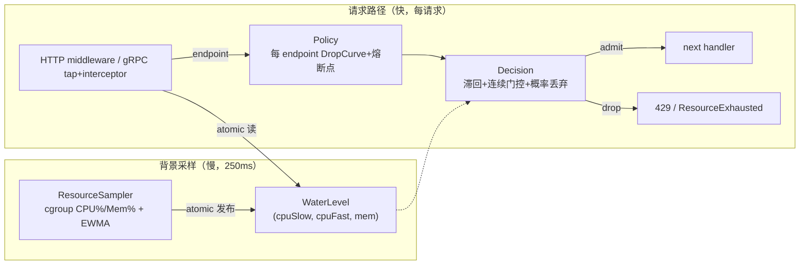
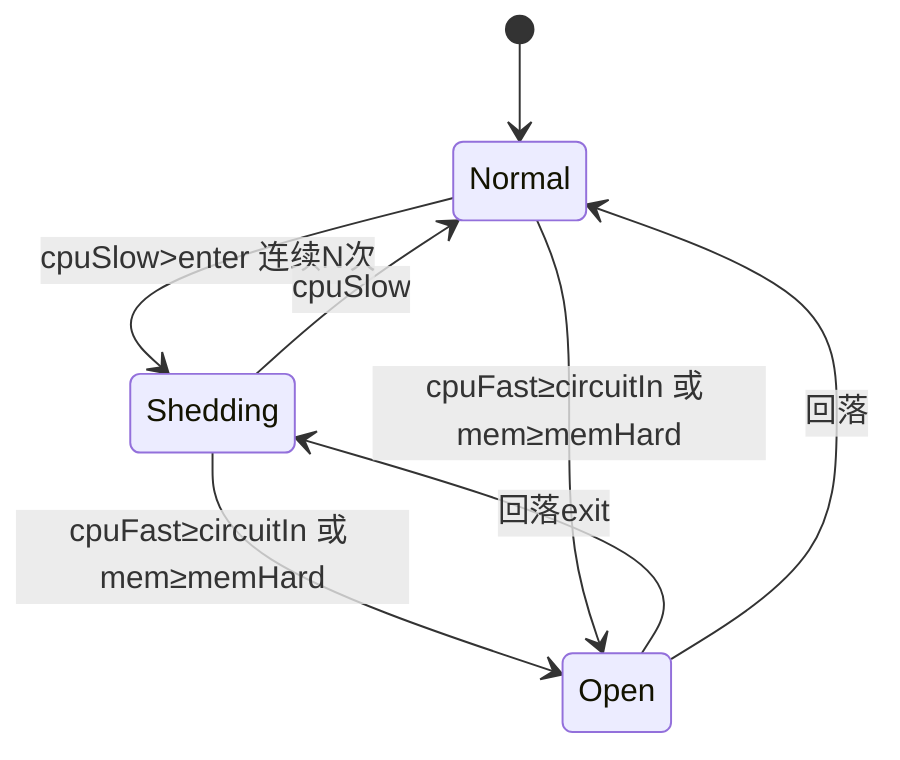
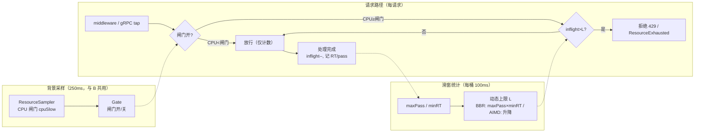

# bk-collector 自适应限流 —— 方案调研与对比草稿

> 本文是第一轮调研草稿，给出候选方案、最小化验证与对比，为正式 PLAN 提供决策依据，尚未锁定架构与实现。

## 0x01 调研结论速览

先交代背景：collector 接收端在 K8s 里可能被突发流量或「大包」打满 CPU、内存而崩溃，本文研究如何按真实资源水位主动丢请求、保住整体不倒。

专有名词集中解释见 [0x02 术语速查](#0x02-术语速查)。

核心结论六条：

- **成本盲**：现有限流（QPS、maxconns、maxbytes）只数请求数或字节数，不看真实 CPU 开销，大包相位仍会压垮系统（仿真积压达 65）。
- **要按容器配额算水位**：3 核负载按容器 2 核配额算出约 1.5（过载可见），按宿主机 14 核算只有 0.21（永不触发），`define.CoreNum()` 默认回退宿主核数、不能直接当分母。
- **瞬时信号不能直接查表丢弃**：噪声会让「丢、放」来回横跳（仿真 614 次），需要 EWMA 平滑、双阈值滞回、连续越界门控三件套（抖动降到 36 次）。
- **慢信号管分级、快信号管熔断**：单一慢平滑信号会让硬熔断对短尖刺失灵，故用双时间常数，慢信号决定按比例丢、快信号配合连续 N 次决定一刀切。
- **丢弃要尽早且省 CPU**：HTTP 在中间件入口、解压之前丢，gRPC 用 `tap.InTapHandle` 在反序列化之前拒绝。
- **中间件启动后不可改配置**：阈值若要运行时可调，需引入原子配置持有者或走 processor 路径，代价见 [0x13 热重载代价评估](#0x13-热重载代价评估)。

**推荐（第一期）**：以方案 B（CPU 水位平滑分级丢弃）为主体，叠加内存维度硬熔断，方案 C（自适应并发限）作为后续迭代兜底。

---

## 0x02 术语速查

全文术语先在此集中解释，后续小节默认读者已了解。

| 术语 | 一句话解释 |
|---|---|
| 水位（water level） | 某资源当前用量 ÷ 配额，例如 CPU 用了配额的 80% 即水位 0.80 |
| cgroup | Linux 给容器划 CPU、内存配额的内核机制，容器内要按配额算用量、不能按宿主机总量 |
| 有损降级（load shedding） | 过载时主动拒绝一部分请求，牺牲局部、保住整体不崩 |
| 熔断（circuit break） | 水位到危险线时直接全拒，等回落再恢复 |
| EWMA（指数加权移动平均） | 平滑算法，新采样占小权重、历史占大权重，用来抹平抖动 |
| 滞回（hysteresis） | 进入和退出用两条不同的线（如 0.80 进、0.70 出），避免贴一条线反复横跳 |
| 连续越界门控 | 必须连续 N 次超线才动作，过滤单次毛刺误触发 |
| 双时间常数 | 分级丢弃用慢信号防抖，硬熔断用快信号防漏，两路分开 |
| BBR、AIMD | 两种自适应并发控制算法，按反馈动态调「同时在处理的请求上限」，不设固定阈值 |
| 在途并发（inflight） | 当前同时在处理、还没返回的请求数 |
| 有效吞吐（goodput） | 真正被成功处理的请求量，区别于收到的总量 |
| 积压（backlog） | 堆在系统里还没处理完的请求量，持续上涨即内存爆、OOM 前兆 |
| 优先级分级（criticality） | 给流量分重要等级，过载时先丢低优先级 |
| 工作集（working set） | 内存真实占用，等于总用量减去可回收的文件缓存，避免被 page cache 虚高误判 |
| GOMEMLIMIT | Go 的软内存上限，设到配额约 90% 可提前触发 GC、形成背压 |
| tap、InTapHandle | gRPC 在反序列化请求体之前就能拦截的钩子，可在最省 CPU 处拒绝 |
| 中间件（middleware） | 包在真正处理逻辑外层的拦截层，请求进来先过它 |
| optmap | 现有中间件的扁平配置串，形如 `name;k=v,k2=v2` |
| 翻转（flips） | 仿真里「丢、放」状态来回切换的次数，越多代表越抖 |
| 消融实验（ablation） | 逐项开关某个机制，单独衡量它的贡献 |

---

## 0x03 现状 Grounding（代码事实）

> 代码库 `bkmonitor-datalink/pkg/collector`，以下为后续设计的硬约束。

### a. 中间件模型

| 维度 | HTTP | gRPC |
|---|---|---|
| 形态 | `func(http.Handler) http.Handler` | `grpc.ServerOption` |
| 挂载 | `receiver.go` 按 `middlewares` 列表包裹整个 handler，非按路由 | 同左，append 到 `[]grpc.ServerOption` |
| 包裹方向 | 列表 inner→outer，末尾项最外层、最先执行 | — |
| 分级粒度 | 在中间件内按 `r.URL.Path` 匹配 endpoint | 在拦截器内按 `info.FullMethod` 匹配 |
| 注册 | `httpmiddleware.Register(name, fn)` | `grpcmiddleware.Register(name, fn)` |
| 配置 | `"name;k=v,k2=v2"`（optmap） | 同左 |

- 既有样例：`maxconns`（信号量 `CoreNum()*ratio`，满则 429）、`maxbytes`（HTTP 200MB、gRPC `MaxRecvMsgSize` 8MB）。
- gRPC 现有 `maxbytes` 是 `ServerOption` 而非拦截器。
- 自适应丢弃需新增 `ChainUnaryInterceptor` 与 `ChainStreamInterceptor`，SkyWalking 含 client-stream、必须覆盖 stream。
- `grpc.UnaryServerInterceptor` 的 `req` 已是反序列化后对象，在此丢弃省不了 protobuf 解析 CPU。
- `grpc.InTapHandle` 在读消息前触发，是更省 CPU 的拒绝点（建议优先）。

### b. 资源信号现状

- `define.CoreNum()` 取配置 `max_procs`，缺省回退 `runtime.NumCPU()`（宿主机核数）。
- `automaxprocs v1.5.2` 已是依赖，但仅调用 `maxprocs.Logger`、从未调用 `maxprocs.Set()`，`GOMAXPROCS` 未按 cgroup 配额自动设置。
- collector 进程内无 CPU、内存水位采样回路，仅 admin `/metrics` 暴露 `process_*` 与 `go_*`。
- 已有间接依赖 `containerd/cgroups v1.0.3`、`prometheus/procfs v0.11.0`，`gopsutil` 与 `automemlimit` 不在 collector go.mod。

### c. Endpoint 清单（分级策略的对象）

| 协议、源 | 路径或 gRPC 全方法 | 数据类型 |
|---|---|---|
| OTLP HTTP | `/v1/traces` `/v1/trace` `/v1/metrics` `/v1/logs` | traces、metrics、logs |
| OTLP gRPC | `…trace.v1.TraceService/Export` 等三个 | traces、metrics、logs |
| Jaeger | `/jaeger/v1/traces`、`jaeger.api_v2.CollectorService/PostSpans` | traces |
| Zipkin | `/api/v2/spans` | traces |
| SkyWalking | `/v3/segment(s)`、`TraceSegmentReportService/collect`（stream）等 | traces、metrics |
| Pushgateway | `/metrics/job/...`（4 路） | pushgateway |
| RemoteWrite | `/prometheus/write` | remotewrite |
| 其他 | `/v1/beat` `/v1/logpush` `/fta/v1/event` `/pyroscope/ingest` | beat、log、event、profile |

### d. 观测与热重载约束

- 指标遵循 `bk_collector_*` 加 `promauto` 加 `metricMonitor` 模式（参照 `semaphore.go`）。
- 中间件配置启动期固定，`Receiver.Reload` 只刷新 SkyWalking 配置、不重建中间件，运行时可调阈值需额外设计。

---

## 0x04 业界方案调研

| 方案 | 信号 | 控制算法 | 优点 | 缺点 | 对「CPU 驱动分级丢弃」的适配 |
|---|---|---|---|---|---|
| Google SRE（Handling Overload） | 服务端利用率（CPU 为主，含内存），客户端 accept 率 | 服务端按 criticality 分级丢弃，客户端 `p=max(0,(req−K·acc)/(req+1))`，K≈2 | 工业级验证，分级、优先级理念可借鉴 | 服务端算法偏框架，需自定义「利用率→丢弃」映射 | ★★★★★ 核心理念契合，本方案的分级即 criticality 的 endpoint 化 |
| go-zero、Kratos BBR shedding | CPU 利用率（闸门）加滑窗 inflight | CPU 超阈值（默认 90%）启动，容量按 `maxPass×minRT` 估算，inflight 超容量则拒绝，随 CPU 线性收紧、保底放行 10% | Go 原生、CPU 驱动，BBR 抗成本变化 | 全局 inflight 语义，非按 endpoint 丢弃率曲线 | ★★★★ 可作底座、兜底，CPU 闸门加 EWMA 直接可复用 |
| Netflix concurrency-limits | 延迟梯度（Gradient2、Vegas） | `gradient=clamp(longRtt/curRtt,0.5,1)`，`newLimit=gradient·limit+√limit` 再平滑 | 全自适应、零静态阈值 | 依赖延迟信号，collector 接收多为单向 export、延迟信号弱 | ★★ 延迟驱动与 CPU 驱动诉求错位，参考其平滑思想 |
| Sentinel 系统自适应 | load1、CPU usage、avgRT、并发、QPS | BBR，load1 启发加并发超 `maxQps·minRT` 触发 | 多信号融合，CPU usage 模式灵敏 | 偏 JVM 通用框架，多信号调参复杂 | ★★★ CPU usage 模式与本方案一致，可借鉴多信号兜底 |
| Envoy Overload Manager | cgroup 内存、CPU、heap、FD | 资源监控器触发动作（95% 停止收请求、92% 关 keepalive），多触发器取 max | 内存熔断范本（cgroup v1/v2 感知），早降级点 | C++ 框架，移植成本高 | ★★★★ 内存维度硬熔断的直接范本 |
| Meta Fail at Scale（CoDel、Adaptive LIFO） | 队列驻留时延 | 队列时延超 target 切短超时丢弃，拥塞时 FIFO 转 LIFO | 控制尾延迟、保护吞吐 | 需要请求队列模型，collector 入口非显式队列 | ★★ 思路参考（早丢、丢老请求），非主路径 |
| token、leaky bucket（现状 QPS） | 请求数 | 固定速率 | 简单 | 成本盲，大包、重解析下失效 | ✗ 验证证实不足，需被资源信号补充 |

deepflow-agent 是资源自限范本：10 s `guard` 回路读自身 RSS 加 CPU，软越界停处理、硬越界或连续 2 次自重启，配滞回与连续越界门控。

它的内存不只看 cgroup 计数（page cache 会虚高），改用工作集（usage 减 inactive_file）。

---

## 0x05 候选方案总览

四个方案是同一目标的不同收敛形态，并非互斥，D 是 A、B、C 的组合上限。

| 方案 | 一句话定位 | 角色 |
|---|---|---|
| A 静态水位曲线 | 水位直接查折线得丢弃率，最直观但会抖 | 起点，需演化为 B |
| B 平滑分级丢弃 | A 加 EWMA、滞回、双信号，稳且保留分级语义 | 第一期主体 |
| C 自适应并发限 | 不设阈值，动态调在途并发上限 | B 的兜底底座 |
| D 混合防线 | CPU 分级、内存熔断、并发兜底三道并存 | 长期形态 |

逐个方案的图解原理见 0x06 到 0x09，验证与对比见 0x10 到 0x11。

---

## 0x06 方案 A：静态水位曲线

本质：把 CPU、内存的瞬时水位直接查一条预设折线，得到丢弃概率。

### a. 原理图解

每个 endpoint 配一条「水位到丢弃率」的折线，请求到来时按当前水位查表，命中熔断点则全丢。

```text
丢弃率
100% |                /---------  >=0.90 全丢（熔断）
     |               /
     |              /
     |             /     0.80->0.90 段：丢弃率
     |            /      随水位线性上升
     |           /
  0% |----------/        <0.80：全部放行
     +----------+-----+------->  CPU 水位
              0.80  0.90
```

### b. 为什么不能直接用

裸瞬时信号噪声大，会贴着进入线上下穿越，每次穿越就翻转一次「丢、放」。

```text
裸瞬时信号有噪声，贴着进入线 0.80 反复穿越：

水位
0.85 |   *       *       *      * = 一次采样
0.80 |----------------------- 进入线（被反复穿越）
0.75 |      *        *      *
     +-----------------------> 时间
每次穿越就翻转一次「丢 / 放」，一轮仿真约 614 次 -> 系统震荡
```

- **优点**：直观、完全满足产品诉求，与 maxbytes、maxconns 同层。
- **缺点**：裸瞬时信号剧烈抖动，且 CPU 饱和后信号顶到 1.0 不再上升、无法区分过载深浅。
- **判定**：方向正确但工程上不可直接用，需演化为 B。

---

## 0x07 方案 B：平滑分级丢弃（推荐主体）

本质：在 A 的折线之上，先把信号平滑成一条稳的线再查表，并用快慢两路信号分别管「分级」和「熔断」。

### a. 原理图解

原始水位先过 EWMA 变平滑，进入线与退出线之间留一条滞回带避免横跳，另有一条快信号熔断线兜底短尖刺。

```text
水位
0.90 |======================  熔断线：快信号越过且连续 N 次 -> 全丢
     |           /----------  EWMA 平滑线（稳，不再贴线抖）
0.80 |----------/-----------  进入线：升过才开始按比例丢
0.70 |---------/------------  退出线：跌回才停丢（0.70~0.80 为滞回带）
     |  .:*:.                 原始信号（抖）经 EWMA 平滑成上面的曲线
     +----------------------> 时间
```

直觉是「分级丢弃用慢平滑信号稳住，硬熔断用快信号防漏」，两路分工即双时间常数。

### b. 核心对象模型



- **资源采集器（ResourceSampler）**：单例后台 goroutine，250 ms 采样 cgroup CPU% 与内存工作集%、做 EWMA 平滑，通过 atomic 发布。
- **采样与决策解耦**：采样慢、读 `/sys/fs/cgroup`，决策快、只做原子读，每请求绝不触碰 `/proc`。
- **分级策略（Policy）**：维护「endpoint 到折线加熔断点」的映射，HTTP 按路径、gRPC 按方法名解析，未命中走默认。
- **挂载适配（Integration）**：复用既有 HTTP middleware 与 gRPC tap 加 interceptor 注册表。

### c. 决策状态机



- **双时间常数**：`Shedding` 用慢 EWMA 抗抖动，`Open` 硬熔断用快信号加连续 N 防尖刺漏保护。
- **丢弃强度**：`Shedding` 态按 `DropCurve(cpuSlow)` 概率丢，`Open` 态全丢。
- **内存独立**：`mem ≥ memHard` 直接进 `Open`，并由 `GOMEMLIMIT` 提供 GC 背压。

### d. 关键协议与边界

| 主题 | 草图 |
|---|---|
| 信号采集 | `WaterLevel() (cpuSlow, cpuFast, mem float64)`，后台 250 ms 刷新，atomic 位存 |
| endpoint 配置 | optmap 扁平串装不下每 endpoint 折线，需结构化配置块，是与现有中间件配置形态的张力、需 PLAN 决策 |
| HTTP 丢弃点 | 中间件置于请求路径早段（解压前），丢弃返回 `429` 加 `Retry-After`、不读 body |
| gRPC 丢弃点 | 优先 `grpc.InTapHandle` 在反序列化前拒绝，`ChainUnary/StreamInterceptor` 补充覆盖 client-stream，拒绝码 `ResourceExhausted` |
| 观测 | `bk_collector_throttle_dropped_total{protocol,endpoint}`、`throttle_water_level_ratio{resource}`、`throttle_circuit_state{endpoint}` |

- **优点**：稳定（验证积压 0.13、危险 0.8 s、翻转 36），保留 endpoint 分级语义，纯 CPU、内存驱动。
- **缺点**：有效吞吐略低于裸阈值（保守换稳定、可调），CPU 饱和区间靠折线「熔断点全丢」兜底。
- **判定**：最契合 README 目标与约束，作为第一期主体。

---

## 0x08 方案 C：自适应并发限

本质：不设固定阈值，而是把过载控制收敛到一个动态的「在途并发上限 L」，请求进入即占额度、超限即拒，L 随反馈升降。

### a. 原理图解

请求进入占一个并发额度，在途并发到上限 L 就拒绝，上限 L 由系统反馈自动升降。

```text
              在途并发 inflight（上限 L，随反馈动态升降）
              [#][#][#][#][_][_]   # = 占用中，_ = 空额（共 L 个）
请求 --> [闸门] --> 判定：
           inflight <  L   -->  放行（占用一个额度）
           inflight >= L   -->  拒绝（429 / ResourceExhausted）
反馈：成功完成 -> L+1（试探扩容），过载信号 -> L*0.85（快速收缩）
闸门：CPU 低于阈值只统计容量、不限流，高于阈值才真正启用上限 L
```

天然抗成本变化：大包让单请求变慢，在途并发自然上涨、更快撞上限，无需预知每个包的成本。

### b. 核心对象模型



- **资源采集器**：与 B 同一份，提供 CPU 闸门信号 `cpuSlow`。
- **并发限制器**：每 endpoint 一个，维护 `inflight` 原子计数、动态上限 L、滑窗统计。
- **准入判定**：每请求进入时 `inflight++`、退出时 `inflight--` 并记录响应时间与通过数。

### c. 控制算法

闸门低于 `cpuEnter` 时不限流、只统计容量，高于阈值才启用上限 L。

| 形态 | 上限 L 的计算 | 升降方式 | 特点 |
|---|---|---|---|
| BBR（go-zero、Kratos，推荐） | `L ≈ 滑窗单桶最大通过数 × 最小平均响应时间`，即最优点并发容量估计 | 随窗口滚动重算、随 CPU 线性收紧 | 自估容量、无需手调 |
| AIMD（更简单） | 维护一个 L，成功完成则 `L += 1`，遇过载信号则 `L ×= 0.85` | 加性增、乘性减，clamp 到 `[Lmin, Lmax]` | 验证最鲁棒（实验 3 大包免疫） |

- **保底放行**：闸门开时仍始终放行约 5%～10%，保持探测、避免「全拒后无流量、L 无法回升」的假死。
- **内存维度**：复用 B 的硬熔断（`mem ≥ memHard` 全拒），C 只接管 CPU 维度的并发控制。

### d. 关键协议与边界

| 主题 | 草图 |
|---|---|
| 信号 | CPU 闸门复用 ResourceSampler 的 `cpuSlow`，`inflight` 用 atomic，响应时间用滑窗（每桶 100 ms、窗口约 1 s） |
| 并发额度记账 | 进入 `inc`、退出 `dec` 必须成对且覆盖所有出口（正常、错误、panic、stream 关闭），记账泄漏会让 L 永久打满、把服务拒死 |
| per-endpoint | 每 endpoint 独立限制器，用并发上限近似表达分级，但不是显式丢弃率曲线 |
| 拒绝点 | 同 B，HTTP 中间件早段、gRPC `InTapHandle` 反序列化前，拒绝码 `429` 或 `ResourceExhausted` |
| 与现状契合 | 信号与挂载和 B 完全一致、可共用 ResourceSampler，`go-zero adaptiveshedder` 可直接参考 |

### e. 与 B 的关系

| 维度 | B：水位到丢弃率曲线 | C：动态并发上限 |
|---|---|---|
| 产品语义 | 直观，每 endpoint 可配阈值、比例、熔断 | 不直观，并发上限不等于用户要的丢弃率 |
| CPU 饱和后 | 水位顶到 1.0、曲线失去区分度，靠熔断点全丢兜底 | 在途并发仍随成本上涨而收紧、仍能区分轻重 |
| 抗成本变化 | 需要折线覆盖 | 天然鲁棒（实验 3 验证） |
| 定位 | 第一期主体 | B 的兜底底座，覆盖 CPU 饱和、信号失去区分度的边界 |

判定：C 不替代 B，而是补 B 在「CPU 饱和、信号失去区分度」处的短板，二者共用采样与挂载、第一期可不落。

---

## 0x09 方案 D：混合防线

本质：把三种手段叠成三道防线，按「最先命中」拦截，覆盖 CPU 与内存两类危险。

### a. 原理图解

请求入口处串三道防线，任一触发即拒绝，CPU 与内存各走最贴切的手段。

```text
请求 --> [入口] 串联三道防线，按「最先命中」拦截，任一触发即拒绝：

     +--> ① CPU 水位分级丢弃（B）：按比例丢
     +--> ② 内存高水位硬熔断：直接全拒
     +--> ③ 并发上限兜底（C，可选）：撞 L 即拒
```

内存走硬熔断而非丢弃率曲线，因为 OOM 一旦发生进程就被杀、没有缓冲余地，更适合一刀切并配 `GOMEMLIMIT` 背压。

### b. 判定

- **优点**：最稳健，CPU 与内存两类危险都覆盖。
- **缺点**：复杂度最高。
- **判定**：长期目标形态，第一期建议先做「B 加内存硬熔断」、C 留作迭代。

---

## 0x10 最小化场景验证

> 验证代码在 `./validation/`（运行方式见该目录 [README](./validation/README.md)），实验 1 到 4 是 stdlib 仿真、实验 5 是容器压测。

### a. 实验 1：cgroup v1/v2 解析（fixture 单测）

- **覆盖 v2**：`cpu.max`、`cpu.stat`、`memory.current/max`。
- **覆盖 v1**：`cfs_quota/period`、`cpuacct.usage`、`memory.*_in_bytes`。
- **回退分支**：含 v1 `-1`、v2 `max`、v1 内存无限哨兵。
- **结论**：有效核数、CPU%、内存% 计算全部正确，纯 stdlib 即可、无需重依赖，`containerd/cgroups v3` 可作现成替代。

### b. 实验 2：进程 CPU 信号采样（真实负载）

用 `getrusage` 采样累计 CPU 时间，除以（墙钟 × 有效核）得水位。

| 负载 | raw（除 2 核预算） | 若除宿主 14 核 | EWMA(0.4) |
|---|---|---|---|
| 1 核 | ≈0.50 | 0.07 | 滞后收敛 |
| 3 核（过载） | ≈1.50 | 0.21 | 约 0.5 s～1 s 收敛 |

- 信号正确随负载上升，可越过 1.0 暴露过载。
- 必须按容器配额归一化，按宿主核数会低估约 7 倍、限流失效。
- EWMA 抗噪但引入约 0.5 秒～1 秒滞后，平滑度需权衡。

### c. 实验 3：限流策略闭环对比（含大包相位）

同一负载轨迹（暖机、QPS 突增 250%、恢复、QPS 不变但单请求成本翻倍的大包相位），单入口模型，积压量作 OOM 代理。

| 策略 | 峰值积压（OOM 代理） | 有效吞吐 | 丢弃率 | 危险时长（需求>105%，单位 s） | 翻转数 |
|---|---|---|---|---|---|
| None（基线） | 140.58 | 219.5 | 0.000 | 68.4 | 0 |
| QPSLimiter | 65.10 | 199.5 | 0.273 | 34.8 | 1 |
| CPUStep（裸阈值） | 0.83 | 185.0 | 0.472 | 27.8 | 614 |
| CPUGraded（EWMA 加滞回） | 0.13 | 170.5 | 0.513 | 0.8 | 36 |
| AIMD（并发限） | 0.23 | 160.7 | 0.541 | 1.5 | 18 |

- 基线积压爆炸，复现崩溃循环。
- QPS 限流在大包相位仍过载（积压 65），印证成本盲论点。
- 裸阈值能压住积压但严重抖动（614 次翻转）。
- EWMA 加滞回最稳，AIMD 对成本变化最鲁棒、翻转最少但有效吞吐略低。

### d. 实验 4：方案 B 状态机机制消融（噪声 CPU 轨迹）

CPU 水位刻意停在进入线 0.80 附近带噪声加两段 3 s 尖刺，逐项叠加机制并统计状态翻转。

| 变体 | shed 翻转 | circuit 翻转 | 平均丢弃率 |
|---|---|---|---|
| 裸曲线 | 79 | 5 | 0.166 |
| 加 EWMA(β=0.95) | 7 | 0 | 0.033 |
| 加滞回(0.80/0.70) | 5 | 0 | 0.033 |
| 加连续门控(N=2) | 4 | 0 | 0.033 |

- EWMA 贡献最大（79 降到 7），滞回与连续门控继续打磨到 4。
- 校准发现：β=0.95 @ 250 ms 过慢，3 秒尖刺只把 EWMA 推到约 0.87、低于熔断点 0.90，硬熔断失灵。
- 故推荐双时间常数，慢 EWMA 驱动分级丢弃、快信号配合连续 N 驱动硬熔断。

### e. 实验 5：真实容器压测（OrbStack，cgroup v2）

把方案 B 做成真实 Go HTTP 接收原型放进受限容器压测，验证真实 cgroup 读数与端到端丢弃行为。

- **环境**：OrbStack（cgroup v2），容器限 `--cpus=1 --memory=300m`。
- **被测**：`loadserver` 原型，后台每 250 ms 读真实 `/sys/fs/cgroup`、EWMA、滞回、双信号熔断，丢弃发生在 CPU 密集处理之前。
- **压力**：`loadclient` 三相位，暖机 4 并发、突增 60 并发、大包 60 并发且单请求 CPU 成本翻 4 倍。
- **对照**：`THROTTLE` 关与开，代码在 `./validation/cmd/{loadserver,loadclient}`。

首要确认：容器内 `nproc` 报 14（宿主核数），但 `cpu.max=100000 100000`（仅 1 核配额），按 `nproc` 归一化会把 CPU% 低估 14 倍、限流永不触发。

请求结果（关与开，单位请求数）：

| 相位 | 模式 | 成功 200 | 限流 429 | 熔断 503 | 成功请求 p99(ms) |
|---|---|---|---|---|---|
| 暖机 | 关 | 17465 | 0 | 0 | 50.2 |
| 暖机 | 开 | 13032 | 44854 | 9260 | 33.0 |
| 突增 | 关 | 22082 | 0 | 0 | 108.2 |
| 突增 | 开 | 16159 | 222456 | 19679 | 84.7 |
| 大包 | 关 | 4899 | 0 | 0 | 610.3 |
| 大包 | 开 | 4084 | 235938 | 0 | 226.7 |

CPU 水位交叉校验（进程自读对比 `docker stats`）：

| 模式 | 容器 CPU（docker stats） | 进程自读 cpu_fast/cpu_slow | 说明 |
|---|---|---|---|
| 关 | 约 100%（峰 102.6%） | 1.004、1.198 | 自读约等于 docker，过载可见 |
| 开 | 约 88%（峰 105% 瞬态） | 0.425、0.811 | cpu_slow 收敛到进入线 0.80 |

- cgroup reader 在真实负载下成立，自读 CPU% 与 `docker stats` 吻合、过载时越过 1.0。
- 限流压住 CPU 并保护尾延迟，容器 CPU 从约 100% 降到约 88%、大包 p99 从 610 ms 降到 227 ms。
- 早丢且廉价，429 与 503 在 CPU 密集处理之前返回，被丢请求几乎不耗 CPU。
- 双时间常数现场复现，突增瞬态触发 503 快熔断、稳态大包只有 429 慢分级（0 次熔断）。
- 代价是稳态过载下有效吞吐略低（开 33275 对关 44446），换来尾延迟与稳定性。

---

## 0x11 对比与推荐

### a. 决策矩阵

| 维度 | A 静态曲线 | B EWMA 加滞回 | C 并发限 | D 混合 |
|---|---|---|---|---|
| 满足 endpoint 分级丢弃率诉求 | ✓ | ✓ | ✗（全局并发） | ✓ |
| 稳定性（抗抖动） | ✗ | ✓ | ✓ | ✓ |
| 抗请求成本变化（大包） | △ | ✓ | ✓✓ | ✓✓ |
| 内存维度覆盖 | △ | △（需补熔断） | ✗ | ✓ |
| 实现复杂度 | 低 | 中 | 中 | 高 |
| 与现有中间件契合 | ✓ | ✓ | ✓ | ✓ |

### b. 推荐

第一期采用「方案 B（CPU 水位平滑分级丢弃）加内存硬熔断」，方案 C 作为后续迭代的兜底增强。

- B 唯一同时满足产品分级诉求与验证最稳。
- 内存危险（OOM）用 Envoy、deepflow 式硬熔断比丢弃率曲线更贴切。
- C 的抗成本变化价值在 B 的「熔断点全丢」折线下已大部分覆盖，留作迭代性价比更高。

### c. 关键设计参数建议（待 PLAN 细化）

- **信号源**：手写 `/sys/fs/cgroup` reader（零依赖、v1/v2 自检）或 `containerd/cgroups v3`（已 indirect）。
- **有效核数**：复用 automaxprocs 逻辑或 Go≥1.25 runtime，`GOMEMLIMIT` 由 automemlimit 设约 `0.9` 倍 limit。
- **采样**：`250 ms`、EWMA β≈`0.95`，CPU% 用累计时间差除以（墙钟 × 有效核），内存用工作集。
- **阈值**：CPU 进入 `80%`、退出 `70%`、熔断 `90%`，内存熔断约 `90%`～`95%`，连续 `2` 次越界门控。
- **丢弃点**：HTTP 中间件置于解压前，gRPC 优先 `tap.InTapHandle` 且 stream 必须覆盖。

---

## 0x12 待确认问题（进入 PLAN 前需拍板）

1. **范围**：第一期是否采纳「B 加内存硬熔断」，C（BBR 并发限）是否延后。
2. **运行时可调**：阈值是否要求热重载，倾向原子配置持有者或 v1 先重启生效，代价见 [0x13 热重载代价评估](#0x13-热重载代价评估)。
3. **信号源选型**：手写 cgroup reader 还是 `containerd/cgroups v3`。
4. **分级语义**：endpoint 折线是否引入 criticality，还是仅按 endpoint。
5. **二进制形态**：无 cgroup 配额时回退宿主机 `/proc` 加 NumCPU 是否可接受。

---

## 0x13 热重载代价评估

> 现状中间件启动期固定，`Receiver.Reload` 仅刷新 SkyWalking 配置，README 约束限流位置限定中间件层、不侵入 processor。

| 方案 | 改动落点 | 保 README 约束 | 丢弃时机（省 CPU） | 代价、风险 |
|---|---|---|---|---|
| A. 原子配置持有者 | 新增全局原子 config holder，`Receiver.Reload` 刷新，中间件每请求原子读阈值 | ✓ | ✓ 入口、解码前 | 低，需让 Reload 感知 throttle 配置 |
| B. 改造为 processor | 复用 pipeline 热重载（已有 `rate_limiter/token_bucket` 先例） | ✗ 违反约束 | ✗ 处理已解码 Record、省不了解析 CPU | 架构错位 |
| C. 重启生效 | 维持现状（同 maxconns、maxbytes） | ✓ | ✓ | 最简，改阈值需重启 |

- **要热更**：选 A 原子配置持有者，唯一兼顾约束、早丢、热更。
- **可接受重启**：选 C 作为 v1 起步，后续平滑升 A。
- **排除 B**：违反 README 约束，且解码后丢弃违背过载省 CPU 的初衷。
- **并存说明**：processor 层 `rate_limiter` 做按租户 QPS 限流，与本方案职责不重叠、可并存。

---

## 0x14 参考

业界方案：

- [Google SRE — Handling Overload](https://sre.google/sre-book/handling-overload/)、[CRE load shedding](https://cloud.google.com/blog/products/gcp/using-load-shedding-to-survive-a-success-disaster-cre-life-lessons)
- [go-zero load shedding](https://go-zero.dev/components/resilience/load-shedding/)、[adaptiveshedder.go](https://github.com/zeromicro/go-zero/blob/master/core/load/adaptiveshedder.go)
- [Netflix concurrency-limits](https://github.com/Netflix/concurrency-limits)、[Performance Under Load](https://netflixtechblog.medium.com/performance-under-load-3e6fa9a60581)
- [Sentinel 系统自适应保护](https://github.com/alibaba/Sentinel/wiki/Adaptive-System-Protection)、[sentinel-golang rule.go](https://github.com/alibaba/sentinel-golang/blob/master/core/system/rule.go)
- [Envoy Overload Manager](https://www.envoyproxy.io/docs/envoy/latest/configuration/operations/overload_manager/overload_manager)、[cgroup memory monitor PR 39053](https://github.com/envoyproxy/envoy/pull/39053)
- [Meta Fail at Scale](https://queue.acm.org/detail.cfm?id=2839461)
- [deepflow-agent guard.rs](https://github.com/deepflowio/deepflow/blob/main/agent/src/utils/guard.rs)、[cgroups linux.rs](https://github.com/deepflowio/deepflow/blob/main/agent/src/utils/cgroups/linux.rs)

Go 资源读取：

- [containerd/cgroups v3](https://pkg.go.dev/github.com/containerd/cgroups/v3)、[automaxprocs](https://github.com/uber-go/automaxprocs)、[automemlimit](https://github.com/KimMachineGun/automemlimit)
- [Container-aware GOMAXPROCS（Go 1.25）](https://go.dev/blog/container-aware-gomaxprocs)、[cgroup v2 admin guide](https://docs.kernel.org/admin-guide/cgroup-v2.html)

代码锚点（本地优先）：

- HTTP 中间件 `pkg/collector/internal/httpmiddleware/{middleware,maxconns,maxbytes}.go`
- gRPC 中间件 `pkg/collector/internal/grpcmiddleware/{middleware,maxbytes}.go`
- 挂载与重载 `pkg/collector/receiver/receiver.go`、`controller/controller.go`
- 核数 `pkg/collector/define/concurrency.go`、`controller/metrics.go`
- 指标范式 `pkg/collector/internal/semaphore/semaphore.go`
- 验证代码 `./validation/`（实验 1 到 4 仿真、实验 5 容器压测 `run_loadtest.sh`）
