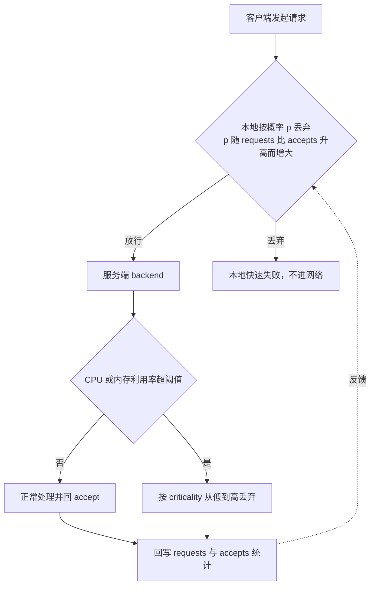
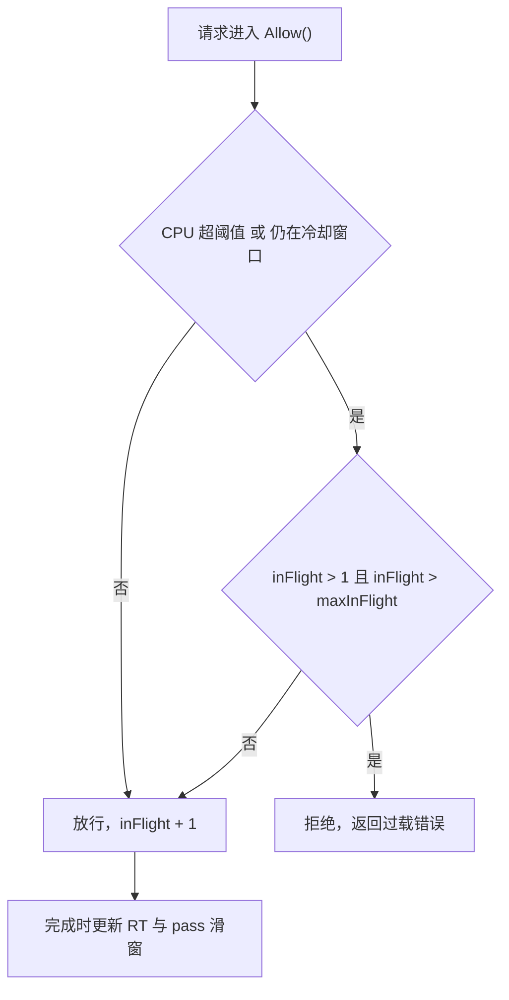
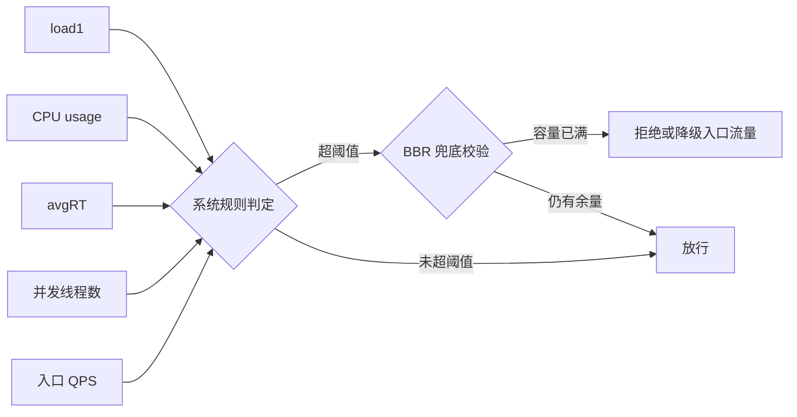
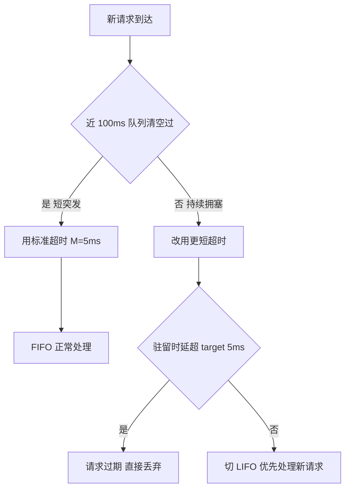
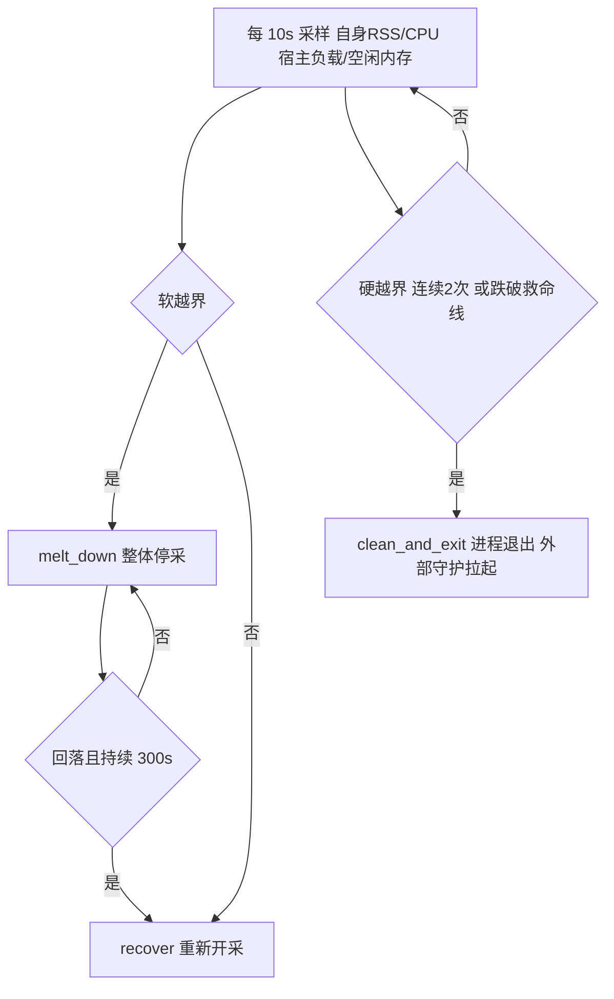
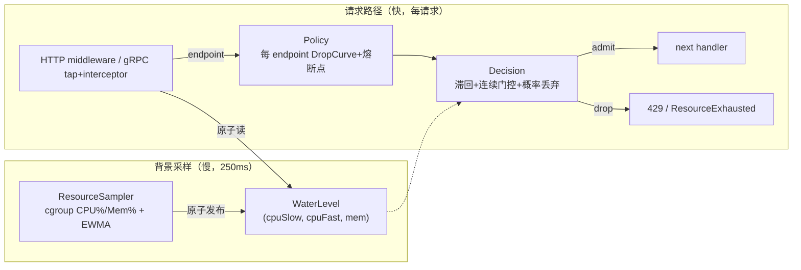
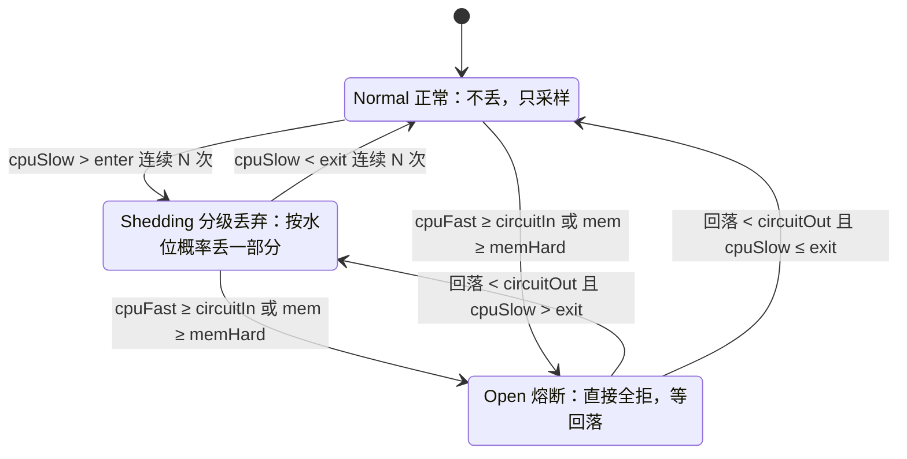
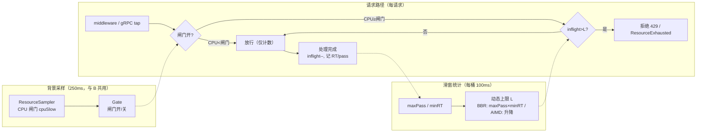

# bk-collector 自适应限流 —— 方案调研与对比草稿

> 本文是第一轮调研草稿，给出候选方案、最小化验证与对比，为正式 PLAN 提供决策依据，尚未锁定架构与实现。

## 0x01 调研结论速览

先交代背景：collector 接收端在 K8s 里可能被突发流量或「大包」打满 CPU、内存而崩溃，本文研究如何按真实资源水位主动丢请求、保住整体不倒。

本文「水位」统一指资源用量 ÷ 配额，例如 CPU 用满 2 核配额的 `80%` 即水位 `0.80`、内存占配额 `90%` 即水位 `0.90`。

英文缩写与专业概念集中解释见 [0x02 术语速查](#0x02-术语速查)。

核心结论按信号、决策、工程三组归纳：

**信号口径**

- **成本盲**：现有限流（QPS、maxconns、maxbytes）只数请求数或字节数，不看真实 CPU 开销，大包阶段仍会压垮系统（仿真积压达 `65`）。
- **要按容器配额算水位**：3 核负载按容器 2 核配额算出约 `1.5`（过载可见），按宿主机 14 核算只有 `0.21`（永不触发），`define.CoreNum()` 默认回退宿主核数、不能直接当分母。

**决策机制**

- **瞬时信号不能直接查表丢弃**：噪声会让「丢、放」来回横跳（仿真 `614` 次），需要 EWMA 平滑、双阈值滞回、连续越界门控三件套（抖动降到 `36` 次）。
- **慢信号管分级、快信号管熔断**：单一慢平滑信号会让硬熔断对短尖刺失灵，故用双时间常数，慢信号决定按比例丢、快信号配合连续 N 次决定一刀切。

**工程落点**

- **丢弃要尽早且省 CPU**：HTTP 在中间件入口、解压之前丢，gRPC 用 `tap.InTapHandle` 在反序列化之前拒绝。
- **中间件启动后不可改配置**：阈值若要运行时可调，需引入原子配置持有者或走 processor 路径，代价见 [0x13 热重载代价评估](#0x13-热重载代价评估)。

**推荐（第一期）**：以方案 B（CPU 水位平滑分级丢弃）为主体，叠加内存维度硬熔断，方案 C（自适应并发限）作为后续迭代兜底。

---

## 0x02 术语速查

本节只收录英文缩写与专业概念，水位、熔断、积压、优先级分级等通俗词直接按中文理解、不再单列。

| 术语 | 一句话解释 |
|---|---|
| cgroup | Linux 给容器划 CPU、内存配额的内核机制，容器内要按配额算用量、不能按宿主机总量 |
| EWMA（指数加权移动平均） | 平滑算法，新采样占小权重、历史占大权重，用来抹平抖动 |
| 滞回（hysteresis） | 进入和退出用两条不同的线（如 0.80 进、0.70 出），避免贴一条线反复横跳 |
| 连续越界门控 | 必须连续 N 次超线才动作，过滤单次毛刺误触发 |
| 双时间常数 | 分级丢弃用慢信号防抖，硬熔断用快信号防漏，两路分开 |
| BBR、AIMD | 两种自适应并发控制算法，按反馈动态调「同时在处理的请求上限」，不设固定阈值 |
| 在途并发（inflight） | 当前同时在处理、还没返回的请求数 |
| 有效吞吐（goodput） | 真正被成功处理的请求量，区别于收到的总量 |
| 工作集（working set） | 内存真实占用，等于总用量减去可回收的文件缓存，避免被页缓存（page cache）虚高误判 |
| GOMEMLIMIT | Go 的软内存上限，设到配额约 90% 可提前触发 GC、形成背压 |
| tap、InTapHandle | gRPC 在反序列化请求体之前就能拦截的钩子，可在最省 CPU 处拒绝 |
| optmap | 现有中间件的扁平配置串，形如 `name;k=v,k2=v2` |
| 翻转（flips） | 仿真里「丢、放」状态来回切换的次数，越多代表越抖 |
| 消融实验（ablation） | 逐项开关某个机制，单独衡量它的贡献 |

---

## 0x03 现状梳理（代码事实）

> 代码库 `bkmonitor-datalink/pkg/collector`，以下为后续设计的硬约束。

### a. 中间件模型

| 维度 | HTTP | gRPC |
|---|---|---|
| 形态 | `func(http.Handler) http.Handler` | `grpc.ServerOption` |
| 挂载 | `receiver.go` 按 `middlewares` 列表包裹整个 handler，非按路由 | 同左，append 到 `[]grpc.ServerOption` |
| 包裹方向 | 列表 inner→outer，末尾项最外层、最先执行 | — |
| 分级粒度 | 在中间件内按 `r.URL.Path` 匹配 endpoint | 在拦截器内按 `info.FullMethod` 匹配 |
| 注册 | `httpmiddleware.Register(name, fn)` | `grpcmiddleware.Register(name, fn)` |
| 配置 | `"name;k=v,k2=v2"`（optmap） | 同左 |

- **既有样例**：`maxconns`（信号量 `CoreNum()*ratio`，满则 429）、`maxbytes`（HTTP 200MB、gRPC `MaxRecvMsgSize` 8MB）。
- **gRPC maxbytes**：是 `ServerOption` 而非拦截器。
- **stream 必须覆盖**：自适应丢弃需新增 `ChainUnaryInterceptor` 与 `ChainStreamInterceptor`，SkyWalking 含 client-stream。
- **Unary 拦截器偏晚**：`req` 已是反序列化后对象，在此丢弃省不了 protobuf 解析 CPU。
- **InTapHandle 最省**：在读消息前触发，是更省 CPU 的拒绝点、建议优先。

### b. 资源信号现状

- **有效核数**：`define.CoreNum()` 取配置 `max_procs`，缺省回退 `runtime.NumCPU()`（宿主机核数）。
- **GOMAXPROCS 未设**：`automaxprocs v1.5.2` 已是依赖，但仅调 `maxprocs.Logger`、从未调 `maxprocs.Set()`，未按 cgroup 配额设置。
- **无采样回路**：collector 进程内无 CPU、内存水位采样，仅 admin `/metrics` 暴露 `process_*` 与 `go_*`。
- **依赖现状**：已间接依赖 `containerd/cgroups v1.0.3`、`prometheus/procfs v0.11.0`，`gopsutil` 与 `automemlimit` 不在 go.mod。

### c. 接口端点清单（分级策略的对象）

| 协议、源 | 路径或 gRPC 全方法 | 数据类型 |
|---|---|---|
| OTLP HTTP | `/v1/traces` `/v1/trace` `/v1/metrics` `/v1/logs` | traces、metrics、logs |
| OTLP gRPC | `…trace.v1.TraceService/Export` 等三个 | traces、metrics、logs |
| Jaeger | `/jaeger/v1/traces`、`jaeger.api_v2.CollectorService/PostSpans` | traces |
| Zipkin | `/api/v2/spans` | traces |
| SkyWalking | `/v3/segment(s)`、`TraceSegmentReportService/collect`（stream）等 | traces、metrics |
| Pushgateway | `/metrics/job/...`（4 路） | pushgateway |
| RemoteWrite | `/prometheus/write` | remotewrite |
| 其他 | `/v1/beat` `/v1/logpush` `/fta/v1/event` `/pyroscope/ingest` | beat、log、event、profile |

### d. 观测与热重载约束

- 指标遵循 `bk_collector_*` 加 `promauto` 加 `metricMonitor` 模式（参照 `semaphore.go`）。
- 中间件配置启动期固定，`Receiver.Reload` 只刷新 SkyWalking 配置、不重建中间件，运行时可调阈值需额外设计。

---

## 0x04 业界方案调研

本节先逐个展开候选来源的核心机制（a～g），再用一张表横向对比借鉴点与局限（h），最后回答「能否直接套用、要怎么改造」（i）。

token 桶与漏桶（现状 QPS 限流）经验证不足以应对大包，不进入候选、不再单列，理由见 0x10c。

### a. Google SRE：过载处理与自适应限流

[Google SRE《过载处理》](https://sre.google/sre-book/handling-overload/) 把过载当常态，主张用 CPU 等资源利用率而非 QPS（每秒请求数）衡量容量、过载时提前有损降级（主动拒绝部分请求、保整体不崩）。

它的做法是服务端按利用率分级丢弃低优先级请求，客户端依据后端接受率自适应限流，二者把后端稳在安全水位。



客户端丢弃概率公式（`K` 默认 `2`，越小越激进）：

```text
p = max(0, (requests − K·accepts) / (requests + 1))
```

- **过载信号**：以 CPU 利用率为主，必要时叠加内存压力与负载均值，归一成单一利用率水位。
- **服务端分级**：按利用率阈值触发，高优先级配更高阈值，例如 `0.80～0.90` 区间逐步丢弃。
- **客户端自适应**：按上式用本地接受率算丢弃概率，被拒请求快速失败、不进网络。

优先级档位（criticality）共四档，从低到高排列，过载时先丢低档并沿调用链向下游透传：

| 档位 | 含义 |
|---|---|
| `SHEDDABLE` | 最低档，预期频繁部分不可用、偶尔完全不可用，过载最先丢 |
| `SHEDDABLE_PLUS` | 预期部分不可用，批量任务默认档，可延后数分钟到数小时重试 |
| `CRITICAL` | 生产请求默认档，丢弃有用户可见影响但较轻，需为其预留足够容量 |
| `CRITICAL_PLUS` | 最高档，失败会造成严重用户可见影响，最后才丢 |

对 bk-collector 的取舍：

- **局限**：服务端算法偏框架，需自定义「利用率→丢弃率」映射、不能直接套用。
- **可借鉴**：按 endpoint 设利用率阈值与优先级档位，参考[载荷削减实践](https://cloud.google.com/blog/products/gcp/using-load-shedding-to-survive-a-success-disaster-cre-life-lessons)做按比例降级。

### b. go-zero 与 Kratos：BBR 自适应降载

go-zero 与 Kratos 的 BBR（借鉴 TCP 拥塞控制的自适应限流）自适应降载同源，按 CPU 与在途并发（inflight，正在处理、未返回的请求数）对整个进程做有损保护。

它在过载时只拒绝超出估算容量的那部分并发，CPU 健康时不丢请求，既护住进程又尽量多服务。



容量估算公式（滑窗每桶最大通过数 × 最小平均响应时间）：

```text
maxInFlight ≈ maxPass × minRT
```

- **信号**：CPU 闸门，利用率刻度 `0～1000`，go-zero 默认 `900`、Kratos 默认 `800`。
- **平滑**：采样后做 EWMA（指数加权移动平均）抗抖动，周期 go-zero `250 ms`、Kratos `500 ms`。
- **容量估算**：按上式算 `maxInFlight`，源码见 [adaptiveshedder.go](https://github.com/zeromicro/go-zero/blob/master/core/load/adaptiveshedder.go)。
- **过载判定**：CPU 超阈值且 `inFlight > 1` 且 `inFlight > maxInFlight` 才拒绝，源码见 [aegis bbr.go](https://github.com/go-kratos/aegis/blob/main/ratelimit/bbr/bbr.go)。
- **保底放行**：`1 s` 冷却窗抑制抖动，go-zero 按 CPU 余量缩放容量、下限 `0.1`，过载仍放约 `10%`。

对 bk-collector 的取舍：

- **差异**：BBR 控制的是全局在途并发（`inFlight`）上限，而非 bk-collector 需要的按 endpoint 丢弃率曲线。
- **可复用**：CPU 闸门、EWMA 平滑、保底放行这套组合，可作为兜底底座沿用。

### c. Netflix concurrency-limits：延迟梯度自适应

[Netflix concurrency-limits](https://github.com/Netflix/concurrency-limits) 把 TCP 拥塞控制思想搬到 RPC 并发，用请求延迟梯度自动逼近最优在途并发上限。

这套做法在 [Performance Under Load](https://netflixtechblog.medium.com/performance-under-load-3e6fa9a60581) 提出，延迟一升即说明开始排队，便按比例收缩并发、待回落再缓慢放大。


核心公式（两步，`rttTolerance` 默认 `1.5`，均不设静态阈值）：

```text
gradient = clamp(rttTolerance · longRtt / curRtt, 0.5, 1)
newLimit = limit · gradient + queueSize          # 再以 0.2 平滑
```

- **信号**：用请求 RTT（往返时延）的延迟梯度，即长期平滑 RTT 与当前 RTT 之比，反映队列是否变长。
- **上限调节**：按上式用梯度收缩或放大并发上限，延迟回落再缓慢探测放大。
- **queueSize 取值**：[Gradient2Limit](https://github.com/Netflix/concurrency-limits/blob/78a74b9878d38c4c048b0304ce12a162ab7b7222/concurrency-limits-core/src/main/java/com/netflix/concurrency/limits/limit/Gradient2Limit.java#L79-L80) 默认常数 `4`，旧版 [GradientLimit](https://github.com/Netflix/concurrency-limits/blob/78a74b9878d38c4c048b0304ce12a162ab7b7222/concurrency-limits-core/src/main/java/com/netflix/concurrency/limits/limit/GradientLimit.java#L51) 用 `queueSize ≈ √limit`。

对 bk-collector 的取舍：

- **错位**：它按请求延迟梯度驱动，与 bk-collector 按资源水位降级的口径不一致。
- **信号弱**：接收链路多为单向 export，延迟信号本就微弱、难支撑梯度判定。
- **可借鉴**：零静态阈值、延迟回落再平滑探测放大的思路可借鉴。

### d. Sentinel：系统自适应保护

[Sentinel 系统自适应保护](https://github.com/alibaba/Sentinel/wiki/Adaptive-System-Protection) 从应用入口整体维度出发，融合多类系统指标做自适应有损降级。

它把 `load1`（1 分钟系统负载均值）当启发因子，放行量由系统实际处理能力决定，避免单一硬指标调控的滞后与恢复慢。



容量估算公式（BBR 兜底，超出才真正拒绝）：

```text
估算容量 ≈ maxQps × minRt
```

- **信号维度**：[系统规则](https://github.com/alibaba/sentinel-golang/blob/master/core/system/rule.go) 支持 `load1`、`CPU usage`、`avgRT`（平均响应时间）、并发线程数、入口 QPS 五类。
- **CPU usage 模式**：使用率超阈值（`0.0～1.0`）即触发降级，灵敏直接、与 bk-collector 资源水位口径对齐。
- **load1 判定**：`load1` 超启发值且并发超过上式容量才真正拒绝，逻辑见 [system slot.go](https://github.com/alibaba/sentinel-golang/blob/master/core/system/slot.go)。
- **设计要点**：`load1` 仅作启发因子而非唯一闸门，再借 BBR 思想按实际吞吐放行，兼顾稳定与吞吐。

对 bk-collector 的取舍：

- **局限**：偏通用框架，多信号叠加导致调参复杂。
- **可吸收**：`CPU usage` 模式与本方案资源水位口径一致，多信号兜底思路可吸收。

### e. Envoy：Overload Manager 过载管理

[Envoy Overload Manager](https://www.envoyproxy.io/docs/envoy/latest/configuration/operations/overload_manager/overload_manager) 把过载治理抽象成「资源监控器上报 `0～1` 压力、触发器按阈值驱动分级与熔断」的统一框架。

它的内存分层降级范式，正是 bk-collector 内存维度硬熔断可直接照搬的对象。

```text
内存 pressure = cgroup 用量 / 配额
1.00 |.............................  OOMKill 区（必须在此前刹住）
0.95 |==================____======  threshold：stop_accepting_requests 回 503
     |              ___/            0.92~0.95：scaled 段按线性放大降级
0.92 |==========___/==============  scaled 起点：disable_http_keepalive
     |       __/
0.85 |______/                       <0.92：正常放行
     +----------------------------> 内存用量随时间上升
```

- **监控信号**：cgroup memory monitor 按 `usage / limit` 算 `0～1` 内存 pressure，对应触发 OOM 的真实水位，详见 [PR 39053](https://github.com/envoyproxy/envoy/pull/39053)。
- **threshold 触发**：压力越线即把动作置为饱和、实现硬熔断，是防 OOM 的最后一道闸。
- **scaled 触发**：在 `scaling～saturation` 区间按线性比例放大动作强度，同一动作多触发器取 `max`。
- **阈值需显式配置**：无内置默认，文档示例 `0.92` 触发 `disable_http_keepalive`（关长连接、排空）、`0.95` 触发 `stop_accepting_requests` 回 `503`。
- **辅助回收**：再以 `shrink_heap`、`reduce_timeouts`、`reset_high_memory_stream` 多级回收内存。

对 bk-collector 的取舍：

- **范本**：cgroup 感知的内存硬熔断叠加 `scaled` 线性分级，是内存维度可直接照搬的范式。
- **局限**：Envoy 是 C++ 框架、动作深绑 HTTP，宜借鉴范式而非照抄实现。

### f. Meta：CoDel 与 Adaptive LIFO

Meta 在 [《Fail at Scale》](https://queue.acm.org/detail.cfm?id=2839461) 提出服务端过载控制，按请求在队列里的驻留时延而非队列长度判断拥塞。

其本质是把网络层的 [CoDel](https://queue.acm.org/detail.cfm?id=2209336)（Controlled Delay，受控延迟）自适应队列管理移植到服务请求队列，并叠加 Adaptive LIFO 控制尾延迟。



CoDel 判定逻辑（`M`、`N` 基本无需逐服务调参，优于固定队列长度与固定超时）：

```text
近 N=100ms 内队列清空过  → 用标准超时 M=5ms（短突发，FIFO 正常处理）
否则（持续拥塞）         → 驻留超 target 即过期丢弃，并切 LIFO 优先处理新请求
```

- **判定信号**：请求在队列里的驻留时延（sojourn time）而非队列长度，因队列长度不是好的拥塞预测指标，详见 [CoDel 论文](https://queue.acm.org/detail.cfm?id=2209336)。
- **核心逻辑**：按上式区分短突发与持续拥塞，伪代码见 [《Fail at Scale》](https://queue.acm.org/detail.cfm?id=2839461)。
- **Adaptive LIFO（自适应后进先出）**：拥塞时由 FIFO（先进先出）切到 LIFO，让最新到达、最可能赶上客户端超时的请求优先处理，与 CoDel 短超时协同压尾延迟。

对 bk-collector 的取舍：

- **错位**：入口并非显式请求队列，CoDel 的驻留时延信号难直接套用。
- **可借鉴**：早丢、必要时丢最旧以护尾延迟与有效吞吐（goodput）的思路可借鉴，非主路径照搬。

### g. deepflow-agent：资源自限与熔断

[deepflow-agent](https://github.com/deepflowio/deepflow/blob/f93be50de618598d563aa3ece0d8f5c0250c0ef0/agent/src/utils/guard.rs) 用一条独立 `guard` 线程做「自我体检」，默认每 `10 s` 采样自身内存、CPU 与宿主机负载、空闲内存，确保探针永不拖垮被观测主机。

它的设计要点是软档「整体停采」、硬档「进程退出由外部守护拉起」，并用双阈值滞回与连续越界门控抑制误触发。



- **自身内存**：读 `/proc/<pid>/status` 的 `VmRSS`（进程常驻内存）、默认阈值 `768 MiB`，首次越线只告警、连续第二次才重启，源码见 [guard.rs#L688-L729](https://github.com/deepflowio/deepflow/blob/f93be50de618598d563aa3ece0d8f5c0250c0ef0/agent/src/utils/guard.rs#L688-L729)。
- **CPU**：走连续越界门控，`cpu_usage% > max_millicpus/10`（默认 `1000` 毫核即 1 核）连续两次才重启，源码见 [guard.rs#L409-L420](https://github.com/deepflowio/deepflow/blob/f93be50de618598d563aa3ece0d8f5c0250c0ef0/agent/src/utils/guard.rs#L409-L420)。
- **宿主机负载**：双阈值滞回加 `300 s` 驻留，`load/核数 ≥ 1.0` 进入、需 `< 0.9` 连续 `300 s` 才恢复，源码见 [guard.rs#L84-L142](https://github.com/deepflowio/deepflow/blob/f93be50de618598d563aa3ece0d8f5c0250c0ef0/agent/src/utils/guard.rs#L84-L142)。
- **内存口径纠偏**：不算 cgroup 工作集、直接用 `VmRSS`，因 AF_PACKET 抓包块占用让 cgroup 统计不准，注释见 [process/linux.rs#L42-L66](https://github.com/deepflowio/deepflow/blob/f93be50de618598d563aa3ece0d8f5c0250c0ef0/agent/src/utils/process/linux.rs#L42-L66)。

对 bk-collector 的取舍：

- **可借鉴**：「连续越界门控加双阈值滞回加 `300 s` 驻留」防抖，以及「软档降级、硬档兜底」分层。
- **差异**：deepflow 进程级一刀切、内存用 `VmRSS`，本方案按 endpoint 分级、内存用工作集（用量减 `inactive_file`）。

### h. 候选来源横向对比（借鉴点与局限）

各行的信号源、借鉴点、局限的源码佐证见对应子节 a～g。

| 方案 | 信号源 | 借鉴点 | 局限 |
|---|---|---|---|
| Google SRE | CPU 等资源利用率（任务级）、客户端 accept 率 | [a] 用资源利用率而非 QPS 衡量容量<br />[b] criticality 分级可映射为按 endpoint 分档丢弃 | [a] 客户端自适应需改造客户端，bk-collector 客户端是外部 SDK、不可控<br />[b] 仅框架、无现成「水位到丢弃率」曲线，无内存硬熔断件 |
| go-zero 与 Kratos aegis BBR | cgroup 归一化 CPU，EWMA `0.95`，阈值 go-zero `900`、aegis `800`（刻度 `1000`） | [a] cgroup 归一化 CPU 加 EWMA 信号管线可照搬<br />[b] CPU 闸门加 `maxInflight≈maxPass×minRT` 并发兜底，go-zero 有 `10%` 保底放行 | [a] 单个全局 shedder、二元拒绝，非按 endpoint 丢弃率<br />[b] 仅 CPU、无内存维度<br />[c] 判定依赖 `inflight`、`minRT`，ingest 延迟信号弱 |
| Netflix concurrency-limits | 请求 RTT 延迟梯度（非资源水位） | [a] 零静态阈值、延迟回落再平滑探测放大的并发自适应 | [a] 信号是 RTT 梯度、非 CPU、内存水位<br />[b] 输出是并发上限、非丢弃率曲线<br />[c] ingest 延迟信号弱、梯度长期接近 `1`、难感知过载 |
| Sentinel 系统自适应 | load1、CPU、avgRT、并发、QPS（整应用入口、整进程） | [a] 资源触发加 BBR 并发闸双重确认、减少误杀<br />[b] `MetricType` 加 `TriggerCount` 规则模型可扩成按 endpoint 规则表 | [a] 作用于整应用入口、无 endpoint 维度<br />[b] 二元拒绝、无内存维度<br />[c] CPU 取进程百分比、非 cgroup 归一化 |
| Envoy Overload Manager | cgroup 内存、容器 CPU（`mode: CONTAINER`）、堆、FD，上报 `0～1` 压力 | [a] 监控器到触发器到动作三层模型加 `scaled` 区间线性 `(p−scaling)/(saturation−scaling)`<br />[b] cgroup 内存加 `threshold` 即内存硬熔断，`bernoulli(state)` 即按丢弃率随机丢 | [a] 动作是整进程、整 listener，非按 endpoint 曲线<br />[b] 独立 C++ 代理、深绑 HTTP，无法作为 Go 入口层库嵌入 |
| Meta CoDel 与 Adaptive LIFO | 请求队列驻留时延 | [a] 早丢、必要时丢最旧以护尾延迟与有效吞吐<br />[b] 用驻留时延而非队列长度判拥塞 | [a] 入口非显式请求队列，驻留时延信号难直接套用<br />[b] 无资源水位与内存维度、非按 endpoint 丢弃率 |
| deepflow-agent 资源自限 | 自身 `VmRSS`、CPU、宿主负载、空闲内存 | [a] 双阈值滞回加连续越界加 `300 s` 驻留防抖<br />[b]「软档停采、硬档退出」分层 | [a] 进程级一刀切（停采、退出），非按 endpoint 分级丢<br />[b] 内存用 `VmRSS` 而非 cgroup 工作集，与本方案内存口径不同 |

### i. 能否直接套用与改造方向

先用 [issue README](./README.md) 的硬需求当筛子：

1. **信号**：用真实 CPU、内存水位（cgroup 配额归一化），而非 QPS。
2. **粒度**：按 endpoint 分别配触发阈值、水位到丢弃率曲线、熔断点。
3. **行为**：CPU 维度按丢弃率有损分级，内存维度硬熔断（全拒）。
4. **落点**：HTTP middleware、gRPC interceptor 入口层、解码前丢，不侵入 pipeline。
5. **形态**：K8s 优先、cgroup 感知。

把这 5 条当筛子，对照 0x04h 逐个核对后，没有一个来源能整体直接套用。

缺口集中在两处：

- 「按 endpoint 的水位到丢弃率曲线」几乎全部缺失。
- 唯一具备「水位到概率丢弃」输出的 Envoy 是整进程、整 listener 粒度，且为独立 C++ 代理、无法作为 Go 库嵌入。

一个易被忽视、却决定信号选型的事实：bk-collector 接收侧是「同步入队即 ACK、pipeline 异步」。

handler 解码、PreCheck、入队后即回空 ACK，完整 processor 与导出在后台 worker 异步执行（源码见 [otlp/http.go](https://github.com/TencentBlueKing/bkmonitor-datalink/blob/master/pkg/collector/receiver/otlp/http.go#L105-L165)、[controller.go](https://github.com/TencentBlueKing/bkmonitor-datalink/blob/master/pkg/collector/controller/controller.go#L395-L406)）。

由此两点推论：

- **延迟与在途并发信号弱**：入口测得的 RTT 只含解码加入队、反映不了后台积压，go-zero、aegis、Netflix 这类靠 `minRT`、`inflight` 的限流器在此会迟钝。
- **既有背压是「队列满则阻塞」**：`RecordQueue` 等有界 channel 满则阻塞 handler、不按 endpoint 丢（源码见 [define/record.go](https://github.com/TencentBlueKing/bkmonitor-datalink/blob/master/pkg/collector/define/record.go#L264-L281)），只拉长响应、不缓解过载。

这正是 README 选「资源水位作主信号、丢弃落在入口解码前」的底层原因。

既然不能直接套用，就把可借鉴零件按目标能力组合裁剪，每项能力都能回指业界先例：

| 目标能力 | 可借鉴来源 | 必要的本地改造 |
|---|---|---|
| 资源水位信号 | go-zero、aegis 的 cgroup 归一化 CPU 加 EWMA<br />Envoy 的 cgroup 内存压力 | 自研 Go cgroup reader（v1/v2 自检），CPU、内存两路 |
| 水位到丢弃率曲线 | Envoy `scaled` 区间线性 `(p−scaling)/(saturation−scaling)` 加 `bernoulli` 概率丢 | 全局动作改为按 endpoint 各一条曲线 |
| 按 endpoint 分级 | Google criticality 分档<br />Sentinel `MetricType` 加 `TriggerCount` 规则模型 | 每 endpoint 配阈值、曲线、熔断点 |
| 内存硬熔断 | Envoy cgroup 内存加 `threshold`<br />deepflow 内存越限即停 | 越熔断点全拒、配 `GOMEMLIMIT` 背压 |
| 并发兜底 | go-zero、aegis BBR（`maxInflight≈maxPass×minRT` 加 `10%` 保底放行）<br />Netflix 零阈值梯度 | 弱化对 `minRT`、`inflight` 的依赖（延迟信号弱） |
| 防抖 | deepflow 双阈值滞回加连续越界加 `300 s` 驻留 | 用于熔断、恢复状态机 |

回到问题本身：

- **能否直接套用**：不能，最接近的 Envoy 形态对、但粒度与落地形态两条不满足，其余方案分别缺 endpoint 维度、缺内存维度或信号口径错位。
- **怎么改造**：把上表六项能力组合，再针对「同步入队加异步 pipeline、延迟信号弱、客户端不可控、Go 入口层」做本地改造，下一节据此收敛为候选方案。

---

## 0x05 候选方案总览

四个方案是同一目标的不同收敛形态，并非互斥，D 是 A、B、C 的组合上限。

| 方案 | 一句话定位 | 角色 |
|---|---|---|
| A 静态水位曲线 | 水位直接查折线得丢弃率，最直观但会抖 | 起点，需演化为 B |
| B 平滑分级丢弃 | A 加 EWMA、滞回、双信号，稳且保留分级语义 | 第一期主体 |
| C 自适应并发限 | 不设阈值，动态调在途并发上限 | B 的兜底底座 |
| D 混合防线 | CPU 分级、内存熔断、并发兜底三道并存 | 长期形态 |

四者都是对 0x04i 六项能力的不同取舍：

- **A**：只取信号、曲线、按 endpoint 分级三项，裸瞬时信号、会抖。
- **B**：在 A 上加防抖与内存硬熔断、快慢双信号。
- **C**：把并发兜底单独成限，作 B 的底座。
- **D**：六项能力全叠，三道防线并存。

---

## 0x06 方案 A：静态水位曲线

本质：把 CPU、内存的瞬时水位直接查一条预设折线，得到丢弃概率。

### a. 原理图解

每个 endpoint 配一条「水位到丢弃率」的折线，请求到来时按当前水位查表，命中熔断点则全丢。

```text
丢弃率
100% |                /---------  >=0.90 全丢（熔断）
     |               /
     |              /
     |             /     0.80->0.90 段：丢弃率
     |            /      随水位线性上升
     |           /
  0% |----------/        <0.80：全部放行
     +----------+-----+------->  CPU 水位
              0.80  0.90
```

### b. 为什么不能直接用

裸瞬时信号噪声大，会贴着进入线上下穿越，每次穿越就翻转一次「丢、放」。

```text
裸瞬时信号有噪声，贴着进入线 0.80 反复穿越：

水位
0.85 |   *       *       *      * = 一次采样
0.80 |----------------------- 进入线（被反复穿越）
0.75 |      *        *      *
     +-----------------------> 时间
每次穿越就翻转一次「丢 / 放」，一轮仿真约 614 次 -> 系统震荡
```

- **优点**：直观、完全满足产品诉求，与 maxbytes、maxconns 同层。
- **缺点**：裸瞬时信号剧烈抖动，且 CPU 饱和后信号顶到 1.0 不再上升、无法区分过载深浅。
- **判定**：方向正确但工程上不可直接用，需演化为 B。

---

## 0x07 方案 B：平滑分级丢弃（推荐主体）

本质：在 A 的折线之上，先把信号平滑成一条稳的线再查表，并用快慢两路信号分别管「分级」和「熔断」。

### a. 原理图解

原始水位先过 EWMA 变平滑，进入线与退出线之间留一条滞回带避免横跳，另有一条快信号熔断线兜底短尖刺。

```text
水位
0.90 |======================  熔断线：快信号越过且连续 N 次 -> 全丢
     |           /----------  EWMA 平滑线（稳，不再贴线抖）
0.80 |----------/-----------  进入线：升过才开始按比例丢
0.70 |---------/------------  退出线：跌回才停丢（0.70~0.80 为滞回带）
     |  .:*:.                 原始信号（抖）经 EWMA 平滑成上面的曲线
     +----------------------> 时间
```

直觉是「分级丢弃用慢平滑信号稳住，硬熔断用快信号防漏」，两路分工即双时间常数。

### b. 核心对象模型



- **资源采集器（ResourceSampler）**：单例后台 goroutine，250 ms 采样 cgroup CPU% 与内存工作集%、做 EWMA 平滑，通过原子发布。
- **采样与决策解耦**：采样慢、读 `/sys/fs/cgroup`，决策快、只做原子读，每请求绝不触碰 `/proc`。
- **分级策略（Policy）**：维护「endpoint 到折线加熔断点」的映射，HTTP 按路径、gRPC 按方法名解析，未命中走默认。
- **挂载适配（Integration）**：复用既有 HTTP middleware 与 gRPC tap 加 interceptor 注册表。

### c. 决策状态机



三种状态（括号前的英文是代码里的状态名）如下。

- `Normal` 正常：不丢请求，只在后台采样。
- `Shedding` 分级丢弃：按当前水位用概率丢掉一部分请求，水位越高丢得越多。
- `Open` 熔断：直接全拒，等水位回落到安全线再退出。

图中信号与阈值含义如下，CPU 取值 0 到 1、内存为占配额比例。

| 名称 | 含义 |
|---|---|
| `cpuSlow` | CPU 慢信号，EWMA 平滑后的水位，驱动分级丢弃、抗抖动 |
| `cpuFast` | CPU 快信号，近实时水位，驱动硬熔断、防短尖刺 |
| `enter`、`exit` | 分级丢弃的进入线与退出线（如 `0.80` 进、`0.70` 出），两线之间留滞回带 |
| `circuitIn`、`circuitOut` | 硬熔断的进入线与退出线（如 `0.90` 进、`0.85` 出） |
| `memHard` | 内存硬熔断线（如 `0.92`），单独成一条防线 |
| `DropCurve(level)` | 水位到丢弃率的折线函数，`Shedding` 态用它算每个请求的丢弃概率 |

- **双时间常数**：`Shedding` 用慢 EWMA 抗抖动，`Open` 硬熔断用快信号配合连续 N 次防尖刺漏保护。
- **丢弃强度**：`Shedding` 态按 `DropCurve(cpuSlow)` 概率丢，`Open` 态全丢。
- **内存独立**：`mem ≥ memHard` 直接进 `Open`，并由 `GOMEMLIMIT` 提供 GC 背压。

### d. 关键协议与边界

| 主题 | 草图 |
|---|---|
| 信号采集 | `WaterLevel() (cpuSlow, cpuFast, mem float64)`，后台 250 ms 刷新，原子位存 |
| endpoint 配置 | optmap 扁平串装不下每 endpoint 折线，需结构化配置块，与现有中间件配置形态有张力、留 PLAN 决策 |
| HTTP 丢弃点 | 中间件置于请求路径早段（解压前），丢弃返回 `429` 加 `Retry-After`、不读 body |
| gRPC 丢弃点 | 优先 `grpc.InTapHandle` 在反序列化前拒绝，`ChainUnary/StreamInterceptor` 补充覆盖 client-stream，拒绝码 `ResourceExhausted` |
| 观测 | `bk_collector_throttle_dropped_total{protocol,endpoint}`、`throttle_water_level_ratio{resource}`、`throttle_circuit_state{endpoint}` |

- **优点**：稳定（验证积压 0.13、危险 0.8 s、翻转 36），保留 endpoint 分级语义，纯 CPU、内存驱动。
- **缺点**：有效吞吐略低于裸阈值（保守换稳定、可调），CPU 饱和区间靠折线「熔断点全丢」兜底。
- **判定**：最契合 README 目标与约束，作为第一期主体。

---

## 0x08 方案 C：自适应并发限

本质：不设固定阈值，而是把过载控制收敛到一个动态的「在途并发上限 L」，请求进入即占额度、超限即拒，L 随反馈升降。

### a. 原理图解

请求进入占一个并发额度，在途并发到上限 L 就拒绝，上限 L 由系统反馈自动升降。

```text
              在途并发 inflight（上限 L，随反馈动态升降）
              [#][#][#][#][_][_]   # = 占用中，_ = 空额（共 L 个）
请求 --> [闸门] --> 判定：
           inflight <  L   -->  放行（占用一个额度）
           inflight >= L   -->  拒绝（429 / ResourceExhausted）
反馈：成功完成 -> L+1（试探扩容），过载信号 -> L*0.85（快速收缩）
闸门：CPU 低于阈值只统计容量、不限流，高于阈值才真正启用上限 L
```

天然抗成本变化：大包让单请求变慢，在途并发自然上涨、更快撞上限，无需预知每个包的成本。

### b. 核心对象模型



- **资源采集器**：与 B 同一份，提供 CPU 闸门信号 `cpuSlow`。
- **并发限制器**：每 endpoint 一个，维护 `inflight` 原子计数、动态上限 L、滑窗统计。
- **准入判定**：每请求进入时 `inflight++`、退出时 `inflight--` 并记录响应时间与通过数。

### c. 控制算法

闸门线 `cpuEnter`（CPU 水位）以下不限流、只统计容量，高于它才启用上限 L。

| 形态 | 上限 L 的计算 | 升降方式 | 特点 |
|---|---|---|---|
| BBR（go-zero、Kratos，推荐） | `L ≈ maxPass × minRT`，即滑窗单桶最大通过数乘以最小平均响应时间，给出最优点并发容量估计 | 随窗口滚动重算、随 CPU 线性收紧 | 自估容量、无需手调 |
| AIMD（更简单） | 维护一个 L，成功完成则 `L += 1`，遇过载信号则 `L ×= 0.85` | 加性增、乘性减，clamp 到 `[Lmin, Lmax]`（并发上限的下界与上界） | 验证最鲁棒（实验 3 大包免疫） |

- **保底放行**：闸门开时仍始终放行约 5%～10%，保持探测、避免「全拒后无流量、L 无法回升」的假死。
- **内存维度**：复用 B 的硬熔断（`mem ≥ memHard` 全拒），C 只接管 CPU 维度的并发控制。

### d. 关键协议与边界

| 主题 | 草图 |
|---|---|
| 信号 | CPU 闸门复用 ResourceSampler 的 `cpuSlow`，`inflight` 用原子计数，响应时间用滑窗（每桶 100 ms、窗口约 1 s） |
| 并发额度记账 | 进入 `inc`、退出 `dec` 必须成对且覆盖所有出口（正常、错误、panic、stream 关闭），记账泄漏会让 L 永久打满、把服务拒死 |
| per-endpoint | 每 endpoint 独立限制器，用并发上限近似表达分级，但不是显式丢弃率曲线 |
| 拒绝点 | 同 B，HTTP 中间件早段、gRPC `InTapHandle` 反序列化前，拒绝码 `429` 或 `ResourceExhausted` |
| 与现状契合 | 信号与挂载和 B 完全一致、可共用 ResourceSampler，`go-zero adaptiveshedder` 可直接参考 |

### e. 与 B 的关系

C 不替代 B，而是补其在 CPU 饱和处的短板：

- B：水位顶到 `1.0`、丢弃率曲线失去区分度，靠熔断点全丢兜底。
- C：在途并发仍随单请求成本上涨持续收紧、仍能区分轻重。

二者共用采样与挂载、第一期可不落，全局对比见 0x11a。

---

## 0x09 方案 D：混合防线

本质：把三种手段叠成三道防线，按「最先命中」拦截，覆盖 CPU 与内存两类危险。

### a. 原理图解

请求入口处串三道防线，任一触发即拒绝，CPU 与内存各走最贴切的手段。

```text
请求 --> [入口] 串联三道防线，按「最先命中」拦截，任一触发即拒绝：

     +--> ① CPU 水位分级丢弃（B）：按比例丢
     +--> ② 内存高水位硬熔断：直接全拒
     +--> ③ 并发上限兜底（C，可选）：撞 L 即拒
```

内存走硬熔断而非丢弃率曲线，因为 OOM 一旦发生进程就被杀、没有缓冲余地，更适合一刀切并配 `GOMEMLIMIT` 背压。

### b. 判定

- **优点**：最稳健，CPU 与内存两类危险都覆盖。
- **缺点**：复杂度最高。
- **判定**：长期目标形态，第一期不落，推荐方案见 0x11b。

---

## 0x10 最小化场景验证

> 验证代码在 `./validation/`（运行方式见该目录 [README](./validation/README.md)），实验 1 到 4 是 stdlib 仿真、实验 5 是容器压测。

### a. 实验 1：cgroup v1/v2 解析（fixture 单测）

- **覆盖 v2**：`cpu.max`、`cpu.stat`、`memory.current/max`。
- **覆盖 v1**：`cfs_quota/period`、`cpuacct.usage`、`memory.*_in_bytes`。
- **回退分支**：含 v1 `-1`、v2 `max`、v1 内存无限哨兵。
- **结论**：有效核数、CPU%、内存% 计算全部正确，纯 stdlib 即可、无需重依赖，`containerd/cgroups v3` 可作现成替代。

### b. 实验 2：进程 CPU 信号采样（真实负载）

用 `getrusage` 采样累计 CPU 时间，除以（墙钟 × 有效核）得水位。

| 负载 | raw（除 2 核预算） | 若除宿主 14 核 | EWMA(0.4) |
|---|---|---|---|
| 1 核 | ≈0.50 | 0.07 | 滞后收敛 |
| 3 核（过载） | ≈1.50 | 0.21 | 约 0.5 s～1 s 收敛 |

- **信号有效**：随负载上升，可越过 `1.0` 暴露过载。
- **归一化口径**：必须按容器配额，按宿主核数会低估约 7 倍、限流失效。
- **EWMA 权衡**：抗噪但引入约 0.5 s～1 s 滞后，平滑度需取舍。

### c. 实验 3：限流策略闭环对比（含大包阶段）

同一负载轨迹（暖机、QPS 突增 250%、恢复、QPS 不变但单请求成本翻倍的大包阶段），单入口模型，积压量作 OOM 风险的近似指标。

| 策略 | 峰值积压（近似 OOM 风险） | 有效吞吐 | 丢弃率 | 危险时长（需求超 105%，单位 s） | 翻转数 |
|---|---|---|---|---|---|
| None（基线） | 140.58 | 219.5 | 0.000 | 68.4 | 0 |
| QPSLimiter | 65.10 | 199.5 | 0.273 | 34.8 | 1 |
| CPUStep（裸阈值） | 0.83 | 185.0 | 0.472 | 27.8 | 614 |
| CPUGraded（EWMA 加滞回） | 0.13 | 170.5 | 0.513 | 0.8 | 36 |
| AIMD（并发限） | 0.23 | 160.7 | 0.541 | 1.5 | 18 |

- **基线**：积压爆炸，复现崩溃循环。
- **QPS 限流**：大包阶段仍过载（积压 `65`），印证成本盲论点。
- **裸阈值**：能压住积压但严重抖动（`614` 次翻转）。
- **EWMA 加滞回 vs AIMD**：前者最稳，后者对成本变化最鲁棒、翻转最少但有效吞吐略低。

### d. 实验 4：方案 B 状态机机制消融（噪声 CPU 轨迹）

CPU 水位刻意停在进入线 `0.80` 附近带噪声加两段 `3 s` 尖刺，逐项叠加机制并统计状态翻转。

| 变体 | shed 翻转 | circuit 翻转 | 平均丢弃率 |
|---|---|---|---|
| 裸曲线 | 79 | 5 | 0.166 |
| 加 EWMA(β=0.95) | 7 | 0 | 0.033 |
| 加滞回(0.80/0.70) | 5 | 0 | 0.033 |
| 加连续门控(N=2) | 4 | 0 | 0.033 |

- **EWMA 主导**：贡献最大（`79` 降到 `7`），滞回与连续门控继续打磨到 `4`。
- **校准发现**：β=`0.95` @ `250 ms` 过慢，`3 s` 尖刺只把 EWMA 推到约 `0.87`、低于熔断点 `0.90`，硬熔断失灵。
- **结论**：该校准印证 0x07c 的双时间常数设计（慢信号管分级、快信号管熔断），此处不再展开。

### e. 实验 5：真实容器压测（OrbStack，cgroup v2）

把方案 B 做成真实 Go HTTP 接收原型放进受限容器压测，验证真实 cgroup 读数与端到端丢弃行为。

- **环境**：OrbStack（cgroup v2），容器限 `--cpus=1 --memory=300m`。
- **被测**：`loadserver` 原型，后台每 250 ms 读真实 `/sys/fs/cgroup`、EWMA、滞回、双信号熔断，丢弃发生在 CPU 密集处理之前。
- **压力**：`loadclient` 三阶段，暖机 4 并发、突增 60 并发、大包 60 并发且单请求 CPU 成本翻 4 倍。
- **对照**：`THROTTLE` 关与开，代码在 `./validation/cmd/{loadserver,loadclient}`。

首要确认：容器内 `nproc` 报 14（宿主核数），但 `cpu.max=100000 100000`（仅 1 核配额），按 `nproc` 归一化会把 CPU% 低估 14 倍、限流永不触发。

请求结果（关与开，单位请求数）：

| 阶段 | 模式 | 成功 200 | 限流 429 | 熔断 503 | 成功请求 p99（ms） |
|---|---|---|---|---|---|
| 暖机 | 关 | 17,465 | 0 | 0 | 50.2 |
| 暖机 | 开 | 13,032 | 44,854 | 9260 | 33.0 |
| 突增 | 关 | 22,082 | 0 | 0 | 108.2 |
| 突增 | 开 | 16,159 | 222,456 | 19,679 | 84.7 |
| 大包 | 关 | 4899 | 0 | 0 | 610.3 |
| 大包 | 开 | 4084 | 235,938 | 0 | 226.7 |

CPU 水位交叉校验（进程自读对比 `docker stats`）：

| 模式 | 容器 CPU（docker stats） | 进程自读 cpu_fast/cpu_slow | 说明 |
|---|---|---|---|
| 关 | 约 100%（峰 102.6%） | 1.004、1.198 | 自读约等于 docker，过载可见 |
| 开 | 约 88%（峰 105% 瞬态） | 0.425、0.811 | cpu_slow 收敛到进入线 0.80 |

- **读数可信**：cgroup reader 在真实负载下成立，自读 CPU% 与 `docker stats` 吻合、过载时越过 `1.0`。
- **保护生效**：限流压住 CPU 并护尾延迟，容器 CPU 从约 100% 降到约 88%、大包 p99 从 610 ms 降到 227 ms。
- **早丢省 CPU**：429 与 503 在 CPU 密集处理之前返回，被丢请求几乎不耗 CPU。
- **双时间常数复现**：突增瞬态触发 503 快熔断、稳态大包只有 429 慢分级（0 次熔断）。
- **代价**：稳态过载下有效吞吐略低（开 33,275 对关 44,446），换尾延迟与稳定性。

---

## 0x11 对比与推荐

### a. 决策矩阵

| 维度 | A 静态曲线 | B EWMA 加滞回 | C 并发限 | D 混合 |
|---|---|---|---|---|
| 满足 endpoint 分级丢弃率诉求 | ✓ | ✓ | ✗（全局并发） | ✓ |
| 稳定性（抗抖动） | ✗ | ✓ | ✓ | ✓ |
| 抗请求成本变化（大包） | △ | ✓ | ✓✓ | ✓✓ |
| 内存维度覆盖 | △ | △（需补熔断） | ✗ | ✓ |
| 实现复杂度 | 低 | 中 | 中 | 高 |
| 与现有中间件契合 | ✓ | ✓ | ✓ | ✓ |

### b. 推荐

第一期采用「方案 B（CPU 水位平滑分级丢弃）加内存硬熔断」，方案 C 作为后续迭代的兜底增强。

- **唯一全满足**：B 同时满足产品分级诉求，且闭环验证最稳。
- **内存用硬熔断**：内存危险（OOM）用 Envoy、deepflow 式硬熔断比丢弃率曲线更贴切。
- **C 留作迭代**：抗成本变化价值在 B 的「熔断点全丢」折线下已大部分覆盖，性价比更高。

### c. 关键设计参数建议（待 PLAN 细化）

- **信号源**：手写 `/sys/fs/cgroup` reader（零依赖、v1/v2 自检）或 `containerd/cgroups v3`（已 indirect）。
- **有效核数**：复用 automaxprocs 逻辑或 Go≥1.25 runtime，`GOMEMLIMIT` 由 automemlimit 设约 `0.9` 倍 limit。
- **采样**：`250 ms`、EWMA β≈`0.95`，CPU% 用累计时间差除以（墙钟 × 有效核），内存用工作集。
- **阈值**：CPU 进入 `80%`、退出 `70%`、熔断 `90%`，内存熔断约 `90%`～`95%`，连续 `2` 次越界门控。

---

## 0x12 待确认问题（进入 PLAN 前需拍板）

1. **范围**：第一期是否采纳「B 加内存硬熔断」，C（BBR 并发限）是否延后。
2. **运行时可调**：阈值是否要求热重载，倾向原子配置持有者或 v1 先重启生效，代价见 [0x13 热重载代价评估](#0x13-热重载代价评估)。
3. **信号源选型**：手写 cgroup reader 还是 `containerd/cgroups v3`。
4. **分级语义**：endpoint 折线是否引入优先级分级，还是仅按 endpoint。
5. **二进制形态**：无 cgroup 配额时回退宿主机 `/proc` 加 NumCPU 是否可接受。

---

## 0x13 热重载代价评估

> 约束见 0x03d：中间件启动期固定、`Receiver.Reload` 不重建中间件，README 限定限流在中间件层、不侵入 processor。

| 方案 | 改动落点 | 保 README 约束 | 丢弃时机（省 CPU） | 代价、风险 |
|---|---|---|---|---|
| A. 原子配置持有者 | 新增全局原子 config holder，`Receiver.Reload` 刷新，中间件每请求原子读阈值 | ✓ | ✓ 入口、解码前 | 低，需让 Reload 感知 throttle 配置 |
| B. 改造为 processor | 复用 pipeline 热重载（已有 `rate_limiter/token_bucket` 先例） | ✗ 违反约束 | ✗ 处理已解码 Record、省不了解析 CPU | 架构错位 |
| C. 重启生效 | 维持现状（同 maxconns、maxbytes） | ✓ | ✓ | 最简，改阈值需重启 |

- **要热更**：选 A 原子配置持有者，唯一兼顾约束、早丢、热更。
- **可接受重启**：选 C 作为 v1 起步，后续平滑升 A。
- **排除 B**：违反 README 约束，且解码后丢弃违背过载省 CPU 的初衷。
- **并存说明**：processor 层 `rate_limiter` 做按租户 QPS 限流，与本方案职责不重叠、可并存。

---

## 0x14 参考

业界方案：

- [Google SRE — Handling Overload](https://sre.google/sre-book/handling-overload/)、[CRE load shedding](https://cloud.google.com/blog/products/gcp/using-load-shedding-to-survive-a-success-disaster-cre-life-lessons)
- [go-zero load shedding](https://go-zero.dev/components/resilience/load-shedding/)、[adaptiveshedder.go](https://github.com/zeromicro/go-zero/blob/master/core/load/adaptiveshedder.go)
- [Netflix concurrency-limits](https://github.com/Netflix/concurrency-limits)、[Performance Under Load](https://netflixtechblog.medium.com/performance-under-load-3e6fa9a60581)
- [Sentinel 系统自适应保护](https://github.com/alibaba/Sentinel/wiki/Adaptive-System-Protection)、[sentinel-golang rule.go](https://github.com/alibaba/sentinel-golang/blob/master/core/system/rule.go)
- [Envoy Overload Manager](https://www.envoyproxy.io/docs/envoy/latest/configuration/operations/overload_manager/overload_manager)、[cgroup memory monitor PR 39053](https://github.com/envoyproxy/envoy/pull/39053)
- [Meta Fail at Scale](https://queue.acm.org/detail.cfm?id=2839461)、[CoDel 论文](https://queue.acm.org/detail.cfm?id=2209336)
- [deepflow-agent guard.rs](https://github.com/deepflowio/deepflow/blob/main/agent/src/utils/guard.rs)、[cgroups linux.rs](https://github.com/deepflowio/deepflow/blob/main/agent/src/utils/cgroups/linux.rs)

Go 资源读取：

- [containerd/cgroups v3](https://pkg.go.dev/github.com/containerd/cgroups/v3)、[automaxprocs](https://github.com/uber-go/automaxprocs)、[automemlimit](https://github.com/KimMachineGun/automemlimit)
- [Container-aware GOMAXPROCS（Go 1.25）](https://go.dev/blog/container-aware-gomaxprocs)、[cgroup v2 admin guide](https://docs.kernel.org/admin-guide/cgroup-v2.html)

代码锚点（本地优先）：

- HTTP 中间件 `pkg/collector/internal/httpmiddleware/{middleware,maxconns,maxbytes}.go`
- gRPC 中间件 `pkg/collector/internal/grpcmiddleware/{middleware,maxbytes}.go`
- 挂载与重载 `pkg/collector/receiver/receiver.go`、`controller/controller.go`
- 核数 `pkg/collector/define/concurrency.go`、`controller/metrics.go`
- 指标范式 `pkg/collector/internal/semaphore/semaphore.go`
- 验证代码 `./validation/`（实验 1 到 4 仿真、实验 5 容器压测 `run_loadtest.sh`）
