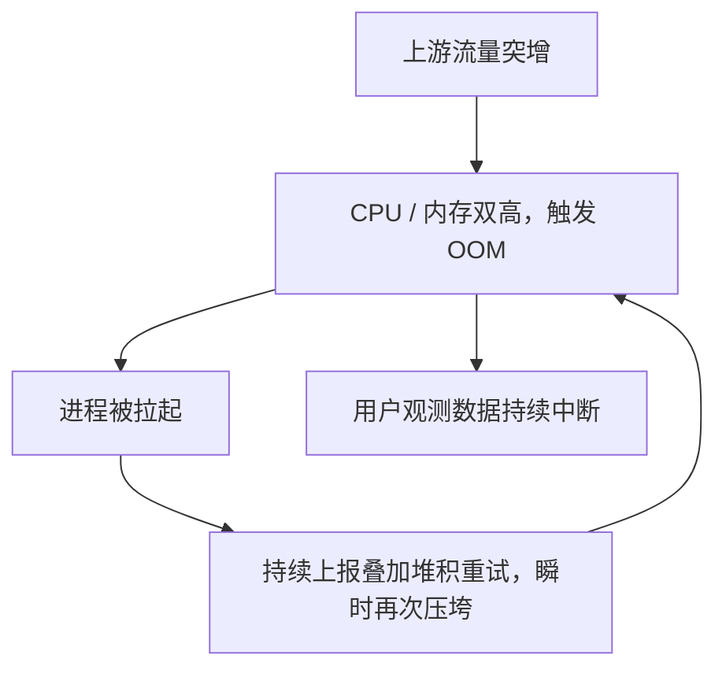

# bk-collector 自适应限流

## 0x01 背景

### a. Why

现有限流（QPS、连接数、单包大小上限）以请求数、连接数等间接指标近似资源压力，属于与真实资源消耗弱相关的代理维度。

在 CPU / 内存逼近危险水位时，它无法主动降级，导致 collector 在流量突增时被压垮、崩溃后又无法自我保护。

触发链路是一个自我强化的崩溃循环：



QPS 限流无法彻底规避问题：流量突增不只体现在 QPS，还体现在单请求包体大小与解析开销，相同 QPS 下大包同样会推高负载。

QPS 维度无法表达真实资源压力，静态阈值要么误杀正常流量，要么在大包场景下失去保护作用。

### b. 目标

- collector 在资源水位逼近危险阈值时，能按接收端点（endpoint）分级有损降级，自我保护不被压垮。
- 降级策略可配置：按 endpoint 配置触发阈值、丢弃比例与熔断点。
- 优先覆盖 k8s 部署形态，二进制形态尽量兼容。

## 0x02 实现路线

### a. 建议的方案

以下为探索方向，不锁定实现。

**核心对象与关键路径**

- 资源水位信号：采集 collector 自身 CPU / 内存使用率作为限流决策输入，k8s 形态需反映容器 cgroup limit 而非宿主机。
- 分级降级决策：按「资源水位 × endpoint 策略」决定放行、按比例丢弃或熔断，不同 endpoint 可配独立的阈值与「水位 → 丢弃率」映射曲线。
- 挂载位置：复用现有 HTTP / gRPC middleware 链，与 `maxbytes` / `maxconns` 同层，在请求入口处决策，不侵入 pipeline / processor。

**分级降级示例**

`/v1/traces` 在 CPU 达 `80%` 时丢弃 `50%`，达 `90%` 时彻底熔断。

**资源信号采集（待确认）**

进程 CPU 使用率 ≈ 区间进程 CPU 时间增量 ÷ 区间墙钟时间增量 ÷ 核数。

下方为参考写法，来源 Java / JMX，仅作算法参考，collector 基于 Go 需寻找等价实现（如读取 `/proc/self` 或 cgroup 统计）：

```java
long newProcessCpuTime = osBean.getProcessCpuTime();
long newProcessUpTime = runtimeBean.getUptime();
int cpuCores = osBean.getAvailableProcessors();
long processCpuTimeDiffInMs = TimeUnit.NANOSECONDS
        .toMillis(newProcessCpuTime - processCpuTime);
long processUpTimeDiffInMs = newProcessUpTime - processUpTime;
double currentCpuUsage = (double) processCpuTimeDiffInMs / processUpTimeDiffInMs / cpuCores;
processCpuTime = newProcessCpuTime;
processUpTime = newProcessUpTime;
```

容器场景下「核数」必须取容器 CPU 配额，而非宿主机可用核数：

- cgroup v1：`cpu.cfs_quota_us` / `cpu.cfs_period_us`。
- cgroup v2：`cpu.max`。

否则 `getAvailableProcessors` 类接口可能返回宿主机核数，高负载时使用率被严重低估、限流失效。

**待调研方向**

后续 PLAN 阶段展开，本期不锁定结论：

- 业界自适应限流通用方案与最佳实践（基于资源 / 延迟反馈的自适应过载保护）。
- deepflow agent 基于资源用量限流的实现是否可借鉴。

### b. 约束

- 限流位置限定在 HTTP / gRPC middleware 层，不侵入 pipeline / processor。
- gRPC 侧现有中间件以 `grpc.ServerOption` 形式注册，自适应丢弃需以拦截器（interceptor）形态接入。
- 作为现有 QPS / `maxbytes` / `maxconns` 的补充，不替换既有限流。
- 降级有损（主动丢弃数据），需保证丢弃量、熔断状态与当前资源水位可观测。
- k8s 形态优先，二进制形态兼容。

## 0x03 参考

现有中间件（挂载锚点）：

- HTTP `maxbytes`（包体上限）：[<源码> httpmiddleware/maxbytes.go](https://github.com/TencentBlueKing/bkmonitor-datalink/blob/master/pkg/collector/internal/httpmiddleware/maxbytes.go)
- HTTP `maxconns`（信号量并发控制，`CoreNum × ratio`）：[<源码> httpmiddleware/maxconns.go](https://github.com/TencentBlueKing/bkmonitor-datalink/blob/master/pkg/collector/internal/httpmiddleware/maxconns.go)
- gRPC `maxbytes`（`grpc.MaxRecvMsgSize`）：[<源码> grpcmiddleware/maxbytes.go](https://github.com/TencentBlueKing/bkmonitor-datalink/blob/master/pkg/collector/internal/grpcmiddleware/maxbytes.go)
- 中间件注册表：[<源码> httpmiddleware/middleware.go](https://github.com/TencentBlueKing/bkmonitor-datalink/blob/master/pkg/collector/internal/httpmiddleware/middleware.go)、[<源码> grpcmiddleware/middleware.go](https://github.com/TencentBlueKing/bkmonitor-datalink/blob/master/pkg/collector/internal/grpcmiddleware/middleware.go)

领域资料（待调研）：

- [Google SRE Book — Handling Overload](https://sre.google/sre-book/handling-overload/)：客户端自适应限流、按重要性分级降级、基于利用率信号的过载丢弃（load shedding）与优雅降级。
- [deepflow agent](https://github.com/deepflowio/deepflow/tree/main/agent)：基于资源用量的限流实现。
