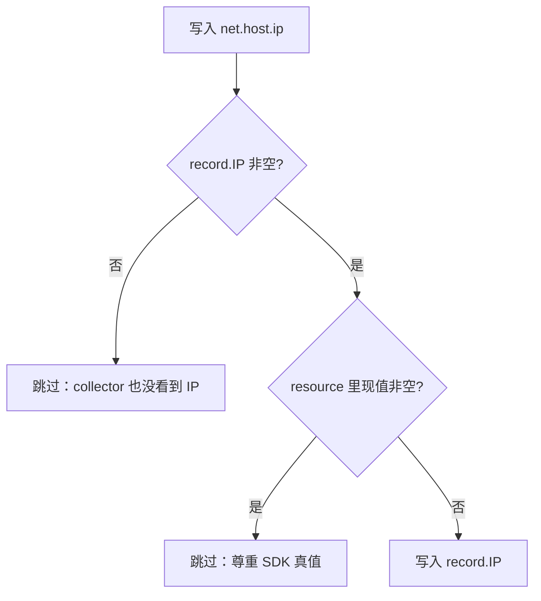

# bk-collector net.host.ip 兜底被空值占位 —— 实施方案

> 基于 [README.md](./README.md) 制定。

## 0x01 架构设计

### a. 改判定，不改语义

`fill_dimensions.from_record` 的设计意图是「SDK 写过就尊重，没写由 collector 补」。实现用 OTel pdata 的 `InsertString`，语义是「key 不存在才写」——这相当于把「key 已存在」当成「SDK 已声明」。

可是空字符串既让 key 存在，也压根不算「声明」。Java OTel SDK 写 `net.host.ip=""` 就踩在这条缝里。

修复只动判定：写入前同时看 key 是否存在和现值是否为空，两者任一空缺就用 record 侧的值兜上。原来「SDK 写真值不被覆盖」的语义继续成立。

同文件 `defaultValueAction` 处理默认值时已经在用这条判定（`factory.go:443-456`），`from_record` 改成相同写法即可。

### b. 决策图



### c. 同类 from_ 动作不一并改

`from_cache`、`from_metadata`、`from_token` 三处也走 `InsertString`，理论上同样能被空值占位。本期都不动：

- 现网证据只在 `from_record` 路径触发，其他三处没观测到 SDK 空值占位
- 一并改会改变「SDK 显式写空值」场景下的覆盖行为，影响面要单独评估
- 留作后续 issue 评估是否一起改

## 0x02 开发方案

### a. 新增工具函数

`factory.go` 同包私有：

```go
// upsertIfBlank 在 attrs[key] 缺失或现值为空字符串时写入 value；value 自身为空则不动。
func upsertIfBlank(attrs pcommon.Map, key, value string) {
    if value == "" {
        return
    }
    if v, ok := attrs.Get(key); ok && v.AsString() != "" {
        return
    }
    attrs.UpsertString(key, value)
}
```

### b. 变更范围

| 改动点 | 处理方式 | 目标 |
| --- | --- | --- |
| **[Add]** `upsertIfBlank` | `factory.go` 同包私有 | 集中表达「目标空缺则兜底」的判定 |
| **[Change]** `fromRecordAction` 的 `"request.client.ip"` 分支 | `InsertString` → `upsertIfBlank` | 修复空字符串占位导致的兜底失效 |
| **[Keep]** `fromCacheAction` / `fromMetadataAction` / `fromTokenAction` | 不动 | 留作后续事项 |

## 0x03 验收与验证

`processor/resourcefilter/factory_test.go` 新增 `TestFromRecordAction_BlankOverride`，表驱动覆盖空值兜底：

| 初始 `net.host.ip` | `RequestClient.IP` | 期望终值 |
| --- | --- | --- |
| key 缺失 | `1.2.3.4` | `1.2.3.4` |
| `""` 占位 | `1.2.3.4` | `1.2.3.4` |
| `5.6.7.8` | `1.2.3.4` | `5.6.7.8` |
| key 缺失 | `""` | key 缺失 |
| `""` | `""` | `""` |

复用 `TestFromRecordAction` 现有的 traces / metrics / logs 三分支结构，每类跑一遍核心断言，证明三种 `RecordType` 行为一致。

回归门禁：`go test ./pkg/collector/processor/resourcefilter/...`

## 0x04 实施进展

| 时间 | 结论性进展 |
| --- | --- |
| | |

## 0x05 参考 & 版本锚点

| 状态 | 分支 | 里程碑 | PR |
| --- | --- | --- | --- |
| 🔄 | `<branch_name>` | 里程碑 `1`：`from_record` 兜底覆盖空值 | 待创建 |

- 触发现场：本 issue [README.md](./README.md)
- 代码位置：[<源码> resourcefilter/factory.go fromRecordAction](https://github.com/TencentBlueKing/bkmonitor-datalink/blob/master/pkg/collector/processor/resourcefilter/factory.go#L348-L382)
- 配置入口：[<源码> apm/core/platform_config.py get_resource_fill_dimensions_config](https://github.com/TencentBlueKing/bk-monitor/blob/master/bkmonitor/apm/core/platform_config.py#L332-L380)
