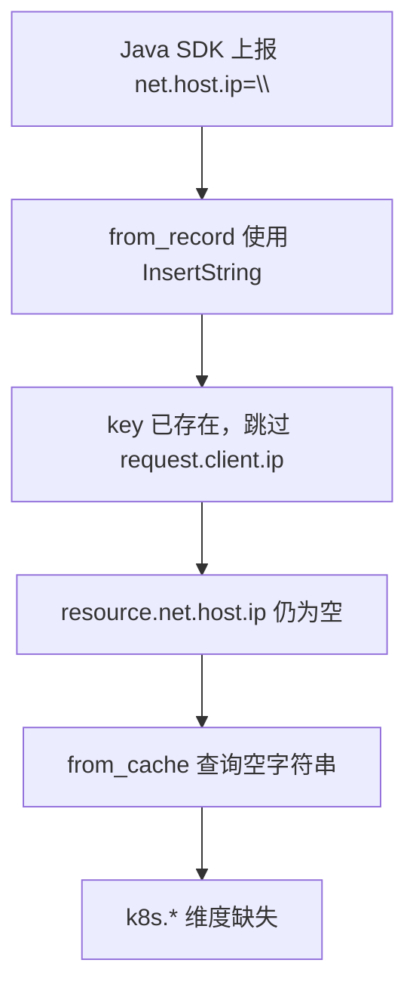

# collector from_record 空 net.host.ip 占位排查

## 0x01 现象

某 APM 应用在 `mock-cluster` 上出现 K8s 维度缺失：Java OTel SDK `1.24.0` 上报的业务 span 没有 `k8s.*` 字段，同集群其他 SDK 的服务正常。

问题不在缓存。operator `/pods` 能返回 `<mock-pod-ip> -> mock-java-app-0` 的映射，collector 也在持续处理 traces。断点更靠前：Java SDK 已经把 `resource.net.host.ip` 写成空字符串。

Java Resource 的关键字段如下：

```text
resource.net.host.ip            = ""
resource.net.host.name          = "mock-java-app-0.mock-ns"
resource.telemetry.sdk.language = "java"
```

平台下发的 `resource_filter/fill_dimensions` 只有两步：

1. `from_record` 把 `request.client.ip` 写到 `resource.net.host.ip`。
2. `from_cache` 用 `resource.net.host.ip` 查 `k8s_cache`，补齐 `k8s.namespace.name`、`k8s.pod.name`、`k8s.pod.ip` 和 `k8s.bcs.cluster.id`。

第一步没有写进去，第二步只能拿空字符串查缓存。`k8s.*` 维度因此断在 `from_cache` 之前。

## 0x02 根因

`from_record` 使用 OTel pdata 的 `InsertString` 写目标字段。这个 API 只看 key 是否存在，不看值是否为空：目标 key 已存在时不会写入新值。

本次 Java SDK 上报了 `net.host.ip=""`。对 collector 来说，`resource.net.host.ip` 的 key 已存在，`request.client.ip` 被跳过；对 `k8s_cache` 来说，空字符串又不是可查询的 Pod IP。

根因链路：



## 0x03 排查过程

1. 对比同集群不同 SDK 的 span：Java SDK 缺 `k8s.*`，其他 SDK 正常。
2. 核对 operator `/pods` 和 collector 状态：mock Pod 映射存在，collector traces pipeline 有持续计数。
3. 读取平台配置：`get_resource_fill_dimensions_config` 使用 `from_record -> from_cache` 串起请求 IP 和 `k8s_cache`。
4. 读取 collector 实现：`fromRecordAction` 对 `request.client.ip` 调用 `InsertString`。
5. 对照同文件 `defaultValueAction`：默认值动作已经把 `!ok || v.AsString() == ""` 视为空位，再用 `Upsert*` 写入。

结论：`from_record` 的空位判断过窄，把“key 存在”误当成“字段可用”。

## 0x04 解决方案

把 `from_record` 的写入协议改成：来源非空，且目标缺失或为空时写入。目标已有非空值时保持现值。

实现方式是在 `pkg/collector/processor/resourcefilter/factory.go` 收敛一个包内私有函数：

```go
func upsertStringIfMissingOrEmpty(attrs pcommon.Map, key, value string) {
	if value == "" {
		return
	}
	if current, ok := attrs.Get(key); ok && current.AsString() != "" {
		return
	}
	attrs.UpsertString(key, value)
}
```

改动范围：

| 对象 | 处理方式 | 目标 |
| --- | --- | --- |
| `fromRecordAction` | `request.client.ip` 分支从 `InsertString` 改为调用新函数 | 修复空 `net.host.ip` 挡住请求 IP 的问题 |
| processor 执行顺序 | 保持 `from_record` 早于 `from_cache` | 不改变现有配置链路 |
| 其他 `from_*` 动作 | 本次不改 | 避免把不同来源的覆盖语义混在一起 |

## 0x05 注意事项与回归点

- 不做空白字符归一化；`" "` 是否应视为空，留给后续数据清洗规则判断。
- `record.RequestClient.IP` 为空时不新建空目标字段，已存在的目标字段也不被清空。
- `from_cache` 的结果维度也使用 `InsertString`。如果后续发现空 `k8s.*` 字段占位，需要按缓存结果写入协议单独评估。
- 新增 `TestFromRecordActionEmptyFallback`，覆盖 traces、metrics、logs 三类 `RecordType`。

核心用例：

| 目标初始值 | `RequestClient.IP` | 期望 |
| --- | --- | --- |
| 目标缺失 | `<mock-pod-ip>` | 写入 `<mock-pod-ip>` |
| `""` | `<mock-pod-ip>` | 写入 `<mock-pod-ip>` |
| `<mock-existing-ip>` | `<mock-pod-ip>` | 保持 `<mock-existing-ip>` |
| 目标缺失 | `""` | 目标仍缺失 |
| `""` | `""` | 目标仍为空 |

回归门禁：

```bash
cd /Users/sandrincai/Project/Github/bk/bkmonitor-datalink/pkg/collector
go test ./processor/resourcefilter/...
```

## 0x06 参考

- [<源码> bkmonitor-datalink/resourcefilter fromRecordAction](https://github.com/TencentBlueKing/bkmonitor-datalink/blob/master/pkg/collector/processor/resourcefilter/factory.go#L348-L382)
- [<源码> bkmonitor-datalink/resourcefilter defaultValueAction](https://github.com/TencentBlueKing/bkmonitor-datalink/blob/master/pkg/collector/processor/resourcefilter/factory.go#L443-L456)
- [<源码> bkmonitor get_resource_fill_dimensions_config](https://github.com/TencentBlueKing/bk-monitor/blob/master/bkmonitor/apm/core/platform_config.py#L332-L380)
- [<源码> bkmonitor get_resource_filter_config_metrics](https://github.com/TencentBlueKing/bk-monitor/blob/master/bkmonitor/apm/core/application_config.py#L430-L460)
