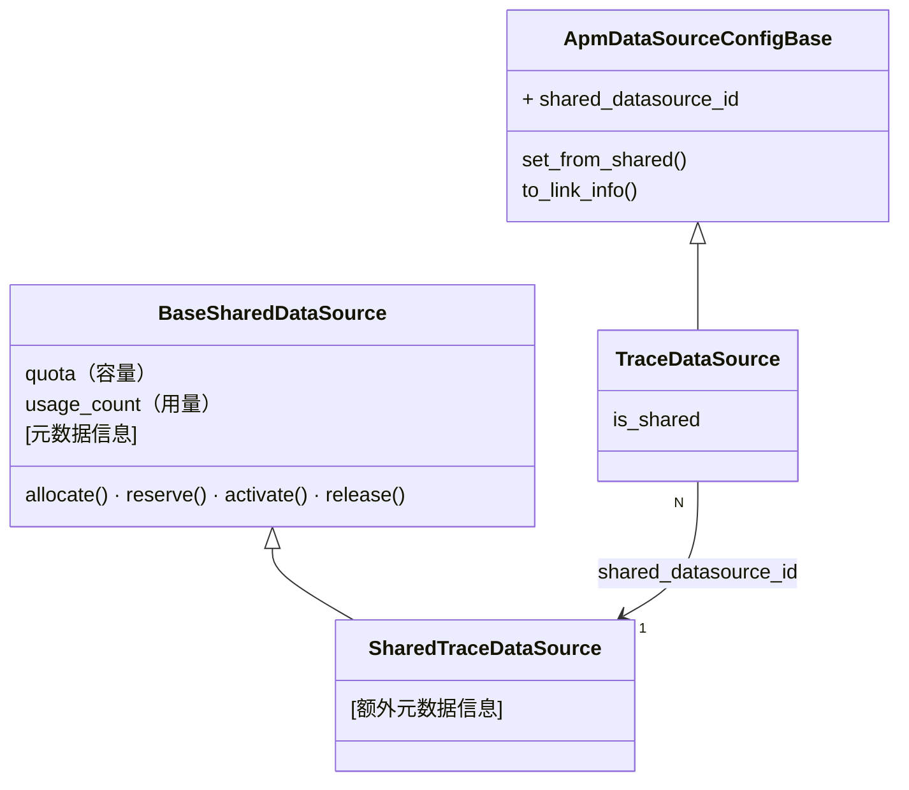
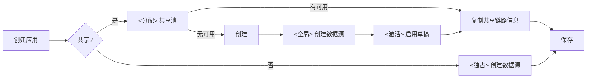
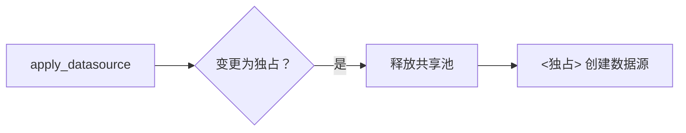
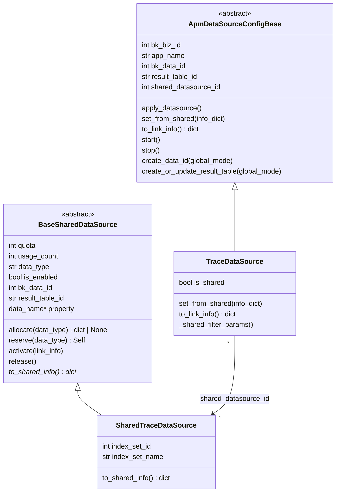
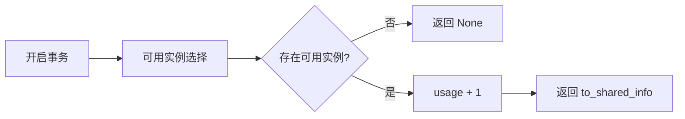
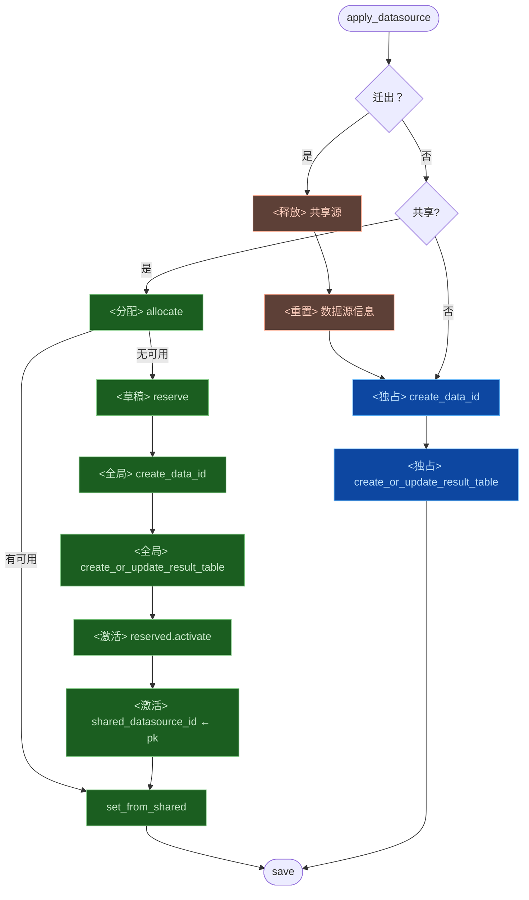
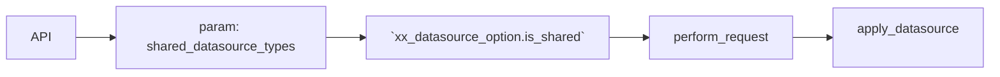
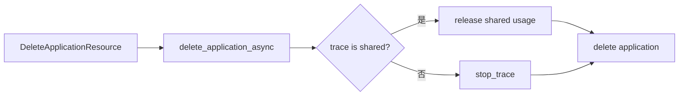

# APM 跨应用共享数据源 —— 实施方案

> 基于 [README.md](./README.md) 制定。

## 0x01 实现方案

### a. 思路

**1）数据源复用**

**Before**：应用 <> 数据源 = 1 : 1，应用独占 RT → ES 索引线性膨胀。

**After**：应用 <> 数据源 = N : 1，多应用复用结果表 → 链路资源（例如索引、DataID）收敛。

**2）数据隔离**：补充 `bk_biz_id` 、`app_name`  到原始数据，并在路由、逻辑层分别进行业务、应用级别查询隔离。

### b. 模型设计

两条独立继承链：**共享数据源池**管理容量与元数据，**应用数据源**通过 `shared_datasource_id` 引用共享池。



多应用复用同一共享数据源（N:1），共享池通过 quota / usage_count 控制容量，详细模型定义见 [0x02/a](#a-共享数据源模型)。

**关键决策**：

- **职责分离**：SharedDataSource 仅负责池管理（容量 + 元数据），外部链路资源创建与回填由 `ApmDataSourceConfigBase` 负责。
- **创建口径分层**：共享模式下，`create_data_id` 与 `create_or_update_result_table` 可使用不同业务口径，详见 `0x01.d` 与 `0x02.b`。
- **关联与扩展**：应用数据源通过 `shared_datasource_id` 引用共享池，共享池类型通过 `SHARED_DS_REGISTRY` 按 `data_type` 扩展。
- **草稿激活模型**：共享源先 reserve 为草稿，外部资源创建成功后再 activate，allocate 仅面向已启用实例。

### c. 共享机制

**创建应用**：

数据源配置增加「是否共享数据源」参数，目前「空间类型」为 `bkapp` 的，默认设置为共享。



**迁出**：从共享模式切换为独占模式。



### d. 命名规则


| 项 | 独占模式 | 共享模式 |
| ---- | ---- | ---- |
| **create_data_id.bk_biz_id** | 实际业务 ID | 环境变量 `SHARED_DATASOURCE_PRIVILEGED_BK_BIZ_ID`，默认 `2` |
| **create_result_table.bk_biz_id** | 实际业务 ID | `GLOBAL_CONFIG_BK_BIZ_ID`，固定 `0` |
| **create_result_table.bk_biz_id_alias** | 不涉及 | 字符串 `bk_biz_id` |
| **data_name** | `{bk_biz_id}_bkapm_trace_{app_name}` | `bkapm_shared_trace_{seq:04d}` |
| **result_table_id** | `{bk_biz_id}_bkapm.trace_{app_name}` | `apm_global.shared_trace_{seq:04d}` |

- `seq`：共享数据源表主键（AUTO_INCREMENT）。
- `seq` 的编号在每个子类内独立递增。
- `data_name`：property 推导，不单独存储。
- `bk_biz_id_alias`：共享模式下创建结果表时传入字符串 `bk_biz_id`。
- `bk_biz_id_alias` 的用途：查询阶段按业务 ID 做业务隔离。

### e. 数据链路

**写入**：bk-collector 从 Token 反解 `bk_biz_id` 、 `app_name`，注入到原始数据。

**查询**：

* 逻辑层（应用级别隔离）：所有查询路径统一追加 `bk_biz_id` + `app_name` 过滤条件。
* 路由层（业务级别隔离）：支持以 `bk_biz_id` 作为 filter 查询业务 0 的全局结果表。
* 本能力可拆分到后续 PR，但共享 Trace 数据正式开放前必须补齐，否则同业务共享池内应用存在互读风险。

### f. 风险与约束


| 风险                 | 应对                                                         |
| -------------------- | ------------------------------------------------------------ |
| 共享索引故障爆炸半径 | quota 合理设定 + 监控                                        |
| 已删除应用数据残留   | ES ILM 自然过期                                              |

---

## 0x02 开发方案

### a. 共享数据源模型

`apm/models/datasource.py`

#### 模型概览

共享数据源池（BaseSharedDataSource）负责管理容量与元数据。

应用数据源（ApmDataSourceConfigBase）通过 `shared_datasource_id` 引用共享池。

完整类图如下：




#### 核心流程

**allocate**：选取可用共享源并占用，无可用时返回 None。



💡 Tips：

* 并发保护：`select_for_update()`。
* 可用实例选择：`filter(usage_count__lt=F('quota'), is_enabled=True)`。
* 负载均衡：`order_by('usage_count')`。
* 原子保证：`update(usage_count=F('usage_count') + 1)`。

**reserve**：创建草稿实例（`is_enabled=False`），pk 即 seq，用于推导 `data_name` / `result_table_id`。


💡 Tips： DB 默认值使用草稿状态：`is_enabled=False, usage_count=0`

**activate**：外部 API 调用成功后，填充链路元数据并启用。


💡 Tips：

* 设置链路信息：从 `link_info` dict 填充 `bk_data_id`、`result_table_id` 及子类扩展字段。
* 启用：`usage_count=1, is_enabled=True`。

**release**：释放占用，usage_count 减 1。

💡 Tips：`Greatest(F('usage_count') - 1, 0)` 防止 usage_count 变为负数。


#### SharedTraceDataSource

继承 BaseSharedDataSource，新增以下扩展字段：


| 字段             | 类型           | 说明         |
| -------------- | ------------ | ---------- |
| index_set_id   | IntegerField | 索引集 ID（可选） |
| index_set_name | CharField    | 索引集名称（可选）  |

- `to_shared_info()`：在基类字段上追加 trace 特有元数据，并作为 `TraceDataSource.set_from_shared()` 的输入。
- `to_shared_info()` 与 `to_link_info()` 维持同构字段集，例如 `bk_data_id`、`result_table_id` 与 `index_set_id`。
- 两者分别承担 SharedDS 导出与 DataSource 导出的相反方向。

#### 注册表

data_type → SharedDataSource 子类映射，供 apply_datasource 按类型查找并调用 allocate/reserve：

```python
SHARED_DS_REGISTRY = {
    "trace": SharedTraceDataSource,
    # "log": SharedLogDataSource,  # future
}
```

### b. ApmDataSourceConfigBase 变更

`apm/models/datasource.py`


| 变更点                                       | 目标                                                         |
| -------------------------------------------- | ------------------------------------------------------------ |
| **[Field]** `shared_datasource_id`           | 新增字段。                                                   |
| **[Method]** `apply_datasource`              | 增加共享数据源处理逻辑（见下方流程）。                       |
| **[Method]** `create_data_id`                | 增加 `global_mode` 、`data_name[可选]` 参数。                |
| **[Method]** `create_or_update_result_table` | 增加 `global_mode` `result_table_id[可选]` 参数。            |
| **[Method]** `to_link_info`                  | 导出链路元数据字典（bk_data_id、result_table_id 等），子类覆写追加特有字段。 |
| **[Method]**  `set_from_shared`              | 由子类覆写，从共享链路信息字典提取各自字段并赋值。           |
| **[Method]** `is_shared`                     | 是否共享，通过 `shared_datasource_id` 判断。                 |
| **[Method]** `start / stop`                  | 共享模式下不执行结果表启停，也不修改共享池 `usage_count`。     |

**共享模式下创建参数结论**：

- `create_data_id(global_mode=True)`：
  - `bk_biz_id` 使用环境变量 `SHARED_DATASOURCE_PRIVILEGED_BK_BIZ_ID`。
  - 默认值为 `2`。
  - 目的：将共享 DataID 统一收口到单一业务空间管理。
- `create_or_update_result_table(global_mode=True)`：
  - `bk_biz_id` 使用 `GLOBAL_CONFIG_BK_BIZ_ID`，固定为 `0`。
  - `bk_biz_id_alias` 传入字符串 `bk_biz_id`。
  - 目的：保持结果表注册在全局业务下，并声明查询按业务 ID 做隔离。

**apply_datasource 共享数据源处理流程**（详见 [0x01/c 共享机制](#c-共享机制) 流程图）：



**补充约束**：

- `API 失败回滚`：`create_data_id` 或 `create_or_update_result_table` 抛异常时，删除草稿（`reserved.delete()`）并向上传播。
- `迁出清理`：`release()` 释放共享源占用后，清空 `shared_datasource_id` 及共享链路字段。
- `迁出后续`：随后进入独占创建流程。
- `存量迁移边界`：存量独占应用不自动迁入共享池，如需支持则必须补齐独占资源释放、共享资源分配与回滚流程。
- `启停边界`：`start()` / `stop()` 只处理独占结果表启停，共享池占用只允许在分配、删除或显式迁出生命周期内变化。


### c. 共享判定机制

`SharedDatasourceRuleFactory` 是 `is_shared` 的统一决策入口。

它根据 `bk_biz_id`、`app_name` 与全局规则配置输出 `shared_datasource_types`，调用方只根据返回列表判断某类数据源是否使用共享模式。

配置示例：

```json
{
  "trace": {
    "list": [
      {
        "connector": "AND",
        "rules": [
          {
            "type": "SPACE_TYPE",
            "params": {
              "space_types": ["bksaas"]
            }
          },
          {
            "type": "APP_NAME_PREFIX",
            "params": {
              "prefixes": ["bk_ai"]
            }
          }
        ]
      }
    ]
  }
}
```

以上配置命中时返回 `["trace"]`，调用方据此将 Trace 数据源设置为共享模式。

协议结构：

| 字段 | 类型 | 必填 | 说明 |
| --- | --- | --- | --- |
| `<datasource_type>` | `object` | 是 | 数据源类型维度的规则配置，命中后返回该数据源类型，例如 `trace`。 |
| `<datasource_type>.list` | `array<object>` | 是 | 规则组列表，组间为 OR 关系，任一规则组命中即该数据源类型命中。 |
| `<datasource_type>.list[].connector` | `string` | 是 | 规则组内的组合关系，可选值为 `AND` / `OR`。 |
| `<datasource_type>.list[].rules` | `array<object>` | 是 | 规则列表，按 `connector` 汇总命中结果。 |
| `<datasource_type>.list[].rules[].type` | `string` | 是 | 规则类型，映射到具体 Rule 实现，例如 `SPACE_TYPE`、`APP_NAME_PREFIX`。 |
| `<datasource_type>.list[].rules[].params` | `object` | 否 | 具体 Rule 对象入参，结构由 `type` 对应的 Rule 定义。 |

调用边界：

- `CreateApplicationResource` 未显式传 `shared_datasource_types` 时，通过工厂解析默认共享类型。
- `ApplyDatasourceResource` 更新存储配置时也必须走同一入口，并优先保留已有共享状态。
- 规则命中不自动迁移存量独占应用，存量迁入共享池必须走显式迁移流程。

### d. TraceDataSource 查询适配

`apm/models/datasource.py`


| 变更点                       | 说明                                  |
| ---------------------------- | ------------------------------------- |
| `build_filter_params`        | 增加过滤 <`bk_biz_id` / `app_name`>。 |
| `update_or_create_index_set` | 共享模式下不创建日志索引集。          |


### e. 应用生命周期

**创建**（`apm/resources.py` — `CreateApplicationResource` / `ApplyDatasourceResource`）：



| 变更点                                | 说明                                                         |
| ------------------------------------- | ------------------------------------------------------------ |
| **[Field]** `shared_datasource_types` | 新增字段： `CreateApplicationResource` / `ApplyDatasourceResource`。<br />默认值：由 `0x02.c` 的共享判定机制解析。<br /><br />操作：设置到 `xx_datasource_option.is_shared`，更新场景需优先保留已有共享状态。 |


**删除**（`apm/task/tasks.py` — `delete_application_async`，由 `DeleteApplicationResource` 触发）：



- 共享模式：删除应用释放共享池占用，但不执行普通 `stop()` 启停逻辑。
- 独占模式：保留现有 `stop_trace()` 关闭结果表流程。

### f. 应用信息注入


| 变更点                   | 说明                                                         |
| ------------------------ | ------------------------------------------------------------ |
| 清洗阶段（bk-collector） | 注入 `bk_biz_id` 、 `app_name` 到 Span（Token 反解），和 `resource` 同一级，无论共享与否均注入。 |
| 应用创建阶段（SaaS）     | 增加 `bk_biz_id` 、 `app_name` 作为 ES mapping 字段。       |

### g. 查询路径审计

增加 <`bk_biz_id`、`app_name`> 过滤。


| 路径                             | 方式               |
| -------------------------------- | ------------------ |
| `TraceDataSource.get_q`          | QueryConfigBuilder |
| `BaseQuery._get_q` → SpanQuery   | QueryConfigBuilder |
| `TopoHandler.list_trace_ids`     | 直接 ES DSL        |
| `apm_web/meta/resources.py`      | QueryConfigBuilder |
| `monitor_web/overview/search.py` | QueryConfigBuilder |
| `apm_web/handlers/db_handler.py` | QueryConfigBuilder |


> 上线前需对代码库执行 `rg "QueryConfigBuilder.*BK_APM"` 和 `rg "es_client\.search"` 全量检索，确认所有查询路径已适配。

### h. 运维操作边界

`OperateApmDataIdResource` 面向独占 DataID。

共享 Trace 数据源下，同一个 `bk_data_id` 被多个应用复用，单应用入口必须拒绝暂停或恢复操作。

如需暂停整池写入，后续应提供共享池级操作，并在接口层明确影响范围。

## 0x03 实施进展

| 时间 | 对应设计片段 | 结论调整概要 | 改动 / 验证 |
|:--|:--|:--|:--|
| `2026-04-23 17:00` | `0x01.e` `0x02.b` `0x02.c` `0x02.e` `0x02.h` | [1] PR review 收口更新路径共享判定、启停边界与 DataID 运维边界<br />[2] 将 `SharedDatasourceRuleFactory` 抽成 `is_shared` 独立决策机制，并按协议文档补充 JSON 示例与字段表<br />[3] 明确查询隔离保留为共享 Trace 正式开放前必须补齐的后续 PR | [1] 已更新方案主干约束、共享判定机制小节与协议字段说明<br />[2] 已复查 PR #10415 最新 head `80e070f`<br />[3] 待开发修复 `ApplyDatasourceResource`、共享启停、`OperateApmDataIdResource` 与 migration LF |
| `2026-04-16 15:00` | `0x01.b` `0x01.d` `0x02.a` `0x02.b` | [1] 合并同日重复文案迭代，只保留最终有效方案结论<br />[2] 明确 `bk_biz_id_alias` 固定传字符串 `bk_biz_id`，用于查询阶段业务隔离<br />[3] 保留共享模型接口约定与 DataID / 结果表创建口径分层 | [1] 已更新关键决策、命名规则、共享模型与方法级参数约束<br />[2] 已统一 `SharedTraceDataSource` 接口说明和单句续行表达<br />[3] 本次仅更新方案文档，未改代码 |
| `2026-04-16 10:00` | `0x01.b` `0x01.d` `0x02.a` `0x02.b` | [1] 合并同小时方案结论与文档结构迭代<br />[2] 共享模式下 DataID 与结果表创建口径拆分<br />[3] `create_data_id` 使用特权业务 ID，`create_or_update_result_table` 使用 `GLOBAL_CONFIG_BK_BIZ_ID=0` 并透传 `bk_biz_id_alias` | [1] 已更新关键决策、命名规则与方法级参数约束<br />[2] 已拆分共享模型、表格后说明与迁移备注<br />[3] 本次仅更新方案文档，未改代码 |

---

*制定日期：2026-03-03*
