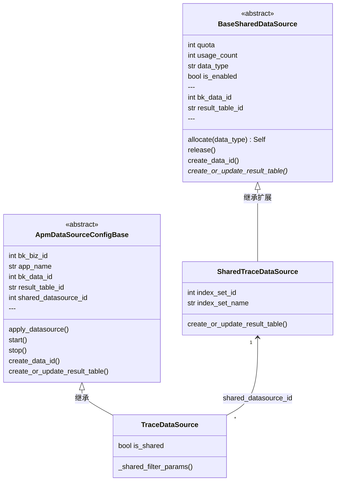
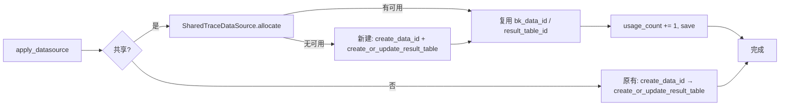
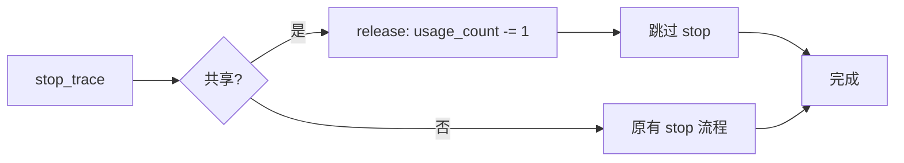

# APM 跨应用共享数据源 —— 实施方案

> 基于 [README.md](./README.md) 制定。

## 0x01 实现方案

### a. 变更前后

**变更前**：APP : DataSource = 1 : 1，每应用独占 bk_data_id → ES 索引线性膨胀。

**变更后**：APP : DataSource = N : 1，多应用复用同一 bk_data_id → 索引收敛至共享池数量。

隔离方式：bk-collector 写入时注入 `bk_biz_id` + `app_name`，查询时追加过滤条件。

### b. 模型设计

两条独立继承链：**共享数据源池**管理容量与元数据，**应用数据源**通过 `shared_datasource_id` 引用共享池。



**关键决策**：

1. **BaseSharedDataSource 独立继承链**，职责清晰：容量管理（quota / usage_count / data_type / is_enabled）+ 元数据（bk_data_id / result_table_id / 按 data_type 可扩展字段）。`create_or_update_result_table` 为抽象方法，子类实现。
2. **ApmDataSourceConfigBase 最小改造**——增加 `shared_datasource_id`，改造 `apply_datasource`（共享分支）和 `start/stop`（共享跳过）。
3. **不使用外键**，`shared_datasource_id` 为 IntegerField（nullable）。各 DataSource 子类通过注册表映射到对应的 SharedDataSource 子类（`SHARED_DS_REGISTRY`），便于后续 Log/Metric 扩展。
4. 共享数据源的 `create_data_id` / `create_or_update_result_table` 使用**业务 0** 注册全局结果表。

### c. 命名规则

| 项 | 独占模式 | 共享模式 |
|----|---------|---------|
| **bk_biz_id** | 实际业务 ID | 0（全局注册） |
| **data_name** | `{bk_biz_id}_bkapm_trace_{app_name}` | `bkapm_shared_trace_{seq:04d}` |
| **result_table_id** | `{bk_biz_id}_bkapm.trace_{app_name}` | `apm_global.shared_trace_{seq:04d}` |

> **bk_biz_id 双重语义**：metadata 注册 bk_biz_id=0（全局结果表），ES 文档中 bk_biz_id 字段为实际业务 ID。

### d. 数据链路

**写入**：bk-collector 从 Token 反解 `bk_biz_id` + `app_name`，注入到 Span Resource Attributes。无论共享与否均注入。

**查询**：共享场景下，所有查询路径统一追加 `bk_biz_id` + `app_name` 过滤条件。metadata 路由层需支持以 `bk_biz_id` 作为 filter 查询业务 0 的全局结果表（**跨团队依赖项**，需确认 metadata 当前能力，若不支持则在 APM 查询层直接使用 `result_table_id` 绕过路由）。

### e. 应用生命周期

**创建**：



**删除**（入口：`delete_application_async` → `stop_trace`）：



### f. 风险与约束

| 风险 | 应对 |
|------|------|
| 共享索引故障爆炸半径 | quota 合理设定 + 监控 |
| 已删除应用数据残留 | ES ILM 自然过期 |
| 并发 allocate 竞态 | `select_for_update` + 新建分支加分布式锁或 unique 约束防重 |
| metadata 路由依赖 | 跨团队确认，备选方案：APM 层直接使用 result_table_id |

### g. 边界声明

- 本期不支持存量应用从独占模式迁移到共享模式
- `is_enabled=False` 仅影响新分配，不影响已挂载应用的读写

---

## 0x02 开发方案

### a. 共享数据源模型

`apm/models/datasource.py`

**BaseSharedDataSource（抽象基类）**

| 字段 | 类型 | 说明 |
|------|------|------|
| `data_type` | CharField | trace / log / metric |
| `quota` | IntegerField | 共享上限，默认 50 |
| `usage_count` | IntegerField | 当前使用量 |
| `is_enabled` | BooleanField | 是否启用 |
| `bk_data_id` | IntegerField | 数据源 ID |
| `result_table_id` | CharField | 结果表 ID |

| 方法 | 说明 |
|------|------|
| `allocate(data_type)` | `transaction.atomic` 内执行：`select_for_update().filter(usage_count__lt=F('quota'), is_enabled=True).order_by('usage_count')` 选取；无可用时加锁新建（`create_data_id` + `create_or_update_result_table`，bk_biz_id=0）；新建失败回滚 |
| `release()` | `update(usage_count=Greatest(F('usage_count') - 1, 0))` |
| `create_data_id()` | bk_biz_id=0 调用 `resource.metadata.create_data_id` |
| `create_or_update_result_table()` | 抽象方法，子类实现 |

**SharedTraceDataSource（继承 BaseSharedDataSource）**

| 扩展字段 | 说明 |
|---------|------|
| `index_set_id` | 索引集 ID（可选） |
| `index_set_name` | 索引集名称（可选） |

| 覆写方法 | 说明 |
|---------|------|
| `create_or_update_result_table` | 同 TraceDataSource 的 ES 存储创建逻辑，bk_biz_id=0，table_id=`apm_global.shared_trace_{seq:04d}`，跳过 `update_or_create_index_set` |

**注册表**（data_type → SharedDataSource 子类映射）

```python
SHARED_DS_REGISTRY = {
    "trace": SharedTraceDataSource,
    # "log": SharedLogDataSource,  # future
}
```

### b. ApmDataSourceConfigBase 变更

`apm/models/datasource.py`

| 变更点 | 当前 | 目标 |
|--------|------|------|
| 模型 | — | 新增 `shared_datasource_id: IntegerField(null=True)` |
| `apply_datasource` | `create_data_id` → `create_or_update_result_table` | 增加共享分支：通过 `SHARED_DS_REGISTRY[data_type]` 获取子类 → `allocate()` → 复制 bk_data_id / result_table_id → save |
| `start` / `stop` | `switch_result_table` | 共享模式跳过：`if is_shared: return` |

新增 property：`is_shared -> bool`（`return self.shared_datasource_id is not None`）

### c. TraceDataSource 查询适配

`apm/models/datasource.py`

| 变更点 | 说明 |
|--------|------|
| 新增 `_shared_filter_params()` | 共享时返回 `[{bk_biz_id filter}, {app_name filter}]`，非共享返回 `[]` |
| `build_filter_params` | 合并 `_shared_filter_params()` |
| `update_or_create_index_set` | 共享模式跳过 |
| `stop` | 共享模式跳过索引集删除 |

### d. CreateApplicationResource

`apm/resources.py`

| 变更点 | 说明 |
|--------|------|
| RequestSerializer | 新增 `shared_datasource_types: ListField`（如 `["trace"]`），或根据 `space_type` 自动推断 |
| `perform_request` | 将共享类型列表传入 options → `apply_datasource` 按类型走共享分支 |

### e. 应用删除

`apm/task/tasks.py` — `delete_application_async`（由 `DeleteApplicationResource` 触发）

| 变更点 | 说明 |
|--------|------|
| `stop_trace` 前 | 检查 `is_shared`：共享 → `SharedTraceDataSource.release()` + 跳过 stop；非共享 → 原逻辑 |

### f. bk-collector

| 变更点 | 说明 |
|--------|------|
| 清洗阶段 | 注入 `bk_biz_id` + `app_name` 到 Resource Attributes（Token 反解），无论共享与否均注入 |

### g. 查询路径审计

| # | 路径 | 方式 | 适配 |
|---|------|------|------|
| 1 | `TraceDataSource.get_q` | QueryConfigBuilder | `build_filter_params` 合并 → 自动生效 |
| 2 | `BaseQuery._get_q` → SpanQuery | QueryConfigBuilder | 通过 `TraceDataSource.build_filter_params` → 自动生效 |
| 3 | `TopoHandler.list_trace_ids` | 直接 ES DSL | `query.bool.must` 追加 term filter |
| 4 | `apm_web/meta/resources.py` | QueryConfigBuilder | 追加 filter |
| 5 | `monitor_web/overview/search.py` | QueryConfigBuilder | 追加 filter |
| 6 | `apm_web/handlers/db_handler.py` | QueryConfigBuilder | 追加 filter |

> 上线前 `rg "QueryConfigBuilder.*BK_APM"` + `rg "es_client\.search"` 全量扫描。

---

*制定日期：2026-03-03*
