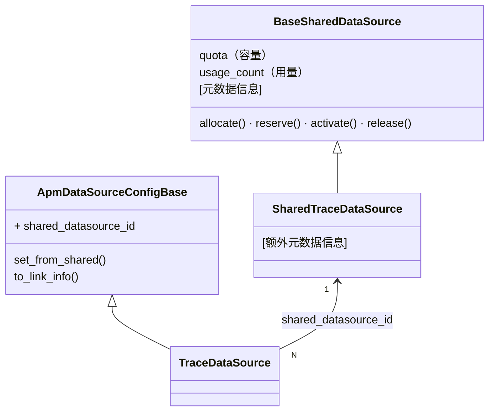
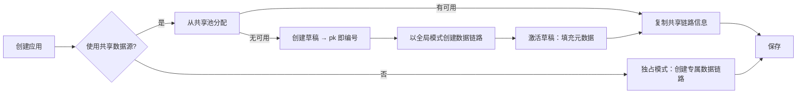
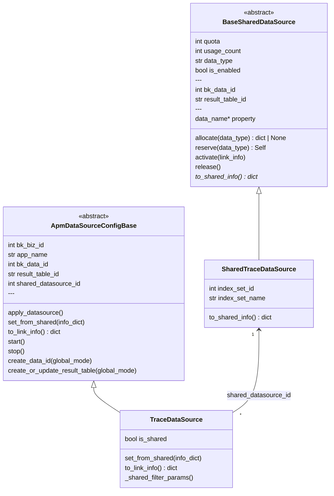
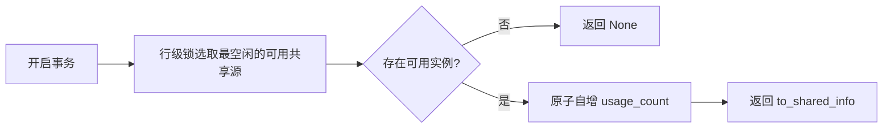
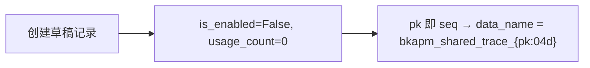
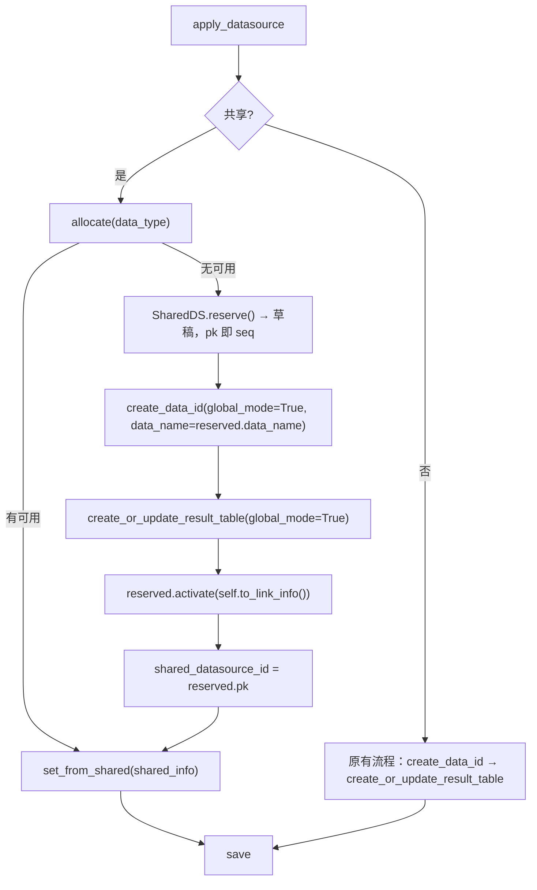
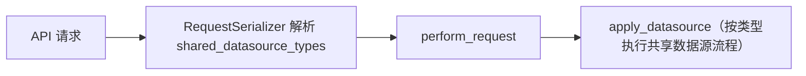
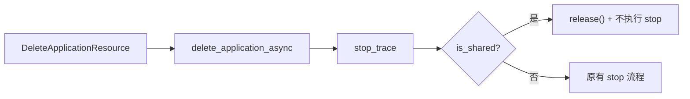

---

## title: APM 跨应用共享数据源 —— 实施方案
tags: [apm, datasource, es, shared-storage, architecture]
issue: knowledge/bkmonitor/issues/2026-03-03-apm-shared-datasource/README.md
description: APM 跨应用共享数据源的实现方案与开发方案
created: 2026-03-03
updated: 2026-03-04
---

# APM 跨应用共享数据源 —— 实施方案

> 基于 [README.md](./README.md) 制定。

## 0x01 实现方案

### a. 思路

**1）数据源复用**

**Before**：应用 <> 数据源 = 1 : 1，应用独占 RT → ES 索引线性膨胀。

**After**：应用 <> 数据源 = N : 1，多应用复用结果表 → 链路资源（例如索引、DataID）收敛。

**2）数据隔离**：补充 `bk_biz_id` 、`app_name`  到原始数据，并在路由、逻辑层分别进行业务、应用级别查询隔离。

### b. 模型设计

两条独立继承链：**共享数据源池**管理容量与元数据，**应用数据源**通过 `shared_datasource_id` 引用共享池。



多应用复用同一共享数据源（N:1），共享池通过 quota / usage_count 控制容量，详细模型定义见 [0x02/a](#a-共享数据源模型)。

**关键决策**：

* **职责分离**：SharedDataSource 仅负责池管理（容量 + 元数据），不包含创建链路资源逻辑；链路资源创建由 `ApmDataSourceConfigBase` 的 `create_data_id` / `create_or_update_result_table` 以 `global_mode` 完成。
* **关联方式**：`shared_datasource_id` 为 IntegerField（可空，不建外键）；通过 `SHARED_DS_REGISTRY` 按 data_type 映射子类，便于扩展 Log/Metric。
* **pk-as-seq**：共享数据源编号直接使用 AUTO_INCREMENT 主键，无需额外 seq 字段或序列表；每个子类独立表、独立编号。
* **Draft 模式**：reserve 创建草稿（`is_enabled=False`），外部 API 调用完成后由 activate 填充元数据并启用；allocate 仅选取 `is_enabled=True` 的实例，草稿不可见。

### c. 共享机制

**创建应用**：



### d. 命名规则


| 项                   | 独占模式                                 | 共享模式                                |
| ------------------- | ------------------------------------ | ----------------------------------- |
| **bk_biz_id**       | 实际业务 ID                              | 0（全局注册）                             |
| **data_name**       | `{bk_biz_id}_bkapm_trace_{app_name}` | `bkapm_shared_trace_{seq:04d}`      |
| **result_table_id** | `{bk_biz_id}_bkapm.trace_{app_name}` | `apm_global.shared_trace_{seq:04d}` |

> `seq` = 共享数据源表主键（AUTO_INCREMENT），每个子类独立编号。`data_name` 由 property 推导，不单独存储。

> **bk_biz_id 双重语义**：metadata 注册 bk_biz_id=0（全局结果表），ES 文档中 bk_biz_id 字段为实际业务 ID。

### e. 数据链路

**写入**：bk-collector 从 Token 反解 `bk_biz_id` 、 `app_name`，注入到原始数据。

**查询**：

* 逻辑层（应用级别隔离）：所有查询路径统一追加 `bk_biz_id` + `app_name` 过滤条件。
* 路由层（业务级别隔离）：支持以 `bk_biz_id` 作为 filter 查询业务 0 的全局结果表。

### f. 风险与约束


| 风险                 | 应对                                                         |
| -------------------- | ------------------------------------------------------------ |
| 共享索引故障爆炸半径 | quota 合理设定 + 监控                                        |
| 已删除应用数据残留   | ES ILM 自然过期                                              |

---

## 0x02 开发方案

### a. 共享数据源模型

`apm/models/datasource.py`

#### 模型概览

两条继承链：共享数据源池（BaseSharedDataSource）管理容量与元数据；应用数据源（ApmDataSourceConfigBase）通过 `shared_datasource_id` 引用共享池。完整类图如下：




#### 核心流程

**allocate**：选取可用共享源并占用，无可用时返回 None。



💡 Tips：

* 并发保护：`select_for_update()`。
* 可用实例选择：`filter(usage_count__lt=F('quota'), is_enabled=True)`。
* 负载均衡：`order_by('usage_count')`。
* 原子保证：`update(usage_count=F('usage_count') + 1)`。

**reserve**：创建草稿实例（`is_enabled=False`），pk 即 seq，用于推导 `data_name`。



💡 Tips： DB 默认值使用草稿状态：`is_enabled=False, usage_count=0`

**activate**：外部 API 调用成功后，填充链路元数据并启用。


💡 Tips：

* 设置链路信息：从 `link_info` dict 填充 `bk_data_id`、`result_table_id` 及子类扩展字段。
* 启用：`usage_count=1, is_enabled=True`。

**release**：释放占用，usage_count 减 1。

💡 Tips：`Greatest(F('usage_count') - 1, 0)` 防止 usage_count 变为负数。


#### SharedTraceDataSource

继承 BaseSharedDataSource，新增以下扩展字段：


| 字段             | 类型           | 说明         |
| -------------- | ------------ | ---------- |
| index_set_id   | IntegerField | 索引集 ID（可选） |
| index_set_name | CharField    | 索引集名称（可选）  |


覆写 `to_shared_info()`，在基类返回的字典基础上追加上述扩展字段。该字典由 `TraceDataSource.set_from_shared()` 消费。`to_shared_info()` 与 `to_link_info()` 的字段集相同（bk_data_id、result_table_id、index_set_id 等），方向相反：前者从 SharedDS 导出，后者从 DataSource 导出。

#### 注册表

data_type → SharedDataSource 子类映射，供 apply_datasource 按类型查找并调用 allocate/reserve：

```python
SHARED_DS_REGISTRY = {
    "trace": SharedTraceDataSource,
    # "log": SharedLogDataSource,  # future
}
```

### b. ApmDataSourceConfigBase 变更

`apm/models/datasource.py`


| 变更点                           | 当前                                             | 目标                                               |
| ----------------------------- | ---------------------------------------------- | ------------------------------------------------ |
| 模型                            | —                                              | 新增 shared_datasource_id: IntegerField(null=True) |
| apply_datasource              | create_data_id → create_or_update_result_table | 增加共享数据源处理逻辑（见下方流程）                               |
| create_data_id                | 以业务 bk_biz_id 创建                               | 增加 global_mode 参数：True 时 bk_biz_id=0；增加可选 data_name 参数，共享时传入 `reserved.data_name` |
| create_or_update_result_table | 以业务维度创建                                        | 增加 global_mode 参数：True 时使用全局 table_id，不创建索引集；增加可选 result_table_id 参数 |
| to_link_info                  | —                                              | 新增：导出链路元数据字典（bk_data_id、result_table_id 等），子类覆写追加特有字段 |
| start / stop                  | switch_result_table                            | 共享模式下不执行                                         |


新增 property：`is_shared -> bool`（`return self.shared_datasource_id is not None`）

新增方法：`set_from_shared(info_dict)`，由子类覆写，从共享链路信息字典提取各自字段并赋值。

**apply_datasource 共享数据源处理流程**（详见 [0x01/c 共享机制](#c-共享机制) 流程图）：



> API 失败回滚：`create_data_id` 或 `create_or_update_result_table` 抛异常时，删除草稿（`reserved.delete()`）并向上传播。


### c. TraceDataSource 查询适配

`apm/models/datasource.py`


| 变更点                          | 说明                                                         |
| ---------------------------- | ---------------------------------------------------------- |
| 新增 `_shared_filter_params()` | 共享时返回 `[{bk_biz_id filter}, {app_name filter}]`，非共享返回 `[]` |
| `build_filter_params`        | 合并 `_shared_filter_params()`                               |
| `update_or_create_index_set` | 共享模式下不执行                                                   |
| `stop`                       | 共享模式下不执行索引集删除                                              |


### d. 应用生命周期

**创建**（`apm/resources.py` — `CreateApplicationResource`）：



- `RequestSerializer` 新增 `shared_datasource_types` 参数（如 `["trace"]`），或根据 `space_type` 自动推断
- `perform_request` 将共享类型列表传入 `apply_datasource`，按类型执行共享数据源流程

**删除**（`apm/task/tasks.py` — `delete_application_async`，由 `DeleteApplicationResource` 触发）：



- `stop_trace` 前检查 `is_shared`：共享模式下调用 `release()` 并不执行 stop 流程
- 非共享模式执行原有 stop 流程

### e. bk-collector


| 变更点   | 说明                                                         |
| -------- | ------------------------------------------------------------ |
| 清洗阶段 | 注入 `bk_biz_id` 、 `app_name` 到 Span（Token 反解），和 `resource` 同一级，无论共享与否均注入。 |


### f. 查询路径审计


| #    | 路径                             | 方式               | 适配                                  |
| ---- | -------------------------------- | ------------------ | ------------------------------------- |
| 1    | `TraceDataSource.get_q`          | QueryConfigBuilder | `build_filter_params` 合并 → 自动生效 |
| 2    | `BaseQuery._get_q` → SpanQuery   | QueryConfigBuilder | --                                    |
| 3    | `TopoHandler.list_trace_ids`     | 直接 ES DSL        | `query.bool.must` 追加 term filter    |
| 4    | `apm_web/meta/resources.py`      | QueryConfigBuilder | 追加 filter                           |
| 5    | `monitor_web/overview/search.py` | QueryConfigBuilder | 追加 filter                           |
| 6    | `apm_web/handlers/db_handler.py` | QueryConfigBuilder | 追加 filter                           |


> 上线前需对代码库执行 `rg "QueryConfigBuilder.*BK_APM"` 和 `rg "es_client\.search"` 全量检索，确认所有查询路径已适配。

---

*制定日期：2026-03-03*