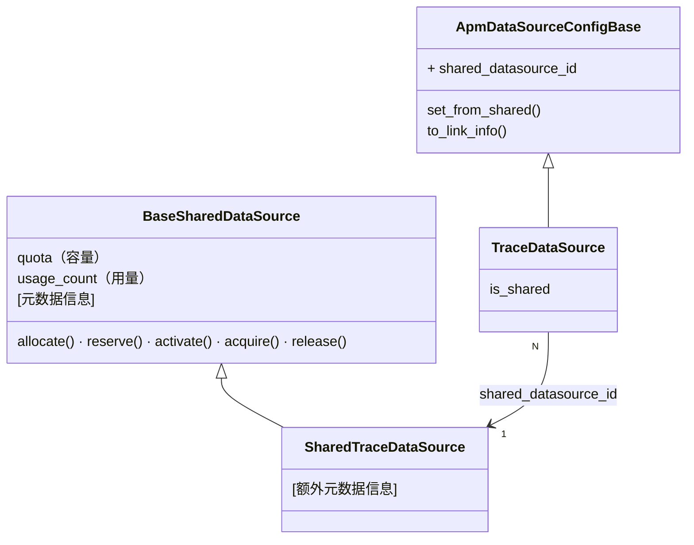
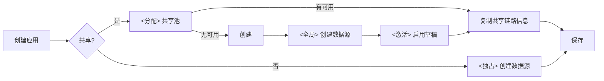
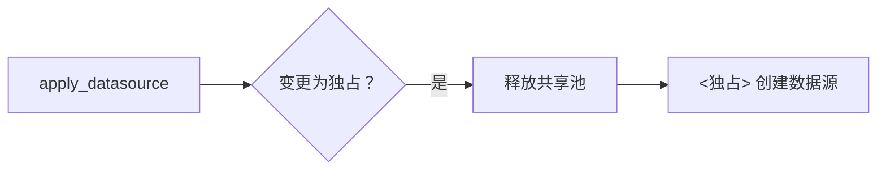
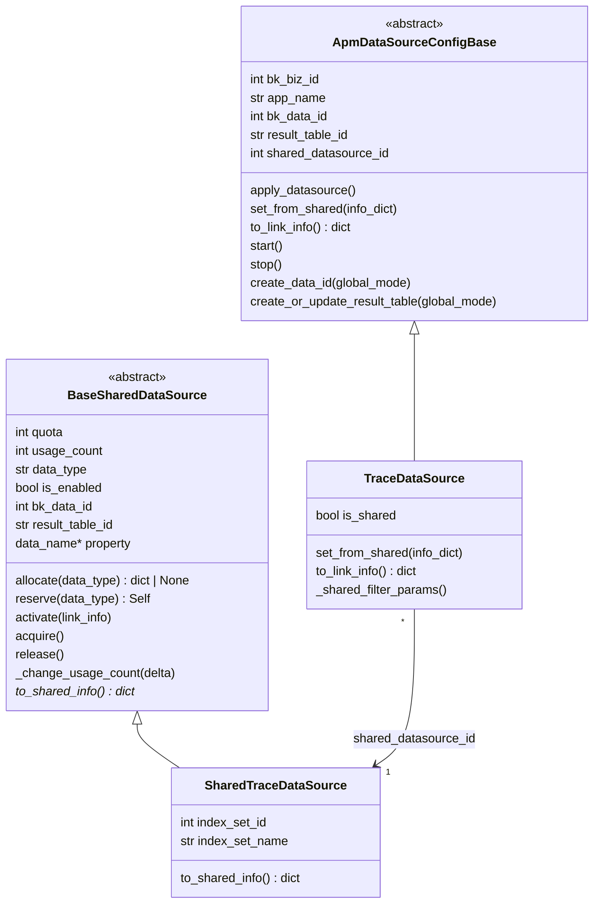
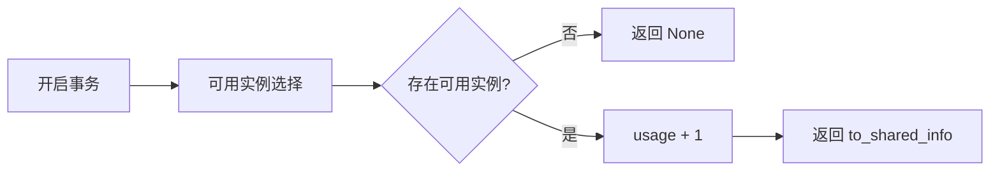
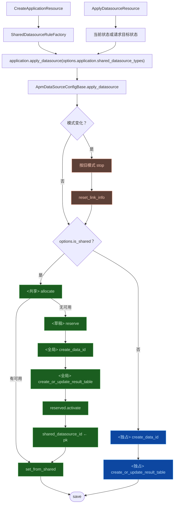
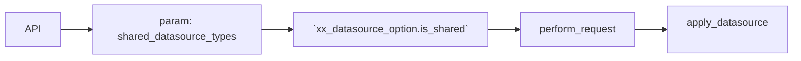
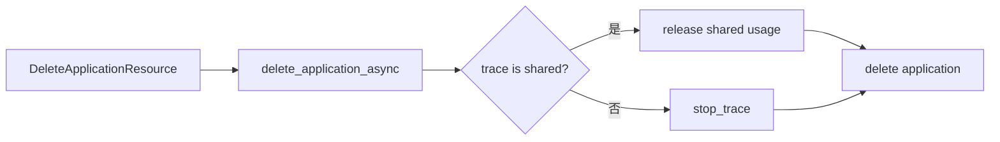
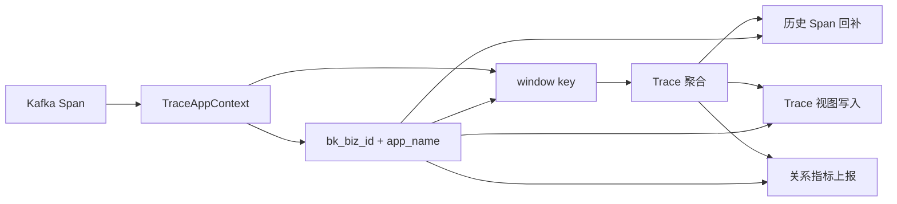

# APM 跨应用共享数据源 —— 实施方案

> 基于 [README.md](./README.md) 制定。

## 0x01 实现方案

### a. 思路

**1）数据源复用**

**Before**：应用 <> 数据源 = 1 : 1，应用独占 RT → ES 索引线性膨胀。

**After**：应用 <> 数据源 = N : 1，多应用复用结果表 → 链路资源（例如索引、DataID）收敛。

**2）数据隔离**：补充 `bk_biz_id` 、`app_name`  到原始数据，并在路由、逻辑层分别进行业务、应用级别查询隔离。

### b. 模型设计

两条独立继承链：**共享数据源池**管理容量与元数据，**应用数据源**通过 `shared_datasource_id` 引用共享池。


```mermaid
classDiagram
    class BaseSharedDataSource {
        quota（容量）
        usage_count（用量）
        [元数据信息]
        allocate() · reserve() · activate() · acquire() · release()
    }
    class SharedTraceDataSource {
    		[额外元数据信息]
    }
    class ApmDataSourceConfigBase {
        + shared_datasource_id
        set_from_shared()
        to_link_info()
    }
    class TraceDataSource {
        is_shared
    }

    BaseSharedDataSource <|-- SharedTraceDataSource
    ApmDataSourceConfigBase <|-- TraceDataSource
    TraceDataSource "N" --> "1" SharedTraceDataSource : shared_datasource_id
```

多应用复用同一共享数据源（N:1），共享池通过 quota / usage_count 控制容量，详细模型定义见 [0x02/a](#a-共享数据源模型)。

**关键决策**：

- **职责分离**：SharedDataSource 仅负责池管理（容量 + 元数据），外部链路资源创建与回填由 `ApmDataSourceConfigBase` 负责。
- **创建口径分层**：共享模式下，`create_data_id` 与 `create_or_update_result_table` 可使用不同业务口径，详见 `0x01.d` 与 `0x02.b`。
- **关联与扩展**：应用数据源通过 `shared_datasource_id` 引用共享池，共享池类型通过 `SHARED_DS_REGISTRY` 按 `data_type` 扩展。
- **草稿激活模型**：共享源先 reserve 为草稿，外部资源创建成功后再 activate，allocate 仅面向已启用实例。

### c. 共享机制

**创建应用**：

数据源配置增加「是否共享数据源」参数，目前「空间类型」为 `bkapp` 的，默认设置为共享。


```mermaid
flowchart LR
    A[创建应用] --> B{共享?}
    B -->|是| C[<分配> 共享池]
    C -->|有可用| D[复制共享链路信息]
    C -->|无可用| E[创建]
    E --> F[<全局> 创建数据源]
    F --> G[<激活> 启用草稿]
    G --> D
    D --> H[保存]
    B -->|否| I[<独占> 创建数据源]
    I --> H
```

**迁出**：从共享模式切换为独占模式。


```mermaid
flowchart LR
    A[apply_datasource] --> B{"变更为独占？"}
    B -->|是| C[释放共享池]
    C --> D[<独占> 创建数据源]
```

### d. 命名规则


| 项 | 独占模式 | 共享模式 |
| ---- | ---- | ---- |
| **create_data_id.bk_biz_id** | 实际业务 ID | 环境变量 `SHARED_DATASOURCE_PRIVILEGED_BK_BIZ_ID`，默认 `2` |
| **create_result_table.bk_biz_id** | 实际业务 ID | `GLOBAL_CONFIG_BK_BIZ_ID`，固定 `0` |
| **create_result_table.bk_biz_id_alias** | 不涉及 | 字符串 `bk_biz_id` |
| **data_name** | `{bk_biz_id}_bkapm_trace_{app_name}` | `bkapm_shared_trace_{seq:04d}` |
| **result_table_id** | `{bk_biz_id}_bkapm.trace_{app_name}` | `apm_global.shared_trace_{seq:04d}` |

- `seq`：共享数据源表主键（AUTO_INCREMENT）。
- `seq` 的编号在每个子类内独立递增。
- `data_name`：property 推导，不单独存储。
- `bk_biz_id_alias`：共享模式下创建结果表时传入字符串 `bk_biz_id`。
- `bk_biz_id_alias` 的用途：查询阶段按业务 ID 做业务隔离。

### e. 数据链路

**写入**：bk-collector 从 Token 反解 `bk_biz_id` 、 `app_name`，注入到原始数据。

**预计算**：BMW 预计算优先从 Span 顶层字段识别业务和应用上下文，取不到时回退到 Consul `BaseInfo`。

完成上下文解析后，再按 `bk_biz_id + app_name + trace_id` 聚合、回补历史 Span、写入 Trace 视图和上报关系指标。

**查询**：

* 逻辑层（应用级别隔离）：所有查询路径统一追加 `bk_biz_id` + `app_name` 过滤条件。
* 路由层（业务级别隔离）：支持以 `bk_biz_id` 作为 filter 查询业务 0 的全局结果表。
* 本能力可拆分到后续 PR，但共享 Trace 数据正式开放前必须补齐，否则同业务共享池内应用存在互读风险。

### f. 风险与约束


| 风险                 | 应对                                                         |
| -------------------- | ------------------------------------------------------------ |
| 共享索引故障爆炸半径 | quota 合理设定 + 监控                                        |
| 已删除应用数据残留   | ES ILM 自然过期                                              |

---

## 0x02 开发方案

### a. 共享数据源模型

`apm/models/datasource.py`

#### 模型概览

共享数据源池（BaseSharedDataSource）负责管理容量与元数据。

应用数据源（ApmDataSourceConfigBase）通过 `shared_datasource_id` 引用共享池。

完整类图如下：


```mermaid
classDiagram
    class BaseSharedDataSource {
        <<abstract>>
        int quota
        int usage_count
        str data_type
        bool is_enabled
        int bk_data_id
        str result_table_id
        allocate(data_type) dict | None
        reserve(data_type) Self
        activate(link_info)
        acquire()
        release()
        _change_usage_count(delta)
        to_shared_info() dict*
        data_name* property
    }
    class SharedTraceDataSource {
        int index_set_id
        str index_set_name
        to_shared_info() dict
    }
    class ApmDataSourceConfigBase {
        <<abstract>>
        int bk_biz_id
        str app_name
        int bk_data_id
        str result_table_id
        int shared_datasource_id
        apply_datasource()
        set_from_shared(info_dict)
        to_link_info() dict
        start()
        stop()
        create_data_id(global_mode)
        create_or_update_result_table(global_mode)
    }
    class TraceDataSource {
        bool is_shared
        set_from_shared(info_dict)
        to_link_info() dict
        _shared_filter_params()
    }
    BaseSharedDataSource <|-- SharedTraceDataSource
    ApmDataSourceConfigBase <|-- TraceDataSource
    TraceDataSource "*" --> "1" SharedTraceDataSource : shared_datasource_id
```


#### 核心流程

**allocate**：选取可用共享源并占用，无可用时返回 None。


```mermaid
flowchart LR
    A[开启事务] --> B[可用实例选择]
    B --> C{存在可用实例?}
    C -->|否| D[返回 None]
    C -->|是| E[usage + 1]
    E --> F[返回 to_shared_info]
```

💡 Tips：

* 并发保护：`select_for_update()`。
* 可用实例选择：`filter(usage_count__lt=F('quota'), is_enabled=True)`。
* 负载均衡：`order_by('usage_count')`。
* 原子保证：`update(usage_count=F('usage_count') + 1)`。

**reserve**：创建草稿实例（`is_enabled=False`），pk 即 seq，用于推导 `data_name` / `result_table_id`。


```mermaid
flowchart LR
    A[创建草稿记录] --> B[共享数据源 pk]
    B --> C["bkapm_shared_trace_{pk:04d}"]
```

💡 Tips： DB 默认值使用草稿状态：`is_enabled=False, usage_count=0`

**activate**：外部 API 调用成功后，填充链路元数据并启用。


```mermaid
flowchart LR
    A["接收 link_info（来自 DataSource.to_link_info）"] --> B[填充]
    B --> C["usage_count=1, is_enabled=True"]
    C --> D[save]
```

💡 Tips：

* 设置链路信息：从 `link_info` dict 填充 `bk_data_id`、`result_table_id` 及子类扩展字段。
* 启用：`usage_count=1, is_enabled=True`。

**usage count 变更**：共享池占用计数表达当前启用中的共享应用占用数，随共享应用启停成对变更。

- `allocate()`：选取可用共享池并完成首次占用，命中后返回共享链路信息。
- `activate()`：新建共享池激活时设置 `usage_count=1`，表示首个应用已占用。
- `acquire()`：共享应用启动时占用槽位，`usage_count` 加 1。
- `release()`：共享应用停止、删除或显式迁出时释放槽位，`usage_count` 减 1。
- `acquire()` / `release()` 复用同一个底层 `_change_usage_count(delta)`，仅 `delta` 不同，查询条件与原子更新逻辑保持一致。
- 应用启停入口必须保持幂等：已启用的 `start_trace()` 不重复 `acquire()`，已停用的 `stop_trace()` 不重复 `release()`。

💡 Tips：

* `release()` 使用 `Greatest(F('usage_count') - 1, 0)` 防止 `usage_count` 变为负数。
* `allocate()` 仍负责选择可用共享池，命中后调用 `acquire()`。
* 删除或显式迁出时按当前启停状态调用 `release()`，避免重复释放。


#### SharedTraceDataSource

继承 BaseSharedDataSource，新增以下扩展字段：


| 字段             | 类型           | 说明         |
| -------------- | ------------ | ---------- |
| index_set_id   | IntegerField | 索引集 ID（可选） |
| index_set_name | CharField    | 索引集名称（可选）  |

- `to_shared_info()`：在基类字段上追加 trace 特有元数据，并作为 `TraceDataSource.set_from_shared()` 的输入。
- `to_shared_info()` 与 `to_link_info()` 维持同构字段集，例如 `bk_data_id`、`result_table_id` 与 `index_set_id`。
- 两者分别承担 SharedDS 导出与 DataSource 导出的相反方向。

#### 注册表

data_type → SharedDataSource 子类映射，供 apply_datasource 按类型查找并调用 allocate/reserve：

```python
SHARED_DS_REGISTRY = {
    "trace": SharedTraceDataSource,
    # "log": SharedLogDataSource,  # future
}
```

### b. ApmDataSourceConfigBase 变更

`apm/models/datasource.py`


| 变更点                                       | 目标                                                         |
| -------------------------------------------- | ------------------------------------------------------------ |
| **[Field]** `shared_datasource_id`           | 新增字段。                                                   |
| **[Method]** `apply_datasource`              | 增加共享数据源处理逻辑，并在进入共享 / 独占分支前收口迁入、迁出判断。 |
| **[Method]** `create_data_id`                | 增加 `global_mode` 、`data_name[可选]` 参数。                |
| **[Method]** `create_or_update_result_table` | 增加 `global_mode` `result_table_id[可选]` 参数。            |
| **[Method]** `to_link_info`                  | 导出链路元数据字典（bk_data_id、result_table_id 等），子类覆写追加特有字段。 |
| **[Method]**  `set_from_shared`              | 由子类覆写，从共享链路信息字典提取各自字段并赋值。           |
| **[Method]** `reset_link_info`               | 重置当前数据源链路信息为未创建状态，用于迁入 / 迁出后复用原有创建流程。 |
| **[Method]** `is_shared`                     | 是否共享，通过 `shared_datasource_id` 判断。                 |
| **[Method]** `start / stop`                  | 共享模式下不执行结果表启停，但每次应用启停需调整共享池占用计数。<br />应用层需保证 `start_trace()` / `stop_trace()` 幂等，避免重复占用或重复释放。<br />独占模式保持原有启停行为。 |

**共享模式下创建参数结论**：

- `create_data_id(global_mode=True)`：
  - `bk_biz_id` 使用环境变量 `SHARED_DATASOURCE_PRIVILEGED_BK_BIZ_ID`。
  - 默认值为 `2`。
  - 目的：将共享 DataID 统一收口到单一业务空间管理。
- `create_or_update_result_table(global_mode=True)`：
  - `bk_biz_id` 使用 `GLOBAL_CONFIG_BK_BIZ_ID`，固定为 `0`。
  - `bk_biz_id_alias` 传入字符串 `bk_biz_id`。
  - 目的：保持结果表注册在全局业务下，并声明查询按业务 ID 做隔离。

**apply_datasource 共享数据源处理流程**（创建与更新最终汇总到 `application.apply_datasource`）：

两个入口都会生成 `shared_datasource_types`，并写入 `options.application.shared_datasource_types`。

| 入口 | 入参状态 | 取值来源 | 语义 |
| --- | --- | --- | --- |
| `CreateApplicationResource` | 不传 `shared_datasource_types` | `SharedDatasourceRuleFactory.list_shared_datasource_types(...)` | [1] 计算本次创建需要共享的数据源类型。<br />[2] 创建阶段仅生成初始目标状态，不产生迁移语义。 |
| `ApplyDatasourceResource` | 不传 `shared_datasource_types` | 查询各数据源配置的 `is_shared` 状态后构造 | [1] 以数据库当前状态作为本次 apply 的目标状态。<br />[2] 当前状态与目标状态一致，不触发迁入 / 迁出。 |
| `ApplyDatasourceResource` | 传入 `shared_datasource_types` | 请求体 `shared_datasource_types` | [1] 请求值作为本次 apply 的目标状态。<br />[2] `["trace"] -> []` 表示 Trace 从共享迁出。<br />[3] `[] -> ["trace"]` 表示 Trace 从独占迁入共享。<br />[4] `[] -> []` 或 `["trace"] -> ["trace"]` 表示状态未变化，不触发迁移。 |


```mermaid
flowchart TD
    C0["CreateApplicationResource"] --> C1["SharedDatasourceRuleFactory"]

    A0["ApplyDatasourceResource"] --> A1["当前状态或请求目标状态"]

    C1 --> E["application.apply_datasource(options.application.shared_datasource_types)"]
    A1 --> E

    E --> F["ApmDataSourceConfigBase.apply_datasource"]
    F --> M{"模式变化？"}
    M -->|是| N["按旧模式 stop"]
    N --> O["reset_link_info"]
    M -->|否| B2{"options.is_shared？"}
    O --> B2

    B2 -->|是| S1["<共享> allocate"]
    S1 -->|有可用| S2["set_from_shared"]
    S1 -->|无可用| S3["<草稿> reserve"]
    S3 --> S4["<全局> create_data_id"]
    S4 --> S5["<全局> create_or_update_result_table"]
    S5 --> S6["reserved.activate"]
    S6 --> S7["shared_datasource_id ← pk"]
    S7 --> S2

    B2 -->|否| D1["<独占> create_data_id"]
    D1 --> D2["<独占> create_or_update_result_table"]

    S2 --> J(["save"])
    D2 --> J

    classDef migrate fill:#5d4037,stroke:#ffab91,color:#ffccbc
    classDef shared fill:#1b5e20,stroke:#81c784,color:#c8e6c9
    classDef dedicated fill:#0d47a1,stroke:#64b5f6,color:#bbdefb

    class N,O migrate
    class S1,S2,S3,S4,S5,S6,S7 shared
    class D1,D2 dedicated
```

图中「模式变化」等价于 `ds.is_shared != options.is_shared`。

- `ds.is_shared`：数据库中当前数据源状态。
- `options.is_shared`：本次 apply 的目标状态。

迁移状态判断只需放在 `apply_datasource` 获取 / 创建 `obj` 后、进入现有共享 / 独占分支前：

```python
if obj.is_shared != options.get("is_shared", False):
    obj.stop(bk_biz_id, app_name)
    obj.reset_link_info()
```

随后沿用既有分支，不需要为迁入 / 迁出拆出第二套创建流程：

| 状态变化 | 语义 | 前置动作 | 后续动作 |
| --- | --- | --- | --- |
| `True → False` | 迁出：共享改独占 | 走 `stop()` 释放共享源占用，再 `reset_link_info()` | `is_shared=False`，进入 `_apply_exclusive_datasource`。 |
| `False → True` | 迁入：独占改共享 | 走 `stop()` 停用独占资源，再 `reset_link_info()` | `is_shared=True`，进入 `_apply_shared_datasource`。 |
| 未变化 | 保持现状 | 不执行迁移清理 | 按目标状态进入原有共享或独占分支。 |

**补充约束**：

- `API 失败回滚`：`create_data_id` 或 `create_or_update_result_table` 抛异常时，删除草稿（`reserved.delete()`）并向上传播。
- `Trace 索引集边界`：共享 Trace 的 `stop()` 不删除日志索引集，独占 Trace 保留现有删除逻辑。


### c. 共享判定机制

`SharedDatasourceRuleFactory` 是 `is_shared` 的统一决策入口。

它根据 `bk_biz_id`、`app_name` 与全局规则配置输出 `shared_datasource_types`，调用方只根据返回列表判断某类数据源是否使用共享模式。

配置示例：

```json
{
  "trace": {
    "list": [
      {
        "connector": "AND",
        "rules": [
          {
            "type": "SPACE_TYPE",
            "params": {
              "space_types": ["bksaas"]
            }
          },
          {
            "type": "APP_NAME_PREFIX",
            "params": {
              "prefixes": ["bk_ai"]
            }
          }
        ]
      }
    ]
  }
}
```

以上配置命中时返回 `["trace"]`，调用方据此将 Trace 数据源设置为共享模式。

协议结构：

| 字段 | 类型 | 必填 | 说明 |
| --- | --- | --- | --- |
| `<datasource_type>` | `object` | 是 | 数据源类型维度的规则配置，命中后返回该数据源类型，例如 `trace`。 |
| `<datasource_type>.list` | `array<object>` | 是 | 规则组列表，组间为 OR 关系，任一规则组命中即该数据源类型命中。 |
| `<datasource_type>.list[].connector` | `string` | 是 | 规则组内的组合关系，可选值为 `AND` / `OR`。 |
| `<datasource_type>.list[].rules` | `array<object>` | 是 | 规则列表，按 `connector` 汇总命中结果。 |
| `<datasource_type>.list[].rules[].type` | `string` | 是 | 规则类型，映射到具体 Rule 实现，例如 `SPACE_TYPE`、`APP_NAME_PREFIX`。 |
| `<datasource_type>.list[].rules[].params` | `object` | 否 | 具体 Rule 对象入参，结构由 `type` 对应的 Rule 定义。 |

调用边界：

- `CreateApplicationResource` 未显式传 `shared_datasource_types` 时，通过工厂解析默认共享类型。
- `ApplyDatasourceResource` 未显式传 `shared_datasource_types` 时，从数据库当前 `is_shared` 反推共享类型，表示本次更新不触发迁入 / 迁出。
- `ApplyDatasourceResource` 显式传入 `shared_datasource_types` 时，以请求列表作为目标状态，空列表也是有效输入。
- 规则命中不自动迁移存量独占应用，存量迁入共享池必须通过 `ApplyDatasourceResource` 显式传参触发。

### d. TraceDataSource 查询适配

`apm/models/datasource.py`


| 变更点                       | 说明                                  |
| ---------------------------- | ------------------------------------- |
| `build_filter_params`        | 增加过滤 <`bk_biz_id` / `app_name`>。 |
| `update_or_create_index_set` | 共享模式下不创建日志索引集。          |


### e. 应用生命周期

**创建**（`apm/resources.py` — `CreateApplicationResource` / `ApplyDatasourceResource`）：


```mermaid
flowchart LR
    A[API] --> B[param: shared_datasource_types]
    B --> C[`xx_datasource_option.is_shared`]
    C --> D[perform_request]
    D --> E["apply_datasource<option>"]
```

| 变更点                                | 说明                                                         |
| ------------------------------------- | ------------------------------------------------------------ |
| **[Field]** `shared_datasource_types` | 新增字段： `CreateApplicationResource` / `ApplyDatasourceResource`。<br />创建默认值：由 `0x02.c` 的共享判定机制解析。<br />更新默认值：从数据库当前 `is_shared` 反推，表示保持现状。<br /><br />操作：设置到 `xx_datasource_option.is_shared`，显式传参时作为目标共享状态。 |


**删除**（`apm/task/tasks.py` — `delete_application_async`，由 `DeleteApplicationResource` 触发）：


```mermaid
flowchart LR
    A[DeleteApplicationResource] --> B[delete_application_async]
    B --> C{trace is shared?}
    C -->|是| D["release shared usage"]
    C -->|否| E[stop_trace]
    D --> F[delete application]
    E --> F
```

- 共享模式：删除应用按当前启停状态释放共享池占用，但不执行结果表启停，也不删除共享日志索引集。
- 独占模式：保留现有 `stop_trace()` 关闭结果表流程。

### f. 应用信息注入


| 变更点                   | 说明                                                         |
| ------------------------ | ------------------------------------------------------------ |
| 清洗阶段（bk-collector） | 注入 `bk_biz_id` 、 `app_name` 到 Span（Token 反解），和 `resource` 同一级，无论共享与否均注入。 |
| 应用创建阶段（SaaS）     | 增加 `bk_biz_id` 、 `app_name` 作为 ES mapping 字段。       |

### g. 查询改造

Trace 原始表查询隔离只对 `apm_global.shared` 前缀结果表生效。

独占表、预计算表和历史表不追加 `bk_biz_id` / `app_name` 过滤，避免现网未补字段的数据查询报错。

改造原则：

- 查询消费方只声明查询目标，不判断 shared 前缀。
- shared 表缺少应用上下文时拒绝查询。
- `QueryConfigBuilder.table(t1, t2, ...)` 支持多结果表，上层不循环 `add_query()`。
- `UnifyQueryCompiler.as_sql` 只做 table 解包，不包含 APM 隔离判断。

#### 查询目标

新增 `bkmonitor/data_source/utils/apm.py`：

```python
@dataclass(frozen=True)
class APMAppTarget:
    bk_biz_id: int
    app_name: str


@dataclass(frozen=True)
class TraceDatasourceTarget:
    table_id: str
    app: APMAppTarget

    @classmethod
    def build(cls, bk_biz_id: int, app_name: str, table_id: str) -> "TraceDatasourceTarget":
        return cls(table_id=table_id, app=APMAppTarget(bk_biz_id=bk_biz_id, app_name=app_name))
```

`TraceDatasourceTarget` 表示一条 `table_id -> APM 应用` 绑定关系。

工厂方法统一命名为 `build()`：`from` 是 Python 关键字，不能作为方法名。

`from_` 语义不稳定，容易被误认为误输入。

查询隔离必须保留 `table_id -> APM 应用` 的绑定关系，禁止把 `bk_biz_id` 与 `app_name` 拆成两个独立列表。

这样可以避免跨业务或跨应用误匹配。

#### 隔离入口

```python
class TraceQueryGuard:
    SHARED_TRACE_TABLE_PREFIXES = ("apm_global.shared",)

    @classmethod
    def get_q(cls, targets: Sequence[TraceDatasourceTarget]) -> QueryConfigBuilder:
        cls._validate_targets(targets)
        target = targets[0]
        q = QueryConfigBuilder((DataTypeLabel.LOG, DataSourceLabel.BK_APM)).table(target.table_id)
        return cls.apply_q(q, targets)

    @classmethod
    def apply_q(cls, q: QueryConfigBuilder, targets: Sequence[TraceDatasourceTarget]) -> QueryConfigBuilder:
        ...

    @classmethod
    def build_dsl(cls, body: dict, target: TraceDatasourceTarget) -> dict:
        ...
```

- `get_q()` 封装标准 APM Trace 查询构造，内部复用 `apply_q()`。
- `apply_q()` 负责判断 shared 表、校验 target，并把应用隔离条件绑定到 query 对象。
- `build_dsl()` 面向直接 ES DSL 查询路径：原查询整体进入 `bool.must`，应用隔离条件追加到 `bool.filter`。
- 现阶段按单 target 收敛，不改造 `QueryConfigBuilder.table(...)` 与 `UnifyQueryCompiler.as_sql` 的多 table 协议。

消费方式：

```python
target = TraceDatasourceTarget.build(2, "app_a", t1)

q = TraceQueryGuard.get_q([target]).time_field(OtlpKey.END_TIME).filter(trace_id__eq=trace_id)
```

需要复用已有 `QueryConfigBuilder` 时：

```python
q = QueryConfigBuilder((DataTypeLabel.LOG, DataSourceLabel.BK_APM)).table(t1)
q = TraceQueryGuard.apply_q(q, [target])
```

#### 改造边界

| 路径                                                       | 处理方式                                                            |
|----------------------------------------------------------|-----------------------------------------------------------------|
| `bkmonitor/data_source/utils/apm.py`                     | 新增 `APMAppTarget`、`TraceDatasourceTarget`、`TraceQueryGuard`。    |
| `bkmonitor/data_source/unify_query/builder.py`           | 本期不改造多 table 绑定，避免扩大统一查询层影响面。                         |
| `UnifyQueryCompiler.as_sql`                              | 不承载 APM shared 前缀判断。                                      |
| `apm/models/datasource.py::TraceDataSource.get_q`        | 改用 `TraceQueryGuard.get_q(...)`。                                |
| `apm/core/handlers/query/base.py::BaseQuery._get_q`      | Trace 数据源使用真实 `result_table_id` 生成 target。                      |
| `apm/core/handlers/query/proxy.py`                       | 关联应用 Span 查询使用 `relation_app.trace_datasource.result_table_id`。 |
| `packages/apm_web/handlers/db_handler.py::DbQuery.get_q` | 增加 target 绑定，DB 场景走 `TraceQueryGuard`。                          |
| `packages/apm_web/meta/resources.py`                     | 直接构造 Trace 查询处改用 `TraceQueryGuard.get_q(...)`。                  |
| `apm/core/discover/base.py`                              | 直接 ES DSL 路径调用 `TraceQueryGuard.build_dsl()`。                   |
| `apm/resources.py::QueryEsResource`                      | 删除旧直查入口，避免共享 Trace 表绕过隔离守卫。                              |

上线前保留审计命令：

```bash
rg "QueryConfigBuilder.*BK_APM"
rg "es_client\.search"
rg "DataSourceLabel\.BK_APM"
```

审计结论需确认所有原始 Trace 查询入口已接入 `TraceQueryGuard`。

### h. 运维操作边界

`OperateApmDataIdResource` 面向独占 DataID。

共享 Trace 数据源下，同一个 `bk_data_id` 被多个应用复用，单应用入口必须拒绝暂停或恢复操作。

如需暂停整池写入，后续应提供共享池级操作，并在接口层明确影响范围。

### i. 预计算 Trace 视图隔离

预计算链路优先从 Span 解析隔离上下文，而不是只依赖 `data_id`。

现状与风险：

- 任务入口：`pkg/bk-monitor-worker/internal/apm/pre_calculate` 当前按 `data_id` 启动任务。
- 元数据来源：业务、应用和预计算写入表来自 Consul `BaseInfo`。
- 共享风险：一个 `data_id` 承载多个应用后，静态 `BaseInfo` 无法表达 event 级归属。
- 直接后果：窗口混聚、历史 Span 回补串应用、Trace 视图覆盖和关系指标 label 误归属。

目标结构：


```mermaid
flowchart LR
    A["Kafka Span"] --> B["TraceAppContext"]
    B --> C["window key"]
    C --> D["Trace 聚合"]
    D --> E["历史 Span 回补"]
    D --> F["Trace 视图写入"]
    D --> G["关系指标上报"]

    B --> H["bk_biz_id + app_name"]
    H --> C
    H --> E
    H --> F
    H --> G
```

#### 应用上下文

新增 `TraceAppContext`，表示一条 Span 归属的 APM 应用。

| 字段 | 类型 | 必填 | 说明 |
| --- | --- | --- | --- |
| `bk_biz_id` | `string` | 是 | 优先从 Span 顶层 `bk_biz_id` 提取，取不到时回退到 Consul `BaseInfo`。 |
| `app_name` | `string` | 是 | 优先从 Span 顶层 `app_name` 提取，取不到时回退到 Consul `BaseInfo`。 |
| `trace_id` | `string` | 是 | 继续使用 Span 原有 `trace_id`。 |

解析优先级：

- Span 优先：`bk_biz_id` 和 `app_name` 存在于 Span 顶层时，以 Span 为准。
- BaseInfo 兜底：Span 缺少任一字段时，从当前 `data_id` 对应的 Consul `BaseInfo` 回填缺失字段。
- 类型归一：`bk_biz_id` 允许字符串或数字，进入 `TraceAppContext` 后统一为字符串。
- 异常处理：Span 与 `BaseInfo` 都无法补齐字段时，跳过本批预计算并记录异常指标。

兼容边界：

- `BaseInfo` 兜底只用于兼容历史 Span 或字段注入不完整的链路。
- 共享池内多应用精确隔离仍依赖 Span 顶层字段，`BaseInfo` 兜底只提供旧链路兼容能力。
- 兜底后的窗口、缓存、历史查询、写入和指标仍只消费 `TraceAppContext`。
- 上下文提取只发生在 Span 标准化阶段。

#### 聚合边界

窗口、缓存、Bloom 和 ES 写入统一使用应用隔离键。

| 场景 | 当前口径 | 新口径 |
| --- | --- | --- |
| Window 定位 | `trace_id` | `bk_biz_id + app_name + trace_id` |
| Bloom key | `trace_id` | 应用隔离键 |
| Cache key | `traceInfo:{bk_biz_id}:{app_name}:{trace_id}` | 保持该格式，但取值来自 `TraceAppContext` |
| ES document id | `trace_id` | 应用隔离键 |

历史 Span 回补查询规则：

- 查询条件：同时追加 `trace_id`、`bk_biz_id` 和 `app_name`。
- 共享表：不再用应用名正则筛选最新索引，直接使用共享结果表索引前缀。
- 独占表：保留现有按应用结果表前缀查询的兼容行为。

#### 写入路由

预计算结果表的选择逻辑不变。

仍复用 SaaS `PrecalculateStorage(bk_biz_id, app_name)` 的一致性哈希口径，不按共享 `data_id` 固定单表写入。

路由规则：

- 路由输入：使用解析后的 `TraceAppContext.bk_biz_id` 和 `TraceAppContext.app_name`。
- 路由算法：沿用现有 `PrecalculateStorage(bk_biz_id, app_name)` 一致性哈希。
- 路由边界：隔离改造不新增 Consul 配置字段，也不要求配置下发方新增预计算结果表协议。
- 兼容要求：独占模式和历史 `BaseInfo` 兜底链路继续走现有写入逻辑。

#### 改造规模

本改造属于隔离兼容，不应演变成预计算模块的大规模重构。

保留边界：

- 任务模型：仍按 `data_id` 创建一个 daemon task，不拆成每个应用一个任务。
- 主流程：保留现有 window、`Processor`、`MetricProcessor` 和 storage 调用链。
- 数据结构：只补充轻量 `TraceAppContext`，不重写 Trace 聚合模型。
- 写入兼容：不改预计算结果表选择算法，不新增 Consul 配置协议。

必要改动：

- 上下文解析：在 Span 标准化阶段完成 Span 优先、`BaseInfo` 兜底。
- 隔离键：window、Bloom、Cache 和 ES `_id` 使用 `bk_biz_id + app_name + trace_id`。
- 查询条件：历史 Span 回补追加 `bk_biz_id` 和 `app_name`。
- 写入路由：使用 `TraceAppContext` 作为现有一致性哈希入参，独占模式保持旧路由。

#### 开发落点

| 路径 | 处理方式 |
| --- | --- |
| `core/meta.go` | 不新增配置协议，继续提供 `BaseInfo` 给 `TraceAppContext` 兜底。 |
| `window/window.go` | `Span` / `StandardSpan` 增加 `TraceAppContext`，标准化阶段完成 Span 优先与 `BaseInfo` 兜底。 |
| `window/distributive.go` | window hash、`CollectTrace` 和 `Event` 使用应用隔离键。 |
| `window/processor.go` | TraceInfo、历史 Span 回补、Bloom、Cache 和 SaveEs 写入全部消费 event 级上下文。 |
| `window/metrics_processor.go` | 关系指标 label 使用 event 级 `app_name`，自定义服务配置查询使用 event 级 `bk_biz_id + app_name`。 |
| `storage/es.go` / `storage/storage.go` | 不重构写入逻辑，仅确认写入字段和 ES `_id` 使用 `TraceAppContext`。 |

验收点：

- Span 缺少 `bk_biz_id` 或 `app_name` 时，能回退到 Consul `BaseInfo` 补齐 `TraceAppContext`。
- Span 与 `BaseInfo` 都无法补齐字段时，跳过预计算并记录异常指标。
- 同一共享 `data_id` 下两个应用使用相同 `trace_id` 时，窗口、缓存、Bloom 和 ES `_id` 互不影响。
- shared 表回补历史 Span 的 DSL 同时包含 `trace_id`、`bk_biz_id` 和 `app_name`。
- Trace 视图字段 `biz_id`、`app_name` 与解析后的 `TraceAppContext` 一致。
- 关系指标中的 `apm_application_name` 使用 `TraceAppContext`，不在指标阶段重新读取静态 `BaseInfo`。
- 共享 `data_id` 只创建一个 daemon task，多个应用不会互相覆盖 Consul 配置。

## 0x03 实施进展

| 时间 | 对应设计片段 | 结论调整概要 | 改动 / 验证 |
|:--|:--|:--|:--|
| `2026-05-13 12:00` | `0x01.e` `0x02.i` | [1] 补充 BMW 预计算 Trace 视图隔离方案：上下文解析从静态 `data_id` 调整为 Span 优先、Consul `BaseInfo` 兜底<br />[2] 明确窗口、历史回补、写入路由和关系指标都消费 event 级应用上下文<br />[3] 明确本改造属于隔离兼容，只补必要隔离键、查询条件和上下文入参，不做大规模重构<br />[4] 删除容易误导的 Consul 配置契约描述，确认预计算结果表选择逻辑不变 | [1] 已核对 `bkmonitor-datalink` 预计算模块的 notifier、window、processor、storage 与 Consul 配置结构<br />[2] 按澄清更新缺字段回退策略、改造规模边界与写入路由边界<br />[3] 本次仅更新方案文档，未改代码 |
| `2026-05-13 00:00` | `0x02.g` | [1] 收口 PR #10583 检索隔离最终口径：共享 Trace 原始表只通过 `TraceQueryGuard` 追加应用隔离，旧 `query_apm_es` 直查入口删除<br />[2] `TraceDatasourceTarget` 工厂方法统一命名为 `build()`，本期按单 target 收敛，不改造统一查询层多 table 协议<br />[3] `build_dsl()` 合并规则固定为原查询进入 `bool.must`、隔离条件进入 `bool.filter` | [1] 已复查 PR head `b70572d`，旧 review 线程已全部 resolved<br />[2] 已发布 `1` 个新增 P1：统计接口删除不完整，需同步清理 SDK / docs / apigw 残留配置 |
| `2026-04-30 20:00` | `0x02.a` `0x02.b` `0x02.e` | [1] 收口 PR #10415 最终 review 结论：共享 Trace 的 `start` / `stop` 每次启停调整共享池计数，`start_trace` 需补充与 `stop_trace` 对称的幂等保护<br />[2] `apply_datasource` 按可重入口径处理，不再作为阻塞问题<br />[3] `shared_datasource_types` 接受非 Trace 类型视为扩展预留，不要求本 PR 调整 | [1] 已更新 `usage_count` 主干语义与应用生命周期边界<br />[2] 已将 review 结论收敛为 1 个 P1：`start_trace` 幂等保护<br />[3] 已 Approve PR #10415 |
| `2026-04-30 00:00` | `0x02.g` | [1] 将「查询路径审计」调整为「查询改造」，明确 shared Trace 查询隔离只在 `TraceQueryGuard` 收口<br />[2] 补充 `APMAppTarget` / `TraceDatasourceTarget` 目标模型，保留 `table_id -> APM 应用` 一一绑定<br />[3] 明确 `UnifyQueryCompiler.as_sql` 仅负责多 table 解包，不承载 APM shared 前缀判断 | [1] 已更新查询改造方案主干与审计命令<br />[2] 本次仅更新方案文档，未改代码 |
| `2026-04-27 20:00` | `0x02.a` `0x02.b` `0x02.e` | [1] PR review 收口共享池计数边界：补充 `acquire()` 与 `release()` 成对语义，并要求二者复用 `_change_usage_count(delta)`<br />[2] 明确共享 Trace 启停不操作 `switch_result_table()`，删除释放共享池占用但不删除共享日志索引集<br />[3] 补充以 `ApplyDatasourceResource.shared_datasource_types` 为入口的显式迁入 / 迁出方案：不传表示保持数据库现状，传入列表表示目标共享状态<br />[4] 撤回查询隔离默认开启阻塞意见，查询隔离作为后续 PR 的已知拆分事项继续保留在方案约束中 | [1] 已复查 PR #10415 最新 head `a104714`<br />[2] 仍需开发修复删除共享应用未释放 `usage_count`、`release()` 负数保护，以及 apply 更新路径迁入 / 迁出状态判断<br />[3] 本次仅更新方案文档与 review 结论，不修改 PR 代码 |
| `2026-04-23 17:00` | `0x01.e` `0x02.b` `0x02.c` `0x02.e` `0x02.h` | [1] PR review 收口更新路径共享判定、启停边界与 DataID 运维边界<br />[2] 将 `SharedDatasourceRuleFactory` 抽成 `is_shared` 独立决策机制，并按协议文档补充 JSON 示例与字段表<br />[3] 明确查询隔离保留为共享 Trace 正式开放前必须补齐的后续 PR | [1] 已更新方案主干约束、共享判定机制小节与协议字段说明<br />[2] 已复查 PR #10415 最新 head `80e070f`<br />[3] 待开发修复 `ApplyDatasourceResource`、共享启停、`OperateApmDataIdResource` 与 migration LF |
| `2026-04-16 15:00` | `0x01.b` `0x01.d` `0x02.a` `0x02.b` | [1] 合并同日重复文案迭代，只保留最终有效方案结论<br />[2] 明确 `bk_biz_id_alias` 固定传字符串 `bk_biz_id`，用于查询阶段业务隔离<br />[3] 保留共享模型接口约定与 DataID / 结果表创建口径分层 | [1] 已更新关键决策、命名规则、共享模型与方法级参数约束<br />[2] 已统一 `SharedTraceDataSource` 接口说明和单句续行表达<br />[3] 本次仅更新方案文档，未改代码 |
| `2026-04-16 10:00` | `0x01.b` `0x01.d` `0x02.a` `0x02.b` | [1] 合并同小时方案结论与文档结构迭代<br />[2] 共享模式下 DataID 与结果表创建口径拆分<br />[3] `create_data_id` 使用特权业务 ID，`create_or_update_result_table` 使用 `GLOBAL_CONFIG_BK_BIZ_ID=0` 并透传 `bk_biz_id_alias` | [1] 已更新关键决策、命名规则与方法级参数约束<br />[2] 已拆分共享模型、表格后说明与迁移备注<br />[3] 本次仅更新方案文档，未改代码 |

---

*制定日期：2026-03-03*
