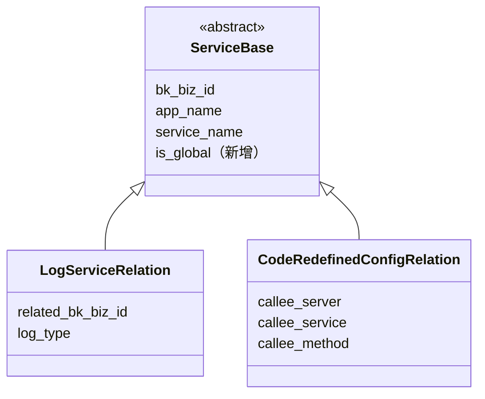
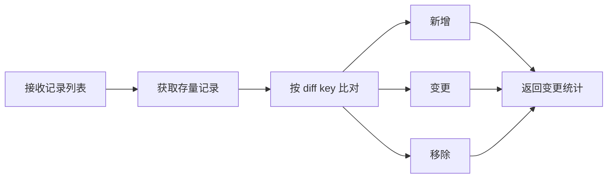

# APM 支持应用级别配置 —— 实施方案

> 基于 [README.md](./README.md) 制定。

## 0x01 实现方案

### a. 思路

**Before**：1 条记录 = 1 个服务，全局配置只能遍历所有服务逐条写入。

**After**：引入全局记录标记，查询时自动合并全局与服务级记录，写入时隔离保护。

**关键决策**：

- **显式字段区分**：新增布尔字段标记全局或服务级。
- **查询收口**：所有查询收敛到基类公共方法，按场景自动组合全局与服务级条件，调用方不再自行拼查询。
- **写入收口**：基类提供 diff-sync 能力，子类仅声明 diff key；所有服务级写入自动排除全局记录。
- **改造范围**：
  - **全部子表**写入、查询进行逻辑收敛。
  - 日志关联：支持新增全局配置，消费入口相应进行改造。
  - 返回码重定义：全局配置支持按 `service_names` 合并及拆分更新。

### b. 模型设计

`ServiceBase`（抽象基类，7 个子类）新增 `is_global` 字段，Migration 仅添加一列，无需数据迁移。

| 级别      | is_global *[1]* | service_name | 生效范围     |
|:--------|:----------------|:-------------|:---------|
| 应用级（全局） | `True`          | `""`         | 应用下所有服务。 |
| 服务级     | `False`         | `"<具体服务>"`   | 仅指定服务。   |

- *[1]* **7 表自动继承**：字段定义在抽象基类，子类表自动获得该列，无需逐表处理。

### c. 查询机制

基类提供统一查询方法，按场景自动组合条件：

| 场景         | service_name | include_global   | 返回内容         |
|:-----------|:-------------|:-----------------|:-------------|
| 服务级        | `"<具体服务>"`   | `true` / `false` | 服务（可选 + 全局）。 |
| 应用级视图（仅全局） | `""`         | `true`           | 全局规则。        |
| 应用级视图（全量）  | `--` *[1]*   | `true`           | 应用下所有规则。     |

- *[1]* `--` 代表不传 `service_name`。
- *[2]* 返回结果附带 `is_global`，调用方据此区分来源。
- *[3]* **向后兼容**：List API 默认不返回全局规则，旧前端不传参数时行为不变。

### d. 写入机制

现状三套写入模式（按 key diff、逐条 upsert、删旧建新）各自实现，引入全局后需在每条路径手动排除，容易遗漏。收敛为统一的 diff-sync 模式：

**保护机制**：获取存量时自动附加服务级条件，从机制上防止意外修改全局记录。全局记录写入需显式声明。

### e. 配置下发

返回码重定义规则下发到 bk-collector 时，按记录类型设置 `source` 字段：

| 级别      | `source` 值 | 说明                       |
|:--------|:-----------|:-------------------------|
| 应用级（全局） | `"*"`      | bk-collector 通配符，匹配所有服务。 |
| 服务级     | 具体服务名      | 仅匹配指定服务。                 |

- *[1]* **不展开、不去重**：全局规则直接以通配符下发，由 bk-collector 运行时匹配，避免枚举所有服务。
- *[2]* **优先级依赖 bk-collector**：服务级与全局规则同时存在时，需确保服务级优先生效（见风险 R2）。

### f. 风险与约束

| #  | 风险                                              | 等级       | 应对                                         |
|:---|:------------------------------------------------|:---------|:-------------------------------------------|
| R1 | 返回码重定义无联合唯一约束，并发写入可能重复                          | High     | 本期记为风险，后续独立 PR 修复。                         |
| R2 | bk-collector `source="*"` 匹配优先级未确认              | Critical | 上线前必须验证：下发全局 + 服务级规则，断言服务级优先生效。若不支持，需调整方案。 |
| R3 | ORM 写入不经过 `full_clean`，`service_name` 无 `blank` | Low      | 无实际影响，记录备忘。                                |
| R4 | `is_global` 查询可能不走索引                            | Low      | 数据量小，可接受。                                  |

---

## 0x02 开发方案

### a. ServiceBase 基础能力

`apm_web/models/service.py`

| 变更点                         | 说明                                                                           |
|:----------------------------|:-----------------------------------------------------------------------------|
| **[Field]** is_global       | `BooleanField(default=False)`。                                               |
| **[Method]** get_relations  | 统一查询入口 *[1]*，可根据实际情况额外提供 `get_relation_q` / `get_relation_infos`。            |
| **[Method]** sync_relations | 统一更新入口 *[2]*，按 `DIFF_KEYS` 比对存量，执行 `bulk_update` / `bulk_create` / `delete`。 |

- *[1]* 统一查询入口：`get_relations(cls, bk_biz_id, app_name, service_names, include_global=True, **extra_filters)`。
- *[2]* 统一更新入口：`sync_relations(cls, bk_biz_id, app_name, service_name, records, scope)`。
  - `scope=service`：`Q(is_global=False)`，仅操作服务级记录。
  - `scope=global`：`Q(is_global=True)`，仅操作全局记录。
  - `scope=all`：不区分，操作该应用下所有记录。用于返回码重定义 `service_name` 不传时的全量更新。

**diff-sync 配置声明**：

| 子类                          | DIFF_KEYS *[1]*                                         | DEFAULT_KEYS *[2]*               |
|:----------------------------|:--------------------------------------------------------|:---------------------------------|
| LogServiceRelation          | `related_bk_biz_id`                                     | `["log_type", "value_list"]`     |
| CodeRedefinedConfigRelation | `kind` `callee_server` `callee_service` `callee_method` | `["code_type_rules", "enabled"]` |

- *[1]* `DIFF_KEYS`：记录的唯一标识，用于比对存量和传入列表。
- *[2]* `DEFAULT_KEYS`：匹配到已有记录后，允许被更新的字段，等价于 `update_or_create(defaults=...)` 的部分。
- *[3]* `DIFF_KEYS`、`DEFAULT_KEYS` 作为类成员变量，子类可重写，供 `sync_relations` 读取。
- *[4]* `SCOPE_KEYS`：
    - 字段：`bk_biz_id` `app_name` `service_name`，参与 diff 比对。
    - 背景：`scope=all` 时工作集包含不同 `service_name` 的记录，需依赖 `SCOPE_KEYS` 区分。

### b. 返回码重定义

#### b-1. 接口改造

`apm_web/service/resources.py`

| 变更点                                                    | 说明                                |
|:-------------------------------------------------------|:----------------------------------|
| ListCodeRedefinedRuleResource                          | *[1]*                             |
| SetCodeRedefinedRuleResource                           | *[2]*                             |
| DeleteCodeRedefinedRuleResource                        | 冗余接口，前端确认无调用入口后删除。                |
| SetCodeRedefinedRuleResource.build_code_relabel_config | 全局规则服务名（`source`）配置为 `"*"`，其余无变更。 |

*[1]*

- 参数：`service_name` 变为「可选」，不传服务名视为「应用级视图（全量）」。
- 处理：调用 `get_relations` 获取配置。
- 响应：规则增加 `is_global`、`service_names` 字段，不同服务相同规则按 `service_name` 聚合展示。

*[2]*

- 参数：规则新增 `service_names` 字段；外层 `service_name` 变为「可选」。
- 处理：
  - 预处理：按 `service_names` 展开为逐服务的 `records`。
  - `service_name` 不传：`sync_relations(scope="all")`。
  - `service_name` 有值：`sync_relations(scope="service")`。

#### b-2. 全局页面展示条件

1）背景：「应用配置」仅在 RPC 场景才需要展示全局返回码重定向的配置页面。

2）`apm_web.meta.resources.SimpleServiceList`

- 增加 `include_systems` 参数并返回 `systems`。
- 复用 `apm_web.strategy.dispatch.enricher.SystemChecker` 增加信息。

3）前端：

- 存在 `RPC` 服务时展示。
- 作用范围仅支持 `systems` 包含 `RPC` 的服务。

### c. 日志关联

`apm_web/handlers/log_handler.py`、`apm_web/service/resources.py`

#### c-1. 查询

以下调用方统一改为调用 `get_relations`：

| 变更点                                            | 说明                                                   |
|:-----------------------------------------------|:-----------------------------------------------------|
| ServiceLogHandler.get_log_relations            | 废弃。                                                  |
| EntitySet._service_log_indexes_map             | `include_global=true`。                               |
| ServiceInfoResource.get_log_relation_info_list | `LogServiceRelationOutputSerializer` 增加 `is_global`。 |
| ServiceInfoResource.get_log_relation_info      | **无引用，待废弃。**                                         |
| ServiceDetailResource.add_service_relation     | **无引用，待废弃。**                                         |
| ApplicationInfoByAppNameResource               | 返回值增加 `log_relations` 字段，查询全局关联。                     |

#### c-2. 写入

| 变更点                                        | 说明                                                                      |
|:-------------------------------------------|:------------------------------------------------------------------------|
| SetupResource                              | 新增 `LogRelationSetupProcessor`，写入全局日志关联。                                |
| ServiceConfigResource.update_log_relations | 收归 `ServiceBase.sync_relations`。                                        |
| LogServiceRelation.filter_by_index_set_id  | 会命中全局记录，调用方 `AppQueryByIndexSetResource` 须按 `(bk_biz_id, app_name)` 去重。 |

### d. 接口层入口收敛

| 变更点                     | 说明                                                        |
|:------------------------|:----------------------------------------------------------|
| ServiceRelationResource | 冗余接口，前端确认无调用入口后删除。                                        |
| ServiceConfigResource   | 所有 `ServiceBase` 子类更新逻辑统一收归 `ServiceBase.sync_relations`。 |
| ServiceInfoResource     | 所有 `ServiceBase` 子类查询逻辑统一收归 `ServiceBase.get_relations`。  |

---

*制定日期：2026-03-04 ｜ 更新日期：2026-03-07*
