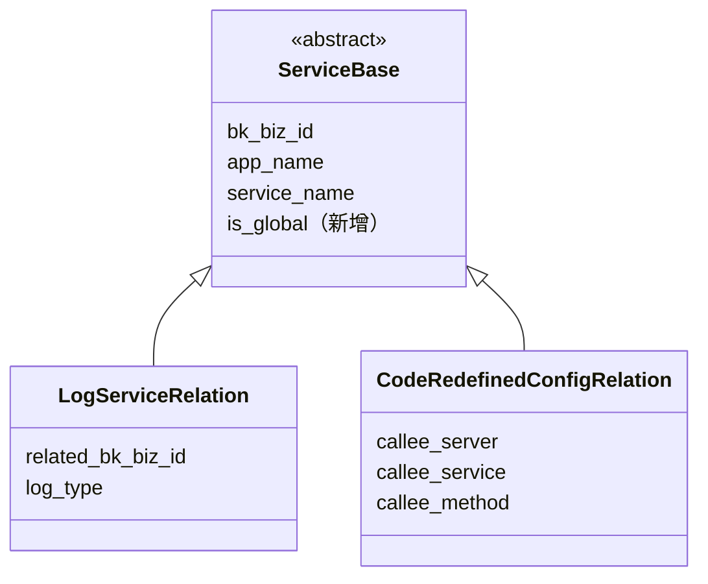
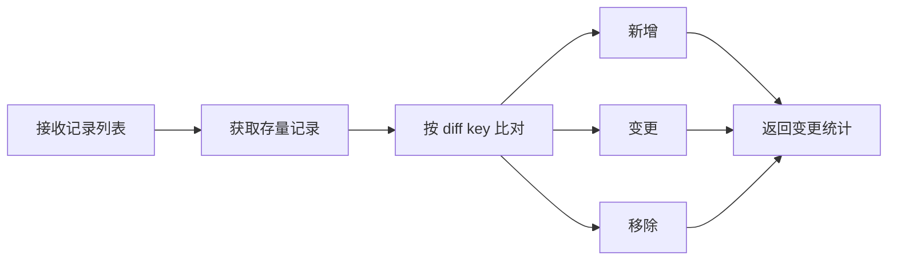

# APM 支持应用级别配置 —— 实施方案

> 基于 [README.md](./README.md) 制定。

## 0x01 实现方案

### a. 思路

本期方案拆成两条线：

- **关系表配置**：日志关联、返回码重定义继续走 `ServiceBase + is_global + sync_relations`，把应用级能力收敛到统一关系模型。
- **返回码备注**：继续走 `ApmMetaConfig`，统一提升到应用级 `code_remarks` 配置，不进入关系表。

关键结论：

- **`kind` 保留**：返回码重定义与返回码备注都保留 `kind` 作为调用视角维度。
- **展示优先级固定**：服务视角备注读取按 `内置默认 < 服务规则 < 全局规则` 合并，因此最终表现为“全局覆盖服务级”。
- **旧备注不做程序迁移**：现网少量旧配置由人工迁移，本期只定义新存储结构与读写协议。

### b. 关系表模型设计

`ServiceBase`（抽象基类，7 个子类）新增 `is_global` 字段，Migration 仅添加一列，无需数据迁移。



| 级别      | is_global *[1]* | service_name | 生效范围     |
|:--------|:----------------|:-------------|:---------|
| 应用级（全局） | `True`          | `""`         | 应用下所有服务。 |
| 服务级     | `False`         | `"<具体服务>"`   | 仅指定服务。   |

- *[1]* **7 表自动继承**：字段定义在抽象基类，子类表自动获得该列，无需逐表处理。

### c. 返回码备注配置模型

返回码备注统一维护在应用级 `ApmMetaConfig`：

- `config_level = application_level`
- `config_key = "code_remarks"`
- `config_value = {"remarks": [...]}` *[1]*

```json
{
  "remarks": [
    {
      "kind": "caller",
      "code": "12",
      "remark": "下游服务无对应接口实现",
      "is_global": true,
      "service_names": []
    },
    {
      "kind": "callee",
      "code": "12",
      "remark": "当前服务无对应接口实现",
      "is_global": false,
      "service_names": ["svc-a", "svc-b"]
    }
  ]
}
```

| 级别 | `is_global` | `service_names` | 唯一语义 | 说明 |
|:--|:--|:--|:--|:--|
| 全局备注 | `true` | `[]` | `kind + code` | 同一 `(kind, code)` 只允许 1 条全局备注。 |
| 服务备注 | `false` | `["svc-a", ...]` | `kind + code + remark` | 同一服务在同一 `(kind, code)` 下最终只能命中 1 条服务级备注。 |

- *[1]* 仅保存用户覆盖项，内置错误码默认备注不落库，由服务视角 `get` 后置补齐。

### d. 查询机制

#### d-1. 关系表查询

基类提供统一查询方法，按场景自动组合条件：

| 场景         | service_name | include_global   | 返回内容         |
|:-----------|:-------------|:-----------------|:-------------|
| 服务级        | `"<具体服务>"`   | `true` / `false` | 服务（可选 + 全局）。 |
| 应用级视图（仅全局） | `""`         | `true`           | 全局规则。        |
| 应用级视图（全量）  | `--` *[1]*   | `true`           | 应用下所有规则。     |

- *[1]* `--` 代表不传 `service_name`。
- *[2]* 返回结果附带 `is_global`，调用方据此区分来源。
- *[3]* **向后兼容**：List API 默认不返回全局规则，旧前端不传参数时行为不变。

#### d-2. 返回码备注查询

| 视角 | 输入 | 输出 | 处理规则 |
|:--|:--|:--|:--|
| 全局视角 | `service_name` 不传 | `{"remarks": [...]}` | 只返回应用级 `code_remarks` 中的用户配置。 |
| 服务视角 | `service_name + kind` | `{code: remark}` | 读取应用级 `code_remarks` 后，按 `内置默认 < 服务规则 < 全局规则` 合并，再输出旧结构。 |

- 服务视角返回结构保持兼容，不返回 `remarks` 数组。
- 全局视角不返回内置默认备注，也不展开成 `{code: remark}`。

### e. 写入机制

#### e-1. 关系表写入

现状三套写入模式（按 key diff、逐条 upsert、删旧建新）各自实现，引入全局后需在每条路径手动排除，容易遗漏。收敛为统一的 diff-sync 模式：



**保护机制**：获取存量时自动附加服务级条件，从机制上防止意外修改全局记录，全局记录写入需显式声明。

#### e-2. 返回码备注写入

**全局视角 `set`**：

- 以 `remarks` 数组整体编辑应用级配置。
- 每条 `remark item` 至少包含：`kind` `code` `remark` `is_global` `service_names`。
- 校验：
  - `is_global=true` 时，`service_names` 必须为空数组。
  - `is_global=true` 的记录以 `kind + code` 唯一。
  - `is_global=false` 的记录之间，`service_names` 不允许在相同 `(kind, code)` 下重叠。

**服务视角 `set`**（兼容旧协议）：

- 外层继续接收 `service_name` `kind` `code` `remark`，新增 `is_global`。
- `is_global=true`：更新或创建全局备注，键为 `kind + code`。
- `is_global=false`：按以下步骤维护服务级备注：
  1. 找出所有 `is_global=false && kind=当前kind && code=当前code` 且 `service_names` 包含当前 `service_name` 的旧记录。
  2. 若旧记录 `remark != 当前 remark`，则从其 `service_names` 中移除当前服务。
  3. 按 `is_global=false && kind && code && remark` 查找目标记录：
     - 已存在：将当前 `service_name` 合并进 `service_names`
     - 不存在：新建目标记录，`service_names=[service_name]`
  4. 清理 `service_names` 为空的记录。

### f. 配置下发

返回码重定义规则下发到 bk-collector 时，按记录类型设置 `source` 字段：

| 级别      | `source` 值 | 说明                       |
|:--------|:-----------|:-------------------------|
| 应用级（全局） | `"*"`      | bk-collector 通配符，匹配所有服务。 |
| 服务级     | 具体服务名      | 仅匹配指定服务。                 |

- *[1]* **不展开、不去重**：全局规则直接以通配符下发，由 bk-collector 运行时匹配，避免枚举所有服务。
- *[2]* **优先级依赖 bk-collector**：服务级与全局规则同时存在时，需确保服务级优先生效（见风险 R2）。

### g. 风险与约束

| #  | 风险                                              | 等级       | 应对                                         |
|:---|:------------------------------------------------|:---------|:-------------------------------------------|
| R1 | 返回码重定义无联合唯一约束，并发写入可能重复                          | High     | 本期记为风险，后续独立 PR 修复。                         |
| R2 | bk-collector `source="*"` 匹配优先级未确认              | Critical | 上线前必须验证：下发全局 + 服务级规则，断言服务级优先生效。若不支持，需调整方案。 |
| R3 | 返回码备注若允许同一服务在相同 `(kind, code)` 下命中多条服务级记录，会导致服务视角读取歧义 | Medium | 服务视角 `set` 强制做“旧记录移除 + 新记录合并”，全局视角 `set` 校验 `service_names` 不重叠。 |
| R4 | ORM 写入不经过 `full_clean`，`service_name` 无 `blank` | Low      | 无实际影响，记录备忘。                                |
| R5 | `is_global` 查询可能不走索引                            | Low      | 数据量小，可接受。                                  |

---

## 0x02 开发方案

本节仅列开发改造落点，查询、写入、优先级与约束规则均以 `0x01` 为准，不再重复展开设计语义。

### a. ServiceBase 基础能力

`apm_web/models/service.py`

| 变更点                         | 说明                                                                           |
|:----------------------------|:-----------------------------------------------------------------------------|
| **[Field]** is_global       | `BooleanField(default=False)`。                                               |
| **[Method]** get_relations  | 统一查询入口 *[1]*，可根据实际情况额外提供 `get_relation_q` / `get_relation_infos`。            |
| **[Method]** sync_relations | 统一更新入口 *[2]*，按 `DIFF_KEYS` 比对存量，执行 `bulk_update` / `bulk_create` / `delete`。 |

- *[1]* 统一查询入口：`get_relations(cls, bk_biz_id, app_name, service_names, include_global=True, **extra_filters)`。
- *[2]* 统一更新入口：`sync_relations(cls, bk_biz_id, app_name, service_name, records, scope)`。
  - `scope=service`：`Q(is_global=False)`，仅操作服务级记录。
  - `scope=global`：`Q(is_global=True)`，仅操作全局记录。
  - `scope=all`：不区分，操作该应用下所有记录，用于返回码重定义 `service_name` 不传时的全量更新。

**diff-sync 配置声明**：

| 子类                          | DIFF_KEYS *[1]*                                         | DEFAULT_KEYS *[2]*               |
|:----------------------------|:--------------------------------------------------------|:---------------------------------|
| LogServiceRelation          | `related_bk_biz_id`                                     | `["log_type", "value_list"]`     |
| CodeRedefinedConfigRelation | `kind` `callee_server` `callee_service` `callee_method` | `["code_type_rules", "enabled"]` |

- *[1]* `DIFF_KEYS`：记录的唯一标识，用于比对存量和传入列表。
- *[2]* `DEFAULT_KEYS`：匹配到已有记录后，允许被更新的字段，等价于 `update_or_create(defaults=...)` 的部分。
- *[3]* `DIFF_KEYS`、`DEFAULT_KEYS` 作为类成员变量，子类可重写，供 `sync_relations` 读取。
- *[4]* `SCOPE_KEYS`：
    - 字段：`bk_biz_id` `app_name` `service_name`，参与 diff 比对。
    - 背景：`scope=all` 时工作集包含不同 `service_name` 的记录，需依赖 `SCOPE_KEYS` 区分。

### b. 返回码重定义

#### b-1. 接口改造

`apm_web/service/resources.py`

| 变更点                                                    | 说明                                |
|:-------------------------------------------------------|:----------------------------------|
| ListCodeRedefinedRuleResource                          | *[1]*                             |
| SetCodeRedefinedRuleResource                           | *[2]*                             |
| DeleteCodeRedefinedRuleResource                        | 冗余接口，前端确认无调用入口后删除。                |
| SetCodeRedefinedRuleResource.build_code_relabel_config | 全局规则服务名（`source`）配置为 `"*"`，其余无变更。 |

*[1]*

- 参数：`service_name` 变为「可选」，不传服务名视为「应用级视图（全量）」。
- 处理：调用 `get_relations` 获取配置。
- 响应：规则增加 `is_global`、`service_names` 字段，不同服务相同规则按 `service_name` 聚合展示。

*[2]*

- 参数：规则新增 `service_names` 字段，外层 `service_name` 变为「可选」。
- 处理：
  - 预处理：按 `service_names` 展开为逐服务的 `records`。
  - `service_name` 不传：`sync_relations(scope="all")`。
  - `service_name` 有值：`sync_relations(scope="service")`。

#### b-2. 业务约束

- 应用级返回码重定义入口仅在 RPC 场景下展示，本方案不展开前端实现细节。

### c. 返回码备注

#### c-1. 存储与接口

`apm_web/models/application.py`、`apm_web/service/resources.py`、`apm_web/service/serializers.py`

| 变更点 | 说明 |
|:--|:--|
| `ApmMetaConfig` | 新增/复用应用级 `config_key="code_remarks"`，通过 `application_id` 维护统一备注配置。 |
| `GetCodeRemarksResource` | 同时支持全局视角与服务视角：`service_name` 不传时返回 `remarks` 数组，传 `service_name + kind` 时返回兼容的 `{code: remark}`。 |
| `SetCodeRemarkResource` | 同时支持全局批量编辑与服务视角兼容写入，服务视角外层新增 `is_global`。 |
| 序列化器 | 为全局 `get/set` 单独定义 serializer，避免复用当前强依赖 `service_name + kind` 的基类。 |

- 全局备注存取步骤：
  1. 通过 `Application.get_application_id_by_app_name` 获取 `application_id`。
  2. 使用 `ApmMetaConfig.get_application_config_value(application_id, "code_remarks")` 读取应用级配置。
  3. 为空时按 `{"remarks": []}` 兜底。
- 旧 `code_remarks_caller` / `code_remarks_callee` 读写逻辑下线，不保留双写。

#### c-2. 写入规则固化

| 落点 | 说明 |
|:--|:--|
| 全局视角资源 | 新增 `remarks[]` 的请求序列化与资源处理，批量维护应用级 `code_remarks`。 |
| 服务视角兼容 | 保留 `service_name + kind + code + remark` 的单码编辑协议，并新增外层 `is_global`。 |
| 读取合并 | 服务视角 `{code: remark}` 的合并顺序、全局唯一性与服务列表不重叠校验统一复用 `0x01.d-2`、`0x01.e-2` 规则。 |
| 旧路径下线 | 旧 `code_remarks_caller` / `code_remarks_callee` 读写逻辑直接下线，不保留双写。 |

- 服务视角缺失备注时，按 [0x05 附录](#0x05-附录) 的默认备注表做后置补齐。

### d. 日志关联

`apm_web/handlers/log_handler.py`、`apm_web/service/resources.py`

#### d-1. 查询

以下调用方统一改为调用 `get_relations`：

| 变更点                                            | 说明                                                   |
|:-----------------------------------------------|:-----------------------------------------------------|
| ServiceLogHandler.get_log_relations            | 废弃。                                                  |
| EntitySet._service_log_indexes_map             | `include_global=true`。                               |
| ServiceInfoResource.get_log_relation_info_list | `LogServiceRelationOutputSerializer` 增加 `is_global`。 |
| ServiceInfoResource.get_log_relation_info      | **无引用，待废弃。**                                         |
| ServiceDetailResource.add_service_relation     | **无引用，待废弃。**                                         |
| ApplicationInfoByAppNameResource               | 返回值增加 `log_relations` 字段，查询全局关联。                     |

#### d-2. 写入

| 变更点                                        | 说明                                                                      |
|:-------------------------------------------|:------------------------------------------------------------------------|
| SetupResource                              | 新增 `LogRelationSetupProcessor`，写入全局日志关联。                                |
| ServiceConfigResource.update_log_relations | 收归 `ServiceBase.sync_relations`。                                        |
| LogServiceRelation.filter_by_index_set_id  | 会命中全局记录，调用方 `AppQueryByIndexSetResource` 须按 `(bk_biz_id, app_name)` 去重。 |

## 0x03 实施节奏与 PR 拆分

基于上述方案，落地按以下节奏推进。

### a. 评估结论

- 可拆分为 **4 个 PR** 合入。
- 建议在**本周发布后**再开始按 PR 逐个合入。
- 每个 PR 均需预留充分测试时间，执行“开发完成 -> 回归 -> 观察”节奏。

### b. 子需求跟进表

| 子需求 | 拆分 PR | 建议合入时机 | 风险等级 | 风险说明 | 必测点 | 跟进状态 |
|:--|:--|:--|:--|:--|:--|:--|
| 服务配置 DB 表变更 | PR-1 | 本周发布后优先合入 | 低 | [1] 可能影响序列化器<br />[2] 已检查旧引用基本废弃，整体影响可控 | 序列化器相关接口响应与字段结构是否正常 | 待开始 |
| 关系查询与同步逻辑收口 | PR-2 | PR-1 稳定后合入 | 中 | [1] 模型新增收口方法本身影响低<br />[2] 迁移并废弃旧方法，调用面较广 | [1] 所有调用收口逻辑的接口回归<br />[2] 同步结果需与旧逻辑一致 | 待开始 |
| 日志关联与返回码重定义改造 | PR-3 | PR-2 稳定后合入 | 中 | [1] 接口协议变更<br />[2] 配置功能行为变更<br />[3] 需验证全局规则下发与服务级优先级 | [1] 配置层接口功能完整测试<br />[2] 查询层验证日志关联与返回码重定义规则是否生效 | 待开始 |
| 返回码备注改造 | PR-4 | PR-3 稳定后合入 | 中 | [1] 接口协议变更<br />[2] 新增应用级合并语义<br />[3] 需验证全局与服务级备注优先级 | [1] 服务视角与全局视角联调<br />[2] 验证默认备注补齐与规则覆盖顺序 | 待开始 |

### c. 测试节奏建议

| 阶段 | 要求 |
|:--|:--|
| PR-1 | 接口级自测 + 回归，验证序列化器稳定后再进入 PR-2 |
| PR-2 | 全链路回归，重点覆盖历史调用入口与结果一致性 |
| PR-3 | 协议变更联调 + 配置生效验证，重点覆盖日志关联与返回码重定义的全局/服务级行为 |
| PR-4 | 协议变更联调 + 配置生效验证，重点覆盖返回码备注的全局/服务合并优先级 |

## 0x04 实施进展

| 时间 | 对应设计片段 | 结论调整概要 | 改动 / 验证 |
|:--|:--|:--|:--|
| `2026-04-10 16:00` | `0x03.a` `0x03.b` `0x03.c` | [1] 将“日志关联、返回码重定义与返回码备注改造”拆分为两个交付阶段<br />[2] PR-3 聚焦日志关联与返回码重定义<br />[3] PR-4 单独承接返回码备注改造，以降低单 PR 变更面并拉直联调节奏 | [1] 已更新 PR 拆分数量<br />[2] 已更新子需求跟进表<br />[3] 已更新测试节奏建议 |
| `2026-04-09 21:00` | `0x01.a` `0x01.c` `0x01.e` `0x02.c` | [1] 确认返回码备注不进入关系表，改为统一落在应用级 `ApmMetaConfig.code_remarks`<br />[2] 保留 `kind` 作为备注维度<br />[3] 服务视角 `set` 以 `kind + code + remark` 合并 `service_names`，并强制移除同 `(kind, code)` 下的旧冲突记录<br />[4] 服务视角 `get` 仅做后置补齐内置默认备注，全局视角不返回内置项 | [1] 已核对 `GetCodeRemarksResource` / `SetCodeRemarkResource`<br />[2] 已核对 `ApmMetaConfig` 与 `CodeRedefinedConfigRelation`<br />[3] 已核对现有前端调用面和 tRPC 内置错误码来源<br />[4] 已据此更新方案主干与默认备注表 |

## 0x05 附录

### a. tRPC 内置错误码默认备注

来源：[trpc.proto](https://github.com/trpc-group/trpc/blob/main/trpc/trpc.proto)

整理口径：

- `0~171`、`999` 优先采用手册语义。
- `201+`、`1000` 在手册未完整展开时，按 `trpc.proto` 枚举名与注释整理。
- 默认备注按 `kind + code` 组织，当 `caller/callee` 语义无差异时，可复用同一文案。

| Code | 枚举                                        | 默认备注              |
|:-----|:------------------------------------------|:------------------|
| 0    | `TRPC_INVOKE_SUCCESS`                     | 成功                |
| 1    | `TRPC_SERVER_DECODE_ERR`                  | 服务端解码错误           |
| 2    | `TRPC_SERVER_ENCODE_ERR`                  | 服务端编码错误           |
| 11   | `TRPC_SERVER_NOSERVICE_ERR`               | 服务端无对应 Service 实现 |
| 12   | `TRPC_SERVER_NOFUNC_ERR`                  | 服务端无对应接口实现        |
| 21   | `TRPC_SERVER_TIMEOUT_ERR`                 | 服务端处理超时           |
| 22   | `TRPC_SERVER_OVERLOAD_ERR`                | 服务端过载保护丢弃请求       |
| 23   | `TRPC_SERVER_LIMITED_ERR`                 | 服务端限流             |
| 24   | `TRPC_SERVER_FULL_LINK_TIMEOUT_ERR`       | 服务端全链路超时          |
| 31   | `TRPC_SERVER_SYSTEM_ERR`                  | 服务端系统错误           |
| 41   | `TRPC_SERVER_AUTH_ERR`                    | 服务端鉴权失败           |
| 51   | `TRPC_SERVER_VALIDATE_ERR`                | 服务端请求参数校验失败       |
| 101  | `TRPC_CLIENT_INVOKE_TIMEOUT_ERR`          | 客户端调用超时           |
| 102  | `TRPC_CLIENT_FULL_LINK_TIMEOUT_ERR`       | 客户端全链路超时          |
| 111  | `TRPC_CLIENT_CONNECT_ERR`                 | 客户端连接错误           |
| 121  | `TRPC_CLIENT_ENCODE_ERR`                  | 客户端编码错误           |
| 122  | `TRPC_CLIENT_DECODE_ERR`                  | 客户端解码错误           |
| 123  | `TRPC_CLIENT_LIMITED_ERR`                 | 客户端限流             |
| 124  | `TRPC_CLIENT_OVERLOAD_ERR`                | 客户端过载保护丢弃请求       |
| 131  | `TRPC_CLIENT_ROUTER_ERR`                  | 客户端路由错误           |
| 141  | `TRPC_CLIENT_NETWORK_ERR`                 | 客户端网络错误           |
| 151  | `TRPC_CLIENT_VALIDATE_ERR`                | 客户端响应参数校验失败       |
| 161  | `TRPC_CLIENT_CANCELED_ERR`                | 上游主动取消请求          |
| 171  | `TRPC_CLIENT_READ_FRAME_ERR`              | 客户端读取 Frame 错误    |
| 201  | `TRPC_STREAM_SERVER_NETWORK_ERR`          | 服务端流式网络错误         |
| 211  | `TRPC_STREAM_SERVER_MSG_EXCEED_LIMIT_ERR` | 服务端流消息超限          |
| 221  | `TRPC_STREAM_SERVER_ENCODE_ERR`           | 服务端流式编码错误         |
| 222  | `TRPC_STREAM_SERVER_DECODE_ERR`           | 服务端流式解码错误         |
| 231  | `TRPC_STREAM_SERVER_WRITE_END`            | 服务端流写结束           |
| 232  | `TRPC_STREAM_SERVER_WRITE_OVERFLOW_ERR`   | 服务端流写溢出           |
| 233  | `TRPC_STREAM_SERVER_WRITE_CLOSE_ERR`      | 服务端流写关闭           |
| 234  | `TRPC_STREAM_SERVER_WRITE_TIMEOUT_ERR`    | 服务端流写超时           |
| 251  | `TRPC_STREAM_SERVER_READ_END`             | 服务端流读结束           |
| 252  | `TRPC_STREAM_SERVER_READ_CLOSE_ERR`       | 服务端流读关闭           |
| 253  | `TRPC_STREAM_SERVER_READ_EMPTY_ERR`       | 服务端流读空数据          |
| 254  | `TRPC_STREAM_SERVER_READ_TIMEOUT_ERR`     | 服务端流读超时           |
| 255  | `TRPC_STREAM_SERVER_IDLE_TIMEOUT_ERR`     | 服务端流空闲超时          |
| 301  | `TRPC_STREAM_CLIENT_NETWORK_ERR`          | 客户端流式网络错误         |
| 311  | `TRPC_STREAM_CLIENT_MSG_EXCEED_LIMIT_ERR` | 客户端流消息超限          |
| 321  | `TRPC_STREAM_CLIENT_ENCODE_ERR`           | 客户端流式编码错误         |
| 322  | `TRPC_STREAM_CLIENT_DECODE_ERR`           | 客户端流式解码错误         |
| 331  | `TRPC_STREAM_CLIENT_WRITE_END`            | 客户端流写结束           |
| 332  | `TRPC_STREAM_CLIENT_WRITE_OVERFLOW_ERR`   | 客户端流写溢出           |
| 333  | `TRPC_STREAM_CLIENT_WRITE_CLOSE_ERR`      | 客户端流写关闭           |
| 334  | `TRPC_STREAM_CLIENT_WRITE_TIMEOUT_ERR`    | 客户端流写超时           |
| 351  | `TRPC_STREAM_CLIENT_READ_END`             | 客户端流读结束           |
| 352  | `TRPC_STREAM_CLIENT_READ_CLOSE_ERR`       | 客户端流读关闭           |
| 353  | `TRPC_STREAM_CLIENT_READ_EMPTY_ERR`       | 客户端流读空数据          |
| 354  | `TRPC_STREAM_CLIENT_READ_TIMEOUT_ERR`     | 客户端流读超时           |
| 355  | `TRPC_STREAM_CLIENT_IDLE_TIMEOUT_ERR`     | 客户端流空闲超时          |
| 361  | `TRPC_STREAM_CLIENT_INIT_ERR`             | 客户端流初始化错误         |
| 999  | `TRPC_INVOKE_UNKNOWN_ERR`                 | 未明确错误             |
| 1000 | `TRPC_STREAM_UNKNOWN_ERR`                 | 未明确流式错误           |

---

*制定日期：2026-03-04 ｜ 更新日期：2026-04-10*
