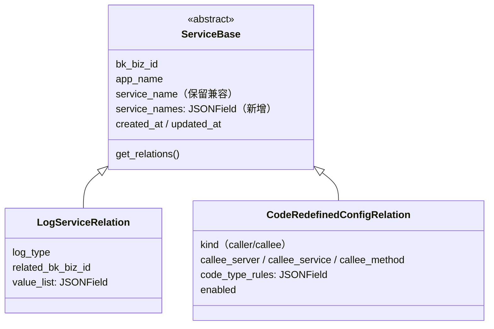
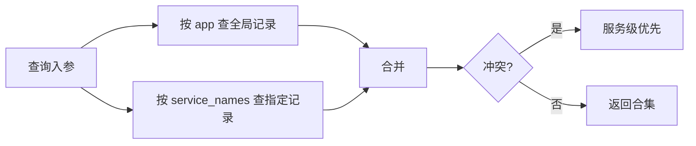
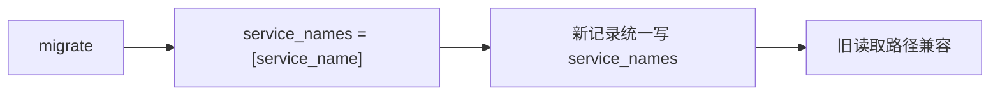

# APM 支持应用级别配置 —— 实施方案

> 基于 [README.md](./README.md) 制定。

## 0x01 实现方案

### a. 思路

**Before**：配置以 `service_name` 为最小粒度，1 条记录 = 1 个服务。全局配置只能通过遍历所有服务逐条写入。

**After**：配置以 `service_names` 为生效范围，1 条记录可覆盖多个服务或全局。查询时合并全局 + 服务级结果，服务级优先。

### b. 模型设计

ServiceBase 新增 `service_names` 字段和 `get_relations` 类方法，所有子类统一继承。

**`service_names` 字段定义**：`JSONField(default=list)`

**生效范围约定**：

| `service_names` 值 | 语义 |
|---|---|
| `[]`（空列表） | 全局 —— 应用下所有服务生效 |
| `["svc_a", "svc_b"]` | 指定服务列表 |

> 保留 `service_name` 字段（兼容历史数据与索引），新逻辑以 `service_names` 为准。全局记录的 `service_name` 填空字符串（需修改字段定义：`blank=True, default=""`）。migrate 保证所有存量数据的 `service_names` 被回填，不存在 `None` 状态。

### c. 查询合并策略

- 全局记录：`service_names=[]`
- 指定记录：`service_names__contains=[target_service]`
- 合并优先级：服务级 > 跨服务共享 > 全局
- 冲突解决（CodeRedefinedConfigRelation）：按 `(callee_server, callee_service, callee_method)` 去重，`len(service_names)` 越小优先级越低，服务级覆盖全局

### d. 迁移策略

第一期：migrate 将 `service_name` 值填入 `service_names`（`[service_name]`），所有新写入路径统一使用 `service_names`。旧读取路径保持 `service_name` 兼容，逐步收敛。

### e. 风险与约束

| 风险 | 应对 |
|---|---|
| service_names JSON 查询性能 | 数据量小（配置级），可接受；MySQL 下 `JSON_CONTAINS` 无法利用索引，必要时通过虚拟列 + B-Tree 索引优化 |
| 全局与服务级冲突 | 查询侧显式合并，服务级优先覆盖 |
| 迁移期间双字段并存 | service_name 保留为冗余索引字段，不影响现有查询 |
| 写入路径遗漏 service_names | ServiceBase.save() 自动同步：若 service_names 为空且 service_name 非空，填充 `[service_name]` |
| 全局规则展开量 | 服务数 × 全局规则数，服务数 < 200 时可接受；长期推动 collector 支持通配符 |

---

## 0x02 开发方案

### a. ServiceBase 基础能力

`apm_web.models.service.ServiceBase`

| 类型 | 变更 | 说明 |
|---|---|---|
| Field | `service_names` | `JSONField(default=list)`，`[]` = 全局，非空 = 指定服务 |
| Method | `get_relations` | 统一查询收口 *[1]* |
| Method | `save` | 自动同步 *[2]* |
| Index | `index_together` | 保留 `(bk_biz_id, app_name, service_name)` 兼容现有查询 |
| Migration | `packages/apm_web/migrations/` | 所有子类表添加字段，RunPython 回填 *[3]* |

*[1]* 统一查询收口：
- 签名：`get_relations(cls, bk_biz_id, app_name, service_names, include_global=True, **extra_filters)`
- 查询：`Q(service_names=[])` (全局) `|` `Q(service_names__contains=[svc])` (指定服务) 取并集返回
- 扩展：子类可 override，调用方通过 `extra_filters` 传入业务过滤条件

*[2]* 若 `service_names` 为空且 `service_name` 非空，自动填充 `service_names = [service_name]`，防止写入路径遗漏。

*[3]* 批量回填 `service_names = [service_name]`，使用 `iterator()` + 分批 `bulk_update` 控制内存。

### b. 日志关联全局改造

`apm_web.models.service.LogServiceRelation`

| 模块 | 变更 | 说明 |
|---|---|---|
| `ServiceLogHandler.get_log_relations` | 改造查询 | 调用 `get_relations` 替代 `filter` *[1]* |
| `SetupResource` | 新增参数 | 支持写入应用级别日志关联 *[2]* |
| `ApplicationInfoByAppNameResource` | 新增返回字段 | 输出全局级别日志关联 *[3]* |
| `ServiceInfoResource` | 查询收敛 | `filter(service_name=...)` → `get_relations` |
| `ServiceInfoResource` | 写入收敛 | 删除与 `values_list` 查询收口到统一方法 |
| `meta.resources.add_service_relation` | 查询收敛 | 收口到 `get_relations` |
| `ServiceConfigResource.update_log_relations` | 写入适配 | 创建实例时补充 `service_names=[service_name]` |
| `ServiceRelationResource.handle_update` | 写入适配 | 通用创建路径，extras 中补充 `service_names` |

*[1]* 查询改造：
- 调用：`LogServiceRelation.get_relations(bk_biz_id, app_name, service_names, include_global, log_type=BK_LOG)`
- 替代：`filter(service_name__in=service_names, log_type=BK_LOG)`
- 合并：全局 + 服务级取并集，按 `index_set_id` 去重
- 调用方（`ServiceRelationListResource`、`ServiceLogInfoResource`、`EntitySet`）已使用 `service_names` 参数，签名无需改动

*[2]* SetupResource 扩展：
- 新增：`log_service_relation` 可选参数，写入全局记录（`service_names=[]`）
- 现状：仅处理 `log_datasource_option`（ES 集群配置），不操作 `LogServiceRelation`

*[3]* ApplicationInfoByAppNameResource 扩展：
- 新增：返回值增加 `log_relations` 字段
- 查询：`LogServiceRelation.get_relations(bk_biz_id, app_name, [], include_global=True)`
- 参考：原 `add_service_relation` 方法已被注释，可复用其结构

> `save()` 自动同步作为写入路径的兜底保障，但写入路径应显式赋值。

### c. 返回码重定义全局改造

`apm_web.models.service.CodeRedefinedConfigRelation`

| 模块 | 变更 | 说明 |
|---|---|---|
| `ListCodeRedefinedRuleResource` | 改造查询 | 调用 `get_relations` 替代 `filter` *[1]* |
| `SetCodeRedefinedRuleResource` | 写入逻辑 | 新增全局规则写入路径（`service_names=[]`） |
| `SetCodeRedefinedRuleResource.build_code_relabel_config` | 配置构建 | 合并全局规则到每个服务的下发配置 *[2]* |
| `publish_code_relabel_to_apm` | 下发适配 | 下发格式无变化，展开后透明兼容 *[3]* |

*[1]* 查询改造：
- 调用：`CodeRedefinedConfigRelation.get_relations(bk_biz_id, app_name, [service_name])`
- 返回：标记每条规则来源（`scope: "global"` / `"service"` / `"shared"`）
- 展示：服务级视图合并全局 + 当前服务规则，全局规则标记 `readonly`

*[2]* 配置构建：
- 现状：按 `(bk_biz_id, app_name, enabled=True)` 查全量，按 `(service_name, kind)` 分组
- 改造：全局规则（`service_names=[]`）生成时，`source` 展开为每个活跃服务名

*[3]* 下发链路：`publish_code_relabel_to_apm` → `NormalTypeValueConfig` → `ApplicationConfig` → bk-collector。bk-collector 按 `source` 匹配，展开后透明兼容。

### d. ServiceConfigResource 待确认项

`apm_web.service.resources.ServiceConfigResource`

| 待确认 | 选项 |
|---|---|
| 服务级界面是否展示全局关联 | A：展示但标记 `readonly` / B：不展示 |
| 服务级是否可编辑全局规则 | A：不可（跳转应用级入口）/ B：可编辑（影响所有服务） |

建议方案 A：展示但只读，编辑入口收敛到应用级配置页面，避免从服务级修改全局规则造成误操作。

---

*制定日期：2026-03-04*
