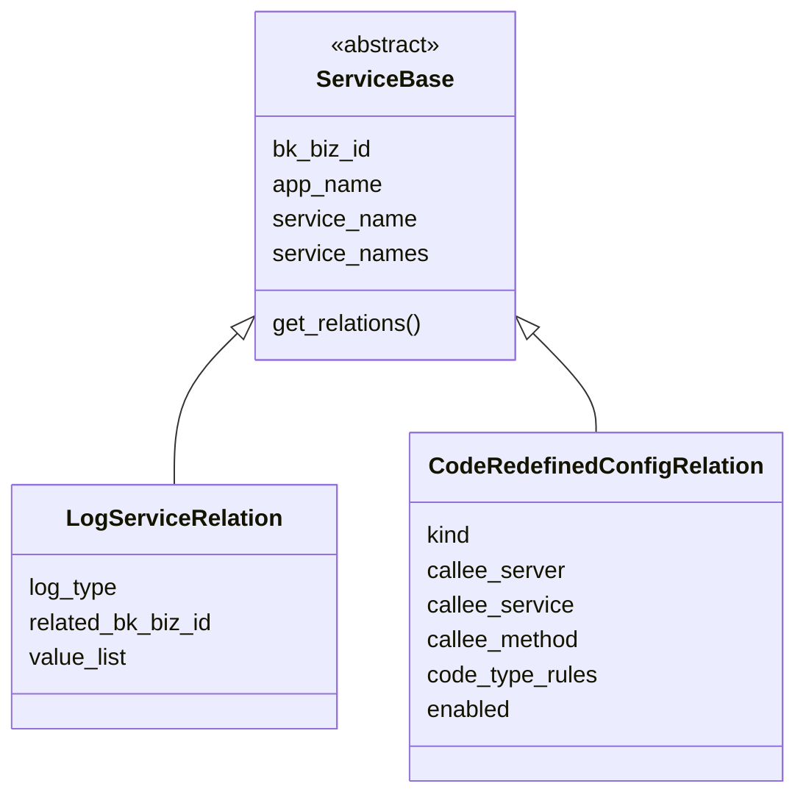
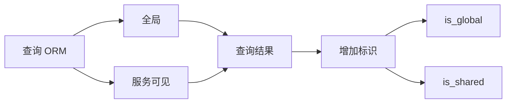
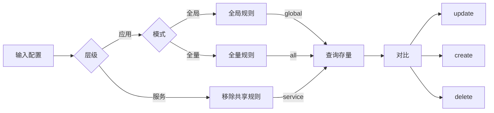
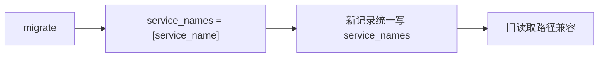

# APM 支持应用级别配置 —— 实施方案

> 基于 [README.md](./README.md) 制定。

## 0x01 实现方案

### a. 思路

**Before**：以服务（`service_name`）为最小粒度，1 条记录 = 1 个服务，全局配置只能通过遍历所有服务逐条写入。

**After**：以服务可见范围（`service_names`）管理配置。

### b. 模型设计

ServiceBase 新增 `service_names` 字段和 `get_relations` 类方法，所有子类统一继承。

**生效范围约定**：

| # | service_name *[1]* | service_names | 语义 | 限制 |
|---|---|---|---|---|
| 1 | `*` | `[]` | **全局**：全部服务可见。 | 服务下不可修改。 |
| 2 | `*` | `["svc_a", "svc_b"]` | **多服务**：部分服务可见。 | 服务下不可修改。 |
| 3 | `svc_a` | `["svc_a"]` | **单服务**：单个服务可见，可调整范围，转为 `#2` *[2]*。 | -- |

* *[1] 向前兼容：保留 `service_name` ，通过收敛关联配置 CRUD，确保逐步废弃该字段。*
* *[2] 调整可见服务范围：暂时只在「返回码重定义」支持。*

### c. 查询策略

将「查询」收敛为公共方法。

- 全局记录：`service_names=[]`
- 指定记录：`service_names__contains=[target_service]`
- 服务下不可修改：`is_global` `is_shared`。

### d. 更新策略

将「更新」收敛为公共方法。

**更新范围：**

* 全量：`--`。
* 全局：`service_names=[]`
* 服务：`service_names=["target_service"]`

**对比唯一键**：

* 公共：`bk_biz_id`、`app_name`、`service_names`
* 额外（e.g. `CodeRedefinedConfigRelation`）：`kind`、`callee_server`、`callee_service`、`callee_method`。

### d. 迁移策略

* 新增记录：确保 `service_name` `service_names` 均写入。 

### e. 风险与约束

| 风险 | 应对 |
|---|---|
| service_names JSON 查询性能 | MySQL 下 `JSON_CONTAINS` 无法利用索引，数量级小，可接受。 |
| 迁移期间双字段并存 | service_name 保留为冗余索引字段，不影响现有查询。 |

---

## 0x02 开发方案

### a. ServiceBase 基础能力

`apm_web.models.service.ServiceBase`

| 类型 | 变更 | 说明 |
|---|---|---|
| Field | `service_names` | `JSONField(default=list)`。 |
| Method | `get_relations` | 统一查询收口 *[1]*。 |
| Method | `update_relations` | 统一更新收口 *[2]*。 |
| Index | `index_together` | 移除 `(bk_biz_id, app_name, service_name)` 避免 `service_name` 不可重复。 |
| Migration | `packages/apm_web/migrations/` | 所有子类表添加字段，RunPython 回填。 |

*[1]* 统一查询收口：
- 签名：`get_relations(cls, bk_biz_id, app_name, service_names, include_global=True, include_shared=True, **extra_filters)`
- 查询：
  - 全局：`Q(service_names=[])`  。
  - 共享：`Q(service_names__contains=[svc])` 。
  - 独享：`Q(service_names=[svc])` （需验证）。

- 扩展：子类可 override，调用方通过 `extra_filters` 传入业务过滤条件。

*[2]* 统一更新收口：`update_relations(cls, bk_biz_id, app_name, relations, mode)`

### b. 日志关联全局改造

`apm_web.models.service.LogServiceRelation`

| 模块 | 变更 | 说明 |
|---|---|---|
| `ServiceLogHandler.get_log_relations` | 改造查询 | 调用 `get_relations` 替代 `filter` *[1]* |
| `SetupResource` | 新增参数 | 支持写入应用级别日志关联 *[2]* |
| `ApplicationInfoByAppNameResource` | 新增返回字段 | 输出全局级别日志关联 *[3]* |
| `ServiceInfoResource` | 查询收敛 | `filter(service_name=...)` → `get_relations` |
| `ServiceInfoResource` | 写入收敛 | 删除与 `values_list` 查询收口到统一方法 |
| `meta.resources.add_service_relation` | 查询收敛 | 收口到 `get_relations` |
| `ServiceConfigResource.update_log_relations` | 写入适配 | 创建实例时补充 `service_names=[service_name]` |
| `ServiceRelationResource.handle_update` | 写入适配 | 通用创建路径，extras 中补充 `service_names` |

*[1]* 查询改造：
- 调用：`LogServiceRelation.get_relations(bk_biz_id, app_name, service_names, include_global, log_type=BK_LOG)`
- 替代：`filter(service_name__in=service_names, log_type=BK_LOG)`
- 合并：全局 + 服务级取并集，按 `index_set_id` 去重
- 调用方（`ServiceRelationListResource`、`ServiceLogInfoResource`、`EntitySet`）已使用 `service_names` 参数，签名无需改动

*[2]* SetupResource 扩展：
- 新增：`log_service_relation` 可选参数，写入全局记录（`service_names=[]`）
- 现状：仅处理 `log_datasource_option`（ES 集群配置），不操作 `LogServiceRelation`

*[3]* ApplicationInfoByAppNameResource 扩展：

- 新增：返回值增加 `log_relations` 字段
- 查询：`LogServiceRelation.get_relations(bk_biz_id, app_name, [], include_global=True)`
- 参考：原 `add_service_relation` 方法已被注释，可复用其结构

> `save()` 自动同步作为写入路径的兜底保障，但写入路径应显式赋值。

### c. 返回码重定义全局改造

`apm_web.models.service.CodeRedefinedConfigRelation`

| 模块 | 变更 | 说明 |
|---|---|---|
| `ListCodeRedefinedRuleResource` | 改造查询 | 调用 `get_relations` 替代 `filter` *[1]* |
| `SetCodeRedefinedRuleResource` | 写入逻辑 | 新增全局规则写入路径（`service_names=[]`） |
| `SetCodeRedefinedRuleResource.build_code_relabel_config` | 配置构建 | 合并全局规则到每个服务的下发配置 *[2]* |
| `publish_code_relabel_to_apm` | 下发适配 | 下发格式无变化，展开后透明兼容 *[3]* |

*[1]* 查询改造：
- 调用：`CodeRedefinedConfigRelation.get_relations(bk_biz_id, app_name, [service_name])`
- 返回：标记每条规则来源（`scope: "global"` / `"service"` / `"shared"`）
- 展示：服务级视图合并全局 + 当前服务规则，全局规则标记 `readonly`

*[2]* 配置构建：
- 现状：按 `(bk_biz_id, app_name, enabled=True)` 查全量，按 `(service_name, kind)` 分组
- 改造：全局规则（`service_names=[]`）生成时，`source` 展开为每个活跃服务名

*[3]* 下发链路：`publish_code_relabel_to_apm` → `NormalTypeValueConfig` → `ApplicationConfig` → bk-collector。bk-collector 按 `source` 匹配，展开后透明兼容。

### d. ServiceConfigResource 待确认项

`apm_web.service.resources.ServiceConfigResource`

| 待确认 | 选项 |
|---|---|
| 服务级界面是否展示全局关联 | A：展示但标记 `readonly` / B：不展示 |
| 服务级是否可编辑全局规则 | A：不可（跳转应用级入口）/ B：可编辑（影响所有服务） |

建议方案 A：展示但只读，编辑入口收敛到应用级配置页面，避免从服务级修改全局规则造成误操作。

---

*制定日期：2026-03-04*
