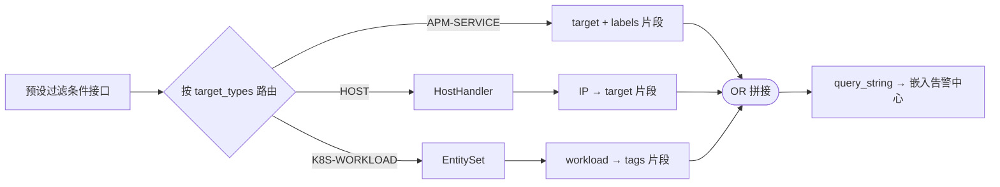

# 【告警中心】APM 应用/服务页面嵌入列表页支持 —— 实施方案

> 基于 [README.md](./README.md) 制定。

## 0x01 实现方案

### a. 预设过滤条件生成



**应用视角**（不传 `service_name`，不支持 `target_types`）：

```text
target: "{app_name}:.+" OR labels: "APM-APP({app_name})"
```

**服务视角**（传 `service_name`，按 `target_types` 组合，各部分 OR 拼接）：

| target_type | 过滤规则 | 数据来源 |
|-------------|---------|---------|
| APM-SERVICE | `target: "{app_name}:{service_name}" OR labels: ("APM-APP({app_name})" OR "APM-SERVICE({service_name})")` | 直接拼接 |
| HOST | `target: ("{ip1}\|{cloud_id1}" OR "{ip2}\|{cloud_id2}" OR ...)` | `HostHandler.list_application_hosts` |
| K8S-WORKLOAD | `(tags.bcs_cluster_id: "{c1}" AND tags.workload_kind: "{k1}" AND tags.workload_name: "{n1}") OR (...)` | `EntitySet.get_workloads` |

**时间范围限制**（HOST / K8S-WORKLOAD）：超过 2 小时取 `[end_time - 2h, end_time]`。

### b. 已关联策略


- 请求 `FetchItemStatus`：`metric_ids=[]`，`labels=["APM-APP({app_name})", "APM-SERVICE({service_name})"]`
- 跳转策略列表页：`conditions=[{"key": "label_name", "value": ["/APM-SERVICE({service_name})/"]}]`

### c. 代码变更

| 变更 | 文件 | 说明 |
|------|------|------|
| 标签常量收归 | `constants/apm.py` | `ApmAlertHelper` 新增 `APM_APP_LABEL_FORMAT` / `APM_SERVICE_LABEL_FORMAT` 及格式化方法 |
| 引用常量 | `apm_web/strategy/dispatch/builder.py` | `build()` 中替换硬编码字面量 |
| 容器关联下沉 | `apm_web/strategy/dispatch/` | 新增工具函数封装 `EntitySet.get_workloads`，供新接口调用 |
| 新增接口 | `apm_web/strategy/views.py` | 预设过滤条件接口 |
| metric_ids 非必填 | `monitor_web/strategies/resources/public.py` | `FetchItemStatus.RequestSerializer` 中 `metric_ids` 改为 `required=False, default=[]` |

---

## 0x02 接口协议

### a. 获取告警预设过滤条件

#### 功能描述

获取 APM 应用/服务视角下的告警列表预设过滤条件，返回 Lucene query_string。

#### 请求参数

| 字段 | 类型 | 必选 | 描述 |
|------|------|------|------|
| bk_biz_id | int | 是 | 业务 ID |
| app_name | string | 是 | APM 应用名称 |
| service_name | string | 否 | APM 服务名称，传入时为服务视角，不传时为应用视角 |
| start_time | int | 否 | 开始时间（Unix 时间戳，秒），用于主机/容器关联查询 |
| end_time | int | 否 | 结束时间（Unix 时间戳，秒），用于主机/容器关联查询 |
| target_types | List[string] | 否 | 目标类型列表，可多选，仅服务视角可用 |

#### target_types 枚举值

| 枚举值 | 描述 |
|--------|------|
| APM-SERVICE | APM 服务告警 |
| HOST | 关联主机告警 |
| K8S-WORKLOAD | 关联容器告警（K8S 工作负载） |

#### 请求示例

**应用视角**：

```json
{
    "bk_biz_id": 2,
    "app_name": "trpc-cluster-access-demo"
}
```

**服务视角**：

```json
{
    "bk_biz_id": 2,
    "app_name": "trpc-cluster-access-demo",
    "service_name": "bkm.web",
    "start_time": 1773371700,
    "end_time": 1773372600,
    "target_types": ["APM-SERVICE", "HOST", "K8S-WORKLOAD"]
}
```

#### 响应参数

| 字段 | 类型 | 描述 |
|------|------|------|
| query_string | string | Lucene 格式的预设过滤条件 |

#### 响应示例

**应用视角**：

```json
{
    "result": true,
    "code": 200,
    "message": "OK",
    "data": {
        "query_string": "target: \"trpc-cluster-access-demo:.+\" OR labels: \"APM-APP(trpc-cluster-access-demo)\""
    }
}
```

**服务视角**：

```json
{
    "result": true,
    "code": 200,
    "message": "OK",
    "data": {
        "query_string": "target: \"trpc-cluster-access-demo:bkm.web\" OR labels: (\"APM-APP(trpc-cluster-access-demo)\" OR \"APM-SERVICE(bkm.web)\") OR target: (\"10.0.0.1|0\" OR \"10.0.0.2|0\") OR (tags.bcs_cluster_id: \"BCS-K8S-00000\" AND tags.workload_kind: \"Deployment\" AND tags.workload_name: \"bkm-web\")"
    }
}
```

#### 使用说明：跳转告警中心

前端嵌入告警中心页面时，将接口返回的 `query_string` 作为内置条件，与用户查询条件合并后跳转。

**拼接规则**：`{内置 query_string} AND ({用户查询条件})`

**示例**：

内置 query_string（接口返回）：

```text
target: "trpc-cluster-access-demo:bkm.web"
  OR labels: ("APM-APP(trpc-cluster-access-demo)" OR "APM-SERVICE(bkm.web)")
```

用户查询条件（conditions + query_string）：

```json
{
    "conditions": [
        {
            "key": "tags.bcs_cluster_id",
            "method": "eq",
            "value": ["BCS-K8S-00000"]
        },
        {
            "key": "tags.workload_kind",
            "method": "eq",
            "value": ["Deployment"]
        },
        {
            "key": "tags.workload_name",
            "method": "eq",
            "value": ["bkm-web"],
            "condition": "and"
        }
    ],
    "query_string": ""
}
```

生成跳转 query_string：

```text
(
  target: "trpc-cluster-access-demo:bkm.web"
    OR labels: ("APM-APP(trpc-cluster-access-demo)" OR "APM-SERVICE(bkm.web)")
)
AND
(
  tags.bcs_cluster_id: "BCS-K8S-00000"
    AND tags.workload_kind: "Deployment"
    AND tags.workload_name: "bkm-web"
)
```

### b. 获取已关联策略状态（FetchItemStatus 改造）

#### 功能描述

获取标签关联的策略数与告警数。改造点：`metric_ids` 改为非必填，支持仅基于 `labels` 过滤。

#### 请求参数

| 字段 | 类型 | 必选 | 描述 |
|------|------|------|------|
| bk_biz_id | int | 是 | 业务 ID |
| metric_ids | List[string] | 否 | 指标 ID 列表，为空时基于 labels 返回策略汇总 |
| labels | List[string] | 否 | 标签过滤列表 |

#### 请求示例

```json
{
    "bk_biz_id": 2,
    "metric_ids": [],
    "labels": ["APM-APP(trpc-cluster-access-demo)", "APM-SERVICE(bkm.web)"]
}
```

#### 响应参数（metric_ids 为空时）

| 字段 | 类型 | 描述 |
|------|------|------|
| strategy_count | int | 关联策略数 |
| alert_count | int | 未恢复告警数 |

#### 响应示例

```json
{
    "result": true,
    "code": 200,
    "message": "OK",
    "data": {
        "strategy_count": 12,
        "alert_count": 3
    }
}
```

#### 使用说明：跳转策略列表

点击「已关联 N 个告警策略」跳转策略列表页时，仅按 `APM-SERVICE` 标签过滤：

```json
{
    "conditions": [
        {
            "key": "label_name",
            "value": ["/APM-SERVICE(bkm.web)/"]
        }
    ]
}
```

---

## 0x03 参考

- `constants/alert.py`：`EventTargetType`、`K8STargetType`、`APMTargetType` 定义
- `constants/apm.py`：`ApmAlertHelper` 标签正则
- `apm_web/strategy/dispatch/builder.py`：策略 labels 构建
- `apm_web/handlers/host_handler.py`：`HostHandler.list_application_hosts`
- `apm_web/strategy/dispatch/entity.py`：`EntitySet.get_workloads`
- `monitor_web/strategies/resources/public.py`：`FetchItemStatus`

---

*制定日期：2026-03-19*
