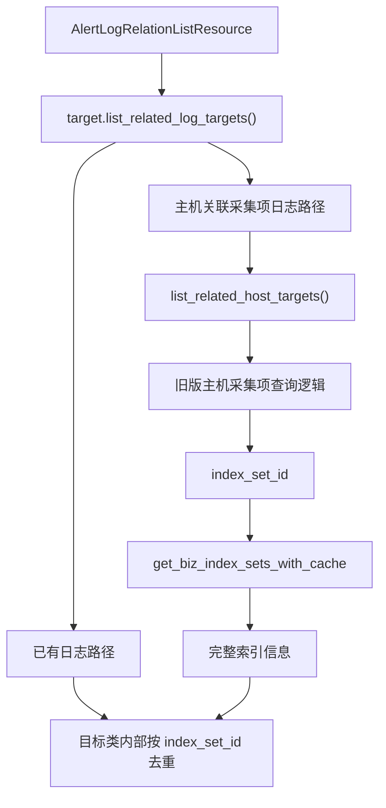

# 新版告警详情支持查看主机关联采集项日志 —— 实施方案

> 基于 [README.md](./README.md) 制定。

## 0x01 实现方案

### a. 思路

**Before**：旧版告警详情由前端根据主机维度调用 `listIndexByHost`
动态查询采集项日志索引，再决定是否展示日志入口。

**After**：新版告警详情继续沿用 `alert_log_relation_list`
作为统一日志入口，由后端在 `alert_v2` 目标聚合阶段把
“主机关联采集项日志”补齐并一并返回。

本期只做后端改造，不改前端。

关键变化：

- 旧版主机采集项查询逻辑继续复用，
  不重新实现 `listIndexByHost` 的核心能力。
- 新增命中的索引只关心 `index_set_id`，
  最终通过 `get_biz_index_sets_with_cache`
  补齐完整索引信息。
- 告警里的主机维度统一通过 `list_related_host_targets()`
  获取，不在日志聚合逻辑中自行拼装。
- 主机类告警和 K8S 类告警都在各自的目标对象内部完成去重收口。

### b. 查询链路



链路拆分如下：

- `HostTarget`：
  现有“关系图反查日志”路径保留，
  再补一路“主机关联采集项日志”。
- `BaseK8STarget`：
  现有 “K8S 关系日志 + APM 日志” 保留，
  再补一路“主机关联采集项日志”。

### c. 关键决策

| 决策 | 说明 |
|------|------|
| 无前端改动 | 日志面板继续消费 `alert_log_relation_list`，本期只扩展后端返回能力 |
| 直接复用旧逻辑 | 主机采集项查询直接依赖 `HostIndexQueryMixin`，避免复制旧实现 |
| 索引补全统一收口 | 主机采集项路径只负责产出 `index_set_id`，索引信息统一通过 `get_biz_index_sets_with_cache` 获取 |
| 主机来源统一 | `bk_host_id + ip + bk_cloud_id` 统一来自 `list_related_host_targets()` |
| 去重粒度固定 | 仅按 `index_set_id` 去重，不引入统一 merge 层和复杂字段合并 |

### d. 风险与约束

| 风险 / 约束 | 说明 |
|------|------|
| 旧逻辑必须稳定 | `listIndexByHost` 和旧版 scene view 行为不变 |
| 并发查询需兜底 | 多路或单 host 查询失败时，不能拖垮整次日志目标查询 |
| 结果优先级需固定 | 重复命中同一索引时，按目标类型内部既定顺序保留第一份结果 |

---

## 0x02 开发方案

### a. BaseTarget 基础能力

改动文件：`packages/fta_web/alert_v2/target.py`

这一层只补公共查询能力，不负责统一合并多路结果。

| 变更点 | 目标 |
|------|------|
| **[Property]** `_biz_index_set_map` | 基于 `get_biz_index_sets_with_cache` 构建 `index_set_id -> index_set_info` 映射 |
| **[Method]** `_query_host_collector_indexes` | 调用旧版主机采集项查询逻辑，返回补全后的索引信息列表 |
| **[Method]** `_list_related_host_log_targets` | 对多个 host target 并发执行主机采集项查询并汇总结果 |

约束：

- `_query_host_collector_indexes`
  只以 `index_set_id` 作为主查询结果。
- 索引名称、业务、附加字段都以
  `get_biz_index_sets_with_cache`
  返回的索引信息为准。
- 若 `host_target` 中存在 IP，则补充 `serverIp`
  过滤条件，保持与当前日志面板消费方式一致。

### b. HostTarget

改动文件：`packages/fta_web/alert_v2/target.py`

| 变更点 | 目标 |
|------|------|
| 保留现有关系图日志路径 | 不改变当前主机类告警的主链路行为 |
| `list_related_log_targets()` 新增 host collector 路径 | 将 `list_related_host_targets()` 返回的主机列表接入采集项日志查询 |
| 本地去重 | 在 `HostTarget` 内部按 `index_set_id` 去重，顺序固定为 `host_relation -> host_collector` |

### c. BaseK8STarget

改动文件：`packages/fta_web/alert_v2/target.py`

| 变更点 | 目标 |
|------|------|
| 保留 `_k8s_related_log_targets()` | 不影响当前 K8S 关系日志能力 |
| 保留 `_apm_related_log_targets()` | 不影响当前 APM 补充日志能力 |
| `list_related_log_targets()` 新增 host collector 路径 | 通过 `list_related_host_targets()` 反查 host，再补主机关联采集项日志 |
| 本地去重 | 在 `BaseK8STarget` 内部按 `index_set_id` 去重，顺序固定为 `k8s_relation -> host_collector -> apm_relation` |

### d. 多路并发骨架

参考 `packages/apm_web/strategy/views.py`
中的线程池用法，目标类内部按下面的方式组织多路取数与去重即可：

```python
with ThreadPool(3) as pool:
    futures = [
        pool.apply_async(self._k8s_related_log_targets),
        pool.apply_async(lambda: self._list_related_host_log_targets(host_targets)),
        pool.apply_async(self._apm_related_log_targets),
    ]

    result = []
    seen = set()
    for future in futures:
        for item in future.get() or []:
            index_set_id = item.get("index_set_id")
            if not index_set_id or index_set_id in seen:
                continue
            seen.add(index_set_id)
            result.append(item)
```

`HostTarget` 只是把三路缩减成两路，收口方式一致。

### e. 测试与验证

建议至少覆盖以下场景：

| 场景 | 预期 |
|------|------|
| Host 告警存在主机关联采集项 | 新版详情能返回对应索引 |
| K8S 告警可反查到 host target | 返回结果中补入 host collector 索引 |
| 关系图与 host collector 命中同一索引 | 最终结果只保留一份 |
| 单个 host 查询失败 | 其它 host 结果仍可返回 |
| 旧版 `listIndexByHost` 调用 | 行为保持不变 |

测试落点建议：

- `packages/fta_web/tests/alert/`
- `packages/monitor_web/alert_events/`
  相关旧逻辑回归测试

## 0x03 实施进展

| 时间 | 对应设计片段 | 结论调整概要 | 改动 / 验证 |
|------|----------------|----------------|-------------|
| `2026-04-15 18:43` | [1] 主机关联采集项日志后移到 `alert_v2`<br />[2] `HostTarget` 与 `BaseK8STarget` 各自收口去重 | [1] 直接复用旧版主机采集项查询逻辑<br />[2] 不改前端，不引入统一 merge 层 | [1] 新建 issue `README.md`<br />[2] 完成实施方案与索引同步 |

## 0x04 参考

- `packages/monitor_web/scene_view/resources/log.py`
- `packages/monitor_web/alert_events/resources/frontend_resource.py`
- `packages/fta_web/alert_v2/target.py`
- `packages/fta_web/alert_v2/resources.py`
- `packages/apm_web/strategy/views.py`
