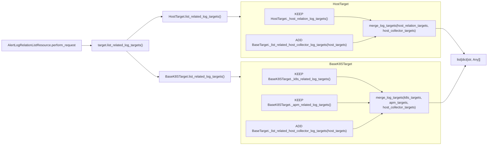

# 新版告警详情支持查看主机关联采集项日志 —— 实施方案

> 基于 [README.md](./README.md) 制定。

## 0x01 背景与约束

旧版告警详情通过 `ListIndexByHost` 查询主机关联采集项日志。

当前缺口在目标对象层：`HostTarget` 和 `BaseK8STarget` 未接入主机采集项索引，主机类告警和带主机维度的 K8S 告警无法返回这类日志。

约束：

- 不改前端协议和旧版接口。
- 不新增外部查询接口，复用 `HostIndexQueryMixin.query_indexes()`。
- 现有告警关联日志、APM 日志和主机关联采集项日志保持并列来源。
- 单个主机采集项查询失败时，仅忽略该主机的采集项日志。

## 0x02 架构设计

### a. 方案边界

本方案支持新版告警详情返回旧版 `ListIndexByHost` 可查到的主机关联采集项日志。

实现保持现有入口。`BaseTarget` 封装主机采集项查询和索引集补全。`HostTarget`、`BaseK8STarget` 在各自的
`list_related_log_targets()` 内接入该结果，并按来源优先级合并。

### b. 扩展结构


```mermaid
flowchart LR
    A["AlertLogRelationListResource.perform_request"] --> B["target.list_related_log_targets()"]

    B --> H["HostTarget.list_related_log_targets()"]
    B --> K["BaseK8STarget.list_related_log_targets()"]

    subgraph HostTargetPlan["HostTarget"]
        H1["KEEP HostTarget._host_relation_log_targets()"]
        H2["ADD BaseTarget._list_related_host_collector_log_targets(host_targets)"]
        H3["merge_log_targets(host_relation_targets, host_collector_targets)"]
        H1 --> H3
        H2 --> H3
    end

    subgraph K8STargetPlan["BaseK8STarget"]
        K1["KEEP BaseK8STarget._k8s_related_log_targets()"]
        K2["KEEP BaseK8STarget._apm_related_log_targets()"]
        K3["ADD BaseTarget._list_related_host_collector_log_targets(host_targets)"]
        K4["merge_log_targets(k8s_targets, apm_targets, host_collector_targets)"]
        K1 --> K4
        K2 --> K4
        K3 --> K4
    end

    H --> HostTargetPlan
    K --> K8STargetPlan
    H3 --> R["list[dict[str, Any]]"]
    K4 --> R
```

下图仅展示本期扩展点：`HostTarget` 和 `BaseK8STarget` 新增 host collector 日志来源，再按目标对象优先级合并。
现有告警关联日志、APM 日志和索引集补全的内部查询细节不纳入图中。

### c. 主机采集项查询协议

`BaseTarget._query_host_collector_log_targets(host_target)` 负责把 `host_target` 转成 `query_indexes()` 支持的主机标识，并补全命中的日志目标：

| 约束 | 规则 |
| --- | --- |
| 合法入参 | `bk_biz_id + bk_host_id`，或 `bk_biz_id + bk_host_innerip + bk_cloud_id` *[1]* |
| 入参不完整 | 返回空列表，防止 `HostIndexQueryMixin.query_indexes()` 抛错。 |
| 返回信息 | 仅使用 `infos[].index_set_id`，再从 `_biz_index_set_map[str(index_set_id)]` 获取索引集。 |

- *[1] `bk_cloud_id=0` 是合法值，校验时仅排除 `None`。*

## 0x03 开发方案

### a. BaseTarget 公共能力

改动文件：[<源码> bkmonitor/bkmonitor/packages/fta_web/alert_v2/target.py](https://github.com/TencentBlueKing/bk-monitor/blob/master/bkmonitor/packages/fta_web/alert_v2/target.py)

| 变更点 | 目标 |
| --- | --- |
| **[Add]** `BaseTarget._biz_index_set_map` | 基于 `get_biz_index_sets_with_cache()` 构建 `str(index_set_id) -> index_set_info` 映射。 |
| **[Add]** `BaseTarget._query_host_collector_log_targets(host_target)` | [a] 复用 `HostIndexQueryMixin.query_indexes()` 查询主机关联采集项索引，再补齐 `list[dict[str, Any]]` 返回项。<br />[b] 有 `bk_target_ip` 时增加 `{"field": "serverIp", "operator": "=", "value": [bk_target_ip]}` 作为过滤条件。 |
| **[Add]** `BaseTarget._list_related_host_collector_log_targets(host_targets)` | 对多个主机目标并发查询采集项日志，并按 `host_targets` 输入顺序汇总结果。 |
| **[Add]** `merge_log_targets(*target_groups)` | [a] 参数从左到右表示来源优先级。<br />[b] 当前按 `str(index_set_id)` 判重，保留最左侧来源。 |

#### `_list_related_host_collector_log_targets` 内并发请求

```python
pool = ThreadPool(min(len(host_targets), 8))
targets_iter: Iterable[list[dict[str, Any]]] = pool.imap_unordered(
    self._query_host_collector_log_targets,
    host_targets,
)
pool.close()

return merge_log_targets(*targets_iter)
```

### b. HostTarget 接入

改动文件：[<源码> bkmonitor/bkmonitor/packages/fta_web/alert_v2/target.py](https://github.com/TencentBlueKing/bk-monitor/blob/master/bkmonitor/packages/fta_web/alert_v2/target.py)

| 变更点 | 目标 |
| --- | --- |
| **[Add]** `HostTarget._host_relation_log_targets()` | 平移改造前的 `HostTarget.list_related_log_targets()` 逻辑，保留现有告警关联日志返回。 |
| **[Change]** `HostTarget.list_related_log_targets()` | [a] 保留顶层 `if not self._alert.event.ip: return []`，`event.ip` 为空时不查询两类日志。<br />[b] 前置判断通过后，并发执行 `HostTarget._host_relation_log_targets()` 和 `BaseTarget._list_related_host_collector_log_targets(...)`。 |
| **[Use]** `merge_log_targets(host_relation_targets, host_collector_targets)` | [a] 改造前：现有告警关联日志。<br />[b] 改造后：现有告警关联日志 > 主机关联采集项日志。 |

#### `HostTarget.list_related_log_targets`

```python
if not self._alert.event.ip:
    return []

host_targets = self.list_related_host_targets()

with ThreadPool(2) as pool:
    futures = [
        pool.apply_async(self._host_relation_log_targets),
        pool.apply_async(lambda: self._list_related_host_collector_log_targets(host_targets)),
    ]

    return merge_log_targets(*[future.get() or [] for future in futures])
```

### c. BaseK8STarget 接入

改动文件：[<源码> bkmonitor/bkmonitor/packages/fta_web/alert_v2/target.py](https://github.com/TencentBlueKing/bk-monitor/blob/master/bkmonitor/packages/fta_web/alert_v2/target.py)

| 变更点 | 目标 |
| --- | --- |
| **[Change]** `BaseK8STarget.list_related_log_targets()` | 线程池从 `2` 路扩展为 `3` 路，新增主机关联采集项日志查询。 |
| **[Use]** `merge_log_targets(k8s_targets, apm_targets, host_collector_targets)` | [a] 改造前：K8S 关联日志 > APM 日志。<br />[b] 改造后：K8S 关联日志 > APM 日志 > 主机关联采集项日志。 |

#### `BaseK8STarget.list_related_log_targets`

```python
host_targets = self.list_related_host_targets()

with ThreadPool(3) as pool:
    futures = [
        pool.apply_async(self._k8s_related_log_targets),
        pool.apply_async(self._apm_related_log_targets),
        pool.apply_async(lambda: self._list_related_host_collector_log_targets(host_targets)),
    ]

    return merge_log_targets(*[future.get() or [] for future in futures])
```

## 0x04 验收与验证

### a. 测试补充

测试文件：[<源码> bkmonitor/bkmonitor/packages/fta_web/tests/alert_v2/test_target.py](https://github.com/TencentBlueKing/bk-monitor/blob/master/bkmonitor/packages/fta_web/tests/alert_v2/test_target.py)

| 测试函数 | 断言重点 |
| --- | --- |
| `test_host_target_adds_host_collector_logs` | `HostTarget` 返回现有告警关联日志和主机采集项日志，采集项日志通过 `get_biz_index_sets_with_cache()` 补齐。 |
| `test_host_target_deduplicates_relation_before_collector` | 现有告警关联日志与采集项命中同一 `index_set_id` 时，保留现有告警关联日志。 |
| `test_host_target_skips_log_targets_without_event_ip` | `event.ip` 为空时，`HostTarget` 不查询现有告警关联日志和主机关联采集项日志。 |
| `test_host_collector_falls_back_to_ip_and_cloud_id_zero` | 缺少 `bk_host_id` 时使用 `bk_target_ip + bk_cloud_id` 查询，且 `bk_cloud_id=0` 不被误判为空。 |
| `test_k8s_target_merges_k8s_apm_and_collector_logs_in_priority` | `BaseK8STarget` 按 `k8s_relation -> apm_relation -> host_collector` 优先级合并并去重。 |
| `test_host_collector_query_failure_does_not_break_log_targets` | 单个主机采集项查询失败时，其它日志来源仍正常返回。 |
| `test_merge_log_targets_keeps_highest_priority_group` | 公共合并函数按参数优先级保留最高优先级来源。 |

### b. 回归命令

```bash
pytest packages/fta_web/tests/alert_v2/test_target.py
```

若实现改动触及旧版主机采集项查询或接口序列化，再补充旧版接口回归测试。
本方案默认不触碰旧版接口。

## 0x05 实施进展

| 时间 | 结论性进展 |
| --- | --- |
| `2026-06-27 12:00` | [a] 按功能负责人反馈二次修订方案，源码路径改为官方仓库链接，架构图改用真实代码结构承接。<br />[b] 将 `_query_host_collector_log_targets(host_target)` 职责调整为查询协议，并根据多 Agent 评分补齐 `bk_cloud_id=0`、`addition` 初始化、去重类型归一和 fallback 测试。 |
| `2026-06-27 11:00` | 重写方案结构：明确 `HostTarget`、`BaseK8STarget` 的主机关联采集项日志接入方式、来源优先级、失败隔离和测试落点。 |
| `2026-04-15 18:00` | 初版方案确定后端接入方向：不改前端，复用旧版 `HostIndexQueryMixin`，在 `alert_v2` 内补齐主机关联采集项日志。 |

## 0x06 参考 & 版本锚点

### a. 参考

- [<源码> bkmonitor/bkmonitor/packages/fta_web/alert_v2/resources.py](https://github.com/TencentBlueKing/bk-monitor/blob/master/bkmonitor/packages/fta_web/alert_v2/resources.py)
- [<源码> bkmonitor/bkmonitor/packages/fta_web/alert_v2/target.py](https://github.com/TencentBlueKing/bk-monitor/blob/master/bkmonitor/packages/fta_web/alert_v2/target.py)
- [<源码> bkmonitor/bkmonitor/packages/monitor_web/scene_view/resources/log.py](https://github.com/TencentBlueKing/bk-monitor/blob/master/bkmonitor/packages/monitor_web/scene_view/resources/log.py)
- [<源码> bkmonitor/bkmonitor/packages/monitor_web/alert_events/resources/frontend_resource.py](https://github.com/TencentBlueKing/bk-monitor/blob/master/bkmonitor/packages/monitor_web/alert_events/resources/frontend_resource.py)
- [<源码> bkmonitor/bkmonitor/packages/apm_web/log/resources.py](https://github.com/TencentBlueKing/bk-monitor/blob/master/bkmonitor/packages/apm_web/log/resources.py)
- [<源码> bkmonitor/bkmonitor/packages/apm_web/handlers/log_handler.py](https://github.com/TencentBlueKing/bk-monitor/blob/master/bkmonitor/packages/apm_web/handlers/log_handler.py)
- [<源码> bkmonitor/bkmonitor/packages/fta_web/tests/alert_v2/test_target.py](https://github.com/TencentBlueKing/bk-monitor/blob/master/bkmonitor/packages/fta_web/tests/alert_v2/test_target.py)

### b. 版本锚点

| 状态 | 分支 | 里程碑 | PR |
| --- | --- | --- | --- |
| 🔄 | `<branch_name>` | 里程碑 1：`alert_v2` 主机关联采集项日志聚合 | 待创建 |
