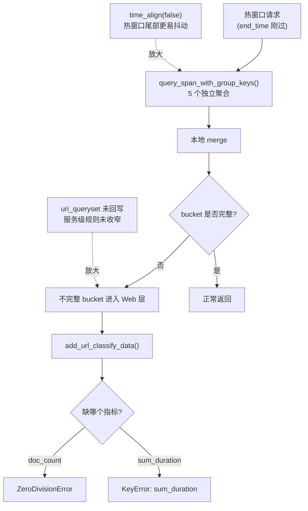

# 优化 APM 接口统计偶现查询报错 —— 实施方案

> 基于 [README.md](./README.md) 制定。

## 0x01 现象复盘

### a. 复盘结论

- 这不是两个独立 bug，而是同一接口在热窗口尾部拿到不完整 bucket 后，被 Web 层直接消费所呈现出的两类失败形态。

### b. 证据分组

| 分组 | 代表样本 | 热窗口位置 | 直接表现 | 归类 |
| --- | --- | --- | --- | --- |
| A 类 | `6f2e515adc16f7fd0bfe6dc027602e70` | `end_time + 3s` | `ZeroDivisionError` | 缺 `doc_count` 的不完整 bucket 被继续消费 |
| B 类 | `7eaec8affe8e3491fd175ecb44580bdc` | `end_time + 0.22s` | `KeyError: 'sum_duration'` | 缺 `sum_duration` 的不完整 bucket 被继续消费 |
| 对照组 | `eeaa1bf235407915c8cb038c62e854a1` | 同窗口 `+20m32s` 重试 | 正常返回 | 数据沉淀后 bucket 完整 |

### c. 共同判断

- `query_apm_span` 与下游聚合请求整体成功，失败点位于 `packages/apm_web/meta/resources.py:add_url_classify_data`。
- 两类报错只是“不完整 bucket 进入 Web 层消费”的不同外显。
- 触发前提是请求打在 `end_time` 附近的热窗口尾部。

## 0x02 根因链路

### a. 主链路

### b. 关键判断

- 主因是 `query_span_with_group_keys()` 先做 `5` 个独立聚合，再做本地 merge，但不会在出口校验 bucket 是否完整。*[b]*
- `doc_count` 缺失会落到 `ZeroDivisionError`，`sum_duration` 缺失会落到 `KeyError`，两者是同一根因的不同症状。*[a]*
- endpoint 统计的接口报错来自 Web 层消费了不完整 bucket，而不是上游查询整体失败。*[a]*

### c. 放大项

- `time_align(False)` 让热窗口尾部更容易出现聚合抖动，它是触发背景，不是独立根因。*[c]* *[d]*
- `uri_queryset.filter(service_name=service_name)` 没有回写，服务级 URI 规则未收窄，会扩大异常 bucket 的命中面。*[a]*

## 0x03 方案主干

### a. 方案分层

| 层次 | 落点 | 处理规则 | 目的 |
| --- | --- | --- | --- |
| 主修复 | `query_span_with_group_keys()` 出口 | merge 后统一过滤缺指标 bucket | 只向上游返回完整且自洽的 bucket contract |
| 消费侧保护 | `add_url_classify_data()` | 仅保留 `request_count <= 0` 的算术保护 | 避免 URL 归类计算落入零分母 |
| 旁路修正 | URI 规则过滤 | 回写 `service_name` 过滤结果 | 收窄异常 bucket 的命中面 |
| 热窗口口径 | 结果解释 | 接受保守返回，不要求与沉淀后逐项完全一致 | 避免把数据成熟度差异误判为接口错误 |

### b. 执行原则

- 必要指标集合固定为 `doc_count`、`avg_duration`、`max_duration`、`min_duration`、`sum_duration`。
- 指标完整性规则从聚合方法集合单一派生，不再维护第二份等价指标枚举。
- 任一 bucket 只要缺少其中任意指标，就在返回上层前直接过滤掉。
- 过滤动作要记录日志，至少包含固定事件名、过滤数量与样例 group key，便于检索与热窗口排查。
- 过滤要发生在排序、分页与 URL 归类之前，避免脏 bucket 继续向上游扩散。
- Web 层按 API contract 直接消费 bucket，不重复维护“缺指标 bucket”判定规则。
- Web 层只保留与本地计算直接相关的算术保护，不再承担 bucket 完整性治理。

## 0x04 开发方案

| 文件 | 场景 | 变更点 | 说明 |
| ---- | ---- | ---- | ---- |
| `apm/models/datasource.py` | endpoint 分组统计 | 在 merge 后统一校验 bucket 完整性并过滤缺指标 bucket | 阻断不完整 bucket 向 Web 层扩散 |
| `packages/apm_web/meta/resources.py` | URL 归类 | 保留 `request_count <= 0` 算术保护 修正 `uri_queryset` 服务级过滤回写 | 按 API contract 消费 bucket，并收窄 URI 作用域 |
| `packages/apm_web/tests/` 与 `apm/tests/` | 回归验证 | 增加缺 `doc_count`、缺 `sum_duration`、服务级 URI 过滤、无效 bucket 不抛错等测试 | 覆盖两类报错症状与兜底逻辑 |

## 0x05 验证与风险

### a. 验收与回归

| 维度 | 通过标准 |
| --- | --- |
| 错误表现 | 同一接口在热时间窗口内不再出现 `division by zero` 或 `KeyError: 'sum_duration'` |
| 返回约束 | 返回给 Web 层的 bucket 必须同时带有 `doc_count`、`avg_duration`、`max_duration`、`min_duration`、`sum_duration` |
| 归类约束 | HTTP URL 归类不再依赖缺失指标 bucket，且 `service_name` 只使用本服务生效的 URI 规则 |
| 用例覆盖 | [1] 热窗口下缺 `doc_count` 的回归样例 [2] 热窗口下缺 `sum_duration` 的回归样例 [3] URL 归类在 `request_count <= 0` 时不抛错 [4] 服务级 URI 规则过滤生效 |

### b. 风险与约束

| 风险 | 影响 | 应对 |
| ---- | ---- | ---- |
| 过滤策略会让热窗口结果更保守 | 热窗口结果可能少于数据沉淀后 | 接受保守返回，重点保证不报错且结果自洽 |
| 过滤后 `request_count` 口径变化影响排序 | 可能影响 endpoint 默认排序结果 | 回归 `request_count` 与 `average` 的排序行为 |
| API contract 与消费层语义脱节 | 后续若有人在 Web 层重加缺桶判定，容易形成双份规则 | 保持 bucket 完整性只在数据源出口治理，并在方案中显式固化边界 |

## 0x06 实施进展

| 时间 | 对应设计片段 | 结论调整概要 | 改动 / 验证 |
| ---- | ---- | ---- | ---- |
| `2026-04-21 17:20` | `0x01` `0x02` `0x03` `0x04` | [1] 收敛有效结论为“不完整 bucket 进入 Web 层消费” [2] 将主修复稳定为“merge 后统一过滤缺指标 bucket” [3] 将主干重排为分层方案与文件级改造两层结构 | [1] 已完成新增 Trace 取证与本地代码链路梳理 [2] 代码尚未实施 |
| `2026-04-21 21:00` | `0x03` `0x04` `0x05` | [1] 数据源出口已实现缺指标 bucket 过滤并收敛为唯一治理入口 [2] 指标完整性规则已改为从聚合方法集合单一派生，避免双份枚举漂移 [3] Web 层已去除重复缺桶判定，仅保留归类算术保护与 `service_name` 过滤回写 [4] 过滤与跳过日志已统一为固定事件名 + `key=value` 格式 | [1] 已完成 `apm/models/datasource.py` 与 `packages/apm_web/meta/resources.py` 实现收敛 [2] 已通过 `python3 -m py_compile` 与 `git diff --check` [3] 按本轮要求未新增测试，已完成 PLAN 自审 |

## 0x07 参考

- *[a]* `packages/apm_web/meta/resources.py`
- *[b]* `apm/models/datasource.py`
- *[c]* `apm/core/handlers/query/base.py`
- *[d]* `bkmonitor/data_source/unify_query/builder.py`
- *[e]* 异常 Trace `6f2e515adc16f7fd0bfe6dc027602e70`
- *[f]* 异常 Trace `7eaec8affe8e3491fd175ecb44580bdc`
- *[g]* 正常 Trace `eeaa1bf235407915c8cb038c62e854a1`

## 0x08 版本锚点

- 分支：`feat/apm_trace/#1010158081133712449`
- PR：`待定`
