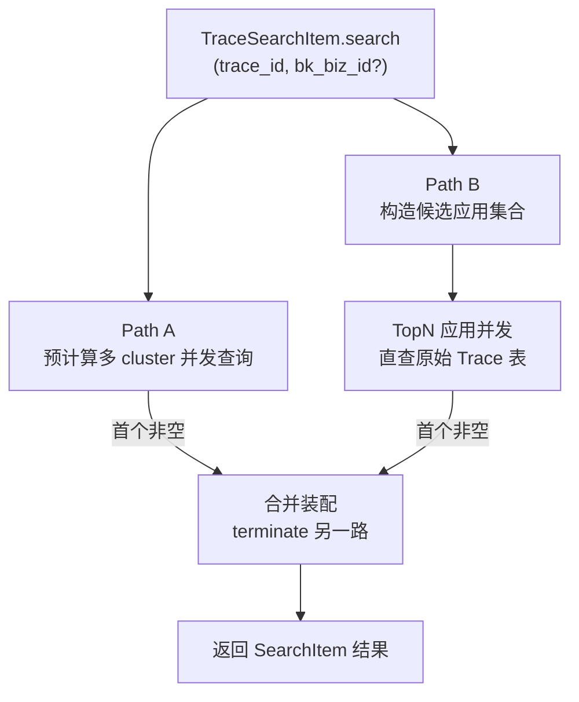

# 优化首页 TraceID 全局搜索的预计算延迟 —— 实施方案

> 基于 [README.md](./README.md) 制定。

## 0x01 调研与约束

### a. 关键事实

- 预计算结果表为租户级共享，单次查询天然覆盖全租户，但写入有分钟级延迟。
- 原始 Trace 数据按应用粒度落表（`Application.trace_result_table_id`），数据落库即可查，但单表只覆盖一个应用。
- `UserConfig.FUNCTION_ACCESS_RECORD` 中 `apm_service` 段已记录用户最近访问的 `application_id`、`service_name` 与频次，可直接用作"最近访问"信号。
- `Application.service_count` 由定时任务刷新，可作为"应用规模"的稳定信号。

### b. 关键决策

| 决策点 | 结论 | 理由 |
| --- | --- | --- |
| 预计算与直查关系 | 并行竞速，先非空者赢 | 预计算覆盖老数据广度，直查覆盖延迟期，互补不替代 |
| 候选业务范围 | 当前业务、默认业务、最近访问业务三类去重并集 | 兼顾用户主场景，避免拉全量业务造成雪崩 |
| 应用权限过滤 | 不前置过滤，命中后由前端跳转时处理 | 与现状一致，简化实现，避免无 IAM 的高频损耗 |
| 候选应用规模 | TopN 默认 `15`，并发查询 | 与现有预计算多 cluster 并发量级一致 |
| 直查时间窗口 | 近 `7d` | 与预计算路径对齐，便于结果合并语义统一 |

### c. 边界与风险

- `bk_biz_id` 入参缺省时跳过"当前业务"来源，仅用默认与最近访问。
- 三类业务去重时同一业务多次出现要累加权重，不重复占 TopN 槽位。
- `Application` 查询必须带 `bk_tenant_id`。
- 直查的 `trace_id__eq` 必须配合 `time_field=OtlpKey.END_TIME`，否则会与预计算字段语义混淆。
- `service_count` 与访问次数量纲差异大，必须先 `log1p` 归一再加权。

## 0x02 方案主干

### a. 双轨竞速结构



两路路径共享同一份"首个非空即结束"的竞速通道，互相不依赖。

### b. 候选应用打分

候选业务按来源赋权重，当前业务 `w_biz=3`、默认业务 `w_biz=2`、最近访问业务 `w_biz=1`，同一业务在多来源命中时权重累加。

应用最终打分：

```text
score = w_biz + α * log1p(service_count) + β * log1p(recent_access_count)
```

| 项 | 取值 / 来源 |
| --- | --- |
| `recent_access_count` | `FUNCTION_ACCESS_RECORD.apm_service` 中按 `application_id` 聚合的访问条数 |
| `α` | `1.0`，首版固化为类常量 |
| `β` | `1.5`，首版固化为类常量 |
| 稳定排序 | 同分按 `Application.application_id` 升序 |

### c. 直查协议契约

直查复用 `BK_APM` 数据源构造，关键差异点：

| 字段 | 预计算路径 | 直查路径 |
| --- | --- | --- |
| `table_id` | `DataLink.pre_calculate_config.cluster[*].table_name` | `Application.trace_result_table_id` |
| `time_field` | `PreCalculateSpecificField.MIN_START_TIME` | `OtlpKey.END_TIME` |
| `filter` | `trace_id__eq` | `trace_id__eq` |
| `values` | `BIZ_ID`、`APP_NAME` | `trace_id`（仅判存在） |
| `limit` | `5` | `1` |
| `time_range` | 近 `7d` | 近 `7d` |

直查命中后，`bk_biz_id`、`app_name`、`application_id` 由调用侧的 `Application` 实例直接提供，不依赖查询返回值。

### d. 并发与超时

- 直查使用一个 TopN 上限的 `ThreadPool`，`imap_unordered` 拉取首个非空结果后 `pool.terminate()`。
- 双轨竞速使用一个独立 `ThreadPool(2)` 启动 Path A、Path B，首个非空提前 `terminate` 另一路。
- 总体超时沿用 `Searcher.search` 单 item `5s` 上限，TraceSearchItem 内部不再叠加。
- 任一路径异常仅 `logger.exception`，不向上抛错。

### e. 不变量

- 预计算路径行为与现状完全一致，可独立回退。
- 直查 miss 不影响预计算返回。
- 输出 item 的字段集合与现有 `TraceSearchItem.search` 完全相同。
- 候选业务集合在 `bk_biz_id` 缺省、`DEFAULT_BIZ_ID` 缺省、无最近访问记录时退化为空集，此时 Path B 直接返回空，不抛错。

## 0x03 开发方案

### a. 文件级落点

#### `packages/monitor_web/overview/views.py`

| 入口 | 职责 |
| --- | --- |
| `SearchSerializer` | 增加 `bk_biz_id = IntegerField(required=False, allow_null=True)` |
| `SearchViewSet.list` | 透传 `bk_biz_id` 到 `Searcher` |

#### `packages/monitor_web/overview/search.py` · 调度层

| 入口 | 职责 |
| --- | --- |
| `SearchItem.search` 抽象 | 签名扩展 `bk_biz_id: int \| None = None`，其它子类忽略即可 |
| `Searcher.search` | 透传 `bk_biz_id` 到各 `SearchItem.search` |

#### `packages/monitor_web/overview/search.py` · `TraceSearchItem`

| 入口 | 职责 |
| --- | --- |
| `search` | 启动双路、选首个非空、装配输出 |
| `_collect_candidate_apps` | 收集候选业务（入参 + 默认 + 最近访问）、应用加权打分、截取 TopN |
| `_query_raw_apps_by_trace_id` | 直查单应用 `trace_result_table_id`，`limit=1` 仅判存在 |
| `_query_precalc_apps_by_trace_id` | 多 cluster 并发查询预计算表，由 `_query_apps_by_trace_id` 重命名，逻辑不变 |

### b. 候选应用收集步骤

1. 拼接候选业务集合 `biz_weight: dict[int, int]`，按上文权重累加。
2. 取最近访问记录：`UserConfig(username, FUNCTION_ACCESS_RECORD).value["apm_service"]`，聚合得到 `application_id -> count`。
3. 单次 `Application.objects.filter(bk_tenant_id=..., bk_biz_id__in=biz_weight.keys())` 拉取候选应用。
4. 对每个应用：
   - 取所属业务最高 `w_biz`。
   - 计算 `score = w_biz + α * log1p(service_count) + β * log1p(access_count.get(app.application_id, 0))`。
5. 按 `score` 降序、`application_id` 升序，截取前 TopN。

### c. 类常量

| 常量 | 默认值 | 说明 |
| --- | --- | --- |
| `RAW_QUERY_TOP_N` | `15` | 直查应用上限 |
| `RAW_QUERY_LOOKBACK_DAYS` | `7` | 直查回溯窗口 |
| `BIZ_WEIGHT_CURRENT` | `3` | 当前业务权重 |
| `BIZ_WEIGHT_DEFAULT` | `2` | 默认业务权重 |
| `BIZ_WEIGHT_RECENT` | `1` | 最近访问业务权重 |
| `SERVICE_COUNT_FACTOR` | `1.0` | `α` |
| `ACCESS_COUNT_FACTOR` | `1.5` | `β` |

## 0x04 实施进展

| 时间 | 对应设计片段 | 结论调整概要 | 改动 / 验证 |
| --- | --- | --- | --- |
| `2026-05-02 21:00` | `0x02.a` `0x02.b` | [1] 确认双轨并行竞速结构<br />[2] 候选应用不前置权限过滤<br />[3] 加权采用 `log1p` 归一 | [1] PLAN 主干落地<br />[2] 待开发与回归 |

## 0x05 参考

- `<源码> bk-monitor/bkmonitor/packages/monitor_web/overview/search.py`
- `<源码> bk-monitor/bkmonitor/packages/monitor_web/overview/views.py`
- `<源码> bk-monitor/bkmonitor/packages/monitor_web/overview/resources.py`
- `<源码> bk-monitor/bkmonitor/packages/apm_web/models/application.py`
- `<源码> bk-monitor/bkmonitor/packages/apm_web/handlers/db_handler.py`
- `<源码> bk-monitor/bkmonitor/packages/monitor/models/models.py`

## 0x06 版本锚点

- 分支：`feat/260502_overview-trace-low-latency`
- PR：待开
