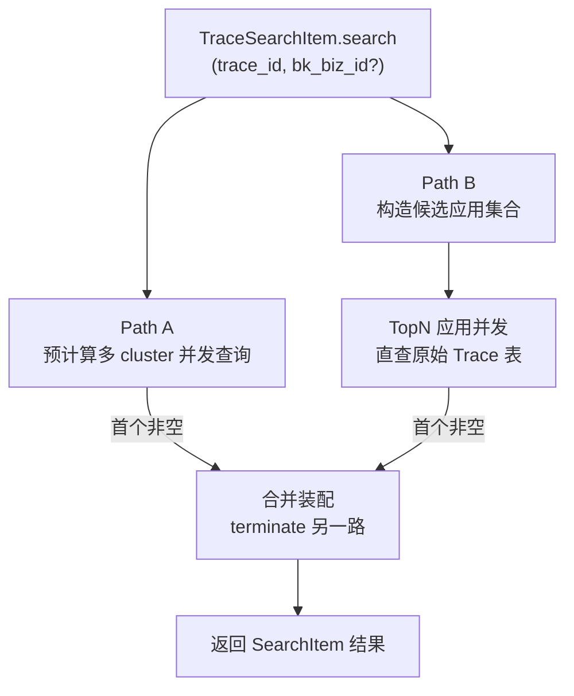

# 优化首页 TraceID 全局搜索的预计算延迟 —— 实施方案

> 基于 [README.md](./README.md) 制定。

## 0x01 调研与约束

### a. 关键事实

- 预计算结果表为租户级共享，单次查询天然覆盖全租户，但写入有分钟级延迟。
- 原始 Trace 数据按应用粒度落表（`Application.trace_result_table_id`），数据落库即可查，但单表只覆盖一个应用。
- `apm_web.models.UserVisitRecord` 由 `user_visit_record` 装饰器写入，覆盖 service_list / service_detail / trace_list 等 view。
- 按 `(bk_biz_id, app_name)` 聚合可得到用户的"应用访问次数"，`created_by` 与 `created_at` 均有索引。
- `Application` 模型按 `(bk_tenant_id, bk_biz_id)` 过滤即可拉到候选，配合 `exclude(trace_result_table_id="")` 排除空表。

### b. 关键决策

| 决策点 | 结论 | 理由 |
| --- | --- | --- |
| 预计算与直查关系 | 并行竞速，先非空者赢 | 预计算覆盖老数据广度，直查覆盖延迟期，互补不替代 |
| 候选业务范围 | 当前业务、默认业务、`UserVisitRecord` 出现的业务三类去重并集 | 兼顾用户主场景，避免拉全量业务造成雪崩 |
| 访问数据源 | `UserVisitRecord`，废弃 `FUNCTION_ACCESS_RECORD.apm_service` | 后者是服务访问记录而非应用访问，与 Trace 检索语义不匹配 |
| 应用权限过滤 | 不前置过滤，命中后由前端跳转时处理 | 与现状一致，简化实现，避免无 IAM 的高频损耗 |
| 候选应用规模 | TopN 默认 `15`，并发查询 | 与现有预计算多 cluster 并发量级一致 |
| 直查时间窗口 | 近 `7d` | 与预计算路径对齐，便于结果合并语义统一 |

### c. 边界与风险

- `bk_biz_id` 入参缺省时跳过"当前业务"来源，仅用默认业务与访问过的业务。
- 候选业务去重并集后才作为 ORM `bk_biz_id__in` 输入，避免重复扫描。
- `Application` 查询必须带 `bk_tenant_id`。
- 直查的 `trace_id__eq` 必须配合 `time_field=OtlpKey.END_TIME`，否则会与预计算字段语义混淆。
- `UserVisitRecord` 访问次数可达数百次，必须 `log1p` 归一压扁高频段，避免极端用户的常用应用碾压业务意图。

## 0x02 方案主干

### a. 双轨竞速结构



两路路径共享同一份"首个非空即结束"的竞速通道，互相不依赖。

### b. 候选应用打分

按"访问过 / 未访问"分层赋分，访问过的层在排序上恒定优于未访问层：

```text
score = APP_WEIGHT_CURRENT + log1p(visit)                            if visit > 0
      = BIZ_WEIGHT_CURRENT * is_current + BIZ_WEIGHT_DEFAULT * is_default  otherwise
```

| 常量 | 值 | 作用 |
| --- | --- | --- |
| `BIZ_WEIGHT_CURRENT` | `1` | 未访问层：当前业务加分 |
| `BIZ_WEIGHT_DEFAULT` | `1` | 未访问层：默认业务加分 |
| `APP_WEIGHT_CURRENT` | `BIZ_WEIGHT_CURRENT + BIZ_WEIGHT_DEFAULT = 2` | 访问过层基础分，确保 ≥ 未访问层最大值（`1 + 1` 同时命中也只能 1）|

**关键不变量**：访问过的最低分 `2 + log1p(1) ≈ 2.69` > 未访问的最高分 `1`，分层严格保序。

**排序规则**：访问过按 `log1p(visit)` 排序，未访问按业务来源排序，同分按 `application_id` 升序。

对照（典型场景）：

| 应用 | visit | 业务 | score |
| --- | --- | --- | --- |
| 任意应用 | 100 | 任意 | `2 + 4.62 ≈ 6.62` |
| 任意应用 | 1 | 任意 | `2 + 0.69 ≈ 2.69` |
| 未访问 | 0 | 当前 / 默认 | `1` |
| 未访问 | 0 | 其他 | `0` |

### c. 直查协议契约

直查复用 `BK_APM` 数据源构造，关键差异点：

| 字段 | 预计算路径 | 直查路径 |
| --- | --- | --- |
| `table_id` | `DataLink.pre_calculate_config.cluster[*].table_name` | `Application.trace_result_table_id` |
| `time_field` | `PreCalculateSpecificField.MIN_START_TIME` | `OtlpKey.END_TIME` |
| `filter` | `trace_id__eq` | `trace_id__eq` |
| `values` | `BIZ_ID`、`APP_NAME` | `trace_id`（仅判存在） |
| `limit` | `5` | `1` |
| `time_range` | 近 `7d` | 近 `7d` |

直查命中后，`bk_biz_id`、`app_name`、`application_id` 由调用侧的 `Application` 实例直接提供，不依赖查询返回值。

### d. 并发与超时

- 直查使用一个 TopN 上限的 `ThreadPool`，`imap_unordered` 拉取首个非空结果后 `pool.terminate()`。
- 双轨竞速使用一个独立 `ThreadPool(2)` 启动 Path A、Path B，首个非空提前 `terminate` 另一路。
- 总体超时沿用 `Searcher.search` 单 item `5s` 上限，TraceSearchItem 内部不再叠加。
- 任一路径异常仅 `logger.exception`，不向上抛错。

### e. 不变量

- 预计算路径行为与现状完全一致，可独立回退。
- 直查 miss 不影响预计算返回。
- 输出 item 的字段集合与现有 `TraceSearchItem.search` 完全相同。
- 候选业务集合在 `bk_biz_id` 缺省、`DEFAULT_BIZ_ID` 缺省、`UserVisitRecord` 无记录时退化为空集，此时 Path B 直接返回空，不抛错。

## 0x03 开发方案

### a. 文件级落点

#### `packages/monitor_web/overview/views.py`

| 入口 | 职责 |
| --- | --- |
| `SearchSerializer` | 增加 `bk_biz_id = IntegerField(required=False, allow_null=True)` |
| `SearchViewSet.list` | 透传 `bk_biz_id` 到 `Searcher` |

#### `packages/monitor_web/overview/search.py` · 调度层

| 入口 | 职责 |
| --- | --- |
| `SearchItem.search` 抽象 | 签名扩展 `bk_biz_id: int \| None = None`，其它子类忽略即可 |
| `Searcher.search` | 透传 `bk_biz_id` 到各 `SearchItem.search` |

#### `packages/monitor_web/overview/search.py` · `TraceSearchItem`

| 入口 | 职责 |
| --- | --- |
| `search` | 启动双路、选首个非空、装配输出 |
| `_aggregate_user_visits` | 单次 GROUP BY 查询 `UserVisitRecord`，输出 `(bk_biz_id, app_name) → count` |
| `_collect_candidate_apps` | 候选业务并集（当前 ∪ 默认 ∪ 访问过） → 全量应用 → 统一打分截 TopN |
| `_query_raw_apps_by_trace_id` | 直查单应用 `trace_result_table_id`，`limit=1` 仅判存在 |
| `_query_precalc_apps_by_trace_id` | 多 cluster 并发查询预计算表，由 `_query_apps_by_trace_id` 重命名，逻辑不变 |

### b. 候选应用收集步骤

1. 聚合最近 30 天访问次数：`_aggregate_user_visits(username) → dict[(bk_biz_id, app_name), int]`。
2. 候选业务并集：`biz_ids = {visit.keys 的业务} ∪ {current?} ∪ {default?}`。
3. 单次 `Application.objects.filter(bk_tenant_id=..., bk_biz_id__in=biz_ids).exclude(trace_result_table_id="")` 拉取候选应用。
4. 对每个应用计算 `score = access_score(visit) + biz_boost(app)`（公式见 `0x02.b`）。
5. 按 `score` 降序、`application_id` 升序，截取前 TopN。

### c. 类常量

| 常量 | 默认值 | 说明 |
| --- | --- | --- |
| `RAW_QUERY_TOP_N` | `15` | 直查应用上限 |
| `BIZ_WEIGHT_CURRENT` | `1` | 未访问层：当前业务加分 |
| `BIZ_WEIGHT_DEFAULT` | `1` | 未访问层：默认业务加分 |
| `APP_WEIGHT_CURRENT` | `2.0` | 访问过层基础分（`= BIZ_WEIGHT_CURRENT + BIZ_WEIGHT_DEFAULT`，派生不可独立调） |

## 0x04 实施进展

| 日期 | 对应设计片段 | 结论概要 | 改动 / 验证 |
| --- | --- | --- | --- |
| `2026-05-02` | `0x02.a` `0x02.b` | PLAN 主干定稿：双轨并行竞速、候选应用不前置权限过滤、`log1p` 归一加权 | 待开发 |
| `2026-05-03` | `0x01` `0x02` `0x03` | 落地与迭代<br />[1] 首版双轨竞速 + 直查通道 + `views.py` 透传 `bk_biz_id`<br />[2] 抽 `_first_truthy_concurrent` / `_safe_call` 实现路径级隔离与并发收敛<br />[3] 访问数据源切换到 `UserVisitRecord`，废弃 `FUNCTION_ACCESS_RECORD.apm_service`，删"权限保底"维度<br />[4] 打分公式定型为"分层"——访问过看 `log1p(visit)`，未访问看业务来源（commit `4c0614d5`） | [1] `ruff` / `basedpyright` 通过<br />[2] `bk_biz_id = 2` 调试残留待清理<br />[3] 待补单测与端到端回归 |

## 0x05 参考

- `<源码> bk-monitor/bkmonitor/packages/monitor_web/overview/search.py`
- `<源码> bk-monitor/bkmonitor/packages/monitor_web/overview/views.py`
- `<源码> bk-monitor/bkmonitor/packages/monitor_web/overview/resources.py`
- `<源码> bk-monitor/bkmonitor/packages/apm_web/models/application.py`
- `<源码> bk-monitor/bkmonitor/packages/apm_web/handlers/db_handler.py`
- `<源码> bk-monitor/bkmonitor/packages/monitor/models/models.py`

## 0x06 版本锚点

- 分支：`feat/260502_overview-trace-low-latency`
- PR：待开
