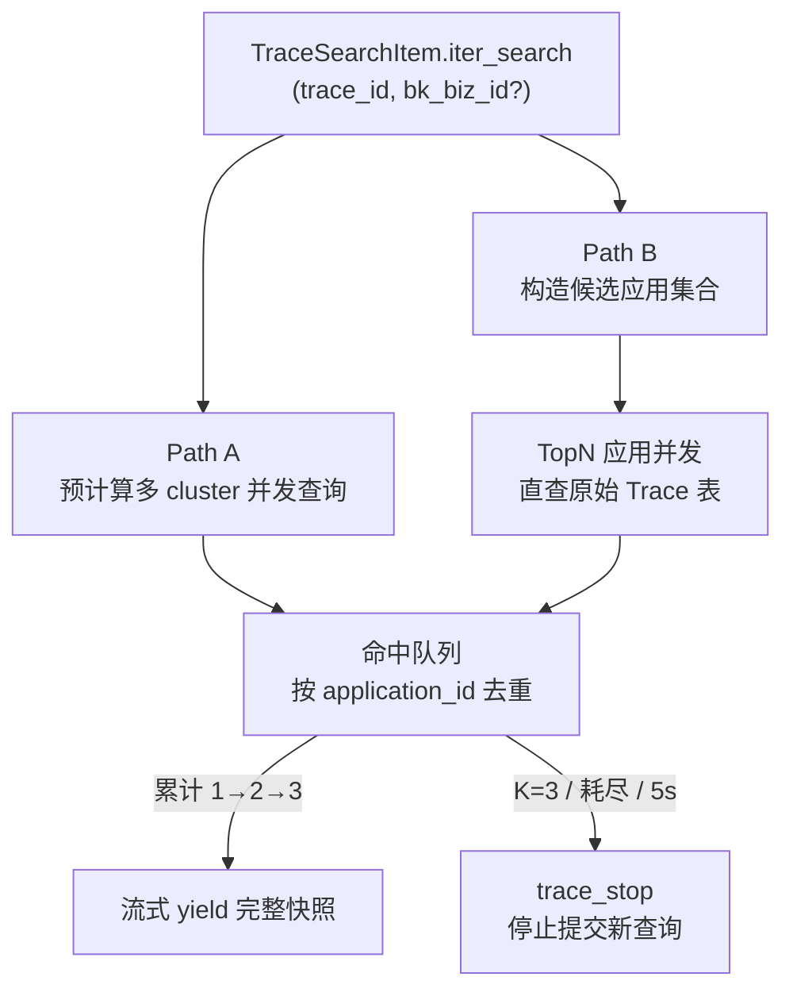
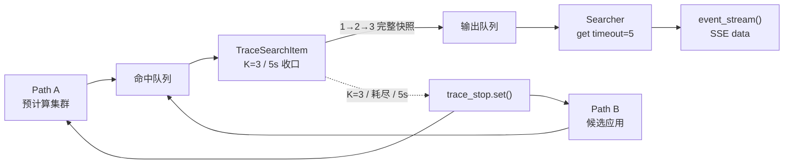

# 优化首页 TraceID 全局搜索的预计算延迟 —— 实施方案

> 基于 [README.md](./README.md) 制定。

## 0x01 调研与约束

### a. 关键事实

- 预计算结果表为租户级共享，单次查询天然覆盖全租户，但写入有分钟级延迟。
- 原始 Trace 数据按应用粒度落表（`Application.trace_result_table_id`），数据落库即可查，但单表只覆盖一个应用。
- `apm_web.models.UserVisitRecord` 由 `user_visit_record` 装饰器写入，覆盖 service_list / service_detail / trace_list 等 view。
- 按 `(bk_biz_id, app_name)` 聚合可得到用户的"应用访问次数"，`created_by` 与 `created_at` 均有索引。
- `Application` 模型按 `(bk_tenant_id, bk_biz_id)` 过滤即可拉到候选，配合 `exclude(trace_result_table_id="")` 排除空表。

### b. 关键决策


| 决策点 | 结论 | 理由 |
| --- | --- | --- |
| 预计算与直查关系 | 并行收集，按 `application_id` 去重累计 | 预计算覆盖老数据广度，直查覆盖延迟期；里程碑 2 不再“先非空者赢” |
| 候选业务范围 | 当前业务、默认业务、`UserVisitRecord` 出现的业务三类去重并集 | 兼顾用户主场景，避免拉全量业务造成雪崩 |
| 访问数据源 | `UserVisitRecord`，废弃 `FUNCTION_ACCESS_RECORD.apm_service` | 后者是服务访问记录而非应用访问，与 Trace 检索语义不匹配 |
| 应用权限过滤 | 不前置过滤，命中后由前端跳转时处理 | 与现状一致，简化实现，避免无 IAM 的高频损耗 |
| 候选应用规模 | TopN 默认 `15`，并发查询 | 与现有预计算多 cluster 并发量级一致 |
| 直查时间窗口 | 近 `7d` | 与预计算路径对齐，便于结果合并语义统一 |
| Trace 返回上限 | `K=3`，Trace 专用常量，不复用 `page_size` | 多应用命中只需少量候选；编码成本可忽略 |
| Trace 收集超时 | 绝对 `5s` deadline（`time.monotonic()`） | 与 `Searcher` 单项 `get(timeout=5)` 对齐；`K` 填不满时不扫完全部候选 |


### c. 边界与风险

- `bk_biz_id` 入参缺省时跳过"当前业务"来源，仅用默认业务与访问过的业务。
- 候选业务去重并集后才作为 ORM `bk_biz_id__in` 输入，避免重复扫描。
- `Application` 查询必须带 `bk_tenant_id`。
- 直查的 `trace_id__eq` 必须配合 `time_field=OtlpKey.END_TIME`，否则会与预计算字段语义混淆。
- `UserVisitRecord` 访问次数可达数百次，必须 `log1p` 归一压扁高频段，避免极端用户的常用应用碾压业务意图。

## 0x02 方案主干

### a. 双路径并行收集



Path A 与 Path B 并行产出命中，互不依赖；聚合层按 `application_id` 去重后流式推送累计快照。

### b. 候选应用打分

按"访问过 / 未访问"分层赋分，访问过的层在排序上恒定优于未访问层：

```text
score = APP_WEIGHT_CURRENT + log1p(visit)                                                       if visit > 0
      = BIZ_WEIGHT_CURRENT * is_current + BIZ_WEIGHT_DEFAULT * is_default + APP_WEIGHT_HAS_SERVICE * has_service  otherwise
```


| 常量                       | 值                                                                        | 作用                  |
|--------------------------|--------------------------------------------------------------------------|---------------------|
| `BIZ_WEIGHT_CURRENT`     | `1`                                                                      | 未访问层：当前业务加分         |
| `BIZ_WEIGHT_DEFAULT`     | `1`                                                                      | 未访问层：默认业务加分         |
| `APP_WEIGHT_HAS_SERVICE` | `0.5`                                                                    | 未访问层：有服务应用加分        |
| `APP_WEIGHT_CURRENT`     | `BIZ_WEIGHT_CURRENT + BIZ_WEIGHT_DEFAULT + APP_WEIGHT_HAS_SERVICE = 2.5` | 访问过层基础分，确保大于未访问层最大值 |


**关键不变量**：访问过的最低分 `2.5 + log1p(1) ≈ 3.19` > 未访问的最高分 `2.5`，分层严格保序。

**排序规则**：访问过按 `log1p(visit)` 排序，未访问按业务来源与服务数排序，同分按 `application_id` 升序。

对照（典型场景）：


| 应用   | visit | 业务            | score               |
| ---- | ----- | ------------- | ------------------- |
| 任意应用 | 100   | 任意            | `2.5 + 4.62 ≈ 7.12` |
| 任意应用 | 1     | 任意            | `2.5 + 0.69 ≈ 3.19` |
| 未访问  | 0     | 当前 + 默认 + 有服务 | `2.5`               |
| 未访问  | 0     | 当前 / 默认       | `1`                 |
| 未访问  | 0     | 其他            | `0`                 |


### c. 直查协议契约

直查复用 `BK_APM` 数据源构造，关键差异点：


| 字段           | 预计算路径                                                 | 直查路径                                |
|--------------|-------------------------------------------------------|-------------------------------------|
| `table_id`   | `DataLink.pre_calculate_config.cluster[*].table_name` | `Application.trace_result_table_id` |
| `time_field` | `PreCalculateSpecificField.MIN_START_TIME`            | `OtlpKey.END_TIME`                  |
| `filter`     | `trace_id__eq`                                        | `trace_id__eq`                      |
| `values`     | `BIZ_ID`、`APP_NAME`                                   | `trace_id`（仅判存在）                    |
| `limit`      | `5`                                                   | `1`                                 |
| `time_range` | 近 `7d`                                                | 近 `7d`                              |


直查命中后，`bk_biz_id`、`app_name`、`application_id` 由调用侧的 `Application` 实例直接提供，不依赖查询返回值。

### d. 并发与超时

里程碑 1（已落地）：直查与双轨使用 `ThreadPool` + `_first_truthy_concurrent`，首个非空即结束。

里程碑 2（本方案）：

- Path A / Path B 持续产出命中；活跃并发上限仍为预计算 `5`、原始表 `8`。
- `Searcher` 保持流式汇聚：`output_queue.get(timeout=5)`，语义对齐现状 `results.next(timeout=5)`；`queue.Empty` 按超时跳过，不引入 `item_timeout`。
- `TraceSearchItem` 使用绝对 `deadline = time.monotonic() + TRACE_SEARCH_TIMEOUT`，`TRACE_SEARCH_TIMEOUT=5`，与外层单项等待对齐。
- 停止信号只阻止尚未发起的新查询；已发出的 UQ 请求依赖下游硬超时退出，线程池无法强杀。
- 任一路径异常仅 `logger.exception`，按 miss 处理，不向上抛错。

### e. 不变量

- 预计算路径查询语义与现状一致，可独立回退。
- 直查 miss 不影响预计算命中返回。
- 输出 item 的字段集合与现有 `TraceSearchItem` 完全相同；流式仅改变推送次数。
- 候选业务集合在 `bk_biz_id` 缺省、`DEFAULT_BIZ_ID` 缺省、`UserVisitRecord` 无记录时退化为空集，此时 Path B 直接返回空，不抛错。
- SSE 协议保持 `start → data* → end`；`event: end` 不携带结束原因（本期不做）。

### f. 流式 TopK 查询架构

职责分层：

| 层 | 职责 | 不感知 |
| --- | --- | --- |
| `Searcher` | [a] 并行调度并流式 `yield` 快照<br />[b] `get(timeout=5)` 等待下一条队列消息 | Trace 的 `K`、候选耗尽、打分 |
| `TraceSearchItem` | [a] 双路径收集并去重累计 `K=3`<br />[b] 内部绝对 `5s` deadline 收口 | `Searcher` 内部队列实现 |



`TopN` 是 Path B 的候选探测上限；`K=3` 是 Trace 最终返回上限。二者相互独立，且 `K` 不复用 `page_size`。

`TraceSearchItem` 结束条件（任一即停）：

```text
hit_count == 3
or all_paths_done
or monotonic() >= deadline
or stop_event.is_set()
```

| 结束原因 | 行为 |
| --- | --- |
| `K=3` 已满 | 立即 `trace_stop`，停止提交新查询；已 yield 的 `1→2→3` 快照保留 |
| 候选提前耗尽 | 保留已有 `0～2` 条，正常结束 |
| 到达 `5s` | 保留已有 `0～2` 条，停止继续查，向 `Searcher` 发送完成信号 |
| 客户端断开 / 外层停止 | `request_stop` 传入 Trace；停止提交新查询 |

## 0x03 开发方案

### a. 文件级落点

#### `packages/monitor_web/overview/views.py`


| 入口 | 职责 |
| --- | --- |
| `SearchSerializer` | 增加 `bk_biz_id = IntegerField(required=False, allow_null=True)` |
| `SearchViewSet.list` | 透传 `bk_biz_id`；`event_stream` 退出时关闭 `Searcher.search()` 迭代器以触发 `request_stop` |


#### `packages/monitor_web/overview/search.py` · 调度层


| 入口 | 职责 |
| --- | --- |
| `SearchItem.search` | 保持现有一次性返回；普通子类签名同步 `stop_event` 后可忽略 |
| `SearchItem.iter_search` | 默认包装 `search()`：列表拆成逐条 yield；`TraceSearchItem` 覆盖为真正流式 |
| `Searcher.search` | 消费 `iter_search()`，`get(timeout=5)` 汇聚快照并 `yield` |


#### `packages/monitor_web/overview/search.py` · `TraceSearchItem`


| 入口 | 职责 |
| --- | --- |
| `iter_search` | 启动双路、按 `application_id` 去重累计 `K=3`、按 Trace `5s` deadline 收口并流式 yield |
| `_aggregate_user_visits` | 单次 GROUP BY 查询 `UserVisitRecord`，输出 `(bk_biz_id, app_name) → count` |
| `_collect_candidate_apps` | 候选业务并集（当前 ∪ 默认 ∪ 访问过） → 全量应用 → 统一打分截 TopN |
| `_query_raw_apps_by_trace_id` | 直查单应用 `trace_result_table_id`，`limit=1` 仅判存在 |
| `_query_precalc_apps_by_trace_id` | 多 cluster 并发查询预计算表，由 `_query_apps_by_trace_id` 重命名，逻辑不变 |


### b. 候选应用收集步骤

1. 聚合最近 30 天访问次数：`_aggregate_user_visits(username) → dict[(bk_biz_id, app_name), int]`。
2. 候选业务并集：`biz_ids = {visit.keys 的业务} ∪ {current?} ∪ {default?}`。
3. 单次 `Application.objects.filter(bk_tenant_id=..., bk_biz_id__in=biz_ids).exclude(trace_result_table_id="")` 拉取候选应用。
4. 对每个应用计算 `score = access_score(visit) + biz_boost(app)`（公式见 `0x02.b`）。
5. 按 `score` 降序、`application_id` 升序，截取前 TopN。

### c. 类常量

| 常量 | 默认值 | 说明 |
| --- | --- | --- |
| `RAW_QUERY_TOP_N` | `15` | Path B 直查应用上限 |
| `TRACE_TOP_K` | `3` | Trace 最终返回上限，不复用 `page_size` |
| `TRACE_SEARCH_TIMEOUT` | `5` | Trace 收集绝对超时，与 `Searcher.get(timeout=5)` 对齐 |
| `BIZ_WEIGHT_CURRENT` | `1` | 未访问层：当前业务加分 |
| `BIZ_WEIGHT_DEFAULT` | `1` | 未访问层：默认业务加分 |
| `APP_WEIGHT_HAS_SERVICE` | `0.5` | 未访问层：有服务应用加分 |
| `APP_WEIGHT_CURRENT` | `2.5` | 访问过层基础分（`= BIZ_WEIGHT_CURRENT + BIZ_WEIGHT_DEFAULT + APP_WEIGHT_HAS_SERVICE`，派生不可独立调） |

### d. 流式 TopK 核心流程

本节落实：`Searcher` 回到 `get(timeout=5)` 汇聚版；`TraceSearchItem` 用 `deadline=5` 自行收口。

| 变更点 | 目标 |
| --- | --- |
| **[Add]** `SearchItem.iter_search()` | 默认把 `search()` 的列表结果逐条 yield；普通搜索项无需改实现。 |
| **[Change]** `Searcher.search()` | [a] 消费 `iter_search()` 并写入输出队列<br />[b] `get(timeout=5)` 等待下一条，对齐现状 `next(timeout=5)` |
| **[Change]** `SearchItem.search()` | 签名新增 `stop_event`；普通子类忽略该参数，继续返回列表。 |
| **[Change]** `TraceSearchItem.iter_search()` | [a] 创建 Trace 专用 `deadline=5` 与 `trace_stop`<br />[b] 去重并 `yield` `1→2→3` 累计快照<br />[c] 满足结束条件后停止 |
| **[Change]** `TraceSearchItem._path_precalc()` | 持续返回各预计算表命中；提交或发起查询前检查 `trace_stop` 与 `deadline`。 |
| **[Change]** `TraceSearchItem._path_raw()` | 持续返回 TopN 候选命中；提交或发起查询前检查 `trace_stop` 与 `deadline`。 |
| **[Delete]** `TraceSearchItem._first_truthy_concurrent()` | 删除“首个非空即结束”的公共收敛逻辑。 |

#### [Add] `SearchItem.iter_search()`

```python
@classmethod
def iter_search(cls, ..., stop_event=None):
    result = cls.search(..., stop_event=stop_event)
    for snapshot in result or []:
        yield snapshot
```

#### [Change] `Searcher.search()`

```python
def _consume_item(item):
    try:
        for snapshot in item.iter_search(..., stop_event=request_stop):
            if request_stop.is_set():
                break
            output_queue.put(snapshot)
    finally:
        output_queue.put(None)


with ThreadPool() as pool:
    try:
        for item in search_items:
            pool.apply_async(_consume_item, (item,))

        start_time = time.time()
        while unfinished and time.time() - start_time <= timeout:
            try:
                snapshot = output_queue.get(timeout=5)
            except queue.Empty:
                # 对齐现状 results.next(timeout=5) 的 TimeoutError
                logger.error("Searcher search timeout, query: %s", query)
                continue
            if snapshot is None:
                unfinished -= 1
                continue
            yield snapshot
    finally:
        request_stop.set()
```

`Searcher` 不读取 Trace 常量。Trace 在 `5s` 内自行 `ITEM_DONE` 后，外层 `get(timeout=5)` 不会误等。

#### [Change] `TraceSearchItem.iter_search()`

```python
deadline = time.monotonic() + TRACE_SEARCH_TIMEOUT  # 5s
trace_stop = threading.Event()

def _drain_path(path):
    try:
        for app in path:
            if stop_event.is_set() or trace_stop.is_set() or time.monotonic() >= deadline:
                break
            app_queue.put(app)
    finally:
        app_queue.put(None)

paths = [
    cls._path_precalc(..., stop_event=stop_event, trace_stop=trace_stop, deadline=deadline),
    cls._path_raw(..., stop_event=stop_event, trace_stop=trace_stop, deadline=deadline),
]

with ThreadPool(2) as pool:
    try:
        pool.map_async(_drain_path, paths)

        while (
            len(seen) < TRACE_TOP_K
            and unfinished_paths
            and not stop_event.is_set()
            and time.monotonic() < deadline
        ):
            remaining = deadline - time.monotonic()
            try:
                app = app_queue.get(timeout=min(0.2, remaining))
            except queue.Empty:
                continue
            if app is None:
                unfinished_paths -= 1
                continue
            if app.application_id in seen:
                continue

            seen[app.application_id] = app
            yield [{"type": "trace", "name": "Trace", "items": [
                cls._build_item(query, hit) for hit in seen.values()
            ]}]
    finally:
        trace_stop.set()
```

#### [Change] 双路径滑动窗口探测

两条路径共用滑动窗口，不使用一次提交全部候选的 `imap_unordered`：

```python
def _iter_hits(candidates, probe, max_workers):
    """先提交固定窗口；每完成一个任务再补一个候选；停止后不再提交。"""
    pending = []
    index = 0

    with ThreadPool(max_workers) as pool:
        while index < len(candidates) and len(pending) < max_workers:
            if stop_event.is_set() or trace_stop.is_set() or time.monotonic() >= deadline:
                break
            pending.append(pool.apply_async(probe, (candidates[index],)))
            index += 1

        while pending:
            if stop_event.is_set() or trace_stop.is_set() or time.monotonic() >= deadline:
                break
            done = next((f for f in pending if f.ready()), None)
            if done is None:
                time.sleep(0.05)
                continue
            pending.remove(done)
            hit = done.get()
            if hit:
                yield hit
            if index < len(candidates) and not (
                stop_event.is_set() or trace_stop.is_set() or time.monotonic() >= deadline
            ):
                pending.append(pool.apply_async(probe, (candidates[index],)))
                index += 1
```

| 路径 | `candidates` | `probe` | `max_workers` |
| --- | --- | --- | --- |
| Path B | TopN 应用列表 | 发起 UQ 存在性探测；异常按 miss | `8` |
| Path A | 预计算 `table_id` 列表 | 查询单 cluster；异常按 miss，不拖垮整条 Path A | `5` |

路径侧约束：

- 提交任务与发起 UQ 前都必须检查 `trace_stop` / `deadline`。
- 停止后不再提交新候选；已发出的 UQ 请求依赖下游硬超时退出。
- `event: end` 仍由 `SearchViewSet.event_stream` 在迭代结束后发送；超时与候选耗尽都走同一出口。

## 0x04 实施进展

| 时间 | 结论性进展 |
| --- | --- |
| `2026-07-24 10:00` | [a] 里程碑 2 收口：`K=3` + Trace 绝对 `5s`<br />[b] `Searcher` 回到 `get(timeout=5)` 汇聚版，不引入 `item_timeout`<br />[c] Trace 内部 `deadline=5` 与外层单项等待对齐 |
| `2026-05-06 16:00` | PR #10492 review 收口：预计算恢复 `MIN_START_TIME`，访问层基础分 + `log1p`，未访问层保留业务来源与服务数加权 |
| `2026-05-03 00:00` | 里程碑 1 落地：双轨竞速 + 原始 Trace 直查 + `UserVisitRecord` 候选 |
| `2026-05-02 00:00` | PLAN 主干定稿：双轨并行、候选不前置权限过滤、`log1p` 归一加权 |

## 0x05 参考

- [`<源码> bk-monitor/bkmonitor/packages/monitor_web/overview/search.py`](https://github.com/TencentBlueKing/bk-monitor/blob/master/bkmonitor/packages/monitor_web/overview/search.py)
- [`<源码> bk-monitor/bkmonitor/packages/monitor_web/overview/views.py`](https://github.com/TencentBlueKing/bk-monitor/blob/master/bkmonitor/packages/monitor_web/overview/views.py)
- [`<源码> bk-monitor/bkmonitor/packages/monitor_web/overview/resources.py`](https://github.com/TencentBlueKing/bk-monitor/blob/master/bkmonitor/packages/monitor_web/overview/resources.py)
- [`<源码> bk-monitor/bkmonitor/packages/apm_web/models/application.py`](https://github.com/TencentBlueKing/bk-monitor/blob/master/bkmonitor/packages/apm_web/models/application.py)
- [`<源码> bk-monitor/bkmonitor/packages/apm_web/handlers/db_handler.py`](https://github.com/TencentBlueKing/bk-monitor/blob/master/bkmonitor/packages/apm_web/handlers/db_handler.py)
- [`<源码> bk-monitor/bkmonitor/packages/monitor/models/models.py`](https://github.com/TencentBlueKing/bk-monitor/blob/master/bkmonitor/packages/monitor/models/models.py)

## 0x07 版本锚点

| 状态 | 分支 | 里程碑 | PR |
| --- | --- | --- | --- |
| ✅ | `feat/apm_trace/#1010158081134011153` | 里程碑 1：首页 TraceID 检索支持原始 Trace 低延迟通道 | [TencentBlueKing/bk-monitor #10492](https://github.com/TencentBlueKing/bk-monitor/pull/10492) |
| 🔄 | `<branch_name>` | 里程碑 2：流式 TopK=3 + Trace 绝对 5s 超时收口 | 待创建 |
