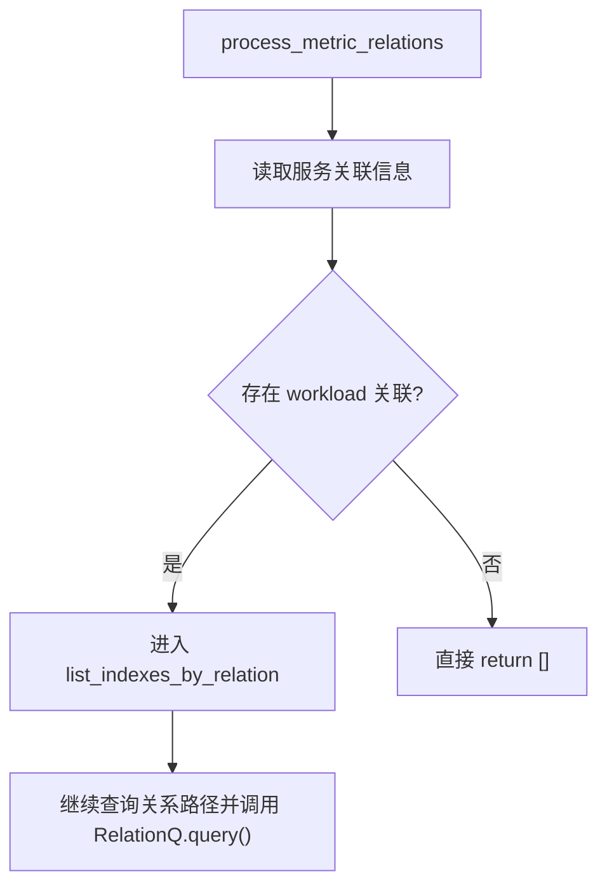

# 优化 APM 日志关联列表关系查询长耗时 —— 方案 PLAN

> **已归档** — 本方案已于 `2026-05-08` 合并（[PR #10530](https://github.com/TencentBlueKing/bk-monitor/pull/10530)），后续优化由 [APM 关联容器日志采集项慢接口优化](../2026-07-10-apm-k8s-log-relation-cache/README.md) 接续。

> 基于 [README.md](./README.md) 制定。

## 0x01 调研与约束

### a. 样本信息

- 环境：bkop。
- 观测应用：`bkmonitor_production`。
- Trace ID：`9a9aaba7214aa92cd4edd6bfba7102b2`。
- 入口：`POST /apm/service_log/log/log_relation_list/`。
- 目标接口：APM 日志关联列表。
- 时间窗口：`7d`。

### b. 关键约束

- 现有结论来自单个慢 Trace，只能作为瓶颈样本，不能直接代表全量分布。
- 当前主瓶颈集中在 `process_metric_relations -> ServiceLogHandler.list_indexes_by_relation` 这条关系查询分支。
- `list_indexes_by_relation()` 当前同时尝试 `SourceK8sPod` 和 `SourceSystem` 两条路径，因此任何前置剪枝都只能裁掉确定无效的子路径，不能误伤仍可能命中的关系链。
- 手动关联关系、应用数据源索引和 Span 主机关联不在本轮优化主路径内，行为需要保持不变。

## 0x02 架构设计

当前样本的主瓶颈在关系查询分支：Web 侧等待 UnifyQuery `relation/multi_resource_range` 返回。

- 客户端等待耗时为 `35.535s`。
- 该耗时占入口总耗时约 `98.5%`。

```text
[入口] POST /apm/service_log/log/log_relation_list/ ← 36.090s / frustrated
  └─[资源] LogRelationListResource.perform_request ← 36.029s
      ├─[预处理] get_biz_index_sets_with_cache / search_index_set ← 0.469s / 非主瓶颈
      └─[内部] log_relation_list / ThreadPoolExecutor 四分支
          ├─[分支] process_relation ← 手动关联匹配，当前样本未见长耗时
          ├─[分支] process_datasource → detail_application ← 0.319s / 非主瓶颈
          ├─[主瓶颈] process_metric_relations
          │   └─ ServiceLogHandler.list_indexes_by_relation
          │       └─ RelationQ.query / query_multi_resource_range ← 35.536s
          │           └─ [待证根因] UQ relation 多资源范围查询客户端等待 ← 35.535s
          └─[分支] process_span_host ← 本次请求无 span_id，非主瓶颈
```

非主瓶颈：

- log-search 索引集接口耗时 `0.459s`～`0.469s`，不是当前 `36s` 长尾主因。
- APM 应用详情接口耗时 `0.314s`～`0.319s`，不是当前主因。
- MySQL、Redis 和 IAM span 大多为毫秒级，不解释当前长耗时。

## 0x03 开发方案

### a. 路径级剪枝

目标不是改写 `RelationQ.query()`，而是在进入 UQ 多资源关系查询前补一个便宜且稳定的前置剪枝。

剪枝入口放在 `process_metric_relations`，不扩散到其他分支。



- 当前产品语义下，服务没有 workload 时可直接短路整个 `process_metric_relations` 分支。
- 该短路放在 `process_metric_relations`，不扩散到 `process_relation`、`process_datasource` 或调用方资源层。
- 剪枝依据优先复用已有 `EntitySet` / 服务关系信息，避免为了节省一次 UQ 查询又新增多次不必要的远程查询。

### b. 协议落点

| 文件 | 场景 | 入口 | 处理方式 |
| --- | --- | --- | --- |
| `packages/apm_web/log/resources.py` | APM 日志关联列表 | `process_metric_relations()` | 在调用 `list_indexes_by_relation()` 前补充前置剪枝，减少无效关系查询。 |
| `packages/apm_web/handlers/log_handler.py` | 关系查询路径生成 | `list_indexes_by_relation()` | 将 K8S 路径与系统路径的剪枝条件分开表达，避免把整条关系查询分支一次性短路。 |

### c. 实现结构约束

- workload 是当前 `process_metric_relations` 分支的唯一前置判断：无 workload 时直接返回空列表。
- 禁止把当前样本的现象直接固化成全局假设，例如「没有 workload 的服务就一定不存在日志关系」。

## 0x04 实施进展

| 时间 | 对应设计片段 | 结论调整概要 | 改动 / 验证 |
| --- | --- | --- | --- |
| `2026-05-08 21:00` | `0x03.a`～`0x03.c` | 基于产品语义确认，服务没有 workload 时允许直接短路 `process_metric_relations` 分支，本轮方案收敛为 `EntitySet.get_workloads(service_name)` 前置返回。 | 已审查 `<源码> bk-monitor/packages/apm_web/log/resources.py`，并将方案主干更新为 workload 前置短路。 |
| `2026-05-06 11:00` | `0x02` | 确认 UQ relation 调用为主瓶颈。 | 主干只保留可读瓶颈拓扑。 |

## 0x05 参考

- 样本 Trace：`bkmonitor_production / 9a9aaba7214aa92cd4edd6bfba7102b2`
- `<源码> bk-monitor/bkmonitor/packages/apm_web/log/resources.py`
- `<源码> bk-monitor/bkmonitor/packages/apm_web/handlers/log_handler.py`
- `<源码> bk-monitor/bkmonitor/packages/apm_web/topo/handle/relation/query.py`

## 0x06 版本锚点

- 分支：`feat/apm_alert/#1010158081134133218`
- PR：`#10530`
