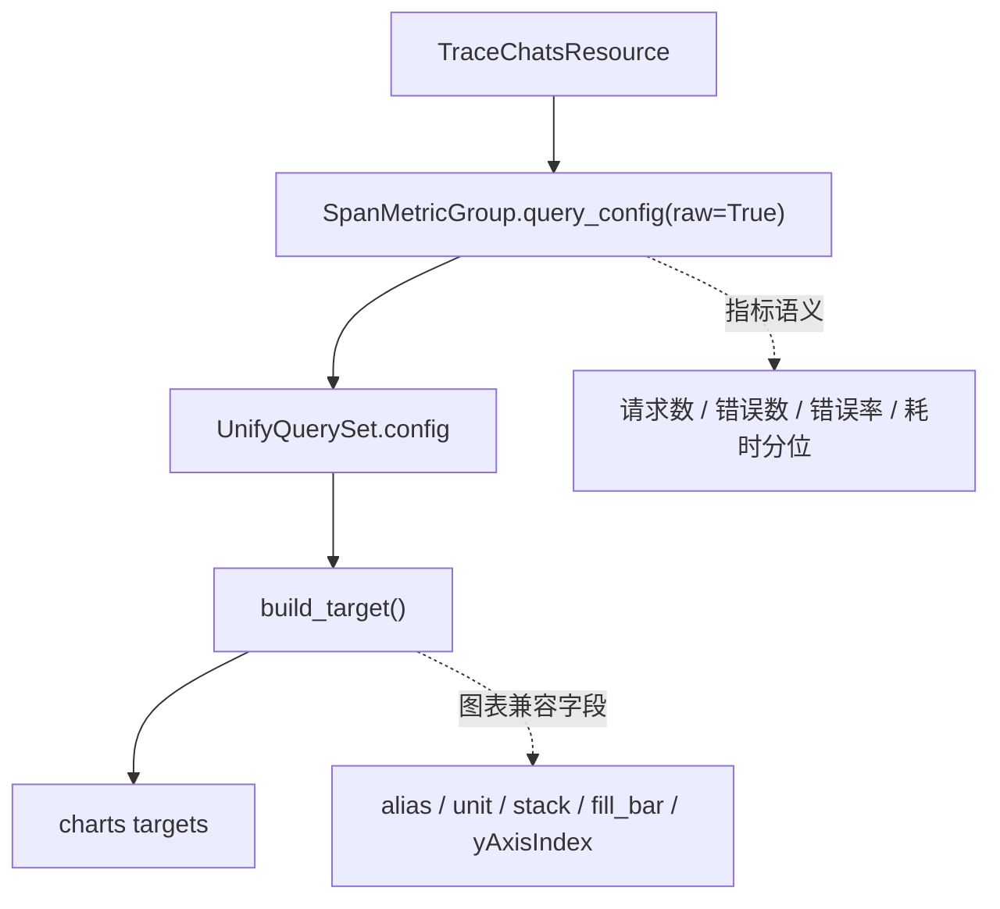

# APM Span 内置指标支持声明式引用 —— 实施方案

> 基于 [README.md](./README.md) 制定。

## 0x01 调研与约束

### a. 当前状态

- `TraceChatsResource.perform_request` 当前返回 `3` 张图：请求数、错误数和耗时。
- 图表内部共包含 `8` 个 target：主调请求数、被调请求数、错误数、错误率、AVG、P50、P95 和 P99。
- `CompilerMixin.query_config` 导出的是告警/策略侧配置，`CompilerMixin.config` 更接近前端 dynamic UnifyQuery 所需的原始查询结构。

### b. 已确认约束

`SpanMetricGroup.__init__` 采用下面的最小兼容参数：

| 参数 | 默认值 | 说明 |
| --- | --- | --- |
| `bk_biz_id` | 必填 | 业务 ID。 |
| `app_name` | 必填 | APM 应用名。 |
| `group_by` | `None` | Span 查询维度。 |
| `filter_dict` | `None` | 外部过滤条件。 |
| `interval` | `None` | 查询函数窗口。 |
| `service_name` | `None` | 服务过滤。 |
| `kind` | `None` | 调用方向。 |
| `**kwargs` | - | 透传兼容参数。 |

- `rate`、`increase` 和 `histogram_quantile` 的窗口复用 `interval`，不新增 `window` 参数。
- `interval` 默认按当前 Trace 图表的 `2m` 行为保持等价，显式传入时覆盖默认窗口。
- 表名通过 `self.metric_helper` 派生，不暴露 `table_id` 或 `time_field` 注入参数。
- 第一版算子按 `TraceChatsResource` 当前图表等价收敛，不扩展完整 RED 指标集合。

## 0x02 架构设计

整体结构分为两层：指标组拥有查询语义，Trace 图表资源只负责把查询配置装配成前端 target。

关键边界：

- `SpanMetricGroup` 解释指标语义：metric field、method、alias、where、filter_dict、group_by、functions 和 expression 都在这一层声明。
- `BaseMetricGroup.query_config(raw=True)` 解释导出格式：`raw=False` 保持现有 `.query_config`，`raw=True` 返回 `.config`。
- `TraceChatsResource.build_target` 解释图表协议：按白名单投影 raw config，再补齐前端兼容字段。
- `service_name` 是可选过滤：传入时收敛为 `filter_dict.service_name`，不传时保持应用视角配置。
- `kind` 是调用方向：`caller` 映射 `SpanKind.calling_kinds()`，`callee` 映射 `SpanKind.called_kinds()`，空值不追加 kind 条件。

## 0x03 开发方案

### a. 指标组协议

- 在 `GroupEnum` 新增 `SPAN`，并让注册表可通过 `span` 获取 `SpanMetricGroup`。
- 在 `CalculationType` 新增 `ERROR_COUNT`，供错误数算子表达独立查询类型。
- `BaseMetricGroup.query_config(calculation_type, raw=False, **kwargs)` 统一根据 `_get_qs()` 导出配置。
- `ResourceMetricGroup` 与 `TrpcMetricGroup` 保持默认输出不变，只接入统一 `raw` 分支。

### b. Span 算子

`SpanMetricGroup` 第一版只提供配置算子，不提供数据查询执行。

| 算子 | 查询语义 | 兼容要求 |
| --- | --- | --- |
| `request_total` | `bk_apm_count` 按 `SUM` 统计。 | `kind=caller/callee` 时输出旧图表的 OR kind 条件。 |
| `error_count` | `bk_apm_count` 按 `status_code=2` 过滤。 | alias 使用旧配置的 `A`。 |
| `error_rate` | 错误数除以总数。 | expression 保持 `a / b`。 |
| `avg_duration` | `bk_apm_duration_sum / bk_apm_total`。 | 两个查询都追加 `increase`。 |
| `p50_duration`、`p95_duration`、`p99_duration` | `bk_apm_duration_bucket` 先 `rate` 再 `histogram_quantile`。 | group_by 固定为 `le`。 |

### c. Trace 图表装配

`TraceChatsResource` 改为先取 `SpanMetricGroup.query_config(raw=True)`，再交给 `build_target` 生成 target。

`build_target` 的职责是做协议适配：输入 raw UnifyQuery config，输出旧 charts target 结构。

实现时先按白名单投影 raw config，再按补齐表写入图表兼容字段。

建议入参保持显式：

- `q` 接收 `SpanMetricGroup.query_config(..., raw=True)` 的结果。
- `alias`、`unit`、`stack`、`fill_bar`、`yAxisIndex`、`chart_type`、`service_name` 由调用处按旧 target 配置传入。

raw config 白名单：

| 层级 | 保留字段 | 说明 |
| --- | --- | --- |
| `raw_config` | `query_configs`、`expression` | 顶层只取这两个字段。 |
| `data.query_configs[]` | `data_source_label`、`data_type_label`、`table`、`metrics` | 查询数据源与指标定义。 |
| `data.query_configs[]` | `group_by`、`where`、`filter_dict`、`functions` | 查询维度、过滤条件和函数链。 |
| `data.query_configs[]` | `time_field` | 仅 raw 值非 `None` 时保留，不补 `time_field=None`。 |
| `data.query_configs[]` | `data_label` | 仅旧 target 需要该字段时保留，不作为全局字段补齐。 |

白名单之外的 raw 编译字段不进入 charts target。

本期不保留 `index_set_id=None`。

需要补齐的字段：

| 层级 | 字段 | 说明 |
| --- | --- | --- |
| `target` | `data_type`、`api`、`datasource`、`alias` | target 基础协议字段，保持旧图表入口不变。 |
| `target` | `yAxisIndex`、`chart_type` | 仅在旧 target 存在时补齐，用于错误数/错误率双轴图。 |
| `data` | `app_name`、`unit` | data 基础字段，`unit` 仅在旧 target 存在时补齐。 |
| `data` | `expression` | 来源为 `q["expression"]`，仅在旧 data 顶层存在表达式时补齐。 |
| `data` | `stack`、`fill_bar`、`service_name` | 图表展示与服务过滤字段，按调用方传参补齐。 |
| `data.unify_query_param` | `type`、`stack` | 只在旧配置需要时补齐，保持 dynamic UnifyQuery 请求体等价。 |
| `data.query_configs[]` | `display`、`interval_unit` | 旧 charts 直接消费的 query config 展示字段。 |

## 0x04 验收与验证

- 覆盖 `SpanMetricGroup.query_config(raw=True)`：主调请求数、被调请求数、错误数、错误率、平均耗时和 P50/P95/P99。
- 覆盖 `service_name`：所有 query config 都追加服务过滤，target data 携带 `service_name`。
- 覆盖兼容指标组：`TrpcMetricGroup` 与 `ResourceMetricGroup` 默认输出不变，`raw=True` 返回 raw UnifyQuery 配置。
- 覆盖 `TraceChatsResource.perform_request`：mock 应用信息后，对比重构前后的 charts 快照。
- 若 Django 测试环境不可用，至少执行目标文件 `py_compile` 和可运行的局部 pytest。

## 0x05 实施进展

| 时间 | 对应设计片段 | 结论调整概要 | 改动 / 验证 |
| --- | --- | --- | --- |
| `2026-05-07 18:00` | `0x01` `0x02` `0x03.c` | [1] 已完成 ISSUE / PLAN 当前有效方案。 [2] `build_target` 改为白名单投影 raw config，代码实现等待确认。 | 已通过 `git diff --check` 与 `pre-commit` 文档检查。 |

## 0x06 参考

- `<源码>` bk-monitor/bkmonitor/packages/apm_web/trace/resources.py
- `<源码>` bk-monitor/bkmonitor/packages/apm_web/handlers/metric_group/base.py
- `<源码>` bk-monitor/bkmonitor/packages/apm_web/handlers/metric_group/groups/resource.py
- `<源码>` bk-monitor/bkmonitor/packages/apm_web/handlers/metric_group/groups/trpc.py
- `<源码>` bk-monitor/bkmonitor/bkmonitor/data_source/unify_query/builder.py

## 0x07 版本锚点

- 分支：`feat/apm_trace_dev`
- PR：待定
