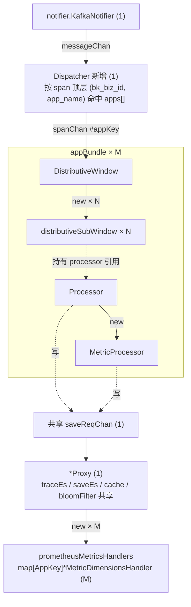
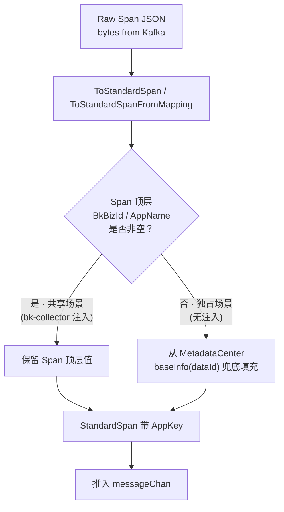
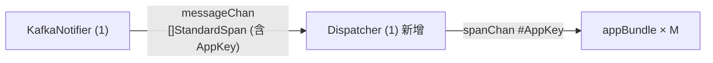
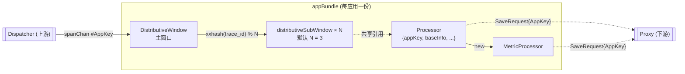

# APM 预计算适配共享数据源 —— 实施方案

> 基于 [README.md](./README.md) 制定，父 issue 见 [APM 支持跨应用共享数据源](../2026-03-03-apm-shared-datasource/README.md)

## 0x01 调研与约束

### a. 任务实例的静态绑定

蓝鲸监控 SaaS 端 Celery beat 周期任务 `bmw_task_cron` 每 `15` 分钟触发 `PreCalculateCheck`，按 `data_id` 维度刷新 Consul 并调 BMW 创建任务接口。

BMW 端按 `data_id` 派生任务唯一键 `taskUniId`，单点绑定到一个 worker 实例。

任务实例内的组件依赖如下，实线表示 `New` 或持有，虚线表示运行期 chan 或引用。

```mermaid
graph TB
    Launch["Precalculate.launch"]
    RI["RunInstance"]
    Launch -->|"new"| RI

    SNot["RunInstance.startNotifier"]
    SStg["RunInstance.startStorageBackend"]
    SWin["RunInstance.startWindowHandler<br/>messageChan, saveReqChan"]
    RI --> SNot
    RI --> SStg
    RI --> SWin

    N["notifier.KafkaNotifier<br/>notifier.NewNotifier(KafkaNotifier, dataId, ...)"]
    Proxy["*storage.Proxy<br/>storage.NewProxyInstance(dataId, ctx)"]
    Proc["window.Processor<br/>window.NewProcessor(ctx, dataId, proxy)"]
    DW["*window.DistributiveWindow<br/>window.NewDistributiveWindow(dataId, ctx, processor, saveReqChan)"]
    SNot -->|"new"| N
    SStg -->|"new"| Proxy
    SWin -->|"new"| Proc
    SWin -->|"new"| DW

    MP["*window.MetricProcessor<br/>newMetricProcessor(ctx, dataId)"]
    Proc -->|"new"| MP

    SW["window.distributiveSubWindow × N<br/>newDistributiveSubWindow(dataId, ctx, i, processor, saveReqChan)"]
    DW -->|"new × N"| SW

    MDH["prometheusMetricsHandler<br/>NewMetricDimensionHandler(ctx, dataId)"]
    Prom["promClient *remote.PrometheusWriter<br/>token = GetToken(dataId)"]
    Proxy -->|"new"| MDH
    MDH -->|"new"| Prom

    SW -.持有 processor 引用.-> Proc
    Proc -.持有 storage.Backend.-> Proxy
    N -.messageChan.-> DW
    Proc -.saveReqChan.-> Proxy
    MP -.saveReqChan.-> Proxy
```

`N` 是 `DistributiveWindowOptions.subWindowSize`，默认 `3`，按 `xxhash(span.TraceId) % N` 路由到子窗口，子窗口之间共享同一个 `Processor` 引用。

任务实例内的所有应用上下文都以 `data_id` 维度在构造期静态绑定：

- `Processor.baseInfo`：`MetadataCenter.GetBaseInfo(dataId)`
- `MetricProcessor.appName`：`baseInfo.AppName`
- `MetricDimensionsHandler.promClient` 的 token：`MetadataCenter.GetToken(dataId)`

### b. 共享场景的冲击

共享数据源打破「一个 `data_id` 对应一个应用」这一隐含前提，按 `data_id` 静态绑定的下游全部失效：

| 层 | 现状机制 | 共享场景表现 |
| --- | --- | --- |
| 协议 | Consul 按应用 put | 多应用互相覆盖 |
| 上下文 | `Processor.baseInfo` 取自 `data_id` 静态绑定 | 所有 Span 归属到 Consul 最后写入的应用 |
| 路由 | `promClient` token 启动期注入 | token 绑定首应用，无法按事件路由 |
| 回补 | `Processor.listSpanFromStorage` 仅以 `trace_id` 查 ES | 两应用偶发 `trace_id` 撞库时读到对方 Span |

### c. 关键决策

- 共享池规模上限由 SaaS 侧控制：BMW 侧不再考虑 `M` 的上限。
- `Processor.traceEsQueryLimiter` 维度：每 `Processor` 独立，与共享池大小线性。
- 持久化键不变：子窗口 `sync.Map`、布隆过滤器、预计算结果表 ES `_id` 全部保留裸 `trace_id`。
- 配置变更感知粒度不变：`apps[]` 变化复用 `watchConsulConfigUpdate` 整 `RunInstance` 重启路径。

## 0x02 架构设计

### a. 拆分边界

**拆分轴**：按 AppKey 把单 `data_id` 的 Kafka 链路切成 `M` 条应用维度子链路。

**三段切法**：

- **上游汇聚**：`KafkaNotifier` 不动，按 `data_id` 一份消费。
- **应用切分**：新增 `Dispatcher`，按 Span 顶层 AppKey 路由到 `M` 份 `appBundle`（应用维度的三元组）。
- **下游收敛**：`Proxy` 单实例，无状态后端共享，仅 `prometheusMetricsHandler` 按 AppKey 分发。



实例数对照：

| 组件 | 现状 | 方案 4 |
| --- | --- | --- |
| `KafkaNotifier` / `Proxy` / `Proxy.traceEs` / `Proxy.saveEs` / `Proxy.cache` / `Proxy.bloomFilter` | `1` | `1` |
| `Dispatcher` | `0` | `1`（新增） |
| `DistributiveWindow` / `Processor` / `MetricProcessor` / `promClient` | `1` | `M` |
| `distributiveSubWindow` goroutine | `N` | `M × N` |
| `Proxy.prometheusMetricsHandler` | `1`（单字段） | `M`（map 字段） |
| `Processor.traceEsQueryLimiter` | `1` | `M` |

**回应 `0x01.b` 的四项失效**：

| 失效项 | 方案 4 解法 |
| --- | --- |
| 协议互相覆盖 | Consul Value 升级为 `apps[]`，`MetadataCenter` 按 AppKey 取应用上下文 |
| 上下文归属错乱 | `appBundle` 构造期按 AppKey 注入 `BaseInfo`，内部组件不感知共享模式 |
| 路由 token 绑定首应用 | `Proxy.prometheusMetricsHandler` 按 AppKey 分发，每应用一个 `promClient` 持有自身 token |
| 历史回补串读 | `Processor.listSpanFromStorage` 查询条件扩展为 `trace_id + bk_biz_id + app_name` 三条件 |

独占场景退化为 `M = 1` 的特例。`appBundle` 内部组件构造与处理路径在两种模式下完全一致，差异仅在 `M`：

| 模式 | `appBundle` 数量 |
| --- | --- |
| 独占 | `1` |
| 共享 | `M` |

## 0x03 开发方案

### a. Notifier（Span 标准化扩展）

`KafkaNotifier` 现有职责是消费 Kafka 消息、反序列化 raw JSON 为 `[]StandardSpan` 后推入 `messageChan`。

本方案在 Span 标准化阶段扩展一个动作：统一填充每条 Span 的 `BkBizId` / `AppName`，让下游 `Dispatcher` 与 `appBundle` 不感知模式差异。



**填充策略**

| 场景 | Span 顶层字段 | AppKey 填充策略 |
| --- | --- | --- |
| 共享 | bk-collector 注入 `bk_biz_id` / `app_name`（来源是上报 Token） | 直接取 Span 顶层值 |
| 独占 | 不注入 | 从 `MetadataCenter` 的 `baseInfo(dataId)` 兜底填充 |

填充后独占场景退化为 `M = 1` 的特例，下游处理路径与共享场景完全一致。

**字段消费链路**

- `window.Span` 加 `BkBizId` / `AppName` 字段，共享场景下 `jsonx.Unmarshal` 直接填入。
- `window.StandardSpan` 加同名字段。
- `ToStandardSpan` / `ToStandardSpanFromMapping` 在字段为空时按上表兜底，并把 AppKey 写入 `StandardSpan`。

### b. Dispatcher

新增的路由层，位于 `KafkaNotifier` 与各 `appBundle` 之间。



**路由职责**

- 从 `messageChan` 接收 `[]StandardSpan`。
- 按 `StandardSpan` 的 `(BkBizId, AppName)` 命中 Consul `apps[]`（独占场景 `apps[]` 长度为 `1`）。
- 分组写入对应 `appBundle.spanChan`。

**命中失败处理**

- Span 被丢弃，不回退到默认应用。
- 异常指标维度 `(data_id, bk_biz_id, app_name)`，定位 Span 顶层字段与 SaaS 注册 `apps[]` 不一致的应用。

### c. appBundle

位于 `Dispatcher` 下游、`Proxy` 上游的应用维度三元组 `(DistributiveWindow, Processor, MetricProcessor)`，是预计算的实际承载者，每应用一份。



**内部结构**

- `DistributiveWindow`：接收 `spanChan` 中的 Span，按 `xxhash(trace_id) % N` 路由到 `N` 个 `distributiveSubWindow`（默认 `N = 3`）。
- `Processor`：处理 `CollectTrace` 事件，触发历史 Span 回补、生成 Trace 视图，被 `N` 个子窗口共享引用。
- `MetricProcessor`：由 `Processor` 持有，生成关系与流量指标。

**构造期注入**（两种模式统一走 `appKey` 入口）

| 字段 | 注入来源 |
| --- | --- |
| `Processor.appKey` | 构造期绑定的 `appKey`（独占场景为 `apps[]` 唯一元素的 AppKey） |
| `Processor.baseInfo` | `MetadataCenter.GetAppInfo(dataId, appKey).BaseInfo` |
| `MetricProcessor.appName` 等 | 同上 |

**`appKey` 的运行期传递**

- `storage.SaveRequest` 扩字段 `AppKey AppKey`。
- `Processor` 与 `MetricProcessor` 写 `saveReqChan` 时把构造期绑定的 `appKey` 填入 `SaveRequest.AppKey`。
- 下游 `Proxy` 据此选择对应应用的 `MetricDimensionsHandler` 写出指标。

**`traceEsQueryLimiter`**

每 `Processor` 独立，共享池下 ES 查询总速率与 `M` 线性，按 SaaS 侧容量规划评估。

**内部逻辑零改动**

- `Processor.PreProcess` / `Processor.listSpanFromStorage` / `MetricProcessor.ToMetrics` 等内部方法不感知模式差异。
- `Processor.appKey` 只用于填充 `SaveRequest` 与构造历史回补查询条件，不参与子窗口路由或键计算。

### d. Proxy

是「`SaveRequest` 到 token 与后端」的唯一分发入口。

**字段升级**：

| 字段 | 类型（现状） | 类型（方案 4） |
| --- | --- | --- |
| `Proxy.prometheusMetricsHandler` | `*MetricDimensionsHandler` | `map[AppKey]*MetricDimensionsHandler` |

**分发逻辑变更**：

- `Proxy.ReceiveSaveRequest` 的 `case Prometheus` 分支按 `SaveRequest.AppKey` 选 `MetricDimensionsHandler` 实例。
- 其余 `case` 分支（`SaveEs` / `Cache` / `BloomFilter` / `TraceEs`）保持现状。

**token 注入路径不变**：

- 每个 `MetricDimensionsHandler` 仍由 `NewMetricDimensionHandler` 在构造期注入 token，`promClient` 写入期不感知 AppKey。
- `Proxy.NewProxyInstance` 按 `apps[]` 循环构造 `M` 个 handler，独占场景 `apps[]` 长度为 `1`，构造路径与共享场景一致。

**关闭语义**：`<-ctx.Done()` 时遍历 `prometheusMetricsHandlers` map 逐个 `Close()`。

### e. Consul 协议与变更感知

**Value 编排**：Consul Key 保持 `{prefix}/apm/data_id/{data_id}`，Value 按独占、共享两种模式互斥编排，由 `apps` 字段是否存在判定。

| 模式 | 顶层应用字段 | `apps[]` |
| --- | --- | --- |
| 独占 | `bk_biz_id` / `app_name` / `token` 等单应用字段填充 | 不存在 |
| 共享 | 顶层应用字段置空 | 存在，元素为引用同一 `data_id` 的全部应用 |

`apps[]` 元素契约：

| 字段 | 类型 | 说明 |
| --- | --- | --- |
| `bk_biz_id` | int | 业务 ID |
| `app_name` | string | 应用名 |
| `app_id` | int | 应用 ID |
| `token` | string | 应用上报 token |
| `bk_tenant_id` | string | 租户 ID |
| `bk_biz_name` | string \| int | 业务名 |

共享 `data_id` 下 `kafka_info` / `trace_es_info` / `save_es_info` 必须一致，作为「共享数据链路」的隐式前提，由 SaaS 端注册流程保证。

**`MetadataCenter` 接口扩展**：

- `core.DataIdInfo` 新增 `Apps map[AppKey]AppInfo` 字段，`AppInfo` 含 `Token` 与 `BaseInfo`。
- 独占模式下，`MetadataCenter.AddDataId` 把 Consul 顶层 `BaseInfo` / `Token` 映射为 `Apps` map 的唯一元素。
- 新增 `MetadataCenter.GetAppInfo(dataId, appKey) AppInfo`，作为 `appBundle` 构造期取应用上下文的统一入口。
- 保留 `MetadataCenter.GetBaseInfo(dataId)` 仅供 Span 标准化阶段（Notifier）兜底填充 AppKey 时使用。

**变更感知**：

- `watchConsulConfigUpdate` 当前调 `MetadataCenter.CheckUpdate(dataId)`，内部用 `cmp.Diff` 整结构比较 `DataIdInfo`。
- `Apps` 字段加入后自动纳入比较，无需新增通知通道。
- `apps[]` 任意变化都抛 `reload for config update` 触发整个 `RunInstance` 重启，所有 `appBundle` 与 `prometheusMetricsHandler` 重新实例化。

### f. 持久化键策略

**保留裸 `trace_id`**：`distributiveSubWindow.locate`、`sync.Map[trace_id]CollectTrace`、布隆过滤器 key、预计算结果表 ES `_id` 不引入 AppKey。

取舍依据：

- `trace_id` 是 `128` bit 随机值，撞库工程概率约 `2^-64`。
- 引入 AppKey 反而带来发布前后键格式不兼容：布隆过期前漏读、ES 双文档。
- 共享场景下 `Dispatcher` 已按 AppKey 把跨应用的 Span 路由到不同 `appBundle`，子窗口内部不会跨应用聚合。
- 两个 `appBundle` 各自写 ES 时同 `_id` 相互覆盖，与改造前独占应用之间偶发撞库的行为完全一致。

**历史 Span 回补**：

- `Processor.listSpanFromStorage` 的 ES 查询条件扩展为 `trace_id + bk_biz_id + app_name` 三条件。
- 三条件取值来自 `Processor.appKey` 与 `event.TraceId`。
- `recoverSpans` 路径 `ToStandardSpanFromMapping` 直接从 `map[string]any` 读 `bk_biz_id` / `app_name`，回填到 `StandardSpan` 字段。

### g. 设计禁区

避免实现期走偏的三条禁止形态：

- `appBundle` 内部禁止按 AppKey 反查 Consul，应用上下文只通过构造期注入。
- `promClient` 禁止在写入期按事件覆盖 token，token 仅在 `NewMetricDimensionHandler` 构造期注入。
- `Dispatcher` 之外禁止再次校验 Span 是否命中 `apps[]`，命中失败处理收敛在 `Dispatcher` 一处。

## 0x04 验收与验证

- 共享 `data_id` 在 BMW 仅存在一个常驻任务实例。
- 共享 `data_id` 下两应用不同 `trace_id` 时，各自 Trace 视图字段只反映自身应用 Span。
- 共享 `data_id` 下两应用不同 `trace_id` 时，关系与流量指标 label `apm_application_name` 与对应应用一致。
- 共享 `data_id` 下两应用不同 `trace_id` 时，上报 `X-BK-TOKEN` 与对应应用在 Consul `apps[]` 中登记的 token 一致。
- 共享 `data_id` 下两应用同 `trace_id` 时，`Dispatcher` 按 AppKey 路由到不同 `appBundle`，子窗口内部不合并。
- 共享 `data_id` 下两应用同 `trace_id` 时，ES `_id` 相互覆盖与改造前独占应用偶发撞库行为一致。
- 共享池移出某应用后，下一次 `bmw_task_cron` 周期内 Consul `apps[]` 不含该应用，`watchConsulConfigUpdate` 触发整个 `RunInstance` 重启，重启后不再上报该应用指标。
- Span 顶层缺失 `bk_biz_id` 或 `app_name` 时，`Dispatcher` 丢弃 Span 并记录异常指标。
- 独占场景的 Trace 视图字段、缓存键、指标 label、token 行为与改造前完全一致。

## 0x05 实施进展

| 时间 | 对应设计片段 | 结论调整概要 | 改动 / 验证 |
| --- | --- | --- | --- |
| `2026-05-14` | `0x01` / `0x02` / `0x03` / `0x04` 全部 | 方案「单任务多应用窗口」：Notifier 统一填充 AppKey（独占走 `BaseInfo` 兜底），Dispatcher 路由到 `appBundle`，独占即 `M=1`，回补扩展为三条件。 | [1] 已核对 master `pkg/bk-monitor-worker/internal/apm/pre_calculate/**` 与 `pkg/collector/exporter/converter/traces.go` 共 `25` 个事实点<br />[2] 本次仅创建方案文档，未改代码 |

## 0x06 参考

- 父 issue：[APM 支持跨应用共享数据源](../2026-03-03-apm-shared-datasource/README.md)
- BMW 预计算模块：`pkg/bk-monitor-worker/internal/apm/pre_calculate/**`
- bk-collector 共享场景 Span 顶层字段注入：`pkg/collector/exporter/converter/traces.go`

## 0x07 版本锚点

- 分支：`<branch_name>`
- PR：暂未提交
