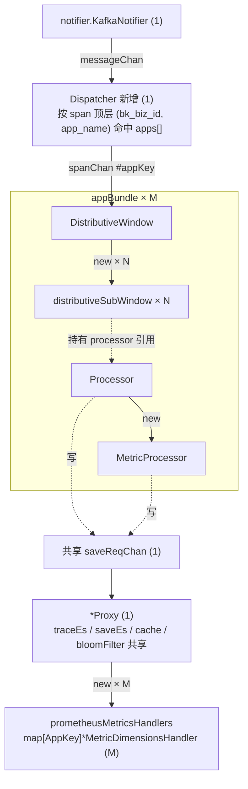
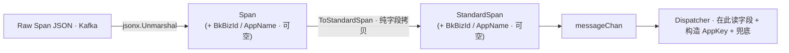
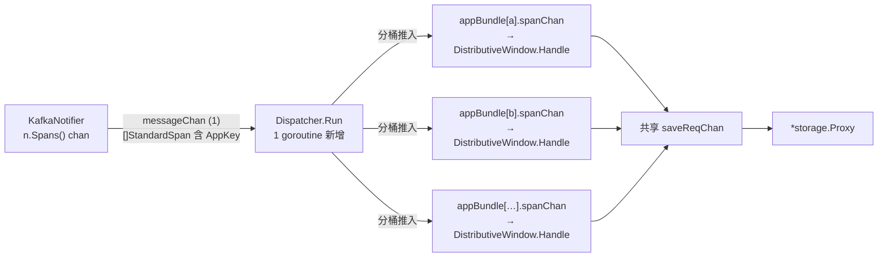
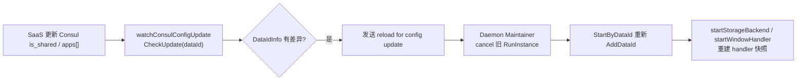
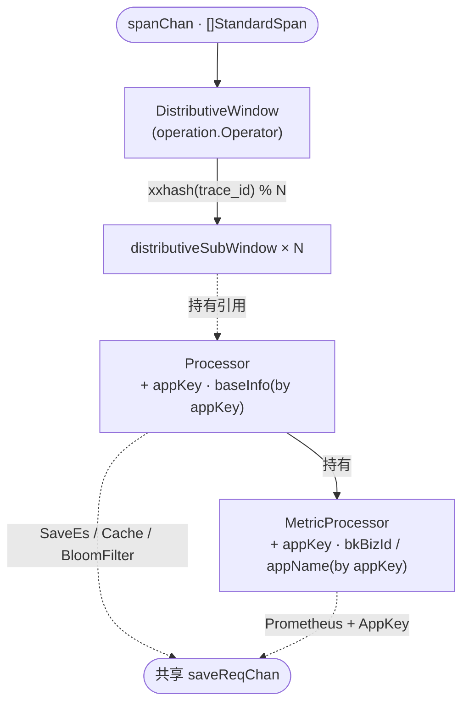

# APM 预计算适配共享数据源 —— 实施方案

> 基于 [README.md](./README.md) 制定，父 issue 见 [APM 支持跨应用共享数据源](../2026-03-03-apm-shared-datasource/README.md)

## 0x01 调研与约束

### a. 任务实例的静态绑定

**任务装配链路**

1. 蓝鲸监控 SaaS 端 Celery beat 每 `15` 分钟触发 `bmw_task_cron`，调 `PreCalculateCheck` 按 `data_id` 刷 Consul，并请求 BMW 创建任务。
2. BMW 端按 `data_id` 派生唯一键 `taskUniId`，单点绑定到一个 worker 实例。

**实例内组件依赖**

实线表示 `New` 或持有，虚线表示运行期 chan 或引用。

```mermaid
graph TB
    Launch["Precalculate.launch"]
    RI["RunInstance"]
    Launch -->|"new"| RI

    SNot["RunInstance.startNotifier"]
    SStg["RunInstance.startStorageBackend"]
    SWin["RunInstance.startWindowHandler<br/>messageChan, saveReqChan"]
    RI --> SNot
    RI --> SStg
    RI --> SWin

    N["notifier.KafkaNotifier<br/>notifier.NewNotifier(KafkaNotifier, dataId, ...)"]
    Proxy["*storage.Proxy<br/>storage.NewProxyInstance(dataId, ctx)"]
    Proc["window.Processor<br/>window.NewProcessor(ctx, dataId, proxy)"]
    DW["*window.DistributiveWindow<br/>window.NewDistributiveWindow(dataId, ctx, processor, saveReqChan)"]
    SNot -->|"new"| N
    SStg -->|"new"| Proxy
    SWin -->|"new"| Proc
    SWin -->|"new"| DW

    MP["*window.MetricProcessor<br/>newMetricProcessor(ctx, dataId)"]
    Proc -->|"new"| MP

    SW["window.distributiveSubWindow × N<br/>newDistributiveSubWindow(dataId, ctx, i, processor, saveReqChan)"]
    DW -->|"new × N"| SW

    MDH["prometheusMetricsHandler<br/>NewMetricDimensionHandler(ctx, dataId)"]
    Prom["promClient *remote.PrometheusWriter<br/>token = GetToken(dataId)"]
    Proxy -->|"new"| MDH
    MDH -->|"new"| Prom

    SW -.持有 processor 引用.-> Proc
    Proc -.持有 storage.Backend.-> Proxy
    N -.messageChan.-> DW
    Proc -.saveReqChan.-> Proxy
    MP -.saveReqChan.-> Proxy
```

`N` 是 `DistributiveWindowOptions.subWindowSize`，默认 `3`，按 `xxhash(span.TraceId) % N` 路由到子窗口，子窗口之间共享同一个 `Processor` 引用。

任务实例内的所有应用上下文都以 `data_id` 维度在构造期静态绑定：

- `Processor.baseInfo`：`MetadataCenter.GetBaseInfo(dataId)`
- `MetricProcessor.appName`：`baseInfo.AppName`
- `MetricDimensionsHandler.promClient` 的 token：`MetadataCenter.GetToken(dataId)`

### b. 共享场景的冲击

共享数据源打破「一个 `data_id` 对应一个应用」这一隐含前提，按 `data_id` 静态绑定的下游全部失效：

| 层 | 现状机制 | 共享场景表现 |
| --- | --- | --- |
| 协议 | Consul 按应用 put | 多应用互相覆盖 |
| 上下文 | `Processor.baseInfo` 取自 `data_id` 静态绑定 | 所有 Span 归属到 Consul 最后写入的应用 |
| 路由 | `promClient` token 启动期注入 | token 绑定首应用，无法按事件路由 |
| 回补 | `Processor.listSpanFromStorage` 仅以 `trace_id` 查 ES | 两应用偶发 `trace_id` 撞库时读到对方 Span |

### c. 关键决策

- 共享池规模上限由 SaaS 侧控制：BMW 侧不再考虑 `M` 的上限。
- `Processor.traceEsQueryLimiter` 维度：每 `Processor` 独立，与共享池大小线性。
- 持久化键不变：子窗口 `sync.Map`、布隆过滤器、预计算结果表 ES `_id` 全部保留裸 `trace_id`。
- 配置变更感知粒度不变：`is_shared` 与 `apps[]` 变化复用 `watchConsulConfigUpdate` 整 `RunInstance` 重启路径。
- 共享 App 集合是启动期快照。
- 应用上下文载体：`BaseInfo` 统一承载业务、应用、租户与 token，`AppKey` 由 `BaseInfo.AppKey()` 按业务 / 应用字段派生。
- 构造入口：`startWindowHandler`、`NewProxyInstance` 只在任务启动时按 `ListBaseInfos(dataId)` 构造运行时组件。
- 运行期边界：旧 `RunInstance` 内不做单 App 热增删。

## 0x02 架构设计

**拆分维度**：按 AppKey 把单 `data_id` 的 Kafka 链路切成 `M` 条应用维度子链路。

**三层切分**：

- **上游汇聚**：`KafkaNotifier` 不动，按 `data_id` 一份消费。
- **应用切分**：新增 `Dispatcher`，按 Span 顶层 AppKey 路由到 `M` 份 `appBundle`。
- **下游收敛**：`Proxy` 单实例，无状态后端共享，仅 `prometheusMetricsHandler` 按 AppKey 分发。



实例数对照：

| 组件 | 现状 | 方案 4 |
| --- | --- | --- |
| `KafkaNotifier` / `Proxy` / `Proxy.traceEs` / `Proxy.saveEs` / `Proxy.cache` / `Proxy.bloomFilter` | `1` | `1` |
| `Dispatcher` | `0` | `1`（新增） |
| `DistributiveWindow` / `Processor` / `MetricProcessor` / `promClient` | `1` | `M` |
| `distributiveSubWindow` goroutine | `N` | `M × N` |
| `Proxy.prometheusMetricsHandler` | `1`（`*MetricDimensionsHandler`） | `M`（`map[core.AppKey]*MetricDimensionsHandler`） |
| `Processor.traceEsQueryLimiter` | `1` | `M` |

**回应 `0x01.b` 的四项失效**：

| 失效项 | 方案 4 解法 |
| --- | --- |
| 协议互相覆盖 | Consul Value 升级为 `apps[]`，`MetadataCenter` 按 AppKey 取应用上下文 |
| 上下文归属错乱 | `appBundle` 构造期按 AppKey 注入 `BaseInfo`，内部组件不感知共享模式 |
| 路由 token 绑定首应用 | `Proxy.prometheusMetricsHandler` 升级为 `map[AppKey]*MetricDimensionsHandler`，按 `PrometheusStorageData.AppKey` 分发，每应用一个 `promClient` 持有自身 token |
| 历史回补串读 | `Processor.listSpanFromStorage` 维持 `trace_id` 单条件，撞库语义与 SaveEs `_id` 对齐，见 `0x03.f` |

独占场景退化为 `M = 1` 的特例，两模式仅差实例数 `M`，`appBundle` 构造流程与运行时数据流相同：

| 模式 | `appBundle` 数量 |
| --- | --- |
| 独占 | `1` |
| 共享 | `M` |

## 0x03 开发方案

### a. Span 字段扩展

`Span` / `StandardSpan` 顶层新增 `BkBizId` / `AppName` 两个可选字段，供 Dispatcher 构造 AppKey 时读取。



**`Span` 与 `StandardSpan` 变更**

`pre_calculate/window/window.go`

| 变更点 | 目标 |
| --- | --- |
| **[Field]** `Span.BkBizId` / `Span.AppName` | 新增 · `jsonx.Unmarshal` 从 Span JSON 顶层填入，对应 bk-collector 同名字段，上游异常时为空 |
| **[Field]** `StandardSpan.BkBizId` / `StandardSpan.AppName` | 新增 · 承载给 Dispatcher 读取的 AppKey 提示，下游不消费 |
| **[Method]** `ToStandardSpan` | 保持纯字段拷贝语义，新增字段从 `Span` 拷贝到 `StandardSpan` |

**上游事实**

- bk-collector 在 `exporter/converter/traces.go` 由 `record.Token` 无条件注入这两个字段到 Span 顶层。
- 独占、共享场景一致，正常链路 99%+ 命中。

**零改动模块**

- `KafkaNotifier`：兜底与路由都由 Dispatcher 承担，见 `0x03.b`。
- `ToStandardSpanFromMapping`：历史回补 Span 经 `revertToCollect` 直入 graph，不过 Dispatcher。

### b. Dispatcher

**职责**：按 AppKey 把 `KafkaNotifier` 的单 `messageChan` 切分为 `M` 份 `appBundle.spanChan`。

**装配位置**：`RunInstance.startWindowHandler`。

**为什么需要单点路由层**

- `messageChan` 单批 `[]StandardSpan` 在共享场景下跨应用混杂，下游无法直接消费。
- `DistributiveWindow.Handle` 只按 `xxhash(trace_id) % N` 做 trace 维度分流，不感知应用维度。
- Go channel 单消费者语义决定应用切分必须落在单点 goroutine。

**位置与并发模型**



**改造点清单**

| 文件 · 位置 | 改动 |
| --- | --- |
| `pre_calculate/dispatcher.go` 新增 | 新增 `dispatcher` 类型与 `Run` 方法 |
| `pre_calculate/builder.go` · `RunInstance` 结构体 | 字段 `windowHandler window.Operation` → `appBundles []*appBundle` |
| `pre_calculate/builder.go` · `RunInstance.startWindowHandler` | 遍历 `MetadataCenter.ListBaseInfos(dataId)` 装配 `M` 份 `appBundle`，起 `1` 个 `Dispatcher` |
| `pre_calculate/builder.go` · `RunInstance.startRecordSemaphoreAcquired` | 字段改名连带适配：`GetWindowsLength` 遍历 `appBundles` 求和，`RecordTraceAndSpanCountMetric` 遍历 `appBundles` 逐个触发，反压水位维度保持 `dataId` 不变 |

其余模块保持现状。

**`BaseInfo`、`AppKey`、`dispatcher` 与 `appBundle` 定义**

`BaseInfo` 是应用上下文唯一载体，包含业务、应用、租户与 token。

`AppKey` 是 `(BkBizId, AppName)` 二元组，只用于运行期路由与 map key。当前实现由 `BaseInfo.AppKey()` 方法按 `BkBizId` 与 `AppName` 派生：

```go
// pre_calculate/core/meta.go
type AppKey struct {
    BkBizId string
    AppName string
}

type BaseInfo struct {
    BkTenantId string
    BkBizId    string
    BkBizName  string
    AppId      string
    AppName    string
    Token      string
}

func (b BaseInfo) AppKey() AppKey

// pre_calculate/dispatcher.go 新增
type dispatcher struct {
    dataId  string
    routes  map[core.AppKey]chan []window.StandardSpan
    errChan chan<- error
}

// pre_calculate/builder.go 新增
type appBundle struct {
    appKey    core.AppKey
    spanChan  <-chan []window.StandardSpan
    operation window.Operation               // 内含 DistributiveWindow
    processor window.Processor               // 应用维度 Processor，持有 MetricProcessor 引用
}
```

**`appBundle` 与 `Dispatcher` 装配（`RunInstance.startWindowHandler` 内）**

```go
// 伪代码，省略错误处理与日志
mc := core.GetMetadataCenter()
apps := mc.ListBaseInfos(p.startInfo.DataId)              // 共享 M>=1 · 独占 M=1
isShared := mc.IsShared(p.startInfo.DataId)

bundles := make([]*appBundle, 0, len(apps))
dispatchRoutes := make(map[core.AppKey]chan []window.StandardSpan, len(apps))
for _, appBaseInfo := range apps {
    var spanChan <-chan []window.StandardSpan
    if isShared {
        dispatchChan := make(chan []window.StandardSpan, config.NotifierChanBufferSize)
        spanChan = dispatchChan
        dispatchRoutes[appBaseInfo.AppKey()] = dispatchChan
    } else {
        spanChan = messageChan
    }
    proc := window.NewProcessor(
        p.ctx, p.startInfo.DataId, appBaseInfo, p.proxy, p.config.processorConfig...,
    )
    op := window.Operation{Operator: window.NewDistributiveWindow(
        p.startInfo.DataId, p.ctx, proc, saveReqChan, p.config.distributiveWindowConfig...,
    )}
    op.Run(spanChan, p.errorReceiveChan, p.config.runtimeConfig...)
    bundles = append(bundles, &appBundle{
        appKey: appBaseInfo.AppKey(), spanChan: spanChan, operation: op, processor: proc,
    })
}
p.appBundles = bundles
if isShared {
    go newDispatcher(p.ctx, p.startInfo.DataId, dispatchRoutes, p.errorReceiveChan).Run(messageChan)
}
```

**运行期共享 App 变更边界**

边界结论：`startWindowHandler` 只在 `RunInstance.launch` 阶段执行 `1` 次。

生效路径：共享数据源生命周期内的 App 增删，不在 `dispatcher.routes` 或 `appBundles` 内热更新。

统一入口：`watchConsulConfigUpdate` 检测 `DataIdInfo` 差异后触发整任务 reload，`is_shared` 与 `Apps` 会一起参与比较。

变更生效链路：



过渡期语义：

- 新增 App：reload 前 `dispatcher.routes` 不含该 `AppKey`，对应 Span 被丢弃。
- 移除 App：reload 前旧 `appBundle` 与 Prometheus handler 仍存在，语义保持最终一致，由任务重启清理。
- 变更窗口：最长由 SaaS 刷 Consul 周期、`watchConsulConfigUpdate` 周期与 daemon retry 间隔共同决定。
- 收敛要求：如需更短收敛时间，优先由 SaaS 发布 daemon reload 信号。
- 禁止形态：不在 `startWindowHandler` 内实现局部热更新。

**`Dispatcher.Run` 内循环**

```go
// 伪代码，buckets 在外层复用，避免每批次分配
for {
    select {
    case batch, ok := <-messageChan:
        if !ok { return }
        for ak := range buckets { buckets[ak] = buckets[ak][:0] }
        for _, span := range batch {
            ak := core.AppKey{BkBizId: span.BkBizId, AppName: span.AppName}
            if spanChan := d.routes[ak]; spanChan != nil {
                buckets[spanChan] = append(buckets[spanChan], span)
            }
        }
        for spanChan, slice := range buckets {
            if len(slice) == 0 { continue }
            out := make([]window.StandardSpan, len(slice))
            copy(out, slice)
            spanChan <- out // 阻塞即反压
        }
    case <-ctx.Done():
        for _, spanChan := range d.routes { close(spanChan) }
        return
    }
}
```

最热应用阻塞沿 `bundle.spanChan → messageChan → notifier.spans` 回压至 Kafka 消费端，反压链路与现状同构。

### c. appBundle

`appBundle` 内部组件改造，结构体定义见 `0x03.b`。



图示数据流：

- `Processor` 出 `Cache` / `BloomFilter` / `SaveEs` 三类 `SaveRequest`，不携 AppKey
- `MetricProcessor` 出 `Prometheus`，AppKey 嵌在 `PrometheusStorageData.AppKey`，下游路由见 `0x03.d`

**Processor 改造**

`pre_calculate/window/processor.go`

| 变更点 | 目标 |
| --- | --- |
| **[Field]** `Processor.baseInfo` | 取值来源切换为构造期注入的 `BaseInfo`，自动让 Cache key 与索引名带上正确应用维度 |
| **[Method]** `NewProcessor` | 入参追加 `baseInfo`，构造期向 `newMetricProcessor` 透传 |

`Processor.sendStorageRequests` 出 `Cache` / `BloomFilter` / `SaveEs` 三类 `SaveRequest`，本方案不增 `SaveRequest` 字段，无需改动。

`recoverSpans` / `ToStandardSpanFromMapping` 保持不变，回补 Span 经 `revertToCollect` 直入 graph，无下游消费 AppKey 字段。

**MetricProcessor 改造**

`pre_calculate/window/metrics_processor.go`

| 变更点 | 目标 |
| --- | --- |
| **[Field]** `MetricProcessor.baseInfo` | 新增 · 构造期注入应用上下文，替代零散的 `bkBizId` / `appName` / `appId` / `appKey` 字段 |
| **[Method]** `newMetricProcessor` | 入参追加 `baseInfo` 参数 |
| **[Method]** `MetricProcessor.sendToSave` | 出 `SaveRequest` 时把 `m.baseInfo.AppKey` 填入 `PrometheusStorageData.AppKey`，`SaveRequest` 自身无变化 |

**DistributiveWindow / distributiveSubWindow**

`pre_calculate/window/distributive.go` 无字段或方法层改造，子窗口的 `Processor` 引用在 `startWindowHandler` 内切换为本 `appBundle` 实例。

### d. Proxy

`SaveRequest` 到 token 与后端的唯一分发入口，自身结构保持原样，只有 Prometheus 链路载体 `PrometheusStorageData` 引入 AppKey。

**`PrometheusStorageData` 与 `Proxy` 变更**

`pre_calculate/storage/storage.go` 与 `pre_calculate/storage/metrics_handler.go`

| 变更点 | 目标 |
| --- | --- |
| **[Field]** `PrometheusStorageData.AppKey` | 新增 `core.AppKey` · `MetricProcessor.sendToSave` 写入时填充，下游路由依据 |
| **[Field]** `Proxy.prometheusMetricsHandler` | 类型由 `*MetricDimensionsHandler` 升级为 `map[core.AppKey]*MetricDimensionsHandler` |
| **[Method]** `NewProxyInstance` | 按 `MetadataCenter.ListBaseInfos(dataId)` 循环构造 `M` 个 `MetricDimensionsHandler`，独占场景退化为单元素 map |
| **[Method]** `NewMetricDimensionHandler` | 入参切换为 `BaseInfo`，构造期从 `BaseInfo.Token` 创建 Prometheus writer |
| **[Method]** `Proxy.ReceiveSaveRequest` | `case Prometheus` 分支按 `item.AppKey` 选 `MetricDimensionsHandler`，`SaveEs` / `Cache` / `BloomFilter` 分支不变 |
| **[Method]** `Proxy` 关闭流程 | `<-ctx.Done()` 时遍历 `prometheusMetricsHandlers` map 逐个 `Close()`，与现状单实例 `Close()` 语义一致 |

### e. Consul 协议与变更感知

**Value 编排**：Consul Key 保持 `{prefix}/apm/data_id/{data_id}`。

模式判定由 `is_shared` 承载，`apps[]` 承载共享模式下的应用集合。

| 模式 | `is_shared` | 顶层应用字段 | `apps[]` |
| --- | --- | --- | --- |
| 独占 | `false` | `bk_biz_id` / `app_name` / `token` 等单应用字段填充 | 为空或忽略 |
| 共享 | `true` | 顶层应用字段以 primary app 为主，仅作兼容载体 | 元素为引用同一 `data_id` 的全部应用 |

`apps[]` 元素契约：

| 字段 | 类型 | 说明 |
| --- | --- | --- |
| `bk_biz_id` | int | 业务 ID |
| `app_name` | string | 应用名 |
| `app_id` | int | 应用 ID |
| `token` | string | 应用上报 token |
| `bk_tenant_id` | string | 租户 ID |
| `bk_biz_name` | string \| int | 业务名 |

共享 `data_id` 下 `kafka_info` / `trace_es_info` / `save_es_info` 必须一致，作为「共享数据链路」的隐式前提，由 SaaS 端注册流程保证。

**`MetadataCenter` 与 `DataIdInfo` 变更**

`pre_calculate/core/meta.go`

| 变更点 | 目标 |
| --- | --- |
| **[Field]** `BaseInfo.Token` | 新增 · token 并入应用上下文，删除额外的 `AppInfo` 包装层 |
| **[Method]** `BaseInfo.AppKey()` | 新增 · 由 `BkBizId` 与 `AppName` 派生运行期路由键 |
| **[Function]** `newBaseInfo(...)` | 新增 · 统一 `BaseInfo` 构造入口，收敛业务、应用、租户与 token 字段转换 |
| **[Field]** `DataIdInfo.Apps` | 新增 `map[AppKey]BaseInfo` 字段，key 只负责路由，value 负责应用上下文 |
| **[Field]** `DataIdInfo.IsShared` | 新增 · 承接 Consul `is_shared`，供构造期选择 Dispatcher 或独占直连路径 |
| **[Method]** `MetadataCenter.AddDataId` | [1] 独占模式下把 Consul 顶层 `BaseInfo` / `Token` 映射为 `Apps` map 的唯一元素<br />[2] 共享模式下由 `apps[]` 构造 `Apps` map |
| **[Method]** `MetadataCenter.ListBaseInfos(dataId)` | 新增 · 供构造期装配 `M` 份应用上下文，独占场景返回单元素切片 |
| **[Method]** `MetadataCenter.IsShared(dataId)` | 新增 · 供 `startWindowHandler` 判断是否需要 Dispatcher |

**变更感知**：

- `watchConsulConfigUpdate` → `MetadataCenter.CheckUpdate(dataId)` 通过 `cmp.Diff` 整结构比较 `DataIdInfo`。
- `IsShared` 与 `Apps` 字段自动纳入差异判断。
- `apps[]` 变化抛 `reload for config update`，daemon maintainer 取消旧 `RunInstance` 并延迟重启。
- 新 `RunInstance` 启动时重新执行 `AddDataId`、`NewProxyInstance` 和 `startWindowHandler`。
- 重建对象：`appBundle` 与 `prometheusMetricsHandlers` 全量重建。
- 运行期不在旧 `RunInstance` 内局部增删 `appBundle`。
- 目标：避免 dispatcher、窗口、processor、prometheus handler 与 goroutine 生命周期出现多处并行状态源。

### f. 持久化键策略

**保留裸 `trace_id`** 的载体：

- `distributiveSubWindow.locate`
- `sync.Map[trace_id]CollectTrace`
- 布隆过滤器 key
- 预计算结果表 ES `_id`
- `Processor.listSpanFromStorage` 的 `TraceEs` 查询条件

**Cache 路径例外**：`listSpanFromStorage` 的 Cache 已按 `(BkBizId, AppName, TraceId)` 三段写读，随 `baseInfo` 切换自动启用 AppKey 维度。

取舍依据：

- `trace_id` 是 `128` bit 随机值，撞库工程概率约 `2^-64`。
- 引入 AppKey 反而带来发布前后键格式不兼容：布隆过期前漏读、ES 双文档。
- `Dispatcher` 已按 AppKey 把跨应用的 Span 分发到不同 `appBundle`，子窗口内部不跨应用聚合。
- 撞库时写 `SaveEs` 同 `_id` 相互覆盖、读 `TraceEs` 读到对方 doc，与改造前独占应用偶发撞库行为一致。

### g. 禁止形态

避免实现期走偏的三条边界：

| 禁止形态 | 唯一允许路径 |
| --- | --- |
| `appBundle` 内部按 AppKey 反查 Consul | 应用上下文仅通过构造期注入 |
| `promClient` 写入期按事件覆盖 token | token 仅在 `NewMetricDimensionHandler` 构造期注入 |
| `Dispatcher` 之外重复校验 Span 是否命中应用路由 | 命中失败处理收敛在 `Dispatcher` 一处 |

## 0x04 验收与验证

**任务粒度**

- 共享 `data_id` 在 BMW 仅存在一个常驻任务实例。

**共享 + 两应用不同 `trace_id`**

- 各自 Trace 视图字段只反映自身应用 Span。
- 关系与流量指标 label `apm_application_name` 与对应应用一致。
- 上报 `X-BK-TOKEN` 与对应应用在 Consul `apps[]` 登记的 token 一致。

**共享 + 两应用同 `trace_id`**

- `Dispatcher` 按 AppKey 路由到不同 `appBundle`，子窗口内部不合并。
- ES `_id` 相互覆盖行为与改造前独占应用偶发撞库一致。

**配置变更**

- 共享池新增某应用后，reload 前该应用 Span 无路由而被丢弃，reload 后可路由到新 `appBundle`，并使用该应用 token 上报指标。
- 共享池移出某应用后，下一次 `bmw_task_cron` 周期内 Consul `apps[]` 不含该应用，`watchConsulConfigUpdate` 触发 `RunInstance` 重启，重启后不再上报该应用指标。
- 验证 `apps[]` 增删只通过整任务 reload 生效，不在旧 `RunInstance` 内残留新增或移除的运行期局部状态。

**异常分支**

- Span 顶层缺失 `bk_biz_id` 或 `app_name` 时，`Dispatcher` 不路由该 Span。

**独占退化**

- Trace 视图字段、缓存键、指标 label、token 行为与改造前完全一致。

## 0x05 实施进展

| 时间 | 对应设计片段 | 结论调整概要 | 改动 / 验证 |
| --- | --- | --- | --- |
| `2026-05-22 22:00` | `0x01.c` / `0x03.b` / `0x03.e` / `0x04` / `0x07` | PR #1327 复查后以当前实现为准更新方案：`is_shared` 作为共享判定字段，`AppKey` 保持 `BaseInfo.AppKey()` 方法派生，Dispatcher 对未命中路由的 Span 只执行丢弃。 | [1] 更新 Consul 协议、Dispatcher 伪代码、变更边界与验收口径<br />[2] 同步 `appBundles`、`routes`、`ListBaseInfos` 和 `IsShared` 等当前实现表达<br />[3] 版本锚点回填 PR #1327 与分支 |
| `2026-05-18 17:00` | `0x01.c` / `0x03.b` / `0x03.c` / `0x03.d` / `0x03.e` | [1] 收敛应用上下文模型：`BaseInfo` 统一承载业务、应用、租户与 token<br />[2] `AppKey` 由 `BaseInfo.AppKey()` 按业务 / 应用字段派生<br />[3] `Processor`、`MetricProcessor` 与 `MetricDimensionsHandler` 构造期直接接收 `BaseInfo` | [1] 将 `AppKey` 与 `BaseInfo` 收敛到 `core/meta.go`<br />[2] `DataIdInfo.Apps` 调整为 `map[AppKey]BaseInfo`，新增 `IsShared` / `ListBaseInfos`<br />[3] `go test ./internal/apm/pre_calculate/... -timeout 60s` 通过（Go `1.23.4`） |
| `2026-05-18 15:00` | `0x01.c` / `0x03.b` / `0x03.e` / `0x04` | 补齐共享 App 动态增删的生命周期边界：`startWindowHandler` 与 `NewProxyInstance` 只构造启动期快照，运行期 App 集合变化不做局部热更新，统一通过 `watchConsulConfigUpdate` 触发整 `RunInstance` reload 后全量重建。 | [1] 已核对 `bkmonitor-datalink` 当前实现：`startWindowHandler`、`NewProxyInstance` 均按 `ListBaseInfos(dataId)` 启动期构造<br />[2] `CheckUpdate` 会将 `DataIdInfo.Apps` 纳入 `cmp.Diff`<br />[3] daemon maintainer 收到错误后会取消旧上下文并重启任务<br />[4] 本次仅更新方案文档与索引，未改代码 |
| `2026-05-15 10:00` | `0x03.a` / `0x03.b` / `0x03.c` / `0x03.d` / `0x03.e` | 完成「单任务多应用窗口」主链路实现。<br />[1] `core.AppKey`、Consul `is_shared` / `apps[]`、`MetadataCenter.ListBaseInfos` 已落地<br />[2] `Span` / `StandardSpan` 已承载顶层 AppKey，`Dispatcher` 已接入 `KafkaNotifier` 与多 `appBundle` 之间<br />[3] `Processor` / `MetricProcessor` / `Proxy` 已按 AppKey 持有应用上下文与 Prometheus handler<br />[4] 修复向前兼容测试失败：独占应用保留单应用 fallback，指标 handler 对空 TTL 提供默认值，window fixture 同步新增维度字段 | [1] 新增 metadata 独占 / 共享解析测试与 Dispatcher 路由测试<br />[2] 修正 storage / window 既有测试对新增维度字段与 Prometheus 数据结构的断言<br />[3] `go test ./internal/apm/pre_calculate/... -timeout 60s` 通过 |

## 0x06 参考

- 父 issue：[APM 支持跨应用共享数据源](../2026-03-03-apm-shared-datasource/README.md)
- BMW 预计算模块：`pkg/bk-monitor-worker/internal/apm/pre_calculate/**`
- bk-collector Span 顶层 `bk_biz_id` / `app_name` 无条件注入：`pkg/collector/exporter/converter/traces.go`

## 0x07 版本锚点

- 分支：`feat/bkm_apm/#1010158081134331820`
- PR：[TencentBlueKing/bkmonitor-datalink#1327](https://github.com/TencentBlueKing/bkmonitor-datalink/pull/1327)
