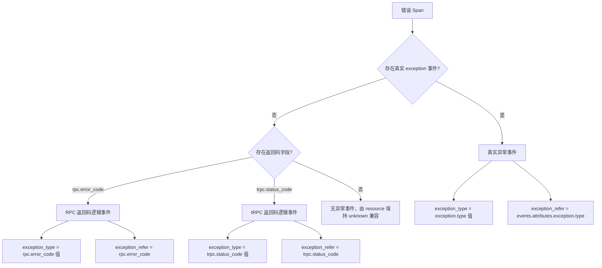
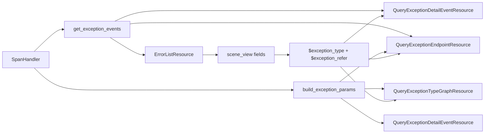

# 错误视图 tRPC 场景适配 —— 实施方案

## 0x01 调研与约束

### a. 结构判断

本方案的核心不是为 tRPC/RPC 返回码补一个特殊过滤条件，而是把错误视图的联动协议从「异常值」升级为「异常值 + 来源字段」。

现有错误页面默认把 `exception_type` 同时当作展示值、分组值和过滤字段值。

这一假设只对真实异常成立，因为真实异常天然来自 `events.attributes.exception.type`。

tRPC/RPC 返回码错误没有真实 `exception` 事件，错误值来自 `attributes.rpc.error_code` 或 `attributes.trpc.status_code`。

### b. 页面联动链路

错误页面的联动源是左侧错误列表 selector，对应后端入口 `apm_metric.errorList`。

用户选中一行后的传递路径：

1. `scene_view` 根据 `options.selector_panel.targets[].fields` 映射生成 `viewOptions.filters`。
2. 下游 panel 通过 `VariablesService.transformVariables` 替换 `$exception_type`、`$endpoint` 等变量。

| 页面区域          | 后端入口                                 | 当前职责                                      | 改造后职责                                         |
|---------------|--------------------------------------|-------------------------------------------|-----------------------------------------------|
| 错误列表 selector | `apm_metric.errorList`               | 输出 `service`、`endpoint`、`exception_type`。 | 输出 `exception_type` 与 `exception_refer`。      |
| 趋势            | `apm_meta.queryExceptionTypeGraph`   | 按 `events.attributes.exception.type` 过滤。  | 按 `exception_refer` 构造时间序列查询条件。               |
| 详情            | `apm_meta.queryExceptionDetailEvent` | 详情链路已能补返回码事件。                             | 按 `exception_type + exception_refer` 精确过滤详情行。 |
| 饼图            | `apm_meta.queryExceptionEndpoint`    | 查后按异常类型聚合。                                | 前置收窄后按逻辑异常事件聚合。                               |

### c. 后端瓶颈

PR [#10784](https://github.com/TencentBlueKing/bk-monitor/pull/10784) 已合入。

它已在 `SpanHandler.process_rpc_span` 中为错误详情补充返回码逻辑事件。

当前瓶颈在联动层：错误列表 selector、趋势和饼图仍以 `events.attributes.exception.type` 作为唯一异常来源。

瓶颈表现：`scene_view` 只传递 `$exception_type`，下游无法判断来源字段。

## 0x02 架构设计

### a. 逻辑异常协议

错误视图统一消费「逻辑异常事件」。

事件可以来自真实 `exception`，也可以由 `SpanHandler.process_rpc_span` 基于 RPC/tRPC 返回码构造。



核心字段：

| 字段                | 类型       | 必填 | 说明                                                                                                       |
|-------------------|----------|----|----------------------------------------------------------------------------------------------------------|
| `exception_type`  | `string` | 是  | 页面展示、分组和过滤值，例如 `TimeoutError`、`101`、`unknown`。                                                           |
| `exception_refer` | `string` | 否  | [a] tRPC 场景：命中字段名 `rpc.error_code` > `trpc.status_code`<br />[b] 标准场景：`events.attributes.exception.type` |

### c. 职责边界



#### `SpanHandler` 统一声明条件参数构造函数

```text
build_exception_params(
    exception_type: str, exception_refer: str | None, operator_key: str = "op",
) -> list[dict[str, Any]]
```

#### `exception_type` 过滤机制

`QueryExceptionDetailEventResource` & `QueryExceptionEndpointResource`：
* 使用 `build_exception_params` 进行前置过滤。 
* 由于同一 Span 内可能存在多个异常事件，现有的后置事件匹配仍然保留。

* `QueryExceptionTypeGraphResource`：按相同映射构造 UnifyQuery 条件。


## 0x03 开发方案

### a. `SpanHandler`

承接「逻辑异常协议」和「条件参数协议」，在 `<源码>` bk-monitor `bkmonitor/packages/apm_web/handlers/span_handler.py` 收口公共能力。

| 变更点                                                                                    | 目标                                        |
|----------------------------------------------------------------------------------------|-------------------------------------------|
| **[Keep]** `process_rpc_span(span)`                                                    | 保留 PR #10784 已合入能力，继续把返回码 Span 补成逻辑异常事件。  |
| **[Add]** `get_exception_events(span)` *[1]*                                           | 返回标准逻辑异常事件，空列表由 resource 保持 `unknown` 兼容。 |
| **[Add]** `build_exception_params(exception_type, exception_refer, operator_key="op")` | 输出查询条件参数，供详情、趋势和调用链 URL 复用。               |

* *[1] 返回标准协议*：`get_exception_events(span)` 对真实异常事件和返回码逻辑事件输出同构字段。*

| 字段                  | 类型       | 来源字段                                                                                                                           | 说明                        |
|---------------------|----------|--------------------------------------------------------------------------------------------------------------------------------|---------------------------|
| `exception_type`    | `string` | [a] tRPC 场景：`attributes.rpc.error_code` > `attributes.trpc.status_code`<br />[b] 标准场景：`events.attributes.exception.type`       | 页面展示、分组和过滤值。              |
| `exception_refer`   | `string` | [a] tRPC 场景：命中字段名 `rpc.error_code` > `trpc.status_code`<br />[b] 标准场景：`events.attributes.exception.type`                       | `exception_type` 的来源字段标识。 |
| `exception_alias`   | `string` | [a] tRPC 场景：逻辑事件 `exception.alias`<br />[b] 标准场景：`exception.alias` > `exception_type`                                          | 详情标题展示值。                  |
| `exception_message` | `string` | [a] tRPC 场景：`attributes.rpc.error_message` > `attributes.trpc.status_msg`<br />[b] 标准场景：`exception.message` > `status.message` | 详情副标题候选。                  |
| `timestamp`         | `number` | [a] tRPC 场景：`span.start_time`<br />[b] 标准场景：`event.timestamp`                                                                  | 详情排序时间。                   |
| `stacktrace`        | `string` | [a] tRPC 场景：空值<br />[b] 标准场景：`exception.stacktrace`                                                                            | 返回码逻辑事件不构造堆栈。             |
| `has_stack`         | `bool`   | [a] tRPC 场景：`false`<br />[b] 标准场景：`exception.stacktrace` 是否存在                                                                  | 列表堆栈状态判断。                 |

条件参数映射：

```text
空 exception_type
  -> []

exception_type = unknown 且 exception_refer 为空
  -> []

exception_refer 为空或 events.attributes.exception.type
  -> events.name = exception
  -> events.attributes.exception.type = $exception_type

exception_refer 不为空
  -> attributes.${exception_refer} = $exception_type
```

`operator_key` 用于兼容两类调用方：`query_span.filter_params` 使用 `op`，调用链 URL 的 `where` 使用 `operator`。

### b. `ErrorListResource`

`ErrorListResource` 是 `scene_view` 联动上下文的生产者，落点在 `<源码>` bk-monitor `bkmonitor/packages/apm_web/metric/resources.py`。

| 位置                             | 变更                                                                                                               | 目标                                  |
|--------------------------------|------------------------------------------------------------------------------------------------------------------|-------------------------------------|
| `list_error_event_spans` *[1]* | 保持候选 Span 查询入口，只扩展 `query_span.fields`。                                                                          | 不负责分类，确保 `parse_errors` 能按标准协议读取事件。 |
| `parse_errors`                 | 使用 `SpanHandler.get_exception_events(span)`。                                                                     | 统一真实异常、返回码和 `unknown` 处理。           |
| `combine_errors`               | 输出 `exception_refer`。                                                                                            | 给 `scene_view` 下游 panel 提供来源字段。     |
| `get_pagination_data`          | 调用 `SpanHandler.build_exception_params(exception_type, exception_refer, operator_key="operator")` 拼接调用链 `where`。 | 调用链跳转与当前选中错误来源一致。                   |

* [1] `list_error_event_spans` 新增列表消费字段：
    * 返回码相关：`attributes.rpc.error_code`、`attributes.rpc.error_message`
    * 返回码相关：`attributes.trpc.status_code`、`attributes.trpc.status_msg`
    * 其他：`status.message`、`start_time`、`events.attributes.exception.stacktrace`

调用链 `where` 拼接规则：

```text
基础条件：
  resource.service.name = 当前行 service
  span_name = 当前行 endpoint
  status.code = 2

追加条件：
  SpanHandler.build_exception_params(exception_type, exception_refer, operator_key="operator")
```

### c. 下游资源

下游资源按 `exception_refer` 切换异常来源字段。

| 资源 *[1]*                            | 改造方式                      | 边界                                                |
|-------------------------------------|---------------------------|---------------------------------------------------|
| `QueryExceptionDetailEventResource` | *[2]*                     | 移除 `_skip_exception_type_filter` 绕过逻辑。            |
| `QueryExceptionEndpointResource`    | *[2]*                     | 避免同一 Span 内其他异常事件混入。                              |
| `QueryExceptionTypeGraphResource`   | 复用同一字段映射生成 `q.filter` 条件。 | 不直接传 `filter_params`，保持 `graph_unify_query` 返回结构。 |

* *[1] 三个资源统一新增可选请求参数 `exception_refer`，由 `scene_view` 选中态 `panels[].targets[].data` 传入。*
* *[2] `query_span` 前追加 `SpanHandler.build_exception_params`，并且统一使用 `get_exception_events` 标准化事件。*

### d. `scene_view` 配置

三个错误视图配置都需要传递 `$exception_refer`。

配置目录：`bkmonitor/packages/monitor_web/scene_view/builtin/view_configs/`

- `apm_application-error.json`
- `apm_service-service-default-error.json`
- `apm_service-component-default-error.json`

错误列表 selector 位于 `options.selector_panel.targets[]`。

在现有 `fields` 上只新增一项映射：

```json
"exception_refer": "exception_refer"
```

`fields` 是选中行上下文字段映射：选中错误列表行后，把行数据里的 `exception_refer` 传给下游 `$exception_refer` 使用。

下游选中态 `panels[].targets[].data` 的三个接口请求增加：

```json
"exception_refer": "$exception_refer"
```


## 0x04 验收与验证

| 场景             | 操作                                    | 预期                                                                      |
|----------------|---------------------------------------|-------------------------------------------------------------------------|
| 应用错误页概览态       | 不选中错误列表行。                             | 趋势、详情和饼图保持原有全量错误口径。                                                     |
| 应用错误页真实异常      | 选中真实异常行。                              | 请求携带 `exception_refer = events.attributes.exception.type`，下游只展示该真实异常类型。 |
| 应用错误页 tRPC 返回码 | 选中 tRPC 返回码行。                         | 请求携带 `exception_refer = trpc.status_code`，下游只展示该返回码错误。                  |
| 应用错误页 RPC 返回码  | 选中 RPC 返回码行。                          | 请求携带 `exception_refer = rpc.error_code`，下游只展示该返回码错误。                    |
| 服务错误页          | 在 service 与 component 两类服务错误视图重复上述场景。 | 三个同构页面联动行为一致。                                                           |
| 饼图联动           | 选中返回码错误行。                             | `QueryExceptionEndpointResource` 前置收窄后，聚合结果只统计该返回码来源。                   |
| 调用链跳转          | 从返回码错误行点击调用链。                         | Trace 检索 `where` 使用返回码字段，而不是 `events.attributes.exception.type`。        |

配置验证：

- 校验三个 `scene_view` JSON 文件可以正常加载。
- 校验三个 `options.selector_panel.targets[].fields` 都包含 `exception_refer`。
- 校验三个错误视图下游 `panels` 都传递 `exception_refer`。

## 0x05 实施进展

| 时间 | 结论性进展 |
| --- | --- |
| `2026-06-02 01:12` | [a] 将公共条件函数统一命名为 `build_exception_params`，并把具体条件映射下沉到开发方案。<br />[b] 确认 `QueryExceptionDetailEventResource` 与 `QueryExceptionEndpointResource` 可在 `query_span` 前置收窄，但仍需保留事件级匹配。 |
| `2026-06-01 21:00` | [a] 回归 `SpanHandler`、`ErrorListResource`、三个下游 resource 和 `scene_view` 配置后，方案收敛为 `SpanHandler` 统一异常事件读取与条件参数构造。<br />[b] 修正 `QueryExceptionEndpointResource` 为后置聚合边界，确认 PR #10784 已合入，新 PR 分支待定。 |
| `2026-05-31 00:00` | [a] 确认前端变量链路支持 `$exception_refer`。<br />[b] 初版联动协议收敛为 `exception_type + exception_refer`，并记录应用错误页与服务错误页配置落点。 |

## 0x06 参考 & 版本锚点

### a. 参考

- PR：[TencentBlueKing/bk-monitor #10784](https://github.com/TencentBlueKing/bk-monitor/pull/10784)
- `<源码>` [span_handler.py][src-span-handler]
- `<源码>` [metric/resources.py][src-metric-resources]
- `<源码>` [meta/resources.py][src-meta-resources]
- `<源码>` [constants/apm.py][src-constants-apm]
- `<源码>` [apm_application-error.json][src-app-error]
- `<源码>` [apm_service-service-default-error.json][src-service-error]
- `<源码>` [apm_service-component-default-error.json][src-component-error]

[src-span-handler]: https://github.com/TencentBlueKing/bk-monitor/blob/master/bkmonitor/packages/apm_web/handlers/span_handler.py
[src-metric-resources]: https://github.com/TencentBlueKing/bk-monitor/blob/master/bkmonitor/packages/apm_web/metric/resources.py
[src-meta-resources]: https://github.com/TencentBlueKing/bk-monitor/blob/master/bkmonitor/packages/apm_web/meta/resources.py
[src-constants-apm]: https://github.com/TencentBlueKing/bk-monitor/blob/master/bkmonitor/constants/apm.py
[src-app-error]: https://github.com/TencentBlueKing/bk-monitor/blob/master/bkmonitor/packages/monitor_web/scene_view/builtin/view_configs/apm_application-error.json
[src-service-error]: https://github.com/TencentBlueKing/bk-monitor/blob/master/bkmonitor/packages/monitor_web/scene_view/builtin/view_configs/apm_service-service-default-error.json
[src-component-error]: https://github.com/TencentBlueKing/bk-monitor/blob/master/bkmonitor/packages/monitor_web/scene_view/builtin/view_configs/apm_service-component-default-error.json

### b. 版本锚点

| 状态 | 分支                                                      | 里程碑                       | PR                                                                 |
|----|---------------------------------------------------------|---------------------------|--------------------------------------------------------------------|
| ✅  | `feat/trpc_error_display_info_opt/#1010158081134636736` | 里程碑 1：tRPC 场景错误详情展示返回码信息  | [#10784](https://github.com/TencentBlueKing/bk-monitor/pull/10784) |
| 🔄 | `<branch_name>`                                         | 里程碑 2：APM 错误视图返回码联动适配     | 待创建                                                                |
| 🔄 | `<branch_name>`                                         | 里程碑 2：APM 错误详情支持展示返回码备注信息 | 待创建                                                                |
