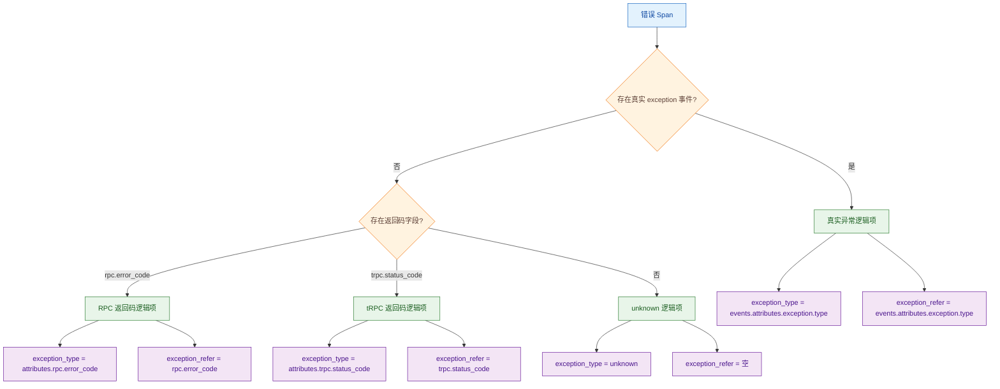
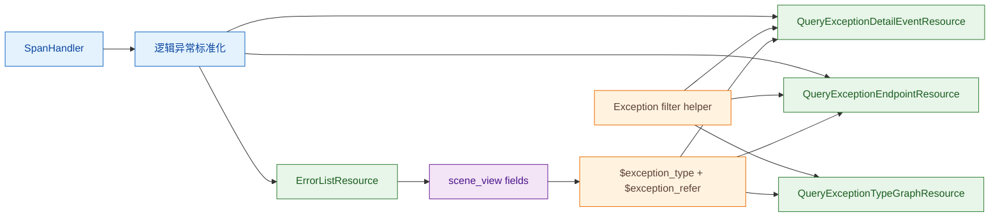

# 错误视图 tRPC 场景适配 —— 实施方案

> 基于 [README.md](./README.md) 制定。

## 0x01 调研与约束

### a. 结构判断

本方案的核心不是为 tRPC/RPC 返回码补一个特殊筛选条件，而是把错误视图的联动协议从「异常值」升级为「异常值 + 来源字段」。

现有错误页面默认把 `exception_type` 同时当作展示值、分组值和过滤字段值。

这种假设只对真实异常成立，真实异常天然来自 `events.attributes.exception.type`。

tRPC/RPC 返回码错误没有真实 `exception` 事件，错误值来自 `attributes.rpc.error_code` 或 `attributes.trpc.status_code`。

### b. 页面联动链路

错误页面的联动源是左侧任务列表。

用户选中一行后的传递路径：

1. `scene_view` 根据任务列表 target 的 `fields` 映射生成 `viewOptions.filters`。
2. 下游 panel 通过 `VariablesService.transformVariables` 替换 `$exception_type`、`$endpoint` 等变量。

| 页面区域 | 后端入口 | 当前职责 | 改造后职责 |
| --- | --- | --- | --- |
| 任务列表 | `apm_metric.errorList` | 输出 `service`、`endpoint`、`exception_type`。 | 输出逻辑异常上下文：`exception_type`、`exception_refer`。 |
| 趋势 | `apm_meta.queryExceptionTypeGraph` | 按 `events.attributes.exception.type` 过滤真实异常。 | 按 `exception_refer` 选择真实异常字段或返回码字段。 |
| 详情 | `apm_meta.queryExceptionDetailEvent` | 构造详情行，并在本地按 `exception_type` 过滤。 | 查询前收敛过滤条件，查询后只保留匹配的逻辑异常详情。 |
| 饼图 | `apm_meta.queryExceptionEndpoint` | 统计符合 `exception_type` 的服务和接口分布。 | 复用同一过滤协议统计真实异常或返回码错误分布。 |

已核对前端能力：

- `DataQuery` 会把 `targets[].fields` 转成有序字段映射。
- `CommonSelectTable.handleSelectDetail` 会把选中行映射为 `viewOptions.filters`。
- `VariablesService.transformVariables` 支持把新增变量替换到下游请求参数。

### c. 后端现状

PR [#10784](https://github.com/TencentBlueKing/bk-monitor/pull/10784) 已增加 `SpanHandler.process_rpc_span`。

它在 Span 没有真实 `exception` 事件时，根据 `rpc.error_code` 或 `trpc.status_code` 构造逻辑 `exception` 事件。

当前能力仍然只覆盖错误详情链路：

- `QueryExceptionDetailEventResource` 调用了 `SpanHandler.process_rpc_span`。
- `ErrorListResource` 仍只读取 `events.attributes.exception.type`。
- 趋势和饼图入口仍只理解真实异常事件。
- `scene_view` 配置只传递 `$exception_type`，没有传递 `$exception_refer`。

### d. 关键约束

- `exception_type` 继续表示页面分组值、展示值和过滤值，不替换成字段路径。
- `exception_refer` 只表示过滤来源字段，不参与展示文案排序。
- 真实异常优先级高于返回码逻辑异常：同一 Span 已有 `events.name = exception` 时，不再用返回码覆盖。
- 逻辑异常事件只存在于后端处理过程，不写回 Span 存储。
- 返回码筛选必须落到 `attributes.rpc.error_code` 或 `attributes.trpc.status_code`，不能用跳过 `exception_type` 过滤的方式兜底。
- 任务列表的「有 Stack」只能由真实异常堆栈决定，不能因为返回码逻辑事件存在而显示为有堆栈。

## 0x02 架构设计

### a. 逻辑异常协议

错误视图统一消费「逻辑异常」。

逻辑异常可以来自真实 `exception` 事件，也可以由 RPC/tRPC 返回码补齐，但它们必须输出同一组联动字段。



Diagram Quick Read：

- 这张图回答 `exception_type` 的值从哪里来。
- 真实异常沿用事件字段。
- RPC/tRPC 返回码只补逻辑项。
- 没有真实异常和返回码时保留 `unknown` 兼容路径。

字段契约：

| 字段 | 类型 | 必填 | 说明 |
| --- | --- | --- | --- |
| `exception_type` | `string` | 是 | 页面展示、分组和过滤值，例如 `TimeoutError`、`101`、`unknown`。 |
| `exception_refer` | `string` | 否 | `exception_type` 的来源字段，允许值为 `events.attributes.exception.type`、`rpc.error_code`、`trpc.status_code`。 |
| `exception_alias` | `string` | 否 | 展示标题别名，例如 `返回码 - 101`，不参与过滤。 |
| `exception_message` | `string` | 否 | 详情副标题，可来自真实异常消息、返回码消息或 `status.message`。 |
| `has_stack` | `bool` | 是 | 是否存在真实异常堆栈，返回码逻辑项默认 `false`。 |

### b. 过滤协议

所有下游入口只解释同一组过滤规则。

规则入口是 `exception_type + exception_refer`，输出是 query_span 的 `filter_params` 或 UnifyQuery 的 filter。

| `exception_type` | `exception_refer` | 查询字段 | 附加条件 | 语义 |
| --- | --- | --- | --- | --- |
| 空 | 任意 | 不追加异常类型过滤 | 只保留页面原有 `status.code = 2` 与服务、接口过滤。 | 概览态。 |
| `unknown` | 空 | 不追加异常类型过滤 | 保持现有 unknown 兼容口径。 | 没有真实异常和返回码字段的错误 Span。 |
| 非空 | 空或 `events.attributes.exception.type` | `events.attributes.exception.type` | 同时过滤 `events.name = exception`。 | 真实异常。 |
| 非空 | `rpc.error_code` | `attributes.rpc.error_code` | 不追加 `events.name = exception`。 | RPC 返回码错误。 |
| 非空 | `trpc.status_code` | `attributes.trpc.status_code` | 不追加 `events.name = exception`。 | tRPC 返回码错误。 |

协议不变量：

- `exception_refer` 的白名单由后端维护，未知值按默认真实异常路径处理或直接忽略，禁止拼接任意字段路径。
- `events.attributes.exception.type` 是对外联动协议值，落到 query_span 或 UnifyQuery 时再转换为各自需要的过滤字段。
- 返回码过滤只匹配同一返回码，不混入同一 `service + endpoint` 下的真实异常或其他返回码。

### c. 职责边界



Diagram Quick Read：

- 逻辑异常标准化负责从 Span 得到统一异常项。
- 过滤 helper 负责把联动协议转换成查询条件。
- `scene_view` 只传递上下文，不承载业务判断。

职责说明：

- `SpanHandler`：声明逻辑异常标准化能力，保证列表、详情和饼图拿到一致的异常项。
- `Exception filter helper`：解释过滤协议，不处理展示字段。
- `ErrorListResource`：生产联动上下文，并按 `service + endpoint + exception_type + exception_refer` 分组。
- `meta.resources` 三个下游资源：消费联动上下文，避免各接口写分散的返回码判断。
- `scene_view` 配置：只增加字段映射和请求参数，不新增前端状态机制。

## 0x03 开发方案

### a. 逻辑异常标准化

承接「逻辑异常协议」设计，在 `<源码>` bk-monitor `packages/apm_web/handlers/span_handler.py` 收敛 Span 到逻辑异常项的转换。

建议保留 `process_rpc_span` 对错误详情展示的兼容，同时新增一个更稳定的读取入口：

```python
def iter_logical_exceptions(span: dict[str, Any]) -> list[dict[str, Any]]:
    ...
```

输出字段：

| 字段 | 来源 | 说明 |
| --- | --- | --- |
| `exception_type` | 真实异常类型或返回码值。 | 分组与过滤值。 |
| `exception_refer` | 真实异常字段或返回码字段。 | 过滤来源。 |
| `exception_alias` | 真实异常类型或 `返回码 - {code}`。 | 只用于标题。 |
| `exception_message` | 真实异常消息、返回码消息或 `status.message`。 | 只用于副标题。 |
| `timestamp` | 真实事件时间或 `span.start_time`。 | 详情排序。 |
| `stacktrace` | `exception.stacktrace`。 | 返回码逻辑项为空。 |
| `has_stack` | 真实异常堆栈是否存在。 | 返回码逻辑项为 `false`。 |

实现约束：

- 真实 `events.name = exception` 优先：存在真实异常事件时，只返回真实异常逻辑项。
- 返回码优先级：先匹配 `rpc.error_code`，再匹配 `trpc.status_code`，与当前 `process_rpc_span` 保持一致。
- 列表接口查询字段必须补齐返回码、返回码消息、`status.message` 和 `start_time`。
- 返回码字段包括 `attributes.rpc.error_code` 和 `attributes.trpc.status_code`。
- 返回码消息字段包括 `attributes.rpc.error_message` 和 `attributes.trpc.status_msg`。
- 标准化函数必须容忍字段缺失。
- 缺少返回码字段时返回 `unknown` 逻辑项。

### b. 过滤 helper

承接「过滤协议」设计，在 `packages/apm_web/meta/resources.py` 或独立 handler 中声明单一 helper。

若后续 `metric.resources` 也需要构造调用链 URL 过滤，优先放到 handler 层，避免跨 resource 复制。

可选落点：

- `packages/apm_web/handlers/span_handler.py`
- `packages/apm_web/handlers/exception_handler.py`

最小协议：

```python
def build_exception_filter(exception_type: str, exception_refer: str | None) -> list[dict[str, Any]]:
    ...
```

输出规则：

| 输入 | 输出 |
| --- | --- |
| `exception_type` 为空 | `[]` |
| `exception_type = unknown` 且 `exception_refer` 为空 | `[]` |
| 默认真实异常 | `events.name = exception` 与 `events.attributes.exception.type = exception_type` |
| `rpc.error_code` | `attributes.rpc.error_code = exception_type` |
| `trpc.status_code` | `attributes.trpc.status_code = exception_type` |

`QueryExceptionTypeGraphResource` 使用同一规则的 UnifyQuery 版本：

```python
def apply_exception_filter(q: QueryConfigBuilder, exception_type: str, exception_refer: str | None) -> QueryConfigBuilder:
    ...
```

该 helper 只解释联动过滤，不生成标题、不处理堆栈、不决定分组。

### c. 错误列表

`ErrorListResource` 是联动上下文的生产者。

改造点：

| 位置 | 变更 | 目标 |
| --- | --- | --- |
| `list_error_event_spans` | 补齐返回码和消息字段。 | 让标准化函数能在列表层识别返回码错误。 |
| `parse_errors` | 使用 `SpanHandler.iter_logical_exceptions(span)`。 | 统一真实异常、返回码和 unknown 逻辑项。 |
| 分组 key | 从 `service + endpoint + exception_type` 改为 `service + endpoint + exception_type + exception_refer`。 | 避免同名真实异常类型与返回码值互相合并。 |
| `combine_errors` | 输出 `exception_refer`，并用 `has_stack` 汇总真实堆栈状态。 | 给 `scene_view` 提供下游过滤来源。 |
| 调用链 URL | 按 `exception_refer` 构造 where 过滤。 | 选中返回码行时跳转调用链仍保持同一返回码口径。 |

任务列表输出示例：

```json
{
  "service": "svc-a",
  "endpoint": "/foo",
  "exception_type": "101",
  "exception_refer": "trpc.status_code",
  "message": {
    "title": "/foo: 返回码 - 101",
    "subtitle": "timeout",
    "is_stack": "没有Stack"
  }
}
```

### d. 下游资源

下游资源全部新增 `exception_refer` 请求参数，并复用过滤 helper。

| 资源 | 查询前处理 | 查询后处理 |
| --- | --- | --- |
| `QueryExceptionDetailEventResource` | 在 `build_filter_params` 后追加 `build_exception_filter`。 | 使用逻辑异常项生成详情行，并匹配 `exception_type + exception_refer`。 |
| `QueryExceptionEndpointResource` | 在 `filter_params` 中追加同一组异常过滤。 | 按 `service + span_name` 聚合，必要时复用标准化输出。 |
| `QueryExceptionTypeGraphResource` | 调用 `apply_exception_filter` 追加 UnifyQuery 条件。 | 保持原有 `graph_unify_query` 返回结构。 |

兼容策略：

- 请求不传 `exception_refer` 时保持真实异常默认路径。
- 概览态不传 `exception_type` 时，不追加异常类型过滤。
- 返回码路径不再依赖 `_skip_exception_type_filter`，该标记可以移除或限制在过渡阶段内部使用。

### e. `scene_view` 配置

三个错误视图配置都需要传递 `$exception_refer`：

- `<源码>` bk-monitor `packages/monitor_web/scene_view/builtin/view_configs/apm_application-error.json`
- `<源码>` bk-monitor `packages/monitor_web/scene_view/builtin/view_configs/apm_service-service-default-error.json`
- `<源码>` bk-monitor `packages/monitor_web/scene_view/builtin/view_configs/apm_service-component-default-error.json`

任务列表 `fields` 增加：

```json
"fields": {
  "endpoint": "endpoint",
  "app_name": "app_name",
  "exception_type": "exception_type",
  "exception_refer": "exception_refer",
  "message": "message",
  "service_name": "service"
}
```

下游 `panels` 的三个接口请求增加：

```json
"exception_refer": "$exception_refer"
```

配置边界：

- 只改选中任务列表后的 `panels` 请求，`overview_panels` 不需要 `$exception_refer`。
- 保留现有 `$exception_type`，不把返回码字段路径塞进 `filter_params`。
- 服务实例变量和组件实例变量保持原状。

## 0x04 验收与验证

### a. 验收矩阵

| 场景 | 操作 | 预期 |
| --- | --- | --- |
| 应用错误页概览态 | 不选中任务列表行。 | 趋势、详情和饼图保持原有全量错误口径。 |
| 应用错误页真实异常 | 选中真实异常行。 | 请求携带 `exception_refer = events.attributes.exception.type`，下游只展示该真实异常类型。 |
| 应用错误页 tRPC 返回码 | 选中 tRPC 返回码行。 | 请求携带 `exception_refer = trpc.status_code`，下游只展示该返回码错误。 |
| 应用错误页 RPC 返回码 | 选中 RPC 返回码行。 | 请求携带 `exception_refer = rpc.error_code`，下游只展示该返回码错误。 |
| 服务错误页 | 在 service 与 component 两类服务错误视图重复上述场景。 | 三个同构页面联动行为一致。 |
| 混合错误 | 同一 `service + endpoint` 下同时存在真实异常、RPC 返回码和 tRPC 返回码。 | 任务列表拆成不同逻辑异常行，选中任一行不会混入其他错误来源。 |
| 调用链跳转 | 从返回码错误行点击调用链。 | Trace 检索 where 条件使用返回码字段，而不是 `events.attributes.exception.type`。 |

### b. 测试建议

优先补充后端单元测试，覆盖协议函数和资源行为：

| 测试对象 | 建议用例 | 断言重点 |
| --- | --- | --- |
| `SpanHandler.iter_logical_exceptions` | `test_iter_logical_exceptions_prioritize_real_exception` | 真实异常存在时不生成返回码逻辑项。 |
| `SpanHandler.iter_logical_exceptions` | `test_iter_logical_exceptions_build_rpc_code_exception` | RPC 返回码输出 `exception_type`、`exception_refer` 和消息。 |
| `SpanHandler.iter_logical_exceptions` | `test_iter_logical_exceptions_build_trpc_code_exception` | tRPC 返回码输出 `exception_type`、`exception_refer` 和消息。 |
| 过滤 helper | `test_build_exception_filter_for_real_exception` | 真实异常同时追加 `events.name` 与异常类型过滤。 |
| 过滤 helper | `test_build_exception_filter_for_rpc_and_trpc_code` | 返回码过滤映射到 `attributes.*` 字段。 |
| `ErrorListResource` | `test_error_list_group_by_exception_refer` | 同值不同来源不会被合并。 |
| `QueryExceptionTypeGraphResource` | `test_exception_type_graph_filter_by_exception_refer` | UnifyQuery 条件按来源字段切换。 |

配置验证：

- 校验三个 `scene_view` JSON 文件可以正常加载。
- 校验三个 selector panel 的 `fields` 都包含 `exception_refer`。
- 校验三个错误视图下游 `panels` 都传递 `exception_refer`。

## 0x05 实施进展

| 时间 | 对应设计片段 | 结论调整概要 | 改动 / 验证 |
| --- | --- | --- | --- |
| `2026-06-01 00:00` | 逻辑异常协议、过滤协议、三类错误视图联动 | [1] 方案从「新增 `exception_refer` 字段」收敛为「逻辑异常标准化 + 单一过滤 helper + scene_view 变量传递」三层结构。<br />[2] 补充 `has_stack`、调用链 URL、服务组件错误页和 unknown 兼容边界，避免返回码逻辑事件污染真实异常语义。 | [1] 已核对 `SpanHandler.process_rpc_span`、`ErrorListResource`、`QueryExceptionDetailEventResource`、`QueryExceptionEndpointResource` 和 `QueryExceptionTypeGraphResource`。<br />[2] 已核对 `DataQuery`、`CommonSelectTable.handleSelectDetail`、`VariablesService.transformVariables` 与三个错误视图配置。 |
| `2026-05-31 00:00` | 前端变量链路、双字段联动协议 | [1] 已确认当前前端变量链路支持 `$exception_refer`。<br />[2] 初版方案收敛为 `exception_type + exception_refer` 双字段协议。 | [1] 已核对 `VariablesService`、`CommonSelectTable` 和 `DataQuery`。<br />[2] 已记录应用错误页与服务错误页配置落点。 |

## 0x06 参考

- `<源码>` bk-monitor `packages/apm_web/handlers/span_handler.py`
- `<源码>` bk-monitor `packages/apm_web/metric/resources.py`
- `<源码>` bk-monitor `packages/apm_web/meta/resources.py`
- `<源码>` bk-monitor `constants/apm.py`
- `<源码>` bk-monitor `webpack/src/monitor-ui/chart-plugins/utils/variable.ts`
- `<源码>` bk-monitor `webpack/src/monitor-ui/chart-plugins/typings/dashboard-panel.ts`
- `<源码>` bk-monitor `webpack/src/monitor-pc/pages/monitor-k8s/components/common-select-table/common-select-table.tsx`
- `<源码>` bk-monitor `packages/monitor_web/scene_view/builtin/view_configs/apm_application-error.json`
- `<源码>` bk-monitor `packages/monitor_web/scene_view/builtin/view_configs/apm_service-service-default-error.json`
- `<源码>` bk-monitor `packages/monitor_web/scene_view/builtin/view_configs/apm_service-component-default-error.json`

## 0x07 版本锚点

- 分支：`feat/trpc_error_display_info_opt/#1010158081134636736`
- PR：[TencentBlueKing/bk-monitor #10784](https://github.com/TencentBlueKing/bk-monitor/pull/10784)
