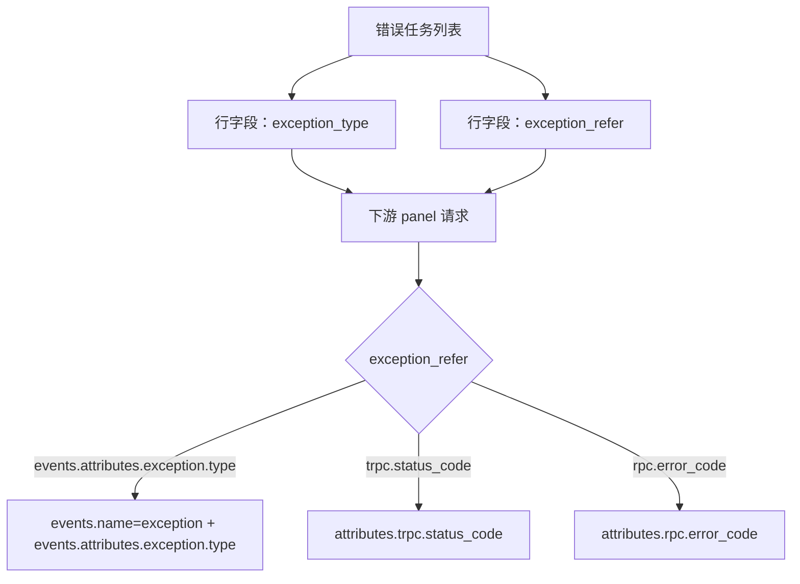

# 错误视图 tRPC 场景适配 —— 实施方案

> 基于 [README.md](./README.md) 制定。

## 0x01 调研与约束

### a. 页面结构

APM 错误页面的联动源是左侧任务列表。

用户选中一行后，后续 panel 通过 `scene_view` 变量拿到行数据中的字段。

| 页面区域 | 后端入口 | 当前联动字段 |
| --- | --- | --- |
| 任务列表 | `apm_metric.errorList` | 输出 `endpoint`、`service`、`exception_type` 等行字段。 |
| 趋势 | `apm_meta.queryExceptionTypeGraph` | 消费 `$exception_type`。 |
| 详情 | `apm_meta.queryExceptionDetailEvent` | 消费 `$exception_type`。 |
| 饼图 | `apm_meta.queryExceptionEndpoint` | 消费 `$exception_type`。 |

### b. 已确认前端能力

当前前端支持新增 `$exception_refer`，不需要额外新增状态机制。

确认依据：

- `DataQuery` 会把 `targets[].fields` 转成有序映射，并在行选中时从行数据生成 `viewOptions.filters`。
- `CommonSelectTable.handleSelectDetail` 会把行选中结果写入 `viewOptions.filters`。
- 下游 panel 使用 `VariablesService.transformVariables` 替换 `$exception_type`、`$endpoint` 等变量。
- 因此，只要任务列表行数据返回 `exception_refer`，并在 view config 的 `fields` 中增加映射，下游 panel 可以直接使用 `$exception_refer`。

### c. 关键约束

- `exception_type` 继续作为错误分组和页面展示值，不能被替换成字段路径。
- `exception_refer` 只表达过滤来源，不表达展示文案。
- tRPC/RPC 特殊 Event 是逻辑事件，不写回 Span 存储。
- 后端接口不能把所有返回码事件无条件绕过 `exception_type` 过滤，否则会混入同接口下的其他异常。

## 0x02 架构设计

核心设计是把「异常值」和「异常值来源」拆开。



协议语义：

| 字段 | 语义 | 示例 |
| --- | --- | --- |
| `exception_type` | 页面分组值和过滤值。 | `101`、`timeout`、`unknown` |
| `exception_refer` | `exception_type` 的来源字段。 | `events.attributes.exception.type`、`trpc.status_code` |
| `exception_alias` | 可选展示别名，不参与过滤。 | `返回码 - 101` |

过滤选择规则：

| `exception_refer` | 查询字段 | 附加条件 |
| --- | --- | --- |
| 空值或 `events.attributes.exception.type` | `events.attributes.exception.type` | 同时过滤 `events.name = exception`。 |
| `trpc.status_code` | `attributes.trpc.status_code` | 过滤值取 `exception_type`。 |
| `rpc.error_code` | `attributes.rpc.error_code` | 过滤值取 `exception_type`。 |

## 0x03 开发方案

### a. 逻辑异常标准化

在 Span 处理层沉淀逻辑异常标准化能力，供错误列表、详情、饼图等接口复用。

建议统一输出下面的内部结构：

| 字段 | 来源 | 说明 |
| --- | --- | --- |
| `exception_type` | 真实事件或返回码字段 | 分组与过滤值。 |
| `exception_refer` | 真实事件或返回码字段名 | 过滤来源。 |
| `exception_alias` | 真实事件类型或返回码展示名 | 只用于标题。 |
| `exception_message` | 事件消息、返回码消息或 `status.message` | 只用于副标题。 |

实现约束：

- 优先保留真实 `events.name = exception` 事件，避免覆盖已有异常语义。
- 无真实异常事件时，再根据 `rpc.error_code` 或 `trpc.status_code` 构造逻辑异常。
- 列表接口若只查询部分字段，必须补齐标准化需要的 `attributes.*`、`status.message` 和时间字段，或让标准化函数容忍缺失时间。

### b. 后端接口联动

任务列表负责输出联动上下文，其他接口只消费该上下文。

| 接口 | 改造方式 | 输出 / 输入 |
| --- | --- | --- |
| `ErrorListResource` | 解析真实异常与返回码逻辑异常，并按 `service + endpoint + exception_type + exception_refer` 分组。 | 输出 `exception_type` 与 `exception_refer`。 |
| `QueryExceptionDetailEventResource` | 根据 `exception_refer` 构造查询过滤，再生成详情行。 | 输入 `exception_type` 与 `exception_refer`。 |
| `QueryExceptionEndpointResource` | 统计服务与接口分布时使用相同过滤选择规则。 | 输入 `exception_type` 与 `exception_refer`。 |
| `QueryExceptionTypeGraphResource` | 趋势查询按 `exception_refer` 选择事件字段或返回码字段。 | 输入 `exception_type` 与 `exception_refer`。 |

过滤构造建议收敛为单一 helper：

```python
def build_exception_filter(exception_type: str, exception_refer: str | None) -> dict:
    ...
```

该 helper 只解释过滤协议，不处理展示字段。

各资源入口只把返回值转换成自身需要的 `filter_params` 或 UnifyQuery 条件。

### c. `scene_view` 配置

应用错误页与服务错误页都需要把 `exception_refer` 从任务列表传给下游 panel。

任务列表字段映射增加：

```json
"fields": {
  "endpoint": "endpoint",
  "app_name": "app_name",
  "exception_type": "exception_type",
  "exception_refer": "exception_refer",
  "message": "message",
  "service_name": "service"
}
```

下游 panel 请求增加：

```json
"exception_refer": "$exception_refer"
```

应用范围：

- `packages/monitor_web/scene_view/builtin/view_configs/apm_application-error.json`
- `packages/monitor_web/scene_view/builtin/view_configs/apm_service-service-default-error.json`

同构页面可按相同规则检查，例如组件服务错误页。

## 0x04 验收与验证

- 应用错误页概览态：不选中任务列表行时，趋势、详情和饼图维持原有全量错误口径。
- 应用错误页选中真实异常：请求参数携带 `exception_refer = events.attributes.exception.type`，结果只包含对应真实异常类型。
- 应用错误页选中 tRPC/RPC 返回码错误：请求参数携带 `exception_refer`，结果只包含对应返回码。
- 服务错误页覆盖相同 `3` 类场景。
- 同一 `service + endpoint` 下同时存在真实异常与返回码错误时，选中任一行不会混入另一类错误。
- PR [#10784](https://github.com/TencentBlueKing/bk-monitor/pull/10784) 中的错误详情展示能力保持可用。

## 0x05 实施进展

| 时间 | 对应设计片段 | 结论调整概要 | 改动 / 验证 |
| --- | --- | --- | --- |
| `2026-05-31 00:00` | `0x01.b` `0x02` `0x03.c` | [1] 已确认当前前端变量链路支持 `$exception_refer`。<br />[2] 方案收敛为 `exception_type + exception_refer` 双字段协议。 | [1] 已核对 `VariablesService`、`CommonSelectTable` 和 `DataQuery`。<br />[2] 已记录应用错误页与服务错误页配置落点。 |

## 0x06 参考

- `<源码>` `webpack/src/monitor-ui/chart-plugins/utils/variable.ts`
- `<源码>` common-select-table 目录：`webpack/src/monitor-pc/pages/monitor-k8s/components/common-select-table/`
- `<源码>` common-select-table 文件：`common-select-table.tsx`
- `<源码>` `webpack/src/monitor-ui/chart-plugins/typings/dashboard-panel.ts`
- `<源码>` `packages/monitor_web/scene_view/builtin/view_configs/apm_application-error.json`
- `<源码>` view config 文件：`apm_service-service-default-error.json`
- `<源码>` bk-monitor/bkmonitor/packages/apm_web/handlers/span_handler.py
- `<源码>` bk-monitor/bkmonitor/packages/apm_web/meta/resources.py
- `<源码>` bk-monitor/bkmonitor/packages/apm_web/metric/resources.py

## 0x07 版本锚点

- 分支：`feat/trpc_error_display_info_opt/#1010158081134636736`
- PR：[TencentBlueKing/bk-monitor #10784](https://github.com/TencentBlueKing/bk-monitor/pull/10784)
