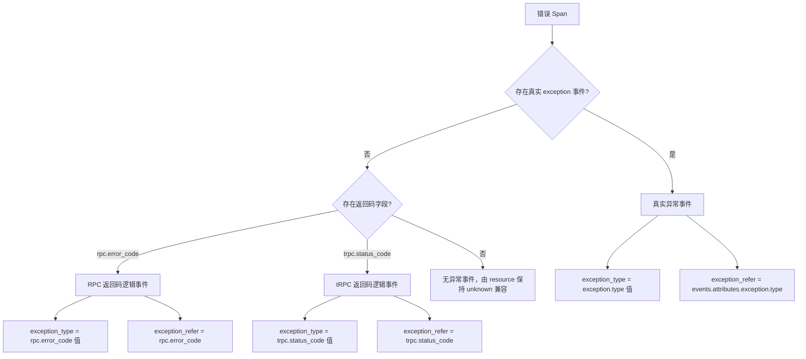
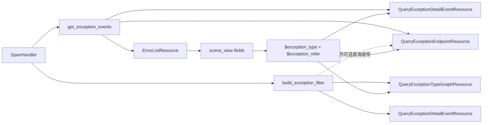

# 错误视图 tRPC 场景适配 —— 实施方案

> 基于 [README.md](./README.md) 制定。

## 0x01 调研与约束

### a. 结构判断

本方案的核心不是为 tRPC/RPC 返回码补一个特殊过滤条件，而是把错误视图的联动协议从「异常值」升级为「异常值 + 来源字段」。

现有错误页面默认把 `exception_type` 同时当作展示值、分组值和过滤字段值。

这一假设只对真实异常成立，因为真实异常天然来自 `events.attributes.exception.type`。

tRPC/RPC 返回码错误没有真实 `exception` 事件，错误值来自 `attributes.rpc.error_code` 或 `attributes.trpc.status_code`。

### b. 页面联动链路

错误页面的联动源是左侧任务列表。用户选中一行后的传递路径：

1. `scene_view` 根据任务列表 `target` 的 `fields` 映射生成 `viewOptions.filters`。
2. 下游 panel 通过 `VariablesService.transformVariables` 替换 `$exception_type`、`$endpoint` 等变量。

| 页面区域 | 后端入口 | 当前职责 | 改造后职责 |
| --- | --- | --- | --- |
| 任务列表 | `apm_metric.errorList` | 输出 `service`、`endpoint`、`exception_type`。 | 输出 `exception_type` 与 `exception_refer`。 |
| 趋势 | `apm_meta.queryExceptionTypeGraph` | 按 `events.attributes.exception.type` 过滤。 | 按 `exception_refer` 构造时间序列查询条件。 |
| 详情 | `apm_meta.queryExceptionDetailEvent` | 详情链路已能补返回码事件。 | 按 `exception_type + exception_refer` 精确过滤详情行。 |
| 饼图 | `apm_meta.queryExceptionEndpoint` | 查后按异常类型聚合。 | 查后按逻辑异常事件聚合。 |

### c. 后端瓶颈

PR [#10784](https://github.com/TencentBlueKing/bk-monitor/pull/10784) 已合入。

它已在 `SpanHandler.process_rpc_span` 中为错误详情补充返回码逻辑事件。

当前瓶颈在联动层：任务列表、趋势和饼图仍以 `events.attributes.exception.type` 作为唯一异常来源。

瓶颈表现：`scene_view` 只传递 `$exception_type`，下游无法判断来源字段。

### d. 本轮边界

- 不改 Span 存储结构，不要求采集端补真实异常事件。
- `exception_type` 继续表示展示、分组和过滤值。
- `exception_refer` 只表示 `exception_type` 的来源字段。
- 真实 `exception` 事件优先于返回码字段。

## 0x02 架构设计

### a. 逻辑异常协议

错误视图统一消费「逻辑异常事件」。

事件可以来自真实 `exception`，也可以由 `SpanHandler.process_rpc_span` 基于 RPC/tRPC 返回码构造。



核心字段：

| 字段 | 类型 | 必填 | 说明 |
| --- | --- | --- | --- |
| `exception_type` | `string` | 是 | 页面展示、分组和过滤值，例如 `TimeoutError`、`101`、`unknown`。 |
| `exception_refer` | `string` | 否 | `exception_type` 的来源字段，允许值为 `events.attributes.exception.type`、`rpc.error_code`、`trpc.status_code`。 |

展示标题、消息和堆栈信息属于资源输出层，不放在架构协议中重复定义。

### b. 条件构造协议

`SpanHandler` 统一声明条件构造函数：

```python
def build_exception_filter(
    exception_type: str,
    exception_refer: str | None,
    operator_key: str = "op",
) -> list[dict[str, Any]]:
    ...
```

函数只把联动协议转换为查询条件，不决定资源是否必须前置过滤。

条件映射：

```text
空 exception_type
  -> []

exception_type = unknown 且 exception_refer 为空
  -> []

exception_refer 为空或 events.attributes.exception.type
  -> events.name = exception
  -> events.attributes.exception.type = $exception_type

exception_refer = rpc.error_code
  -> attributes.rpc.error_code = $exception_type

exception_refer = trpc.status_code
  -> attributes.trpc.status_code = $exception_type
```

约束：

- `exception_refer` 必须走白名单映射，禁止把请求值直接拼成任意字段路径。
- 返回码路径只匹配同一返回码值，不借 `_skip_exception_type_filter` 绕过过滤。
- `QueryExceptionEndpointResource` 现状是查询后聚合，是否能把返回码条件前置只能在代码改造时验证。

### c. 职责边界



职责说明：

- `SpanHandler`：收口逻辑异常事件读取和过滤条件构造。
- `ErrorListResource`：生产联动上下文，分组 key 仍保持 `service + endpoint + exception_type`。
- `QueryExceptionDetailEventResource`：可用 `build_exception_filter` 前置缩小 Span 查询范围，并在事件层精确匹配。
- `QueryExceptionTypeGraphResource`：按相同映射构造 UnifyQuery 条件。
- `QueryExceptionEndpointResource`：当前按 Span 查询结果后置聚合，先补逻辑异常事件读取，再评估前置过滤是否安全。
- `scene_view` 配置：只传递联动上下文，不承载业务判断。

## 0x03 开发方案

### a. `SpanHandler`

承接「逻辑异常协议」和「条件构造协议」，在 `<源码>` bk-monitor `bkmonitor/packages/apm_web/handlers/span_handler.py` 收口公共能力。

| 变更点 | 目标 |
| --- | --- |
| **[Keep]** `process_rpc_span(span)` | 保留 PR #10784 已合入能力，继续把返回码 Span 补成逻辑异常事件。 |
| **[Add]** `get_exception_events(span)` *[1]* | 返回真实异常事件或返回码逻辑事件，空列表由 resource 保持 `unknown` 兼容。 |
| **[Add]** `build_exception_filter(...)` | 输出查询条件，供详情、趋势和调用链 URL 复用。 |

*[1] 字段补齐范围*：列表、详情和饼图查询需补齐 `get_exception_events(span)` 依赖的返回码字段。

- 返回码字段包括 `attributes.rpc.error_code`、`attributes.rpc.error_message`。
- tRPC 字段包括 `attributes.trpc.status_code` 和 `attributes.trpc.status_msg`。
- 返回码事件继续写入 `exception.refer`、`exception.alias` 和 `exception.message`。
- 真实异常存在时不构造返回码逻辑事件。

### b. `ErrorListResource`

`ErrorListResource` 是 `scene_view` 联动上下文的生产者，落点在 `<源码>` bk-monitor `bkmonitor/packages/apm_web/metric/resources.py`。

| 位置 | 变更 | 目标 |
| --- | --- | --- |
| `list_error_event_spans` | 查询字段补齐返回码与返回码消息。 | 让列表层可以识别返回码错误。 |
| `parse_errors` | 使用 `SpanHandler.get_exception_events(span)`。 | 统一真实异常、返回码和 `unknown` 处理。 |
| `handle_error_map` | 分组 key 保持 `service + endpoint + exception_type`。 | 不引入伪场景分裂。 |
| `combine_errors` | 输出 `exception_refer`。 | 给 `scene_view` 下游 panel 提供来源字段。 |
| `get_pagination_data` | 调用 `SpanHandler.build_exception_filter(..., operator_key="operator")` 拼接调用链 `where`。 | 调用链跳转与当前选中错误来源一致。 |

调用链 `where` 拼接规则：

```text
基础条件：
  resource.service.name = 当前行 service
  span_name = 当前行 endpoint
  status.code = 2

追加条件：
  SpanHandler.build_exception_filter(exception_type, exception_refer, operator_key="operator")
```

`message.is_stack` 保持现有输出文案：

- 有堆栈：`有Stack`
- 无堆栈：`没有Stack`

请求侧的 `check_filter_dict.is_stack` 仍是 bool 值。

### c. 下游资源

下游资源新增 `exception_refer` 请求参数，但各资源不能盲目套同一种前置过滤方式。

| 资源 | 改造方式 | 边界 |
| --- | --- | --- |
| `QueryExceptionDetailEventResource` | 查询前追加 `SpanHandler.build_exception_filter`，查询后用 `get_exception_events` 按 `exception_type + exception_refer` 匹配详情行。 | 移除 `_skip_exception_type_filter` 绕过逻辑。 |
| `QueryExceptionTypeGraphResource` | 将 `build_exception_filter` 的字段映射转换为 `q.filter(...)`。 | 保持 `graph_unify_query` 返回结构。 |
| `QueryExceptionEndpointResource` | 查询字段补齐返回码字段，聚合前使用 `get_exception_events` 生成逻辑异常事件。 | 当前是后置聚合，前置条件只能作为性能收窄，不能替代后置匹配。 |

兼容策略：

- 请求不传 `exception_refer` 时按真实异常路径处理。
- 概览态不传 `exception_type` 时不追加异常类型条件。
- `unknown` 继续表示无真实异常事件且无返回码逻辑事件的错误 Span。

### d. `scene_view` 配置

三个错误视图配置都需要传递 `$exception_refer`。

配置目录：`bkmonitor/packages/monitor_web/scene_view/builtin/view_configs/`

- `apm_application-error.json`
- `apm_service-service-default-error.json`
- `apm_service-component-default-error.json`

任务列表 `fields` 增加：

```json
"fields": {
  "endpoint": "endpoint",
  "app_name": "app_name",
  "exception_type": "exception_type",
  "exception_refer": "exception_refer",
  "message": "message",
  "service_name": "service"
}
```

下游 `panels` 的三个接口请求增加：

```json
"exception_refer": "$exception_refer"
```

配置边界：

- 只改选中任务列表后的 `panels` 请求，`overview_panels` 不需要 `$exception_refer`。
- 保留现有 `$exception_type`，不把返回码字段路径塞进 `filter_params`。
- 服务实例变量和组件实例变量保持原状。

## 0x04 验收与验证

### a. 验收矩阵

| 场景 | 操作 | 预期 |
| --- | --- | --- |
| 应用错误页概览态 | 不选中任务列表行。 | 趋势、详情和饼图保持原有全量错误口径。 |
| 应用错误页真实异常 | 选中真实异常行。 | 请求携带 `exception_refer = events.attributes.exception.type`，下游只展示该真实异常类型。 |
| 应用错误页 tRPC 返回码 | 选中 tRPC 返回码行。 | 请求携带 `exception_refer = trpc.status_code`，下游只展示该返回码错误。 |
| 应用错误页 RPC 返回码 | 选中 RPC 返回码行。 | 请求携带 `exception_refer = rpc.error_code`，下游只展示该返回码错误。 |
| 服务错误页 | 在 service 与 component 两类服务错误视图重复上述场景。 | 三个同构页面联动行为一致。 |
| 饼图联动 | 选中返回码错误行。 | `QueryExceptionEndpointResource` 查后聚合结果只统计该返回码来源。 |
| 调用链跳转 | 从返回码错误行点击调用链。 | Trace 检索 `where` 使用返回码字段，而不是 `events.attributes.exception.type`。 |

### b. 测试建议

优先补充后端单元测试，覆盖协议函数和资源行为：

| 测试对象 | 建议用例 | 断言重点 |
| --- | --- | --- |
| `SpanHandler.get_exception_events` | `test_get_exception_events_prioritize_real_exception` | 真实异常存在时不生成返回码逻辑事件。 |
| `SpanHandler.get_exception_events` | `test_get_exception_events_build_rpc_code_event` | RPC 返回码输出 `exception_type` 与 `exception.refer`。 |
| `SpanHandler.get_exception_events` | `test_get_exception_events_build_trpc_code_event` | tRPC 返回码输出 `exception_type` 与 `exception.refer`。 |
| `SpanHandler.build_exception_filter` | `test_build_exception_filter_for_real_exception` | 真实异常追加 `events.name` 与异常类型条件。 |
| `SpanHandler.build_exception_filter` | `test_build_exception_filter_for_rpc_and_trpc_code` | 返回码条件映射到 `attributes.*` 字段。 |
| `ErrorListResource` | `test_error_list_emit_exception_refer_without_changing_group_key` | 列表输出 `exception_refer`，分组 key 不新增来源字段。 |
| `QueryExceptionEndpointResource` | `test_exception_endpoint_post_filter_by_exception_refer` | 饼图聚合按 `exception_type + exception_refer` 后置匹配。 |
| `QueryExceptionTypeGraphResource` | `test_exception_type_graph_filter_by_exception_refer` | UnifyQuery 条件按来源字段切换。 |

配置验证：

- 校验三个 `scene_view` JSON 文件可以正常加载。
- 校验三个 selector panel 的 `fields` 都包含 `exception_refer`。
- 校验三个错误视图下游 `panels` 都传递 `exception_refer`。

## 0x05 实施进展

| 时间 | 结论性进展 |
| --- | --- |
| `2026-06-01 21:00` | [a] 回归 `SpanHandler`、`ErrorListResource`、三个下游 resource 和 `scene_view` 配置后，方案收敛为 `SpanHandler` 统一异常事件读取与条件构造。<br />[b] 修正 `QueryExceptionEndpointResource` 为后置聚合边界，确认 PR #10784 已合入，新 PR 分支待定。 |
| `2026-05-31 00:00` | [a] 确认前端变量链路支持 `$exception_refer`。<br />[b] 初版联动协议收敛为 `exception_type + exception_refer`，并记录应用错误页与服务错误页配置落点。 |

## 0x06 参考 & 版本锚点

### a. 参考

- PR：[TencentBlueKing/bk-monitor #10784](https://github.com/TencentBlueKing/bk-monitor/pull/10784)
- `<源码>` [span_handler.py][src-span-handler]
- `<源码>` [metric/resources.py][src-metric-resources]
- `<源码>` [meta/resources.py][src-meta-resources]
- `<源码>` [constants/apm.py][src-constants-apm]
- `<源码>` [apm_application-error.json][src-app-error]
- `<源码>` [apm_service-service-default-error.json][src-service-error]
- `<源码>` [apm_service-component-default-error.json][src-component-error]

[src-span-handler]: https://github.com/TencentBlueKing/bk-monitor/blob/master/bkmonitor/packages/apm_web/handlers/span_handler.py
[src-metric-resources]: https://github.com/TencentBlueKing/bk-monitor/blob/master/bkmonitor/packages/apm_web/metric/resources.py
[src-meta-resources]: https://github.com/TencentBlueKing/bk-monitor/blob/master/bkmonitor/packages/apm_web/meta/resources.py
[src-constants-apm]: https://github.com/TencentBlueKing/bk-monitor/blob/master/bkmonitor/constants/apm.py
[src-app-error]: https://github.com/TencentBlueKing/bk-monitor/blob/master/bkmonitor/packages/monitor_web/scene_view/builtin/view_configs/apm_application-error.json
[src-service-error]: https://github.com/TencentBlueKing/bk-monitor/blob/master/bkmonitor/packages/monitor_web/scene_view/builtin/view_configs/apm_service-service-default-error.json
[src-component-error]: https://github.com/TencentBlueKing/bk-monitor/blob/master/bkmonitor/packages/monitor_web/scene_view/builtin/view_configs/apm_service-component-default-error.json

### b. 版本锚点

| 状态 | 分支 | 里程碑 | PR |
| --- | --- | --- | --- |
| ✅ | `feat/trpc_error_display_info_opt/#1010158081134636736` | 里程碑 1：错误详情返回码信息展示 | [#10784](https://github.com/TencentBlueKing/bk-monitor/pull/10784) |
| 🔄 | `<branch_name>` | 里程碑 2：错误视图返回码联动适配 | 待创建 |
