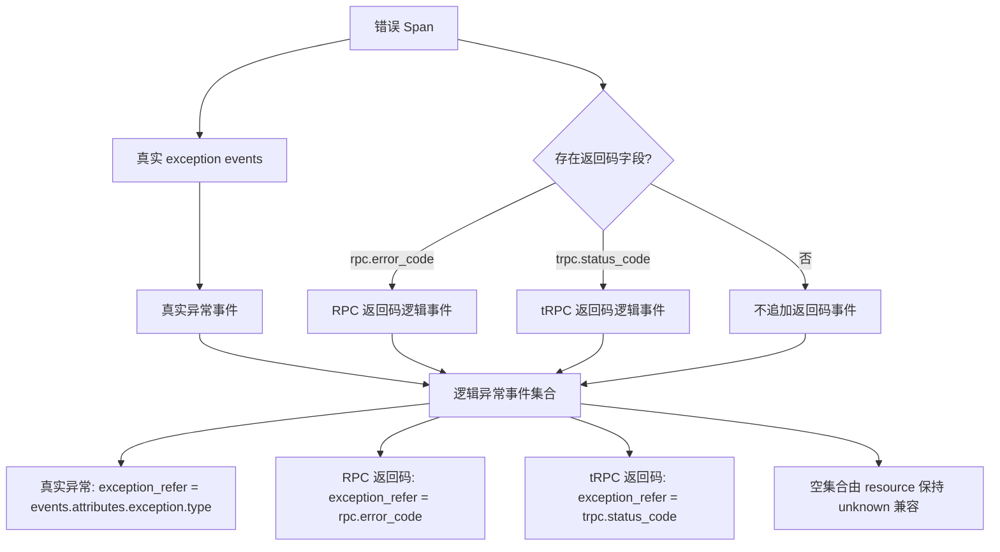
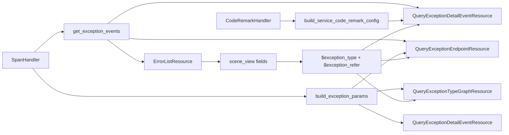

# 错误视图 tRPC 场景适配 —— 实施方案

## 0x01 调研与约束

### a. 结构判断

本方案的核心不是为 tRPC/RPC 返回码补一个特殊过滤条件，而是把错误视图协议从「单一异常值」升级为「展示别名 + 分组值 + 来源字段」。

现有错误页面默认把 `exception_type` 同时当作展示值、分组值和过滤字段值。

这一假设只对真实异常成立，因为真实异常天然来自 `events.attributes.exception.type`。

tRPC/RPC 返回码错误没有真实 `exception` 事件，错误值来自 `attributes.rpc.error_code` 或 `attributes.trpc.status_code`。

### b. 页面联动链路

错误页面的联动源是左侧错误列表 selector，对应后端入口 `apm_metric.errorList`。

用户选中一行后的传递路径：

1. `scene_view` 根据 `options.selector_panel.targets[].fields` 映射生成 `viewOptions.filters`。
2. 下游 panel 通过 `VariablesService.transformVariables` 替换 `$exception_type`、`$endpoint` 等变量。

| 页面区域          | 后端入口                                 | 当前职责                                      | 改造后职责                                         |
|---------------|--------------------------------------|-------------------------------------------|-----------------------------------------------|
| 错误列表 selector | `apm_metric.errorList`               | 输出 `service`、`endpoint`、`exception_type`。 | 输出 `exception_type`、`exception_alias` 与 `exception_refer`。 |
| 趋势            | `apm_meta.queryExceptionTypeGraph`   | 按 `events.attributes.exception.type` 过滤。  | 按 `exception_refer` 构造时间序列查询条件。               |
| 详情            | `apm_meta.queryExceptionDetailEvent` | 详情链路已能补返回码事件。                             | 按 `exception_type + exception_refer` 精确过滤详情行。 |
| 饼图            | `apm_meta.queryExceptionEndpoint`    | 查后按异常类型聚合。                                | 前置收窄后按逻辑异常事件聚合。                               |

### c. 后端瓶颈

PR [#10784](https://github.com/TencentBlueKing/bk-monitor/pull/10784) 已合入。

它已在 `SpanHandler.process_rpc_span` 中为错误详情补充返回码逻辑事件。

当前瓶颈同时存在于联动层和展示层：

- 联动层：错误列表 selector、趋势和饼图仍以 `events.attributes.exception.type` 作为唯一异常来源。
- 展示层：错误列表标题直接拼接 `endpoint: exception_type`。

瓶颈表现包括两点：

- `scene_view` 只传递 `$exception_type`，下游无法判断来源字段。
- 返回码错误行只能展示成 `/trpc.xxx/Method: 111`，无法表达 `111` 是返回码。


## 0x02 架构设计

### a. 逻辑异常协议

错误视图统一消费「逻辑异常事件集合」。

集合来源采用并集语义：真实 `exception` events 逐个保留，RPC/tRPC 返回码命中时由 `SpanHandler.process_rpc_span` 追加返回码逻辑事件。

这两类来源不互斥。

同一个 Span 既有真实异常事件又有 RPC/tRPC 返回码时，两个来源都应进入下游错误列表、详情和接口分布。



核心字段：

| 字段                | 类型       | 必填 | 说明                                                                                                       |
|-------------------|----------|----|----------------------------------------------------------------------------------------------------------|
| `exception_type`  | `string` | 是  | 页面分组和过滤值，例如 `TimeoutError`、`101`、`unknown`。                                      |
| `exception_alias` | `string` | 是  | 页面基础展示别名，例如 `TimeoutError`、`返回码 - 101`。                                                     |
| `exception_refer` | `string` | 否  | [a] tRPC 场景：命中字段名 `rpc.error_code` > `trpc.status_code`<br />[b] 标准场景：`events.attributes.exception.type` |

返回码场景中，`exception_type` 保持原始 code，不拼展示文案。

`exception_alias` 不包含返回码备注。

### b. 职责边界



#### `SpanHandler` 统一声明条件参数构造函数

```text
build_exception_params(
    exception_type: str, exception_refer: str | None, operator_key: str = "op",
) -> list[dict[str, Any]]
```

#### `CodeRemarkHandler` 统一声明服务视角备注协议

```text
build_service_code_remark_config(
    remark_configs: list[dict[str, Any]],
    service_name: str,
    kind: str,
) -> dict[str, str]
```

协议语义：

- 复用 `GetCodeRemarksResource` 服务视角结果。
- `service_config[code]` 表示当前服务和调用方向下的返回码备注。
- 命中备注时标题展示为 `返回码 - code（remark）`，未命中时保持 `返回码 - code`。
- 返回码备注只在错误详情 title 组装阶段追加，不回写 `exception_alias`。

调用方向映射：

| Span `kind`                             | 返回码备注 `kind` |
|-----------------------------------------|--------------|
| `SPAN_KIND_CLIENT`、`SPAN_KIND_PRODUCER` | `caller`     |
| `SPAN_KIND_SERVER`、`SPAN_KIND_CONSUMER` | `callee`     |
| 其他或空值                                   | 不匹配返回码备注。    |

#### `exception_type` 过滤机制

`QueryExceptionDetailEventResource` & `QueryExceptionEndpointResource`：
* 使用 `build_exception_params` 进行前置过滤。 
* 由于同一 Span 内可能存在多个异常事件，现有的后置事件匹配仍然保留。

* `QueryExceptionTypeGraphResource`：按相同映射构造 UnifyQuery 条件。


## 0x03 开发方案

### a. `SpanHandler`

承接「逻辑异常协议」和「条件参数协议」，在 `<源码>` bk-monitor `bkmonitor/packages/apm_web/handlers/span_handler.py` 收口公共能力。

| 变更点                                                                                    | 目标                                        |
|----------------------------------------------------------------------------------------|-------------------------------------------|
| **[Keep]** `process_rpc_span(span)`                                                    | 保留 PR #10784 已合入能力，按并集语义把返回码 Span 补成逻辑异常事件。 |
| **[Add]** `get_exception_events(span)` *[1]*                                           | 返回标准逻辑异常事件，空列表由 resource 保持 `unknown` 兼容。 |
| **[Add]** `build_exception_params(exception_type, exception_refer, operator_key="op")` | 输出查询条件参数，供详情、趋势和调用链 URL 复用。               |

* *[1] 返回标准协议：`get_exception_events(span)` 对真实异常事件和返回码逻辑事件输出同构字段。*

`process_rpc_span` 实现约束：

- 不因已有真实 `exception` event 提前返回。
- 先保留 `span[events]` 原有内容，再在命中 RPC/tRPC 返回码时追加返回码逻辑事件。
- 返回码空值判断保留 `code is None or code == ""`，并补充注释说明不使用 `if not code`，避免数值型错误码 `0` 被误判为空。

| 字段                  | 类型       | 来源字段                                                                                                                           | 说明                        |
|---------------------|----------|--------------------------------------------------------------------------------------------------------------------------------|---------------------------|
| `exception_type`    | `string` | [a] tRPC 场景：`attributes.rpc.error_code` > `attributes.trpc.status_code`<br />[b] 标准场景：`events.attributes.exception.type`       | 页面分组和过滤值。                  |
| `exception_refer`   | `string` | [a] tRPC 场景：命中字段名 `rpc.error_code` > `trpc.status_code`<br />[b] 标准场景：`events.attributes.exception.type`                       | `exception_type` 的来源字段标识。 |
| `exception_alias`   | `string` | [a] tRPC 场景：逻辑事件 `exception.alias`<br />[b] 标准场景：`exception.alias` > `exception_type`                                          | 无备注基础展示别名。                |
| `exception_message` | `string` | [a] tRPC 场景：`attributes.rpc.error_message` > `attributes.trpc.status_msg`<br />[b] 标准场景：`exception.message` > `status.message` | 详情副标题候选。                  |
| `timestamp`         | `number` | [a] tRPC 场景：`span.start_time`<br />[b] 标准场景：`event.timestamp`                                                                  | 详情排序时间。                   |
| `stacktrace`        | `string` | [a] tRPC 场景：空值<br />[b] 标准场景：`exception.stacktrace`                                                                            | 返回码逻辑事件不构造堆栈。             |
| `has_stack`         | `bool`   | [a] tRPC 场景：`false`<br />[b] 标准场景：`exception.stacktrace` 是否存在                                                                  | 列表堆栈状态判断。                 |

条件参数映射：

```text
空 exception_type
  -> []

exception_type = unknown 且 exception_refer 为空
  -> []

exception_refer 为空或 events.attributes.exception.type
  -> events.name = exception
  -> events.attributes.exception.type = $exception_type

exception_refer 不为空
  -> attributes.${exception_refer} = $exception_type
```

`operator_key` 用于兼容两类调用方：`query_span.filter_params` 使用 `op`，调用链 URL 的 `where` 使用 `operator`。

### b. `ErrorListResource`

`ErrorListResource` 承担两类职责。

它既是 `scene_view` 联动上下文的生产者，也是错误列表标题的展示生产者。

落点在 `<源码>` bk-monitor `bkmonitor/packages/apm_web/metric/resources.py`。

| 位置                             | 变更                                                                                                               | 目标                                           |
|--------------------------------|------------------------------------------------------------------------------------------------------------------|----------------------------------------------|
| `list_error_event_spans` *[1]* | 保持候选 Span 查询入口，只扩展 `query_span.fields`。                                                                          | 不负责分类，确保 `parse_errors` 能按标准协议读取事件。          |
| `parse_errors`                 | 使用 `SpanHandler.get_exception_events(span)`。                                                                     | 统一真实异常、返回码和 `unknown` 处理。                    |
| `combine_errors`               | 输出 `exception_refer` 和 `exception_alias`，并用 `message.title` 承载 `<endpoint>: <exception_alias>`。                        | 让错误列表标题复用统一展示别名。      |
| `get_pagination_data`          | 调用 `SpanHandler.build_exception_params(exception_type, exception_refer, operator_key="operator")` 拼接调用链 `where`。 | 调用链跳转与当前选中错误来源一致，不把展示别名写入过滤条件。             |

* [1] `list_error_event_spans` 新增列表消费字段：
    * 返回码相关：`attributes.rpc.error_code`、`attributes.rpc.error_message`
    * 返回码相关：`attributes.trpc.status_code`、`attributes.trpc.status_msg`
    * 其他：`status.message`、`start_time`、`events.attributes.exception.stacktrace`

错误列表标题统一生成规则：

```text
message.title = <endpoint>: <exception_alias>
```

示例：

- 真实异常：`/trpc.xxx/Method: TimeoutError`
- 返回码错误：`/trpc.xxx/Method: 返回码 - 111`

`exception_type` 继续作为分组、过滤和调用链跳转值，`exception_alias` 只作为无备注基础展示别名。

调用链 `where` 拼接规则：

```text
基础条件：
  resource.service.name = 当前行 service
  span_name = 当前行 endpoint
  status.code = 2

追加条件：
  SpanHandler.build_exception_params(exception_type, exception_refer, operator_key="operator")
```

### c. 下游资源

下游资源按 `exception_refer` 切换异常来源字段。

| 资源 *[1]*                            | 改造方式                      | 边界                                                |
|-------------------------------------|---------------------------|---------------------------------------------------|
| `QueryExceptionDetailEventResource` | *[2]*                     | 按来源过滤详情行。 |
| `QueryExceptionEndpointResource`    | *[2]*                     | 避免同一 Span 内其他异常事件混入。                              |
| `QueryExceptionTypeGraphResource`   | 复用同一字段映射生成 `q.filter` 条件。 | 不直接传 `filter_params`，保持 `graph_unify_query` 返回结构。 |

* *[1] 三个资源统一新增可选请求参数 `exception_refer`，由 `scene_view` 选中态 `panels[].targets[].data` 传入。*
* *[2] `query_span` 前追加 `SpanHandler.build_exception_params`，并且统一使用 `get_exception_events` 标准化事件。*

`QueryExceptionDetailEventResource` 的基础标题仍来自 `exception_alias`。

返回码备注由 `CodeRemarkHandler` 处理。

### d. `scene_view` 配置

三个错误视图配置都需要传递 `$exception_refer`。

配置目录：`bkmonitor/packages/monitor_web/scene_view/builtin/view_configs/`

- `apm_application-error.json`
- `apm_service-service-default-error.json`
- `apm_service-component-default-error.json`

错误列表 selector 位于 `options.selector_panel.targets[]`。

在现有 `fields` 上只新增一项映射：

```json
"exception_refer": "exception_refer"
```

`fields` 是选中行上下文字段映射：选中错误列表行后，把行数据里的 `exception_refer` 传给下游 `$exception_refer` 使用。

下游选中态 `panels[].targets[].data` 的三个接口请求增加：

```json
"exception_refer": "$exception_refer"
```

### e. CodeRemarkHandler

承接「返回码备注补全协议」，在 `<源码待新增>` bk-monitor `bkmonitor/packages/apm_web/handlers/config_handler/code.py` 抽象服务视角备注生成函数。

| 变更点                                                                  | 目标                                                                                 |
|----------------------------------------------------------------------|------------------------------------------------------------------------------------|
| **[Add]** `CodeRemarkHandler.build_service_code_remark_config` *[1]* | 把 `GetCodeRemarksResource.perform_request` 中服务视角 `{code: remark}` 生成逻辑抽成公共函数。*[2]* |
| **[Keep]** `GetCodeRemarksResource.perform_request`                  | 保留应用查询、应用视角返回和服务视角分支结构，避免把 resource 主流程整体搬到 handler。                               |

* *[1] 参数：`<remark_configs: list[dict[str, Any]]>, service_name: str, kind: str>`*
* *[2] `service_config: dict[str, str] = ... ~ return service_config` 代码段平移至 `build_service_code_remark_config`。*

返回码备注补全只加在详情事件结果组装阶段，位于标准异常事件生成后、详情项标题写入前。

返回码备注缓存机制：

伪代码只描述请求级缓存：`return_code_contexts` 表示已完成返回码事件筛选和空值校验的上下文，标题写入按前文职责边界处理。

```text
remark_configs = get_code_remark_configs_once()
service_code_remark_map = {}

for ctx in return_code_contexts:
    cache_key = (ctx.service_name, ctx.kind)
    if cache_key not in service_code_remark_map:
        service_code_remark_map[cache_key] = CodeRemarkHandler.build_service_code_remark_config(
            remark_configs, ctx.service_name, ctx.kind
        )

    service_config = service_code_remark_map[cache_key]
    remark = service_config.get(ctx.code) or service_config.get(f"err_{ctx.code}")
```


## 0x04 验收与验证

| 场景             | 操作                                    | 预期                                                                      |
|----------------|---------------------------------------|-------------------------------------------------------------------------|
| 应用错误页概览态       | 不选中错误列表行。                             | 趋势、详情和饼图保持原有全量错误口径。                                                     |
| 应用错误页真实异常      | 选中真实异常行。                              | 请求携带 `exception_refer = events.attributes.exception.type`，下游只展示该真实异常类型。 |
| 应用错误页真实异常 + 返回码 | 同一个 Span 同时包含真实 `exception` event 与 RPC/tRPC 返回码。 | 错误来源按并集进入逻辑异常事件集合，真实异常和返回码错误都能在错误列表、详情和接口分布中展示。 |
| 应用错误页 tRPC 返回码 | 选中 tRPC 返回码行。                         | 请求携带 `exception_refer = trpc.status_code`，下游只展示该返回码错误。                  |
| 应用错误页 RPC 返回码  | 选中 RPC 返回码行。                          | 请求携带 `exception_refer = rpc.error_code`，下游只展示该返回码错误。                    |
| 错误列表返回码标题      | 查看 tRPC/RPC 返回码错误列表行。                 | 标题展示 `<endpoint>: 返回码 - <code>`，例如 `/trpc.xxx/Method: 返回码 - 111`。         |
| 服务错误页          | 在 service 与 component 两类服务错误视图重复上述场景。 | 三个同构页面联动行为一致。                                                           |
| 饼图联动           | 选中返回码错误行。                             | `QueryExceptionEndpointResource` 前置收窄后，聚合结果只统计该返回码来源。                   |
| 调用链跳转          | 从返回码错误行点击调用链。                         | Trace 检索 `where` 使用返回码字段，而不是 `events.attributes.exception.type`。        |
| 错误详情内置备注       | 查看命中内置返回码的 tRPC/RPC 错误详情。             | 标题展示 `返回码 - xxxx（内置备注）`。                                                |
| 错误详情全局备注       | 配置全局返回码备注后查看同返回码错误详情。                 | `service_config` 返回全局备注，标题不再使用内置默认备注。                                   |
| 错误详情服务备注覆盖     | 同一返回码同时存在全局规则与当前服务规则。                 | 当前服务详情标题展示服务备注，其他服务仍使用全局备注或内置备注。                                        |
| 错误详情无备注        | 返回码未命中用户规则或内置规则。                      | 标题保持 `返回码 - xxxx`，真实异常详情标题不受影响。                                         |

配置验证：

- 校验三个 `scene_view` JSON 文件可以正常加载。
- 校验三个 `options.selector_panel.targets[].fields` 都包含 `exception_refer`。
- 校验三个错误视图下游 `panels` 都传递 `exception_refer`。
- 校验错误列表 `message.title` 消费 `exception_alias`，分组、过滤和调用链跳转仍消费 `exception_type + exception_refer`。
- 校验 `CodeRemarkHandler.build_service_code_remark_config` 输出与 `GetCodeRemarksResource` 服务视角返回一致。

## 0x05 实施进展

| 时间                 | 结论性进展                                                                                                                                                                                           |
|--------------------|-------------------------------------------------------------------------------------------------------------------------------------------------------------------------------------------------|
| `2026-06-08 20:00` | [a] 新增里程碑 3：错误列表返回码行消费无备注 `exception_alias`，标题展示为 `<endpoint>: 返回码 - <code>`。<br />[b] 原错误详情返回码备注能力顺延为里程碑 4，备注只在详情 title 组装阶段追加，不回写 `exception_alias`。 |
| `2026-06-07 23:23` | [a] 确认逻辑异常事件来源采用并集语义，已有真实 `exception` events 时仍需继续从 RPC/tRPC 返回码和报错信息提取返回码逻辑事件。<br />[b] `process_rpc_span` 不应因已有 exception event 早退。                                                    |
| `2026-06-02 16:00` | [a] 返回码备注能力收敛为错误详情标题补全，不扩展错误列表、趋势和饼图展示面。<br />[b] 备注能力改为抽象 `service_config` 生成函数，错误详情通过 `service_code_remark_map` 复用服务视角 `{code: remark}` 结果。                                                  |
| `2026-06-02 01:12` | [a] 将公共条件函数统一命名为 `build_exception_params`，并把具体条件映射下沉到开发方案。<br />[b] 确认 `QueryExceptionDetailEventResource` 与 `QueryExceptionEndpointResource` 可在 `query_span` 前置收窄，但仍需保留事件级匹配。                  |
| `2026-06-01 21:00` | [a] 回归 `SpanHandler`、`ErrorListResource`、三个下游 resource 和 `scene_view` 配置后，方案收敛为 `SpanHandler` 统一异常事件读取与条件参数构造。<br />[b] 修正 `QueryExceptionEndpointResource` 为后置聚合边界，确认 PR #10784 已合入，新 PR 分支待定。 |
| `2026-05-31 00:00` | [a] 确认前端变量链路支持 `$exception_refer`。<br />[b] 初版联动协议收敛为 `exception_type + exception_refer`，并记录应用错误页与服务错误页配置落点。                                                                                    |

## 0x06 参考 & 版本锚点

### a. 参考

- PR：[TencentBlueKing/bk-monitor #10784](https://github.com/TencentBlueKing/bk-monitor/pull/10784)
- PR：[TencentBlueKing/bk-monitor #10961](https://github.com/TencentBlueKing/bk-monitor/pull/10961)
- `<源码>` [span_handler.py][src-span-handler]
- `<源码>` [metric/resources.py][src-metric-resources]
- `<源码>` [meta/resources.py][src-meta-resources]
- `<源码>` [service/resources.py][src-service-resources]
- `<源码>` [service/serializers.py][src-service-serializers]
- `<源码待新增>` bkmonitor/packages/apm_web/handlers/config_handler/code.py
- `<源码>` [constants/apm.py][src-constants-apm]
- `<源码>` [apm_application-error.json][src-app-error]
- `<源码>` [apm_service-service-default-error.json][src-service-error]
- `<源码>` [apm_service-component-default-error.json][src-component-error]
- 关联方案：[APM 支持应用级别配置](../2026-03-04-apm-app-level-config/PLAN.md)

[src-span-handler]: https://github.com/TencentBlueKing/bk-monitor/blob/master/bkmonitor/packages/apm_web/handlers/span_handler.py
[src-metric-resources]: https://github.com/TencentBlueKing/bk-monitor/blob/master/bkmonitor/packages/apm_web/metric/resources.py
[src-meta-resources]: https://github.com/TencentBlueKing/bk-monitor/blob/master/bkmonitor/packages/apm_web/meta/resources.py
[src-service-resources]: https://github.com/TencentBlueKing/bk-monitor/blob/master/bkmonitor/packages/apm_web/service/resources.py
[src-service-serializers]: https://github.com/TencentBlueKing/bk-monitor/blob/master/bkmonitor/packages/apm_web/service/serializers.py
[src-constants-apm]: https://github.com/TencentBlueKing/bk-monitor/blob/master/bkmonitor/constants/apm.py
[src-app-error]: https://github.com/TencentBlueKing/bk-monitor/blob/master/bkmonitor/packages/monitor_web/scene_view/builtin/view_configs/apm_application-error.json
[src-service-error]: https://github.com/TencentBlueKing/bk-monitor/blob/master/bkmonitor/packages/monitor_web/scene_view/builtin/view_configs/apm_service-service-default-error.json
[src-component-error]: https://github.com/TencentBlueKing/bk-monitor/blob/master/bkmonitor/packages/monitor_web/scene_view/builtin/view_configs/apm_service-component-default-error.json

### b. 版本锚点

| 状态 | 分支                                                      | 里程碑                       | PR                                                                 |
|----|---------------------------------------------------------|---------------------------|--------------------------------------------------------------------|
| ✅  | `feat/trpc_error_display_info_opt/#1010158081134636736` | 里程碑 1：tRPC 场景错误详情展示返回码信息  | [#10784](https://github.com/TencentBlueKing/bk-monitor/pull/10784) |
| ✅ | `feat/apm_error_tab_trpc_adaptation/#1010158081134972912` | 里程碑 2：APM 错误视图返回码联动适配     | [#10961](https://github.com/TencentBlueKing/bk-monitor/pull/10961) |
| 🔄 | `<branch_name>`                                         | 里程碑 3：APM 错误列表返回码使用基础别名展示 | 待创建                                                                |
| ⏳ | `<branch_name>`                                         | 里程碑 4：APM 错误详情支持展示返回码备注信息 | 待创建                                                                |
