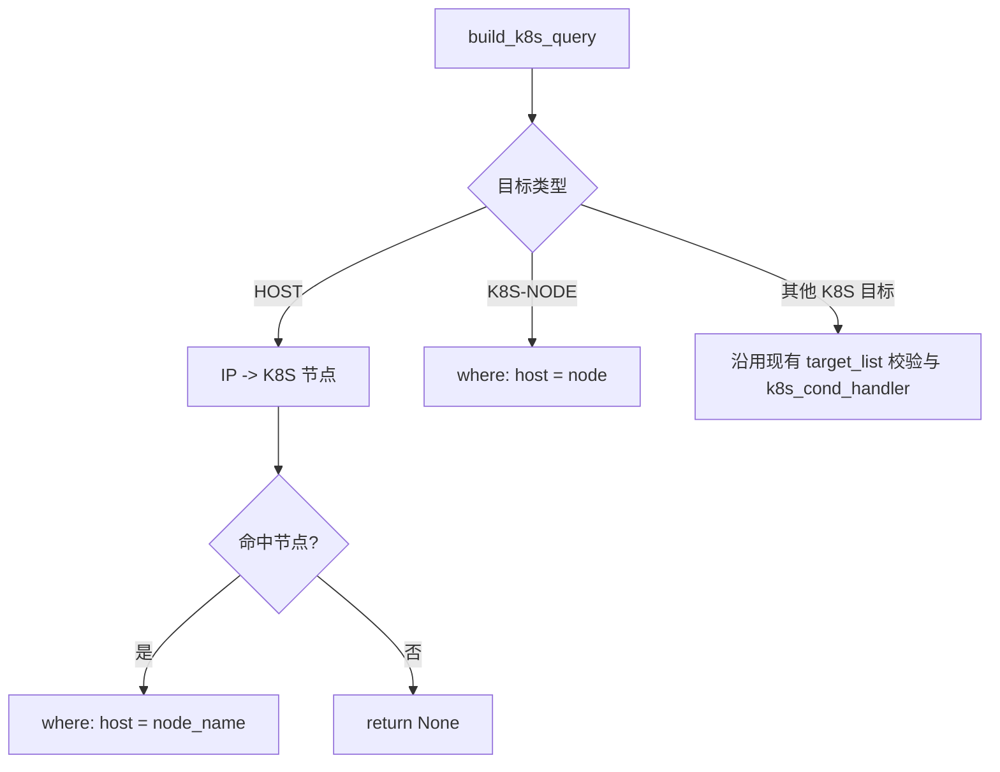

# 主机场景容器事件关联准确性提升 —— 实施方案

## 0x01 调研与约束

### a. 当前路径

当前主机场景通过 UnifyQuery 关系查询获取 K8S workload，再用 workload 维度查询事件。

这条路径的核心问题是节点语义丢失：workload 可以跨节点存在，但主机告警只应该关联当前节点上的容器事件。

### b. 代码现状

`AlertEventBaseResource.build_k8s_query` 先调用 `target.list_related_k8s_targets()`，再统一校验 `bcs_cluster_id + namespace`。

这会带来 `2` 个问题：

- `HostTarget.list_related_k8s_targets()` 会先走 `RelationQ` 获取 workload，性能目标无法达成。
- `K8SNodeTarget` 会生成 `bcs_cluster_id + node` 目标，但因为没有 namespace 被提前丢弃。

### c. 关键约束

- 节点维度应映射到 K8S 事件字段 `host`，用于过滤发生在节点上的事件。
- `namespace` 只应该约束现有 workload 路径，不应该拦截 K8S-NODE 目标。
- 主机目标未命中 K8S 节点时返回 `None`，不做 K8S 事件查询。
- 非 K8S-NODE 分支保持现有逻辑，避免误伤 pod、service 和 workload 目标。

## 0x02 架构设计

核心设计：主机和 K8S-NODE 都收敛到节点事件字段 `host`，workload、pod 和 service 保持现有目标协议。



### a. 主机目标节点化

主机目标改为通过 IP 查询节点元信息，再用节点名称过滤事件。

节点查询入口：

```python
resource.scene_view.get_kubernetes_node(bk_biz_id=2, node_ip="127.0.0.1")
```

当前分支只依赖最小返回结构：

```python
[
    {"key": "name", "value": "node-30-186-151-203"},
    {"key": "bcs_cluster_id", "value": {"value": "BCS-K8S-00000"}},
]
```

`name` 对应事件查询的 `host`，`bcs_cluster_id` 对应事件表路由。

### b. K8S-NODE 节点化

K8S-NODE 目标已有 `bcs_cluster_id + node`。

查询 K8S 事件时，`node` 只表达目标节点身份。

过滤发生在该节点上的事件需要改写为 `host = node`。

## 0x03 开发方案

### a. Host 分支提前返回

改动文件：`packages/fta_web/alert_v2/resources.py`。

在 `build_k8s_query` 入口先判断 `target.TARGET_TYPE == EventTargetType.HOST`。

这个分支必须放在 `target.list_related_k8s_targets()` 之前，避免主机场景继续触发 `HostTarget._list_related_k8s_targets()` 的 workload 关系查询。

Host 分支只做 `3` 件事：

1. 从 `target.list_related_host_targets()` 读取 IP。
2. 调用 `resource.scene_view.get_kubernetes_node` 获取 `name` 和 `bcs_cluster_id`。
3. 命中时构造 `{"bcs_cluster_id": bcs_cluster_id, "host": node_name}`，未命中时返回 `None`。

### b. K8S-NODE 分支前置

在现有 `for related_target in related_k8s_targets["target_list"]` 循环中，只新增 K8S-NODE 分支。

该分支放在现有 namespace 校验之前：

```text
if resource_type == K8S_RESOURCE_TYPE[K8STargetType.NODE]:
    if not all([related_target.get("bcs_cluster_id"), related_target.get("node")]):
        continue
    valid_k8s_targets.append(
        {
            "bcs_cluster_id": related_target["bcs_cluster_id"],
            "host": related_target["node"],
        }
    )
    continue

if not all([related_target.get("bcs_cluster_id"), related_target.get("namespace")]):
    continue
```

其余 K8S 目标继续走现有逻辑，避免把 pod、service 误判成 workload。

## 0x04 验收与验证

| 场景 | 操作 | 预期 |
| --- | --- | --- |
| 主机命中 K8S 节点 | 使用主机 IP 查询关联事件。 | 查询条件包含 `host = node_name`，未命中节点时不做 K8S 事件查询。 |
| K8S Node 场景 | 使用 K8S-NODE 目标查看关联事件。 | 查询条件包含 `host = node`，并且不要求 namespace。 |

## 0x05 实施进展

| 时间 | 结论性进展 |
| --- | --- |
| `2026-06-04 19:00` | [a] 完成 PR [#10922](https://github.com/TencentBlueKing/bk-monitor/pull/10922) Review。<br />[b] 主机节点查询仅对 `get_kubernetes_node` 调用补充异常降级。<br />[c] K8S-NODE 目标复用已有 `node` 维度，不补充通用 `target`。 |
| `2026-06-03 01:00` | [a] 创建需求与方案，目标收敛为提升主机场景容器事件关联准确性。<br />[b] 回归源码后确认节点维度应映射为事件字段 `host`。<br />[c] 主机目标前置查询 K8S 节点，未命中返回 `None`。<br />[d] K8S-NODE 只新增前置分支，其余 K8S 目标保持现有逻辑。 |

## 0x06 参考 & 版本锚点

### a. 参考

- `<源码>` bk-monitor/bkmonitor/packages/fta_web/alert_v2/resources.py
- `<源码>` bk-monitor/bkmonitor/packages/fta_web/alert_v2/target.py
- `<源码>` bk-monitor/bkmonitor/packages/monitor_web/data_explorer/event/utils.py
- 改动点：`fta_web.alert_v2.resources.AlertEventBaseResource.build_k8s_query`
- 节点查询：`resource.scene_view.get_kubernetes_node(bk_biz_id=<bk_biz_id>, node_ip=<ip>)`

### b. 版本锚点

| 状态 | 分支 | 里程碑 | PR |
| --- | --- | --- | --- |
| 🔄 | `feat/host_alert_relate_k8s_target_opt/#1010158081134895197` | 里程碑 1：主机与 K8S-NODE 容器事件按节点关联 | [TencentBlueKing/bk-monitor #10922](https://github.com/TencentBlueKing/bk-monitor/pull/10922) |
