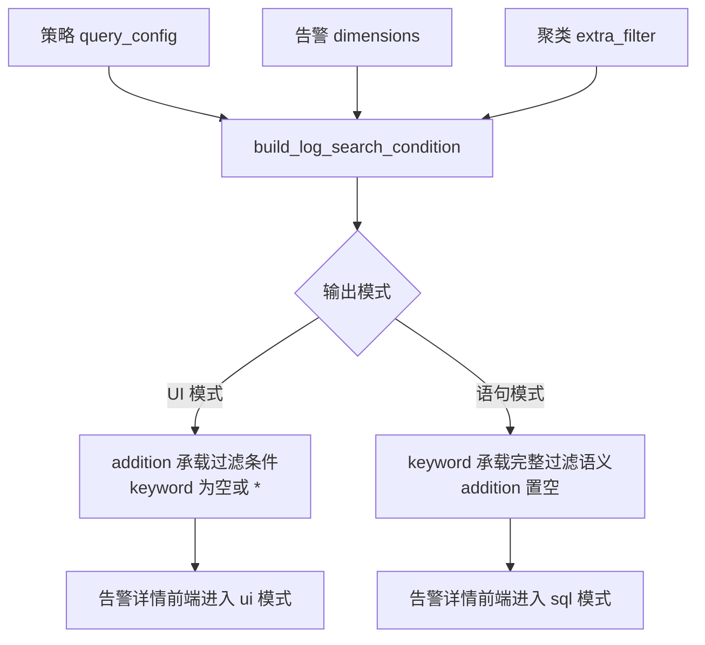

# 【告警中心】优化关联日志条件构造不准确的问题 —— 实施方案

## 0x01 调研与约束

本节只保留影响方案取舍的调研结论，背景与问题定义见 [README.md](./README.md)。

关键约束：

- 复用 `QueryStringGenerator`，不手写 Lucene 转义和操作符模板。
- 不新增单独 helper，转换流程放在 `build_log_search_condition` 内部。
- 合并触发条件是有效 `keyword` 且 `addition` 非空。
- 合并成功后由 `keyword` 承载完整过滤语义，并清空 `addition`。
- 聚类场景不合并，继续调用 `build_log_search_condition(..., is_merge2keyword=False)`。
- `agg_condition.value` 转换为 Lucene 片段前统一规范为 list，空值不进入 `QueryStringGenerator`。
- `get_log_clustering_info` 未命中时返回 `("", "")`，调用方不再依赖 `None` 做类型收窄。

## 0x02 架构设计

核心设计：关联日志条件构造先收敛为过滤意图，再选择唯一生效的表达载体。



### a. 过滤意图

过滤意图由 `3` 类条件组成：

| 来源 | 语义 | 生效顺序 |
| --- | --- | --- |
| `extra_filter_dict` | 聚类签名、敏感度等额外过滤 | 最高 |
| `dimensions` | 本次告警触发维度 | 高 |
| `query_config.agg_condition` | 策略过滤条件 | 普通 |

同一字段重复时沿用现有优先级：额外过滤和告警维度优先，策略过滤条件不重复追加。

### b. 输出协议

`build_log_search_condition` 输出仍保持 `{"addition": list, "keyword": str}`，但增加调用方控制参数。

```python
build_log_search_condition(
    query_config: dict[str, Any],
    dimensions: dict[str, Any],
    exclude_fields: set[str] | None = None,
    extra_filter_dict: dict[str, Any] | None = None,
    is_merge2keyword: bool = False,
) -> dict[str, Any]
```

输出规则：

| 条件 | `addition` | `keyword` |
| --- | --- | --- |
| `is_merge2keyword=False` | 保持现有构造 | 策略 `query_string` 原值 |
| `keyword` 为空或 `*` | 保持现有构造 | 策略 `query_string` 原值 |
| `is_merge2keyword=True` 且 `addition` 非空 | `[]` | `(<原 keyword>) AND (<过滤条件 query_string>)` |

`addition` 字段保持存在，但语句模式下不再同时携带过滤内容。

### c. 聚类边界

日志聚类告警是明确豁免场景。

`get_log_clustering_info()` 输出稳定为 `tuple[str, str]`：

| 场景 | `clustering_type` | `clustering_index_set_id` |
| --- | --- | --- |
| 命中聚类标签 | `count` 或 `new_class` | 标签中的索引集 ID |
| 未命中聚类标签 | `""` | `""` |

`DefaultTarget.list_related_log_targets()` 应统一定义：

```python
is_clustering = bool(clustering_type and clustering_index_set_id)
```

聚类场景继续执行：

- 调用 `build_log_search_condition(..., is_merge2keyword=False)`。

## 0x03 开发方案

### a. `QueryStringGenerator` 配置方案

改动文件：`bkmonitor/utils/alert_drilling.py`。

现有调用方都采用相同模式：

1. 创建 `QueryStringGenerator(operator_mapping)`。
2. 调用 `generator.add_filter(field, operator, values)`。
3. 调用 `generator.to_query_string()` 输出 Lucene 片段。

`addition` 构造阶段已经通过 `MONITOR_TO_LOG_OPERATOR_MAP` 把策略操作符转换为日志平台操作符，因此 `QueryStringGenerator` 只需配置该映射右值对应的操作符。

映射方案：

| `addition.operator` | `QueryStringOperators` |
| --- | --- |
| `=` | `EQUAL` |
| `!=` | `NOT_EQUAL` |
| `contains` | `INCLUDE` |
| `not contains` | `NOT_INCLUDE` |

### b. `build_log_search_condition`

改动文件：`bkmonitor/utils/alert_drilling.py`。

`build_log_search_condition` 继续负责构造 `addition`，再按 `is_merge2keyword` 决定是否转入 `keyword`。

合并策略：

1. 先按现有逻辑生成 `addition`，保持 UI 模式行为不变。
2. 策略过滤条件写入 `addition` 前，把 scalar value 包装为 list，并跳过空 list。
3. 当 `is_merge2keyword=True`、`keyword` 有效（去除首尾空白后不为空且不等于 `*`）并且 `addition` 非空时，逐条生成过滤片段。
4. 使用 `AND` 合并原 `keyword` 和过滤片段，得到新的 `keyword`。
5. 合并成功后将 `addition` 置为 `[]`。
6. 不满足合并条件时保持原返回。

### c. `DefaultTarget.list_related_log_targets`

改动文件：`packages/fta_web/alert_v2/target.py`。

该入口承接新版告警详情关联日志，是本期最明确需要启用合并的调用方。

| 变更 | 目标 |
| --- | --- |
| **[Add]** `is_clustering` 局部变量 | 收敛重复的 `clustering_type and clustering_index_set_id` 判断 |
| **[Change]** 非聚类调用 `build_log_search_condition(..., is_merge2keyword=True)` | 让有效 `keyword` 承载完整过滤语义，并清空 `addition` |
| **[Keep]** 聚类调用 `is_merge2keyword=False` | 保持聚类 UI 过滤模式 |
| **[Keep]** 聚类 `keyword=""` | 避免前端进入语句模式 |
| **[Change]** 聚类信息未命中返回 `("", "")` | 删除调用方 `assert`，保持字符串协议稳定 |

### d. 其它调用方

- `monitor_adapter.home.alert_redirect.generate_log_search_url` 会把 `keyword` 和 `addition` 同时传给日志平台。
- 日志平台会自动拼接两类条件，因此该调用方无需开启 `is_merge2keyword`。

## 0x04 验收与验证

已补充单测：

| 用例 | 断言重点 |
| --- | --- |
| `test_build_log_search_condition_merge_keyword_with_filters` | 有效 `keyword` 和 `addition` 同时存在时，`keyword` 包含原语句和过滤片段 |
| `test_build_log_search_condition_keep_ui_mode_without_effective_keyword` | `keyword` 为空或 `*` 时不合并 |
| `test_build_log_search_condition_keeps_separate_filters_by_default` | 默认调用保持 `keyword` 与 `addition` 分离 |
| `test_build_log_search_condition_merge_scalar_values_and_skip_empty_values` | scalar value 被包装为 list，空 list 不生成 Lucene 片段 |
| `test_get_log_clustering_info_returns_empty_strings_without_clustering_label` | 无聚类标签时返回 `("", "")` |
| `test_default_target_merges_addition_for_non_clustering_alert` | 非聚类日志告警详情合并为语句模式 |
| `test_default_target_clustering_keeps_addition_mode` | 聚类场景返回 `keyword=""` 且 `addition` 包含聚类过滤 |

建议回归：

- 日志告警策略同时配置 `query_string` 和 `agg_condition`，关联日志面板只返回满足两者的日志。
- 普通日志告警只配置 `agg_condition` 时仍进入 UI 模式。
- 聚类告警关联日志仍按签名和敏感度过滤。

## 0x05 实施进展

| 时间 | 结论性进展 |
| --- | --- |
| `2026-06-04 01:00` | [a] 确认前端语句模式忽略 `addition`。<br />[b] 方案收敛为有效 `keyword` 合并过滤语义，聚类豁免。<br />[c] 合并成功后清空 `addition`，避免双载体并存。 |
| `2026-06-09 17:22` | [a] PR #10991 首轮 review 指出 `agg_condition.value` 需规范为 list，避免 `QueryStringGenerator` 对 scalar value 生成错误 Lucene。<br />[b] 建议聚类信息未命中时返回 `("", "")`，删除 `assert` 类型收窄。 |
| `2026-06-09 19:52` | [a] PR #10991 已修复 review 线程，并补充 scalar value、空 value、无聚类标签返回值等单测。<br />[b] 已完成复查并 approve，PR 当前 review 状态为 `APPROVED`。 |

## 0x06 参考 & 版本锚点

### a. 参考

- [<源码> bkmonitor/utils/alert_drilling.py](https://github.com/TencentBlueKing/bk-monitor/blob/master/bkmonitor/bkmonitor/utils/alert_drilling.py)
- [<源码> bkmonitor/utils/elasticsearch/handler.py](https://github.com/TencentBlueKing/bk-monitor/blob/master/bkmonitor/bkmonitor/utils/elasticsearch/handler.py)
- [<源码> constants/elasticsearch.py](https://github.com/TencentBlueKing/bk-monitor/blob/master/bkmonitor/constants/elasticsearch.py)
- [<源码> fta_web/alert_v2/resources.py](https://github.com/TencentBlueKing/bk-monitor/blob/master/bkmonitor/packages/fta_web/alert_v2/resources.py)
- [<源码> fta_web/alert_v2/target.py](https://github.com/TencentBlueKing/bk-monitor/blob/master/bkmonitor/packages/fta_web/alert_v2/target.py)
- [<源码> fta_web/alert/resources.py](https://github.com/TencentBlueKing/bk-monitor/blob/master/bkmonitor/packages/fta_web/alert/resources.py)
- [<源码> panel-log/index.tsx](https://github.com/TencentBlueKing/bk-monitor/blob/master/bkmonitor/webpack/src/trace/pages/alarm-center/common-detail/components/panel-log/index.tsx)
- [<源码> monitor_adapter/home/alert_redirect.py](https://github.com/TencentBlueKing/bk-monitor/blob/master/bkmonitor/packages/monitor_adapter/home/alert_redirect.py)

### b. 版本锚点

| 状态 | 分支 | 里程碑 | PR |
| --- | --- | --- | --- |
| ✅ | `feat/alert_relate_log_search_condition_accuracy/#1010158081135029831` | 里程碑 1：日志告警关联日志 query_string 模式过滤语义收敛 | [TencentBlueKing/bk-monitor #10991](https://github.com/TencentBlueKing/bk-monitor/pull/10991) |
