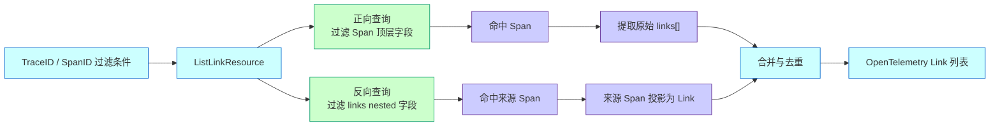

# APM Span 详情支持 Links 反向关联展示 —— 实施方案

## 0x01 调研与约束

### a. 结构判断

本方案在读取侧提供统一 Link 列表，不改变 `links[]` 的上报与存储归属。

`trace_id` 和 `span_id` 只用于构造过滤条件。

接口分别查询命中 Span 自身上报的 Links，以及把过滤条件记录为 Link 的来源 Span。

两路结果最终统一为 OpenTelemetry Link 列表，接口不返回额外的关系包装。

### b. 需求反思

| 维度 | 结论 |
| --- | --- |
| 表面诉求 | Span 详情支持 Links 反向关联展示。 |
| 表面症状 | Links 只在数据上报侧展示，主调方无法直接看到异步被调方。 |
| 根因 | 当前读取路径只消费 Span 自身的 `links[]`，没有查询把当前 ID 记录为 Link 的来源 Span。 |
| 真实约束 | `links` 是 Trace 结果表中的 nested 字段，反向查询必须保持同一 Link 对象匹配。 |
| 选择结论 | 使用同一组 ID 分别过滤 Span 和 `links[]`，再把两路结果统一转换为标准 Link。 |

### c. 当前代码路径

- Span 详情由 `SpanDetailResource` 调用 `api.apm_api.query_span_detail` 获取。
- Trace 详情由 `TraceDetailResource` 调用 `api.apm_api.query_trace_detail` 获取。
- 原始 Span 查询统一通过 `QueryProxy.span_query` 进入 `SpanQuery`。
- `TraceHandler._transform_to_refs` 只转换当前 Span 自身上报的 `links[]`。
- 前端 `span-details.tsx` 已能通过 `formatSpanLinks` 展示标准 Link 字段。

### d. 已确认约束

- `trace_id` 和 `span_id` 是独立的可选过滤条件，调用时至少提供一个。
- 同时传入两个字段时使用 `AND` 关系，不校验 TraceID 与 SpanID 的归属。
- 过滤条件不一致时，存储查询自然返回空列表。
- 响应只包含 `attributes`、`span_id`、`trace_id` 和 `trace_state`。
- 第一版只查询当前 APM 应用的 Trace 原始结果表。

## 0x02 架构设计

### a. 双路 Link 查询

`ListLinkResource` 使用同一组过滤条件执行正向和反向查询，再统一输出标准 Link。



Diagram Quick Read:

- Purpose: 说明一个接口如何用同一组 ID 查询正向与反向 Links。
- Main path: 正向查询提取原始 Links，反向查询把来源 Span 投影为 Link。
- Key branch: 两路查询独立执行，任一路无数据都不会阻塞另一条路径。
- Responsibility boundary: 查询层负责过滤，Resource 负责标准 Link 转换与合并。

### b. 请求协议

建议路由：

```text
POST apm/trace_api/trace_query/list_links/
```

最小请求示例：

```json
{
  "bk_biz_id": 2,
  "app_name": "demo",
  "trace_id": "38f6df9232036f09a9baecf246967ecb",
  "span_id": "8b1fa48d1af1f60d"
}
```

请求字段：

| 字段 | 类型 | 必填 | 说明 |
| --- | --- | --- | --- |
| `bk_biz_id` | `int` | 是 | 业务 ID，沿用 Trace 查询权限范围。 |
| `app_name` | `string` | 是 | APM 应用名。 |
| `trace_id` | `string` | 否 | TraceID 过滤条件。 |
| `span_id` | `string` | 否 | SpanID 过滤条件。 |

调用规则：

- `trace_id` 和 `span_id` 至少提供一个，避免无条件扫描 Trace 结果表。
- 同时传入两个字段时，两者使用 `AND` 关系。
- 接口不查询 Span 详情补全 `trace_id`。
- 接口不校验 TraceID 与 SpanID 是否属于同一个 Span。
- 条件无匹配数据时返回 `[]`。

### c. 响应协议

响应直接返回 OpenTelemetry Link 数组。

```json
[
  {
    "attributes": {},
    "span_id": "8b1fa48d1af1f60d",
    "trace_id": "38f6df9232036f09a9baecf246967ecb",
    "trace_state": ""
  }
]
```

Link 字段：

| 字段 | 类型 | 必填 | 说明 |
| --- | --- | --- | --- |
| `<item>.attributes` | `object` | 是 | Link 属性，无属性时返回 `{}`。 |
| `<item>.span_id` | `string` | 是 | Link 指向的 SpanID。 |
| `<item>.trace_id` | `string` | 是 | Link 指向的 TraceID。 |
| `<item>.trace_state` | `string` | 是 | TraceState，无值时返回空字符串。 |

两路查询的字段映射：

| 结果来源 | `trace_id` | `span_id` | `trace_state` | `attributes` |
| --- | --- | --- | --- | --- |
| 正向 Link | 原始 `links[].trace_id` | 原始 `links[].span_id` | 原始 `links[].trace_state` | 原始 `links[].attributes` |
| 反向 Link | 来源 Span 的 `trace_id` | 来源 Span 的 `span_id` | 来源 Span 的 `trace_state` | `{}` |

反向 Link 的 `attributes` 固定为空对象。

原始 Link 属性描述的是来源 Span 指向当前过滤对象的关系，不能直接作为反向 Link 属性复用。

### d. 过滤协议

正向查询过滤 Span 顶层字段，返回命中 Span 的全部 `links[]`。

```text
trace_id 存在 -> trace_id = $trace_id
span_id 存在  -> span_id = $span_id
两个字段存在  -> trace_id = $trace_id AND span_id = $span_id
```

反向查询过滤 `links[]`，返回命中来源 Span 投影后的 Link。

```text
trace_id 存在 -> links.trace_id = $trace_id
span_id 存在  -> links.span_id = $span_id
两个字段存在  -> links.trace_id = $trace_id AND links.span_id = $span_id
```

反向查询同时使用两个字段时，两个条件必须命中同一个 nested Link 对象。

接口不在过滤前解析或校验 ID。

任何不一致都由查询结果表达。

### e. 合并与去重

两路结果转换为同构 Link 后再合并。

去重键使用完整 Link 内容：

```text
trace_id + span_id + trace_state + normalized(attributes)
```

同一 Link 同时出现在正向和反向结果时只返回一条。

接口不增加 `direction`、`source_span`、`match_side` 或展示控制字段。

## 0x03 开发方案

### a. Web 资源层

改动范围：

- `packages/apm_web/trace/resources.py`
- `packages/apm_web/trace/views.py`
- `webpack/src/monitor-api/modules/apm_trace.js`

| 变更 | 目标 |
| --- | --- |
| **[Add]** `ListLinkResource` | 新增正向与反向 Link 统一查询入口。 |
| **[Add]** `ListLinkRequestSerializer` | 接收可选 `trace_id` 和 `span_id`，校验至少提供一个。 |
| **[Change]** `TraceQueryViewSet.resource_routes` | 注册 `POST list_links`，并纳入 APM 应用查看权限。 |
| **[Add]** `listLink` 前端 API | 供 Span 详情和 Trace 详情查询 Links。 |

`ListLinkResource` 负责：

1. 接收并透传 ID 过滤条件。
2. 调用查询层获取正向 Span 和反向来源 Span。
3. 把两路结果转换为标准 Link。
4. 合并去重后直接返回数组。

### b. 查询层

改动范围：

- `apm/core/handlers/query/span_query.py`
- `apm/core/handlers/query/proxy.py`

建议新增查询方法：

```text
SpanQuery.query_by_ids(
    trace_id: str | None = None,
    span_id: str | None = None,
) -> list[dict[str, Any]]

SpanQuery.query_by_link_ids(
    trace_id: str | None = None,
    span_id: str | None = None,
) -> list[dict[str, Any]]
```

查询层约束：

- `query_by_ids` 只为已提供的顶层 ID 构造过滤条件。
- `query_by_link_ids` 只为已提供的 nested Link ID 构造过滤条件。
- 同时提供两个 ID 时使用 `AND` 关系。
- `query_by_link_ids` 必须保证两个条件命中同一个 nested Link 对象。
- 查询时间范围使用当前应用数据保留期，不暴露额外接口参数。

`QueryProxy` 为 Web 层提供对应代理方法，避免 Resource 直接访问 `SpanQuery`。

### c. Link 转换

建议在 `packages/apm_web/handlers/trace_handler/link.py` 收敛转换逻辑。

核心函数：

```text
build_links(
    reported_spans: list[dict[str, Any]],
    reverse_source_spans: list[dict[str, Any]],
) -> list[dict[str, Any]]
```

转换规则：

- 遍历 `reported_spans[].links[]`，标准化并保留原始 Link 字段。
- 遍历 `reverse_source_spans[]`，使用来源 Span 的 ID 和 `trace_state` 构造 Link。
- 反向 Link 的 `attributes` 固定为 `{}`。
- 缺失 `trace_state` 或 `attributes` 时补充协议默认值。
- 按完整 Link 内容去重。

### d. 前端接入

`span-details.tsx` 使用当前 Span 的 `trace_id` 和 `span_id` 调用 `listLink`。

接口响应可直接交给现有 `formatSpanLinks` 展示，不需要前端识别正向或反向来源。

当反向查询命中异步被调方时，返回 Link 的 TraceID 和 SpanID 指向该被调方，用户可沿现有 Trace / Span 跳转能力继续排查。

## 0x04 验收与验证

建议补充后端用例：

| 用例 | 断言重点 |
| --- | --- |
| `test_list_link_by_trace_id` | 只使用 `trace_id` 构造正向与反向过滤条件。 |
| `test_list_link_by_span_id_without_trace_lookup` | 只使用 `span_id` 查询，不补全或校验 `trace_id`。 |
| `test_list_link_by_trace_id_and_span_id` | 两个 ID 在正向和反向查询中都使用 `AND`。 |
| `test_list_link_with_mismatched_ids_returns_empty_list` | 不一致 ID 不报错，查询自然返回 `[]`。 |
| `test_list_link_requires_same_nested_object` | 反向查询的两个 ID 必须命中同一个 Link 对象。 |
| `test_list_link_response_contains_only_otel_fields` | 每项只包含标准 Link 的 `4` 个字段。 |
| `test_list_link_projects_reverse_source_span` | 反向来源 Span 被投影为标准 Link，`attributes={}`。 |

建议补充前端验证：

- Span 详情可直接展示 `ListLinkResource` 返回的 Link 数组。
- 当前 Span 自身上报的 Links 保持原有展示。
- 反向命中的异步 Span 以标准 Link 展示，并可按 TraceID / SpanID 跳转。
- 无匹配数据时 Links 区域保持空态。

## 0x05 实施进展

| 时间 | 结论性进展 |
| --- | --- |
| `2026-06-04 01:00` | [a] 接口命名收敛为 `ListLinkResource`。<br />[b] TraceID 与 SpanID 只作为独立过滤条件，不做归属校验。<br />[c] 响应收敛为 OpenTelemetry Link 数组，不返回关系包装字段。 |

## 0x06 参考 & 版本锚点

### a. 参考

- `<源码>` bk-monitor/bkmonitor/packages/apm_web/trace/resources.py
- `<源码>` bk-monitor/bkmonitor/packages/apm_web/trace/views.py
- `<源码>` bk-monitor/bkmonitor/packages/apm_web/trace/serializers.py
- `<源码>` bk-monitor/bkmonitor/apm/core/handlers/query/span_query.py
- `<源码>` bk-monitor/bkmonitor/apm/core/handlers/query/proxy.py
- `<源码>` bk-monitor/bkmonitor/packages/apm_web/handlers/trace_handler/base.py
- `<源码>` bk-monitor/bkmonitor/webpack/src/monitor-api/modules/apm_trace.js
- `<源码>` bk-monitor/bkmonitor/webpack/src/trace/pages/main/span-details.tsx
- `<源码>` bk-monitor/bkmonitor/webpack/src/trace/pages/main/utils/format-span-links.ts

### b. 版本锚点

待补充。
