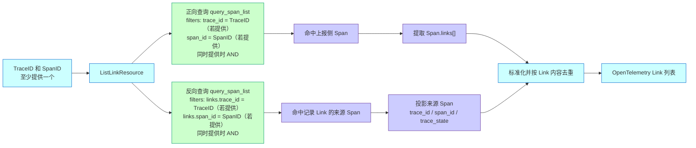

# APM Span 详情支持 Links 反向关联展示 —— 实施方案

## 0x01 调研与约束

### a. 结构判断

本方案通过两次 Span 列表查询获取正向与反向 Links，再统一返回 OpenTelemetry Link 列表。

TraceID 和 SpanID 只用于构造过滤条件，不改变 `links[]` 的上报与存储归属。

### b. 当前代码路径

- Trace Web 资源通过 `api.apm_api` 调用 APM 底层资源。
- `api.apm_api.query_span_list` 支持通过 `filters` 查询 Span 原始结果表。
- Span 原始字段包含顶层 TraceID、SpanID、TraceState 和嵌套字段 `links[]`。
- `query_span_list` 后台链路为 `QuerySpanListResource -> QueryProxy.query_list(QueryMode.SPAN) -> SpanQuery.query_list`。
- `QueryProxy.query_list()` 已对顶层 `trace_id` / `span_id` 精确查询重置时间范围，由 `BaseQuery._get_time_range()` 按应用数据保留期补全并前后填充 `5s`。
- 旧链路 `query_span -> TraceDataSource.query_span` 强依赖 `start_time` 和 `end_time`，不作为 Links 查询入口。

### c. 时间范围结论

Links 反向检索复用 `query_span_list` 的精确 ID 查询语义。

`links.trace_id` 和 `links.span_id` 属于 Trace / Span ID 的嵌套字段形态，应纳入 `QueryProxy.is_trace_or_span_id_query()` 的精确查询识别范围。


## 0x02 架构设计

### a. 双路 Link 查询



查询与转换规则：

| 查询路径    | `filters`                                                                      | 结果处理                     |
|---------|--------------------------------------------------------------------------------|--------------------------|
| 正向 Link | `trace_id = TraceID（若提供）`<br />`span_id = SpanID（若提供）` *[1]* *[3]*                   | 提取命中 Span 的全部 `links[]`。 |
| 反向 Link | `links.trace_id = TraceID（若提供）`<br />`links.span_id = SpanID（若提供）` *[1]* *[2]* *[3]* | 将命中的来源 Span 投影为 Link。    |

- *[1] 只为已提供的 ID 构造过滤条件，同时提供 TraceID 和 SpanID 时使用 `AND`。*
- *[2] 反向查询的 TraceID 和 SpanID 条件必须命中 `links[]` 中的同一个 Link 对象。*
- *[3] 两路调用 `query_span_list` 时均省略 `start_time` 和 `end_time`，由后台按应用数据保留期补全查询范围。*

两路结果转换为同构 Link 后合并，去重键为 `trace_id + span_id + trace_state + normalized(attributes)`。

### b. 请求协议

最小请求示例：

```http
POST /apm/trace_api/trace_query/list_links/
Content-Type: application/json

{
  "bk_biz_id": 2,
  "app_name": "demo",
  "trace_id": "38f6df9232036f09a9baecf246967ecb",
  "span_id": "8b1fa48d1af1f60d"
}
```

请求字段与调用规则：

| 字段          | 类型       | 必填 | 说明                              |
|-------------|----------|----|---------------------------------|
| `bk_biz_id` | `int`    | 是  | 业务 ID，沿用 Trace 查询权限范围。          |
| `app_name`  | `string` | 是  | APM 应用名。                        |
| `trace_id`  | `string` | 否  | TraceID 过滤条件。 *[1]* *[2]* *[3]* |
| `span_id`   | `string` | 否  | SpanID 过滤条件。 *[1]* *[2]* *[3]*  |

- *[1] TraceID 和 SpanID 至少提供一个，避免无条件扫描 Trace 结果表。*
- *[2] 同时传入 TraceID 和 SpanID 时，两者使用 `AND` 关系。*
- *[3] 接口直接使用参数构造 `filters`，不查询 Span 详情补全 TraceID，也不校验 TraceID 与 SpanID 是否属于同一个 Span，无匹配数据时返回 `[]`。*

### c. 响应协议

响应直接返回 OpenTelemetry Link 数组。

```json
[
  {
    "attributes": {},
    "span_id": "8b1fa48d1af1f60d",
    "trace_id": "38f6df9232036f09a9baecf246967ecb",
    "trace_state": ""
  }
]
```

Link 字段：

| 字段                   | 类型       | 必填 | 说明                    |
|----------------------|----------|----|-----------------------|
| `<item>.attributes`  | `object` | 是  | Link 属性，无属性时返回 `{}`。  |
| `<item>.span_id`     | `string` | 是  | Link 指向的 SpanID。      |
| `<item>.trace_id`    | `string` | 是  | Link 指向的 TraceID。     |
| `<item>.trace_state` | `string` | 是  | TraceState，无值时返回空字符串。 |

## 0x03 开发方案

### a. Web 资源层

改动范围：

- `packages/apm_web/trace/resources.py`
- `packages/apm_web/trace/views.py`
- `packages/apm_web/trace/serializers.py`

| 变更                                               | 目标                                   |
|--------------------------------------------------|--------------------------------------|
| **[Add]** `ListLinkResource`                     | 新增正向与反向 Link 统一查询入口。                 |
| **[Add]** `ListLinkRequestSerializer`            | 接收可选 TraceID 和 SpanID，校验至少提供一个。      |
| **[Change]** `TraceQueryViewSet.resource_routes` | 注册 `POST list_links`，并纳入 APM 应用查看权限。 |

`ListLinkResource` 负责构造两组 filters、调用 Span 列表查询、转换 Link 和合并去重。

### b. 查询层

`ListLinkResource` 通过 `filters` 两次调用 `api.apm_api.query_span_list`。

以下示例按 TraceID 和 SpanID 均存在展示，实际调用只追加已提供 ID 对应的过滤条件。

正向 Link `filters`：

```json
{
  "filters": [
    {"key": "trace_id", "operator": "equal", "value": ["$TraceID"]},
    {"key": "span_id", "operator": "equal", "value": ["$SpanID"]}
  ]
}
```

正向查询保留 `links` 字段，用于提取命中 Span 自身上报的 `links[]`。

反向 Link `filters`：

```json
{
  "filters": [
    {"key": "links.trace_id", "operator": "equal", "value": ["$TraceID"]},
    {"key": "links.span_id", "operator": "equal", "value": ["$SpanID"]}
  ]
}
```

反向查询保留来源 Span 的 `trace_id`、`span_id` 和 `trace_state`，两个 Link 条件使用 `AND` 并命中 `links[]` 中的同一个对象。

两次调用复用当前应用信息和数据保留期，分页上限由 `ListLinkResource` 统一控制。

### c. 后台查询兼容

改动范围：

- `bkmonitor/apm/resources.py`
- `bkmonitor/apm/core/handlers/query/proxy.py`

| 变更 | 目标 |
| --- | --- |
| **[Change]** `QuerySerializer.start_time` | 放宽为 `required=False, allow_null=True, default=None`，允许开始时间为空。 |
| **[Change]** `QuerySerializer.end_time` | 放宽为 `required=False, allow_null=True, default=None`，允许结束时间为空。 |
| **[Change]** `QueryProxy.is_trace_or_span_id_query()` | 将 `links.trace_id` 和 `links.span_id` 纳入精确 ID 查询识别。 |

### d. Link 转换

`ListLinkResource.build_links` 类方法统一处理两路查询结果：

```text
ListLinkResource.build_links(
    reported_spans: list[dict[str, Any]],
    reverse_source_spans: list[dict[str, Any]],
) -> list[dict[str, Any]]
```

入参规范：

| 参数 | 数据约束 | 用途 |
| --- | --- | --- |
| `reported_spans` | 正向查询结果，读取 Span 的 `links[]`，字段缺失时按空列表处理 | 提取数据上报侧 Link。 |
| `reverse_source_spans` | 反向查询结果，Span 数据包含 `trace_id` 和 `span_id`，`trace_state` 可缺失 | 将记录 Link 的来源 Span 投影为反向 Link。 |

两路查询的字段映射：

| 结果来源 | `trace_id` | `span_id` | `trace_state` | `attributes` |
| --- | --- | --- | --- | --- |
| 正向 Link | 原始 `links[].trace_id` | 原始 `links[].span_id` | 原始 `links[].trace_state` | 原始 `links[].attributes` |
| 反向 Link | 来源 Span 的 `trace_id` | 来源 Span 的 `span_id` | 来源 Span 的 `trace_state` | `{}` *[1]* |

- *[1] 原始 Link 属性描述的是来源 Span 指向过滤对象的关系，不能作为反向 Link 属性复用。*

转换规则：

- 缺失 `trace_state` 或 `attributes` 时补充协议默认值。
- 按完整 Link 内容去重。

## 0x04 实施进展

| 时间 | 结论性进展 |
| --- | --- |
| `2026-06-04 21:00` | 核心图明确双路 filters，开发方案补齐查询参数与 `build_links` 输入、映射协议。 |
| `2026-06-08 22:20` | 确认 Links 查询复用 `query_span_list` 新链路，后台放宽共享 `QuerySerializer` 时间参数，并将 `links.trace_id` / `links.span_id` 纳入精确 ID 查询识别。 |

## 0x05 参考 & 版本锚点

### a. 参考

- [<源码> bk-monitor/bkmonitor/packages/apm_web/trace/resources.py](https://github.com/TencentBlueKing/bk-monitor/blob/master/bkmonitor/packages/apm_web/trace/resources.py)
- [<源码> bk-monitor/bkmonitor/packages/apm_web/trace/views.py](https://github.com/TencentBlueKing/bk-monitor/blob/master/bkmonitor/packages/apm_web/trace/views.py)
- [<源码> bk-monitor/bkmonitor/packages/apm_web/trace/serializers.py](https://github.com/TencentBlueKing/bk-monitor/blob/master/bkmonitor/packages/apm_web/trace/serializers.py)
- [<源码> bk-monitor/bkmonitor/apm/resources.py](https://github.com/TencentBlueKing/bk-monitor/blob/master/bkmonitor/apm/resources.py)
- [<源码> bk-monitor/bkmonitor/api/apm_api/default.py](https://github.com/TencentBlueKing/bk-monitor/blob/master/bkmonitor/api/apm_api/default.py)

### b. 版本锚点

| 状态 | 分支 | 里程碑 | PR |
| --- | --- | --- | --- |
| 🔄 | `<branch_name>` | 里程碑 1：Links 反向关联查询 | 待创建 |
