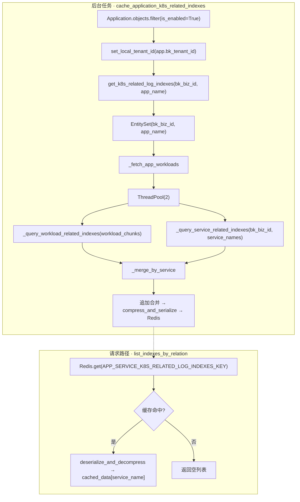
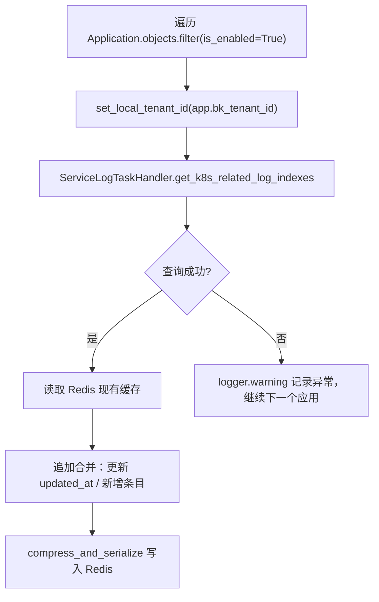

# APM 关联容器日志采集项慢接口优化 —— 实施方案

> 基于 [README.md](./README.md) 制定。

## 0x01 调研与约束

### a. 瓶颈定位

APM 日志页面首次打开触发的 `LogRelationListResource` 和 `LogInfoResource` 耗时达分钟级，主瓶颈集中在 `process_metric_relations` 分支。

```text
[入口] POST /apm/service_log/log/log_relation_list/
  └─ log_relation_list / ThreadPoolExecutor 四分支
      ├─ process_relation ← 手动关联，非主瓶颈
      ├─ process_datasource ← 应用数据源，非主瓶颈
      ├─ [主瓶颈] process_metric_relations
      │   └─ ServiceLogHandler.list_indexes_by_relation（逐服务）
      │       └─ RelationQ.query → api.unify_query.query_multi_resource_range
      └─ process_span_host ← Span 主机关联，非主瓶颈
```

`list_indexes_by_relation` 为每个服务独立调用 `RelationQ.query`，向 UQ 发起 `relation/multi_resource_range` 请求。真正的瓶颈是调用次数而非单次耗时——单次 `query_list` 规模 = workload 数 × handler 类型数 × 关系链路目标数，UQ 侧单次处理耗时约 `30s` 属于正常范围。一个 APM 应用通常有 `100+` 服务，产生 `100+` 次独立的 UQ 查询。

### b. 关键约束

- 不改变 `process_relation`、`process_datasource`、`process_span_host` 三个分支的行为。
- 缓存采用追加策略：只新增或刷新索引条目，不主动删除旧条目，避免后台任务异常清空缓存导致前端无数据。
- 后台任务获取 workload 时使用 `EntitySet` 已有能力。

## 0x02 架构设计

### a. 架构命题

将逐服务实时查 UQ 的 O(N) 关系查询，收敛为后台定时任务批量预计算 + 请求侧直查缓存的 O(1) 查询。

### b. 核心收敛点

复杂度来源：`list_indexes_by_relation` 逐服务调用 `RelationQ.query`，每次查询构造独立的 `query_list` 发往 UQ，查询次数与服务数量线性相关。

解决方案：
* 策略：将 APM 关联日志索引的查询从请求路径移到后台任务，后台任务一次性按服务、容器查询 UQ 获取关联，建立 `service_name → list[Index]` 映射并设置缓存。
* 消费处直查缓存，避免实时计算关联。

### c. 数据流



## 0x03 开发方案

承接架构设计中的数据流，按职责拆分为三个改造主题：后台采集、缓存写入和消费替换。

### a. 后台采集 —— ServiceLogTaskHandler

新增 `ServiceLogTaskHandler` 到 `apm_web/handlers/log_handler.py`，承担应用级批量关系查询职责。

| 变更点                                                                          | 返回类型                          | 目标                                                                                                                                                                                                                                                                        |
|------------------------------------------------------------------------------|-------------------------------|---------------------------------------------------------------------------------------------------------------------------------------------------------------------------------------------------------------------------------------------------------------------------|
| **[Add]** `get_k8s_related_log_indexes(bk_biz_id: int, app_name: str)`       | `dict[str, list[dict]]`       | 返回 `{service_name: [{"index_set_id": int, "bk_biz_id": int}, ...]}`                                                                                                                                                                                                       |
| **[Add]** `_fetch_app_workloads(entity_set, service_names)`                  | `list[dict]`                  | [a] 遍历 `service_names`，调用 `entity_set.get_workloads(svc)` 收集全量 workload。<br />[b] 按 `(bcs_cluster_id, namespace, kind, name)` 去重。<br />[c] `kind` 决定后续查询使用的 Source 类型 |
| **[Add]** `_query_workload_related_indexes(bk_biz_id, workloads)`            | `dict[frozenset, list[dict]]` | Workload 路径：内部按 `chunk_size=5` 分片并发查 UQ。<br />[a] 根据 `kind` 选择 `SourceK8sDeployment` / `SourceK8sDaemonSet` / `SourceK8sStatefulSet` 构造 `source_info`，查 `SourceDatasource`。<br />[b] 通过 `relation.source_info` 还原回 workload。<br />[c] Key 为 `frozenset(workload.items())`。<br />[d] `workloads` 为空时直接返回空字典，跳过 UQ 查询 |
| **[Add]** `_query_service_related_indexes(bk_biz_id, service_names)`         | `dict[str, list[dict]]`       | Service 路径：内部按 `chunk_size=5` 分片并发查 UQ，覆盖自定义 CRD。<br />[a] 以 `service_name` 构造 `SourceService`，查 `SourceDatasource`。<br />[b] 通过 `relation.source_info` 还原回 `service_name`。<br />[c] Key 为 `service_name`                                                                 |
| **[Add]** `_merge_by_service(entity_set, workload_indexes, service_indexes)` | `dict[str, list[dict]]`       | [a] 遍历 `entity_set.service_names`，调用 `entity_set.get_workloads(svc)` 获取服务关联的 workloads。<br />[b] 构造 `frozenset` key，从 `workload_indexes` 取回对应索引。<br />[c] 合并 `service_indexes`，按 `index_set_id` 去重 |

#### `get_k8s_related_log_indexes`

```python
entity_set = EntitySet(bk_biz_id=bk_biz_id, app_name=app_name)
service_names = entity_set.service_names
workloads = _fetch_app_workloads(entity_set, service_names)

with ThreadPool(2) as pool:
    futures = [
        pool.apply_async(lambda: _query_workload_related_indexes(bk_biz_id, workloads)),
        pool.apply_async(lambda: _query_service_related_indexes(bk_biz_id, service_names)),
    ]
    workload_indexes, service_indexes = [f.get() or {} for f in futures]

return _merge_by_service(entity_set, workload_indexes, service_indexes)
```

#### `_query_workload_related_indexes`、`_query_service_related_indexes`

两路结构相同，仅 `source_info` 构造和 Key 不同（见表格 `[a][b][c]`）。

```python
item_chunks = list(chunks(items, chunk_size=5))

def _query_chunk(chunk):
    ...  # 见表格 [a][b][c]

pool = ThreadPool(min(len(item_chunks), 2))
pool.imap_unordered(_query_chunk, item_chunks)
pool.close()
# merge → key → list[dict]
```

- 关联关系查询时间范围固定为 `30` 分钟，避免长时间范围导致慢查询阻塞。
- `bk_data_id → index_set_id` 转换复用 `list_tables_by_data_ids` 和 `get_biz_index_sets_with_cache`。
- RelationQ 调用链参考 `BaseK8STarget._k8s_related_log_targets`。

### b. 缓存写入 —— `cache_application_k8s_related_indexes`

新增 Celery 定时任务到 `apm_web/tasks.py`。

| 变更点                                                             | 目标                                                                                                                                 |
|-----------------------------------------------------------------|------------------------------------------------------------------------------------------------------------------------------------|
| **[Add]** `cache_application_k8s_related_indexes`               | 定时任务，遍历应用并调用 `ServiceLogTaskHandler.get_k8s_related_log_indexes`，结果写入 Redis                                                        |
| **[Add]** `ApmCacheKey.APP_SERVICE_K8S_RELATED_LOG_INDEXES_KEY` | [a] 格式：`apm:application:{bk_biz_id}:{app_name}:k8s_related_log_indexes` <br/>[b] TTL：24 h <br/>[c] `compress_and_serialize` 序列化后保存 |

**调度配置**：

- 频率：每 2 小时执行一次。
- 注册方式：使用 `@shared_task(ignore_result=True)` 装饰器声明任务，在 `config/celery/config.py` 的 `beat_schedule` 中注册。
- `set_local_tenant_id(app.bk_tenant_id)`：多租户上下文切换，确保后续查询在正确的租户空间内执行。参数来自 `Application.bk_tenant_id`。

**任务流程**：



**追加合并策略**：以 `index_set_id` 为合并键，逐服务合并新旧缓存。

- 本次查到且已在缓存中的索引：覆盖并刷新 `updated_at`。
- 本次查到但缓存中不存在的索引：新增条目。
- 本次未查到但已在缓存中的索引：保留不删除，避免后台任务异常导致数据丢失。

### c. 消费替换

| 变更点                                                       | 文件                                | 目标                                         |
|-----------------------------------------------------------|-----------------------------------|--------------------------------------------|
| **[Change]** `ServiceLogHandler.list_indexes_by_relation` | `apm_web/handlers/log_handler.py` | 改为从 Redis 缓存查询，未命中返回空列表                    |
| **[Keep]** `LogInfoResource.perform_request`              | `apm_web/log/resources.py`        | 保持现有逻辑，直接调用 `log_relation_list`——优化后该函数已变快 |
| **[Change]** `process_metric_relations`                   | `apm_web/log/resources.py`        | 移除 `EntitySet.get_workloads` 判空逻辑，缓存路径已足够快，无需前置剪枝 |

- 缓存命中时直接返回，不再调用 UQ。
- 缓存未命中时返回空列表，不回退到 `RelationQ.query`，避免请求路径退化到分钟级耗时。

## 0x04 验收与验证

### a. 测试门禁

现有测试覆盖路径：

```bash
uv run pytest -n auto tests/packages/apm_web/
```

### b. 补充测试

| 测试函数                                                | 断言重点                                     |
|-----------------------------------------------------|------------------------------------------|
| `test_get_k8s_related_log_indexes_empty_workloads`  | 无 workload 时返回空字典                        |
| `test_get_k8s_related_log_indexes_dedup`            | 多服务共享同一 workload 时 UQ 仅查询一次，两个服务都能拿到对应索引 |
| `test_cache_merge_append_only`                      | 缓存合并：新索引追加、旧索引保留、已有索引更新 `updated_at`     |
| `test_list_indexes_by_relation_cache_hit`           | 缓存命中时不调用 `RelationQ.query`               |
| `test_list_indexes_by_relation_cache_miss_empty`    | 缓存未命中时返回空列表，不回退到 `RelationQ.query`       |

## 0x05 实施进展

| 时间                 | 结论性进展                                       |
|--------------------|---------------------------------------------|
| `2026-07-16 10:00` | 完成后台任务预缓存与消费侧替换，[TencentBlueKing/bk-monitor #11539](https://github.com/TencentBlueKing/bk-monitor/pull/11539) 已合入 |
| `2026-07-10 17:00` | 完成方案设计：后台任务批量预计算 + Redis 缓存 + 请求侧直查缓存的三段式架构 |

## 0x06 参考

- 参考实现：[源码 fta_web/alert_v2/target.py · BaseK8STarget._k8s_related_log_targets](https://github.com/TencentBlueKing/bk-monitor/blob/master/bkmonitor/packages/fta_web/alert_v2/target.py)
- [源码 apm_web/handlers/log_handler.py](https://github.com/TencentBlueKing/bk-monitor/blob/master/bkmonitor/packages/apm_web/handlers/log_handler.py)
- [源码 apm_web/log/resources.py](https://github.com/TencentBlueKing/bk-monitor/blob/master/bkmonitor/packages/apm_web/log/resources.py)
- [源码 apm_web/tasks.py](https://github.com/TencentBlueKing/bk-monitor/blob/master/bkmonitor/packages/apm_web/tasks.py)
- [源码 apm_web/strategy/dispatch/entity.py](https://github.com/TencentBlueKing/bk-monitor/blob/master/bkmonitor/packages/apm_web/strategy/dispatch/entity.py)
- [源码 apm_web/topo/handle/relation/query.py](https://github.com/TencentBlueKing/bk-monitor/blob/master/bkmonitor/packages/apm_web/topo/handle/relation/query.py)

### a. 辅助函数定位

| 函数 / 常量                        | 模块                                            |
|---------------------------------|-----------------------------------------------|
| `compress_and_serialize`        | `bkmonitor.utils.common_utils`                |
| `deserialize_and_decompress`    | `bkmonitor.utils.common_utils`                |
| `ApmCacheKey`                   | `apm_web.constants`                           |
| `SourceK8sDeployment` 等 Source  | `apm_web.topo.handle.relation.define`         |
| `RelationQ`                     | `apm_web.topo.handle.relation.query`          |
| `list_tables_by_data_ids`       | `apm_web.handlers.log_handler.ServiceLogHandler` |
| `get_biz_index_sets_with_cache` | `apm_web.handlers.log_handler`                |

## 0x07 版本锚点

| 状态 | 分支                                      | 里程碑                              | PR                                                                         |
|----|-----------------------------------------|----------------------------------|----------------------------------------------------------------------------|
| ✅  | `feat/apm_alert/#1010158081134133218`   | 里程碑 1：优化告警中心关联事件查询耗时              | [#10530](https://github.com/TencentBlueKing/bk-monitor/pull/10530)         |
| ✅  | `feat/apm_service_alert_relate_log_targets_slow_query_opt/#1010158081136089503` | 里程碑 2：后台任务预缓存 + 消费侧替换 | [TencentBlueKing/bk-monitor #11539](https://github.com/TencentBlueKing/bk-monitor/pull/11539) |
