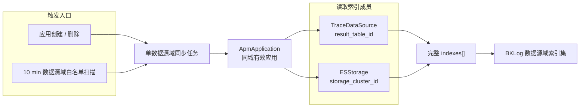
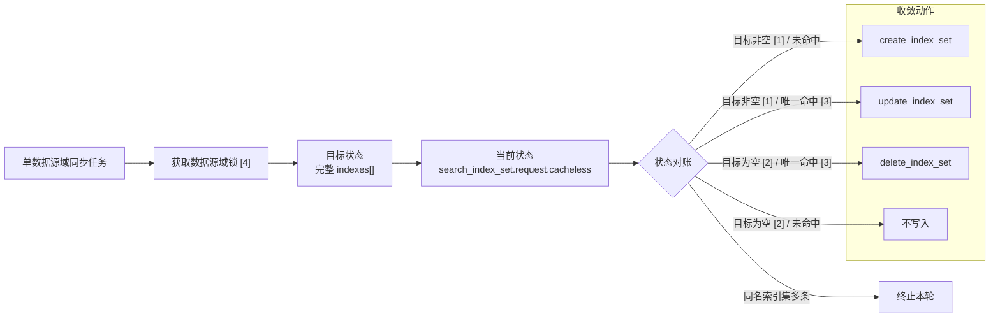

# APM Trace 跨应用检索方案

## 0x01 需求边界

当前阶段只负责为白名单 Trace 数据源域创建并同步 BKLog 索引集，不包含查询接入。现有应用级索引集保持不变。

Trace 数据源域退出白名单后停止同步，不清理已创建的索引集。

## 0x02 架构设计

### a. Trace 数据源域索引集

同一 Trace 数据源域的有效 APM 应用按完整快照聚合为一个 BKLog 索引集。应用生命周期任务实时触发同步，周期任务扫描白名单并修复遗漏。



### b. 索引集命名

索引集名称规则：

- 业务（`bk_biz_id > 0`）：`bkapm_cross_trace_{bk_biz_id}`
- 空间（`bk_biz_id < 0`）：`bkapm_cross_trace_space_{abs(bk_biz_id)}`

## 0x03 开发方案

### a. 白名单与索引集寻址

| 变更 | 改动范围 | 目标 |
| --- | --- | --- |
| `APM_CROSS_APP_TRACE_SEARCH_SCOPE_WHITE_LIST` | `bkmonitor/config/default.py` | 保存启用能力的数据源域 ID（`bk_biz_id`），默认空列表 |
| `TraceScopeIndexSetHandler.build_index_set_name(bk_biz_id)` | `bkmonitor/apm/core/handlers/trace_index_set.py` | 统一生成业务或空间索引集名称 *[1]* |
| `TraceScopeIndexSetHandler.get_index_set(bk_tenant_id, bk_biz_id)` | `bkmonitor/apm/core/handlers/trace_index_set.py` | 无缓存查询并精确匹配数据源域索引集，不保存 `index_set_id` 映射 *[2]* *[3]* |

- *[1] 名称生成规则统一收口，不允许调用方自行拼接。*
- *[2] 调用 `api.log_search.search_index_set.request.cacheless(bk_tenant_id=..., bk_biz_id=...)`，只读取 `index_set_id` 和 `index_set_name`。*
- *[3] 未命中返回 `None`，唯一命中返回索引集，匹配多条时抛出异常。*

### b. Celery 索引集同步

| 变更 | 改动范围 | 目标 |
| --- | --- | --- |
| `ApmCacheHandler.distributed_lock(lock_type, ttl=600, wait_time=0.1, **kwargs)` | `bkmonitor/apm/core/handlers/apm_cache_handler.py` | 支持配置抢锁等待时长，超时沿用 `LockError` |
| `TraceScopeIndexSetHandler.sync(bk_tenant_id, bk_biz_id)` | `bkmonitor/apm/core/handlers/trace_index_set.py` | 生成完整 `indexes[]`，实时查询后创建、更新或删除索引集 *[1]* |
| `sync_trace_scope_index_set(bk_biz_id)` | `bkmonitor/apm/task/tasks.py` | 解析租户，在 `(bk_tenant_id, bk_biz_id)` 锁内执行单数据源域同步 |
| `sync_trace_scope_index_sets()` | `bkmonitor/apm/task/tasks.py` | 扫描当前白名单并投递单数据源域任务 |
| `create_application_async` | `bkmonitor/apm/task/tasks.py` | 应用数据源创建成功后投递数据源域任务 |
| `delete_application_async` | `bkmonitor/apm/task/tasks.py` | 应用删除完成后投递数据源域任务 |
| `Config.beat_schedule` | `bkmonitor/config/celery/config.py` | 每 `10 min` 触发一次白名单扫描 |

- *[1] 任一成员信息不完整或同名索引集匹配多条时终止本轮，不写入部分快照。*

单数据源域索引集对账：



- *[1] 目标非空：本轮生成的 `indexes[]` 至少包含一个有效成员。*
- *[2] 目标为空：本轮生成的 `indexes[]` 不包含有效成员。*
- *[3] 唯一命中：无缓存查询后，固定名称精确匹配到一个索引集。*
- *[4] 获取数据源域锁：调用 `ApmCacheHandler.distributed_lock`。*

创建与更新共用参数：

```json
{
  "bk_tenant_id": "tenant-a",
  "bk_biz_id": 2,
  "index_set_name": "bkapm_cross_trace_2",
  "category_id": "application_check",
  "scenario_id": "es",
  "view_roles": [],
  "storage_cluster_id": 11,
  "time_field": "end_time",
  "time_field_type": "date",
  "time_field_unit": "microsecond",
  "indexes": [
    {
      "bk_biz_id": 2,
      "result_table_id": "2_bkapm_trace_demo_*",
      "storage_cluster_id": 11
    }
  ]
}
```

- `indexes[]`：按 `result_table_id` 去重，每个成员携带实际 `storage_cluster_id`。
- `storage_cluster_id`：索引集级参数取首个成员的值。
- 存储定位：共享结果表使用 `DEFAULT_TENANT_ID` 和 `GLOBAL_CONFIG_BK_BIZ_ID`，独占结果表使用应用租户和当前业务，同一结果表存在业务或集群冲突时终止同步。

## 0x04 验收与验证

| 测试对象 | 断言重点 |
| --- | --- |
| `TestTraceScopeIndexSetHandler` | 无缓存查询的 `0`、`1`、多条结果，完整成员去重和多集群参数 |
| `TestSyncTraceScopeIndexSet` | 同域并发串行、锁等待超时、创建、更新、空成员删除和失败不写入 |
| BKLog API 联调 | 同名索引集首次创建、重复更新、空成员删除和多集群成员写入 |

测试门禁：

```bash
pytest apm/tests/test_trace_scope_index_set.py
```

## 0x05 实施进展

| 时间 | 结论性进展 |
| --- | --- |
| `2026-07-31 00:00` | 复用并扩展 `distributed_lock`，按 Trace 数据源域串行执行索引集对账 |

## 0x06 参考

- [需求定义](./README.md)
- [APM 支持跨应用共享数据源](../2026-03-03-apm-shared-datasource/PLAN.md)

## 0x07 版本锚点

| 状态 | 分支 | 里程碑 | PR |
| --- | --- | --- | --- |
| 🔄 | `<branch_name>` | APM Trace 数据源域索引集同步 | 待创建 |
