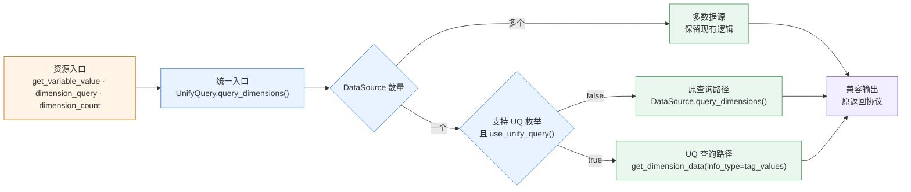

# 枚举值查询接入 UnifyQuery

> 项目代码中的正式名称是 `UnifyQuery`，下文简称 UQ。

## 0x01 调研结论

ES 枚举值的切换入口应收口到 `UnifyQuery.query_dimensions()`：Resource 只构造 DataSource 和 UQ，
单数据源先确认具备 UQ 枚举能力，再由现有 `use_unify_query()` 选择 UQ 或原 DataSource。

## 0x02 架构设计

### a. 目标调用链



### b. 分层职责

| 层次 | 负责 | 不负责 |
| --- | --- | --- |
| Resource | 构造 DataSource 和 UQ，调用统一入口 | 判断 ES 或 UQ |
| UnifyQuery | 识别单／多数据源，执行能力与灰度判断，监控查询 | 重建业务查询配置 |
| DataSource | 声明 UQ 枚举能力，提供 UQ 配置和原查询 | 决定灰度结果 |
| UQ | 执行 `tag_values` 枚举查询 | 适配 BKMonitor 的外部返回协议 |

## 0x03 开发方案

改动范围：

- `bkmonitor/packages/monitor_web/grafana/resources/time_series.py`
- `bkmonitor/bkmonitor/data_source/unify_query/query.py`
- `bkmonitor/bkmonitor/data_source/data_source/__init__.py`
- `bkmonitor/api/unify_query/default.py`

| 变更 | 目标 |
| --- | --- |
| **[Change]** `GetVariableValue.query_dimension()` | 构造单数据源 UQ，不再直接调用 DataSource。 |
| **[Change]** `UnifyQuery.query_dimensions()` | 多数据源保留原逻辑，单数据源按能力与灰度分流。 |
| **[Add]** `UnifyQuery._query_dimensions_using_unify_query()` | 组装参数，通过现有 `get_dimension_data` 查询枚举值。 |
| **[Add]** `UnifyQuery._query_dimensions_using_datasource()` | 收纳原单数据源调用，保持入参、返回值和异常不变。 |
| **[Add]** `DataSource.supports_unify_query_dimensions` | 限定允许切换 UQ 的目标 ES DataSource。 |
| **[Change]** `GetDimensionDataResource.RequestSerializer` | 增加可选 `query_string`，复用现有 `get_dimension_data` action。 |

### a. 改造点 1：Resource 入口收口

```text
data_source = data_source_class(...)

query = UnifyQuery(
    bk_biz_id=bk_biz_id,
    bk_tenant_id=data_source.bk_tenant_id,
    data_sources=[data_source],
    expression="",
)

records = query.query_dimensions(
    dimension_field=fields,
    limit=GRAPH_MAX_SLIMIT,
    start_time=start_time * 1000,
    end_time=end_time * 1000,
    interval=interval,
)

dimensions = self.assemble_dimensions(fields, records)

if is_global_k8s_event(params, bk_biz_id):
    dimensions = set(dimensions) | set(DEFAULT_K8S_EVENT_NAME)

return self.dimension_translate(bk_biz_id, params, list(dimensions))
```

- *[1] `GetVariableValue` 中的 `start_time`、`end_time` 是秒，沿用现有 `× 1000` 后交给 UQ。*
- *[2] UQ 只替换 `records` 的查询来源：`GetVariableValue` 仍先调用 `assemble_dimensions()` 组装多字段值，再调用 `dimension_translate()` 生成 `label/value` 返回结构。*
- *[3] 全局 K8s 事件的默认值补充位于组装和翻译之间，保持现有执行顺序。*
- *[4] 普通 `dimension_query` 已转发到 `get_variable_value`，`dimension_count` 已构造 UQ，两处均不新增路由。*

### b. 改造点 2：UnifyQuery 查询分流

```text
query_dimensions(dimension_field, limit, start_time, end_time, ...):
    if data_sources is empty:
        return []

    if more than one data_source:
        return existing_multi_source_result(...)

    if data_source.supports_unify_query_dimensions and use_unify_query():
        return _query_dimensions_using_unify_query(...)

    return _query_dimensions_using_datasource(...)
```

- *[1] `query_dimensions()` 的时间单位固定为毫秒，原 DataSource 分支原样透传，UQ 分支在发起请求时换算为秒。*
- *[2] `interval` 只传给原 DataSource，`tag_values` 不使用该参数，多数据源维持现有调用方式。*
- *[3] 两个单数据源分支复用 `query_log()` 的 `api` 标签、`DATASOURCE_QUERY_TIME` 和 `DATASOURCE_QUERY_COUNT`。*
- *[4] BKMonitor Client/API 错误继续上抛，UQ Handler 内部存储错误沿用现有部分成功语义。*

### c. 改造点 3：UQ 枚举请求

```text
_query_dimensions_using_unify_query(...):
    config = data_source.to_unify_query_config()[0]
    keys = config["dimensions"][:1]
    if not keys:
        return _query_dimensions_using_datasource(...)

    start_time, end_time = self.process_time_range(start_time, end_time)
    space_uid = kwargs["space_uid"] if "space_uid" in kwargs else self.space_uid

    params <- 按下文规约合并 config 与当前查询上下文
    params["keys"] = keys
    params["space_uid"] = space_uid
    params["bk_tenant_id"] = self.bk_tenant_id
    params["start_time"] = str(start_time // 1000)
    params["end_time"] = str(end_time // 1000)
    params["limit"] = limit

    response = api.unify_query.get_dimension_data(info_type="tag_values", **params)
    return response["values"].get(keys[0], [])
```

- *[1] 现有 `get_dimension_data` 已通过 `info_type="tag_values"` 调用 UQ 枚举接口，无需新增客户端方法。*
- *[2] `data_source`、`table_id`、`metric_name`、`conditions`、`query_string` 和首个 `key` 均取自 UQ 配置。*
- *[3] UQ 配置没有可用维度时保持原 DataSource 路径，该分支属于能力判断，不是查询失败回退。*
- *[4] `space_uid`、租户、时间范围和 `limit` 来自查询上下文，可选配置仅在有值时发送，空 `query_string` 传 `"*"`。*
- *[5] `bk_tenant_id` 只用于租户请求头；`query_string` 需加入现有客户端方法的请求序列化字段。*

### d. 改造点 4：DataSource 能力声明

```text
DataSource.supports_unify_query_dimensions = false
BaseBkMonitorLogDataSource.supports_unify_query_dimensions = true
```

- *[1] `supports_unify_query_dimensions` 是静态能力，基类默认关闭，仅目标 ES DataSource 开启。*
- *[2] `to_unify_query_config()` 已按 DataSource 规则生成 `dimensions`，UQ 分支不再增加字段转换接口。*
- *[3] InfluxDB 保持能力关闭，并继续由原 DataSource 返回 `{"values": ...}`。*
- *[4] 目标 ES 枚举采用 UQ 的非空字符串和部分成功语义，不反推旧字段类型，也不补查 ES。*

### e. 改造点 5：原查询保留

```text
_query_dimensions_using_datasource(...):
    return data_source.query_dimensions(
        dimension_field=dimension_field,
        limit=limit,
        start_time=start_time,
        end_time=end_time,
        *args,
        **kwargs,
    )
```

- *[1] 该方法只移动当前单数据源调用，不预处理时间、不改写字段，也不捕获或转换 DataSource 异常。*

## 0x04 参数透传缺口

`POST /query/ts/info/tag_values` 已存在，无需增加接口。日志过滤串需要补齐两层透传：

1. BKMonitor 的 `GetDimensionDataResource.RequestSerializer` 增加可选字符串字段 `query_string`。
2. UQ 的 `http.Params` 接收 `query_string`，并由 `infoParamsToQueryRef()` 写入 `structured.Query.QueryString`。

## 0x05 验收与验证

| 场景 | 通过标准 |
| --- | --- |
| 入口收口 | `get_variable_value`、普通 `dimension_query` 和 `dimension_count` 进入同一 UQ 方法 |
| ES 分支 | `use_unify_query() == false` 时，原 DataSource 的参数、结果、异常完全等价 |
| UQ 分支 | 能力声明和 `use_unify_query()` 同时命中时，通过 `get_dimension_data(info_type="tag_values")` 查询 |
| 参数传递 | 租户、数据源、表、字段、过滤条件、查询串、时间和 `limit` 与 DataSource 配置一致 |
| 字段来源 | `keys` 取 UQ 配置中的首个 `dimensions`，无可用字段时保持原 DataSource 路径 |
| 多数据源 | 入参、表达式、提取字段和异常与改造前一致 |
| 非目标分支 | BKData、InfluxDB、CMDB、K8S、采集配置、服务实例和 `get_dimension_data` 调用不变 |
| 调用方兼容 | `get_variable_value`、`dimension_count`、QueryHelper 和场景视图返回结构不变 |

测试入口：

- `test_unify_query.py`：单数据源 UQ／原 DataSource 分支、多数据源和异常指标。
- `test_get_variable_value.py`：Resource 入口、字段映射、结果组装和非 DataSource 分支。
- `test_dimension_unify_query.py`：普通枚举值、`dimension_count` 和空结果。
- UQ Handler 测试：`query_string` 透传和缺省参数兼容。

## 0x06 实施进展

| 时间 | 结论性进展 |
| --- | --- |
| `2026-07-31 00:00` | ES 枚举值查询收口到 `UnifyQuery.query_dimensions()`，单数据源按能力与灰度分流，目标分支复用 `get_dimension_data`。 |

## 0x07 参考

关键代码：

- [<源码> GetVariableValue.query_dimension()](https://github.com/TencentBlueKing/bk-monitor/blob/8a88c2e4d3809f19491a88f5fb8ab46f31208dcb/bkmonitor/packages/monitor_web/grafana/resources/time_series.py#L673-L802)
- [<源码> DimensionUnifyQuery.query_dimensions()](https://github.com/TencentBlueKing/bk-monitor/blob/8a88c2e4d3809f19491a88f5fb8ab46f31208dcb/bkmonitor/packages/monitor_web/grafana/resources/unify_query.py#L1614-L1774)
- [<源码> UnifyQuery.use_unify_query()](https://github.com/TencentBlueKing/bk-monitor/blob/8a88c2e4d3809f19491a88f5fb8ab46f31208dcb/bkmonitor/bkmonitor/data_source/unify_query/query.py#L281-L331)
- [<源码> UnifyQuery.query_dimensions()](https://github.com/TencentBlueKing/bk-monitor/blob/8a88c2e4d3809f19491a88f5fb8ab46f31208dcb/bkmonitor/bkmonitor/data_source/unify_query/query.py#L784-L802)
- [<源码> DataSource.to_unify_query_config()](https://github.com/TencentBlueKing/bk-monitor/blob/8a88c2e4d3809f19491a88f5fb8ab46f31208dcb/bkmonitor/bkmonitor/data_source/data_source/__init__.py#L1034-L1118)
- [<源码> BaseBkMonitorLogDataSource](https://github.com/TencentBlueKing/bk-monitor/blob/8a88c2e4d3809f19491a88f5fb8ab46f31208dcb/bkmonitor/bkmonitor/data_source/data_source/__init__.py#L1514-L1691)
- [<源码> GetDimensionDataResource](https://github.com/TencentBlueKing/bk-monitor/blob/8a88c2e4d3809f19491a88f5fb8ab46f31208dcb/bkmonitor/api/unify_query/default.py#L363-L386)
- [<源码> UQ tag_values Handler](https://github.com/TencentBlueKing/bkmonitor-datalink/blob/37323a399a714f08bb9c3e3d364bf5ecd536be47/pkg/unify-query/service/http/api.go#L207-L292)
- [<源码> UQ infoParamsToQueryRef()](https://github.com/TencentBlueKing/bkmonitor-datalink/blob/37323a399a714f08bb9c3e3d364bf5ecd536be47/pkg/unify-query/service/http/api.go#L704-L735)

关联方案：

- [日志数据源切换 unify-query](../2026-02-10-log-ds-to-unify-query/README.md)
- [日志 UnifyQuery 环境变量黑名单与 query_string 增强](../2026-03-05-log-uq-env-whitelist-and-query-string/README.md)
- [UnifyQuery 使用方式](../../snippets/unify-query.md)

## 0x08 版本锚点

| 状态 | 分支 | 里程碑 | PR |
| --- | --- | --- | --- |
| 🔄 | `<branch_name>` | 里程碑 1：枚举值查询接入 UnifyQuery | 待创建 |
