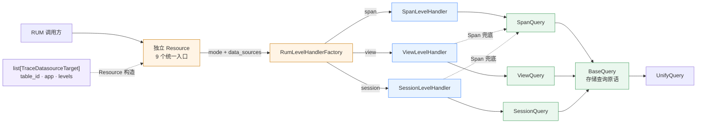
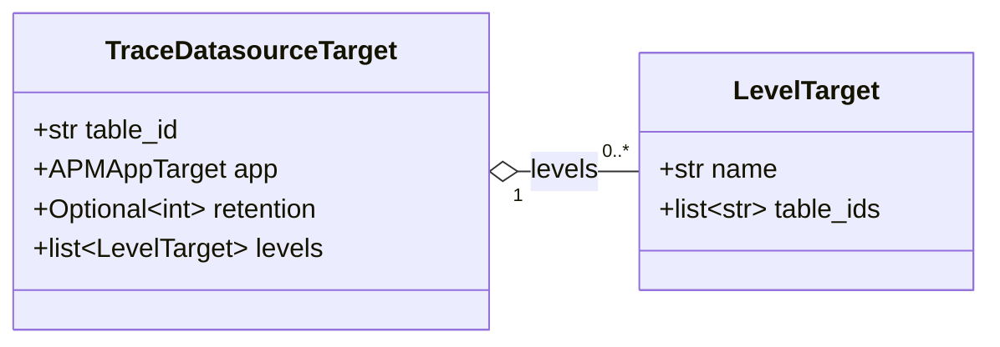
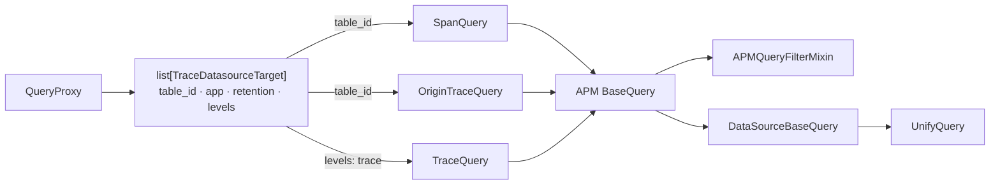
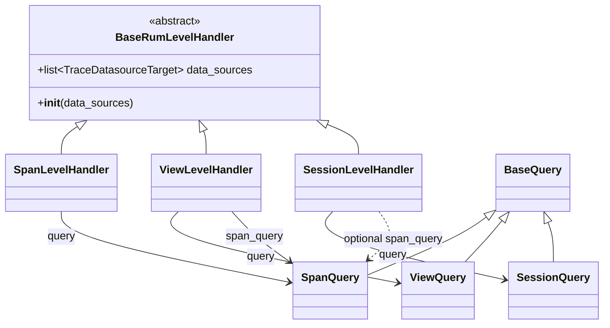

# RUM 分层统一查询 —— 实施方案

> 基于 [README.md](./README.md) 制定。

## 0x01 方案结论

### a. 目标调用链

RUM 只保留一组查询接口：

- `mode` 选择 Level。
- Factory、Level、Query 共用同一份 `list[TraceDatasourceTarget]`。

```text
Resource
  └── RumLevelHandlerFactory.create(mode, data_sources)
        └── Span / View / Session LevelHandler(data_sources)
              ├── self.query → Span / View / Session Query → BaseQuery
              └── self.span_query → SpanQuery → BaseQuery（可选兜底）
```

| 决策点 | 结论 |
| --- | --- |
| HTTP 入口 | Resource 自行实现 `perform_request()`，不设公共基类 |
| Level 分派 | `RumLevelHandlerFactory` 只维护 `mode → LevelHandler` 映射 |
| 初始化参数 | Factory、Level、Query 均接收 `list[TraceDatasourceTarget]` |
| 结果表承载 | `table_id` 存原始表，`levels` 存 RUM 层级表和 APM 预计算表 |
| 查询职责 | Query 提供原子查询，Level 组合一个或多个 Query |
| APM 适配 | `QueryProxy` 统一构造 Target，3 类 Query 复用通用查询原语 |

### b. 方案边界

本方案确定类关系、代码位置、Level 方法、Resource 路由和调用方式。以下内容不在范围内：

- 请求字段、响应字段和错误码。
- View、Session 的预计算链路与数据生产方式。
- View、Session 查询原子的具体实现。
- 各 Level 页面配置和查询参数的业务细节。

## 0x02 架构设计

### a. 总体结构



| 层 | 负责 | 不负责 |
| --- | --- | --- |
| Resource | 权限、参数校验、构造 `data_sources`、调用 Level | 选择具体 Level 类或执行存储查询 |
| Factory | 校验 `mode`、构造对应 Level | 解析结果表或实现接口能力 |
| Level | 组合一个或多个 Query，组装接口能力 | 处理 HTTP 或直接访问 UnifyQuery |
| Query | 从 Target 选择层级表、构造并执行存储查询 | 页面配置和 HTTP 返回组装 |

### b. 数据源目标

代码位置：`bkmonitor/data_source/utils/apm.py`。

```python
@dataclass(frozen=True)
class LevelTarget:
    name: str
    table_ids: list[str]


@dataclass(frozen=True)
class TraceDatasourceTarget:
    table_id: str
    app: APMAppTarget
    retention: int | None = None
    levels: list[LevelTarget] = field(default_factory=list)
```



| 查询层级 | 结果表来源 |
| --- | --- |
| Span | `TraceDatasourceTarget.table_id` |
| View | `TraceDatasourceTarget.levels` 中 `name = "view"` 的 `table_ids` |
| Session | `TraceDatasourceTarget.levels` 中 `name = "session"` 的 `table_ids` |
| APM Trace 预计算 | `TraceDatasourceTarget.levels` 中 `name = "trace"` 的 `table_ids` |

目标模型遵循以下约束：

- `table_id` 仍表示原始表。
- `retention` 和 `levels` 均提供默认值，兼容只使用查询隔离能力的既有调用方。
- APM Query 要求 Target 提供 `retention`，并由 `QueryProxy` 从 Trace 数据源统一填充。
- `LevelTarget.name` 是通用结果表标识，不绑定 RUM 的 `mode`。
- `levels` 也可承接 `trace` 等其他预计算结果表。

### c. APM 查询适配

APM 查询差异由 `TraceDatasourceTarget` 承载，并在表选择处收敛：Span 与原始 Trace 查询读取 `table_id`，预计算 Trace 查询读取 `trace` 层级表。



`APM BaseQuery` 负责 Target 解析、保留时间范围、业务 Scope 和 APM 过滤适配。通用 `DataSourceBaseQuery` 负责 TopK、聚合、候选值和图表配置等存储查询原语。

`query_field_topk()`、`query_field_aggregated_value()` 和 `query_option_values()` 统一由 `APM BaseQuery` 暴露。列表字段取决于具体表结构，`SpanQuery`、`TraceQuery` 和 `OriginTraceQuery` 各自构造 Query 列表，不增加只转发排序与字段选择的中间抽象。

三类 Query 的列表查询直接复用 `DataSourceBaseQuery._query_list()` 并返回列表。`QueryProxy` 负责包装 `TraceInfoList`，兼容原协议并固定返回 `total=0`；`query_simple_info()` 遵循相同边界。

APM 适配层不保留 `time_range_queryset`、`log_q`、`_get_data_page`、`build_query_q`、`get_queries()` 和单 Query 属性 `q`。查询配置统一由 `build_queries()` 构造成 `list[QueryConfigBuilder]`，再交给 `_add_query()` 或 `_query_list()` 执行。

## 0x03 开发方案

### a. 代码落点

```text
bkmonitor/data_source/utils/
├── query.py                                  # [Keep] BaseQuery
└── apm.py                                    # [Change] LevelTarget、TraceDatasourceTarget.retention / levels

apm/core/handlers/query/
├── base.py                                   # [Change] 继承 APMQueryFilterMixin、DataSourceBaseQuery
├── proxy.py                                  # [Change] 统一构造 TraceDatasourceTarget
├── span_query.py                             # [Change] 使用原始表
├── origin_trace_query.py                     # [Change] 使用原始表
└── trace_query.py                            # [Change] 使用 trace 层级预计算表

apm/resources.py                              # [Change] 候选值固定查询 Trace

packages/rum_web/
├── constants.py                              # [Change] RumQueryMode
├── query/
│   ├── resources.py                          # [Add] 9 个独立 Resource
│   ├── views.py                              # [Add] SearchViewSet
│   └── urls.py                               # [Add] ResourceRouter，生成 search/
├── urls.py                                   # [Change] 在根路径挂载 rum_web.query.urls
└── handlers/
    ├── query/
    │   ├── span.py                           # [Change] SpanQuery
    │   ├── view.py                           # [Reserved] ViewQuery
    │   └── session.py                        # [Reserved] SessionQuery
    └── level/
        ├── base.py                           # [Add] BaseRumLevelHandler
        ├── factory.py                        # [Add] RumLevelHandlerFactory
        ├── span.py                           # [Add] SpanLevelHandler
        ├── view.py                           # [Reserved] ViewLevelHandler
        └── session.py                        # [Reserved] SessionLevelHandler
```

View、Session 文件只固定类名与扩展位置，其查询实现不属于本方案。

### b. `mode` 与 Factory

Factory 只接受 `span`、`view`、`session`。首期只注册 `span`。View、Session 就绪后再注册。

```python
class RumQueryMode:
    SPAN = "span"
    VIEW = "view"
    SESSION = "session"


class RumLevelHandlerFactory:
    HANDLERS = {
        RumQueryMode.SPAN: SpanLevelHandler,
    }

    @classmethod
    def create(
        cls,
        mode: str,
        data_sources: list[TraceDatasourceTarget],
    ) -> BaseRumLevelHandler:
        if mode not in cls.HANDLERS:
            raise UnsupportedRumQueryMode(mode)
        return cls.HANDLERS[mode](data_sources)
```

Factory 只负责模式校验和 Level 实例化。

### c. 基础查询层

| 变更点 | 代码位置 |
| --- | --- |
| **[Keep]** `BaseQuery` | `bkmonitor/data_source/utils/query.py` |
| **[Change]** `SpanQuery` | `packages/rum_web/handlers/query/span.py` |
| **[Reserved]** `ViewQuery` | `packages/rum_web/handlers/query/view.py` |
| **[Reserved]** `SessionQuery` | `packages/rum_web/handlers/query/session.py` |
| **[Change]** APM `BaseQuery` | `apm/core/handlers/query/base.py` |
| **[Change]** `TraceQuery` / `OriginTraceQuery` / `SpanQuery` | `apm/core/handlers/query/` |

`bkmonitor.data_source.utils.query.BaseQuery` 是存储查询原语的公共抽象。RUM Query 直接继承；APM Query 通过 `BaseQuery(APMQueryFilterMixin, DataSourceBaseQuery)` 适配 APM 过滤、保留时间和 Scope。

APM 的 3 个 Query 均接收 `data_sources: list[TraceDatasourceTarget]`。`QueryProxy` 统一填充原始表、应用、`retention` 和可选的 `trace` 层级表，不再传递 `DEFAULT_DATASOURCE_CONFIGS` 或覆盖函数。

基础查询层提供以下原子能力：

```text
query_list
query_total
query_field_topk
query_option_values
query_graph_config
query_field_aggregated_value
query_detail
query_fields
```

`query_fields` 的查询目标携带 `table_id` 和 `space_uid`，由具体 Query 按表来源构造：

```text
原始表  → (target.table_id, bk_biz_id_to_space_uid(target.app.bk_biz_id))
层级表  → (level_table_id, None)
```

`space_uid=None` 使用 UnifyQuery 特权模式，由请求层写入 `X-Bk-Scope-Skip-Space`。

APM 候选值固定查询 Trace：Span 使用原始 Trace 表，Trace 使用预计算层级表。`QueryOptionValuesSerializer` 不再暴露 `datasource_type`，内部删除指标数据源分支。

### d. Level 与 Query 交互

`BaseRumLevelHandler.__init__()` 只保存 `data_sources`，不创建 Query。

具体 Level 按业务需要组合 Query。



```python
from abc import ABC, abstractmethod
from typing import Any

from bkmonitor.data_source.utils import types


class BaseRumLevelHandler(ABC):
    def __init__(self, data_sources: list[TraceDatasourceTarget]):
        self.data_sources = data_sources

    @abstractmethod
    def view_config(
        self,
        extra_config: dict[str, Any] | None = None,
    ) -> dict[str, Any]:
        ...

    @abstractmethod
    def generate_query_string(
        self,
        filters: list[types.Filter],
        extra_config: dict[str, Any] | None = None,
    ) -> str:
        ...

    @abstractmethod
    def field_topk(
        self,
        start_time: int,
        end_time: int,
        field: str,
        limit: int = 5,
        filters: list[types.Filter] | None = None,
        query_string: str = "",
        extra_config: dict[str, Any] | None = None,
    ) -> list[dict[str, Any]]:
        ...

    @abstractmethod
    def field_statistics_info(
        self,
        start_time: int,
        end_time: int,
        field: dict[str, Any],
        filters: list[types.Filter] | None = None,
        query_string: str = "",
        extra_config: dict[str, Any] | None = None,
    ) -> dict[str, Any]:
        ...

    @abstractmethod
    def field_statistics_graph(
        self,
        start_time: int,
        end_time: int,
        field: dict[str, Any],
        filters: list[types.Filter] | None = None,
        query_string: str = "",
        extra_config: dict[str, Any] | None = None,
    ) -> dict[str, Any]:
        ...

    @abstractmethod
    def download_topk(
        self,
        start_time: int,
        end_time: int,
        field: str,
        limit: int = 5,
        filters: list[types.Filter] | None = None,
        query_string: str = "",
        extra_config: dict[str, Any] | None = None,
    ) -> bytes:
        ...

    @abstractmethod
    def get_fields_option_values(
        self,
        start_time: int,
        end_time: int,
        fields: list[str],
        limit: int = 10,
        filters: list[types.Filter] | None = None,
        query_string: str = "",
        extra_config: dict[str, Any] | None = None,
    ) -> dict[str, list[str]]:
        ...

    @abstractmethod
    def list_records(
        self,
        start_time: int,
        end_time: int,
        offset: int = 0,
        limit: int = 10,
        filters: list[types.Filter] | None = None,
        query_string: str = "",
        sort: list[str] | None = None,
        extra_config: dict[str, Any] | None = None,
    ) -> list[dict[str, Any]]:
        ...

    @abstractmethod
    def record_detail(
        self,
        record_id: str,
        extra_config: dict[str, Any] | None = None,
    ) -> dict[str, Any]:
        ...


class ViewLevelHandler(BaseRumLevelHandler):
    def __init__(self, data_sources: list[TraceDatasourceTarget]):
        super().__init__(data_sources)
        self.query = ViewQuery(data_sources)
        self.span_query = SpanQuery(data_sources)
```

`extra_config` 的边界：

- 具体 Level 按白名单解析。
- 不得覆盖显式参数或 `data_sources`。
- 不得整包传给 Query。

### e. Resource 与 Level 交互

以 `RumFieldTopKResource` 为例：

```python
class RumFieldTopKResource(Resource):
    RequestSerializer = RumFieldTopKRequestSerializer

    def perform_request(self, data):
        mode = data.pop("mode")
        application = self.get_authorized_application(data)
        data_sources = [
            TraceDatasourceTarget.build(
                bk_biz_id=application.bk_biz_id,
                app_name=application.app_name,
                table_id=application.span_result_table_id,
            )
        ]

        handler = RumLevelHandlerFactory.create(mode, data_sources)
        return handler.field_topk(
            start_time=data["start_time"],
            end_time=data["end_time"],
            field=data["field"],
            limit=data["limit"],
            filters=data["filters"],
            query_string=data["query_string"],
            extra_config=data.get("extra_config"),
        )
```

- `data_sources` 只从授权后的 `Application` 构造，客户端不能指定结果表。
- View、Session 接入后，也在此处补入 `levels`。
- Resource 只校验 `extra_config` 是对象；配置项由具体 Level 校验。

### f. Resource 接口

路由命名：

```text
/rum/                       # 项目根路由
  └── search/                # SearchViewSet
      └── {API}/              # Resource action
```

`query` 是内部模块名；`search` 是对外路径。`rum_web.urls` 在根路径挂载 `rum_web.query.urls`。

| URL | Resource | Level 方法 |
| --- | --- | --- |
| `GET` /rum/search/view_config/ | `RumViewConfigResource` | `view_config` |
| `POST` /rum/search/generate_query_string/ | `RumGenerateQueryStringResource` | `generate_query_string` |
| `POST` /rum/search/field_topk/ | `RumFieldTopKResource` | `field_topk` |
| `POST` /rum/search/field_statistics_info/ | `RumFieldStatisticsInfoResource` | `field_statistics_info` |
| `POST` /rum/search/field_statistics_graph/ | `RumFieldStatisticsGraphResource` | `field_statistics_graph` |
| `POST` /rum/search/download_topk/ | `RumDownloadTopKResource` | `download_topk` |
| `POST` /rum/search/get_fields_option_values/ | `RumFieldsOptionValuesResource` | `get_fields_option_values` |
| `POST` /rum/search/list_records/ | `RumRecordsResource` | `list_records` |
| `POST` /rum/search/record_detail/ | `RumRecordDetailResource` | `record_detail` |

## 0x04 验收与验证

新增测试位于 `packages/rum_web/tests/query/`：

| 测试 | 核心断言 |
| --- | --- |
| `test_datasource_target.py` | [a] `levels` 默认空列表<br />[b] 现有 `TraceDatasourceTarget.build()` 行为不变<br />[c] 可携带多个层级结果表 |
| `test_level_factory.py` | [a] 合法 `mode` 返回对应 Level<br />[b] 未注册模式明确失败<br />[c] `data_sources` 原样传入 Level |
| `test_query.py` | [a] 已实现 Query 复用 `BaseQuery`<br />[b] 接收 `list[TraceDatasourceTarget]`<br />[c] 具备 8 项原子能力 |
| `test_level_handler.py` | [a] 基类只保存 `data_sources`<br />[b] 具体 Level 可组合多个 Query<br />[c] TopK 方法只接收单个字段<br />[d] 9 项公共方法声明参数与返回类型<br />[e] 未知配置被拒绝，且不能覆盖公共参数或数据源 |
| `test_query_resources.py` | [a] 9 个 URL、HTTP 方法、Resource 和 Level 方法一一对应<br />[b] Resource 不依赖公共基类<br />[c] `extra_config` 与公共参数独立传入 Level |
| `apm/tests/test_unified_query_base.py` | [a] APM 继承通用基类<br />[b] 3 类 Query 统一接收 Target 列表<br />[c] Proxy 统一构造原始表与预计算层级<br />[d] 候选值固定使用 Trace<br />[e] 列表查询复用 `_query_list()`，Proxy 固定补 `total=0`<br />[f] 查询配置保持列表形态，多 Target 不丢表 |

测试门禁：

```bash
pytest packages/rum_web/tests/query -q
pytest apm/tests/test_unified_query_base.py apm/tests/test_trace_query_es_batch.py -q
```

静态依赖同时确认：

- `packages/rum_web/handlers/query/` 不导入 DRF、Resource 或页面模块。
- Factory 不读取 `TraceDatasourceTarget.table_id` 或 `levels`。
- 客户端请求无法覆盖 `TraceDatasourceTarget` 中的结果表。
- APM Query 模块不存在 `DEFAULT_DATASOURCE_CONFIGS`、`overwrite_datasource_configs` 或 `METRIC_DATASOURCE`。
- `TraceQuery`、`OriginTraceQuery` 和 `SpanQuery` 的构造签名统一为 `data_sources`。
- APM 适配层不存在 `time_range_queryset`、`log_q`、`_get_data_page`、`build_query_q` 或单 Query 属性 `q`。

## 0x05 实施进展

| 时间 | 结论性进展 |
| --- | --- |
| `2026-08-10 22:00` | 统一 APM 查询继承链与 Target 协议：分析查询下沉到 APM 基类，列表查询由具体 Query 直接构造，所有查询配置保持 `list[QueryConfigBuilder]` 形态 |
| `2026-08-09 09:00` | 统一 Span 接口命名、里程碑和 `/rum/search/{API}/` 路由 |
| `2026-08-08 16:00` | 统一 Level 方法的参数、返回类型、命名和扩展边界 |
| `2026-08-07 19:00` | 完成分层设计：Level 以 `data_sources` 初始化，并可组合主查询与 Span 兜底查询 |

## 0x06 参考

- [<源码> bk-monitor/bkmonitor/data_source/utils/apm.py](https://github.com/TencentBlueKing/bk-monitor/blob/2067bb6ca8df7f7485c4583010919f21d80d29e8/bkmonitor/bkmonitor/data_source/utils/apm.py)
- [<源码> bk-monitor/bkmonitor/data_source/utils/query.py](https://github.com/TencentBlueKing/bk-monitor/blob/2067bb6ca8df7f7485c4583010919f21d80d29e8/bkmonitor/bkmonitor/data_source/utils/query.py)
- [<源码> bk-monitor/apm/core/handlers/query/base.py](https://github.com/TencentBlueKing/bk-monitor/blob/2067bb6ca8df7f7485c4583010919f21d80d29e8/bkmonitor/apm/core/handlers/query/base.py)
- [<源码> bk-monitor/apm/core/handlers/query/proxy.py](https://github.com/TencentBlueKing/bk-monitor/blob/2067bb6ca8df7f7485c4583010919f21d80d29e8/bkmonitor/apm/core/handlers/query/proxy.py)
- [<源码> bk-monitor/packages/rum_web/handlers/query/span.py](https://github.com/TencentBlueKing/bk-monitor/blob/2067bb6ca8df7f7485c4583010919f21d80d29e8/bkmonitor/packages/rum_web/handlers/query/span.py)
- [<源码> bk-monitor/packages/apm_web/trace/views.py](https://github.com/TencentBlueKing/bk-monitor/blob/2067bb6ca8df7f7485c4583010919f21d80d29e8/bkmonitor/packages/apm_web/trace/views.py)
- [RUM 数据协议](../../articles/2026-07-12-rum-span-data-protocol/README.md)

## 0x07 版本锚点

| 状态 | 分支 | 里程碑 | PR |
| --- | --- | --- | --- |
| ✅ | `feat/rum_base_search_module/#1010158081136933145` | 里程碑 1：提供 RUM 基础检索模块 | [TencentBlueKing/bk-monitor #11838](https://github.com/TencentBlueKing/bk-monitor/pull/11838) |
| 🔄 | `feat/rum_base_query_fields/#1010158081136920078` | 里程碑 2：提供 RUM 字段元数据查询（`query_fields`） | [TencentBlueKing/bk-monitor #11840](https://github.com/TencentBlueKing/bk-monitor/pull/11840) |
| 🔄 | `<branch_name>` | 里程碑 3：提供 RUM Span 列表类接口（`list_records`、`view_config`、`get_fields_option_values`、`generate_query_string`） *[1]* | 待创建 |
| 🔄 | `<branch_name>` | 里程碑 4：提供 RUM Span 分析类接口（`field_topk`、`field_statistics_info`、`field_statistics_graph`、`download_topk`） *[1]* | 待创建 |
| 🔄 | `<branch_name>` | 里程碑 5：提供 RUM Span 详情类接口（`record_detail`、`generate_query_string`） *[1]* | 待创建 |
| 🔄 | `master` | 里程碑 6：统一 APM 查询基类和 `TraceDatasourceTarget` 协议 | 待创建 |

- *[1] 里程碑 3～5 实施期间，随接口落地逐步补充 `rum_web/docs/api/search.md`。*
